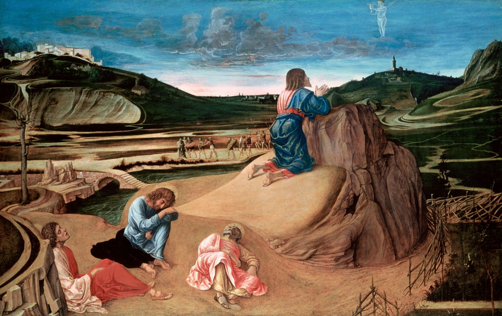
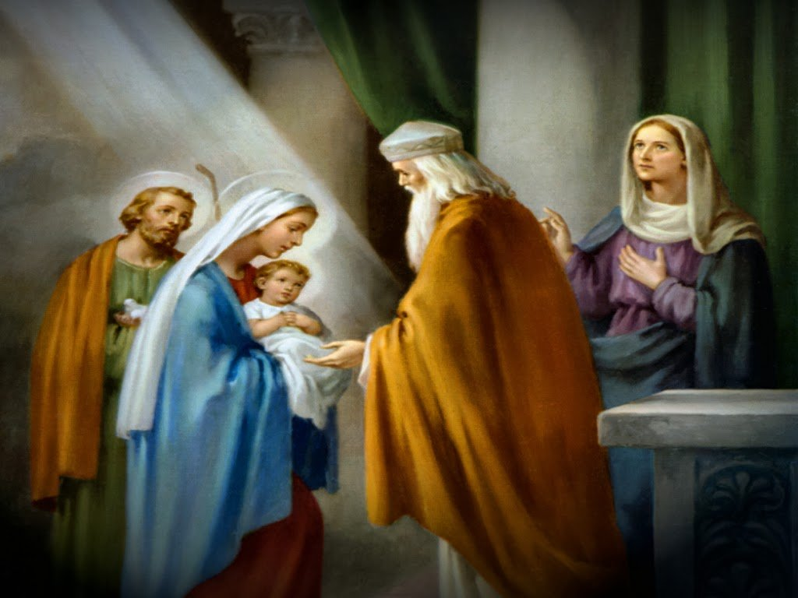
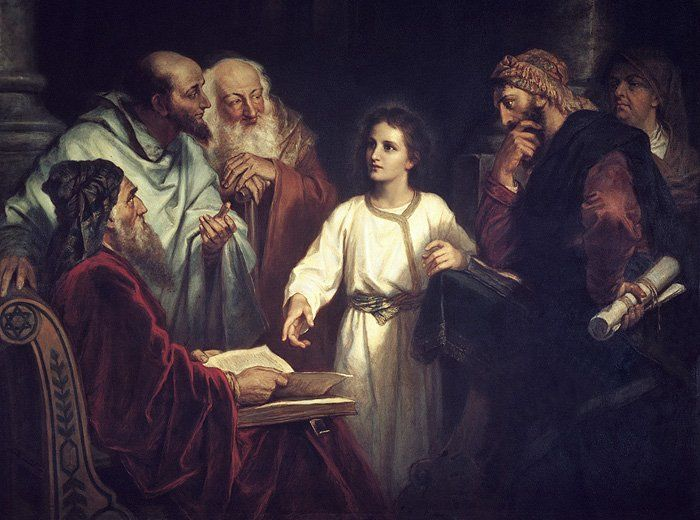
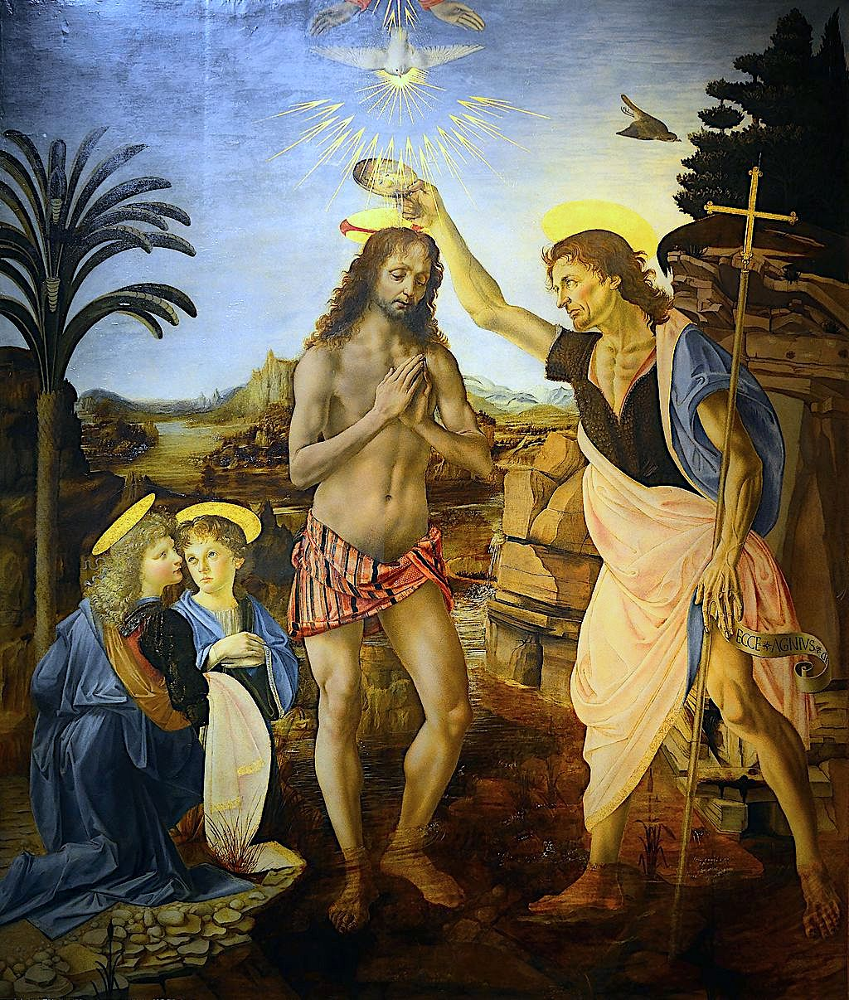

<!-- START doctoc generated TOC please keep comment here to allow auto update -->

<!-- DON'T EDIT THIS SECTION, INSTEAD RE-RUN doctoc TO UPDATE -->

**Table of Contents** _generated with [DocToc](https://github.com/ktechhub/doctoc)_

<!---toc start-->

- [August 2025](#august-2025)
  - [August 01, 2025](#august-01-2025)
    - [Advocate, Queen, and Mother](#advocate-queen-and-mother)
    - [AI-Generated Summary: The Poverty of Unseeing Prayer](#ai-generated-summary-the-poverty-of-unseeing-prayer)
    - [AI-Generated Image: A barren landscape of hollow words, where prayer and art remain unseen, like a bird too afraid to fly](#ai-generated-image-a-barren-landscape-of-hollow-words-where-prayer-and-art-remain-unseen-like-a-bird-too-afraid-to-fly)
  - [August 02, 2025](#august-02-2025)
    - [Trusting the Father](#trusting-the-father)
    - [AI-Generated Summary: The Unseen Art of Prayer](#ai-generated-summary-the-unseen-art-of-prayer)
    - [AI-Generated Image: The quiet labor of the soul, where prayers shape an unseen masterpiece](#ai-generated-image-the-quiet-labor-of-the-soul-where-prayers-shape-an-unseen-masterpiece)
  - [August 03, 2025](#august-03-2025)
    - [Here With Jesus](#here-with-jesus)
    - [AI-Generated Summary: The Weight of Glory in Art and Prayer](#ai-generated-summary-the-weight-of-glory-in-art-and-prayer)
    - [Caravaggio's dramatic 'The Crowning with Thorns' portrays Christ's torment with intense realism and chiaroscuro on canvas (Stock Image)](#caravaggios-dramatic-the-crowning-with-thorns-portrays-christs-torment-with-intense-realism-and-chiaroscuro-on-canvas-stock-image)
  - [August 04, 2025](#august-04-2025)
    - [Overshadowed by the Spirit](#overshadowed-by-the-spirit)
    - [AI-Generated Summary: The Silent Language of Divine Love](#ai-generated-summary-the-silent-language-of-divine-love)
    - [AI-Generated Image: A celestial embrace of fire and breath, where divine love pierces the veil of the unseen](#ai-generated-image-a-celestial-embrace-of-fire-and-breath-where-divine-love-pierces-the-veil-of-the-unseen)
    - [Pietro Gagliardi's Neoclassical fresco captures Christ's sacrificial love, where divine sorrow meets radiant mercy at the Cross (Stock Image)](#pietro-gagliardis-neoclassical-fresco-captures-christs-sacrificial-love-where-divine-sorrow-meets-radiant-mercy-at-the-cross-stock-image)
  - [August 05, 2025](#august-05-2025)
    - [Resting With the Trinity](#resting-with-the-trinity)
    - [AI-Generated Summary: The Soul's Homage to the Triune God](#ai-generated-summary-the-souls-homage-to-the-triune-god)
    - [AI-Generated Image: A celestial embrace of divine light and sacred geometry](#ai-generated-image-a-celestial-embrace-of-divine-light-and-sacred-geometry)
    - [St. Elizabeth of the Trinity](#st-elizabeth-of-the-trinity)
  - [August 06, 2025](#august-06-2025)
    - [Walking With Mary](#walking-with-mary)
    - [AI-Generated Summary: The Quiet Companionship of Mary](#ai-generated-summary-the-quiet-companionship-of-mary)
    - [AI-Generated Image: A sacred companionship painted in abstract devotion](#ai-generated-image-a-sacred-companionship-painted-in-abstract-devotion)
  - [August 07, 2025](#august-07-2025)
    - [The Gift of Prayer](#the-gift-of-prayer)
    - [AI-Generated Summary: The Humble Heart of Prayer](#ai-generated-summary-the-humble-heart-of-prayer)
    - [AI-Generated Image: A soul's quiet prayer in abstract devotion](#ai-generated-image-a-souls-quiet-prayer-in-abstract-devotion)
    - [Rembrandt’s portrayal of Mary visiting her cousin Elizabeth, both expecting miraculous children](#rembrandts-portrayal-of-mary-visiting-her-cousin-elizabeth-both-expecting-miraculous-children)
  - [August 08, 2025](#august-08-2025)
    - [Lingering in the Words](#lingering-in-the-words)
    - [AI-Generated Summary: The Silent Song of the Nativity](#ai-generated-summary-the-silent-song-of-the-nativity)
    - [Pellegrini’s depiction of the birth of Jesus in a humble stable (Stock Image)](#pellegrinis-depiction-of-the-birth-of-jesus-in-a-humble-stable-stock-image)
  - [August 09, 2025](#august-09-2025)
    - [Words of an Angel](#words-of-an-angel)
    - [AI-Generated Summary: The Discipline of Devotion and the Weight of Mystery](#ai-generated-summary-the-discipline-of-devotion-and-the-weight-of-mystery)
    - [Mosaic depicting the young Jesus found teaching in the Temple after being lost (Stock Image)](#mosaic-depicting-the-young-jesus-found-teaching-in-the-temple-after-being-lost-stock-image)
    - [John baptizes Jesus as the heavens open and the Spirit descends (Stock Image)](#john-baptizes-jesus-as-the-heavens-open-and-the-spirit-descends-stock-image)
  - [August 10, 2025](#august-10-2025)
    - [Elizabeth's Greeting](#elizabeths-greeting)
    - [AI-Generated Summary: The Unchanging Refuge of Prayer](#ai-generated-summary-the-unchanging-refuge-of-prayer)
  - [August 11, 2025](#august-11-2025)
    - [Now and at Death](#now-and-at-death)
    - [AI-Generated Summary: The Light of the Mount and the Bread of Life](#ai-generated-summary-the-light-of-the-mount-and-the-bread-of-life)
    - [Jesus radiates divine light before his disciples atop a mountain (Stock Image)](#jesus-radiates-divine-light-before-his-disciples-atop-a-mountain-stock-image)
    - [Jesus institutes the Eucharist during the Passover meal (Stock Image)](#jesus-institutes-the-eucharist-during-the-passover-meal-stock-image)
  - [August 12, 2025](#august-12-2025)
    - [Intentions to the Father](#intentions-to-the-father)
    - [AI-Generated Summary: The Art of Prayerful Intentions](#ai-generated-summary-the-art-of-prayerful-intentions)
    - [Bellini's Agony in the Garden (late 1400s), oil on panel in London’s gallery, depicts prayer and sorrow in Gethsemane (Stock Image)](#bellinis-agony-in-the-garden-late-1400s-oil-on-panel-in-londons-gallery-depicts-prayer-and-sorrow-in-gethsemane-stock-image)
  - [August 13, 2025](#august-13-2025)
    - [Bring It to Jesus](#bring-it-to-jesus)
    - [AI-Generated Summary: The Weight of Thorns and Light](#ai-generated-summary-the-weight-of-thorns-and-light)
    - [Caravaggio's The Crowning with Thorns at Kunsthistorisches Museum depicts Christ's humiliation with chiaroscuro (Stock Image)](#caravaggios-the-crowning-with-thorns-at-kunsthistorisches-museum-depicts-christs-humiliation-with-chiaroscuro-stock-image)
  - [August 14, 2025](#august-14-2025)
    - [Entrusted to the Spirit](#entrusted-to-the-spirit)
    - [AI-Generated Summary: The Holy Spirit's Gentle Mastery](#ai-generated-summary-the-holy-spirits-gentle-mastery)
    - [Mary's humble surrender to divine grace as the angel Gabriel announces her sacred role in God's plan](#marys-humble-surrender-to-divine-grace-as-the-angel-gabriel-announces-her-sacred-role-in-gods-plan)
  - [August 15, 2025](#august-15-2025)
    - [Shared With the Trinity](#shared-with-the-trinity)
    - [AI-Generated Summary: On Meditating the Glorious Mysteries](#ai-generated-summary-on-meditating-the-glorious-mysteries)
    - [Christ ascending into heaven, witnessed by his disciples (Stock Image)](#christ-ascending-into-heaven-witnessed-by-his-disciples-stock-image)
    - [The Holy Spirit descending upon the apostles and Mary (Stock Image)](#the-holy-spirit-descending-upon-the-apostles-and-mary-stock-image)
  - [August 16, 2025](#august-16-2025)
    - [Lifted Up With Mary](#lifted-up-with-mary)
    - [AI-Generated Summary: The Maternal Love of Mary in Prayer](#ai-generated-summary-the-maternal-love-of-mary-in-prayer)
    - [The Assumption of the Virgin by Titian, depicting Mary's ascension (Stock Image)](#the-assumption-of-the-virgin-by-titian-depicting-marys-ascension-stock-image)
    - [The Coronation of the Virgin by Fra Angelico, showing Mary crowned by Christ (Stock Image)](#the-coronation-of-the-virgin-by-fra-angelico-showing-mary-crowned-by-christ-stock-image)
  - [August 17, 2025](#august-17-2025)
    - [The Annunciation and the Visitation](#the-annunciation-and-the-visitation)
    - [AI-Generated Summary: The Blessed Exchange of Joy](#ai-generated-summary-the-blessed-exchange-of-joy)
    - [Depicts the angel Gabriel announcing to Mary that she will conceive Jesus (Stock Image)](#depicts-the-angel-gabriel-announcing-to-mary-that-she-will-conceive-jesus-stock-image)
    - [Rembrandt’s portrayal of Mary visiting her cousin Elizabeth, both expecting miraculous children (Stock Image)](#rembrandts-portrayal-of-mary-visiting-her-cousin-elizabeth-both-expecting-miraculous-children-stock-image)
  - [August 18, 2025](#august-18-2025)
    - [The Nativity and the Presentation](#the-nativity-and-the-presentation)
    - [AI-Generated Summary: The Humble Majesty of the Nativity](#ai-generated-summary-the-humble-majesty-of-the-nativity)
    - [The Nativity, depicting the King of Heaven in a manger (Stock Image)](#the-nativity-depicting-the-king-of-heaven-in-a-manger-stock-image)
    - [The Presentation of Jesus in the Temple, Mary and Joseph fulfilling the Law (Stock Image)](#the-presentation-of-jesus-in-the-temple-mary-and-joseph-fulfilling-the-law-stock-image)
  - [August 19, 2025](#august-19-2025)
    - [The Finding of Jesus and Baptism of Jesus](#the-finding-of-jesus-and-baptism-of-jesus)
    - [AI-Generated Summary: The Divine Child Among the Teachers](#ai-generated-summary-the-divine-child-among-the-teachers)
    - [The Finding of the Child Jesus in the Temple, artist unknown, subject: Jesus among teachers (Stock Image)](#the-finding-of-the-child-jesus-in-the-temple-artist-unknown-subject-jesus-among-teachers-stock-image)
    - [The Baptism of Christ, artist unknown, River Jordan, subject: Jesus baptized by John (Stock Image)](#the-baptism-of-christ-artist-unknown-river-jordan-subject-jesus-baptized-by-john-stock-image)
  - [August 20, 2025](#august-20-2025)
    - [The Wedding at Cana and Call to Conversion](#the-wedding-at-cana-and-call-to-conversion)
    - [AI-Generated Summary: The Divine Invitation at Cana and the Kingdom's Dawn](#ai-generated-summary-the-divine-invitation-at-cana-and-the-kingdoms-dawn)

<!---toc end-->

<!-- END doctoc generated TOC please keep comment here to allow auto update -->

<!-- toc -->

<!-- tocstop -->

# August 2025

RIAY August 2025

## August 01, 2025

### Advocate, Queen, and Mother

### AI-Generated Summary: The Poverty of Unseeing Prayer

What we find here is not the rich tapestry of devotion but a barren repetition, like a child reciting words without grasping their meaning. The soul, when it prays, ought to ascend—yet these empty phrases circle the same ground, like a bird fluttering near the earth but never taking wing. One wonders if the speaker mistakes the act of saying for the act of praying, as if Heaven could be moved by mere syllables rather than the heart’s true cry.

And what of art? There is none here—no vision, no form, no color to stir the mind toward higher things. For beauty, too, is a kind of prayer, a silent hymn to the Maker of all things. But where beauty is absent, the soul grows thin, feeding only on the dry husks of habit. Let us then seek both prayer and art with fresh eyes, lest we starve while standing at the feast.

### AI-Generated Image: A barren landscape of hollow words, where prayer and art remain unseen, like a bird too afraid to fly

## August 02, 2025

### Trusting the Father

### AI-Generated Summary: The Unseen Art of Prayer

You will find no painted saints here, no gilded altars nor marble carvings—only the plain and patient work of words, repeated like the turning of a well-worn path. These prayers, though simple as bread, are the quiet labor of the soul, where every "Our Father" and "Hail Mary" is a stroke upon an invisible canvas. The Artist is unseen, the medium is time, and the style is humility. Do not mistake repetition for emptiness; even the waves, in their ceaseless breaking, shape the shore. Here is an art not of hands but of hearts, where the work is done in secret and the masterpiece is a life remade.

### AI-Generated Image: The quiet labor of the soul, where prayers shape an unseen masterpiece

## August 03, 2025

### Here With Jesus

### AI-Generated Summary: The Weight of Glory in Art and Prayer

Consider two masterpieces, each a window into the Sorrowful Mysteries. First, Caravaggio’s _The Crowning with Thorns_—a brutal yet luminous scene where light and shadow wrestle upon the canvas, much as cruelty and grace contend in the human soul. Here, Christ’s suffering is no distant tale but a present agony, rendered with such vividness that one might flinch to meet His gaze.

Then El Greco’s _Christ Carrying the Cross_, where the Savior’s form stretches heavenward, as if the very wood He bears seeks to pull Him earthward while His spirit strains upward. The colors burn with unearthly fire, a reminder that pain, too, may be transfigured.

Yet these are not mere relics of piety to be admired and shelved. The true meditation begins when we step into the frame—when the thorns press against _our_ brows, when the cross’s weight bows _our_ shoulders. For prayer is no recitation of old words, but the daring act of walking beside Him now, in the ordinary moments where He still whispers, "Follow."

### Caravaggio's dramatic 'The Crowning with Thorns' portrays Christ's torment with intense realism and chiaroscuro on canvas (Stock Image)

## August 04, 2025

### Overshadowed by the Spirit

### AI-Generated Summary: The Silent Language of Divine Love

Consider how the unseen things of heaven are made plain to us through earthly signs—the dove descending, the flame alighting, the cloud veiling the Unapproachable Light. These are not mere pictures, but windows, through which the soul may glimpse the Spirit who broods over creation with a love as fierce as fire and as gentle as breath.

And what of the Sacred Heart, pierced yet radiant? Here is no abstract devotion, but the very core of Christ’s suffering laid bare—a heart that burns for mankind even as the nails are driven home. The crucifixion is not a distant tragedy, but the moment where love and death wrestle, and love, by dying, wins.

As for the prayers repeated like the beating of that heart—Hail Mary, Our Father—they are not empty words, but the steady rhythm of a life turned toward the eternal. The art of devotion lies not in novelty, but in faithfulness, as a child returns again and again to the same beloved story, knowing it is the doorway to deeper truth.

### AI-Generated Image: A celestial embrace of fire and breath, where divine love pierces the veil of the unseen

### Pietro Gagliardi's Neoclassical fresco captures Christ's sacrificial love, where divine sorrow meets radiant mercy at the Cross (Stock Image)

## August 05, 2025

### Resting With the Trinity

### AI-Generated Summary: The Soul's Homage to the Triune God

To adore the Holy Trinity is to be drawn into the very life of Love Himself—a mystery so vast that the heart trembles, yet so near that the humblest soul may enter. St. Elizabeth of the Trinity, with the clarity of a saint, teaches us to pray not as distant suppliants, but as children who have found their home in the Father, the Son, and the Spirit. Her words, tender yet bold, echo the _Catechism_’s call to lose ourselves in that divine fellowship where praise becomes our breath and surrender our joy.

The prayers repeated here—Our Father, Hail Mary, Glory Be—are not mere recitations, but the well-worn steps by which ordinary mortals ascend to heaven. In them, we learn that devotion is not grandiloquence, but faithfulness; not novelty, but the patient turning of the heart toward the Light. Let it be so for us all.

### AI-Generated Image: A celestial embrace of divine light and sacred geometry

### St. Elizabeth of the Trinity

## August 06, 2025

### Walking With Mary

### AI-Generated Summary: The Quiet Companionship of Mary

Imagine, if you will, a way of prayer so simple that even the weariest soul might take it up without burden. It is not a matter of lofty words or strained effort, but of inviting the Mother of Our Lord to walk beside you—not as a distant figure of stained glass, but as a living presence in your ordinary hours. Whether you kneel in a chapel or stir the soup in your kitchen, she is there, nearer than your next breath, offering a love that does not scold but shelters, does not rush but waits.

This is no mechanical repetition of prayers, though they have their place, but an opening of the heart’s door to one who knows the weight of joy and sorrow alike. She who stood at the foot of the Cross understands the quiet ache of your daily duties, the unspoken fears that flicker in the dark. To keep company with her is to learn, by degrees, how to bear all things—not with gritted teeth, but with the same quiet "yes" that changed the world.

### AI-Generated Image: A sacred companionship painted in abstract devotion

## August 07, 2025

### The Gift of Prayer

### AI-Generated Summary: The Humble Heart of Prayer

You will find, dear reader, that the soul’s true nourishment often lies not in grand visions or elaborate discourse, but in the quiet repetition of simple prayers—those well-worn paths trod by generations of the faithful. The "Our Father," the "Hail Mary," the "Glory Be"—these are not mere words to be hurried through, but stepping-stones to a deeper stillness, where the heart may kneel before the Divine.

The second joyful mystery, the Visitation, calls to mind the blessed meeting of Mary and Elizabeth, a moment brimming with humility and joy. Yet even here, the text does not linger on outward spectacle, but turns us inward, reminding us that the essence of devotion is not in the adornment of art or the flourish of language, but in the offering of a willing spirit. If you seek to understand such mysteries, look not first to paintings or statues, though they may aid the mind, but to the plain and patient work of prayer—where heaven bends low to meet us.

### AI-Generated Image: A soul's quiet prayer in abstract devotion

### Rembrandt’s portrayal of Mary visiting her cousin Elizabeth, both expecting miraculous children

## August 08, 2025

### Lingering in the Words

### AI-Generated Summary: The Silent Song of the Nativity

What we have here, dear reader, is not a painting but a prayer—a repeated refrain, like the steady rhythm of a heartbeat or the turning of the seasons. The Nativity, that third joyful mystery, is invoked not through brushstrokes or carved stone, but through the quiet cadence of _Hail Marys_ and _Glory Bes_. It is as if the very absence of artistic detail speaks louder than any depiction might; for sometimes the deepest truths are best approached not by sight, but by the soul’s own recollection.

Think of it as a window left open—not to show us a scene, but to let the wind of devotion stir within us. The artist’s hand is unseen, the medium unrecorded, yet the subject remains: that humble, radiant moment when Heaven touched Earth. And so we are reminded that some mysteries need no adornment; their power lies in the telling, and the hearing, and the heart that holds them.

### Pellegrini’s depiction of the birth of Jesus in a humble stable (Stock Image)

## August 09, 2025

### Words of an Angel

### AI-Generated Summary: The Discipline of Devotion and the Weight of Mystery

Consider two moments where Heaven stooped low to touch our dusty world: first, when the boy Christ lingered in the Temple, astonishing the learned with His wisdom; second, when the grown Man stood in Jordan’s waters, hallowing all rivers with His humility. These are not mere events to recite, but mysteries to enter—like a man stepping through a door into a vast country.

Prayer, dear reader, is no trifle to be rushed. As a muscle grows by steady strain, so the soul strengthens by patient meditation. Begin with twenty Hail Marys, as one begins a journey with a single step. Ponder the angel’s greeting—_"Hail, full of grace"_—not as empty words, but as a thunderclap that shook the universe. For in that moment, eternity kissed time, and a maiden’s _yes_ undid Eve’s _no_.

The prayers themselves are but ropes to bind our wandering minds to the mast of truth. Repeat them until the words wear grooves in the heart, and through them, grace may flow unhindered.

### Mosaic depicting the young Jesus found teaching in the Temple after being lost (Stock Image)

### John baptizes Jesus as the heavens open and the Spirit descends (Stock Image)

## August 10, 2025

### Elizabeth's Greeting

### AI-Generated Summary: The Unchanging Refuge of Prayer

What we find here is not a discourse, nor even a meditation, but something far simpler and far older—the quiet repetition of prayers worn smooth by centuries of use. The "Hail Mary," the "Our Father," the "Glory Be"—these are not mere words, but well-trodden paths by which countless souls have approached the Divine. There is a peculiar comfort in such repetition, as there is in the turning of the seasons or the rhythm of the tides. The world may rush about its business, but here, in these ancient phrases, we are reminded that some things endure.

One might ask why such prayers matter if they contain no new argument, no fresh insight. But that is rather like asking why a child repeats a beloved story or why a pilgrim retraces familiar steps. The value lies not in novelty, but in faithfulness—in the quiet assurance that these words, hallowed by time, are a refuge for the weary and a light for the lost. And so, though no grand truths are unveiled here, something far greater is offered: the steadying hand of tradition, pointing always toward the Eternal.

## August 11, 2025

### Now and at Death

### AI-Generated Summary: The Light of the Mount and the Bread of Life

Consider two mysteries, dear reader, where Heaven stooped low to touch the earth: first, upon the mount where His face shone like the sun, and His garments became white as light; second, in the upper room where common bread was made His very flesh. These are not mere events, but windows into eternity—the Transfiguration, a glimpse of glory awaiting all who love Him, and the Eucharist, the daily miracle by which He feeds us with Himself.

Prayer, like a ladder, lifts us toward these mysteries, and Mary, our Mother, stands ever ready to guide us upward. Yet how often we forget that these are not distant wonders, but present realities! The mount and the supper-room are nearer to us than we dare believe, if only we have eyes to see. Let us then approach with awe, and with hearts open to the light that never fades.

### Jesus radiates divine light before his disciples atop a mountain (Stock Image)

### Jesus institutes the Eucharist during the Passover meal (Stock Image)

## August 12, 2025

### Intentions to the Father

### AI-Generated Summary: The Art of Prayerful Intentions

Prayer, when rightly ordered, turns not inward but outward—a lifting of others upon the heart’s altar. Here is a way of it: let each decade be given to some soul or sorrow beyond oneself, laid trustingly before the Father, the Son, the Spirit, or the Triune Majesty entire. For He is both Love itself and sovereign Power; no plea escapes His ear, no need lies beyond His good will. Come then with hope unfeigned, as children to a Father who, in ways unseen but sure, works all things for redemption.

As for Bellini’s _Agony in the Garden_—there in London’s gallery it hangs, oil on panel, a Renaissance master’s hand. See how the hues, though hushed, betray no despair: even in Gethsemane’s shadow, the Light persists. Late 1400s, yet timeless as the truth it paints—that prayer, though mingled with sorrow, is the soul’s quiet fortitude.

### Bellini's Agony in the Garden (late 1400s), oil on panel in London’s gallery, depicts prayer and sorrow in Gethsemane (Stock Image)

, oil on panel in London’s gallery, depicts prayer and sorrow in Gethsemane")

## August 13, 2025

### Bring It to Jesus

### AI-Generated Summary: The Weight of Thorns and Light

Caravaggio’s _The Crowning with Thorns_ is no mere spectacle of cruelty, but a window into the divine drama of humiliation and grace. Here, in the dim chamber of the Kunsthistorisches Museum, Christ’s bowed head accepts the mocking crown, each thorn a echo of our own rebellions pressed upon the sinless. The painter’s hand, wielding chiaroscuro like a sword, cleaves light from shadow—as if to say that even in this darkness, Heaven’s radiance cannot be extinguished.

The text invites us not to glance, but to kneel before such scenes: to carry our own storms and sorrows, as Christ carried His cross, into the quiet furnace of prayer. Two intentions per decade—no more, no less—lest we mistake devotion for distraction. For in the _Hail Mary_ and the _Our Father_, as in Caravaggio’s brushstrokes, eternity bleeds into time, and the soul, like the Savior in that flickering gloom, is both wounded and illuminated.

### Caravaggio's The Crowning with Thorns at Kunsthistorisches Museum depicts Christ's humiliation with chiaroscuro (Stock Image)

## August 14, 2025

### Entrusted to the Spirit

### AI-Generated Summary: The Holy Spirit's Gentle Mastery

To bring one’s intentions before the Holy Spirit is much like Mary’s surrender at the Annunciation, when she was overshadowed by divine power yet remained perfectly herself. In that holy paradox, we see how the Spirit neither crushes nor bypasses our will, but elevates it—turning fear into courage, wounds into healing, and stubborn hearts into vessels of grace. Forgiveness and conversion are not our achievements, but His gifts; not labored for, but received. The same wind that filled the Virgin’s humble _fiat_ now whispers to every soul that dares to say, _Be it done unto me_.

(No artworks were described in the original text.)

### Mary's humble surrender to divine grace as the angel Gabriel announces her sacred role in God's plan

## August 15, 2025

### Shared With the Trinity

### AI-Generated Summary: On Meditating the Glorious Mysteries

Let us consider the soul’s ascent in prayer, turning its gaze upon those radiant mysteries—the Ascension of our Lord and the fiery descent of the Spirit at Pentecost. Here, the mind is lifted not by laborious effort but by grace, as a child is carried in its father’s arms. The prayers themselves—familiar as the hearth, steady as the seasons—are but vessels; the true wine within is the soul’s silent yearning toward the Triune Light.

There is no need for ornate speech, nor even many words, for as the old poets knew, the deepest longings are often wordless. One need only stand, as the disciples did, watching the heavens, or kneel as they did in the upper room, waiting—and in that posture of humility, the Spirit comes. The repetition of sacred words is not vain, any more than the tides’ ceaseless turning is vain; it is the motion of the heart being drawn, again and again, toward its Home.

(No artworks are here described, for the mysteries themselves are the icons before which we meditate.)

### Christ ascending into heaven, witnessed by his disciples (Stock Image)

### The Holy Spirit descending upon the apostles and Mary (Stock Image)

## August 16, 2025

### Lifted Up With Mary

### AI-Generated Summary: The Maternal Love of Mary in Prayer

Imagine, if you will, a mother’s tenderness—not merely human, but divine—extended to every soul in need. Such is the invitation of meditative prayer when one lifts others to the care of the Blessed Virgin. Picture her as Titian did in _The Assumption of the Virgin_, radiant amid the heavens, or as Fra Angelico portrayed in _The Coronation of the Virgin_, crowned with humility beside her Son. These visions are not idle fancies but windows into a love that stoops to mend our brokenness.

To pray thus is to place each troubled heart into hands that have cradled the Infant Christ. See her, in your mind’s eye, bending over the sick, the lonely, the despairing, as once she bent over the manger. For love, when truly imagined, becomes a bridge between heaven and earth—and what better guide across it than she who bore Love Incarnate?

### The Assumption of the Virgin by Titian, depicting Mary's ascension (Stock Image)

### The Coronation of the Virgin by Fra Angelico, showing Mary crowned by Christ (Stock Image)

## August 17, 2025

### The Annunciation and the Visitation

### AI-Generated Summary: The Blessed Exchange of Joy

The angel’s annunciation to Mary—that most wondrous interruption—ushers in not merely a message, but the Maker of messages Himself. Her swift “let it be” is the hinge upon which all human history turns. Then see how she carries this uncontainable joy to Elizabeth, whose unborn child leaps in recognition. Here is the first echo of the Gospel: the high meeting the low, the divine hidden in the ordinary. Ponder these mysteries well, for in them lies the pattern of all true joy—a gift given, a gift received, and a gift passed on.

(Note: No artworks were described in the original text.)

### Depicts the angel Gabriel announcing to Mary that she will conceive Jesus (Stock Image)

### Rembrandt’s portrayal of Mary visiting her cousin Elizabeth, both expecting miraculous children (Stock Image)

## August 18, 2025

### The Nativity and the Presentation

### AI-Generated Summary: The Humble Majesty of the Nativity

The Nativity and the Presentation of Jesus in the Temple are not mere events of antiquity, but living truths that speak to the heart. In _The Nativity_, we see the King of Heaven laid in a manger, attended by shepherds and wise men alike—a paradox of divine humility. Here, God descends to dwell among us, not in splendor, but in the quiet poverty of Bethlehem.

Likewise, _The Presentation of Jesus in the Temple_ reveals the obedience of Mary and Joseph, who fulfill the Law even as they cradle the Lawgiver Himself. Simeon’s prophecy pierces the moment with foreshadowed sorrow, reminding us that joy and sacrifice are ever entwined in the story of redemption.

These sacred scenes call us to recognize that the Eternal entered time, the Infinite became small, and Love took on flesh—not to overwhelm, but to invite. Let us then, like Mary, ponder these things in our hearts.

### The Nativity, depicting the King of Heaven in a manger (Stock Image)

### The Presentation of Jesus in the Temple, Mary and Joseph fulfilling the Law (Stock Image)

## August 19, 2025

### The Finding of Jesus and Baptism of Jesus

### AI-Generated Summary: The Divine Child Among the Teachers

We are shown two sacred scenes, dear reader, each a window into the mystery of the Incarnation. The first, _The Finding of the Child Jesus in the Temple_, presents the boy of twelve seated among the learned men, His young face alight with wisdom beyond His years, while His mother and foster-father search for Him with tender anxiety. Here is no mere youth, but the very Son of God, revealing Himself even then as the fulfillment of the Law.

The second, _The Baptism of Christ_, unfolds at the River Jordan, where John, the last of the prophets, pours water over the One who needs no cleansing. The heavens are rent asunder, the Spirit descends like a dove, and the Father’s voice thunders—not for His sake, but for ours—declaring, “This is my beloved Son.” In these moments, eternity breaks through time, and we glimpse, as through a glass darkly, the truth that has been from the beginning.

As for the prayers that follow—repetitions of the _Hail Mary_ and _Glory Be_—they are like footsteps worn smooth by generations of pilgrims, each one a small act of love, a turning of the heart toward the Light.

### The Finding of the Child Jesus in the Temple, artist unknown, subject: Jesus among teachers (Stock Image)

### The Baptism of Christ, artist unknown, River Jordan, subject: Jesus baptized by John (Stock Image)

## August 20, 2025

### The Wedding at Cana and Call to Conversion

### AI-Generated Summary: The Divine Invitation at Cana and the Kingdom's Dawn

Here we see two glimpses of the same great story—the Maker stepping into His own creation, first quietly at a wedding, then openly before the world. At Cana, His mother, with that tender watchfulness which marks all her actions, notices the small earthly embarrassment of the hosts. She brings it to Him, and He, though His hour was not yet come, answers her unspoken request. The water turned to wine is more than a kindness to a bridal pair; it is the first sign of the new dispensation, where mere nature is transfigured by grace.

Then He steps forth, proclaiming the Kingdom not as a place or a theory, but as Himself—His presence, His words, His very flesh. The call to conversion is no stern demand but an invitation: come, be remade, enter into joy. Miracles follow not as proofs to silence doubters, but as the natural overflow of God walking among men.

In these mysteries, we find the pattern of all divine work: the hidden made manifest, the human touched by the eternal, and the persistent whisper—"Turn to Me, and live."
