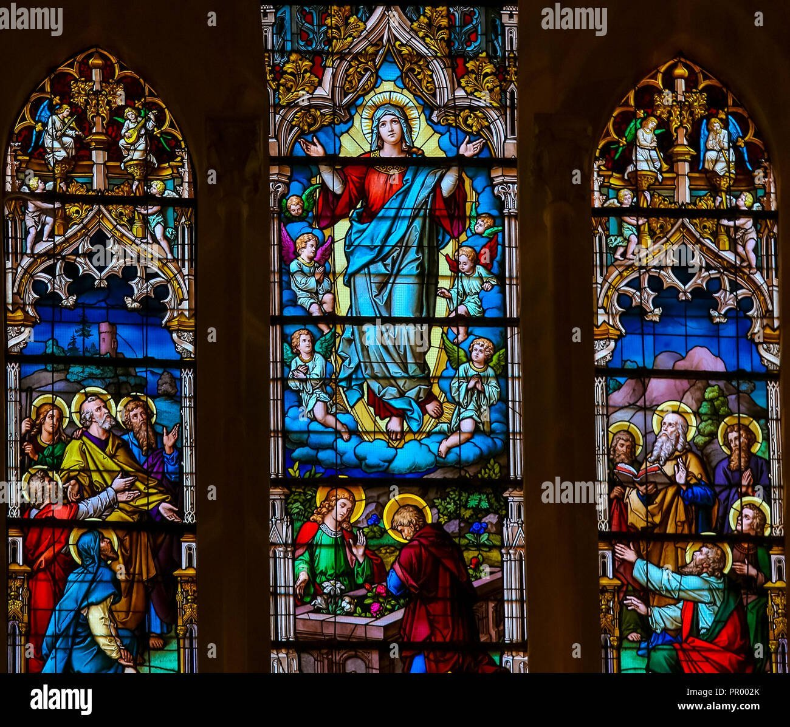

<!-- START doctoc generated TOC please keep comment here to allow auto update -->

<!-- DON'T EDIT THIS SECTION, INSTEAD RE-RUN doctoc TO UPDATE -->

**Table of Contents** _generated with [DocToc](https://github.com/ktechhub/doctoc)_

<!---toc start-->

- [December 2025](#december-2025)
  - [December 01, 2025](#december-01-2025)
    - [The Glorious Mysteries - Day 335](#the-glorious-mysteries---day-335)
    - [AI-Generated Summary: On the Five Glorious Mysteries and the Art Which Attempts to Capture Their Heavenly Light - Day 335](#ai-generated-summary-on-the-five-glorious-mysteries-and-the-art-which-attempts-to-capture-their-heavenly-light---day-335)
    - [Annibale Carracci's 1593 Baroque oil painting 'Resurrection', housed in the Louvre Museum, depicts Christ emerging gloriously from the tomb, holding the banner of victory as Roman soldiers recoil in awe and fear - Day 335](#annibale-carraccis-1593-baroque-oil-painting-resurrection-housed-in-the-louvre-museum-depicts-christ-emerging-gloriously-from-the-tomb-holding-the-banner-of-victory-as-roman-soldiers-recoil-in-awe-and-fear---day-335)
    - [Bernardino Gandino's Renaissance oil painting 'Ascension of the Lord' depicts the risen Christ, a solid figure who passed through the ceiling of nature, being received into heavenly light as the apostles watch in wonder below (Stock Image) - Day 335](#bernardino-gandinos-renaissance-oil-painting-ascension-of-the-lord-depicts-the-risen-christ-a-solid-figure-who-passed-through-the-ceiling-of-nature-being-received-into-heavenly-light-as-the-apostles-watch-in-wonder-below-stock-image---day-335)
    - ['Pentecost' (1732) by Jean Restout II, an oil on canvas in the French Baroque style housed at the Louvre Museum, Paris, dramatically depicts the Holy Spirit descending as tongues of fire upon the Virgin Mary and the apostles gathered in the upper room - Day 335](#pentecost-1732-by-jean-restout-ii-an-oil-on-canvas-in-the-french-baroque-style-housed-at-the-louvre-museum-paris-dramatically-depicts-the-holy-spirit-descending-as-tongues-of-fire-upon-the-virgin-mary-and-the-apostles-gathered-in-the-upper-room---day-335)
    - [Cesare Mariani's 1863 fresco 'Assumption of the Virgin with Vision of St Bonaventura', located in the Chiesa di Santa Lucia del Gonfalone in Rome, depicts the Virgin Mary's bodily Assumption into heaven as witnessed by the theologian Saint Bonaventure - Day 335](#cesare-marianis-1863-fresco-assumption-of-the-virgin-with-vision-of-st-bonaventura-located-in-the-chiesa-di-santa-lucia-del-gonfalone-in-rome-depicts-the-virgin-marys-bodily-assumption-into-heaven-as-witnessed-by-the-theologian-saint-bonaventure---day-335)
    - [Diego Velázquez's Baroque masterpiece 'Coronation of the Virgin' (c 1641-1644), an oil on canvas housed at the Museo del Prado, depicts the Holy Trinity—God the Father and Christ placing a crown upon the Virgin Mary's head with the Holy Spirit above—in the glorious act of her coronation as Queen of Heaven, witnessed by angels - Day 335](#diego-vel%C3%A1zquezs-baroque-masterpiece-coronation-of-the-virgin-c-1641-1644-an-oil-on-canvas-housed-at-the-museo-del-prado-depicts-the-holy-trinitygod-the-father-and-christ-placing-a-crown-upon-the-virgin-marys-head-with-the-holy-spirit-abovein-the-glorious-act-of-her-coronation-as-queen-of-heaven-witnessed-by-angels---day-335)
    - [Jan van Eyck's 1434-1436 oil on panel 'The Annunciation', housed at the National Gallery of Art in Washington DC, is a Northern Renaissance masterpiece depicting the Archangel Gabriel announcing to a humble Virgin Mary that she will bear the Son of God - Day 335](#jan-van-eycks-1434-1436-oil-on-panel-the-annunciation-housed-at-the-national-gallery-of-art-in-washington-dc-is-a-northern-renaissance-masterpiece-depicting-the-archangel-gabriel-announcing-to-a-humble-virgin-mary-that-she-will-bear-the-son-of-god---day-335)
  - [December 02, 2025](#december-02-2025)
    - [The Sorrowful Mysteries - Day 336](#the-sorrowful-mysteries---day-336)
    - [AI-Generated Summary: On the Sorrowful Mysteries and the Consolation Found in the Agony of the Cross - Day 336](#ai-generated-summary-on-the-sorrowful-mysteries-and-the-consolation-found-in-the-agony-of-the-cross---day-336)
    - [Vicente Juan Masip's 'Agony in the Garden' (c 1550), an oil on panel at the Museo del Prado, depicts Christ kneeling in prayer at Gethsemane as angels present the chalice of suffering, with the apostles asleep and Judas approaching with soldiers in the foreground - Day 336](#vicente-juan-masips-agony-in-the-garden-c-1550-an-oil-on-panel-at-the-museo-del-prado-depicts-christ-kneeling-in-prayer-at-gethsemane-as-angels-present-the-chalice-of-suffering-with-the-apostles-asleep-and-judas-approaching-with-soldiers-in-the-foreground---day-336)
    - [William-Adolphe Bouguereau's 1880 oil painting 'The Flagellation of Our Lord Jesus Christ', located in the Cathedral of La Rochelle, is an Academic Classical depiction of the Sorrowful Mystery where Christ endures brutal scourging at the pillar - Day 336](#william-adolphe-bouguereaus-1880-oil-painting-the-flagellation-of-our-lord-jesus-christ-located-in-the-cathedral-of-la-rochelle-is-an-academic-classical-depiction-of-the-sorrowful-mystery-where-christ-endures-brutal-scourging-at-the-pillar---day-336)
    - [Anthony van Dyck's 'The Crowning with Thorns' (c 1620), an oil on canvas in the Baroque style, portrays Roman soldiers mocking Christ as they press the crown of thorns upon his head, a scene of profound suffering and paradoxical kingship now housed in the Museo del Prado, Madrid - Day 336](#anthony-van-dycks-the-crowning-with-thorns-c-1620-an-oil-on-canvas-in-the-baroque-style-portrays-roman-soldiers-mocking-christ-as-they-press-the-crown-of-thorns-upon-his-head-a-scene-of-profound-suffering-and-paradoxical-kingship-now-housed-in-the-museo-del-prado-madrid---day-336)
    - [Orazio Gentileschi's 1605 Baroque oil painting 'Christ Carrying the Cross' depicts the exhausted Christ struggling under the immense weight of the cross on the road to Golgotha, a poignant visualization of the Sorrowful Mystery - Day 336](#orazio-gentileschis-1605-baroque-oil-painting-christ-carrying-the-cross-depicts-the-exhausted-christ-struggling-under-the-immense-weight-of-the-cross-on-the-road-to-golgotha-a-poignant-visualization-of-the-sorrowful-mystery---day-336)
    - [Pietro Gagliardi's 1847-1852 fresco 'Crucifixion' in San Girolamo dei Croati, Rome, depicts Christ's sacrifice on the cross, surrounded by the grieving figures of the Virgin Mary, John the Evangelist, and Mary Magdalene, emphasizing the profound theological significance of the event (Stock Image) - Day 336](#pietro-gagliardis-1847-1852-fresco-crucifixion-in-san-girolamo-dei-croati-rome-depicts-christs-sacrifice-on-the-cross-surrounded-by-the-grieving-figures-of-the-virgin-mary-john-the-evangelist-and-mary-magdalene-emphasizing-the-profound-theological-significance-of-the-event-stock-image---day-336)
    - [Bonus: Introduction to Phase Six: “Praying Together”— The Rosary in a Year (with Fr. Mark-Mary Ames)](#bonus-introduction-to-phase-six-praying-together-the-rosary-in-a-year-with-fr-mark-mary-ames)
    - [AI-Generated Summary: On the Quiet and Persistent Miracle of the Rosary in the Common Life of a Family - Day 337](#ai-generated-summary-on-the-quiet-and-persistent-miracle-of-the-rosary-in-the-common-life-of-a-family---day-337)
  - [December 03, 2025](#december-03-2025)
    - [The Glorious Mysteries - Day 337](#the-glorious-mysteries---day-337)
    - [AI-Generated Summary: A Consideration of the Five Glorious Mysteries and Their Promise of a Heavenly Home - Day 337](#ai-generated-summary-a-consideration-of-the-five-glorious-mysteries-and-their-promise-of-a-heavenly-home---day-337)
    - [Annibale Carracci's 1593 Baroque oil painting 'Resurrection', housed in the Louvre Museum, depicts Christ emerging gloriously from the tomb, holding the banner of victory as Roman soldiers recoil in awe and fear - Day 337](#annibale-carraccis-1593-baroque-oil-painting-resurrection-housed-in-the-louvre-museum-depicts-christ-emerging-gloriously-from-the-tomb-holding-the-banner-of-victory-as-roman-soldiers-recoil-in-awe-and-fear---day-337)
    - [In this late 12th-century Byzantine mosaic 'The Ascension' at the Basilica di San Marco in Venice, Christ rises to heaven in a radiant mandorla supported by angels, while the Virgin Mary stands centrally below, surrounded by the astonished apostles witnessing this glorious event - Day 337](#in-this-late-12th-century-byzantine-mosaic-the-ascension-at-the-basilica-di-san-marco-in-venice-christ-rises-to-heaven-in-a-radiant-mandorla-supported-by-angels-while-the-virgin-mary-stands-centrally-below-surrounded-by-the-astonished-apostles-witnessing-this-glorious-event---day-337)
    - [Titian's 1546 oil painting 'Pentecost' in Santa Maria della Salute, Venice, depicts the Descent of the Holy Spirit as tongues of fire upon the Virgin Mary and the gathered apostles - Day 337](#titians-1546-oil-painting-pentecost-in-santa-maria-della-salute-venice-depicts-the-descent-of-the-holy-spirit-as-tongues-of-fire-upon-the-virgin-mary-and-the-gathered-apostles---day-337)
    - [Cesare Mariani's 1863 fresco 'Assumption of the Virgin with Vision of St Bonaventure' in Rome's Chiesa di Santa Lucia del Gonfalone depicts the Virgin Mary's bodily assumption into heaven, witnessed by St Bonaventure, rendered in a Neoclassical style - Day 337](#cesare-marianis-1863-fresco-assumption-of-the-virgin-with-vision-of-st-bonaventure-in-romes-chiesa-di-santa-lucia-del-gonfalone-depicts-the-virgin-marys-bodily-assumption-into-heaven-witnessed-by-st-bonaventure-rendered-in-a-neoclassical-style---day-337)
    - [Diego Velázquez's Baroque masterpiece 'Coronation of the Virgin' (c 1641-1644), an oil on canvas housed at the Museo del Prado, depicts the Holy Trinity—God the Father and Christ placing a crown upon the Virgin Mary's head with the Holy Spirit hovering above—as she is honored as Queen of Heaven, witnessed by angels - Day 337](#diego-vel%C3%A1zquezs-baroque-masterpiece-coronation-of-the-virgin-c-1641-1644-an-oil-on-canvas-housed-at-the-museo-del-prado-depicts-the-holy-trinitygod-the-father-and-christ-placing-a-crown-upon-the-virgin-marys-head-with-the-holy-spirit-hovering-aboveas-she-is-honored-as-queen-of-heaven-witnessed-by-angels---day-337)
  - [December 04, 2025](#december-04-2025)
    - [The Luminous Mysteries - Day 338](#the-luminous-mysteries---day-338)
    - [AI-Generated Summary: A Consideration of the Five Luminous Mysteries and Their Gentle Illumination of Our Common Path - Day 338](#ai-generated-summary-a-consideration-of-the-five-luminous-mysteries-and-their-gentle-illumination-of-our-common-path---day-338)
    - ['The Baptism of Christ', a collaborative Early Renaissance painting by Andrea del Verrocchio and Leonardo da Vinci from around 1475, depicts John the Baptist baptizing Jesus in the Jordan River as the Holy Spirit descends and angels witness the sacred event, executed in tempera and oil on wood and housed in the Uffizi Gallery in Florence - Day 338](#the-baptism-of-christ-a-collaborative-early-renaissance-painting-by-andrea-del-verrocchio-and-leonardo-da-vinci-from-around-1475-depicts-john-the-baptist-baptizing-jesus-in-the-jordan-river-as-the-holy-spirit-descends-and-angels-witness-the-sacred-event-executed-in-tempera-and-oil-on-wood-and-housed-in-the-uffizi-gallery-in-florence---day-338)
    - [Carl Bloch's 19th-century oil painting 'The Wedding at Cana' depicts the first Luminous Mystery, where Jesus performs his inaugural miracle by transforming water into wine at a wedding feast, following his mother's quiet instruction - Day 338](#carl-blochs-19th-century-oil-painting-the-wedding-at-cana-depicts-the-first-luminous-mystery-where-jesus-performs-his-inaugural-miracle-by-transforming-water-into-wine-at-a-wedding-feast-following-his-mothers-quiet-instruction---day-338)
    - [Rembrandt van Rijn's 1633 oil-on-canvas painting 'Christ in the Storm on the Sea of Galilee' dramatically depicts the Luminous Mystery of the Proclamation of the Kingdom, where Jesus calms the tempest and reveals His divine authority over nature to His panicking disciples The work, a masterpiece of the Dutch Golden Age, was stolen in 1990 and its current location is unknown - Day 338](#rembrandt-van-rijns-1633-oil-on-canvas-painting-christ-in-the-storm-on-the-sea-of-galilee-dramatically-depicts-the-luminous-mystery-of-the-proclamation-of-the-kingdom-where-jesus-calms-the-tempest-and-reveals-his-divine-authority-over-nature-to-his-panicking-disciples-the-work-a-masterpiece-of-the-dutch-golden-age-was-stolen-in-1990-and-its-current-location-is-unknown---day-338)
    - [Theophanes the Greek's 1403 Byzantine fresco 'The Transfiguration,' located in the Tretyakov Gallery, Moscow, depicts Christ radiating divine light between Moses and Elijah, witnessed by the apostles Peter, James, and John - Day 338](#theophanes-the-greeks-1403-byzantine-fresco-the-transfiguration-located-in-the-tretyakov-gallery-moscow-depicts-christ-radiating-divine-light-between-moses-and-elijah-witnessed-by-the-apostles-peter-james-and-john---day-338)
    - [In his 1562 oil on panel 'The Last Supper', Spanish Renaissance master Juan de Juanes depicts the solemn moment of the Institution of the Eucharist, where Christ offers the consecrated host to his apostles, a work now housed in the Museo del Prado in Madrid - Day 338](#in-his-1562-oil-on-panel-the-last-supper-spanish-renaissance-master-juan-de-juanes-depicts-the-solemn-moment-of-the-institution-of-the-eucharist-where-christ-offers-the-consecrated-host-to-his-apostles-a-work-now-housed-in-the-museo-del-prado-in-madrid---day-338)
  - [December 05, 2025](#december-05-2025)
    - [The Sorrowful Mysteries - Day 339](#the-sorrowful-mysteries---day-339)
    - [AI-Generated Summary: A Meditation on the Five Sorrowful Mysteries of the Rosary Concerning the Passion of Our Lord - Day 339](#ai-generated-summary-a-meditation-on-the-five-sorrowful-mysteries-of-the-rosary-concerning-the-passion-of-our-lord---day-339)
    - [Alessandro Maganza's Mannerist painting 'The Prayer of Jesus in Gethsemane' (c 1590-1610), an oil on canvas in Vicenza Cathedral, depicts the Agony in the Garden with Christ in anguished prayer while His disciples sleep, capturing the profound spiritual struggle and submission to God's will before the Passion (Stock Image) - Day 339](#alessandro-maganzas-mannerist-painting-the-prayer-of-jesus-in-gethsemane-c-1590-1610-an-oil-on-canvas-in-vicenza-cathedral-depicts-the-agony-in-the-garden-with-christ-in-anguished-prayer-while-his-disciples-sleep-capturing-the-profound-spiritual-struggle-and-submission-to-gods-will-before-the-passion-stock-image---day-339)
    - [William-Adolphe Bouguereau's 1880 oil painting 'The Flagellation of Our Lord Jesus Christ', located in the Cathedral of La Rochelle, depicts the second Sorrowful Mystery: the brutal Scourging at the Pillar, where Christ endures physical torment with divine resignation - Day 339](#william-adolphe-bouguereaus-1880-oil-painting-the-flagellation-of-our-lord-jesus-christ-located-in-the-cathedral-of-la-rochelle-depicts-the-second-sorrowful-mystery-the-brutal-scourging-at-the-pillar-where-christ-endures-physical-torment-with-divine-resignation---day-339)
    - [Titian's 'Christ Crowned with Thorns' (c 1542–1543), an oil on canvas housed in the Louvre Museum, depicts the third Sorrowful Mystery In this Venetian Renaissance masterpiece, Roman soldiers violently press the crown of thorns onto Christ's head as he endures the mockery with a serene and dignified composure, the dramatic lighting intensifying the viewer's contemplation of his suffering and paradoxical kingship - Day 339](#titians-christ-crowned-with-thorns-c-15421543-an-oil-on-canvas-housed-in-the-louvre-museum-depicts-the-third-sorrowful-mystery-in-this-venetian-renaissance-masterpiece-roman-soldiers-violently-press-the-crown-of-thorns-onto-christs-head-as-he-endures-the-mockery-with-a-serene-and-dignified-composure-the-dramatic-lighting-intensifying-the-viewers-contemplation-of-his-suffering-and-paradoxical-kingship---day-339)
    - [Orazio Gentileschi's 1605 Baroque oil painting 'Christ Carrying the Cross' depicts the fourth Sorrowful Mystery, showing an exhausted Christ struggling under the weight of the cross on the road to Golgotha, a moment that transforms the instrument of dishonor into a sign of ultimate victory - Day 339](#orazio-gentileschis-1605-baroque-oil-painting-christ-carrying-the-cross-depicts-the-fourth-sorrowful-mystery-showing-an-exhausted-christ-struggling-under-the-weight-of-the-cross-on-the-road-to-golgotha-a-moment-that-transforms-the-instrument-of-dishonor-into-a-sign-of-ultimate-victory---day-339)
    - [James Tissot's 1886-1894 gouache painting 'What Our Lord Saw from the Cross', housed at the Brooklyn Museum, offers a profound and unique devotional perspective of the Crucifixion, depicting the crowd below from Christ's own viewpoint during the final Sorrowful Mystery - Day 339](#james-tissots-1886-1894-gouache-painting-what-our-lord-saw-from-the-cross-housed-at-the-brooklyn-museum-offers-a-profound-and-unique-devotional-perspective-of-the-crucifixion-depicting-the-crowd-below-from-christs-own-viewpoint-during-the-final-sorrowful-mystery---day-339)
  - [December 06, 2025](#december-06-2025)
    - [The Joyful Mysteries - Day 340](#the-joyful-mysteries---day-340)
    - [AI-Generated Summary: A Consideration of the Joyful Mysteries and a Particular Painting of the Presentation in the Temple - Day 340](#ai-generated-summary-a-consideration-of-the-joyful-mysteries-and-a-particular-painting-of-the-presentation-in-the-temple---day-340)
    - [Fra Angelico's 'The Annunciation' (mid-1430s), a tempera on panel housed at the Museo del Prado, Madrid, is an Early Renaissance masterpiece depicting the biblical moment the Archangel Gabriel announces to the Virgin Mary that she will bear the Son of God, set within delicate Renaissance architecture - Day 340](#fra-angelicos-the-annunciation-mid-1430s-a-tempera-on-panel-housed-at-the-museo-del-prado-madrid-is-an-early-renaissance-masterpiece-depicting-the-biblical-moment-the-archangel-gabriel-announces-to-the-virgin-mary-that-she-will-bear-the-son-of-god-set-within-delicate-renaissance-architecture---day-340)
    - [Rembrandt van Rijn's 1640 oil on panel, 'The Visitation', housed at the Detroit Institute of Arts, masterfully depicts Mary and Elizabeth embracing The artist's signature chiaroscuro dramatically illuminates their profound spiritual connection and the miraculous nature of their pregnancies, capturing a pivotal moment from the Joyful Mysteries of the Rosary - Day 340](#rembrandt-van-rijns-1640-oil-on-panel-the-visitation-housed-at-the-detroit-institute-of-arts-masterfully-depicts-mary-and-elizabeth-embracing-the-artists-signature-chiaroscuro-dramatically-illuminates-their-profound-spiritual-connection-and-the-miraculous-nature-of-their-pregnancies-capturing-a-pivotal-moment-from-the-joyful-mysteries-of-the-rosary---day-340)
    - [Caravaggio's 1600 oil on canvas 'Nativity with St Francis and St Lawrence' is a dramatic Baroque depiction of the third Joyful Mystery, employing intense chiaroscuro to portray the newborn Christ with the adoring saints Francis and Lawrence - Day 340](#caravaggios-1600-oil-on-canvas-nativity-with-st-francis-and-st-lawrence-is-a-dramatic-baroque-depiction-of-the-third-joyful-mystery-employing-intense-chiaroscuro-to-portray-the-newborn-christ-with-the-adoring-saints-francis-and-lawrence---day-340)
    - [Giulio Campi's 1547 fresco 'The Presentation of Jesus in the Temple' in the Chiesa di Santa Rita, Cremona, depicts the Virgin Mary and Saint Joseph presenting the infant Christ to the elderly Simeon (Stock Image) - Day 340](#giulio-campis-1547-fresco-the-presentation-of-jesus-in-the-temple-in-the-chiesa-di-santa-rita-cremona-depicts-the-virgin-mary-and-saint-joseph-presenting-the-infant-christ-to-the-elderly-simeon-stock-image---day-340)
    - [This 20th-century Byzantine Revival mosaic by an unknown artist, located in the Rosary Basilica at Lourdes, France, depicts 'The Finding of Jesus in the Temple,' where the young Christ astonishes elders with his divine wisdom while his parents, Mary and Joseph, look on (Stock Image) - Day 340](#this-20th-century-byzantine-revival-mosaic-by-an-unknown-artist-located-in-the-rosary-basilica-at-lourdes-france-depicts-the-finding-of-jesus-in-the-temple-where-the-young-christ-astonishes-elders-with-his-divine-wisdom-while-his-parents-mary-and-joseph-look-on-stock-image---day-340)
  - [December 07, 2025](#december-07-2025)
    - [The Glorious Mysteries - Day 341](#the-glorious-mysteries---day-341)
    - [AI-Generated Summary: A Consideration of the Five Glorious Mysteries and Their Particulars as Set Forth - Day 341](#ai-generated-summary-a-consideration-of-the-five-glorious-mysteries-and-their-particulars-as-set-forth---day-341)
    - [In his 1593 Baroque oil painting 'Resurrection', Annibale Carracci depicts Christ emerging gloriously from the tomb, holding the banner of resurrection as Roman soldiers recoil in awe and fear at the miraculous event This work, housed in the Louvre Museum, Paris, powerfully illustrates the first Glorious Mystery, where Christ conquers sin and death, a cornerstone of faith symbolizing divine power and the promise of eternal life - Day 341](#in-his-1593-baroque-oil-painting-resurrection-annibale-carracci-depicts-christ-emerging-gloriously-from-the-tomb-holding-the-banner-of-resurrection-as-roman-soldiers-recoil-in-awe-and-fear-at-the-miraculous-event-this-work-housed-in-the-louvre-museum-paris-powerfully-illustrates-the-first-glorious-mystery-where-christ-conquers-sin-and-death-a-cornerstone-of-faith-symbolizing-divine-power-and-the-promise-of-eternal-life---day-341)
    - [This Byzantine mosaic, 'The Ascension', created by mosaicists between 1175-1200 in the Basilica di San Marco, Venice, depicts Christ rising to heaven in a mandorla of light, supported by angels, with the Virgin Mary and astonished apostles witnessing the event below - Day 341](#this-byzantine-mosaic-the-ascension-created-by-mosaicists-between-1175-1200-in-the-basilica-di-san-marco-venice-depicts-christ-rising-to-heaven-in-a-mandorla-of-light-supported-by-angels-with-the-virgin-mary-and-astonished-apostles-witnessing-the-event-below---day-341)
    - ['Pentecost' (1732) by Jean Restout II, an oil on canvas in the French Baroque style housed at the Louvre Museum, Paris, dramatically depicts the Descent of the Holy Spirit Tongues of fire alight upon the Virgin Mary and the gathered apostles in the upper room, with intense lighting emphasizing this divine moment that marks the birth of the Church - Day 341](#pentecost-1732-by-jean-restout-ii-an-oil-on-canvas-in-the-french-baroque-style-housed-at-the-louvre-museum-paris-dramatically-depicts-the-descent-of-the-holy-spirit-tongues-of-fire-alight-upon-the-virgin-mary-and-the-gathered-apostles-in-the-upper-room-with-intense-lighting-emphasizing-this-divine-moment-that-marks-the-birth-of-the-church---day-341)
    - [A 13th-15th century Gothic stained glass window in Burgos Cathedral, Spain, titled 'The Assumption of Mary', depicts the Virgin being assumed body and soul into heavenly glory, welcomed by Christ and surrounded by angels (Stock Image) - Day 341](#a-13th-15th-century-gothic-stained-glass-window-in-burgos-cathedral-spain-titled-the-assumption-of-mary-depicts-the-virgin-being-assumed-body-and-soul-into-heavenly-glory-welcomed-by-christ-and-surrounded-by-angels-stock-image---day-341)
    - [This 19th-century fresco by Giuseppe Rollini, titled 'Mary, Help of Christians' and located in Turin, Italy, depicts the Virgin Mary's Coronation as Queen of Heaven, portraying her as the compassionate intercessor and protector of the faithful in traditional Catholic iconography (Stock Image) - Day 341](#this-19th-century-fresco-by-giuseppe-rollini-titled-mary-help-of-christians-and-located-in-turin-italy-depicts-the-virgin-marys-coronation-as-queen-of-heaven-portraying-her-as-the-compassionate-intercessor-and-protector-of-the-faithful-in-traditional-catholic-iconography-stock-image---day-341)
  - [December 08, 2025](#december-08-2025)
    - [The Joyful Mysteries - Day 342](#the-joyful-mysteries---day-342)
    - [AI-Generated Summary: A Consideration of the Five Joyful Mysteries Concerning the Annunciation, Visitation, Nativity, Presentation, and Finding in the Temple - Day 342](#ai-generated-summary-a-consideration-of-the-five-joyful-mysteries-concerning-the-annunciation-visitation-nativity-presentation-and-finding-in-the-temple---day-342)
    - [Henry Ossawa Tanner's 1898 oil painting 'The Annunciation', housed at the Philadelphia Museum of Art, presents a revolutionary Realist and Symbolist interpretation where the Virgin Mary, depicted as an ordinary young woman in a humble Middle Eastern interior, is illuminated by a divine column of light representing the angel's message - Day 342](#henry-ossawa-tanners-1898-oil-painting-the-annunciation-housed-at-the-philadelphia-museum-of-art-presents-a-revolutionary-realist-and-symbolist-interpretation-where-the-virgin-mary-depicted-as-an-ordinary-young-woman-in-a-humble-middle-eastern-interior-is-illuminated-by-a-divine-column-of-light-representing-the-angels-message---day-342)
    - [Federico Maldarelli's 1889 oil painting 'The Visitation', located in the Chiesa dei Santi Severino e Sossio in Naples, depicts the joyful meeting of the Virgin Mary and her cousin Elizabeth, who are pregnant with Jesus and John the Baptist (Stock Image) - Day 342](#federico-maldarellis-1889-oil-painting-the-visitation-located-in-the-chiesa-dei-santi-severino-e-sossio-in-naples-depicts-the-joyful-meeting-of-the-virgin-mary-and-her-cousin-elizabeth-who-are-pregnant-with-jesus-and-john-the-baptist-stock-image---day-342)
    - [Gerard van Honthorst's 1622 Baroque oil painting 'Adoration of the Shepherds', housed in the Wallraf-Richartz Museum in Cologne, dramatically depicts the Nativity with shepherds worshiping the newborn Christ child in a stable illuminated by divine light - Day 342](#gerard-van-honthorsts-1622-baroque-oil-painting-adoration-of-the-shepherds-housed-in-the-wallraf-richartz-museum-in-cologne-dramatically-depicts-the-nativity-with-shepherds-worshiping-the-newborn-christ-child-in-a-stable-illuminated-by-divine-light---day-342)
    - [Aert de Gelder's 1700-1710 oil painting 'Simeon's Song of Praise', housed at the Mauritshuis in The Hague, depicts the Presentation of Jesus in the Temple, a Joyful Mystery where the righteous Simeon recognizes the infant as the Messiah - Day 342](#aert-de-gelders-1700-1710-oil-painting-simeons-song-of-praise-housed-at-the-mauritshuis-in-the-hague-depicts-the-presentation-of-jesus-in-the-temple-a-joyful-mystery-where-the-righteous-simeon-recognizes-the-infant-as-the-messiah---day-342)
    - [This 20th-century Byzantine Revival mosaic by an unknown artist in the Rosary Basilica at Lourdes depicts 'The Finding of Jesus in the Temple', where the young Christ astonishes elders with his divine wisdom as his worried parents, Mary and Joseph, look on (Stock Image) - Day 342](#this-20th-century-byzantine-revival-mosaic-by-an-unknown-artist-in-the-rosary-basilica-at-lourdes-depicts-the-finding-of-jesus-in-the-temple-where-the-young-christ-astonishes-elders-with-his-divine-wisdom-as-his-worried-parents-mary-and-joseph-look-on-stock-image---day-342)
  - [December 09, 2025](#december-09-2025)
    - [The Sorrowful Mysteries - Day 343](#the-sorrowful-mysteries---day-343)
    - [AI-Generated Summary: A Meditation on the Five Sorrowful Mysteries Concerning the Agony, Scourging, Crowning, Carrying, and Crucifixion - Day 343](#ai-generated-summary-a-meditation-on-the-five-sorrowful-mysteries-concerning-the-agony-scourging-crowning-carrying-and-crucifixion---day-343)
    - [Alessandro Maganza's 'The Prayer of Jesus in Gethsemane' (c 1590-1610), an oil on canvas in the Mannerist style located in Vicenza Cathedral, depicts the Sorrowful Mystery of the Agony in the Garden, capturing Christ's profound spiritual anguish as He prays while His disciples sleep (Stock Image) - Day 343](#alessandro-maganzas-the-prayer-of-jesus-in-gethsemane-c-1590-1610-an-oil-on-canvas-in-the-mannerist-style-located-in-vicenza-cathedral-depicts-the-sorrowful-mystery-of-the-agony-in-the-garden-capturing-christs-profound-spiritual-anguish-as-he-prays-while-his-disciples-sleep-stock-image---day-343)
    - [Caravaggio's 1607 oil on canvas 'The Flagellation of Christ', housed at the Museo di Capodimonte in Naples, is a dramatic Baroque depiction of the Sorrowful Mystery where Christ is bound to a column and brutally scourged by Roman soldiers - Day 343](#caravaggios-1607-oil-on-canvas-the-flagellation-of-christ-housed-at-the-museo-di-capodimonte-in-naples-is-a-dramatic-baroque-depiction-of-the-sorrowful-mystery-where-christ-is-bound-to-a-column-and-brutally-scourged-by-roman-soldiers---day-343)
    - [Titian's 'Christ Crowned with Thorns' (c 1542–1543), an oil on canvas housed at the Louvre Museum, masterfully depicts the third Sorrowful Mystery In the Venetian Renaissance style, Roman soldiers violently press the crown of thorns onto Christ's head as He endures the mockery with a transcendent, serene dignity, the dramatic lighting intensifying the viewer's contemplation of His sacred suffering - Day 343](#titians-christ-crowned-with-thorns-c-15421543-an-oil-on-canvas-housed-at-the-louvre-museum-masterfully-depicts-the-third-sorrowful-mystery-in-the-venetian-renaissance-style-roman-soldiers-violently-press-the-crown-of-thorns-onto-christs-head-as-he-endures-the-mockery-with-a-transcendent-serene-dignity-the-dramatic-lighting-intensifying-the-viewers-contemplation-of-his-sacred-suffering---day-343)
    - [Raphael's 1516-1517 oil painting 'Christ Falls on the Way to Calvary,' housed in the Museo del Prado, Madrid, depicts the fourth Sorrowful Mystery, showing Christ stumbling under the cross's weight on the Via Dolorosa, with Mary and a crowd witnessing His profound suffering - Day 343](#raphaels-1516-1517-oil-painting-christ-falls-on-the-way-to-calvary-housed-in-the-museo-del-prado-madrid-depicts-the-fourth-sorrowful-mystery-showing-christ-stumbling-under-the-crosss-weight-on-the-via-dolorosa-with-mary-and-a-crowd-witnessing-his-profound-suffering---day-343)
    - [Pietro Gagliardi's 1847-1852 fresco 'Crucifixion' in the church of San Girolamo dei Croati, Rome, depicts the fifth Sorrowful Mystery, with Christ sacrificed on the cross, mourned by the Virgin Mary, John the Evangelist, and Mary Magdalene at its foot (Stock Image) - Day 343](#pietro-gagliardis-1847-1852-fresco-crucifixion-in-the-church-of-san-girolamo-dei-croati-rome-depicts-the-fifth-sorrowful-mystery-with-christ-sacrificed-on-the-cross-mourned-by-the-virgin-mary-john-the-evangelist-and-mary-magdalene-at-its-foot-stock-image---day-343)
  - [December 10, 2025](#december-10-2025)
    - [The Glorious Mysteries - Day 344](#the-glorious-mysteries---day-344)
    - [AI-Generated Summary: A Meditation on the Five Glorious Mysteries and Their Appointed Works of Art - Day 344](#ai-generated-summary-a-meditation-on-the-five-glorious-mysteries-and-their-appointed-works-of-art---day-344)
    - [Annibale Carracci's 1593 Baroque oil painting 'Resurrection', housed in the Louvre Museum, Paris, depicts Christ emerging gloriously from the tomb holding the victory banner as Roman soldiers recoil in awe and fear at the miraculous event - Day 344](#annibale-carraccis-1593-baroque-oil-painting-resurrection-housed-in-the-louvre-museum-paris-depicts-christ-emerging-gloriously-from-the-tomb-holding-the-victory-banner-as-roman-soldiers-recoil-in-awe-and-fear-at-the-miraculous-event---day-344)
    - [Bernardino Gandino's Renaissance oil painting 'Ascension of the Lord' depicts the risen Christ ascending bodily into heaven, with the apostles watching in wonder below as described in the Glorious Mysteries (Stock Image) - Day 344](#bernardino-gandinos-renaissance-oil-painting-ascension-of-the-lord-depicts-the-risen-christ-ascending-bodily-into-heaven-with-the-apostles-watching-in-wonder-below-as-described-in-the-glorious-mysteries-stock-image---day-344)
    - ['Pentecost' (1732) by Jean Restout II, an oil on canvas in the French Baroque style housed at the Louvre Museum, Paris, dramatically depicts the descent of the Holy Spirit as tongues of fire upon the Virgin Mary and the apostles gathered in the upper room - Day 344](#pentecost-1732-by-jean-restout-ii-an-oil-on-canvas-in-the-french-baroque-style-housed-at-the-louvre-museum-paris-dramatically-depicts-the-descent-of-the-holy-spirit-as-tongues-of-fire-upon-the-virgin-mary-and-the-apostles-gathered-in-the-upper-room---day-344)
    - [This 1706 Baroque fresco, 'The Assumption of the Virgin Mary' by Giuseppe and Andrea Orazi, adorns the main cupola of Chiesa di Santa Maria del Orto in Rome It dynamically depicts the Blessed Virgin Mary being taken body and soul into heaven, surrounded by a host of angels and putti, celebrating her glorious assumption as the New Ark of the Covenant (Stock Image) - Day 344](#this-1706-baroque-fresco-the-assumption-of-the-virgin-mary-by-giuseppe-and-andrea-orazi-adorns-the-main-cupola-of-chiesa-di-santa-maria-del-orto-in-rome-it-dynamically-depicts-the-blessed-virgin-mary-being-taken-body-and-soul-into-heaven-surrounded-by-a-host-of-angels-and-putti-celebrating-her-glorious-assumption-as-the-new-ark-of-the-covenant-stock-image---day-344)
    - [In his Baroque masterpiece 'Coronation of the Virgin' (c 1641-1644), Diego Velázquez, using oil on canvas, depicts the Holy Trinity crowning the Blessed Virgin Mary as Queen of Heaven, a work now housed in the Museo del Prado, Madrid - Day 344](#in-his-baroque-masterpiece-coronation-of-the-virgin-c-1641-1644-diego-vel%C3%A1zquez-using-oil-on-canvas-depicts-the-holy-trinity-crowning-the-blessed-virgin-mary-as-queen-of-heaven-a-work-now-housed-in-the-museo-del-prado-madrid---day-344)
    - [Resurrection (Stock Image) - Day 344](#resurrection-stock-image---day-344)
    - [Resurrection - Day 344](#resurrection---day-344)
    - [Descent of the Holy Spirit - Day 344](#descent-of-the-holy-spirit---day-344)
  - [December 11, 2025](#december-11-2025)
    - [The Luminous Mysteries - Day 345](#the-luminous-mysteries---day-345)
    - [AI-Generated Summary: A Consideration of the Five Luminous Mysteries and Their Meditations for the Rosary - Day 345](#ai-generated-summary-a-consideration-of-the-five-luminous-mysteries-and-their-meditations-for-the-rosary---day-345)
    - [This Renaissance fresco, titled 'The Baptism of Christ' by an unknown artist, is located in the Church of San Benedetto Vecchio in Padua, Italy It depicts the Luminous Mystery of the Baptism of Jesus in the Jordan, showing John the Baptist baptizing the sinless Christ As Jesus emerges from the water, the heavens open, the Holy Spirit descends as a dove, and the sanctified river reveals the divine nature of the beloved Son (Stock Image) - Day 345](#this-renaissance-fresco-titled-the-baptism-of-christ-by-an-unknown-artist-is-located-in-the-church-of-san-benedetto-vecchio-in-padua-italy-it-depicts-the-luminous-mystery-of-the-baptism-of-jesus-in-the-jordan-showing-john-the-baptist-baptizing-the-sinless-christ-as-jesus-emerges-from-the-water-the-heavens-open-the-holy-spirit-descends-as-a-dove-and-the-sanctified-river-reveals-the-divine-nature-of-the-beloved-son-stock-image---day-345)
    - [Carl Bloch's 19th-century oil painting 'The Wedding at Cana' depicts the first Luminous Mystery, where Jesus, at His mother's request, performs His inaugural miracle by transforming water into the finest wine at a wedding feast, foreshadowing His divine glory and ultimate sacrifice - Day 345](#carl-blochs-19th-century-oil-painting-the-wedding-at-cana-depicts-the-first-luminous-mystery-where-jesus-at-his-mothers-request-performs-his-inaugural-miracle-by-transforming-water-into-the-finest-wine-at-a-wedding-feast-foreshadowing-his-divine-glory-and-ultimate-sacrifice---day-345)
    - [James Tissot's 1894 gouache painting 'Healing of the Lepers at Capernaum' powerfully visualizes the Luminous Mystery of the Proclamation of the Kingdom of God, depicting Christ's authoritative healing as a sign of the urgent call to repentance (Stock Image) - Day 345](#james-tissots-1894-gouache-painting-healing-of-the-lepers-at-capernaum-powerfully-visualizes-the-luminous-mystery-of-the-proclamation-of-the-kingdom-of-god-depicting-christs-authoritative-healing-as-a-sign-of-the-urgent-call-to-repentance-stock-image---day-345)
    - ['The Transfiguration' (1403) by Theophanes the Greek is a Byzantine fresco in Moscow's Tretyakov Gallery, depicting Christ radiant in divine light between Moses and Elijah, with the awestruck disciples Peter, James, and John witnessing this revelation - Day 345](#the-transfiguration-1403-by-theophanes-the-greek-is-a-byzantine-fresco-in-moscows-tretyakov-gallery-depicting-christ-radiant-in-divine-light-between-moses-and-elijah-with-the-awestruck-disciples-peter-james-and-john-witnessing-this-revelation---day-345)
    - [In 'Christ and the Disciples Before the Last Supper' (c 1900), Henry Ossawa Tanner's oil painting captures an intimate moment of spiritual preparation before the institution of the Eucharist - Day 345](#in-christ-and-the-disciples-before-the-last-supper-c-1900-henry-ossawa-tanners-oil-painting-captures-an-intimate-moment-of-spiritual-preparation-before-the-institution-of-the-eucharist---day-345)
  - [December 12, 2025](#december-12-2025)
    - [The Sorrowful Mysteries - Day 346](#the-sorrowful-mysteries---day-346)
    - [AI-Generated Summary: A Meditation on the Five Sorrowful Mysteries Through the Lens of Scripture and Specific Sacred Artworks - Day 346](#ai-generated-summary-a-meditation-on-the-five-sorrowful-mysteries-through-the-lens-of-scripture-and-specific-sacred-artworks---day-346)
    - [Vicente Juan Masip's Renaissance oil painting 'Agony in the Garden' (c 1550), housed at the Museo del Prado in Madrid, depicts Christ kneeling in anguished prayer at Gethsemane An angel presents the chalice of suffering while the apostles sleep, and Judas approaches with soldiers, his halo ominously divided between gold and black - Day 346](#vicente-juan-masips-renaissance-oil-painting-agony-in-the-garden-c-1550-housed-at-the-museo-del-prado-in-madrid-depicts-christ-kneeling-in-anguished-prayer-at-gethsemane-an-angel-presents-the-chalice-of-suffering-while-the-apostles-sleep-and-judas-approaches-with-soldiers-his-halo-ominously-divided-between-gold-and-black---day-346)
    - [Caravaggio's 1607 oil painting 'The Flagellation of Christ', housed at the Museo di Capodimonte in Naples, is a dramatic Baroque depiction of the second Sorrowful Mystery, showing Christ bound to a column as Roman soldiers brutally scourge Him, emphasizing the physical reality of His suffering for the sins of humanity - Day 346](#caravaggios-1607-oil-painting-the-flagellation-of-christ-housed-at-the-museo-di-capodimonte-in-naples-is-a-dramatic-baroque-depiction-of-the-second-sorrowful-mystery-showing-christ-bound-to-a-column-as-roman-soldiers-brutally-scourge-him-emphasizing-the-physical-reality-of-his-suffering-for-the-sins-of-humanity---day-346)
    - [Anthony van Dyck's Baroque masterpiece 'The Crowning with Thorns' (c 1620), an oil on canvas held at the Museo del Prado, depicts Roman soldiers cruelly mocking Christ by pressing a crown of thorns upon his head and draping him in purple, a profound image of suffering and paradoxical kingship - Day 346](#anthony-van-dycks-baroque-masterpiece-the-crowning-with-thorns-c-1620-an-oil-on-canvas-held-at-the-museo-del-prado-depicts-roman-soldiers-cruelly-mocking-christ-by-pressing-a-crown-of-thorns-upon-his-head-and-draping-him-in-purple-a-profound-image-of-suffering-and-paradoxical-kingship---day-346)
    - [Raphael's 1516-1517 oil painting 'Christ Falls on the Way to Calvary', held at the Museo del Prado, masterfully captures the fourth Sorrowful Mystery It depicts Christ's humanity as he stumbles under the cross's weight on the Via Dolorosa, a poignant moment of suffering witnessed by his mother and the crowd - Day 346](#raphaels-1516-1517-oil-painting-christ-falls-on-the-way-to-calvary-held-at-the-museo-del-prado-masterfully-captures-the-fourth-sorrowful-mystery-it-depicts-christs-humanity-as-he-stumbles-under-the-crosss-weight-on-the-via-dolorosa-a-poignant-moment-of-suffering-witnessed-by-his-mother-and-the-crowd---day-346)
    - [Pietro Gagliardi's 1847-1852 fresco 'Crucifixion' in San Girolamo dei Croati, Rome, depicts Christ's sacrifice on the cross, flanked by the grieving Virgin Mary, John the Evangelist, and Mary Magdalene A rainbow arches above the scene, symbolizing the new covenant of redemption and ultimate victory sealed by his death (Stock Image) - Day 346](#pietro-gagliardis-1847-1852-fresco-crucifixion-in-san-girolamo-dei-croati-rome-depicts-christs-sacrifice-on-the-cross-flanked-by-the-grieving-virgin-mary-john-the-evangelist-and-mary-magdalene-a-rainbow-arches-above-the-scene-symbolizing-the-new-covenant-of-redemption-and-ultimate-victory-sealed-by-his-death-stock-image---day-346)
  - [December 13, 2025](#december-13-2025)
    - [The Joyful Mysteries - Day 347](#the-joyful-mysteries---day-347)
    - [AI-Generated Summary: On the Angelic Announcements, the Visitation of Charity, the Nativity's Fulfilled Prophecy, the Presentation, and the Finding in the Temple - Day 347](#ai-generated-summary-on-the-angelic-announcements-the-visitation-of-charity-the-nativitys-fulfilled-prophecy-the-presentation-and-the-finding-in-the-temple---day-347)
    - [Fra Angelico's 'The Annunciation' (mid-1430s), a tempera on panel housed at the Museo del Prado in Madrid, delicately renders the pivotal biblical moment from Luke's Gospel where the Archangel Gabriel announces to the Virgin Mary that she will bear the Son of God, set within serene Renaissance architecture - Day 347](#fra-angelicos-the-annunciation-mid-1430s-a-tempera-on-panel-housed-at-the-museo-del-prado-in-madrid-delicately-renders-the-pivotal-biblical-moment-from-lukes-gospel-where-the-archangel-gabriel-announces-to-the-virgin-mary-that-she-will-bear-the-son-of-god-set-within-serene-renaissance-architecture---day-347)
    - [The painting 'The Visitation' depicts Mary's journey to the hill country of Judea, where she greets her cousin Elizabeth in an embrace that signifies their mutual recognition of God's work, with both women pregnant with Jesus and John the Baptist, illustrating Mary's office of charity as a mother and an instrument of grace - Day 347](#the-painting-the-visitation-depicts-marys-journey-to-the-hill-country-of-judea-where-she-greets-her-cousin-elizabeth-in-an-embrace-that-signifies-their-mutual-recognition-of-gods-work-with-both-women-pregnant-with-jesus-and-john-the-baptist-illustrating-marys-office-of-charity-as-a-mother-and-an-instrument-of-grace---day-347)
    - [Giovanni Antonio Pellegrini's 18th-century Rococo oil painting 'The Nativity', located in the Salesianerkirche in Vienna, depicts the newborn Christ in a softly lit Bethlehem stable, surrounded by Mary, Joseph, and adoring angels, fulfilling the prophecy of Micah (Stock Image) - Day 347](#giovanni-antonio-pellegrinis-18th-century-rococo-oil-painting-the-nativity-located-in-the-salesianerkirche-in-vienna-depicts-the-newborn-christ-in-a-softly-lit-bethlehem-stable-surrounded-by-mary-joseph-and-adoring-angels-fulfilling-the-prophecy-of-micah-stock-image---day-347)
    - [Giulio Campi's 1547 fresco, 'The Presentation of Jesus in the Temple', in the Chiesa di Santa Rita in Cremona, depicts Mary and Joseph presenting the infant Christ to the aged Simeon, who recognizes the child as God's promised salvation (Stock Image) - Day 347](#giulio-campis-1547-fresco-the-presentation-of-jesus-in-the-temple-in-the-chiesa-di-santa-rita-in-cremona-depicts-mary-and-joseph-presenting-the-infant-christ-to-the-aged-simeon-who-recognizes-the-child-as-gods-promised-salvation-stock-image---day-347)
    - [The artwork 'Jesus Teaching in the Temple' by an unknown artist depicts the subject of the Finding of Jesus in the Temple, a Joyful Mystery, where the twelve-year-old Christ astonishes the assembled scholars with his divine wisdom and understanding (Stock Image) - Day 347](#the-artwork-jesus-teaching-in-the-temple-by-an-unknown-artist-depicts-the-subject-of-the-finding-of-jesus-in-the-temple-a-joyful-mystery-where-the-twelve-year-old-christ-astonishes-the-assembled-scholars-with-his-divine-wisdom-and-understanding-stock-image---day-347)
  - [December 14, 2025](#december-14-2025)
    - [The Glorious Mysteries - Day 348](#the-glorious-mysteries---day-348)
    - [AI-Generated Summary: A Consideration of the Five Glorious Mysteries and the Accompanying Prayers and Artistic Reference Found Therein - Day 348](#ai-generated-summary-a-consideration-of-the-five-glorious-mysteries-and-the-accompanying-prayers-and-artistic-reference-found-therein---day-348)
    - [In his 1593 Baroque oil painting 'Resurrection', Annibale Carracci depicts the first Glorious Mystery, where Christ emerges triumphantly from the tomb holding the banner of victory Roman soldiers recoil in awe and fear at this miraculous event, which is housed in the Louvre Museum in Paris - Day 348](#in-his-1593-baroque-oil-painting-resurrection-annibale-carracci-depicts-the-first-glorious-mystery-where-christ-emerges-triumphantly-from-the-tomb-holding-the-banner-of-victory-roman-soldiers-recoil-in-awe-and-fear-at-this-miraculous-event-which-is-housed-in-the-louvre-museum-in-paris---day-348)
    - [Bernardino Gandino's Renaissance oil painting 'Ascension of the Lord' depicts the risen Christ, a central figure of the Glorious Mysteries, ascending bodily into heaven The composition shows the apostles watching in wonder below, with a notable artistic detail being the inclusion of Christ's footprints on the ground from where he began his ascent (Stock Image) - Day 348](#bernardino-gandinos-renaissance-oil-painting-ascension-of-the-lord-depicts-the-risen-christ-a-central-figure-of-the-glorious-mysteries-ascending-bodily-into-heaven-the-composition-shows-the-apostles-watching-in-wonder-below-with-a-notable-artistic-detail-being-the-inclusion-of-christs-footprints-on-the-ground-from-where-he-began-his-ascent-stock-image---day-348)
    - [Simone Peterzano's 'Pentecost' (c 1580), an oil on canvas located in the Church of San Fedele, Milan, presents a Mannerist interpretation of the Descent of the Holy Spirit The artwork depicts the Virgin Mary and the apostles gathered in prayer, their patient assiduousness rewarded as tongues of fire descend upon them, fulfilling the promise from the book of Acts (Stock Image) - Day 348](#simone-peterzanos-pentecost-c-1580-an-oil-on-canvas-located-in-the-church-of-san-fedele-milan-presents-a-mannerist-interpretation-of-the-descent-of-the-holy-spirit-the-artwork-depicts-the-virgin-mary-and-the-apostles-gathered-in-prayer-their-patient-assiduousness-rewarded-as-tongues-of-fire-descend-upon-them-fulfilling-the-promise-from-the-book-of-acts-stock-image---day-348)
    - [This 13th-15th century Gothic stained glass window, 'The Assumption of Mary' by an unknown artist, is located in Burgos Cathedral, Spain It depicts the Virgin Mary being assumed body and soul into heaven, surrounded by angels and welcomed by Christ, fulfilling the divine promise of eternal glory for the one who said yes to God (Stock Image) - Day 348](#this-13th-15th-century-gothic-stained-glass-window-the-assumption-of-mary-by-an-unknown-artist-is-located-in-burgos-cathedral-spain-it-depicts-the-virgin-mary-being-assumed-body-and-soul-into-heaven-surrounded-by-angels-and-welcomed-by-christ-fulfilling-the-divine-promise-of-eternal-glory-for-the-one-who-said-yes-to-god-stock-image---day-348)
    - [Diego Velázquez's Baroque oil painting 'Coronation of the Virgin' (c 1641-1644) depicts the Holy Trinity crowning the Blessed Virgin Mary as Queen of Heaven, with God the Father and Christ placing the crown as the Holy Spirit hovers above, witnessed by angels, and is housed at the Museo del Prado in Madrid - Day 348](#diego-vel%C3%A1zquezs-baroque-oil-painting-coronation-of-the-virgin-c-1641-1644-depicts-the-holy-trinity-crowning-the-blessed-virgin-mary-as-queen-of-heaven-with-god-the-father-and-christ-placing-the-crown-as-the-holy-spirit-hovers-above-witnessed-by-angels-and-is-housed-at-the-museo-del-prado-in-madrid---day-348)
  - [December 15, 2025](#december-15-2025)
    - [The Joyful Mysteries - Day 349](#the-joyful-mysteries---day-349)
    - [AI-Generated Summary: A Consideration of the Five Joyful Mysteries Through the Lens of Art and Prayer - Day 349](#ai-generated-summary-a-consideration-of-the-five-joyful-mysteries-through-the-lens-of-art-and-prayer---day-349)
    - [Fra Angelico's 'The Annunciation' (mid-1430s), a tempera on panel at the Museo del Prado, depicts the Archangel Gabriel bowing as he announces to the Virgin Mary, who tilts her head in reverent acceptance - Day 349](#fra-angelicos-the-annunciation-mid-1430s-a-tempera-on-panel-at-the-museo-del-prado-depicts-the-archangel-gabriel-bowing-as-he-announces-to-the-virgin-mary-who-tilts-her-head-in-reverent-acceptance---day-349)
    - ['The Visitation' depicts the moment Mary, pregnant with Jesus, visits her cousin Elizabeth, who is pregnant with John the Baptist, in the hill country of Judea The artwork, located in the Basilica of the Visitation in Ein Karem, captures their mutual recognition of God's work and Elizabeth's proclamation of Mary's blessed faith - Day 349](#the-visitation-depicts-the-moment-mary-pregnant-with-jesus-visits-her-cousin-elizabeth-who-is-pregnant-with-john-the-baptist-in-the-hill-country-of-judea-the-artwork-located-in-the-basilica-of-the-visitation-in-ein-karem-captures-their-mutual-recognition-of-gods-work-and-elizabeths-proclamation-of-marys-blessed-faith---day-349)
    - [Caravaggio's 1600 Baroque masterpiece 'Nativity with St Francis and St Lawrence' depicts the birth of Christ with dramatic chiaroscuro, illustrating the divine infant who, as St Bernard wrote, veils his glory to draw humanity near - Day 349](#caravaggios-1600-baroque-masterpiece-nativity-with-st-francis-and-st-lawrence-depicts-the-birth-of-christ-with-dramatic-chiaroscuro-illustrating-the-divine-infant-who-as-st-bernard-wrote-veils-his-glory-to-draw-humanity-near---day-349)
    - [Giulio Campi's 1547 fresco 'The Presentation of Jesus in the Temple' in the Chiesa di Santa Rita, Cremona, captures Mary and Joseph presenting the infant Christ to Simeon amidst a bustling, Mannerist crowd, yet Mary's serene gaze remains fixed on her child (Stock Image) - Day 349](#giulio-campis-1547-fresco-the-presentation-of-jesus-in-the-temple-in-the-chiesa-di-santa-rita-cremona-captures-mary-and-joseph-presenting-the-infant-christ-to-simeon-amidst-a-bustling-mannerist-crowd-yet-marys-serene-gaze-remains-fixed-on-her-child-stock-image---day-349)
    - [The artwork 'Jesus Teaching in the Temple' by an unknown artist depicts the subject of the twelve-year-old Jesus astonishing the Temple scholars with his divine wisdom This scene illustrates the Joyful Mystery of the Finding of Jesus in the Temple, where the young Christ, after being sought by his parents, reveals his profound understanding and mission in his Father's house (Stock Image) - Day 349](#the-artwork-jesus-teaching-in-the-temple-by-an-unknown-artist-depicts-the-subject-of-the-twelve-year-old-jesus-astonishing-the-temple-scholars-with-his-divine-wisdom-this-scene-illustrates-the-joyful-mystery-of-the-finding-of-jesus-in-the-temple-where-the-young-christ-after-being-sought-by-his-parents-reveals-his-profound-understanding-and-mission-in-his-fathers-house-stock-image---day-349)
  - [December 16, 2025](#december-16-2025)
    - [The Sorrowful Mysteries - Day 350](#the-sorrowful-mysteries---day-350)
    - [AI-Generated Summary: On the Five Sorrowful Mysteries, the Garden, the Scourging, the Crown, the Procession, and the Cross - Day 350](#ai-generated-summary-on-the-five-sorrowful-mysteries-the-garden-the-scourging-the-crown-the-procession-and-the-cross---day-350)
    - [Alessandro Maganza's 'The Prayer of Jesus in Gethsemane' (c 1590-1610), an oil on canvas in Vicenza Cathedral, captures the first Sorrowful Mystery where Christ, in profound spiritual anguish, takes upon Himself the weight of sin while His disciples sleep, prefiguring His role as the sacrificial Lamb of God (Stock Image) - Day 350](#alessandro-maganzas-the-prayer-of-jesus-in-gethsemane-c-1590-1610-an-oil-on-canvas-in-vicenza-cathedral-captures-the-first-sorrowful-mystery-where-christ-in-profound-spiritual-anguish-takes-upon-himself-the-weight-of-sin-while-his-disciples-sleep-prefiguring-his-role-as-the-sacrificial-lamb-of-god-stock-image---day-350)
    - [Caravaggio's 1607 oil painting 'The Flagellation of Christ' is a powerful Baroque work housed at the Museo di Capodimonte in Naples It depicts the second Sorrowful Mystery, showing Christ bound to a column as Roman soldiers violently scourge Him, a dramatic and visceral portrayal of His suffering and the pouring out of His blood - Day 350](#caravaggios-1607-oil-painting-the-flagellation-of-christ-is-a-powerful-baroque-work-housed-at-the-museo-di-capodimonte-in-naples-it-depicts-the-second-sorrowful-mystery-showing-christ-bound-to-a-column-as-roman-soldiers-violently-scourge-him-a-dramatic-and-visceral-portrayal-of-his-suffering-and-the-pouring-out-of-his-blood---day-350)
    - [Anthony van Dyck's Baroque masterpiece 'The Crowning with Thorns' (c 1620), an oil on canvas housed in the Museo del Prado, Madrid, powerfully depicts Roman soldiers mocking Christ, transforming the crown of thorns into a symbol of both profound suffering and paradoxical kingship - Day 350](#anthony-van-dycks-baroque-masterpiece-the-crowning-with-thorns-c-1620-an-oil-on-canvas-housed-in-the-museo-del-prado-madrid-powerfully-depicts-roman-soldiers-mocking-christ-transforming-the-crown-of-thorns-into-a-symbol-of-both-profound-suffering-and-paradoxical-kingship---day-350)
    - [Pieter Bruegel the Elder's 1564 oil painting 'The Procession to Calvary' depicts the Sorrowful Mystery of The Carrying of the Cross In this Northern Renaissance masterpiece, Christ falls under the weight of the cross amidst a vast, indifferent crowd journeying to Golgotha, a scene that powerfully contrasts his solitary suffering with the continuing daily life around him The work is housed in the Kunsthistorisches Museum in Vienna - Day 350](#pieter-bruegel-the-elders-1564-oil-painting-the-procession-to-calvary-depicts-the-sorrowful-mystery-of-the-carrying-of-the-cross-in-this-northern-renaissance-masterpiece-christ-falls-under-the-weight-of-the-cross-amidst-a-vast-indifferent-crowd-journeying-to-golgotha-a-scene-that-powerfully-contrasts-his-solitary-suffering-with-the-continuing-daily-life-around-him-the-work-is-housed-in-the-kunsthistorisches-museum-in-vienna---day-350)
    - [Pietro Gagliardi's 1847-1852 fresco 'Crucifixion', located in the church of San Girolamo dei Croati in Rome, depicts the fifth Sorrowful Mystery It shows Christ sacrificed on the cross, with the grieving figures of the Virgin Mary, Saint John the Evangelist, and Mary Magdalene gathered at its base, emphasizing the profound theological significance of the scene (Stock Image) - Day 350](#pietro-gagliardis-1847-1852-fresco-crucifixion-located-in-the-church-of-san-girolamo-dei-croati-in-rome-depicts-the-fifth-sorrowful-mystery-it-shows-christ-sacrificed-on-the-cross-with-the-grieving-figures-of-the-virgin-mary-saint-john-the-evangelist-and-mary-magdalene-gathered-at-its-base-emphasizing-the-profound-theological-significance-of-the-scene-stock-image---day-350)
  - [December 17, 2025](#december-17-2025)
    - [The Glorious Mysteries - Day 351](#the-glorious-mysteries---day-351)
    - [AI-Generated Summary: On the Five Glorious Mysteries and the Private Resurrection, the Longing Ascension, the Spirit's Descent with Peter's Keys, Mary's Assumption, and Her Coronation Through Humility - Day 351](#ai-generated-summary-on-the-five-glorious-mysteries-and-the-private-resurrection-the-longing-ascension-the-spirits-descent-with-peters-keys-marys-assumption-and-her-coronation-through-humility---day-351)
    - [Annibale Carracci's 1593 oil painting 'Resurrection', housed in the Louvre Museum, depicts Christ's glorious emergence from the tomb as a triumphant, intimate moment between the Son and the Father, with Roman soldiers recoiling in awe at the miraculous event - Day 351](#annibale-carraccis-1593-oil-painting-resurrection-housed-in-the-louvre-museum-depicts-christs-glorious-emergence-from-the-tomb-as-a-triumphant-intimate-moment-between-the-son-and-the-father-with-roman-soldiers-recoiling-in-awe-at-the-miraculous-event---day-351)
    - [This Byzantine mosaic, 'The Ascension' (1175-1200), in the Basilica di San Marco, Venice, depicts Christ rising to heaven in a radiant mandorla, supported by angels The Virgin Mary stands centrally below, surrounded by the astonished apostles, capturing the moment that stirs a profound longing for heaven - Day 351](#this-byzantine-mosaic-the-ascension-1175-1200-in-the-basilica-di-san-marco-venice-depicts-christ-rising-to-heaven-in-a-radiant-mandorla-supported-by-angels-the-virgin-mary-stands-centrally-below-surrounded-by-the-astonished-apostles-capturing-the-moment-that-stirs-a-profound-longing-for-heaven---day-351)
    - [Titian's 1546 oil on canvas 'Pentecost', located in Santa Maria della Salute, Venice, masterfully depicts the Descent of the Holy Spirit, a Glorious Mystery, as tongues of fire descend upon the Virgin Mary and the apostles, including Peter, who holds the keys to the kingdom - Day 351](#titians-1546-oil-on-canvas-pentecost-located-in-santa-maria-della-salute-venice-masterfully-depicts-the-descent-of-the-holy-spirit-a-glorious-mystery-as-tongues-of-fire-descend-upon-the-virgin-mary-and-the-apostles-including-peter-who-holds-the-keys-to-the-kingdom---day-351)
    - [In their 1706 Baroque fresco 'The Assumption of the Virgin Mary', located in the cupola of Chiesa di Santa Maria del Orto in Rome, Giuseppe and Andrea Orazi depict the Virgin being taken body and soul into heaven She rises dynamically amidst a host of angels and putti, celebrating her glorious assumption as the fourth Glorious Mystery of the Rosary (Stock Image) - Day 351](#in-their-1706-baroque-fresco-the-assumption-of-the-virgin-mary-located-in-the-cupola-of-chiesa-di-santa-maria-del-orto-in-rome-giuseppe-and-andrea-orazi-depict-the-virgin-being-taken-body-and-soul-into-heaven-she-rises-dynamically-amidst-a-host-of-angels-and-putti-celebrating-her-glorious-assumption-as-the-fourth-glorious-mystery-of-the-rosary-stock-image---day-351)
    - [Diego Velázquez's Baroque masterpiece 'Coronation of the Virgin' (c 1641-1644), an oil on canvas housed at the Museo del Prado, depicts the fifth Glorious Mystery It portrays the Holy Trinity, with God the Father and Christ placing a celestial crown upon the Virgin Mary's head as the Holy Spirit hovers above, affirming her coronation as Queen of Heaven witnessed by adoring angels - Day 351](#diego-vel%C3%A1zquezs-baroque-masterpiece-coronation-of-the-virgin-c-1641-1644-an-oil-on-canvas-housed-at-the-museo-del-prado-depicts-the-fifth-glorious-mystery-it-portrays-the-holy-trinity-with-god-the-father-and-christ-placing-a-celestial-crown-upon-the-virgin-marys-head-as-the-holy-spirit-hovers-above-affirming-her-coronation-as-queen-of-heaven-witnessed-by-adoring-angels---day-351)
  - [December 18, 2025](#december-18-2025)
    - [The Luminous Mysteries - Day 352](#the-luminous-mysteries---day-352)
    - [AI-Generated Summary: A Gentle Recitation of Light and Prayer Through the Five Luminous Mysteries of the Holy Rosary - Day 352](#ai-generated-summary-a-gentle-recitation-of-light-and-prayer-through-the-five-luminous-mysteries-of-the-holy-rosary---day-352)
    - [This Renaissance fresco, titled 'The Baptism of Christ' by an unknown artist, is located in the Church of San Benedetto Vecchio in Padua, Italy It depicts John the Baptist baptizing Jesus in the Jordan River, with the Holy Spirit descending as a dove, a scene that reveals the sober truth that the light of Christ is never far from the shadow of the cross (Stock Image) - Day 352](#this-renaissance-fresco-titled-the-baptism-of-christ-by-an-unknown-artist-is-located-in-the-church-of-san-benedetto-vecchio-in-padua-italy-it-depicts-john-the-baptist-baptizing-jesus-in-the-jordan-river-with-the-holy-spirit-descending-as-a-dove-a-scene-that-reveals-the-sober-truth-that-the-light-of-christ-is-never-far-from-the-shadow-of-the-cross-stock-image---day-352)
    - [Carl Bloch's 19th-century oil painting 'The Wedding at Cana' depicts the second Luminous Mystery, where Jesus performs his first miracle In the Danish Golden Age style, the scene shows the wedding feast at Cana as Mary, noticing the wine has run out, brings this need to her son, who then transforms water into wine - Day 352](#carl-blochs-19th-century-oil-painting-the-wedding-at-cana-depicts-the-second-luminous-mystery-where-jesus-performs-his-first-miracle-in-the-danish-golden-age-style-the-scene-shows-the-wedding-feast-at-cana-as-mary-noticing-the-wine-has-run-out-brings-this-need-to-her-son-who-then-transforms-water-into-wine---day-352)
    - [James Tissot's 1894 gouache painting 'Healing of the Lepers at Capernaum' powerfully illustrates the Luminous Mystery of the Proclamation of the Kingdom of God, depicting Jesus's compassionate authority as he heals the afflicted while teaching about the new law of divine love (Stock Image) - Day 352](#james-tissots-1894-gouache-painting-healing-of-the-lepers-at-capernaum-powerfully-illustrates-the-luminous-mystery-of-the-proclamation-of-the-kingdom-of-god-depicting-jesuss-compassionate-authority-as-he-heals-the-afflicted-while-teaching-about-the-new-law-of-divine-love-stock-image---day-352)
    - [The stained glass window 'Verklärung Christi' in the Votive Church in Vienna, Austria, depicts the Luminous Mystery of the Transfiguration, where Jesus is radiantly transfigured in divine light before the apostles Peter, James, and John, with the figures of Moses and Elijah appearing beside him - Day 352](#the-stained-glass-window-verkl%C3%A4rung-christi-in-the-votive-church-in-vienna-austria-depicts-the-luminous-mystery-of-the-transfiguration-where-jesus-is-radiantly-transfigured-in-divine-light-before-the-apostles-peter-james-and-john-with-the-figures-of-moses-and-elijah-appearing-beside-him---day-352)
    - [Juan de Juanes's 1562 oil painting 'The Last Supper', housed in the Museo del Prado, is a Spanish Renaissance work depicting the fifth Luminous Mystery: the Institution of the Eucharist, where Christ offers the consecrated host - Day 352](#juan-de-juaness-1562-oil-painting-the-last-supper-housed-in-the-museo-del-prado-is-a-spanish-renaissance-work-depicting-the-fifth-luminous-mystery-the-institution-of-the-eucharist-where-christ-offers-the-consecrated-host---day-352)
  - [December 19, 2025](#december-19-2025)
    - [The Sorrowful Mysteries - Day 353](#the-sorrowful-mysteries---day-353)
    - [AI-Generated Summary: On the Sorrowful Mysteries and the Prodigal Son, a Meditation on Sin, Suffering, and the Father's Pursuit - Day 353](#ai-generated-summary-on-the-sorrowful-mysteries-and-the-prodigal-son-a-meditation-on-sin-suffering-and-the-fathers-pursuit---day-353)
    - [In his Mannerist oil painting 'The Prayer of Jesus in Gethsemane' (c 1590-1610), Alessandro Maganza depicts Christ's profound spiritual anguish in the garden, with his sleeping disciples nearby, poignantly capturing the moment before His arrest and Passion, located in Vicenza Cathedral, Italy (Stock Image) - Day 353](#in-his-mannerist-oil-painting-the-prayer-of-jesus-in-gethsemane-c-1590-1610-alessandro-maganza-depicts-christs-profound-spiritual-anguish-in-the-garden-with-his-sleeping-disciples-nearby-poignantly-capturing-the-moment-before-his-arrest-and-passion-located-in-vicenza-cathedral-italy-stock-image---day-353)
    - [Caravaggio's 1607 oil painting 'The Flagellation of Christ', housed in the Museo di Capodimonte, Naples, is a dramatic Baroque depiction of Christ bound to a column while Roman soldiers whip Him, emphasizing the physical suffering and humiliation of the Scourging at the Pillar - Day 353](#caravaggios-1607-oil-painting-the-flagellation-of-christ-housed-in-the-museo-di-capodimonte-naples-is-a-dramatic-baroque-depiction-of-christ-bound-to-a-column-while-roman-soldiers-whip-him-emphasizing-the-physical-suffering-and-humiliation-of-the-scourging-at-the-pillar---day-353)
    - [Anthony van Dyck's Baroque masterpiece 'The Crowning with Thorns' (c 1620), an oil on canvas housed in the Museo del Prado, Madrid, powerfully depicts Roman soldiers mocking Christ The painting captures the profound paradox of this sorrowful mystery, where the brutal humiliation of the thorn crown simultaneously affirms his identity as the suffering yet regal Son of God - Day 353](#anthony-van-dycks-baroque-masterpiece-the-crowning-with-thorns-c-1620-an-oil-on-canvas-housed-in-the-museo-del-prado-madrid-powerfully-depicts-roman-soldiers-mocking-christ-the-painting-captures-the-profound-paradox-of-this-sorrowful-mystery-where-the-brutal-humiliation-of-the-thorn-crown-simultaneously-affirms-his-identity-as-the-suffering-yet-regal-son-of-god---day-353)
    - [In his 1564 oil painting 'The Procession to Calvary', Pieter Bruegel the Elder masterfully depicts Christ's solitary agony as he falls under the weight of the cross, surrounded by a vast and indifferent crowd continuing their daily life, a poignant Northern Renaissance work housed in the Kunsthistorisches Museum, Vienna - Day 353](#in-his-1564-oil-painting-the-procession-to-calvary-pieter-bruegel-the-elder-masterfully-depicts-christs-solitary-agony-as-he-falls-under-the-weight-of-the-cross-surrounded-by-a-vast-and-indifferent-crowd-continuing-their-daily-life-a-poignant-northern-renaissance-work-housed-in-the-kunsthistorisches-museum-vienna---day-353)
    - [In his 1847-1852 fresco 'Crucifixion' at San Girolamo dei Croati in Rome, Pietro Gagliardi depicts Christ's sacrifice on the cross, surrounded by the grieving Virgin Mary, John the Evangelist, and Mary Magdalene, revealing the Father's unconditional, pursuing love (Stock Image) - Day 353](#in-his-1847-1852-fresco-crucifixion-at-san-girolamo-dei-croati-in-rome-pietro-gagliardi-depicts-christs-sacrifice-on-the-cross-surrounded-by-the-grieving-virgin-mary-john-the-evangelist-and-mary-magdalene-revealing-the-fathers-unconditional-pursuing-love-stock-image---day-353)
  - [December 20, 2025](#december-20-2025)
    - [The Joyful Mysteries - Day 354](#the-joyful-mysteries---day-354)
    - [AI-Generated Summary: A Consideration of the Joyful Mysteries Through Ancient Meditations and the Prayers of the Rosary - Day 354](#ai-generated-summary-a-consideration-of-the-joyful-mysteries-through-ancient-meditations-and-the-prayers-of-the-rosary---day-354)
    - [Fra Angelico's 'The Annunciation' (mid-1430s), a tempera on panel housed at the Museo del Prado in Madrid, captures the biblical moment when Archangel Gabriel announces to the Virgin Mary that she will bear the Son of God within an elegant Renaissance architectural setting - Day 354](#fra-angelicos-the-annunciation-mid-1430s-a-tempera-on-panel-housed-at-the-museo-del-prado-in-madrid-captures-the-biblical-moment-when-archangel-gabriel-announces-to-the-virgin-mary-that-she-will-bear-the-son-of-god-within-an-elegant-renaissance-architectural-setting---day-354)
    - [Rembrandt van Rijn's 1640 oil painting 'The Visitation', housed at the Detroit Institute of Arts, masterfully depicts the meeting of Mary and Elizabeth Using the dramatic chiaroscuro of the Dutch Golden Age, the artist surrounds the figures in shadow, focusing a profound light between them to illuminate their embrace and underscore the spiritual connection of their miraculous pregnancies - Day 354](#rembrandt-van-rijns-1640-oil-painting-the-visitation-housed-at-the-detroit-institute-of-arts-masterfully-depicts-the-meeting-of-mary-and-elizabeth-using-the-dramatic-chiaroscuro-of-the-dutch-golden-age-the-artist-surrounds-the-figures-in-shadow-focusing-a-profound-light-between-them-to-illuminate-their-embrace-and-underscore-the-spiritual-connection-of-their-miraculous-pregnancies---day-354)
    - [Caravaggio's Baroque masterpiece 'Nativity with St Francis and St Lawrence' (1600), an oil on canvas, dramatically depicts the birth of Christ illuminated by chiaroscuro, with the adoring saints Francis and Lawrence present The painting, which was stolen in 1969 and remains missing, powerfully conveys the profound joy of the Nativity mystery - Day 354](#caravaggios-baroque-masterpiece-nativity-with-st-francis-and-st-lawrence-1600-an-oil-on-canvas-dramatically-depicts-the-birth-of-christ-illuminated-by-chiaroscuro-with-the-adoring-saints-francis-and-lawrence-present-the-painting-which-was-stolen-in-1969-and-remains-missing-powerfully-conveys-the-profound-joy-of-the-nativity-mystery---day-354)
    - [Giulio Campi's 1547 fresco 'The Presentation of Jesus in the Temple' in the Chiesa di Santa Rita, Cremona, depicts Mary and Joseph presenting the infant Christ to the aged Simeon, with the prophetess Anna a witness to this fulfillment of the Law (Stock Image) - Day 354](#giulio-campis-1547-fresco-the-presentation-of-jesus-in-the-temple-in-the-chiesa-di-santa-rita-cremona-depicts-mary-and-joseph-presenting-the-infant-christ-to-the-aged-simeon-with-the-prophetess-anna-a-witness-to-this-fulfillment-of-the-law-stock-image---day-354)
    - [This 20th-century Byzantine Revival mosaic by an unknown artist, titled 'The Finding of Jesus in the Temple', is located in the Rosary Basilica in Lourdes, France It depicts Mary and Joseph discovering the twelve-year-old Jesus teaching the elders, with Mary's expression conveying grace and profound contemplation (Stock Image) - Day 354](#this-20th-century-byzantine-revival-mosaic-by-an-unknown-artist-titled-the-finding-of-jesus-in-the-temple-is-located-in-the-rosary-basilica-in-lourdes-france-it-depicts-mary-and-joseph-discovering-the-twelve-year-old-jesus-teaching-the-elders-with-marys-expression-conveying-grace-and-profound-contemplation-stock-image---day-354)
  - [December 21, 2025](#december-21-2025)
    - [The Glorious Mysteries - Day 355](#the-glorious-mysteries---day-355)
    - [AI-Generated Summary: On the Glorious Mysteries and the Pattern of Descent and Ascent in Prayer and Art - Day 355](#ai-generated-summary-on-the-glorious-mysteries-and-the-pattern-of-descent-and-ascent-in-prayer-and-art---day-355)
    - [In his 1593 Baroque oil painting 'Resurrection', Annibale Carracci depicts Christ emerging gloriously from the tomb, holding the banner of victory over death Astonished Roman soldiers recoil in awe and fear at this miraculous event, which is celebrated as the first Glorious Mystery and the source of eternal joy This work is housed in the Louvre Museum, Paris - Day 355](#in-his-1593-baroque-oil-painting-resurrection-annibale-carracci-depicts-christ-emerging-gloriously-from-the-tomb-holding-the-banner-of-victory-over-death-astonished-roman-soldiers-recoil-in-awe-and-fear-at-this-miraculous-event-which-is-celebrated-as-the-first-glorious-mystery-and-the-source-of-eternal-joy-this-work-is-housed-in-the-louvre-museum-paris---day-355)
    - [In this 12th-century Byzantine mosaic 'The Ascension' at the Basilica di San Marco, Venice, Christ rises in a mandorla of light supported by angels, with the Virgin Mary and astonished apostles witnessing His glorious ascent - Day 355](#in-this-12th-century-byzantine-mosaic-the-ascension-at-the-basilica-di-san-marco-venice-christ-rises-in-a-mandorla-of-light-supported-by-angels-with-the-virgin-mary-and-astonished-apostles-witnessing-his-glorious-ascent---day-355)
    - [Simone Peterzano's Mannerist painting 'Pentecost' (c 1580), an oil on canvas in the Church of San Fedele, Milan, depicts the Descent of the Holy Spirit The Virgin Mary and the apostles receive tongues of fire, a divine flame that purifies, warms, and consumes as described in the Glorious Mystery (Stock Image) - Day 355](#simone-peterzanos-mannerist-painting-pentecost-c-1580-an-oil-on-canvas-in-the-church-of-san-fedele-milan-depicts-the-descent-of-the-holy-spirit-the-virgin-mary-and-the-apostles-receive-tongues-of-fire-a-divine-flame-that-purifies-warms-and-consumes-as-described-in-the-glorious-mystery-stock-image---day-355)
    - [In their 1706 Baroque fresco 'The Assumption of the Virgin Mary' in Rome's Chiesa di Santa Maria del Orto, Giuseppe and Andrea Orazi depict the Virgin ascending body and soul into heaven, surrounded by a host of angels and putti, with a cherub shown triumphantly subduing a dragon beneath her (Stock Image) - Day 355](#in-their-1706-baroque-fresco-the-assumption-of-the-virgin-mary-in-romes-chiesa-di-santa-maria-del-orto-giuseppe-and-andrea-orazi-depict-the-virgin-ascending-body-and-soul-into-heaven-surrounded-by-a-host-of-angels-and-putti-with-a-cherub-shown-triumphantly-subduing-a-dragon-beneath-her-stock-image---day-355)
    - [Diego Velázquez's Baroque oil painting 'Coronation of the Virgin' (c 1641-1644), housed at the Museo del Prado, depicts the fifth Glorious Mystery where God the Father and Christ crown the Virgin Mary as Queen of Heaven, with the Holy Spirit hovering above and angels in attendance - Day 355](#diego-vel%C3%A1zquezs-baroque-oil-painting-coronation-of-the-virgin-c-1641-1644-housed-at-the-museo-del-prado-depicts-the-fifth-glorious-mystery-where-god-the-father-and-christ-crown-the-virgin-mary-as-queen-of-heaven-with-the-holy-spirit-hovering-above-and-angels-in-attendance---day-355)
  - [December 22, 2025](#december-22-2025)
    - [The Joyful Mysteries - Day 356](#the-joyful-mysteries---day-356)
    - [AI-Generated Summary: On the Depiction of the Annunciation and the Five Joyful Mysteries Concerning the Blessed Virgin Mary - Day 356](#ai-generated-summary-on-the-depiction-of-the-annunciation-and-the-five-joyful-mysteries-concerning-the-blessed-virgin-mary---day-356)
    - [Jan van Eyck's 1434-1436 oil on panel 'The Annunciation', housed at the National Gallery of Art in Washington DC, is a Northern Renaissance masterpiece depicting the angel Gabriel's announcement to the Virgin Mary The painting is rich with symbolism, including the angel's words written for the viewer and Mary's humble response inscribed upside down, signifying her direct communication with God as she accepts His divine will - Day 356](#jan-van-eycks-1434-1436-oil-on-panel-the-annunciation-housed-at-the-national-gallery-of-art-in-washington-dc-is-a-northern-renaissance-masterpiece-depicting-the-angel-gabriels-announcement-to-the-virgin-mary-the-painting-is-rich-with-symbolism-including-the-angels-words-written-for-the-viewer-and-marys-humble-response-inscribed-upside-down-signifying-her-direct-communication-with-god-as-she-accepts-his-divine-will---day-356)
    - [Federico Maldarelli's 1889 oil painting 'The Visitation' (La Visitazione), located in the Chiesa dei Santi Severino e Sossio in Naples, is an academic art depiction of the second Joyful Mystery It portrays the sacred meeting between the Virgin Mary and her cousin Elizabeth, both pregnant with Jesus and John the Baptist, and notably includes a protective figure of Joseph accompanying Mary on her journey (Stock Image) - Day 356](#federico-maldarellis-1889-oil-painting-the-visitation-la-visitazione-located-in-the-chiesa-dei-santi-severino-e-sossio-in-naples-is-an-academic-art-depiction-of-the-second-joyful-mystery-it-portrays-the-sacred-meeting-between-the-virgin-mary-and-her-cousin-elizabeth-both-pregnant-with-jesus-and-john-the-baptist-and-notably-includes-a-protective-figure-of-joseph-accompanying-mary-on-her-journey-stock-image---day-356)
    - [Giovanni Antonio Pellegrini's 18th-century Rococo painting 'The Nativity', an oil on canvas located in the Salesianerkirche in Vienna, depicts the third Joyful Mystery: the birth of Jesus Christ in Bethlehem The softly lit stable scene shows the newborn Christ surrounded by the protective presence of Saint Joseph, the adoring Virgin Mary, and celestial angels, creating a moment of divine humility and grace (Stock Image) - Day 356](#giovanni-antonio-pellegrinis-18th-century-rococo-painting-the-nativity-an-oil-on-canvas-located-in-the-salesianerkirche-in-vienna-depicts-the-third-joyful-mystery-the-birth-of-jesus-christ-in-bethlehem-the-softly-lit-stable-scene-shows-the-newborn-christ-surrounded-by-the-protective-presence-of-saint-joseph-the-adoring-virgin-mary-and-celestial-angels-creating-a-moment-of-divine-humility-and-grace-stock-image---day-356)
    - [Giulio Campi's 1547 fresco 'Presentazione di Gesù al Tempio' in the Chiesa di Santa Rita, Cremona, depicts Mary and Joseph presenting the infant Jesus to the aged Simeon, a scene rich with the foreboding prophecy of the sword that will pierce Mary's heart (Stock Image) - Day 356](#giulio-campis-1547-fresco-presentazione-di-ges%C3%B9-al-tempio-in-the-chiesa-di-santa-rita-cremona-depicts-mary-and-joseph-presenting-the-infant-jesus-to-the-aged-simeon-a-scene-rich-with-the-foreboding-prophecy-of-the-sword-that-will-pierce-marys-heart-stock-image---day-356)
    - [This 20th-century Byzantine Revival mosaic by an unknown artist, titled 'The Finding of Jesus in the Temple', is located in the Rosary Basilica at Lourdes It depicts the fifth Joyful Mystery, where Mary and Joseph discover the twelve-year-old Jesus demonstrating his divine wisdom while teaching the elders (Stock Image) - Day 356](#this-20th-century-byzantine-revival-mosaic-by-an-unknown-artist-titled-the-finding-of-jesus-in-the-temple-is-located-in-the-rosary-basilica-at-lourdes-it-depicts-the-fifth-joyful-mystery-where-mary-and-joseph-discover-the-twelve-year-old-jesus-demonstrating-his-divine-wisdom-while-teaching-the-elders-stock-image---day-356)
  - [December 23, 2025](#december-23-2025)
    - [The Sorrowful Mysteries - Day 357](#the-sorrowful-mysteries---day-357)
    - [AI-Generated Summary: On the Five Sorrowful Mysteries and the View from the Cross as Depicted in a Particular Work of Art - Day 357](#ai-generated-summary-on-the-five-sorrowful-mysteries-and-the-view-from-the-cross-as-depicted-in-a-particular-work-of-art---day-357)
    - [In his Mannerist painting 'The Prayer of Jesus in Gethsemane' (c 1590-1610), Alessandro Maganza uses oil on canvas to depict the first Sorrowful Mystery, Christ's Agony in the Garden The work, located in Vicenza Cathedral, Italy, captures the moment of profound spiritual struggle as Jesus prays in anguish while His disciples sleep, taking upon Himself the weight of all evil, sin, and suffering before His Passion (Stock Image) - Day 357](#in-his-mannerist-painting-the-prayer-of-jesus-in-gethsemane-c-1590-1610-alessandro-maganza-uses-oil-on-canvas-to-depict-the-first-sorrowful-mystery-christs-agony-in-the-garden-the-work-located-in-vicenza-cathedral-italy-captures-the-moment-of-profound-spiritual-struggle-as-jesus-prays-in-anguish-while-his-disciples-sleep-taking-upon-himself-the-weight-of-all-evil-sin-and-suffering-before-his-passion-stock-image---day-357)
    - [Caravaggio's 1607 oil painting 'The Flagellation of Christ', housed at the Museo di Capodimonte in Naples, is a dramatic Baroque depiction of the Scourging at the Pillar, focusing on Christ's bound suffering and the violence of the Roman soldiers - Day 357](#caravaggios-1607-oil-painting-the-flagellation-of-christ-housed-at-the-museo-di-capodimonte-in-naples-is-a-dramatic-baroque-depiction-of-the-scourging-at-the-pillar-focusing-on-christs-bound-suffering-and-the-violence-of-the-roman-soldiers---day-357)
    - [Titian's 'Christ Crowned with Thorns' (c 1542–1543), an oil on canvas housed in the Louvre Museum, dramatically depicts the third Sorrowful Mystery Roman soldiers violently press the crown onto Christ's head, yet his face conveys serene dignity amidst the mockery and suffering, illuminated by the Venetian master's dramatic lighting - Day 357](#titians-christ-crowned-with-thorns-c-15421543-an-oil-on-canvas-housed-in-the-louvre-museum-dramatically-depicts-the-third-sorrowful-mystery-roman-soldiers-violently-press-the-crown-onto-christs-head-yet-his-face-conveys-serene-dignity-amidst-the-mockery-and-suffering-illuminated-by-the-venetian-masters-dramatic-lighting---day-357)
    - [Raphael's 1516-1517 oil painting 'Christ Falls on the Way to Calvary', housed in the Museo del Prado, Madrid, dramatically depicts the fourth Sorrowful Mystery where Christ stumbles under the cross's weight on the Via Dolorosa, surrounded by the Virgin Mary and a crowd of witnesses - Day 357](#raphaels-1516-1517-oil-painting-christ-falls-on-the-way-to-calvary-housed-in-the-museo-del-prado-madrid-dramatically-depicts-the-fourth-sorrowful-mystery-where-christ-stumbles-under-the-crosss-weight-on-the-via-dolorosa-surrounded-by-the-virgin-mary-and-a-crowd-of-witnesses---day-357)
    - [James Tissot's 1886-1894 gouache painting 'What Our Lord Saw from the Cross', housed at the Brooklyn Museum, presents a profound Realist depiction of the Crucifixion from Christ's unique perspective, gazing down upon the crowd and his mother Mary - Day 357](#james-tissots-1886-1894-gouache-painting-what-our-lord-saw-from-the-cross-housed-at-the-brooklyn-museum-presents-a-profound-realist-depiction-of-the-crucifixion-from-christs-unique-perspective-gazing-down-upon-the-crowd-and-his-mother-mary---day-357)
  - [December 24, 2025](#december-24-2025)
    - [The Glorious Mysteries - Day 358](#the-glorious-mysteries---day-358)
    - [AI-Generated Summary: On the Five Glorious Mysteries and a Painting of the Coronation Involving the Trinity - Day 358](#ai-generated-summary-on-the-five-glorious-mysteries-and-a-painting-of-the-coronation-involving-the-trinity---day-358)
    - [Annibale Carracci's 1593 oil painting 'Resurrection', housed in the Louvre Museum, depicts Christ emerging gloriously from the tomb, holding the banner of victory as Roman soldiers recoil in awe and fear at the miraculous event - Day 358](#annibale-carraccis-1593-oil-painting-resurrection-housed-in-the-louvre-museum-depicts-christ-emerging-gloriously-from-the-tomb-holding-the-banner-of-victory-as-roman-soldiers-recoil-in-awe-and-fear-at-the-miraculous-event---day-358)
    - [Bernardino Gandino's Renaissance oil painting 'Ascension of the Lord' depicts the risen Christ ascending bodily into heaven, seated in glory as the apostles watch in wonder below, illustrating His enthronement at the right hand of the Father (Stock Image) - Day 358](#bernardino-gandinos-renaissance-oil-painting-ascension-of-the-lord-depicts-the-risen-christ-ascending-bodily-into-heaven-seated-in-glory-as-the-apostles-watch-in-wonder-below-illustrating-his-enthronement-at-the-right-hand-of-the-father-stock-image---day-358)
    - [Simone Peterzano's 'Pentecost' (c 1580), an oil on canvas in the Church of San Fedele, Milan, presents a Mannerist interpretation of the Descent of the Holy Spirit The artwork depicts the Virgin Mary and the apostles gathered as tongues of fire descend upon them, fulfilling the prophecy of a new spirit (Stock Image) - Day 358](#simone-peterzanos-pentecost-c-1580-an-oil-on-canvas-in-the-church-of-san-fedele-milan-presents-a-mannerist-interpretation-of-the-descent-of-the-holy-spirit-the-artwork-depicts-the-virgin-mary-and-the-apostles-gathered-as-tongues-of-fire-descend-upon-them-fulfilling-the-prophecy-of-a-new-spirit-stock-image---day-358)
    - [This 13th-15th century Gothic stained glass window, 'The Assumption of Mary', by an unknown artist, is located in Burgos Cathedral, Spain It depicts the Virgin Mary, the perfect disciple, being assumed body and soul into heavenly glory, where she is welcomed by Christ and surrounded by angels (Stock Image) - Day 358](#this-13th-15th-century-gothic-stained-glass-window-the-assumption-of-mary-by-an-unknown-artist-is-located-in-burgos-cathedral-spain-it-depicts-the-virgin-mary-the-perfect-disciple-being-assumed-body-and-soul-into-heavenly-glory-where-she-is-welcomed-by-christ-and-surrounded-by-angels-stock-image---day-358)
    - [Diego Velázquez's Baroque masterpiece 'Coronation of the Virgin' (c 1641-1644), an oil on canvas housed at the Museo del Prado, depicts the Holy Trinity—God the Father and Christ placing a crown upon the Virgin Mary while the Holy Spirit hovers above—enacting her coronation as Queen of Heaven, witnessed by a host of angels - Day 358](#diego-vel%C3%A1zquezs-baroque-masterpiece-coronation-of-the-virgin-c-1641-1644-an-oil-on-canvas-housed-at-the-museo-del-prado-depicts-the-holy-trinitygod-the-father-and-christ-placing-a-crown-upon-the-virgin-mary-while-the-holy-spirit-hovers-aboveenacting-her-coronation-as-queen-of-heaven-witnessed-by-a-host-of-angels---day-358)
  - [December 25, 2025](#december-25-2025)
    - [The Luminous Mysteries - Day 359](#the-luminous-mysteries---day-359)
    - [AI-Generated Summary: On the Five Luminous Mysteries Concerning the Baptism at Jordan, the Wedding at Cana, the Proclamation, the Transfiguration, and the Eucharist - Day 359](#ai-generated-summary-on-the-five-luminous-mysteries-concerning-the-baptism-at-jordan-the-wedding-at-cana-the-proclamation-the-transfiguration-and-the-eucharist---day-359)
    - [This Renaissance fresco, titled 'The Baptism of Christ' by an unknown artist, depicts John the Baptist baptizing Jesus in the Jordan River, with the Holy Spirit descending as a dove, located in the Church of San Benedetto Vecchio in Padua, Italy (Stock Image) - Day 359](#this-renaissance-fresco-titled-the-baptism-of-christ-by-an-unknown-artist-depicts-john-the-baptist-baptizing-jesus-in-the-jordan-river-with-the-holy-spirit-descending-as-a-dove-located-in-the-church-of-san-benedetto-vecchio-in-padua-italy-stock-image---day-359)
    - [Gerard David's Early Netherlandish oil painting 'The Marriage at Cana' (c 1500), housed in the Louvre Museum, meticulously depicts the wedding feast where Christ, at His mother's intercession, performs His first public miracle by transforming water into wine - Day 359](#gerard-davids-early-netherlandish-oil-painting-the-marriage-at-cana-c-1500-housed-in-the-louvre-museum-meticulously-depicts-the-wedding-feast-where-christ-at-his-mothers-intercession-performs-his-first-public-miracle-by-transforming-water-into-wine---day-359)
    - [James Tissot's 1894 gouache painting 'Healing of the Lepers at Capernaum' illustrates the third Luminous Mystery, depicting Jesus proclaiming God's kingdom through an act of miraculous compassion and healing (Stock Image) - Day 359](#james-tissots-1894-gouache-painting-healing-of-the-lepers-at-capernaum-illustrates-the-third-luminous-mystery-depicting-jesus-proclaiming-gods-kingdom-through-an-act-of-miraculous-compassion-and-healing-stock-image---day-359)
    - ['The Transfiguration' (1403) by Theophanes the Greek is a Byzantine fresco depicting the fourth Luminous Mystery, where Christ is radiant in divine light between Moses and Elijah as the apostles Peter, James, and John witness the event; this work is housed in the Tretyakov Gallery, Moscow - Day 359](#the-transfiguration-1403-by-theophanes-the-greek-is-a-byzantine-fresco-depicting-the-fourth-luminous-mystery-where-christ-is-radiant-in-divine-light-between-moses-and-elijah-as-the-apostles-peter-james-and-john-witness-the-event-this-work-is-housed-in-the-tretyakov-gallery-moscow---day-359)
    - [Henry Ossawa Tanner's 1900 oil painting 'Christ and the Disciples Before the Last Supper' presents an intimate scene of spiritual preparation In this American Realist work, Christ is depicted with his disciples in a moment of solemn reflection before the institution of the Eucharist, capturing the profound significance of the event - Day 359](#henry-ossawa-tanners-1900-oil-painting-christ-and-the-disciples-before-the-last-supper-presents-an-intimate-scene-of-spiritual-preparation-in-this-american-realist-work-christ-is-depicted-with-his-disciples-in-a-moment-of-solemn-reflection-before-the-institution-of-the-eucharist-capturing-the-profound-significance-of-the-event---day-359)
  - [December 26, 2025](#december-26-2025)
    - [The Sorrowful Mysteries - Day 360](#the-sorrowful-mysteries---day-360)
    - [AI-Generated Summary: On the Five Sorrowful Mysteries and the Prayer of Submission, the Scourging, the Mockery, the Burden Shared, and the Final Rent Veil - Day 360](#ai-generated-summary-on-the-five-sorrowful-mysteries-and-the-prayer-of-submission-the-scourging-the-mockery-the-burden-shared-and-the-final-rent-veil---day-360)
    - [Alessandro Maganza's 'The Prayer of Jesus in Gethsemane' (c 1590-1610), an oil on canvas in the Mannerist style located in Vicenza Cathedral, depicts Christ's profound spiritual agony and submission to the Father's will as He prays in the garden while His disciples sleep (Stock Image) - Day 360](#alessandro-maganzas-the-prayer-of-jesus-in-gethsemane-c-1590-1610-an-oil-on-canvas-in-the-mannerist-style-located-in-vicenza-cathedral-depicts-christs-profound-spiritual-agony-and-submission-to-the-fathers-will-as-he-prays-in-the-garden-while-his-disciples-sleep-stock-image---day-360)
    - [Caravaggio's 1607 oil painting 'The Flagellation of Christ', housed at the Museo di Capodimonte in Naples, is a dramatic Baroque depiction of the second Sorrowful Mystery It portrays Christ bound to a column as Roman soldiers scourge Him, a brutal punishment inflicted after the crowd chose Barabbas over the true Son of the Father - Day 360](#caravaggios-1607-oil-painting-the-flagellation-of-christ-housed-at-the-museo-di-capodimonte-in-naples-is-a-dramatic-baroque-depiction-of-the-second-sorrowful-mystery-it-portrays-christ-bound-to-a-column-as-roman-soldiers-scourge-him-a-brutal-punishment-inflicted-after-the-crowd-chose-barabbas-over-the-true-son-of-the-father---day-360)
    - [Anthony van Dyck's 'The Crowning with Thorns' (c 1620), an oil on canvas housed in the Museo del Prado, Madrid, is a powerful Baroque depiction of Christ's suffering The painting captures the brutal mockery by Roman soldiers, who place a sharp crown of thorns upon his head in a dreadful parody of kingship, illustrating both torture and paradoxical triumph - Day 360](#anthony-van-dycks-the-crowning-with-thorns-c-1620-an-oil-on-canvas-housed-in-the-museo-del-prado-madrid-is-a-powerful-baroque-depiction-of-christs-suffering-the-painting-captures-the-brutal-mockery-by-roman-soldiers-who-place-a-sharp-crown-of-thorns-upon-his-head-in-a-dreadful-parody-of-kingship-illustrating-both-torture-and-paradoxical-triumph---day-360)
    - [Orazio Gentileschi's 1605 Baroque oil painting 'Christ Carrying the Cross' depicts the fourth Sorrowful Mystery, where an exhausted Christ struggles under the weight of the cross on the road to Golgotha, a moment which the Gospels note was shared when Simon of Cyrene was compelled to assist Him - Day 360](#orazio-gentileschis-1605-baroque-oil-painting-christ-carrying-the-cross-depicts-the-fourth-sorrowful-mystery-where-an-exhausted-christ-struggles-under-the-weight-of-the-cross-on-the-road-to-golgotha-a-moment-which-the-gospels-note-was-shared-when-simon-of-cyrene-was-compelled-to-assist-him---day-360)
    - [James Tissot's 1886-1894 gouache painting 'What Our Lord Saw from the Cross', housed at the Brooklyn Museum, presents a profound and unique perspective of the Crucifixion Executed in a realistic style, the artwork depicts the chaotic scene below—the crowd, Mary, and the soldiers—as viewed directly from Christ's vantage point upon the cross, a moment marking the rending of the temple veil - Day 360](#james-tissots-1886-1894-gouache-painting-what-our-lord-saw-from-the-cross-housed-at-the-brooklyn-museum-presents-a-profound-and-unique-perspective-of-the-crucifixion-executed-in-a-realistic-style-the-artwork-depicts-the-chaotic-scene-belowthe-crowd-mary-and-the-soldiersas-viewed-directly-from-christs-vantage-point-upon-the-cross-a-moment-marking-the-rending-of-the-temple-veil---day-360)
  - [December 27, 2025](#december-27-2025)
    - [The Joyful Mysteries - Day 361](#the-joyful-mysteries---day-361)
    - [AI-Generated Summary: A Consideration of the Five Joyful Mysteries Concerning the Annunciation, Visitation, Nativity, Presentation, and Finding in the Temple - Day 361](#ai-generated-summary-a-consideration-of-the-five-joyful-mysteries-concerning-the-annunciation-visitation-nativity-presentation-and-finding-in-the-temple---day-361)
    - [Fra Angelico's 'The Annunciation' (mid-1430s), a tempera on panel housed at the Museo del Prado in Madrid, delicately renders the biblical moment the Archangel Gabriel announces to the Virgin Mary that she will bear the Son of God - Day 361](#fra-angelicos-the-annunciation-mid-1430s-a-tempera-on-panel-housed-at-the-museo-del-prado-in-madrid-delicately-renders-the-biblical-moment-the-archangel-gabriel-announces-to-the-virgin-mary-that-she-will-bear-the-son-of-god---day-361)
    - ['The Visitation' depicts the biblical encounter between the Virgin Mary and her cousin Elizabeth at the home in Ein Karem, as both women recognize the divine significance of their miraculous pregnancies with Jesus and John the Baptist, illustrating themes of humility and divine grace - Day 361](#the-visitation-depicts-the-biblical-encounter-between-the-virgin-mary-and-her-cousin-elizabeth-at-the-home-in-ein-karem-as-both-women-recognize-the-divine-significance-of-their-miraculous-pregnancies-with-jesus-and-john-the-baptist-illustrating-themes-of-humility-and-divine-grace---day-361)
    - [Caravaggio's 1600 Baroque masterpiece 'Nativity with St Francis and St Lawrence', an oil on canvas, dramatically depicts the third Joyful Mystery of the Rosary, presenting the Virgin Mary holding the infant Jesus in a scene of profound intimacy witnessed by the two saints, though the original was tragically stolen in 1969 and remains lost - Day 361](#caravaggios-1600-baroque-masterpiece-nativity-with-st-francis-and-st-lawrence-an-oil-on-canvas-dramatically-depicts-the-third-joyful-mystery-of-the-rosary-presenting-the-virgin-mary-holding-the-infant-jesus-in-a-scene-of-profound-intimacy-witnessed-by-the-two-saints-though-the-original-was-tragically-stolen-in-1969-and-remains-lost---day-361)
    - [Giulio Campi's 1547 fresco 'The Presentation of Jesus in the Temple' in the Chiesa di Santa Rita, Cremona, depicts the infant Jesus presented to the aged Simeon, fulfilling the Mosaic purification ritual with Mary and Joseph in attendance (Stock Image) - Day 361](#giulio-campis-1547-fresco-the-presentation-of-jesus-in-the-temple-in-the-chiesa-di-santa-rita-cremona-depicts-the-infant-jesus-presented-to-the-aged-simeon-fulfilling-the-mosaic-purification-ritual-with-mary-and-joseph-in-attendance-stock-image---day-361)
    - [This artwork, titled 'Jesus Teaching in the Temple' by an unknown artist, depicts the subject of the twelve-year-old Jesus astonishing Temple scholars with his divine wisdom The scene illustrates the Joyful Mystery of the Finding of Jesus in the Temple, capturing the profound moment of revelation after the child was lost and then found (Stock Image) - Day 361](#this-artwork-titled-jesus-teaching-in-the-temple-by-an-unknown-artist-depicts-the-subject-of-the-twelve-year-old-jesus-astonishing-temple-scholars-with-his-divine-wisdom-the-scene-illustrates-the-joyful-mystery-of-the-finding-of-jesus-in-the-temple-capturing-the-profound-moment-of-revelation-after-the-child-was-lost-and-then-found-stock-image---day-361)
  - [December 28, 2025](#december-28-2025)
    - [The Glorious Mysteries - Day 362](#the-glorious-mysteries---day-362)
    - [AI-Generated Summary: A Meditation on the Five Glorious Mysteries Concerning Resurrection, Ascension, Pentecost, Assumption, and Coronation - Day 362](#ai-generated-summary-a-meditation-on-the-five-glorious-mysteries-concerning-resurrection-ascension-pentecost-assumption-and-coronation---day-362)
    - [Annibale Carracci's 1593 oil painting 'Resurrection', housed in the Louvre Museum, depicts Christ emerging gloriously from the tomb, holding the banner of victory as Roman soldiers recoil in awe and fear at the miraculous event - Day 362](#annibale-carraccis-1593-oil-painting-resurrection-housed-in-the-louvre-museum-depicts-christ-emerging-gloriously-from-the-tomb-holding-the-banner-of-victory-as-roman-soldiers-recoil-in-awe-and-fear-at-the-miraculous-event---day-362)
    - [In the 'Crossing (Ascension)' cupola (1175-1200), Byzantine mosaicists depict Christ rising to heaven in a mandorla of light, supported by angels, with the Virgin Mary and astonished apostles below, in the Basilica di San Marco, Venice - Day 362](#in-the-crossing-ascension-cupola-1175-1200-byzantine-mosaicists-depict-christ-rising-to-heaven-in-a-mandorla-of-light-supported-by-angels-with-the-virgin-mary-and-astonished-apostles-below-in-the-basilica-di-san-marco-venice---day-362)
    - [Simone Peterzano's Mannerist oil painting 'Pentecost' (c 1580), located in the Church of San Fedele in Milan, depicts the Descent of the Holy Spirit upon the Virgin Mary and the gathered disciples The work captures the profound awe described in the Acts of the Apostles, as tongues of fire descend upon the figures in a dynamic and expressive composition characteristic of the Mannerist style (Stock Image) - Day 362](#simone-peterzanos-mannerist-oil-painting-pentecost-c-1580-located-in-the-church-of-san-fedele-in-milan-depicts-the-descent-of-the-holy-spirit-upon-the-virgin-mary-and-the-gathered-disciples-the-work-captures-the-profound-awe-described-in-the-acts-of-the-apostles-as-tongues-of-fire-descend-upon-the-figures-in-a-dynamic-and-expressive-composition-characteristic-of-the-mannerist-style-stock-image---day-362)
    - [This 13th-15th century Gothic stained glass window, 'The Assumption of Mary' by an unknown artist in Burgos Cathedral, Spain, depicts the Virgin Mary being assumed body and soul into heaven, surrounded by angels and welcomed by her triumphant Son (Stock Image) - Day 362](#this-13th-15th-century-gothic-stained-glass-window-the-assumption-of-mary-by-an-unknown-artist-in-burgos-cathedral-spain-depicts-the-virgin-mary-being-assumed-body-and-soul-into-heaven-surrounded-by-angels-and-welcomed-by-her-triumphant-son-stock-image---day-362)
    - [In his Baroque masterpiece 'Coronation of the Virgin' (c 1641-1644), Diego Velázquez depicts the Holy Trinity crowning the Blessed Virgin Mary as Queen of Heaven, an oil on canvas now housed at the Museo del Prado in Madrid - Day 362](#in-his-baroque-masterpiece-coronation-of-the-virgin-c-1641-1644-diego-vel%C3%A1zquez-depicts-the-holy-trinity-crowning-the-blessed-virgin-mary-as-queen-of-heaven-an-oil-on-canvas-now-housed-at-the-museo-del-prado-in-madrid---day-362)

<!---toc end-->

<!-- END doctoc generated TOC please keep comment here to allow auto update -->

<!-- toc -->

<!-- tocstop -->

# December 2025

RIAY December 2025

## December 01, 2025

### The Glorious Mysteries - Day 335

### AI-Generated Summary: On the Five Glorious Mysteries and the Art Which Attempts to Capture Their Heavenly Light - Day 335

We consider, you and I, a string of five beads, each a window into a glory so profound that it bends the very fabric of what we call reality. These are not mere historical reports, but the substance of things hoped for, the evidence of things not seen with earthly eyes. They are given to us as a ladder, and if we look with them, we may see—as through a glass, darkly—the reflections of that final truth.

The first window shows the stone rolled away and the tomb, not as a chamber of decay, but as a womb of new creation. Here is the Resurrection, the hinge upon which all history turns. The painter Piero della Francesca shows us a Christ not struggling, but standing in calm victory upon the very coffin of death, while the guards, poor fellows, sleep on in geometric ignorance—a serene declaration that the long winter of the world was over at last.

Then follows the Ascension, where the solid figure who ate broiled fish among them passes through the ceiling of nature itself. Hans Memling paints Him not merely floating, but being received into a mandorla of uncreated light, while the faces below are a mixture of wonder and loss, planted in a landscape that now seems but a shadow of the country He has entered.

Next comes the rushing, mighty wind of Pentecost, the Descent of the Holy Spirit. El Greco, with his elongated forms and feverish light, makes visible the invisible fire. The Mother and the Apostles are not merely men and a woman receiving a gift, but dry tinder suddenly ablaze with a warmth that does not consume but creates, ready to speak in every tongue of the unspeakable gift.

The fourth mystery is the Assumption of Our Lady. If the Son, by His own power, ascended, then here we see the first of our human race—save only her Son—fully harvested. Caravaggio, master of stark shadow and dramatic truth, shows her being taken up, while the Apostles below cluster not around a body, but an empty tomb. Their grief is already tinged with a dawning awe, for here is the promise made flesh in her: where the Head has gone, the body shall follow.

The final bead shows the Coronation. What is sown in humility is raised in glory. Fra Angelico, in his gold and tempera clarity, shows the Son crowning His mother. It is the end of all fairy tales come true: the peasant girl is revealed as the Queen, not of a mere domain, but of Heaven and Earth. The court is angels and saints, and the gold ground whispers that this is no place, but the Reality for which all places were made.

And though our text ends its formal meditation there, it recalls, almost as a beginning, the first Joyful Mystery: the Annunciation. For all this glory springs from that quiet, earth-shattering “Yes” spoken in a Nazareth room, where the eternal Word became flesh. Every subsequent glory is the unfolding of that seed.

Thus, the pictures—from Francesca’s geometry to El Greco’s fire—are but fingers pointing. They try, in their noble failure, to show the unshowable. They are not the thing itself, but they train our eyes to look along the beam, to see by it, until the day we need no window at all.

### Annibale Carracci's 1593 Baroque oil painting 'Resurrection', housed in the Louvre Museum, depicts Christ emerging gloriously from the tomb, holding the banner of victory as Roman soldiers recoil in awe and fear - Day 335

### Bernardino Gandino's Renaissance oil painting 'Ascension of the Lord' depicts the risen Christ, a solid figure who passed through the ceiling of nature, being received into heavenly light as the apostles watch in wonder below (Stock Image) - Day 335

### 'Pentecost' (1732) by Jean Restout II, an oil on canvas in the French Baroque style housed at the Louvre Museum, Paris, dramatically depicts the Holy Spirit descending as tongues of fire upon the Virgin Mary and the apostles gathered in the upper room - Day 335

 by Jean Restout II, an oil on canvas in the French Baroque style housed at the Louvre Museum, Paris, dramatically depicts the Holy Spirit descending as tongues of fire upon the Virgin Mary and the apostles gathered in the upper room")

### Cesare Mariani's 1863 fresco 'Assumption of the Virgin with Vision of St Bonaventura', located in the Chiesa di Santa Lucia del Gonfalone in Rome, depicts the Virgin Mary's bodily Assumption into heaven as witnessed by the theologian Saint Bonaventure - Day 335

### Diego Velázquez's Baroque masterpiece 'Coronation of the Virgin' (c 1641-1644), an oil on canvas housed at the Museo del Prado, depicts the Holy Trinity—God the Father and Christ placing a crown upon the Virgin Mary's head with the Holy Spirit above—in the glorious act of her coronation as Queen of Heaven, witnessed by angels - Day 335

, an oil on canvas housed at the Museo del Prado, depicts the Holy Trinity—God the Father and Christ placing a crown upon the Virgin Mary's head with the Holy Spirit above—in the glorious act of her coronation as Queen of Heaven, witnessed by angels")

### Jan van Eyck's 1434-1436 oil on panel 'The Annunciation', housed at the National Gallery of Art in Washington DC, is a Northern Renaissance masterpiece depicting the Archangel Gabriel announcing to a humble Virgin Mary that she will bear the Son of God - Day 335

## December 02, 2025

### The Sorrowful Mysteries - Day 336

### AI-Generated Summary: On the Sorrowful Mysteries and the Consolation Found in the Agony of the Cross - Day 336

It is a curious thing, is it not, how the deepest truths are often carried to us not in arguments, but in pictures and prayers? The journey we are invited upon is a weekly pilgrimage of the heart, following a well-trodden path through the five Sorrowful Mysteries. We begin, as He did, in the shadows of the Garden. Here, in **El Greco’s “The Agony in the Garden,”** we see not a statue of resolve, but a man in the turmoil of surrender, bathed in a light not of this world while his friends sleep in the dark. It is the first taste of the cup.

The mystery then descends into the cold, judicial violence of the **Scourging at the Pillar**. **Piero della Francesca’s “The Flagellation of Christ”** presents this horror with a silent, geometric clarity, as if to say that even the most brutal chaos is held within a frame of divine purpose. From there, cruelty turns to mockery in the **Crowning with Thorns**. **Caravaggio’s painting of the same name** thrusts us into the very midst of that dark room, where the play of brutal hands and resigned flesh under torchlight speaks of a King crowned with the very creation that rejects Him.

Then comes the great, weary procession. **Pieter Bruegel the Elder’s “The Procession to Calvary”** shows a world bustling and indifferent, where the God who carries its sin is a small, almost lost figure beneath a crushing weight. This weight finds its terrible rest at Golgotha, in the **Crucifixion**. **Matthias Grünewald’s central panel for the Isenheim Altarpiece** does not spare us; it presents the harrowing realism of the broken God-man, a stark comfort meant to whisper to all who suffer that their pain is known, and shared, and overcome.

The reflection on this final mystery pierces to the heart of the matter. That cry from the Cross, “My God, my God, why have you forsaken me?” is not the cry of one man alone. It is, as we are wisely reminded, the cry of all suffering humanity taken into the very being of God. In that moment of utter dereliction, He enters into every human experience of divine silence, yet does so with a perfect trust that the Father hears. Herein lies the consolation: our own cries of anguish are caught up in His, and are therefore heard. He has walked this road of sorrow to its end, so that we might find, in following Him, that our own crosses become the very means by which we are drawn from the shadow of death into the promise of life. The journey concludes where all true prayers do—with a turning to the Mother of Mercy, and a hope that by meditating on these sacred pictures, we might learn to crown Him not with thorns, but with our love.

### Vicente Juan Masip's 'Agony in the Garden' (c 1550), an oil on panel at the Museo del Prado, depicts Christ kneeling in prayer at Gethsemane as angels present the chalice of suffering, with the apostles asleep and Judas approaching with soldiers in the foreground - Day 336

, an oil on panel at the Museo del Prado, depicts Christ kneeling in prayer at Gethsemane as angels present the chalice of suffering, with the apostles asleep and Judas approaching with soldiers in the foreground")

### William-Adolphe Bouguereau's 1880 oil painting 'The Flagellation of Our Lord Jesus Christ', located in the Cathedral of La Rochelle, is an Academic Classical depiction of the Sorrowful Mystery where Christ endures brutal scourging at the pillar - Day 336

### Anthony van Dyck's 'The Crowning with Thorns' (c 1620), an oil on canvas in the Baroque style, portrays Roman soldiers mocking Christ as they press the crown of thorns upon his head, a scene of profound suffering and paradoxical kingship now housed in the Museo del Prado, Madrid - Day 336

, an oil on canvas in the Baroque style, portrays Roman soldiers mocking Christ as they press the crown of thorns upon his head, a scene of profound suffering and paradoxical kingship now housed in the Museo del Prado, Madrid")

### Orazio Gentileschi's 1605 Baroque oil painting 'Christ Carrying the Cross' depicts the exhausted Christ struggling under the immense weight of the cross on the road to Golgotha, a poignant visualization of the Sorrowful Mystery - Day 336

### Pietro Gagliardi's 1847-1852 fresco 'Crucifixion' in San Girolamo dei Croati, Rome, depicts Christ's sacrifice on the cross, surrounded by the grieving figures of the Virgin Mary, John the Evangelist, and Mary Magdalene, emphasizing the profound theological significance of the event (Stock Image) - Day 336

### Bonus: Introduction to Phase Six: “Praying Together”— The Rosary in a Year (with Fr. Mark-Mary Ames)

")

### AI-Generated Summary: On the Quiet and Persistent Miracle of the Rosary in the Common Life of a Family - Day 337

Now, you may think the story I am about to tell is a curious one, a sort of modern fairy-tale, but I assure you it is the truest kind of story, for it concerns the hidden machinery of the world. A young woman, somewhat skeptical, was given a book concerning a particular devotion—a novena of rosaries spanning fifty-four days. She undertook it, petitioning for a certain outcome with the earnest, specific hope of youth. Her petition was, in a manner, granted, yet the outcome was not the one she sought; instead, it was a severance, a small death of a hope. In the required days of thanksgiving that followed, which she offered in anger as a duty, she was given a quieter, deeper word: _There is someone better_. It is in such obediences, performed when the heart is sore, that the real work is often done.

Years later, she began the devotion again, aligning its end with a great Feast. The very next day, she met the man who would become her husband. He, quite unaware of her siege of heaven, acted on the very day her prayers concluded in a way that sealed their future. This was no coincidence, but a chapter in a story written by a higher hand. They discovered, too, that each had separately given themselves to the Lady who had guided them, years before they met. This is how Heaven operates; it prepares souls in secret for a communion that is its own end.

They learned, as all must, that this initial joy was not a final harbour but the beginning of a voyage. Even the happiest of marriages sails into waters of sorrow—of loss and illness. They found that no earthly love, however good, could finally quench the heart’s thirst. This is by design, for the heart is made for a different country. The pattern of their lives, and of the prayers they clung to, began to make a profound sense: the Sorrowful Mysteries of the Rosary, with their anguish and sacrifice, are a real phase, but they are not the conclusion. The story always culminates in the Glorious Mysteries—in resurrection, ascension, and the fire of the Spirit. The joy comes _after_, and is greater because of, the suffering. It is the pattern of the Beatitudes made real in a kitchen, in a nursery, in the quiet of a worried heart.

Their family Rosary, as they describe it, is a glorious and messy business. It is not a tableau of serene piety, but a living room strewn with children—some fidgeting, some squabbling, all wonderfully and distractingly human. The parents had to die to self, to surrender the perfect, silent prayer they might have preferred, and accept the offering of the chaotic, persevering attempt. For the young ones, under the age of reason, the memory of the _doing_ is the lesson; the habit is the teaching. More is caught than taught, and what is caught is the sight of a mother and father, themselves prone to distraction, gently returning again and again to the well-worn words. It is in this very imperfection, offered faithfully, that the beauty lies.

The advice given is sound and earthy: know your own temperament. The sanguine must guard against frivolity, the melancholic against despair, and each must tether their prayer to the solid posts of their daily routine—perhaps after Mass, or with a morning cup of tea. The monotony one feels is not emptiness any more than the daily repetition of sunrise is empty; it is a discipline that builds strength unseen. Each Hail Mary, they suggest, can be imagined as a rose given to Our Lady—white for the joyful and glorious mysteries, yellow for the luminous, red for the sorrowful—weaving a crown of grace that is not for oneself alone, but for the whole aching world. For prayer of this sort works upon the entire Church, moving mountains in hearts one cannot see, and winning graces for those who have forgotten how to ask for them. The encouragement, in the end, is simply to begin, and to continue, trusting that every sincere offering, however clumsy, is heard and used in the grand design.

## December 03, 2025

### The Glorious Mysteries - Day 337

### AI-Generated Summary: A Consideration of the Five Glorious Mysteries and Their Promise of a Heavenly Home - Day 337

Now, it is a curious and wonderful thing that the soul, in its pilgrimage, is offered not a complex philosophy but a simple string of beads, upon which to hang its deepest hopes. The story told is one of glorious reversal, where every defeat of man is overturned by the victory of God. It begins, as all true hope must, with an empty tomb—the Resurrection of our Lord. Here, death itself is unmasked and conquered, not as a theory, but as an event, the very cornerstone upon which all Christian joy is built.

From that garden of life, we follow Him to a hill near Bethany for His Ascension. He does not vanish, but is rather received, His hands lifted in a blessing that has no end, taking our humanity into the very heart of the Divine. Yet He does not leave us orphans. In the fullness of time, in an Upper Room where fear and expectation dwelt together, comes the rushing wind and the fire—the Descent of the Holy Spirit. This is the birthday of the Church, where timid hearts are forged into heralds.

Then our gaze turns, as it so rightly does, to His Mother. In the mystery of her Assumption, we see the firstfruits of His victory, a creature taken wholly—body and soul—into the glory promised to all who love Him. This leads us to the final, crowning mystery: her Coronation as Queen. We are told of a fresco that shows her thus, crowned and enthroned, a picture of the honour bestowed upon humble faithfulness. It is a signpost, this final mystery, pointing us all to our true country, the heavenly home prepared where every promise is fulfilled. The prayers that follow are not mere words, but the fitting echo of a heart that has, for a moment, glimpsed that glory and seeks to live accordingly.

### Annibale Carracci's 1593 Baroque oil painting 'Resurrection', housed in the Louvre Museum, depicts Christ emerging gloriously from the tomb, holding the banner of victory as Roman soldiers recoil in awe and fear - Day 337

### In this late 12th-century Byzantine mosaic 'The Ascension' at the Basilica di San Marco in Venice, Christ rises to heaven in a radiant mandorla supported by angels, while the Virgin Mary stands centrally below, surrounded by the astonished apostles witnessing this glorious event - Day 337

### Titian's 1546 oil painting 'Pentecost' in Santa Maria della Salute, Venice, depicts the Descent of the Holy Spirit as tongues of fire upon the Virgin Mary and the gathered apostles - Day 337

### Cesare Mariani's 1863 fresco 'Assumption of the Virgin with Vision of St Bonaventure' in Rome's Chiesa di Santa Lucia del Gonfalone depicts the Virgin Mary's bodily assumption into heaven, witnessed by St Bonaventure, rendered in a Neoclassical style - Day 337

### Diego Velázquez's Baroque masterpiece 'Coronation of the Virgin' (c 1641-1644), an oil on canvas housed at the Museo del Prado, depicts the Holy Trinity—God the Father and Christ placing a crown upon the Virgin Mary's head with the Holy Spirit hovering above—as she is honored as Queen of Heaven, witnessed by angels - Day 337

, an oil on canvas housed at the Museo del Prado, depicts the Holy Trinity—God the Father and Christ placing a crown upon the Virgin Mary's head with the Holy Spirit hovering above—as she is honored as Queen of Heaven, witnessed by angels")

## December 04, 2025

### The Luminous Mysteries - Day 338

### AI-Generated Summary: A Consideration of the Five Luminous Mysteries and Their Gentle Illumination of Our Common Path - Day 338

Now, it is a curious thing, is it not, that the most profound truths are often presented to us not as abstract theorems, but as pictures—scenes from a life that is both utterly singular and, in a mysterious way, the pattern for every life. We are invited to contemplate five such scenes, which cast a particular, clarifying light upon the public work of Our Lord.

The first picture is of a river. There, One who had no stain upon Him submitted Himself to a washing meant for sinners. As He emerged, the very fabric of heaven was parted, and the Voice that spoke worlds into being declared His beloved Sonship, while the Spirit alighted like a dove. Here we see, plain as day, the very dance of the Triune God, and the water itself was made holy, becoming a sign for all who would later pass through it to find their own identity there.

The second scene takes us to a wedding feast, where ordinary joy had run dry. His Mother, with a quiet command that echoes down the ages—“Do whatever he tells you”—presents the need. And the ordinary water, drawn for cleansing, is transformed into the finest wine. It is the first public showing of a glory that does not obliterate our humble festivities, but saves and surpasses them, a sign that our own jars stand ready for a new vintage of the Spirit.

The third picture is not one, but many: the whole bustling activity of the Kingdom’s proclamation. A call to turn around, to believe, accompanied by acts of healing and liberation that were themselves the Kingdom breaking in. We might think of a storm-tossed boat, the faces of men gripped by a fear that the wind and waves were stronger than the sleeping Man in their midst. It is a picture for all our own tempests, encouraging not a stoic calm, but a trust in the love of the One who is present in the boat.

Then, we are taken up a mountain. For a moment, the veil is drawn back, and the light that was always there shines through His very face and garments. Law and Prophecy stand with Him in conference, and the same Voice from the first mystery speaks from the bright cloud, giving us the single command for all mysteries: “Listen to him.” We are not to be dismayed that our own faces do not yet shine so; the way is one of small, patient steps, _poco a poco_, toward that light.

Finally, we come to a supper room. Here, the Master takes the common bread and the cup of blessing and performs a transformation deeper than that at Cana. “This is my body,” He says. “This is my blood.” In this simple, staggering gift, He gives Himself—a sacrifice instituted, a covenant made new, a perpetual abiding. It is the fountainhead of peace, for here we see the perfect trust of the Son in the Father, and are invited to be renewed in that same trust as we kneel before the gift.

Thus the meditation closes, as all good prayers should, by turning our newly lit minds toward the Queen of Heaven, asking that these pictures we have held in our thoughts might, by grace, become the very lineaments of our lives.

### 'The Baptism of Christ', a collaborative Early Renaissance painting by Andrea del Verrocchio and Leonardo da Vinci from around 1475, depicts John the Baptist baptizing Jesus in the Jordan River as the Holy Spirit descends and angels witness the sacred event, executed in tempera and oil on wood and housed in the Uffizi Gallery in Florence - Day 338

### Carl Bloch's 19th-century oil painting 'The Wedding at Cana' depicts the first Luminous Mystery, where Jesus performs his inaugural miracle by transforming water into wine at a wedding feast, following his mother's quiet instruction - Day 338

### Rembrandt van Rijn's 1633 oil-on-canvas painting 'Christ in the Storm on the Sea of Galilee' dramatically depicts the Luminous Mystery of the Proclamation of the Kingdom, where Jesus calms the tempest and reveals His divine authority over nature to His panicking disciples The work, a masterpiece of the Dutch Golden Age, was stolen in 1990 and its current location is unknown - Day 338

### Theophanes the Greek's 1403 Byzantine fresco 'The Transfiguration,' located in the Tretyakov Gallery, Moscow, depicts Christ radiating divine light between Moses and Elijah, witnessed by the apostles Peter, James, and John - Day 338

### In his 1562 oil on panel 'The Last Supper', Spanish Renaissance master Juan de Juanes depicts the solemn moment of the Institution of the Eucharist, where Christ offers the consecrated host to his apostles, a work now housed in the Museo del Prado in Madrid - Day 338

## December 05, 2025

### The Sorrowful Mysteries - Day 339

### AI-Generated Summary: A Meditation on the Five Sorrowful Mysteries of the Rosary Concerning the Passion of Our Lord - Day 339

Now, consider the five sorrowful mysteries. The first is the Agony in the Garden, where profound sorrow was known and a prayer was made for the cup to pass, yet a submission to God's will was given, with drops of blood like sweat, and an angel gave strength. This perfect obedience in a garden is presented as redeeming the first disobedience in a garden.

The second mystery is the Scourging at the Pillar, where, after condemnation, brutal whipping was endured while bound to a pillar, a physical torment revealing the destructive reality of sin.

The third is the Crowning with Thorns, where a crown of sharp thorns was pressed into the scalp, a purple robe was put on, and feigned homage was given, an act of humiliation that paradoxically reveals a victorious king conquering death.

The fourth mystery is the Carrying of the Cross, where a heavy wooden cross was carried, a fall happened under its weight, a meeting with the Mother occurred, a face was wiped by Veronica, and aid was given by Simon of Cyrene. This transforms the dishonour of the cross into a sign of victory, offering a model.

The fifth and final mystery is the Crucifixion and Death, where nailing to the cross happened at Golgotha, hanging between two thieves for three hours occurred, executioners were forgiven, paradise was promised to a repentant thief, the Mother was entrusted to the beloved disciple, and the spirit was commended to the Father before death. Then the side was pierced, flowing with blood and water, as the earth quaked and the temple veil tore, completing the ultimate sacrifice of love that pursues humanity.

The meditation concludes with prayers, including the "Oh my Jesus" prayer and the "Hail Holy Queen," and a final petition to God for help to imitate and obtain the promises of these mysteries.

### Alessandro Maganza's Mannerist painting 'The Prayer of Jesus in Gethsemane' (c 1590-1610), an oil on canvas in Vicenza Cathedral, depicts the Agony in the Garden with Christ in anguished prayer while His disciples sleep, capturing the profound spiritual struggle and submission to God's will before the Passion (Stock Image) - Day 339

, an oil on canvas in Vicenza Cathedral, depicts the Agony in the Garden with Christ in anguished prayer while His disciples sleep, capturing the profound spiritual struggle and submission to God's will before the Passion")

### William-Adolphe Bouguereau's 1880 oil painting 'The Flagellation of Our Lord Jesus Christ', located in the Cathedral of La Rochelle, depicts the second Sorrowful Mystery: the brutal Scourging at the Pillar, where Christ endures physical torment with divine resignation - Day 339

### Titian's 'Christ Crowned with Thorns' (c 1542–1543), an oil on canvas housed in the Louvre Museum, depicts the third Sorrowful Mystery In this Venetian Renaissance masterpiece, Roman soldiers violently press the crown of thorns onto Christ's head as he endures the mockery with a serene and dignified composure, the dramatic lighting intensifying the viewer's contemplation of his suffering and paradoxical kingship - Day 339

, an oil on canvas housed in the Louvre Museum, depicts the third Sorrowful Mystery In this Venetian Renaissance masterpiece, Roman soldiers violently press the crown of thorns onto Christ's head as he endures the mockery with a serene and dignified composure, the dramatic lighting intensifying the viewer's contemplation of his suffering and paradoxical kingship")

### Orazio Gentileschi's 1605 Baroque oil painting 'Christ Carrying the Cross' depicts the fourth Sorrowful Mystery, showing an exhausted Christ struggling under the weight of the cross on the road to Golgotha, a moment that transforms the instrument of dishonor into a sign of ultimate victory - Day 339

### James Tissot's 1886-1894 gouache painting 'What Our Lord Saw from the Cross', housed at the Brooklyn Museum, offers a profound and unique devotional perspective of the Crucifixion, depicting the crowd below from Christ's own viewpoint during the final Sorrowful Mystery - Day 339

[](https://upload.wikimedia.org/wikipedia/commons/thumb/f/f9/Brooklyn_Museum_-_What_Our_Lord_Saw_from_the_Cross_%28Ce_que_voyait_Notre-Seigneur_sur_la_Croix%29_-_James_Tissot.jpg/960px-Brooklyn_Museum_-_What_Our_Lord_Saw_from_the_Cross_%28Ce_que_voyait_Notre-Seigneur_sur_la_Croix%29_-_James_Tissot.jpg "James Tissot's 1886-1894 gouache painting 'What Our Lord Saw from the Cross', housed at the Brooklyn Museum, offers a profound and unique devotional perspective of the Crucifixion, depicting the crowd below from Christ's own viewpoint during the final Sorrowful Mystery")

## December 06, 2025

### The Joyful Mysteries - Day 340

### AI-Generated Summary: A Consideration of the Joyful Mysteries and a Particular Painting of the Presentation in the Temple - Day 340

We are invited today to pray the Joyful Mysteries. The first is the Annunciation, where the angel Gabriel is sent to Nazareth to tell the Virgin Mary, betrothed to Joseph, that she will conceive by the Holy Spirit and bear a son named Jesus. Mary consents. The second is the Visitation, where Mary visits Elizabeth, whose infant leaps, and Elizabeth proclaims Mary blessed. The third is the Nativity, where, due to a decree, Mary and Joseph go to Bethlehem and she lays her newborn in a manger. The fourth is the Presentation, where the infant is brought to the Temple; Simeon takes Him, praises God, and prophesies to Mary, while the prophetess Anna gives thanks. The fifth is the Finding in the Temple, where the twelve-year-old Jesus is discovered after three days among the teachers, and He says, "Did you not know that I must be in my Father’s house?" before returning obediently to Nazareth.

The text describes an artwork: _The Presentation in the Temple_ by Ambrogio Lorenzetti. This is a tempera-on-panel painting from around 1342 in the Sienese Gothic style, housed in the Uffizi Gallery. It shows the elderly Simeon in rich robes receiving the Christ Child from the Virgin Mary, with Joseph holding doves; the composition has elegant lines, detailed patterning, and a solemn atmosphere.

This painting is connected to the rosary's joyful mysteries. The text states the fifth mystery invites meditation on Jesus's question, "How is it that you sought me?" and encourages reflecting on whether one seeks Jesus with loving confidence or with indifference. The text concludes with the prayers "Hail Holy Queen" and a closing prayer asking that by meditating on these mysteries, one may imitate their virtues and obtain their promised rewards.

### Fra Angelico's 'The Annunciation' (mid-1430s), a tempera on panel housed at the Museo del Prado, Madrid, is an Early Renaissance masterpiece depicting the biblical moment the Archangel Gabriel announces to the Virgin Mary that she will bear the Son of God, set within delicate Renaissance architecture - Day 340

, a tempera on panel housed at the Museo del Prado, Madrid, is an Early Renaissance masterpiece depicting the biblical moment the Archangel Gabriel announces to the Virgin Mary that she will bear the Son of God, set within delicate Renaissance architecture")

### Rembrandt van Rijn's 1640 oil on panel, 'The Visitation', housed at the Detroit Institute of Arts, masterfully depicts Mary and Elizabeth embracing The artist's signature chiaroscuro dramatically illuminates their profound spiritual connection and the miraculous nature of their pregnancies, capturing a pivotal moment from the Joyful Mysteries of the Rosary - Day 340

### Caravaggio's 1600 oil on canvas 'Nativity with St Francis and St Lawrence' is a dramatic Baroque depiction of the third Joyful Mystery, employing intense chiaroscuro to portray the newborn Christ with the adoring saints Francis and Lawrence - Day 340

### Giulio Campi's 1547 fresco 'The Presentation of Jesus in the Temple' in the Chiesa di Santa Rita, Cremona, depicts the Virgin Mary and Saint Joseph presenting the infant Christ to the elderly Simeon (Stock Image) - Day 340

### This 20th-century Byzantine Revival mosaic by an unknown artist, located in the Rosary Basilica at Lourdes, France, depicts 'The Finding of Jesus in the Temple,' where the young Christ astonishes elders with his divine wisdom while his parents, Mary and Joseph, look on (Stock Image) - Day 340

## December 07, 2025

### The Glorious Mysteries - Day 341

### AI-Generated Summary: A Consideration of the Five Glorious Mysteries and Their Particulars as Set Forth - Day 341

Now, let us consider these five Glorious Mysteries. The first is the Resurrection of Jesus Christ, where He, having conquered sin and death, rose from the dead on the third day. This demonstrates His divine power and fulfills His promise of eternal life; it is a cornerstone of faith symbolized by the Paschal candle, whose light represents Christ's victorious resurrection.

The second mystery is the Ascension of Jesus into Heaven. Forty days after His Resurrection, He led His disciples to the Mount of Olives and, after blessing them, ascended body and soul into heaven to sit at the right hand of the Father, interceding for us. We are encouraged to cling to Jesus through charity.

The third is the Descent of the Holy Spirit at Pentecost. The Holy Spirit descended upon the Virgin Mary and the Apostles in the Upper Room, appearing as tongues of fire, empowering them to proclaim the Gospel and marking the birth of the Church. This gift is described as the "new wine" of God's sweetness.

The fourth mystery is the Assumption of the Blessed Virgin Mary into Heaven. At the end of her earthly life, Mary was taken up, body and soul, into heavenly glory, a privilege foreshadowing the resurrection of all the faithful. This event is imagined as a moment of immense heavenly joy.

The fifth is the Coronation of the Blessed Virgin Mary as Queen of Heaven and Earth. Mary was crowned by the Holy Trinity as Queen of all creation. As _Regina Angelorum_, she is our compassionate intercessor who commands an angelic army to protect and assist us.

The reflection concludes with prayers to Mary and a closing petition to God, asking that through meditating on these mysteries we may imitate their virtues and obtain their promises.

### In his 1593 Baroque oil painting 'Resurrection', Annibale Carracci depicts Christ emerging gloriously from the tomb, holding the banner of resurrection as Roman soldiers recoil in awe and fear at the miraculous event This work, housed in the Louvre Museum, Paris, powerfully illustrates the first Glorious Mystery, where Christ conquers sin and death, a cornerstone of faith symbolizing divine power and the promise of eternal life - Day 341

[](https://upload.wikimedia.org/wikipedia/commons/thumb/0/07/Annibale_Carracci%2C_Resurrezione%2C_Louvre.jpg/960px-Annibale_Carracci%2C_Resurrezione%2C_Louvre.jpg "In his 1593 Baroque oil painting 'Resurrection', Annibale Carracci depicts Christ emerging gloriously from the tomb, holding the banner of resurrection as Roman soldiers recoil in awe and fear at the miraculous event This work, housed in the Louvre Museum, Paris, powerfully illustrates the first Glorious Mystery, where Christ conquers sin and death, a cornerstone of faith symbolizing divine power and the promise of eternal life")

### This Byzantine mosaic, 'The Ascension', created by mosaicists between 1175-1200 in the Basilica di San Marco, Venice, depicts Christ rising to heaven in a mandorla of light, supported by angels, with the Virgin Mary and astonished apostles witnessing the event below - Day 341

### 'Pentecost' (1732) by Jean Restout II, an oil on canvas in the French Baroque style housed at the Louvre Museum, Paris, dramatically depicts the Descent of the Holy Spirit Tongues of fire alight upon the Virgin Mary and the gathered apostles in the upper room, with intense lighting emphasizing this divine moment that marks the birth of the Church - Day 341

 by Jean Restout II, an oil on canvas in the French Baroque style housed at the Louvre Museum, Paris, dramatically depicts the Descent of the Holy Spirit Tongues of fire alight upon the Virgin Mary and the gathered apostles in the upper room, with intense lighting emphasizing this divine moment that marks the birth of the Church")

### A 13th-15th century Gothic stained glass window in Burgos Cathedral, Spain, titled 'The Assumption of Mary', depicts the Virgin being assumed body and soul into heavenly glory, welcomed by Christ and surrounded by angels (Stock Image) - Day 341

### This 19th-century fresco by Giuseppe Rollini, titled 'Mary, Help of Christians' and located in Turin, Italy, depicts the Virgin Mary's Coronation as Queen of Heaven, portraying her as the compassionate intercessor and protector of the faithful in traditional Catholic iconography (Stock Image) - Day 341

## December 08, 2025

### The Joyful Mysteries - Day 342

### AI-Generated Summary: A Consideration of the Five Joyful Mysteries Concerning the Annunciation, Visitation, Nativity, Presentation, and Finding in the Temple - Day 342

We are told of five mysteries, each a window into a deeper country. The first is the Annunciation, where an angel is sent to a town called Nazareth to speak to a virgin betrothed to a man named Joseph. The message is that she will conceive and bear a son, and she replies that she is the Lord's handmaid. In one depiction, the virgin is shown as young and little, and the angel as a column of light.

The second is the Visitation, where this virgin goes to her cousin. At the sound of her greeting, an infant leaps within the womb, and the cousin, filled with the Spirit, proclaims a blessing. The virgin then sings her song.

The third is the Nativity. A decree sends the man and the virgin from Nazareth to Bethlehem, where she gives birth to her firstborn son. She wraps him and lays him in a manger, for there was no room elsewhere.

The fourth is the Presentation. In obedience to the Law, they bring the child to the temple in Jerusalem. A righteous man takes him in his arms and blesses God, seeing salvation. A prophetess also gives thanks and speaks of the child.

The fifth is the Finding in the Temple. When the child is twelve, his parents, having gone to Jerusalem, discover him missing on their return. After three days they find him in the temple, sitting among the teachers. To his mother’s worried words, he replies that they should have known he must be in his Father’s house.

The meditation ends with prayers to the virgin, asking for grace to imitate what these mysteries contain.

### Henry Ossawa Tanner's 1898 oil painting 'The Annunciation', housed at the Philadelphia Museum of Art, presents a revolutionary Realist and Symbolist interpretation where the Virgin Mary, depicted as an ordinary young woman in a humble Middle Eastern interior, is illuminated by a divine column of light representing the angel's message - Day 342

[](https://upload.wikimedia.org/wikipedia/commons/thumb/e/ef/The_Annunciation%2C_Philadelphia_Museum_of_Art%2C_W1899-1-1-pma%2C_by_Henry_Ossawa_Tanner.jpg/960px-The_Annunciation%2C_Philadelphia_Museum_of_Art%2C_W1899-1-1-pma%2C_by_Henry_Ossawa_Tanner.jpg "Henry Ossawa Tanner's 1898 oil painting 'The Annunciation', housed at the Philadelphia Museum of Art, presents a revolutionary Realist and Symbolist interpretation where the Virgin Mary, depicted as an ordinary young woman in a humble Middle Eastern interior, is illuminated by a divine column of light representing the angel's message")

### Federico Maldarelli's 1889 oil painting 'The Visitation', located in the Chiesa dei Santi Severino e Sossio in Naples, depicts the joyful meeting of the Virgin Mary and her cousin Elizabeth, who are pregnant with Jesus and John the Baptist (Stock Image) - Day 342

### Gerard van Honthorst's 1622 Baroque oil painting 'Adoration of the Shepherds', housed in the Wallraf-Richartz Museum in Cologne, dramatically depicts the Nativity with shepherds worshiping the newborn Christ child in a stable illuminated by divine light - Day 342

### Aert de Gelder's 1700-1710 oil painting 'Simeon's Song of Praise', housed at the Mauritshuis in The Hague, depicts the Presentation of Jesus in the Temple, a Joyful Mystery where the righteous Simeon recognizes the infant as the Messiah - Day 342

### This 20th-century Byzantine Revival mosaic by an unknown artist in the Rosary Basilica at Lourdes depicts 'The Finding of Jesus in the Temple', where the young Christ astonishes elders with his divine wisdom as his worried parents, Mary and Joseph, look on (Stock Image) - Day 342

## December 09, 2025

### The Sorrowful Mysteries - Day 343

### AI-Generated Summary: A Meditation on the Five Sorrowful Mysteries Concerning the Agony, Scourging, Crowning, Carrying, and Crucifixion - Day 343

Now, consider these five mysteries, which are a contemplation of suffering and death. The first is the Agony in the Garden, where He was sorrowful and troubled, praying that the cup might pass, yet submitting. An angel strengthened Him, and His sweat became like drops of blood. He found His disciples sleeping and urged them to watch and pray.

The second is the Scourging at the Pillar. He was stripped, bound, and brutally whipped by soldiers, His flesh torn. One may also reflect through the eyes of His mother, whose heart was pierced.

The third is the Crowning with Thorns. Soldiers placed a crown of thorns upon His head, clothed Him in a purple robe, gave Him a reed, and knelt in false homage, spitting and striking Him. The thorns pierced His scalp.

The fourth is the Carrying of the Cross. Weakened, He was forced to carry the heavy wooden cross. He stumbled, met His mother, was assisted by Simon of Cyrene, and had His face wiped by Veronica with her veil.

The fifth is the Crucifixion and Death. He was nailed to the cross between two thieves. He spoke words of forgiveness, entrusted His mother to the disciple John, and after hours of agony cried out, gave up His spirit, and there was darkness and an earthquake.

The meditation concludes with traditional prayers, asking for grace to imitate these mysteries and obtain their promises.

### Alessandro Maganza's 'The Prayer of Jesus in Gethsemane' (c 1590-1610), an oil on canvas in the Mannerist style located in Vicenza Cathedral, depicts the Sorrowful Mystery of the Agony in the Garden, capturing Christ's profound spiritual anguish as He prays while His disciples sleep (Stock Image) - Day 343

, an oil on canvas in the Mannerist style located in Vicenza Cathedral, depicts the Sorrowful Mystery of the Agony in the Garden, capturing Christ's profound spiritual anguish as He prays while His disciples sleep")

### Caravaggio's 1607 oil on canvas 'The Flagellation of Christ', housed at the Museo di Capodimonte in Naples, is a dramatic Baroque depiction of the Sorrowful Mystery where Christ is bound to a column and brutally scourged by Roman soldiers - Day 343

### Titian's 'Christ Crowned with Thorns' (c 1542–1543), an oil on canvas housed at the Louvre Museum, masterfully depicts the third Sorrowful Mystery In the Venetian Renaissance style, Roman soldiers violently press the crown of thorns onto Christ's head as He endures the mockery with a transcendent, serene dignity, the dramatic lighting intensifying the viewer's contemplation of His sacred suffering - Day 343

, an oil on canvas housed at the Louvre Museum, masterfully depicts the third Sorrowful Mystery In the Venetian Renaissance style, Roman soldiers violently press the crown of thorns onto Christ's head as He endures the mockery with a transcendent, serene dignity, the dramatic lighting intensifying the viewer's contemplation of His sacred suffering")

### Raphael's 1516-1517 oil painting 'Christ Falls on the Way to Calvary,' housed in the Museo del Prado, Madrid, depicts the fourth Sorrowful Mystery, showing Christ stumbling under the cross's weight on the Via Dolorosa, with Mary and a crowd witnessing His profound suffering - Day 343

### Pietro Gagliardi's 1847-1852 fresco 'Crucifixion' in the church of San Girolamo dei Croati, Rome, depicts the fifth Sorrowful Mystery, with Christ sacrificed on the cross, mourned by the Virgin Mary, John the Evangelist, and Mary Magdalene at its foot (Stock Image) - Day 343

## December 10, 2025

### The Glorious Mysteries - Day 344

### AI-Generated Summary: A Meditation on the Five Glorious Mysteries and Their Appointed Works of Art - Day 344

The first mystery is the Resurrection, where Jesus rose from the dead on the third day. For this, one may contemplate Caravaggio's painting _The Incredulity of Saint Thomas_. One may also consider Piero della Francesca's fresco _The Resurrection_, created around 1460, an Early Renaissance work painted in egg tempera and located in the Palazzo della Residenza in Sansepolcro, Italy. It shows Christ rising from his tomb with a victory banner, while soldiers sleep below.

The second mystery is the Ascension of Jesus into Heaven, where forty days after his resurrection, Jesus ascended body and soul. His presence became divine and omnipresent.

The third mystery is the Descent of the Holy Spirit at Pentecost, where the Holy Spirit descended upon the Apostles and the Blessed Virgin Mary. The text references Jean Restout's 1732 painting of Pentecost, an oil on canvas work in the French Baroque style in the Musée des Beaux-Arts de Lyon. It depicts Mary at the center.

The fourth mystery is the Assumption of the Blessed Virgin Mary into Heaven, where at the end of her earthly life, Mary was taken up body and soul. A parallel is drawn between Mary as the New Ark of the Covenant and the Old Testament ark being brought to Jerusalem.

The fifth mystery is the Coronation of the Blessed Virgin Mary as Queen of Heaven and Earth, where Mary was crowned by the Holy Trinity. The text encourages entrusting one's needs to her.

The meditation concludes with a prayer to imitate and obtain the promises of these mysteries.

### Annibale Carracci's 1593 Baroque oil painting 'Resurrection', housed in the Louvre Museum, Paris, depicts Christ emerging gloriously from the tomb holding the victory banner as Roman soldiers recoil in awe and fear at the miraculous event - Day 344

### Bernardino Gandino's Renaissance oil painting 'Ascension of the Lord' depicts the risen Christ ascending bodily into heaven, with the apostles watching in wonder below as described in the Glorious Mysteries (Stock Image) - Day 344

### 'Pentecost' (1732) by Jean Restout II, an oil on canvas in the French Baroque style housed at the Louvre Museum, Paris, dramatically depicts the descent of the Holy Spirit as tongues of fire upon the Virgin Mary and the apostles gathered in the upper room - Day 344

 by Jean Restout II, an oil on canvas in the French Baroque style housed at the Louvre Museum, Paris, dramatically depicts the descent of the Holy Spirit as tongues of fire upon the Virgin Mary and the apostles gathered in the upper room")

### This 1706 Baroque fresco, 'The Assumption of the Virgin Mary' by Giuseppe and Andrea Orazi, adorns the main cupola of Chiesa di Santa Maria del Orto in Rome It dynamically depicts the Blessed Virgin Mary being taken body and soul into heaven, surrounded by a host of angels and putti, celebrating her glorious assumption as the New Ark of the Covenant (Stock Image) - Day 344

### In his Baroque masterpiece 'Coronation of the Virgin' (c 1641-1644), Diego Velázquez, using oil on canvas, depicts the Holy Trinity crowning the Blessed Virgin Mary as Queen of Heaven, a work now housed in the Museo del Prado, Madrid - Day 344

, Diego Velázquez, using oil on canvas, depicts the Holy Trinity crowning the Blessed Virgin Mary as Queen of Heaven, a work now housed in the Museo del Prado, Madrid")

### Resurrection (Stock Image) - Day 344

### Resurrection - Day 344

### Descent of the Holy Spirit - Day 344

## December 11, 2025

### The Luminous Mysteries - Day 345

### AI-Generated Summary: A Consideration of the Five Luminous Mysteries and Their Meditations for the Rosary - Day 345

Now, it is a curious and wholesome thing to fix one’s mind not on vague spiritualities, but on certain solid pictures—mysteries, as they are called. The first is of a man, sinless, standing in a river to be baptised. As He emerges, the heavens are torn open, a dove descends, and a Voice speaks of a beloved and well-pleasing Son. Here we are shown the very nature of things, and the water itself is made holy.

The second picture takes us to a wedding, where the wine has failed. His mother, with a love that sees the end from the beginning, tells the servants to do whatever He says. And He, at her word, changes water into wine, not merely any wine, but the finest. Thus His glory is first shown, and a road is opened that leads, as she knew it must, to a hill and a cross.

The third is a picture of proclamation. A voice cries that the Kingdom is at hand, and with it comes a call to turn, to change one’s very heart. This is accompanied by acts of authority—healings and exorcisms—as signs that the call is urgent and the time is now. It demands a yes.

In the fourth, we are taken up a high mountain with three disciples. There, the Man’s face shines like the sun and His clothes become white as light. Two old friends, Moses and Elijah, speak with Him of an exodus He must accomplish. A bright cloud covers them, and the same Voice from the river speaks again, commanding all to listen to this beloved Son. It is a glimpse of a glory that is always there, but seen only when one steps away from the artificial lamps of our own making.

The fifth and final picture is of a supper. He takes bread, gives thanks, breaks it, and calls it His body, given. He takes a cup and calls it the new covenant in His blood. Here, the sacrificial lamb offers Himself, and institutes a perpetual feast born of a most earnest desire: the desire to share that very meal with us.

The matter concludes with certain prayers, asking that the life shown in these pictures might be imitated and their promises obtained.

### This Renaissance fresco, titled 'The Baptism of Christ' by an unknown artist, is located in the Church of San Benedetto Vecchio in Padua, Italy It depicts the Luminous Mystery of the Baptism of Jesus in the Jordan, showing John the Baptist baptizing the sinless Christ As Jesus emerges from the water, the heavens open, the Holy Spirit descends as a dove, and the sanctified river reveals the divine nature of the beloved Son (Stock Image) - Day 345

[](https://www.istockphoto.com/vector/padua-baptism-of-christ-in-church-san-benedetto-vecchio-gm517403261-48689476 "This Renaissance fresco, titled 'The Baptism of Christ' by an unknown artist, is located in the Church of San Benedetto Vecchio in Padua, Italy It depicts the Luminous Mystery of the Baptism of Jesus in the Jordan, showing John the Baptist baptizing the sinless Christ As Jesus emerges from the water, the heavens open, the Holy Spirit descends as a dove, and the sanctified river reveals the divine nature of the beloved Son")

### Carl Bloch's 19th-century oil painting 'The Wedding at Cana' depicts the first Luminous Mystery, where Jesus, at His mother's request, performs His inaugural miracle by transforming water into the finest wine at a wedding feast, foreshadowing His divine glory and ultimate sacrifice - Day 345

### James Tissot's 1894 gouache painting 'Healing of the Lepers at Capernaum' powerfully visualizes the Luminous Mystery of the Proclamation of the Kingdom of God, depicting Christ's authoritative healing as a sign of the urgent call to repentance (Stock Image) - Day 345

### 'The Transfiguration' (1403) by Theophanes the Greek is a Byzantine fresco in Moscow's Tretyakov Gallery, depicting Christ radiant in divine light between Moses and Elijah, with the awestruck disciples Peter, James, and John witnessing this revelation - Day 345

 by Theophanes the Greek is a Byzantine fresco in Moscow's Tretyakov Gallery, depicting Christ radiant in divine light between Moses and Elijah, with the awestruck disciples Peter, James, and John witnessing this revelation")

### In 'Christ and the Disciples Before the Last Supper' (c 1900), Henry Ossawa Tanner's oil painting captures an intimate moment of spiritual preparation before the institution of the Eucharist - Day 345

, Henry Ossawa Tanner's oil painting captures an intimate moment of spiritual preparation before the institution of the Eucharist")

## December 12, 2025

### The Sorrowful Mysteries - Day 346

### AI-Generated Summary: A Meditation on the Five Sorrowful Mysteries Through the Lens of Scripture and Specific Sacred Artworks - Day 346

Now, imagine a garden at night, where the weight of the world settles upon a single soul in prayer. This is the first mystery: an agony so profound it summons an angel for strength, and a will that submits wholly to the Father's. The artwork _Jesus in Gethsemane_ by Vicente Masip shows us this, and in its detail—the betrayer approaching with a halo half-gold, half-black—we are shown not finality, but a door, still trembling on its hinges.

From prayer we pass to the pillar, and the second mystery: the scourging. Here is the brute fact of the lash, ordered by a governor’s hand, which the ancient prophet described as wounds borne for the transgressions of others.

Then comes the cruel parody of the third mystery: the crowning with thorns. Soldiers mock a kingship they cannot comprehend, pressing a crown of sharpened boughs upon his head and draping him in purple. One might reflect that this particular torture was the precise cost, the direct coin, paid out for a magistrate’s moral compromise.

The weight shifts from the soul to the shoulders in the fourth mystery: the carrying of the cross. He bears it, is aided by a compelled stranger from Cyrene, and meets his mother’s gaze along the way. In this staggering progress we see the old figure made fact: the scapegoat going forth, the Lamb who takes away the sin.

And so to the hill, and the fifth and final mystery: the crucifixion and death. Here, the final words are spoken from the wood. In Petro Gagliardi’s fresco of this event, we are shown a rainbow arching above the scene. Just as that bow once sealed a promise to Noah after the flood, here it signifies that this death fulfills a greater covenant—a promise of life and an ultimate victory, sealed not with water, but with blood.

### Vicente Juan Masip's Renaissance oil painting 'Agony in the Garden' (c 1550), housed at the Museo del Prado in Madrid, depicts Christ kneeling in anguished prayer at Gethsemane An angel presents the chalice of suffering while the apostles sleep, and Judas approaches with soldiers, his halo ominously divided between gold and black - Day 346

, housed at the Museo del Prado in Madrid, depicts Christ kneeling in anguished prayer at Gethsemane An angel presents the chalice of suffering while the apostles sleep, and Judas approaches with soldiers, his halo ominously divided between gold and black")

### Caravaggio's 1607 oil painting 'The Flagellation of Christ', housed at the Museo di Capodimonte in Naples, is a dramatic Baroque depiction of the second Sorrowful Mystery, showing Christ bound to a column as Roman soldiers brutally scourge Him, emphasizing the physical reality of His suffering for the sins of humanity - Day 346

### Anthony van Dyck's Baroque masterpiece 'The Crowning with Thorns' (c 1620), an oil on canvas held at the Museo del Prado, depicts Roman soldiers cruelly mocking Christ by pressing a crown of thorns upon his head and draping him in purple, a profound image of suffering and paradoxical kingship - Day 346

, an oil on canvas held at the Museo del Prado, depicts Roman soldiers cruelly mocking Christ by pressing a crown of thorns upon his head and draping him in purple, a profound image of suffering and paradoxical kingship")

### Raphael's 1516-1517 oil painting 'Christ Falls on the Way to Calvary', held at the Museo del Prado, masterfully captures the fourth Sorrowful Mystery It depicts Christ's humanity as he stumbles under the cross's weight on the Via Dolorosa, a poignant moment of suffering witnessed by his mother and the crowd - Day 346

### Pietro Gagliardi's 1847-1852 fresco 'Crucifixion' in San Girolamo dei Croati, Rome, depicts Christ's sacrifice on the cross, flanked by the grieving Virgin Mary, John the Evangelist, and Mary Magdalene A rainbow arches above the scene, symbolizing the new covenant of redemption and ultimate victory sealed by his death (Stock Image) - Day 346

## December 13, 2025

### The Joyful Mysteries - Day 347

### AI-Generated Summary: On the Angelic Announcements, the Visitation of Charity, the Nativity's Fulfilled Prophecy, the Presentation, and the Finding in the Temple - Day 347

Now, my dear reader, let us consider the joyful mysteries as they are plainly set before us. The first is named the Annunciation, and we are told it finds its source in the Gospel of Luke. Here, we read of two announcements by angels: one to the priest Zachariah concerning the conception of John the Baptist by his wife Elizabeth, and another by the angel Gabriel to Mary concerning the conception of the Messiah.

The second mystery is the Visitation. A writing by St. Alfonsis Lori is referenced, wherein Mary explains her journey to visit Elizabeth as the performance of her "office of charity." In this, we are told her mission is to be a mother, to visit, to console, to dispense favours, and to be an instrument of grace.

The third is the Nativity. It is stated that the Holy Family travelled about ninety miles for a Roman census, and this act fulfilled the prophecy from Micah that the Messiah would be born in Bethlehem. This, we are told, reveals that God is in charge of all affairs, using human decisions to bring about his plan—a point attributed to Pope Benedict the 16th.

Then comes the fourth mystery, the Presentation in the temple. Our attention is drawn to Simeon’s words: "Now let your servant depart in peace... for my eyes have seen your salvation." This is connected to a story of a blind man named Ry, who prayed these words and came to Catholicism, seeing with the eyes of faith.

Finally, the fifth mystery is the Finding of Jesus in the temple. A reflection on St. Cyril’s writing is mentioned, concerning Jesus’s words: "Did you not know that I must be at my father’s house?" This, the text states, is a revelation that Jesus is God, the son of the eternal father.

Throughout this contemplation, the familiar prayers are repeated—the Our Father, the Hail Mary, the Glory Be, and the Fatima Prayer—leading to a prayer for forgiveness and salvation, the Hail Holy Queen, and a concluding petition for the grace to meditate upon these very mysteries.

### Fra Angelico's 'The Annunciation' (mid-1430s), a tempera on panel housed at the Museo del Prado in Madrid, delicately renders the pivotal biblical moment from Luke's Gospel where the Archangel Gabriel announces to the Virgin Mary that she will bear the Son of God, set within serene Renaissance architecture - Day 347

, a tempera on panel housed at the Museo del Prado in Madrid, delicately renders the pivotal biblical moment from Luke's Gospel where the Archangel Gabriel announces to the Virgin Mary that she will bear the Son of God, set within serene Renaissance architecture")

### The painting 'The Visitation' depicts Mary's journey to the hill country of Judea, where she greets her cousin Elizabeth in an embrace that signifies their mutual recognition of God's work, with both women pregnant with Jesus and John the Baptist, illustrating Mary's office of charity as a mother and an instrument of grace - Day 347

### Giovanni Antonio Pellegrini's 18th-century Rococo oil painting 'The Nativity', located in the Salesianerkirche in Vienna, depicts the newborn Christ in a softly lit Bethlehem stable, surrounded by Mary, Joseph, and adoring angels, fulfilling the prophecy of Micah (Stock Image) - Day 347

### Giulio Campi's 1547 fresco, 'The Presentation of Jesus in the Temple', in the Chiesa di Santa Rita in Cremona, depicts Mary and Joseph presenting the infant Christ to the aged Simeon, who recognizes the child as God's promised salvation (Stock Image) - Day 347

### The artwork 'Jesus Teaching in the Temple' by an unknown artist depicts the subject of the Finding of Jesus in the Temple, a Joyful Mystery, where the twelve-year-old Christ astonishes the assembled scholars with his divine wisdom and understanding (Stock Image) - Day 347

## December 14, 2025

### The Glorious Mysteries - Day 348

### AI-Generated Summary: A Consideration of the Five Glorious Mysteries and the Accompanying Prayers and Artistic Reference Found Therein - Day 348

Now, my dear reader, let us consider the text before us. It describes a session of prayer devoted to the Glorious Mysteries of the Rosary. The first of these is named the Resurrection, accompanied by the message, given as "Do not be afraid" or "Be not afraid," attributed to Jesus and the angels. The second is named the Ascension, and here a specific painting is mentioned: _The Ascension of the Lord_ by Bernardino Gandino, which includes the detail of the footprints of Jesus where he began his ascent.

The third mystery is named the descent of the Holy Spirit, referencing the book of Acts and describing the prayer of the apostles and Mary as the first novena, marked by patient assiduousness. Throughout, the repeated prayers are the Our Father, the Hail Mary, and the Glory Be.

We then come to the fourth mystery, named the Assumption of Mary. A verse from Matthew is referenced, and the Assumption is presented as a testament to a promise about God's generosity. It describes Mary as one who said yes to God, experienced suffering and poverty, and now reigns forever in heaven. The prayers listed are again the Our Father, ten Hail Marys, the Glory Be, and the Fatima Prayer.

Finally, the fifth mystery is named the Coronation of Mary as Queen of Heaven and Earth. It describes Jesus as the king and Mary as the queen. The prayers conclude with the Our Father, four Hail Marys, the Glory Be, the Fatima Prayer, the Hail Holy Queen, and a concluding prayer, after which the text ends with a farewell.

### In his 1593 Baroque oil painting 'Resurrection', Annibale Carracci depicts the first Glorious Mystery, where Christ emerges triumphantly from the tomb holding the banner of victory Roman soldiers recoil in awe and fear at this miraculous event, which is housed in the Louvre Museum in Paris - Day 348

### Bernardino Gandino's Renaissance oil painting 'Ascension of the Lord' depicts the risen Christ, a central figure of the Glorious Mysteries, ascending bodily into heaven The composition shows the apostles watching in wonder below, with a notable artistic detail being the inclusion of Christ's footprints on the ground from where he began his ascent (Stock Image) - Day 348

[](https://render.fineartamerica.com/images/rendered/default/print/5.5/8/break/images/artworkimages/medium/1/the-painting-ascension-of-the-lord-by-bernardino-gandino-jozef-sedmak.jpg "Bernardino Gandino's Renaissance oil painting 'Ascension of the Lord' depicts the risen Christ, a central figure of the Glorious Mysteries, ascending bodily into heaven The composition shows the apostles watching in wonder below, with a notable artistic detail being the inclusion of Christ's footprints on the ground from where he began his ascent")

### Simone Peterzano's 'Pentecost' (c 1580), an oil on canvas located in the Church of San Fedele, Milan, presents a Mannerist interpretation of the Descent of the Holy Spirit The artwork depicts the Virgin Mary and the apostles gathered in prayer, their patient assiduousness rewarded as tongues of fire descend upon them, fulfilling the promise from the book of Acts (Stock Image) - Day 348

, an oil on canvas located in the Church of San Fedele, Milan, presents a Mannerist interpretation of the Descent of the Holy Spirit The artwork depicts the Virgin Mary and the apostles gathered in prayer, their patient assiduousness rewarded as tongues of fire descend upon them, fulfilling the promise from the book of Acts")

### This 13th-15th century Gothic stained glass window, 'The Assumption of Mary' by an unknown artist, is located in Burgos Cathedral, Spain It depicts the Virgin Mary being assumed body and soul into heaven, surrounded by angels and welcomed by Christ, fulfilling the divine promise of eternal glory for the one who said yes to God (Stock Image) - Day 348

### Diego Velázquez's Baroque oil painting 'Coronation of the Virgin' (c 1641-1644) depicts the Holy Trinity crowning the Blessed Virgin Mary as Queen of Heaven, with God the Father and Christ placing the crown as the Holy Spirit hovers above, witnessed by angels, and is housed at the Museo del Prado in Madrid - Day 348

 depicts the Holy Trinity crowning the Blessed Virgin Mary as Queen of Heaven, with God the Father and Christ placing the crown as the Holy Spirit hovers above, witnessed by angels, and is housed at the Museo del Prado in Madrid")

## December 15, 2025

### The Joyful Mysteries - Day 349

### AI-Generated Summary: A Consideration of the Five Joyful Mysteries Through the Lens of Art and Prayer - Day 349

Now, my dear reader, let us consider the matter plainly. The text begins with a prayer. The first of these joyful mysteries is the Annunciation. We are told of revisiting and praying with a painting of this event by Fra Angelico. In it, we see a detail: the Archangel Gabriel is bowing to Our Lady, and she has her head tilted slightly forward in reverence. The encouragement is to focus on Mary's disposition of being chosen by God. Prayers are recited.

The second joyful mystery is the Visitation. The text recalls the words of Elizabeth to Mary: "Blessed is she who believed." This, we are told, reveals that God keeps his promises. The invitation here is to imitate Mary's faith.

The third is the Nativity. The text quotes Saint Bernard of Clairvaux, who writes that Christ, though a child, is full of grace and truth, and that in him dwells all the fullness of the Godhead. It states that God veils his glory by becoming a human baby so that people are not afraid to draw close to Him.

The fourth joyful mystery is the Presentation of Jesus in the Temple. The text describes a fresco of this event by Giulio Campi, noting it is filled with people going in different directions, which creates a sense of commotion. Yet, it states, Mary's face is unaffected and her eyes remain focused on Jesus despite the chaos.

The fifth and final mystery is the Finding of Jesus in the Temple. An analogy is used: that of an actor and a director, where the actor has a small scope of vision and must trust the director. Mary, like such an actor, experiences something unexpected when Jesus is lost. When she finds him, Jesus says, "did you not know that I must be in my father's house?" The text tells us that Mary ponders these things in her heart, which is itself an act of trust in God, the director.

The text concludes with several prayers.

### Fra Angelico's 'The Annunciation' (mid-1430s), a tempera on panel at the Museo del Prado, depicts the Archangel Gabriel bowing as he announces to the Virgin Mary, who tilts her head in reverent acceptance - Day 349

, a tempera on panel at the Museo del Prado, depicts the Archangel Gabriel bowing as he announces to the Virgin Mary, who tilts her head in reverent acceptance")

### 'The Visitation' depicts the moment Mary, pregnant with Jesus, visits her cousin Elizabeth, who is pregnant with John the Baptist, in the hill country of Judea The artwork, located in the Basilica of the Visitation in Ein Karem, captures their mutual recognition of God's work and Elizabeth's proclamation of Mary's blessed faith - Day 349

### Caravaggio's 1600 Baroque masterpiece 'Nativity with St Francis and St Lawrence' depicts the birth of Christ with dramatic chiaroscuro, illustrating the divine infant who, as St Bernard wrote, veils his glory to draw humanity near - Day 349

### Giulio Campi's 1547 fresco 'The Presentation of Jesus in the Temple' in the Chiesa di Santa Rita, Cremona, captures Mary and Joseph presenting the infant Christ to Simeon amidst a bustling, Mannerist crowd, yet Mary's serene gaze remains fixed on her child (Stock Image) - Day 349

### The artwork 'Jesus Teaching in the Temple' by an unknown artist depicts the subject of the twelve-year-old Jesus astonishing the Temple scholars with his divine wisdom This scene illustrates the Joyful Mystery of the Finding of Jesus in the Temple, where the young Christ, after being sought by his parents, reveals his profound understanding and mission in his Father's house (Stock Image) - Day 349

## December 16, 2025

### The Sorrowful Mysteries - Day 350

### AI-Generated Summary: On the Five Sorrowful Mysteries, the Garden, the Scourging, the Crown, the Procession, and the Cross - Day 350

Now, consider these five sorrowful mysteries. The first finds Him in the garden, taking upon Himself the weight of sin, a thing prefigured by the old scapegoat and the very Lamb of God. The second is the scourging at the pillar, where His blood is poured out. The third brings the crowning with thorns, a crown not of honour but of indignity. In the fourth, He carries the cross; and here we are told of a painting by Peter Bruegel, _The Procession to Calvary_, which shows Roman soldiers with varied reactions, and among them, a soldier’s act of faith. The fifth and final mystery is the crucifixion itself, where His mother stands at the foot of the cross.

### Alessandro Maganza's 'The Prayer of Jesus in Gethsemane' (c 1590-1610), an oil on canvas in Vicenza Cathedral, captures the first Sorrowful Mystery where Christ, in profound spiritual anguish, takes upon Himself the weight of sin while His disciples sleep, prefiguring His role as the sacrificial Lamb of God (Stock Image) - Day 350

, an oil on canvas in Vicenza Cathedral, captures the first Sorrowful Mystery where Christ, in profound spiritual anguish, takes upon Himself the weight of sin while His disciples sleep, prefiguring His role as the sacrificial Lamb of God")

### Caravaggio's 1607 oil painting 'The Flagellation of Christ' is a powerful Baroque work housed at the Museo di Capodimonte in Naples It depicts the second Sorrowful Mystery, showing Christ bound to a column as Roman soldiers violently scourge Him, a dramatic and visceral portrayal of His suffering and the pouring out of His blood - Day 350

### Anthony van Dyck's Baroque masterpiece 'The Crowning with Thorns' (c 1620), an oil on canvas housed in the Museo del Prado, Madrid, powerfully depicts Roman soldiers mocking Christ, transforming the crown of thorns into a symbol of both profound suffering and paradoxical kingship - Day 350

, an oil on canvas housed in the Museo del Prado, Madrid, powerfully depicts Roman soldiers mocking Christ, transforming the crown of thorns into a symbol of both profound suffering and paradoxical kingship")

### Pieter Bruegel the Elder's 1564 oil painting 'The Procession to Calvary' depicts the Sorrowful Mystery of The Carrying of the Cross In this Northern Renaissance masterpiece, Christ falls under the weight of the cross amidst a vast, indifferent crowd journeying to Golgotha, a scene that powerfully contrasts his solitary suffering with the continuing daily life around him The work is housed in the Kunsthistorisches Museum in Vienna - Day 350

[](https://upload.wikimedia.org/wikipedia/commons/thumb/4/4e/Pieter_Bruegel_d._%C3%84._007.jpg/960px-Pieter_Bruegel_d._%C3%84._007.jpg "Pieter Bruegel the Elder's 1564 oil painting 'The Procession to Calvary' depicts the Sorrowful Mystery of The Carrying of the Cross In this Northern Renaissance masterpiece, Christ falls under the weight of the cross amidst a vast, indifferent crowd journeying to Golgotha, a scene that powerfully contrasts his solitary suffering with the continuing daily life around him The work is housed in the Kunsthistorisches Museum in Vienna")

### Pietro Gagliardi's 1847-1852 fresco 'Crucifixion', located in the church of San Girolamo dei Croati in Rome, depicts the fifth Sorrowful Mystery It shows Christ sacrificed on the cross, with the grieving figures of the Virgin Mary, Saint John the Evangelist, and Mary Magdalene gathered at its base, emphasizing the profound theological significance of the scene (Stock Image) - Day 350

[](https://c7.alamy.com/comp/2GRFXKA/rome-italy-august-28-2021-the-fresco-of-crucifixion-in-the-church-san-girolamo-dei-croati-by-pietro-gagliardi-1847-1852-2GRFXKA.jpg "Pietro Gagliardi's 1847-1852 fresco 'Crucifixion', located in the church of San Girolamo dei Croati in Rome, depicts the fifth Sorrowful Mystery It shows Christ sacrificed on the cross, with the grieving figures of the Virgin Mary, Saint John the Evangelist, and Mary Magdalene gathered at its base, emphasizing the profound theological significance of the scene")

## December 17, 2025

### The Glorious Mysteries - Day 351

### AI-Generated Summary: On the Five Glorious Mysteries and the Private Resurrection, the Longing Ascension, the Spirit's Descent with Peter's Keys, Mary's Assumption, and Her Coronation Through Humility - Day 351

Now, consider the five Glorious Mysteries. The first is the Resurrection, which is described not as a public spectacle but as a private and secret event, a matter solely between Jesus and the Father. The second is the Ascension, an event that rightly stirs within us a profound longing for heaven. The third is the descent of the Holy Spirit; here we are told of a painting by Titian depicting Pentecost, in which Peter is shown holding keys. The text recounts, too, the failures of Peter and his subsequent transformation. The fourth is the Assumption of Mary, wherein she was taken, body and soul, into heaven. The fifth and final mystery is the coronation of Mary as Queen of Heaven and Earth, a crown she achieved not by conquest but through humility.

### Annibale Carracci's 1593 oil painting 'Resurrection', housed in the Louvre Museum, depicts Christ's glorious emergence from the tomb as a triumphant, intimate moment between the Son and the Father, with Roman soldiers recoiling in awe at the miraculous event - Day 351

### This Byzantine mosaic, 'The Ascension' (1175-1200), in the Basilica di San Marco, Venice, depicts Christ rising to heaven in a radiant mandorla, supported by angels The Virgin Mary stands centrally below, surrounded by the astonished apostles, capturing the moment that stirs a profound longing for heaven - Day 351

, in the Basilica di San Marco, Venice, depicts Christ rising to heaven in a radiant mandorla, supported by angels The Virgin Mary stands centrally below, surrounded by the astonished apostles, capturing the moment that stirs a profound longing for heaven")

### Titian's 1546 oil on canvas 'Pentecost', located in Santa Maria della Salute, Venice, masterfully depicts the Descent of the Holy Spirit, a Glorious Mystery, as tongues of fire descend upon the Virgin Mary and the apostles, including Peter, who holds the keys to the kingdom - Day 351

### In their 1706 Baroque fresco 'The Assumption of the Virgin Mary', located in the cupola of Chiesa di Santa Maria del Orto in Rome, Giuseppe and Andrea Orazi depict the Virgin being taken body and soul into heaven She rises dynamically amidst a host of angels and putti, celebrating her glorious assumption as the fourth Glorious Mystery of the Rosary (Stock Image) - Day 351

### Diego Velázquez's Baroque masterpiece 'Coronation of the Virgin' (c 1641-1644), an oil on canvas housed at the Museo del Prado, depicts the fifth Glorious Mystery It portrays the Holy Trinity, with God the Father and Christ placing a celestial crown upon the Virgin Mary's head as the Holy Spirit hovers above, affirming her coronation as Queen of Heaven witnessed by adoring angels - Day 351

, an oil on canvas housed at the Museo del Prado, depicts the fifth Glorious Mystery It portrays the Holy Trinity, with God the Father and Christ placing a celestial crown upon the Virgin Mary's head as the Holy Spirit hovers above, affirming her coronation as Queen of Heaven witnessed by adoring angels")

## December 18, 2025

### The Luminous Mysteries - Day 352

### AI-Generated Summary: A Gentle Recitation of Light and Prayer Through the Five Luminous Mysteries of the Holy Rosary - Day 352

My dear reader, let us consider the quiet order of a prayer, a session devoted to the Luminous Mysteries. It begins, as such things properly do, with the ancient words of the Apostles' Creed and the Lord's Prayer, followed by the repeated, humble petitions of the Hail Mary.

The first mystery presented is the Baptism of Jesus in the Jordan. We are told of a fresco depicting this event, and it is said that this image reveals a sober truth: the light of Christ is never far from the shadow of the cross.

We then come to the second mystery, the wedding at Cana. Here, the mother of Jesus notices that the wine has run out, and it is she who brings this need to her son.

The third mystery is named as the proclamation of the kingdom and the call to conversion. In it, Jesus proclaims a new kingdom with a new law and new teachings; he raises the bar and calls people to love as he has loved.

The fourth is the mystery of the Transfiguration, which the text calls the mystery of light _par excellence_. We are given a specific location for an artwork: a stained glass window in the votive church in Vienna, Austria, depicts this scene.

Finally, the fifth luminous mystery is the institution of the Eucharist, where it is simply stated that Jesus remains present.

This structured devotion is woven through with the familiar prayers: the Our Father, the Hail Mary, the Glory Be, the Fatima Prayer, and the Hail Holy Queen. It concludes with a prayer that mentions meditating upon these very mysteries of the most holy rosary. The text offers no list, no further elaboration on artworks or doctrine; it merely recounts this path of light and petition, step by deliberate step.

### This Renaissance fresco, titled 'The Baptism of Christ' by an unknown artist, is located in the Church of San Benedetto Vecchio in Padua, Italy It depicts John the Baptist baptizing Jesus in the Jordan River, with the Holy Spirit descending as a dove, a scene that reveals the sober truth that the light of Christ is never far from the shadow of the cross (Stock Image) - Day 352

### Carl Bloch's 19th-century oil painting 'The Wedding at Cana' depicts the second Luminous Mystery, where Jesus performs his first miracle In the Danish Golden Age style, the scene shows the wedding feast at Cana as Mary, noticing the wine has run out, brings this need to her son, who then transforms water into wine - Day 352

### James Tissot's 1894 gouache painting 'Healing of the Lepers at Capernaum' powerfully illustrates the Luminous Mystery of the Proclamation of the Kingdom of God, depicting Jesus's compassionate authority as he heals the afflicted while teaching about the new law of divine love (Stock Image) - Day 352

### The stained glass window 'Verklärung Christi' in the Votive Church in Vienna, Austria, depicts the Luminous Mystery of the Transfiguration, where Jesus is radiantly transfigured in divine light before the apostles Peter, James, and John, with the figures of Moses and Elijah appearing beside him - Day 352

### Juan de Juanes's 1562 oil painting 'The Last Supper', housed in the Museo del Prado, is a Spanish Renaissance work depicting the fifth Luminous Mystery: the Institution of the Eucharist, where Christ offers the consecrated host - Day 352

## December 19, 2025

### The Sorrowful Mysteries - Day 353

### AI-Generated Summary: On the Sorrowful Mysteries and the Prodigal Son, a Meditation on Sin, Suffering, and the Father's Pursuit - Day 353

Now, consider the sorrowful mysteries. The first is the agony in the garden, where we see sinful humanity come to arrest our Lord and take him into their hands, much as the prodigal son took his inheritance and left. The second, the scourging at the pillar, shows him beaten and mocked, taking upon himself the full consequence of that sin. The third, the crowning with thorns, presents a stark contrast; though they mock him, he remains firm in his identity as the beloved Son.

We know the feeling of vulnerability, of lies that attack our dignity as baptized children. Yet we may always return, and we shall find ourselves received, healed, restored, and forgiven by that Father.

The fourth mystery is the carrying of the cross, his journey to crucifixion. Contrast this with the journey of the prodigal, who is met and embraced by his father while still at a distance. The fifth is the crucifixion itself. See here the image of the father running—it is an image of God’s own pursuit. Upon the cross, Jesus reveals the very heart of the Father, who pursues us with a love that is unconditional, even unto death.

Thus we pray that, by meditating on these mysteries, we may both imitate what they contain and obtain what they promise.

### In his Mannerist oil painting 'The Prayer of Jesus in Gethsemane' (c 1590-1610), Alessandro Maganza depicts Christ's profound spiritual anguish in the garden, with his sleeping disciples nearby, poignantly capturing the moment before His arrest and Passion, located in Vicenza Cathedral, Italy (Stock Image) - Day 353

, Alessandro Maganza depicts Christ's profound spiritual anguish in the garden, with his sleeping disciples nearby, poignantly capturing the moment before His arrest and Passion, located in Vicenza Cathedral, Italy")

### Caravaggio's 1607 oil painting 'The Flagellation of Christ', housed in the Museo di Capodimonte, Naples, is a dramatic Baroque depiction of Christ bound to a column while Roman soldiers whip Him, emphasizing the physical suffering and humiliation of the Scourging at the Pillar - Day 353

### Anthony van Dyck's Baroque masterpiece 'The Crowning with Thorns' (c 1620), an oil on canvas housed in the Museo del Prado, Madrid, powerfully depicts Roman soldiers mocking Christ The painting captures the profound paradox of this sorrowful mystery, where the brutal humiliation of the thorn crown simultaneously affirms his identity as the suffering yet regal Son of God - Day 353

, an oil on canvas housed in the Museo del Prado, Madrid, powerfully depicts Roman soldiers mocking Christ The painting captures the profound paradox of this sorrowful mystery, where the brutal humiliation of the thorn crown simultaneously affirms his identity as the suffering yet regal Son of God")

### In his 1564 oil painting 'The Procession to Calvary', Pieter Bruegel the Elder masterfully depicts Christ's solitary agony as he falls under the weight of the cross, surrounded by a vast and indifferent crowd continuing their daily life, a poignant Northern Renaissance work housed in the Kunsthistorisches Museum, Vienna - Day 353

### In his 1847-1852 fresco 'Crucifixion' at San Girolamo dei Croati in Rome, Pietro Gagliardi depicts Christ's sacrifice on the cross, surrounded by the grieving Virgin Mary, John the Evangelist, and Mary Magdalene, revealing the Father's unconditional, pursuing love (Stock Image) - Day 353

## December 20, 2025

### The Joyful Mysteries - Day 354

### AI-Generated Summary: A Consideration of the Joyful Mysteries Through Ancient Meditations and the Prayers of the Rosary - Day 354

Now, the text presents to us a particular devotion: the praying of the Joyful Mysteries of the Rosary. It is a structured thing, built upon repetition—the Hail Mary, the Glory Be, the Fatima Prayer, said again and again—and yet within that repetition are placed specific meditations, like jewels in a setting.

The first of these mysteries is called the Annunciation, and for it we are given not a new thought, but an old one: a writing by St. Bernard of Clairvaux that describes that very moment. The second, the Visitation, brings before our mind’s eye a painting by Rembrandt, which shows Mary and Elizabeth surrounded by shadow, with light held between them. For the third, the Nativity, we are offered the words of St. Leo the Great concerning joy at the birthday of life.

The pattern continues. The fourth mystery is named the Presentation of Jesus in the Temple, and the meditation there fixes upon the figure of Anna, who waited. The fifth is the Finding of Jesus in the Temple. Here, the text mentions a mosaic—said to be in “Lords”—which depicts the varied responses of the people who heard the twelve-year-old Jesus preach. Of Mary’s reaction, it says she looked upon Him with grace, pondering things in her heart, receiving all with love and hope.

And so the exercise concludes with the ancient words of the Hail Holy Queen and a final closing prayer, the whole forming a well-trodden path of contemplation.

### Fra Angelico's 'The Annunciation' (mid-1430s), a tempera on panel housed at the Museo del Prado in Madrid, captures the biblical moment when Archangel Gabriel announces to the Virgin Mary that she will bear the Son of God within an elegant Renaissance architectural setting - Day 354

, a tempera on panel housed at the Museo del Prado in Madrid, captures the biblical moment when Archangel Gabriel announces to the Virgin Mary that she will bear the Son of God within an elegant Renaissance architectural setting")

### Rembrandt van Rijn's 1640 oil painting 'The Visitation', housed at the Detroit Institute of Arts, masterfully depicts the meeting of Mary and Elizabeth Using the dramatic chiaroscuro of the Dutch Golden Age, the artist surrounds the figures in shadow, focusing a profound light between them to illuminate their embrace and underscore the spiritual connection of their miraculous pregnancies - Day 354

### Caravaggio's Baroque masterpiece 'Nativity with St Francis and St Lawrence' (1600), an oil on canvas, dramatically depicts the birth of Christ illuminated by chiaroscuro, with the adoring saints Francis and Lawrence present The painting, which was stolen in 1969 and remains missing, powerfully conveys the profound joy of the Nativity mystery - Day 354

, an oil on canvas, dramatically depicts the birth of Christ illuminated by chiaroscuro, with the adoring saints Francis and Lawrence present The painting, which was stolen in 1969 and remains missing, powerfully conveys the profound joy of the Nativity mystery")

### Giulio Campi's 1547 fresco 'The Presentation of Jesus in the Temple' in the Chiesa di Santa Rita, Cremona, depicts Mary and Joseph presenting the infant Christ to the aged Simeon, with the prophetess Anna a witness to this fulfillment of the Law (Stock Image) - Day 354

### This 20th-century Byzantine Revival mosaic by an unknown artist, titled 'The Finding of Jesus in the Temple', is located in the Rosary Basilica in Lourdes, France It depicts Mary and Joseph discovering the twelve-year-old Jesus teaching the elders, with Mary's expression conveying grace and profound contemplation (Stock Image) - Day 354

## December 21, 2025

### The Glorious Mysteries - Day 355

### AI-Generated Summary: On the Glorious Mysteries and the Pattern of Descent and Ascent in Prayer and Art - Day 355

Now, consider the Glorious Mysteries. The first is named the Resurrection, which is described as a victory over death, bringing with it eternal joy, forgiveness, and the fullness of life. The second is named the Ascension, and here we find a pattern borrowed from St. Paul: a descent and an emptying must come first, before the ascent; a pattern, we are told, followed also by Mary and by St. John the Baptist. The third is named the descent of the Holy Spirit at Pentecost, descending in the form of a fire that consumes, that purifies, and that warms.

The prayers recited are familiar: the Our Father, the Hail Mary, the Glory Be, and the Fatima Prayer.

Then comes the fourth glorious mystery, named the Assumption of Mary, and the fifth, named the Coronation of Mary as queen of heaven and earth. And in speaking of the fourth, a specific artwork is mentioned: a fresco in the church of Santa Maria delortto in Rome, depicting this Assumption. In it, there is a cherub placed beneath Mary, and this cherub is described as gently slaying a dragon. That is what the text says. The prayers continue—Hail Mary, Glory Be, Fatima Prayer—repeated as a steady rhythm beneath these named mysteries and this single, described image.

### In his 1593 Baroque oil painting 'Resurrection', Annibale Carracci depicts Christ emerging gloriously from the tomb, holding the banner of victory over death Astonished Roman soldiers recoil in awe and fear at this miraculous event, which is celebrated as the first Glorious Mystery and the source of eternal joy This work is housed in the Louvre Museum, Paris - Day 355

[](https://upload.wikimedia.org/wikipedia/commons/thumb/0/07/Annibale_Carracci%2C_Resurrezione%2C_Louvre.jpg/960px-Annibale_Carracci%2C_Resurrezione%2C_Louvre.jpg "In his 1593 Baroque oil painting 'Resurrection', Annibale Carracci depicts Christ emerging gloriously from the tomb, holding the banner of victory over death Astonished Roman soldiers recoil in awe and fear at this miraculous event, which is celebrated as the first Glorious Mystery and the source of eternal joy This work is housed in the Louvre Museum, Paris")

### In this 12th-century Byzantine mosaic 'The Ascension' at the Basilica di San Marco, Venice, Christ rises in a mandorla of light supported by angels, with the Virgin Mary and astonished apostles witnessing His glorious ascent - Day 355

### Simone Peterzano's Mannerist painting 'Pentecost' (c 1580), an oil on canvas in the Church of San Fedele, Milan, depicts the Descent of the Holy Spirit The Virgin Mary and the apostles receive tongues of fire, a divine flame that purifies, warms, and consumes as described in the Glorious Mystery (Stock Image) - Day 355

, an oil on canvas in the Church of San Fedele, Milan, depicts the Descent of the Holy Spirit The Virgin Mary and the apostles receive tongues of fire, a divine flame that purifies, warms, and consumes as described in the Glorious Mystery")

### In their 1706 Baroque fresco 'The Assumption of the Virgin Mary' in Rome's Chiesa di Santa Maria del Orto, Giuseppe and Andrea Orazi depict the Virgin ascending body and soul into heaven, surrounded by a host of angels and putti, with a cherub shown triumphantly subduing a dragon beneath her (Stock Image) - Day 355

### Diego Velázquez's Baroque oil painting 'Coronation of the Virgin' (c 1641-1644), housed at the Museo del Prado, depicts the fifth Glorious Mystery where God the Father and Christ crown the Virgin Mary as Queen of Heaven, with the Holy Spirit hovering above and angels in attendance - Day 355

, housed at the Museo del Prado, depicts the fifth Glorious Mystery where God the Father and Christ crown the Virgin Mary as Queen of Heaven, with the Holy Spirit hovering above and angels in attendance")

## December 22, 2025

### The Joyful Mysteries - Day 356

### AI-Generated Summary: On the Depiction of the Annunciation and the Five Joyful Mysteries Concerning the Blessed Virgin Mary - Day 356

Now, consider the detail in Van Eyck's depiction of the Annunciation. The angel's words are written for the viewer to read, but Mary's response is written upside down. This communicates that she is speaking directly to God. It is a beautiful artistic way to show that Mary, like her Son, experiences life in relationship with God.

The second joyful mystery is named the Visitation. There is a painting of this Visitation by Federico Maldarelli, and in it, Joseph is included. One may speculate that Joseph was present on the journey for the purpose of caring for and protecting Mary.

The third joyful mystery is named the Nativity. Here we may reflect on the role of Saint Joseph in being present to protect Mary, thereby making it safe for shepherds and Magi to visit.

The fourth joyful mystery is named the presentation of Jesus in the temple. We are told of Simeon's prophecy that a sword will pierce Mary's heart. This reveals more of what her initial "yes" will cost, and it is said that Mary says a deeper "yes" again.

The fifth joyful mystery is named the finding of Jesus in the temple. In this, Mary, like all believers, was on a pilgrimage of faith where things were not immediately clear but were revealed over time. She was, we are told, comfortable with mystery.

### Jan van Eyck's 1434-1436 oil on panel 'The Annunciation', housed at the National Gallery of Art in Washington DC, is a Northern Renaissance masterpiece depicting the angel Gabriel's announcement to the Virgin Mary The painting is rich with symbolism, including the angel's words written for the viewer and Mary's humble response inscribed upside down, signifying her direct communication with God as she accepts His divine will - Day 356

### Federico Maldarelli's 1889 oil painting 'The Visitation' (La Visitazione), located in the Chiesa dei Santi Severino e Sossio in Naples, is an academic art depiction of the second Joyful Mystery It portrays the sacred meeting between the Virgin Mary and her cousin Elizabeth, both pregnant with Jesus and John the Baptist, and notably includes a protective figure of Joseph accompanying Mary on her journey (Stock Image) - Day 356

, located in the Chiesa dei Santi Severino e Sossio in Naples, is an academic art depiction of the second Joyful Mystery It portrays the sacred meeting between the Virgin Mary and her cousin Elizabeth, both pregnant with Jesus and John the Baptist, and notably includes a protective figure of Joseph accompanying Mary on her journey")

### Giovanni Antonio Pellegrini's 18th-century Rococo painting 'The Nativity', an oil on canvas located in the Salesianerkirche in Vienna, depicts the third Joyful Mystery: the birth of Jesus Christ in Bethlehem The softly lit stable scene shows the newborn Christ surrounded by the protective presence of Saint Joseph, the adoring Virgin Mary, and celestial angels, creating a moment of divine humility and grace (Stock Image) - Day 356

[](https://thumbs.dreamstime.com/z/vienna-nativity-paint-presbytery-salesianerkirche-church-giovanni-antonio-pellegrini-austria-december-48772274.jpg "Giovanni Antonio Pellegrini's 18th-century Rococo painting 'The Nativity', an oil on canvas located in the Salesianerkirche in Vienna, depicts the third Joyful Mystery: the birth of Jesus Christ in Bethlehem The softly lit stable scene shows the newborn Christ surrounded by the protective presence of Saint Joseph, the adoring Virgin Mary, and celestial angels, creating a moment of divine humility and grace")

### Giulio Campi's 1547 fresco 'Presentazione di Gesù al Tempio' in the Chiesa di Santa Rita, Cremona, depicts Mary and Joseph presenting the infant Jesus to the aged Simeon, a scene rich with the foreboding prophecy of the sword that will pierce Mary's heart (Stock Image) - Day 356

### This 20th-century Byzantine Revival mosaic by an unknown artist, titled 'The Finding of Jesus in the Temple', is located in the Rosary Basilica at Lourdes It depicts the fifth Joyful Mystery, where Mary and Joseph discover the twelve-year-old Jesus demonstrating his divine wisdom while teaching the elders (Stock Image) - Day 356

## December 23, 2025

### The Sorrowful Mysteries - Day 357

### AI-Generated Summary: On the Five Sorrowful Mysteries and the View from the Cross as Depicted in a Particular Work of Art - Day 357

Now, consider the five Sorrowful Mysteries. The first is the agony in the garden, where He takes upon Himself all evil, sin, and suffering. The second is the scourging at the pillar, which fixes our attention upon His shed blood. The third is the crowning with thorns, where He is mocked. The fourth is the carrying of the cross, where He fully embraces it. And the fifth is the crucifixion. Here we are told of a piece of sacred art entitled _What Our Lord Saw from the Cross_ by James Tisseau, a work painted from the perspective of Jesus looking out. We are encouraged, in light of this, to imagine looking from the cross at Mary. The matter concludes with prayers.

### In his Mannerist painting 'The Prayer of Jesus in Gethsemane' (c 1590-1610), Alessandro Maganza uses oil on canvas to depict the first Sorrowful Mystery, Christ's Agony in the Garden The work, located in Vicenza Cathedral, Italy, captures the moment of profound spiritual struggle as Jesus prays in anguish while His disciples sleep, taking upon Himself the weight of all evil, sin, and suffering before His Passion (Stock Image) - Day 357

, Alessandro Maganza uses oil on canvas to depict the first Sorrowful Mystery, Christ's Agony in the Garden The work, located in Vicenza Cathedral, Italy, captures the moment of profound spiritual struggle as Jesus prays in anguish while His disciples sleep, taking upon Himself the weight of all evil, sin, and suffering before His Passion")

### Caravaggio's 1607 oil painting 'The Flagellation of Christ', housed at the Museo di Capodimonte in Naples, is a dramatic Baroque depiction of the Scourging at the Pillar, focusing on Christ's bound suffering and the violence of the Roman soldiers - Day 357

### Titian's 'Christ Crowned with Thorns' (c 1542–1543), an oil on canvas housed in the Louvre Museum, dramatically depicts the third Sorrowful Mystery Roman soldiers violently press the crown onto Christ's head, yet his face conveys serene dignity amidst the mockery and suffering, illuminated by the Venetian master's dramatic lighting - Day 357

, an oil on canvas housed in the Louvre Museum, dramatically depicts the third Sorrowful Mystery Roman soldiers violently press the crown onto Christ's head, yet his face conveys serene dignity amidst the mockery and suffering, illuminated by the Venetian master's dramatic lighting")

### Raphael's 1516-1517 oil painting 'Christ Falls on the Way to Calvary', housed in the Museo del Prado, Madrid, dramatically depicts the fourth Sorrowful Mystery where Christ stumbles under the cross's weight on the Via Dolorosa, surrounded by the Virgin Mary and a crowd of witnesses - Day 357

### James Tissot's 1886-1894 gouache painting 'What Our Lord Saw from the Cross', housed at the Brooklyn Museum, presents a profound Realist depiction of the Crucifixion from Christ's unique perspective, gazing down upon the crowd and his mother Mary - Day 357

[](https://upload.wikimedia.org/wikipedia/commons/thumb/f/f9/Brooklyn_Museum_-_What_Our_Lord_Saw_from_the_Cross_%28Ce_que_voyait_Notre-Seigneur_sur_la_Croix%29_-_James_Tissot.jpg/960px-Brooklyn_Museum_-_What_Our_Lord_Saw_from_the_Cross_%28Ce_que_voyait_Notre-Seigneur_sur_la_Croix%29_-_James_Tissot.jpg "James Tissot's 1886-1894 gouache painting 'What Our Lord Saw from the Cross', housed at the Brooklyn Museum, presents a profound Realist depiction of the Crucifixion from Christ's unique perspective, gazing down upon the crowd and his mother Mary")

## December 24, 2025

### The Glorious Mysteries - Day 358

### AI-Generated Summary: On the Five Glorious Mysteries and a Painting of the Coronation Involving the Trinity - Day 358

Now, consider the five Glorious Mysteries. The first is the Resurrection, which is connected to baptism and a newness of life. The second is the Ascension, where we are told Jesus is seated at the right hand of the Father and is attentively present to individuals. The third is the descent of the Holy Spirit on Pentecost, which calls to mind a verse from Ezekiel concerning a new heart and a new spirit. The fourth is the Assumption of Mary, who is in glory as a perfect disciple. The fifth is the coronation of Mary as Queen of Heaven and Earth.

A painting by Diego Velasquez is mentioned, which depicts this coronation as involving all three persons of the Trinity: the Father, the Son, and the Holy Spirit. The text describes Mary's relationship to each person.

### Annibale Carracci's 1593 oil painting 'Resurrection', housed in the Louvre Museum, depicts Christ emerging gloriously from the tomb, holding the banner of victory as Roman soldiers recoil in awe and fear at the miraculous event - Day 358

### Bernardino Gandino's Renaissance oil painting 'Ascension of the Lord' depicts the risen Christ ascending bodily into heaven, seated in glory as the apostles watch in wonder below, illustrating His enthronement at the right hand of the Father (Stock Image) - Day 358

### Simone Peterzano's 'Pentecost' (c 1580), an oil on canvas in the Church of San Fedele, Milan, presents a Mannerist interpretation of the Descent of the Holy Spirit The artwork depicts the Virgin Mary and the apostles gathered as tongues of fire descend upon them, fulfilling the prophecy of a new spirit (Stock Image) - Day 358

, an oil on canvas in the Church of San Fedele, Milan, presents a Mannerist interpretation of the Descent of the Holy Spirit The artwork depicts the Virgin Mary and the apostles gathered as tongues of fire descend upon them, fulfilling the prophecy of a new spirit")

### This 13th-15th century Gothic stained glass window, 'The Assumption of Mary', by an unknown artist, is located in Burgos Cathedral, Spain It depicts the Virgin Mary, the perfect disciple, being assumed body and soul into heavenly glory, where she is welcomed by Christ and surrounded by angels (Stock Image) - Day 358

### Diego Velázquez's Baroque masterpiece 'Coronation of the Virgin' (c 1641-1644), an oil on canvas housed at the Museo del Prado, depicts the Holy Trinity—God the Father and Christ placing a crown upon the Virgin Mary while the Holy Spirit hovers above—enacting her coronation as Queen of Heaven, witnessed by a host of angels - Day 358

, an oil on canvas housed at the Museo del Prado, depicts the Holy Trinity—God the Father and Christ placing a crown upon the Virgin Mary while the Holy Spirit hovers above—enacting her coronation as Queen of Heaven, witnessed by a host of angels")

## December 25, 2025

### The Luminous Mysteries - Day 359

### AI-Generated Summary: On the Five Luminous Mysteries Concerning the Baptism at Jordan, the Wedding at Cana, the Proclamation, the Transfiguration, and the Eucharist - Day 359

We are told of the First Luminous Mystery, which is the Baptism of Jesus in the Jordan, and a reading from St. Ambrose concerning the Father's voice from heaven. Then comes the second, the wedding feast at Cana, accompanied by a writing from Saint Alphonsus Liguori regarding the intercessory power of Mary. The third Mystery is the proclamation of the kingdom and the call to conversion; here is referenced James Tissot's painting _Healing of the Lepers at Capernaum_, and it is said that one leper is shown kneeling in gratitude. The fourth is the Transfiguration, which describes the experience of Peter, James, and John upon the mountain. The fifth and final Mystery is the institution of the Eucharist, which the text links, by the words of Jesus Himself, to the washing of the feet.

### This Renaissance fresco, titled 'The Baptism of Christ' by an unknown artist, depicts John the Baptist baptizing Jesus in the Jordan River, with the Holy Spirit descending as a dove, located in the Church of San Benedetto Vecchio in Padua, Italy (Stock Image) - Day 359

### Gerard David's Early Netherlandish oil painting 'The Marriage at Cana' (c 1500), housed in the Louvre Museum, meticulously depicts the wedding feast where Christ, at His mother's intercession, performs His first public miracle by transforming water into wine - Day 359

, housed in the Louvre Museum, meticulously depicts the wedding feast where Christ, at His mother's intercession, performs His first public miracle by transforming water into wine")

### James Tissot's 1894 gouache painting 'Healing of the Lepers at Capernaum' illustrates the third Luminous Mystery, depicting Jesus proclaiming God's kingdom through an act of miraculous compassion and healing (Stock Image) - Day 359

### 'The Transfiguration' (1403) by Theophanes the Greek is a Byzantine fresco depicting the fourth Luminous Mystery, where Christ is radiant in divine light between Moses and Elijah as the apostles Peter, James, and John witness the event; this work is housed in the Tretyakov Gallery, Moscow - Day 359

 by Theophanes the Greek is a Byzantine fresco depicting the fourth Luminous Mystery, where Christ is radiant in divine light between Moses and Elijah as the apostles Peter, James, and John witness the event; this work is housed in the Tretyakov Gallery, Moscow")

### Henry Ossawa Tanner's 1900 oil painting 'Christ and the Disciples Before the Last Supper' presents an intimate scene of spiritual preparation In this American Realist work, Christ is depicted with his disciples in a moment of solemn reflection before the institution of the Eucharist, capturing the profound significance of the event - Day 359

## December 26, 2025

### The Sorrowful Mysteries - Day 360

### AI-Generated Summary: On the Five Sorrowful Mysteries and the Prayer of Submission, the Scourging, the Mockery, the Burden Shared, and the Final Rent Veil - Day 360

Now, consider the first of these sorrows: the agony in the garden. There, we are told, a prayer was uttered—"My Father, if it be possible, let this chalice pass from me; nevertheless, not as I will, but as you will." Here is the perfect model of submission, a turning of the human will upon the very hinge of the universe.

The second mystery brings the scourging at the pillar. And here lies a bitter irony, for the crowd chose Barabbas—whose name, we are reminded, means "son of the father"—in preference to the true Son.

Then comes the crowning with thorns, a brutal mockery where a crown of that sharp plant was placed upon his head in jest, a dreadful parody of kingship.

The fourth sorrow is the carrying of the cross. We read that a man, Simon of Cyrene, was compelled to bear it, a picture of how burdens are sometimes laid upon us from without.

Finally, the crucifixion itself, where the great veil of the temple was torn, a rent from top to bottom. And so the mysteries conclude, followed by a prayer.

### Alessandro Maganza's 'The Prayer of Jesus in Gethsemane' (c 1590-1610), an oil on canvas in the Mannerist style located in Vicenza Cathedral, depicts Christ's profound spiritual agony and submission to the Father's will as He prays in the garden while His disciples sleep (Stock Image) - Day 360

, an oil on canvas in the Mannerist style located in Vicenza Cathedral, depicts Christ's profound spiritual agony and submission to the Father's will as He prays in the garden while His disciples sleep")

### Caravaggio's 1607 oil painting 'The Flagellation of Christ', housed at the Museo di Capodimonte in Naples, is a dramatic Baroque depiction of the second Sorrowful Mystery It portrays Christ bound to a column as Roman soldiers scourge Him, a brutal punishment inflicted after the crowd chose Barabbas over the true Son of the Father - Day 360

### Anthony van Dyck's 'The Crowning with Thorns' (c 1620), an oil on canvas housed in the Museo del Prado, Madrid, is a powerful Baroque depiction of Christ's suffering The painting captures the brutal mockery by Roman soldiers, who place a sharp crown of thorns upon his head in a dreadful parody of kingship, illustrating both torture and paradoxical triumph - Day 360

, an oil on canvas housed in the Museo del Prado, Madrid, is a powerful Baroque depiction of Christ's suffering The painting captures the brutal mockery by Roman soldiers, who place a sharp crown of thorns upon his head in a dreadful parody of kingship, illustrating both torture and paradoxical triumph")

### Orazio Gentileschi's 1605 Baroque oil painting 'Christ Carrying the Cross' depicts the fourth Sorrowful Mystery, where an exhausted Christ struggles under the weight of the cross on the road to Golgotha, a moment which the Gospels note was shared when Simon of Cyrene was compelled to assist Him - Day 360

### James Tissot's 1886-1894 gouache painting 'What Our Lord Saw from the Cross', housed at the Brooklyn Museum, presents a profound and unique perspective of the Crucifixion Executed in a realistic style, the artwork depicts the chaotic scene below—the crowd, Mary, and the soldiers—as viewed directly from Christ's vantage point upon the cross, a moment marking the rending of the temple veil - Day 360

[](https://upload.wikimedia.org/wikipedia/commons/thumb/f/f9/Brooklyn_Museum_-_What_Our_Lord_Saw_from_the_Cross_%28Ce_que_voyait_Notre-Seigneur_sur_la_Croix%29_-_James_Tissot.jpg/960px-Brooklyn_Museum_-_What_Our_Lord_Saw_from_the_Cross_%28Ce_que_voyait_Notre-Seigneur_sur_la_Croix%29_-_James_Tissot.jpg "James Tissot's 1886-1894 gouache painting 'What Our Lord Saw from the Cross', housed at the Brooklyn Museum, presents a profound and unique perspective of the Crucifixion Executed in a realistic style, the artwork depicts the chaotic scene below—the crowd, Mary, and the soldiers—as viewed directly from Christ's vantage point upon the cross, a moment marking the rending of the temple veil")

## December 27, 2025

### The Joyful Mysteries - Day 361

### AI-Generated Summary: A Consideration of the Five Joyful Mysteries Concerning the Annunciation, Visitation, Nativity, Presentation, and Finding in the Temple - Day 361

Now, let us consider these five mysteries, which are called Joyful. The first is the Annunciation, where we are given the angel's words: "For with God, nothing will be impossible." The second is the Visitation, where we hear of a recognition of a "low estate" and of "limits." The third is the Nativity, which invites one to imagine a mother holding her infant child. The fourth is the Presentation in the temple, where we are told of a persevering, watchful prayer described as a "silent cry." The fifth is the Finding in the temple, describing a moment where a child was lost and then found, which led to a deeper revelation. The meditation concludes with several closing prayers.

### Fra Angelico's 'The Annunciation' (mid-1430s), a tempera on panel housed at the Museo del Prado in Madrid, delicately renders the biblical moment the Archangel Gabriel announces to the Virgin Mary that she will bear the Son of God - Day 361

, a tempera on panel housed at the Museo del Prado in Madrid, delicately renders the biblical moment the Archangel Gabriel announces to the Virgin Mary that she will bear the Son of God")

### 'The Visitation' depicts the biblical encounter between the Virgin Mary and her cousin Elizabeth at the home in Ein Karem, as both women recognize the divine significance of their miraculous pregnancies with Jesus and John the Baptist, illustrating themes of humility and divine grace - Day 361

### Caravaggio's 1600 Baroque masterpiece 'Nativity with St Francis and St Lawrence', an oil on canvas, dramatically depicts the third Joyful Mystery of the Rosary, presenting the Virgin Mary holding the infant Jesus in a scene of profound intimacy witnessed by the two saints, though the original was tragically stolen in 1969 and remains lost - Day 361

### Giulio Campi's 1547 fresco 'The Presentation of Jesus in the Temple' in the Chiesa di Santa Rita, Cremona, depicts the infant Jesus presented to the aged Simeon, fulfilling the Mosaic purification ritual with Mary and Joseph in attendance (Stock Image) - Day 361

### This artwork, titled 'Jesus Teaching in the Temple' by an unknown artist, depicts the subject of the twelve-year-old Jesus astonishing Temple scholars with his divine wisdom The scene illustrates the Joyful Mystery of the Finding of Jesus in the Temple, capturing the profound moment of revelation after the child was lost and then found (Stock Image) - Day 361

## December 28, 2025

### The Glorious Mysteries - Day 362

### AI-Generated Summary: A Meditation on the Five Glorious Mysteries Concerning Resurrection, Ascension, Pentecost, Assumption, and Coronation - Day 362

Now, consider the first of these mysteries, the Resurrection. The text invites you to imagine yourself at the empty tomb and to hear the risen Lord Himself speak the words, "Do not be afraid."

The second mystery is the Ascension. Here, the reflection turns to the "great joy" of the apostles, as it is described in the Gospel of Luke.

Then comes the third, the descent of the Holy Spirit at Pentecost. The focus is placed upon the awe which fell upon all, as recorded in the Acts of the Apostles, and a prayer is made for an increase of that very awe.

The fourth mystery is the Assumption of Mary. The prayer is simply to experience joy at Mary's share in the victory of her Son.

Finally, the fifth mystery is the Coronation of Mary as Queen of Heaven and Earth. The encouragement is given to pray to Mary under those titles—Queen and Mother—and to ask for her intercession.

Throughout this meditation, certain repeated prayers form its structure: the Our Father, the Hail Mary, the Glory Be, and concluding prayers which include the Hail Holy Queen.

### Annibale Carracci's 1593 oil painting 'Resurrection', housed in the Louvre Museum, depicts Christ emerging gloriously from the tomb, holding the banner of victory as Roman soldiers recoil in awe and fear at the miraculous event - Day 362

### In the 'Crossing (Ascension)' cupola (1175-1200), Byzantine mosaicists depict Christ rising to heaven in a mandorla of light, supported by angels, with the Virgin Mary and astonished apostles below, in the Basilica di San Marco, Venice - Day 362

' cupola (1175-1200), Byzantine mosaicists depict Christ rising to heaven in a mandorla of light, supported by angels, with the Virgin Mary and astonished apostles below, in the Basilica di San Marco, Venice")

### Simone Peterzano's Mannerist oil painting 'Pentecost' (c 1580), located in the Church of San Fedele in Milan, depicts the Descent of the Holy Spirit upon the Virgin Mary and the gathered disciples The work captures the profound awe described in the Acts of the Apostles, as tongues of fire descend upon the figures in a dynamic and expressive composition characteristic of the Mannerist style (Stock Image) - Day 362

, located in the Church of San Fedele in Milan, depicts the Descent of the Holy Spirit upon the Virgin Mary and the gathered disciples The work captures the profound awe described in the Acts of the Apostles, as tongues of fire descend upon the figures in a dynamic and expressive composition characteristic of the Mannerist style")

### This 13th-15th century Gothic stained glass window, 'The Assumption of Mary' by an unknown artist in Burgos Cathedral, Spain, depicts the Virgin Mary being assumed body and soul into heaven, surrounded by angels and welcomed by her triumphant Son (Stock Image) - Day 362

### In his Baroque masterpiece 'Coronation of the Virgin' (c 1641-1644), Diego Velázquez depicts the Holy Trinity crowning the Blessed Virgin Mary as Queen of Heaven, an oil on canvas now housed at the Museo del Prado in Madrid - Day 362

, Diego Velázquez depicts the Holy Trinity crowning the Blessed Virgin Mary as Queen of Heaven, an oil on canvas now housed at the Museo del Prado in Madrid")
