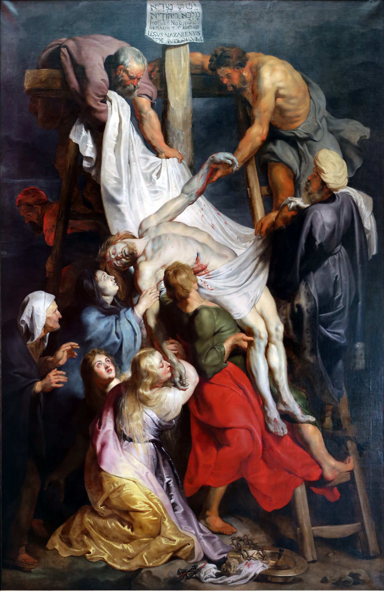
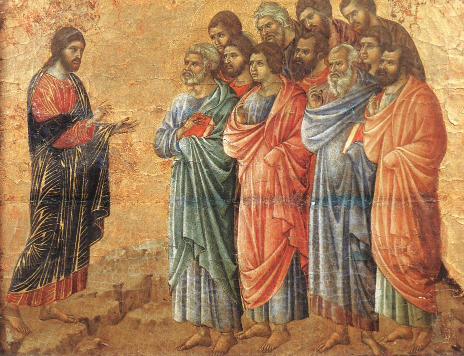

<!-- toc -->

- [July 01, 2025](#july-01-2025)
  - [Shared Sacrifice](#shared-sacrifice)
  - [AI-Generated Summary: The Weight of the Cross and the Willing Heart](#ai-generated-summary-the-weight-of-the-cross-and-the-willing-heart)
  - [Raphael's Christ Falls on the Way to Calvary, a painting depicting Christ stumbling under the cross with Mary and a crowd witnessing](#raphaels-christ-falls-on-the-way-to-calvary-a-painting-depicting-christ-stumbling-under-the-cross-with-mary-and-a-crowd-witnessing)
- [July 02, 2025](#july-02-2025)
  - [Love Poured Out](#love-poured-out)
  - [AI-Generated Summary: The Sorrow and the Glory in Rubens' Descent](#ai-generated-summary-the-sorrow-and-the-glory-in-rubens-descent)
  - [The Descent from the Cross (1616-1617) by Rubens: A dynamic, dramatic depiction of Christ's descent](#the-descent-from-the-cross-1616-1617-by-rubens-a-dynamic-dramatic-depiction-of-christs-descent)
- [July 03, 2025](#july-03-2025)
  - [Beyond the Tomb](#beyond-the-tomb)
  - [AI-Generated Summary: The Dawn of Redemption](#ai-generated-summary-the-dawn-of-redemption)
  - [The Three Marys at the Tomb by Annibale Carracci, 17th century at Hermitage Museum, reveals Baroque vividness and drama](#the-three-marys-at-the-tomb-by-annibale-carracci-17th-century-at-hermitage-museum-reveals-baroque-vividness-and-drama)
- [July 04, 2025](#july-04-2025)
  - [Proclaiming Christ](#proclaiming-christ)
  - [AI-Generated Summary: The Divine Commission and the Art of Witness](#ai-generated-summary-the-divine-commission-and-the-art-of-witness)
  - [Christ Taking Leave of the Apostles by Duccio, 14th century, Museo dell'Opera, tempera on wood, Gothic details](#christ-taking-leave-of-the-apostles-by-duccio-14th-century-museo-dellopera-tempera-on-wood-gothic-details)
- [July 05, 2025](#july-05-2025)
  - [Power From On High](#power-from-on-high)
  - [AI-Generated Summary: The Divine Gift and the Art of Waiting](#ai-generated-summary-the-divine-gift-and-the-art-of-waiting)
  - [Pentecost by Simone Peterzano, 16th century](#pentecost-by-simone-peterzano-16th-century)
- [July 06, 2025](#july-06-2025)
  - [God is Never Outdone](#god-is-never-outdone)
  - [AI-Generated Summary: The Divine Exchange Between Mother and Son](#ai-generated-summary-the-divine-exchange-between-mother-and-son)

<!-- tocstop -->

# July 2025

RIAY July 2025

## July 01, 2025

### Shared Sacrifice

### AI-Generated Summary: The Weight of the Cross and the Willing Heart

In Raphael’s _Christ Falls on the Way to Calvary_, we witness not merely a scene of suffering, but a moment where divine and human wills converge with terrible beauty. Here, the Savior stumbles beneath the cross, His thorn-crowned head bowed, yet His gaze meets His mother’s—a silent exchange of sorrow and surrender. The painting’s vertical composition, a departure from tradition, draws the eye upward, as if to remind us that this agony is not an end, but a lifting.

The crowd presses in, a tumult of violence and urgency: soldiers with banners like streaks of blood, a stranger straining to bear the cross’s weight, two other condemned men trudging toward Golgotha. Yet at the center, Mary stands, her arms outstretched—not in helpless despair, but in a posture of offering. Does she, too, utter in her heart, _Not my will, but Thine_? Raphael captures this mystery—that love’s deepest work is often done in letting go.

Pope John Paul II once spoke of Mary’s _fiat_ at the cross, her active participation in the work of redemption. She does not flee or protest, but stands as both mother and disciple, her suffering woven into the fabric of grace. And so the painting becomes an icon of the Christian life: to bear what we must, to yield what we love, and to trust that in the breaking, something holy is made whole. Let us remember, then, when we see this image, that the road to Calvary is walked not alone, but with a Mother’s tears mingled with the Savior’s blood.

### Raphael's Christ Falls on the Way to Calvary, a painting depicting Christ stumbling under the cross with Mary and a crowd witnessing

## July 02, 2025

### Love Poured Out

### AI-Generated Summary: The Sorrow and the Glory in Rubens' Descent

Consider, dear reader, _The Descent from the Cross_ by Peter Paul Rubens—a masterwork where agony and reverence meet. Painted in 1617, it is Baroque in spirit: a tempest of emotion, yet ordered by a classical restraint. The sky broods navy; the cross looms heavy; and there, pale as moonlight, lies the body of Christ, lowered with trembling care by those who loved Him. His wounds weep; His flesh is drained of life. The Virgin, robed in sorrow’s blue, stretches trembling hands toward her Son—her grief quiet, yet deeper than the sea.

Rubens, that Flemish giant, knew well how light and shadow might preach. Here, chiaroscuro carves the scene with divine drama, each fold of cloth, each anguished face, a testament to the weight of love’s sacrifice. Yet observe: though the painting spares us not the horror of the Cross, it does not wallow. Even in death, there is dignity; in Mary’s gaze, a hope that pierces the dark.

And what of the saints’ whispers woven through these reflections? Bernard speaks of Christ the Bridegroom, His blood our dowry; Bonaventure, of the heart pierced wide for the soul’s rest. This is the paradox: that suffering so brutal should birth mercy so boundless. The artist shows us the wound, yes, but also the love that bled from it—a love no grave could hold.

So let the painting speak: in every shadow, a promise; in every tear, a dawn unseen. For if Mary, with her Son cold in her arms, could yet trust, then surely we, in lesser griefs, may take heart. The Cross is not the end—only the harrowing path by which Love climbs back to reclaim us.

### The Descent from the Cross (1616-1617) by Rubens: A dynamic, dramatic depiction of Christ's descent

 by Rubens: A dynamic, dramatic depiction of Christ's descent")

## July 03, 2025

### Beyond the Tomb

### AI-Generated Summary: The Dawn of Redemption

Behold _The Holy Women at Christ’s Tomb_ by Annibale Carracci, a masterwork where the solemnity of the Resurrection meets the vigor of the Baroque. Here, in the hushed light of dawn, three women—clad in robes of red, blue, and gold—stand transfixed before an angel, whose radiant form and outstretched hand declare the unthinkable: the tomb is empty. The painter, with a craftsman’s precision and a poet’s heart, captures their awe in every fold of fabric, every startled glance.

And yet, is it not strange that Scripture speaks little of Mary, the Lord’s own mother, in these post-Resurrection accounts? Perhaps, as some have whispered, she knew the truth before the others—her sorrow turned to joy in solitude. Carracci’s scene, though silent, thrums with that same mystery: the moment when despair is overturned, and the world, though unchanged to the eye, is made new.

(Note: The second painting, attributed in error to "Anabal Karachi," is but a shadow of the first—lacking detail, its merit lies only in the faint echo of the greater work.)

### The Three Marys at the Tomb by Annibale Carracci, 17th century at Hermitage Museum, reveals Baroque vividness and drama

## July 04, 2025

### Proclaiming Christ

### AI-Generated Summary: The Divine Commission and the Art of Witness

Behold Duccio’s _Appearance on the Mountain in Galilee_, where the risen Christ, clad in crimson and blue, stands upon a golden hill, His hands aloft in blessing and command. The apostles, each face a story of awe, gather on the rough slope below—youth beside elder, all knit by wonder. Here is Byzantium’s glory softened by Gothic tenderness, a meeting of heaven’s gold and earth’s muted tones. The mountain, though stylized, hints at depth, as if the very ground strains to bear the weight of this moment: the Master’s charge to carry His word to all nations.

Yet the painting is but a shadow of the truth it points to—that every believer, then and now, is called to the same sacred work. To know Christ is to make Him known; to love Him is to speak of Him. When last did your lips shape His name for another’s sake? To the lapsed, the weary, the doubting? Take heart: the same Lord who stood on that mountain walks with you still, His presence your courage, His Spirit your words. Pray for the readiness of a disciple, that when the moment comes, you may say, like Peter, _"Lord, You know I love You,"_ and go.

### Christ Taking Leave of the Apostles by Duccio, 14th century, Museo dell'Opera, tempera on wood, Gothic details

## July 05, 2025

### Power From On High

### AI-Generated Summary: The Divine Gift and the Art of Waiting

Consider, dear reader, how the world prizes power seized by force—the clenched fist, the towering edifice, the self-made triumph. Yet Heaven’s economy operates otherwise. True power descends as a gift, like the tongues of flame at Pentecost, alighting only on those who wait with open hands. Simone Peterzano’s _Pentecost_ captures this mystery: the Virgin, still and expectant, bathed in golden light; the disciples, their faces upturned as the Dove’s radiance pierces the dark. Here is Mannerist drama indeed—not of human striving, but divine generosity.

Lent teaches us to labor; Easter, to receive. The world clamors for control, but the Christian kneels, knowing that every true strength—like those painted flames above each head—comes not by our cunning, but by grace. To wait is not idleness; it is the soul’s posture before the Giver of all good things.

### Pentecost by Simone Peterzano, 16th century

.jpg> "Pentecost by Simone Peterzano, 16th century")

## July 06, 2025

### God is Never Outdone

### AI-Generated Summary: The Divine Exchange Between Mother and Son

Consider the _Assumption of Mary_, that radiant work in Burgos Cathedral, where glass and light conspire to tell a tale older than the world. Here, the Virgin ascends, haloed in gold, borne upon azure clouds by angels whose wings are fragments of heaven’s own palette. Below, two saints tend a garden where a tomb lies empty—a silent witness to the victory she now shares. The disciples gaze upward, their faces alight with wonder, as Gothic tracery weaves their awe into the very stone.

Now mark the deeper truth: as Mary once clothed the Christ-child in swaddling bands, so He, transfigured, wore a garment “dazzling white”—some say of her making. What poetry in this! For as she gave Him flesh, He returns to her the raiment of divinity. Augustine saw it plainly: His flesh was hers; now His glory is hers. She who nursed Him, mourned Him, offered Him up, is herself lifted up, dressed in light, assumed beyond the reach of death.

This is the law of Heaven’s economy: give all, receive more. Mary gave her Son the humble service of a mother; He gives her the splendor of a queen. And so it is with all who follow Him—what we surrender, He transfigures; what we offer in love, He crowns with eternity. The Assumption is but the firstfruits of a harvest meant for us all.
