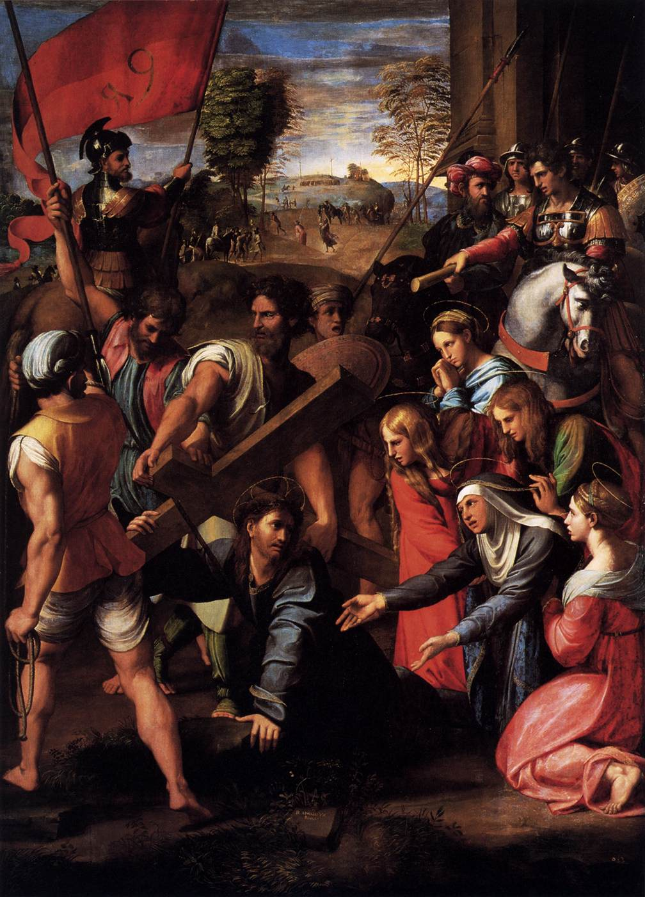
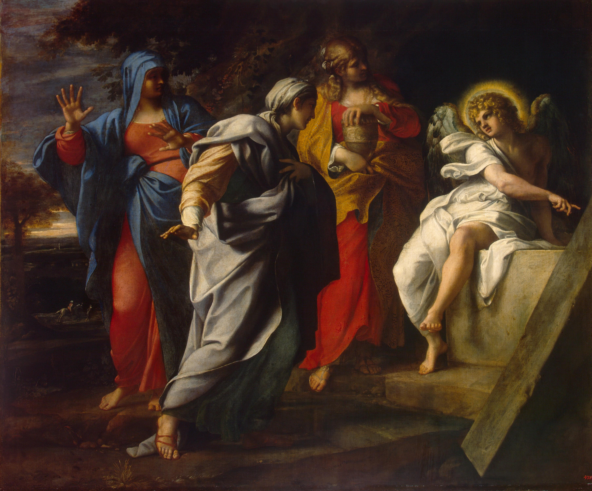
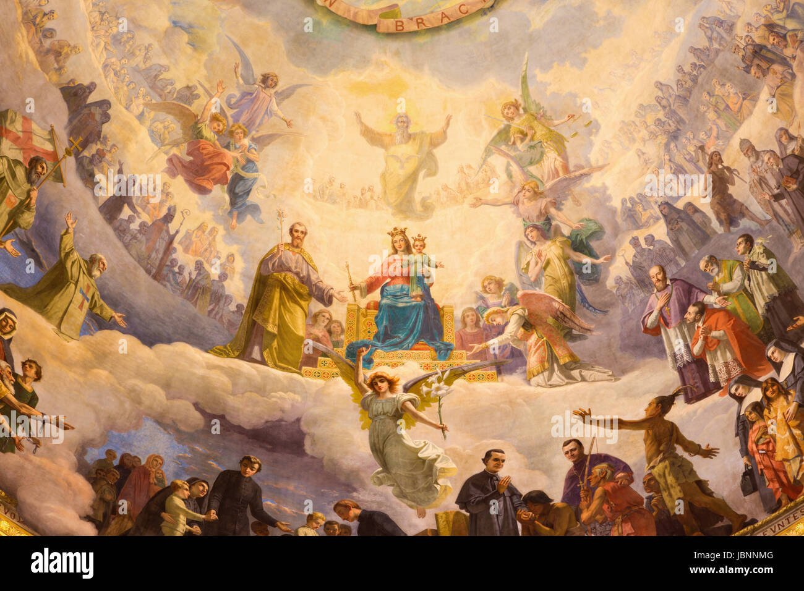
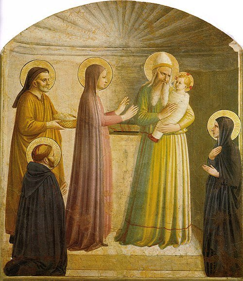
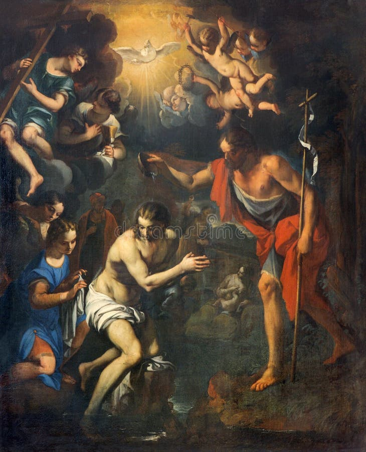
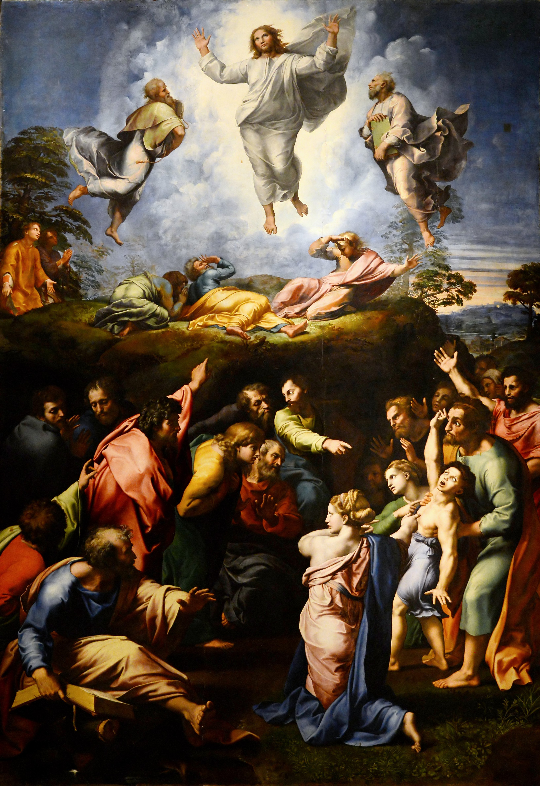
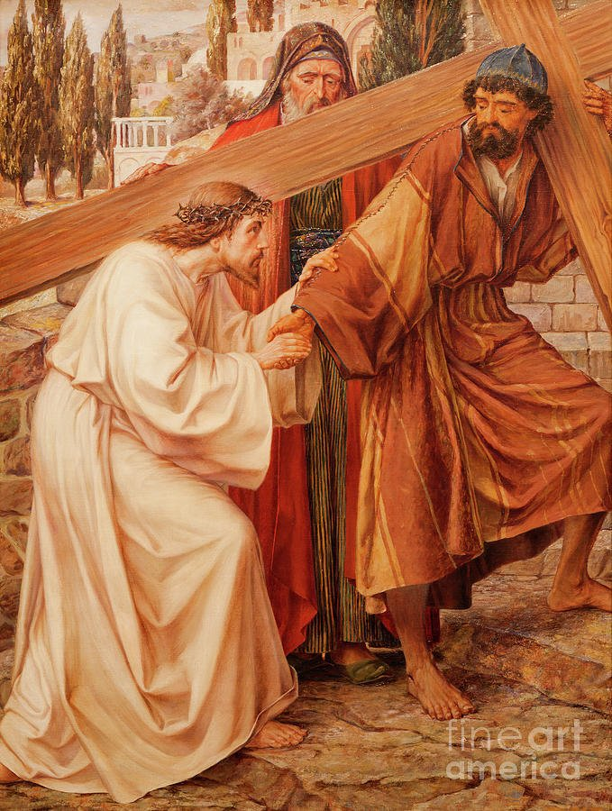
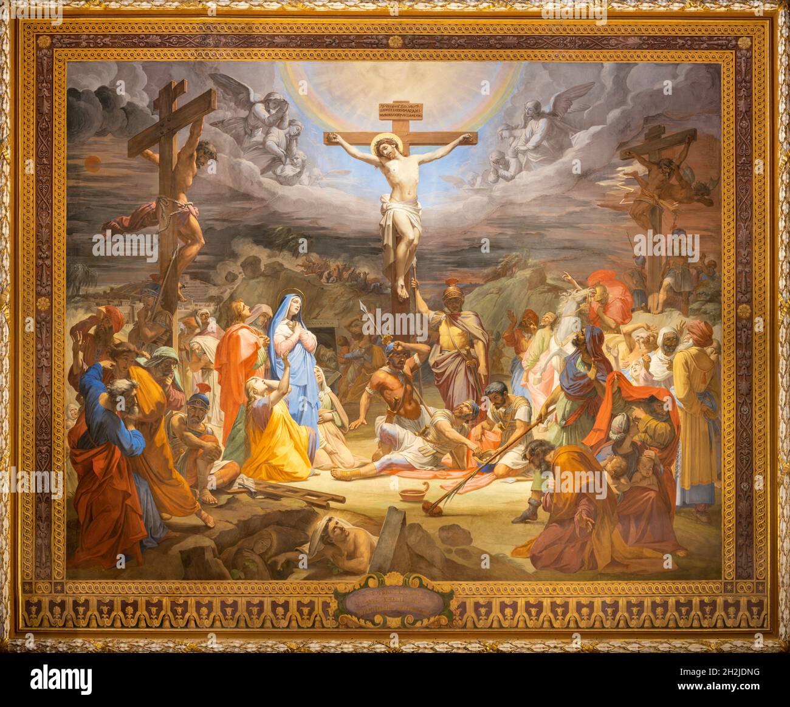
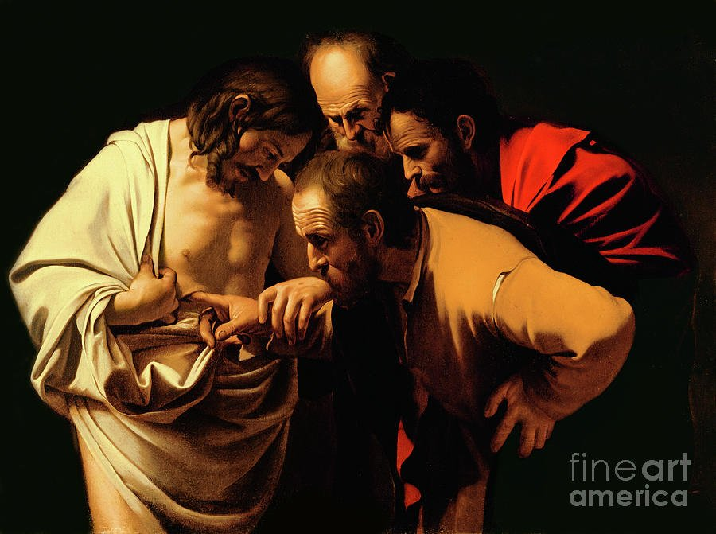

<!-- toc -->

- [July 01, 2025](#july-01-2025)
  - [Shared Sacrifice](#shared-sacrifice)
  - [AI-Generated Summary: The Weight of the Cross and the Willing Heart](#ai-generated-summary-the-weight-of-the-cross-and-the-willing-heart)
  - [Raphael's Christ Falls on the Way to Calvary, a painting depicting Christ stumbling under the cross with Mary and a crowd witnessing](#raphaels-christ-falls-on-the-way-to-calvary-a-painting-depicting-christ-stumbling-under-the-cross-with-mary-and-a-crowd-witnessing)
- [July 02, 2025](#july-02-2025)
  - [Love Poured Out](#love-poured-out)
  - [AI-Generated Summary: The Sorrow and the Glory in Rubens' Descent](#ai-generated-summary-the-sorrow-and-the-glory-in-rubens-descent)
  - [The Descent from the Cross (1616-1617) by Rubens: A dynamic, dramatic depiction of Christ's descent](#the-descent-from-the-cross-1616-1617-by-rubens-a-dynamic-dramatic-depiction-of-christs-descent)
- [July 03, 2025](#july-03-2025)
  - [Beyond the Tomb](#beyond-the-tomb)
  - [AI-Generated Summary: The Dawn of Redemption](#ai-generated-summary-the-dawn-of-redemption)
  - [The Three Marys at the Tomb by Annibale Carracci, 17th century at Hermitage Museum, reveals Baroque vividness and drama](#the-three-marys-at-the-tomb-by-annibale-carracci-17th-century-at-hermitage-museum-reveals-baroque-vividness-and-drama)
- [July 04, 2025](#july-04-2025)
  - [Proclaiming Christ](#proclaiming-christ)
  - [AI-Generated Summary: The Divine Commission and the Art of Witness](#ai-generated-summary-the-divine-commission-and-the-art-of-witness)
  - [Christ Taking Leave of the Apostles by Duccio, 14th century, Museo dell'Opera, tempera on wood, Gothic details](#christ-taking-leave-of-the-apostles-by-duccio-14th-century-museo-dellopera-tempera-on-wood-gothic-details)
- [July 05, 2025](#july-05-2025)
  - [Power From On High](#power-from-on-high)
  - [AI-Generated Summary: The Divine Gift and the Art of Waiting](#ai-generated-summary-the-divine-gift-and-the-art-of-waiting)
  - [Simone Peterzano's Pentecost depicts the Virgin and disciples receiving the Holy Spirit in Mannerist style (Stock Image)](#simone-peterzanos-pentecost-depicts-the-virgin-and-disciples-receiving-the-holy-spirit-in-mannerist-style-stock-image)
- [July 06, 2025](#july-06-2025)
  - [God is Never Outdone](#god-is-never-outdone)
  - [AI-Generated Summary: The Divine Exchange Between Mother and Son](#ai-generated-summary-the-divine-exchange-between-mother-and-son)
  - [The Divine Exchange Between Mother and Son (Stock Image)](#the-divine-exchange-between-mother-and-son-stock-image)
- [July 07, 2025](#july-07-2025)
  - [Gifts for Mary](#gifts-for-mary)
  - [AI-Generated Summary: The Celestial Coronation and the Quiet Heart](#ai-generated-summary-the-celestial-coronation-and-the-quiet-heart)
  - [Mary, Help of Christians by Giuseppe Rollini (Stock Image)](#mary-help-of-christians-by-giuseppe-rollini-stock-image)
- [July 08, 2025](#july-08-2025)
  - [Bonus: Introduction to Phase Four: “Finding Focus” — The Rosary in a Year (with Fr. Mark-Mary Ames)](#bonus-introduction-to-phase-four-finding-focus--the-rosary-in-a-year-with-fr-mark-mary-ames)
  - [AI-Generated Summary: The Quiet Work of Prayer](#ai-generated-summary-the-quiet-work-of-prayer)
  - [Beginning Our Meditation](#beginning-our-meditation)
  - [AI-Generated Summary: The Humble Astonishment of the Annunciation](#ai-generated-summary-the-humble-astonishment-of-the-annunciation)
  - [The Annunciation by Fra Angelico, 1440s, at San Marco, Florence A serene fresco masterpiece of divine grace](#the-annunciation-by-fra-angelico-1440s-at-san-marco-florence-a-serene-fresco-masterpiece-of-divine-grace)
- [July 09, 2025](#july-09-2025)
  - [Returning to the Visitation](#returning-to-the-visitation)
  - [AI-Generated Summary: The New Ark and the Song of Joy](#ai-generated-summary-the-new-ark-and-the-song-of-joy)
  - [Mary's Magnificat](#marys-magnificat)
- [July 10, 2025](#july-10-2025)
  - [Unworthy Yet Welcomed](#unworthy-yet-welcomed)
  - [AI-Generated Summary: The Timeless Joy of the Nativity](#ai-generated-summary-the-timeless-joy-of-the-nativity)
  - [Baroque Nativity scene by Pellegrini, depicting divine joy with mother and child (Stock Image)](#baroque-nativity-scene-by-pellegrini-depicting-divine-joy-with-mother-and-child-stock-image)
- [July 11, 2025](#july-11-2025)
  - [A Renewed 'Yes'](#a-renewed-yes)
  - [AI-Generated Summary: The Stillness in the Storm](#ai-generated-summary-the-stillness-in-the-storm)
  - [Fra Angelico's Simeon with the Child Jesus: Temple scene](#fra-angelicos-simeon-with-the-child-jesus-temple-scene)
- [July 12, 2025](#july-12-2025)
  - [Faith in the Silence](#faith-in-the-silence)
  - [AI-Generated Summary: The Divine Pursuit in the Temple](#ai-generated-summary-the-divine-pursuit-in-the-temple)
  - [Jesus teaching in the temple as a 12-year-old](#jesus-teaching-in-the-temple-as-a-12-year-old)
- [July 13, 2025](#july-13-2025)
  - [Beloved Sons and Daughters](#beloved-sons-and-daughters)
  - [AI-Generated Summary: The Sacred Waters and the Beloved Son](#ai-generated-summary-the-sacred-waters-and-the-beloved-son)
  - [Fresco depicting the Baptism of Christ (Stock Image)](#fresco-depicting-the-baptism-of-christ-stock-image)
- [July 14, 2025](#july-14-2025)
  - [New Wine, New Life](#new-wine-new-life)
  - [AI-Generated Summary: The Divine Bridegroom and the Miracle at Cana](#ai-generated-summary-the-divine-bridegroom-and-the-miracle-at-cana)
  - [Carl Bloch's The Wedding at Cana depicts the miracle of turning water into wine](#carl-blochs-the-wedding-at-cana-depicts-the-miracle-of-turning-water-into-wine)
- [July 15, 2025](#july-15-2025)
  - [Invited to the Kingdom](#invited-to-the-kingdom)
  - [AI-Generated Summary: The Kingdom and the Storm](#ai-generated-summary-the-kingdom-and-the-storm)
  - [Rembrandt's Christ in the Storm on the Sea of Galilee depicts a biblical scene of Christ calming the storm](#rembrandts-christ-in-the-storm-on-the-sea-of-galilee-depicts-a-biblical-scene-of-christ-calming-the-storm)
- [July 16, 2025](#july-16-2025)
  - [Mystery of Light](#mystery-of-light)
  - [AI-Generated Summary: The Light That Comes From Within](#ai-generated-summary-the-light-that-comes-from-within)
  - [The Transfiguration by Raphael depicts Christ with Moses and Elijah](#the-transfiguration-by-raphael-depicts-christ-with-moses-and-elijah)
- [July 17, 2025](#july-17-2025)
  - [The Love of Jesus](#the-love-of-jesus)
  - [AI-Generated Summary: The Divine Ingenuity of Love](#ai-generated-summary-the-divine-ingenuity-of-love)
  - [The Last Supper by Giacomo Raphaeli, a mosaic depicting Christ's calm before the cross](#the-last-supper-by-giacomo-raphaeli-a-mosaic-depicting-christs-calm-before-the-cross)
- [July 18, 2025](#july-18-2025)
  - [What the Garden Reveals](#what-the-garden-reveals)
  - [AI-Generated Summary: The Choice Between Rebellion and Obedience](#ai-generated-summary-the-choice-between-rebellion-and-obedience)
  - [Vicente Macip's depiction of Jesus in the Garden of Gethsemane (Stock Image)](#vicente-macips-depiction-of-jesus-in-the-garden-of-gethsemane-stock-image)
- [July 19, 2025](#july-19-2025)
  - [Glory Hidden in Suffering](#glory-hidden-in-suffering)
  - [AI-Generated Summary: The Scourging and the Prodigal](#ai-generated-summary-the-scourging-and-the-prodigal)
  - [The Flagellation by Agostino Ciampelli, a fresco depicting the scourging of Christ](#the-flagellation-by-agostino-ciampelli-a-fresco-depicting-the-scourging-of-christ)
- [July 20, 2025](#july-20-2025)
  - [Thorns for Love](#thorns-for-love)
  - [AI-Generated Summary: The Mockery of Kings and the Sovereignty of Suffering](#ai-generated-summary-the-mockery-of-kings-and-the-sovereignty-of-suffering)
  - [Titian’s painting of The Crowning with Thorns located in Louvre Museum, Paris (Stock Image)](#titians-painting-of-the-crowning-with-thorns-located-in-louvre-museum-paris-stock-image)
- [July 21, 2025](#july-21-2025)
  - [Scapegoat and Savior](#scapegoat-and-savior)
  - [AI-Generated Summary: The Weight of Glory in Bearing the Cross](#ai-generated-summary-the-weight-of-glory-in-bearing-the-cross)
  - [A moment of divine inspiration captured in sacred art (Stock Image)](#a-moment-of-divine-inspiration-captured-in-sacred-art-stock-image)
- [July 22, 2025](#july-22-2025)
  - [God's Relentless Pursuit](#gods-relentless-pursuit)
  - [AI-Generated Summary: The Divine Embrace and the Rainbow of Promise](#ai-generated-summary-the-divine-embrace-and-the-rainbow-of-promise)
  - [Fresco of Crucifixion in the church San Girolamo dei Croati by Pietro Gagliardi (1847-1852) (Stock Image)](#fresco-of-crucifixion-in-the-church-san-girolamo-dei-croati-by-pietro-gagliardi-1847-1852-stock-image)
- [July 23, 2025](#july-23-2025)
  - [Transcending Death](#transcending-death)
  - [AI-Generated Summary: The Dawn of Everlasting Life](#ai-generated-summary-the-dawn-of-everlasting-life)
  - [Caravaggio’s The Incredulity of Saint Thomas (Stock Image)](#caravaggios-the-incredulity-of-saint-thomas-stock-image)

<!-- tocstop -->

# July 2025

RIAY July 2025

## July 01, 2025

### Shared Sacrifice

### AI-Generated Summary: The Weight of the Cross and the Willing Heart

In Raphael’s _Christ Falls on the Way to Calvary_, we witness not merely a scene of suffering, but a moment where divine and human wills converge with terrible beauty. Here, the Savior stumbles beneath the cross, His thorn-crowned head bowed, yet His gaze meets His mother’s—a silent exchange of sorrow and surrender. The painting’s vertical composition, a departure from tradition, draws the eye upward, as if to remind us that this agony is not an end, but a lifting.

The crowd presses in, a tumult of violence and urgency: soldiers with banners like streaks of blood, a stranger straining to bear the cross’s weight, two other condemned men trudging toward Golgotha. Yet at the center, Mary stands, her arms outstretched—not in helpless despair, but in a posture of offering. Does she, too, utter in her heart, _Not my will, but Thine_? Raphael captures this mystery—that love’s deepest work is often done in letting go.

Pope John Paul II once spoke of Mary’s _fiat_ at the cross, her active participation in the work of redemption. She does not flee or protest, but stands as both mother and disciple, her suffering woven into the fabric of grace. And so the painting becomes an icon of the Christian life: to bear what we must, to yield what we love, and to trust that in the breaking, something holy is made whole. Let us remember, then, when we see this image, that the road to Calvary is walked not alone, but with a Mother’s tears mingled with the Savior’s blood.

### Raphael's Christ Falls on the Way to Calvary, a painting depicting Christ stumbling under the cross with Mary and a crowd witnessing

## July 02, 2025

### Love Poured Out

### AI-Generated Summary: The Sorrow and the Glory in Rubens' Descent

Consider, dear reader, _The Descent from the Cross_ by Peter Paul Rubens—a masterwork where agony and reverence meet. Painted in 1617, it is Baroque in spirit: a tempest of emotion, yet ordered by a classical restraint. The sky broods navy; the cross looms heavy; and there, pale as moonlight, lies the body of Christ, lowered with trembling care by those who loved Him. His wounds weep; His flesh is drained of life. The Virgin, robed in sorrow’s blue, stretches trembling hands toward her Son—her grief quiet, yet deeper than the sea.

Rubens, that Flemish giant, knew well how light and shadow might preach. Here, chiaroscuro carves the scene with divine drama, each fold of cloth, each anguished face, a testament to the weight of love’s sacrifice. Yet observe: though the painting spares us not the horror of the Cross, it does not wallow. Even in death, there is dignity; in Mary’s gaze, a hope that pierces the dark.

And what of the saints’ whispers woven through these reflections? Bernard speaks of Christ the Bridegroom, His blood our dowry; Bonaventure, of the heart pierced wide for the soul’s rest. This is the paradox: that suffering so brutal should birth mercy so boundless. The artist shows us the wound, yes, but also the love that bled from it—a love no grave could hold.

So let the painting speak: in every shadow, a promise; in every tear, a dawn unseen. For if Mary, with her Son cold in her arms, could yet trust, then surely we, in lesser griefs, may take heart. The Cross is not the end—only the harrowing path by which Love climbs back to reclaim us.

### The Descent from the Cross (1616-1617) by Rubens: A dynamic, dramatic depiction of Christ's descent

 by Rubens: A dynamic, dramatic depiction of Christ's descent")

## July 03, 2025

### Beyond the Tomb

### AI-Generated Summary: The Dawn of Redemption

Behold _The Holy Women at Christ’s Tomb_ by Annibale Carracci, a masterwork where the solemnity of the Resurrection meets the vigor of the Baroque. Here, in the hushed light of dawn, three women—clad in robes of red, blue, and gold—stand transfixed before an angel, whose radiant form and outstretched hand declare the unthinkable: the tomb is empty. The painter, with a craftsman’s precision and a poet’s heart, captures their awe in every fold of fabric, every startled glance.

And yet, is it not strange that Scripture speaks little of Mary, the Lord’s own mother, in these post-Resurrection accounts? Perhaps, as some have whispered, she knew the truth before the others—her sorrow turned to joy in solitude. Carracci’s scene, though silent, thrums with that same mystery: the moment when despair is overturned, and the world, though unchanged to the eye, is made new.

(Note: The second painting, attributed in error to "Anabal Karachi," is but a shadow of the first—lacking detail, its merit lies only in the faint echo of the greater work.)

### The Three Marys at the Tomb by Annibale Carracci, 17th century at Hermitage Museum, reveals Baroque vividness and drama

## July 04, 2025

### Proclaiming Christ

### AI-Generated Summary: The Divine Commission and the Art of Witness

Behold Duccio’s _Appearance on the Mountain in Galilee_, where the risen Christ, clad in crimson and blue, stands upon a golden hill, His hands aloft in blessing and command. The apostles, each face a story of awe, gather on the rough slope below—youth beside elder, all knit by wonder. Here is Byzantium’s glory softened by Gothic tenderness, a meeting of heaven’s gold and earth’s muted tones. The mountain, though stylized, hints at depth, as if the very ground strains to bear the weight of this moment: the Master’s charge to carry His word to all nations.

Yet the painting is but a shadow of the truth it points to—that every believer, then and now, is called to the same sacred work. To know Christ is to make Him known; to love Him is to speak of Him. When last did your lips shape His name for another’s sake? To the lapsed, the weary, the doubting? Take heart: the same Lord who stood on that mountain walks with you still, His presence your courage, His Spirit your words. Pray for the readiness of a disciple, that when the moment comes, you may say, like Peter, _"Lord, You know I love You,"_ and go.

### Christ Taking Leave of the Apostles by Duccio, 14th century, Museo dell'Opera, tempera on wood, Gothic details

## July 05, 2025

### Power From On High

### AI-Generated Summary: The Divine Gift and the Art of Waiting

Consider, dear reader, how the world prizes power seized by force—the clenched fist, the towering edifice, the self-made triumph. Yet Heaven’s economy operates otherwise. True power descends as a gift, like the tongues of flame at Pentecost, alighting only on those who wait with open hands. Simone Peterzano’s _Pentecost_ captures this mystery: the Virgin, still and expectant, bathed in golden light; the disciples, their faces upturned as the Dove’s radiance pierces the dark. Here is Mannerist drama indeed—not of human striving, but divine generosity.

Lent teaches us to labor; Easter, to receive. The world clamors for control, but the Christian kneels, knowing that every true strength—like those painted flames above each head—comes not by our cunning, but by grace. To wait is not idleness; it is the soul’s posture before the Giver of all good things.

### Simone Peterzano's Pentecost depicts the Virgin and disciples receiving the Holy Spirit in Mannerist style (Stock Image)

## July 06, 2025

### God is Never Outdone

### AI-Generated Summary: The Divine Exchange Between Mother and Son

Consider the _Assumption of Mary_, that radiant work in Burgos Cathedral, where glass and light conspire to tell a tale older than the world. Here, the Virgin ascends, haloed in gold, borne upon azure clouds by angels whose wings are fragments of heaven’s own palette. Below, two saints tend a garden where a tomb lies empty—a silent witness to the victory she now shares. The disciples gaze upward, their faces alight with wonder, as Gothic tracery weaves their awe into the very stone.

Now mark the deeper truth: as Mary once clothed the Christ-child in swaddling bands, so He, transfigured, wore a garment “dazzling white”—some say of her making. What poetry in this! For as she gave Him flesh, He returns to her the raiment of divinity. Augustine saw it plainly: His flesh was hers; now His glory is hers. She who nursed Him, mourned Him, offered Him up, is herself lifted up, dressed in light, assumed beyond the reach of death.

This is the law of Heaven’s economy: give all, receive more. Mary gave her Son the humble service of a mother; He gives her the splendor of a queen. And so it is with all who follow Him—what we surrender, He transfigures; what we offer in love, He crowns with eternity. The Assumption is but the firstfruits of a harvest meant for us all.

### The Divine Exchange Between Mother and Son (Stock Image)

## July 07, 2025

### Gifts for Mary

### AI-Generated Summary: The Celestial Coronation and the Quiet Heart

Behold a vision of heavenly splendor, where the Mother of God is enthroned in glory, crowned as Queen of Heaven, her Son, the Christ Child, radiant upon her lap. Giuseppe Rolini, with a master’s hand, has rendered this truth in fresco—_Mary, Help of Christians_—where academic precision meets the fire of Baroque grandeur, all bathed in hues both solemn and sublime.

Here, saints and angels gather as witnesses: Joseph, pure as the lily he bears; martyrs and confessors from every age; and above them all, the Eternal Father, His light uncreated, the Dove hovering at His breast. The clouds glow as if lit from within, and the procession stretches beyond sight, a reminder that this glory is but a glimpse of what awaits the faithful.

Yet let us not mistake spectacle for substance. The true lesson lies not merely in the painting’s majesty, but in the quiet heart that gazes upon it—a heart at rest in gratitude, turning from the noise of the world to the beauty that points beyond itself. For in such moments, we are given a foretaste of that eternal communion where every saint, every soul, finds its home.

### Mary, Help of Christians by Giuseppe Rollini (Stock Image)

## July 08, 2025

### Bonus: Introduction to Phase Four: “Finding Focus” — The Rosary in a Year (with Fr. Mark-Mary Ames)

")

### AI-Generated Summary: The Quiet Work of Prayer

You will find, dear reader, that the soul’s conversation with Heaven is not measured in words but in weight—the weight of love, of longing, of quiet surrender. The world, with its clamor and haste, would have us believe that prayer is but another task to be checked off, like the counting of beads without the heart’s attendance. But this is folly. Even the briefest lifting of the mind to God, if done with a child’s trust, is worth more than a thousand rote repetitions.

Commitment, you see, is the scaffold, but devotion is the life within it. A man may vow himself to duty, yet without love, it becomes a chain. But when love is the keeper of the vow—ah, then the yoke is easy. So it is with prayer. The saints whisper to us across the ages: let your words be few, but let your heart be vast. Enter the stillness where God waits, not as a taskmaster, but as the One who says, "Come to Me."

And if distractions come (as they will), do not fret. Bring them, too, into your offering. For the God who made the world delights in the small, the stumbling, the sincere. A mother does not scorn her child’s fumbling gift; neither does Heaven despise the heart that tries.

Here, then, is the secret: to pray is not to perform, but to be present—to take all that you are, all that burdens or delights you, and lay it gently in the hands that hold the stars.

### Beginning Our Meditation

### AI-Generated Summary: The Humble Astonishment of the Annunciation

Consider, dear reader, the scene so tenderly rendered by Fra Angelico: a young maiden and a celestial messenger, each bowing in mutual reverence. Here is no spectacle of earthly power, but a quiet revolution—the moment the Infinite chose to dwell within the finite. Mary’s question, _“How can this be?”_ is not doubt, but the rightful wonder of a heart confronted with the impossible made possible by God.

Gabriel’s reply—_“Nothing is impossible with God”_—is the thread that stitches heaven to earth. In that fresco at San Marco, we see it: humility meeting grace, the divine condescension that bends low to lift us high. The Annunciation is not merely a past event, but an eternal truth—that God still enters the ordinary, if we, like Mary, have the courage to say _“Let it be.”_

And so the Incarnation begins, not with fanfare, but with a whisper, a surrender, a joy that would undo the world’s sorrow.

### The Annunciation by Fra Angelico, 1440s, at San Marco, Florence A serene fresco masterpiece of divine grace

## July 09, 2025

### Returning to the Visitation

### AI-Generated Summary: The New Ark and the Song of Joy

Consider, dear reader, how Mary, bearing the Eternal Word within her, becomes the true Ark of the Covenant—not of stone and gold, but of flesh and devotion. As the Ark once carried the presence of God to Israel, so Mary carries Christ into the world, a living sanctuary.

In the Visitation, we see this mystery unfold with radiant simplicity. Mary, having received the angel’s tidings, hastens to Elizabeth, and at their meeting, joy overflows into poetry. Words alone could not suffice; the soul must sing. Thus, the Magnificat springs forth, not as mere speech, but as a hymn—proof that the deepest truths demand the elevation of song.

Here, too, we learn of Mary’s charity. St. Alphonsus reminds us that her journey to Elizabeth was no small act, but a labor of love, a mother’s kindness extended before she had yet held her own Child. And so, in our own need, we may rightly echo St. Mother Teresa’s plea: _"Mary, be a mother to me now."_ For she who bore the Savior does not cease to bear us to Him.

### Mary's Magnificat

The Prayer Of Mary

My soul proclaims the greatness of the Lord,
my spirit rejoices in God my Savior
for he has looked with favor on his lowly servant.
From this day all generations will call me blessed:
the Almighty has done great things for me,
and holy is his Name.

He has mercy on those who fear him
in every generation.
He has shown the strength of his arm,
he has scattered the proud in their conceit.

He has cast down the mighty from their thrones,
and has lifted up the lowly.
He has filled the hungry with good things,
and the rich he has sent away empty.

He has come to the help of his servant Israel
for he remembered his promise of mercy,
the promise he made to our fathers,
to Abraham and his children forever.

(Lk 1: 46-55)

Magnificat anima mea Dominum;
Et exultavit spiritus meus in Deo salutari meo,
Quia respexit humilitatem ancillae suae; ecce enim ex hoc beatam me dicent omnes generationes.
Quia fecit mihi magna qui potens est, et sanctum nomen ejus, Et misericordia ejus a progenie in progenies timentibus eum.
Fecit potentiam brachio suo;
Dispersit superbos mente cordis sui.
Deposuit potentes de sede, et exaltavit humiles.
Esurientes implevit bonis, et divites dimisit inanes.
Sucepit Israel, puerum suum, recordatus misericordiae suae, Sicut locutus est ad patres nostros, Abraham et semeni ejus in saecula.

Source: [The Magnificat](https://www.ewtn.com/catholicism/devotions/magnificat-392)

## July 10, 2025

### Unworthy Yet Welcomed

### AI-Generated Summary: The Timeless Joy of the Nativity

Consider, dear reader, the scene laid before us: a humble stable, a mother’s tender gaze, a child wrapped in swaddling clothes—the very Word made flesh. Here is no sorrow, no shadow of regret, but pure, unblemished joy, as if heaven itself had stooped to kiss the earth. The artist Pellegrini, with his Baroque brush, captures not merely an event but an eternal truth: the divine has entered our frailty, and in that entering, all grief is undone.

Fitz, that man overwhelmed by an unlooked-for gift, mirrors what every soul ought to feel before the manger—a joy so sharp it borders on pain, for it is the joy of one who knows he is unworthy yet is loved all the same. This is the heart of the Nativity: God gives Himself, not as a distant king, but as a child, inviting us not to awe alone but to kinship.

Let us then, like Joseph and Mary in Pellegrini’s painting, adore with quiet wonder. For in this child lies the end of all sadness, the dawn of a joy that will not fade.

### Baroque Nativity scene by Pellegrini, depicting divine joy with mother and child (Stock Image)

## July 11, 2025

### A Renewed 'Yes'

### AI-Generated Summary: The Stillness in the Storm

Imagine, if you will, a scene of holy tumult—the temple alive with motion, voices clashing like waves, and Simeon, the aged prophet, leaning back as if the weight of revelation has overcome him. Yet amid this whirlwind stands the Virgin, her eyes fixed unwaveringly upon the Child in her arms. Here is the very picture of devotion: where others are tossed by distraction, she is anchored in love.

This fresco, though the artist’s hand is not named for us, captures a truth as old as the Fall and as fresh as grace—that freedom lies not in the absence of burden, but in the willing embrace of it. Mary’s _fiat_ echoes still, a quiet thunder in the soul: "All my time is free," as the saint once said, for what is given freely to God is never lost. The world may rush and clamor, but love, if it is love indeed, chooses its chains and in them finds wings.

So it is with all sacred art: it does not merely depict, but invites. Look again at Mary’s stillness, and you will see the heart of the mystery—that He whom the heavens could not contain was placed into human hands, not by force, but because Love Himself willed it so.

### Fra Angelico's Simeon with the Child Jesus: Temple scene

## July 12, 2025

### Faith in the Silence

### AI-Generated Summary: The Divine Pursuit in the Temple

Consider, dear reader, the scene in that ancient temple—a boy of twelve seated among the learned, asking and answering with a wisdom beyond His years. His parents, faithful yet perplexed, search for Him with that peculiar ache known only to those who love deeply. When at last they find Him, His reply—"Did you not know I must be about My Father’s business?"—pierces their hearts like a sword, yet also plants a seed of understanding. Mary, ever the model of trust, does not rebel but treasures these things in her heart, as one who knows that every sorrow is but a step in the great dance of Providence.

Augustine reminds us that God’s silence is never absence, but an invitation to seek Him more ardently. So too in this mystery: what seems loss is but the prelude to a deeper finding. The old order shifts—Joseph, that quiet guardian, steps back as the true Father’s care is revealed. Mary, though no longer sheltered by Joseph’s hand, is never forsaken, for the same love that led her to the stable now leads her toward the cross.

And if you should see that Baroque painting in Brussels—Mary and Joseph amid the temple’s shadows, their faces alight with mingled relief and awe—remember this: the God who seemed lost was always near, and every seeking heart will find Him in the end.

### Jesus teaching in the temple as a 12-year-old

## July 13, 2025

### Beloved Sons and Daughters

### AI-Generated Summary: The Sacred Waters and the Beloved Son

Baptism, dear reader, is no mere ritual; it is the river where heaven meets earth, as it did when our Lord stood in the Jordan. There, the Father’s voice broke through the clouds, declaring Him the Beloved—a truth not for Him alone, but for all who follow. For if we are baptized, we too are named _beloved_, and this is no fleeting comfort, but the very armor we must wear before stepping into the wilderness of this world.

Consider the fresco in Padua, where the artist—wise as the old painters often were—has hidden nails and thorns amid the waters, whispering of the cross even in the moment of blessing. Light and shadow dance there, as they must in every Christian life: the light of the Father’s favor, the shadow of the trial to come. Yet the light prevails, for resurrection is the end of the story.

To be baptized is to be given a name, a home, a certainty: _You are mine_. And with that certainty, we may face all things—not because the road is easy, but because we know whose children we are.

### Fresco depicting the Baptism of Christ (Stock Image)

## July 14, 2025

### New Wine, New Life

### AI-Generated Summary: The Divine Bridegroom and the Miracle at Cana

Consider, dear reader, the scene at Cana—a humble wedding, the wine exhausted, the hosts dismayed. Here, the Maker of all things steps quietly into human need, turning water into wine not with fanfare, but as a husband provides for his beloved: unseen, yet abundantly. This is no mere wonder, but a sign—a foretaste of the new creation, where joy flows unending from the hand of Christ, the true Bridegroom.

Carl Bloch’s _The Wedding at Cana_ captures this mystery with fitting subtlety: the Savior’s gesture is gentle, his power veiled, as all great love ever is. The jars, once empty, brim with the richness of grace, for He who fashioned the vine delights to give good gifts. Let us learn from Mary’s wisdom: "Do whatever He tells you." In obedience, as in that Galilean feast, the ordinary becomes radiant with His presence.

### Carl Bloch's The Wedding at Cana depicts the miracle of turning water into wine

## July 15, 2025

### Invited to the Kingdom

### AI-Generated Summary: The Kingdom and the Storm

The kingdom of God is not a distant hope but a present reality embodied in Christ Himself, who comes to us as guide, teacher, and healer. To enter this kingdom, we must turn from ourselves and place our faith in Him—not as a mere teacher of virtues, but as the very source of life and grace. For as Augustine wisely saw, the old law, given in fear, could only bind; but Christ, in love, sets us free, and by His Spirit, we are empowered to live as we were meant to live—not by our own striving, but by His life within us.

Consider Rembrandt’s _Christ in the Storm on the Sea of Galilee_: the waves rage, the disciples tremble, yet there sits the Lord, sovereign even in the tempest. How like us they are—frightened, doubting whether He cares, whether He can save. But the storm is no less real for His presence; it is His presence that makes all the difference. He does not promise calm seas, but He does command our trust. When the winds howl, we must learn to fix our eyes not on the waves, but on Him who rules them. For He who stilled the storm then is the same yesterday, today, and forever.

### Rembrandt's Christ in the Storm on the Sea of Galilee depicts a biblical scene of Christ calming the storm

## July 16, 2025

### Mystery of Light

### AI-Generated Summary: The Light That Comes From Within

You will recall how Moses, ascending Sinai, was met with a cloud and a radiance not his own—his face shone, but only as the moon reflects the sun. Yet when our Lord was transfigured, the light came not upon Him, but from Him, as though the sun itself had stepped onto the mountain. Here, at last, was the fulfillment of all those shadows: the Law and the Prophets, represented by Moses and Elijah, bowed to Him who was their meaning. Then they vanished, leaving Christ alone—as He must always be, the center and source.

The world, like Times Square, dazzles us with artificial lights, crowding out the stars. But climb the mountain, and you will see true glory: not in noise, but in silence; not in clamor, but in solitude. Raphael, that master of divine harmony, painted it just so—earth’s confusion at the base, heaven’s clarity above. Yet remember: we are not meant to linger there. Like the apostles, we descend, carrying the light within us, step by step, into the valley where duty calls. Grace is given not for our delight alone, but for our strengthening. The mountaintop is but a glimpse; the road lies always onward.

### The Transfiguration by Raphael depicts Christ with Moses and Elijah

## July 17, 2025

### The Love of Jesus

### AI-Generated Summary: The Divine Ingenuity of Love

Love, as we know, is never content with mere words or distant admiration—it labors, invents, and contrives ways to be near the beloved. So it is with God, whose love for us is no passive affection but a fire that forges means of presence. Consider the Eucharist: here the Maker of all things, with a creativity only love could inspire, gives Himself not in one place or time alone, but in prisons, on mountaintops, in humble homes—wherever a soul hungers for Him.

And what does He offer? Himself, wholly. Not as a king demanding tribute, but as a lover, burning with desire both to give and to receive. In this sacred exchange, we find the very heart of devotion: He gives that we might take, and takes that we might give again.

As for _The Last Supper_ by Giacomo Raphaeli, observe how the mosaic captures not the agitation of betrayal’s shadow, but the calm of One who, though foreseeing the cross, rests in the Father’s will. Here is no dread, but quiet certainty—the peace of He who knows that love’s victory is already written.

Thus, in sacrament and art alike, we glimpse the same truth: love is ever inventive, ever near, and ever sure.

### The Last Supper by Giacomo Raphaeli, a mosaic depicting Christ's calm before the cross

## July 18, 2025

### What the Garden Reveals

### AI-Generated Summary: The Choice Between Rebellion and Obedience

You will find, dear reader, that sin is not merely the breaking of rules but the turning away from Love Himself. The prodigal son, in his grasping for independence, spurned his father’s house—not just his wealth, but his very presence. So it is with us: sin is the heart’s foolish whisper that we might fare better alone, severed from the Source of all good.

Yet behold the Son of God in Gethsemane (as depicted by Vicente Macip in his painting _Prayer of Jesus in Gethsemane Garden_), who in His agony did not clutch at His own will but surrendered it, saying, "Not as I will, but as Thou wilt." Here is the perfect counter to our rebellion: obedience rooted in love, trust that clings to the Father even when the cup is bitter. The painter Massip, in his rendering of Judas, shows us a man poised between light and darkness—his halo half-gold, half-black—as if to say that even then, mercy waited, had he but turned back.

Let us then fix our eyes not on the shadows of fear or the weight of suffering, but on the Guide who has walked this path before us. For in Christ’s submission lies our victory, and in His obedience, our hope.

### Vicente Macip's depiction of Jesus in the Garden of Gethsemane (Stock Image)

## July 19, 2025

### Glory Hidden in Suffering

### AI-Generated Summary: The Scourging and the Prodigal

Consider, dear reader, how the second sorrowful mystery—our Lord’s scourging—lays bare the true wages of sin. Just as the prodigal son, in his rebellion, found himself broken and alone, so does every soul that turns from its Maker. Yet here, in Christ’s stripes, we see not only sin’s cruelty but Heaven’s remedy: a love that suffers to reclaim what was lost.

The fresco by Agostino Ciampelli, _The Flagellation_, whispers this truth in pigment and light. Amidst the gloom of violence, the Savior’s halo shines undimmed—a quiet defiance, a promise that no darkness can quench the Light of the World. Here is strength perfected in weakness, love triumphant even in agony.

Let us then, with St. Paul, cling to the certainty that neither scourge nor sin can sever us from the love of God. To console Him is to turn from folly, to kneel in gratitude, and to take up our own small crosses with courage. For in His wounds, we find our healing.

### The Flagellation by Agostino Ciampelli, a fresco depicting the scourging of Christ

## July 20, 2025

### Thorns for Love

### AI-Generated Summary: The Mockery of Kings and the Sovereignty of Suffering

Consider, dear reader, Titian (Tiziano Vecellio)'s painting of _The Crowning with Thorns_ (located in Musée du Louvre, Paris) where the Eternal King submits to the cruelty of men. Here, the thorns pressed upon His brow are both a mockery and a coronation—earth’s scorn revealing heaven’s glory. The artist (be it Titian or another) sets beside Him the bust of Tiberius, that hollow sovereign of passing empires, as if to ask: _Which crown will you serve?_

The world has always traded truth for power, yet here is the true Power, wearing weakness as a diadem. Do not mistake this for mere tragedy; it is the divine irony by which God turns the world’s cruelty into the means of our redemption. The painting whispers what Scripture shouts: that every soul must choose between Caesar’s coin and Christ’s cross.

And what of us? We who flinch at suffering yet cling to comfort—do we not also weave thorns for Him when we prefer convenience to conviction? Repentance is but the act of laying down our petty crowns before the One who wore thorns for our sake. Let the image stir you: not to guilt, but to that quieter, deeper thing—a turning of the heart toward the only King worthy of all allegiance.

### Titian’s painting of The Crowning with Thorns located in Louvre Museum, Paris (Stock Image)

## July 21, 2025

### Scapegoat and Savior

### AI-Generated Summary: The Weight of Glory in Bearing the Cross

Imagine, if you will, the divine paradox: the King of Heaven, bearing not a scepter of gold but a cross of wood, marching not to a throne but to Golgotha. Here is the fourth sorrowful mystery—_Jesus Carrying His Cross_—where the Lamb, like the scapegoat of old, goes willingly outside the city to sanctify the world by His suffering.

And what of Simon of Cyrene, pressed into service? At first, a mere bystander compelled by Roman hands, yet in that forced labor, grace might have found him. So it is with us: our crosses, too, are often thrust upon us, but in the bearing of them, if we yield not to resentment, they become the very means by which we are drawn into the mystery of redemption.

As the Angelic Doctor teaches, Christ carried His cross as a king carries his insignia—not in defeat, but in sovereign triumph. The instrument of shame is transformed into the banner of victory. Thus, our own sufferings, when united to His, are no longer mere burdens but participations in His work of salvation. To resist the cross is human; to embrace it, with trust, is to share in the divine.

Take heart, then, and remember: every sorrow borne in love is a thread woven into the tapestry of grace. The cross, once a symbol of death, is now the tree of life.

### A moment of divine inspiration captured in sacred art (Stock Image)

## July 22, 2025

### God's Relentless Pursuit

### AI-Generated Summary: The Divine Embrace and the Rainbow of Promise

You will recall the tale of the prodigal son—how the father, though wronged, never ceased his patient vigil, how he ran to meet the returning child, restoring him with robes and rings. This, dear reader, is no mere story, but a window into the very heart of God. Just as the father sought his son, so does the Almighty seek us, even to the point of the Cross. There, in that moment of dereliction—_"My God, my God, why have you forsaken me?"_—we find not abandonment, but the deepest solidarity. Christ bears our anguish, our rebellion, and yet opens His arms as the father did, welcoming even the thief into paradise.

Consider, too, Pietro Gagliardi’s fresco of _The Crucifixion_ in the church San Girolamo dei Croati (1847-1852), where the rainbow—that ancient sign of covenant—arches above the dying Saviour. His outstretched arms complete its curve, as if to say that here, in this very act of suffering, the promise is fulfilled. Death shall not triumph. The Cross, that instrument of shame, becomes the bridge between heaven and earth, the proof of a love that pursues us to the uttermost.

Do you doubt whether God cares? Look upon the Crucified. The answer is written in wounds, in blood, in the unyielding fidelity of a Father who will not let us go.

### Fresco of Crucifixion in the church San Girolamo dei Croati by Pietro Gagliardi (1847-1852) (Stock Image)

")

## July 23, 2025

### Transcending Death

### AI-Generated Summary: The Dawn of Everlasting Life

The resurrection of Christ is no mere historical curiosity, dear reader, but the very hinge upon which the universe turns—a sudden and glorious eruption of life where death had reigned. It is as if the first true morning broke upon a world that had known only twilight, scattering the shadows with a light no darkness can quench. This is the Paschal candle’s promise: that the old order of decay is undone, and a new creation stirs within the womb of time.

Consider Caravaggio’s _The Incredulity of Saint Thomas_—how the wounded Lord, with infinite patience, guides the trembling hand of doubt to touch the very scars that seal our hope. Here is the Baroque’s bold truth: divine mercy leans low to meet us in our unbelief. The painting, like the resurrection itself, is an invitation: not to spectate, but to partake.

And so the ancient prayers echo—_Our Father_, _Hail Mary_, _Glory Be_—not as incantations, but as the heartbeat of a life reborn. For if death could not hold Him, neither shall it claim those who are His. The world’s glories fade like grass; yet here stands the undying thing, the love that will not let us go.

### Caravaggio’s The Incredulity of Saint Thomas (Stock Image)

