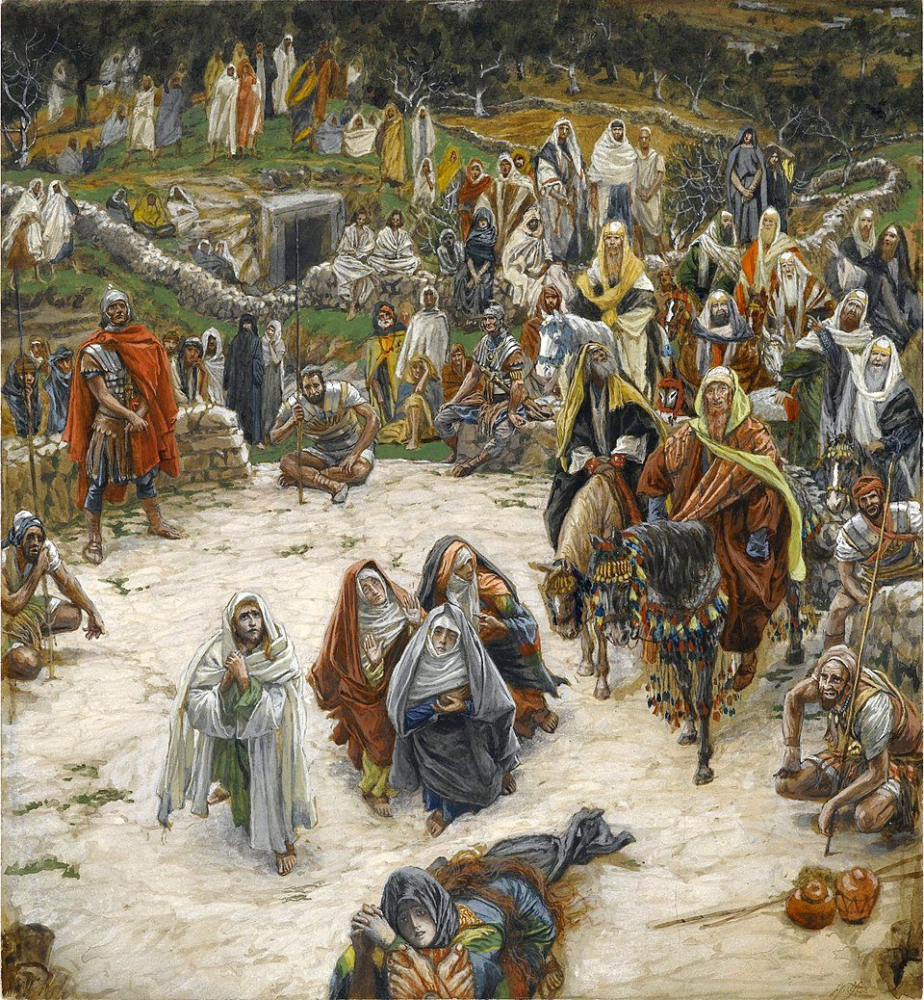
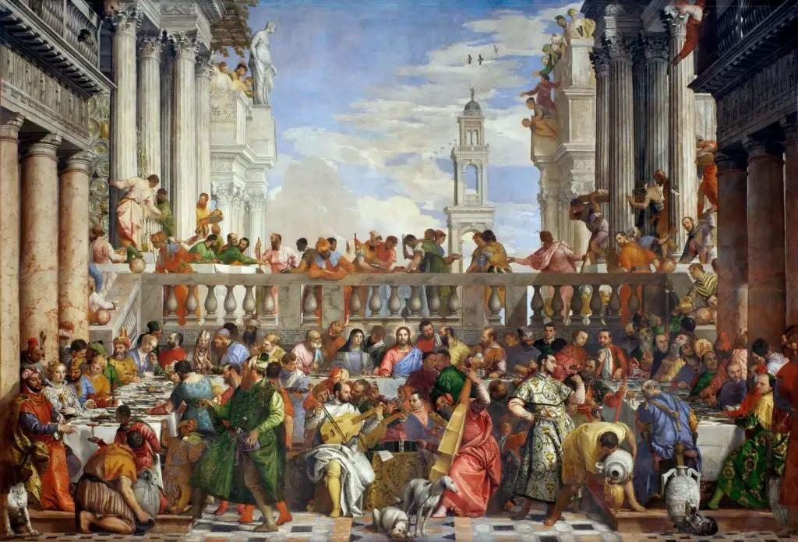
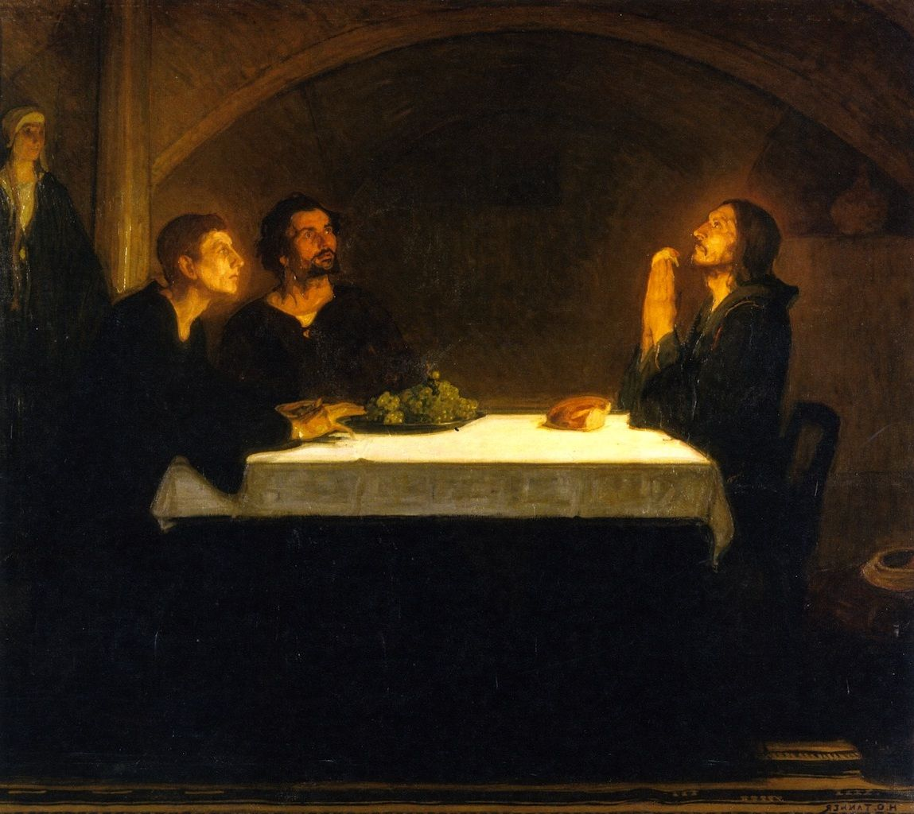
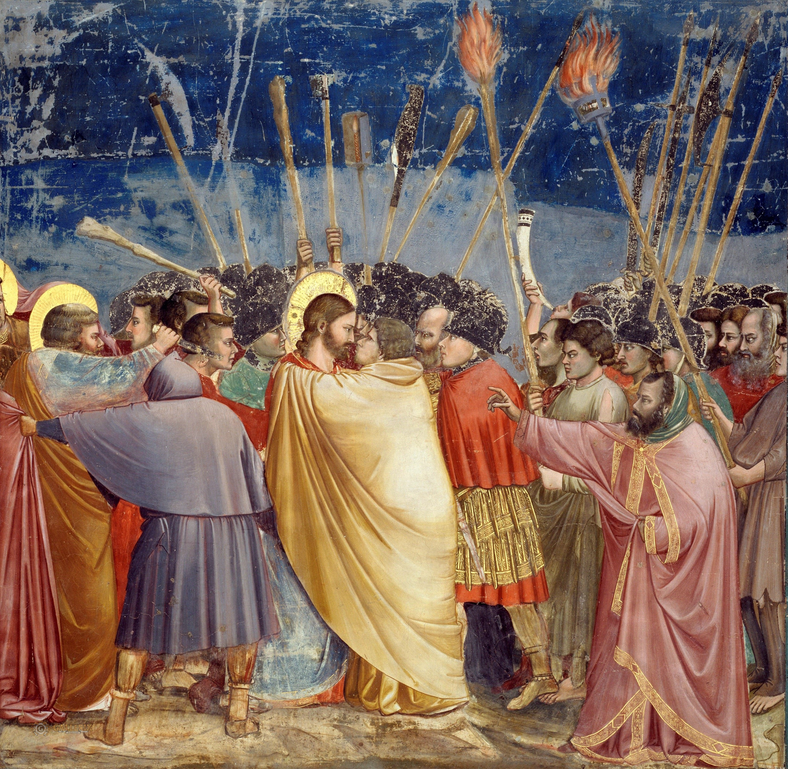

<!-- toc -->

- [June 01, 2025](#june-01-2025)
  - [St. Joseph's Offering](#st-josephs-offering)
  - [AI-Generated Summary: The Quiet Sacrifice of St. Joseph](#ai-generated-summary-the-quiet-sacrifice-of-st-joseph)
- [June 02, 2025](#june-02-2025)
  - [From St.Joseph to Jesus](#from-stjoseph-to-jesus)
  - [AI-Generated Summary: The Quiet Passing of a Guardian and the Unbroken Chain of Love](#ai-generated-summary-the-quiet-passing-of-a-guardian-and-the-unbroken-chain-of-love)
  - [Jesus, at 12, teaching in the Temple](#jesus-at-12-teaching-in-the-temple)
- [June 03, 2025](#june-03-2025)
  - [I Am Not Worthy](#i-am-not-worthy)
  - [AI-Generated Summary: The Humble Majesty of Divine Obedience](#ai-generated-summary-the-humble-majesty-of-divine-obedience)
  - [The Baptism of Christ by Leonardo Da Vinci created in the studio of Andrea del Verrochio around 1475](#the-baptism-of-christ-by-leonardo-da-vinci-created-in-the-studio-of-andrea-del-verrochio-around-1475)
- [June 04, 2025](#june-04-2025)
  - [More than Meets the Eye](#more-than-meets-the-eye)
  - [AI-Generated Summary: The Many-Layered Workings of Divine Love](#ai-generated-summary-the-many-layered-workings-of-divine-love)
  - [Gerard David's The Marriage at Cana](#gerard-davids-the-marriage-at-cana)
- [June 05, 2025](#june-05-2025)
  - [I Do Not Condemn You](#i-do-not-condemn-you)
  - [AI-Generated Summary: The Mercy That Silences Stones](#ai-generated-summary-the-mercy-that-silences-stones)
  - [The Adulterous Woman by Lorenzo Lotto](#the-adulterous-woman-by-lorenzo-lotto)
- [June 06, 2025](#june-06-2025)
  - [We Have Authority](#we-have-authority)
  - [AI-Generated Summary: The Divine and the Human in Raphael’s Vision](#ai-generated-summary-the-divine-and-the-human-in-raphaels-vision)
  - [Raphael's The Transfiguration](#raphaels-the-transfiguration)
- [June 07, 2025](#june-07-2025)
  - [Wash All of Me](#wash-all-of-me)
  - [AI-Generated Summary: The Sacred Feast and the Heart's Surrender](#ai-generated-summary-the-sacred-feast-and-the-hearts-surrender)
  - [The Last Supper by Juan de Juanes](#the-last-supper-by-juan-de-juanes)
- [June 08, 2025](#june-08-2025)
  - [Surrender Your Suffering](#surrender-your-suffering)
  - [AI-Generated Summary: The Weight of Surrender and the Light of Redemption](#ai-generated-summary-the-weight-of-surrender-and-the-light-of-redemption)
  - [The Prayer of Jesus in Gethsemane by Alessandro Maganza](#the-prayer-of-jesus-in-gethsemane-by-alessandro-maganza)
- [June 09, 2025](#june-09-2025)
  - [Choose Your Side](#choose-your-side)
  - [AI-Generated Summary: The Divine Drama in Caravaggio's Light and Shadow](#ai-generated-summary-the-divine-drama-in-caravaggios-light-and-shadow)
  - [The Flagellation of Christ: Painting by Caravaggio](#the-flagellation-of-christ-painting-by-caravaggio)
- [June 10, 2025](#june-10-2025)
  - [Sharing Eternal Victory](#sharing-eternal-victory)
  - [AI-Generated Summary: The Silent Majesty of Suffering and the Call to Behold](#ai-generated-summary-the-silent-majesty-of-suffering-and-the-call-to-behold)
  - [Caravaggio's Ecce Homo - Behold The Man](#caravaggios-ecce-homo---behold-the-man)
  - [The Lost Caravaggio - Ecce Homo](#the-lost-caravaggio---ecce-homo)
- [June 11, 2025](#june-11-2025)
  - [Carrying the Cross Together](#carrying-the-cross-together)
  - [AI-Generated Summary: The Weight and the Lightness of the Cross](#ai-generated-summary-the-weight-and-the-lightness-of-the-cross)
  - [Christ carrying the Cross (1605) by Orazio Gentileschi](#christ-carrying-the-cross-1605-by-orazio-gentileschi)
- [June 12, 2025](#june-12-2025)
  - [Through His Eyes](#through-his-eyes)
  - [AI-Generated Summary: The View from the Cross](#ai-generated-summary-the-view-from-the-cross)
  - [James Tissot's What Our Lord Saw From The Cross](#james-tissots-what-our-lord-saw-from-the-cross)
- [June 13, 2025](#june-13-2025)
  - [Guided by His Hands](#guided-by-his-hands)
  - [AI-Generated Summary: The Mercy of the Risen Lord and the Faith of St. Thomas](#ai-generated-summary-the-mercy-of-the-risen-lord-and-the-faith-of-st-thomas)
  - [Caravaggio's The Incredulity of St. Thomas](#caravaggios-the-incredulity-of-st-thomas)
- [June 14, 2025](#june-14-2025)
  - [Following in His Footsteps](#following-in-his-footsteps)
  - [AI-Generated Summary: The Footprints of the Ascended Lord](#ai-generated-summary-the-footprints-of-the-ascended-lord)
  - [Ascension of the Lord by Bernardino Gandino](#ascension-of-the-lord-by-bernardino-gandino)
- [June 15, 2025](#june-15-2025)
  - [Ordinary, Yet Called](#ordinary-yet-called)
  - [AI-Generated Summary: The Spirit's Fire and the Making of Saints](#ai-generated-summary-the-spirits-fire-and-the-making-of-saints)
  - [Pentecost by Titian](#pentecost-by-titian)
- [June 16, 2025](#june-16-2025)
  - [Glory Awaits the Faithful](#glory-awaits-the-faithful)
  - [AI-Generated Summary: The Triumph of Mary and the Faithful](#ai-generated-summary-the-triumph-of-mary-and-the-faithful)
  - [Fresco of Assumption of Our Lady in the Vision of St Bonaventure in the church Chiesa di Santa Lucia del Gonfalone by Cesare Mariani (1863)](#fresco-of-assumption-of-our-lady-in-the-vision-of-st-bonaventure-in-the-church-chiesa-di-santa-lucia-del-gonfalone-by-cesare-mariani-1863)
- [June 17, 2025](#june-17-2025)
  - [Our Shared Inheritance](#our-shared-inheritance)
  - [AI-Generated Summary: The Crown of Earthly Sorrow and Heavenly Joy](#ai-generated-summary-the-crown-of-earthly-sorrow-and-heavenly-joy)
  - [Coronation of the Virgin, fresco by Giuseppe Mattia Borgnis (1701-1761)](#coronation-of-the-virgin-fresco-by-giuseppe-mattia-borgnis-1701-1761)
- [June 18, 2025](#june-18-2025)
  - [The Faithful 'Yes'](#the-faithful-yes)
  - [AI-Generated Summary: The Divine Tapestry in Van Eyck’s Annunciation](#ai-generated-summary-the-divine-tapestry-in-van-eycks-annunciation)
  - [Annunciation, an oil painting by the Early Netherlandish master Jan van Eyck](#annunciation-an-oil-painting-by-the-early-netherlandish-master-jan-van-eyck)
- [June 19, 2025](#june-19-2025)
  - [Grit and Grace](#grit-and-grace)
  - [AI-Generated Summary: The Steadfast Love of Mary’s Journey](#ai-generated-summary-the-steadfast-love-of-marys-journey)
  - [Basilica of the Visitation in Ein Karem, a village in the hill country of Judea where John the Baptist was born](#basilica-of-the-visitation-in-ein-karem-a-village-in-the-hill-country-of-judea-where-john-the-baptist-was-born)
- [June 20, 2025](#june-20-2025)
  - [Worship the Newborn King](#worship-the-newborn-king)
  - [AI-Generated Summary: The Humble Majesty of Caravaggio’s Lost Nativity](#ai-generated-summary-the-humble-majesty-of-caravaggios-lost-nativity)
  - [Nativity with St. Francis and St. Lawrence by Caravaggio](#nativity-with-st-francis-and-st-lawrence-by-caravaggio)
- [June 21, 2025](#june-21-2025)
  - [Heart of Prayer](#heart-of-prayer)
  - [AI-Generated Summary: The Light and the Song](#ai-generated-summary-the-light-and-the-song)
  - [Simeon's Song of Praise by Arent de Gelder](#simeons-song-of-praise-by-arent-de-gelder)
- [June 22, 2025](#june-22-2025)
  - [Rooted in Identity](#rooted-in-identity)
  - [AI-Generated Summary: The Meekness of the Boy Christ and the Courage of Knowing](#ai-generated-summary-the-meekness-of-the-boy-christ-and-the-courage-of-knowing)
  - [Finding of the Savior in the Temple by William Holman Hunt](#finding-of-the-savior-in-the-temple-by-william-holman-hunt)
- [June 23, 2025](#june-23-2025)
  - [Living Our Baptism](#living-our-baptism)
  - [AI-Generated Summary: The Humble Herald and the Divine Dawn](#ai-generated-summary-the-humble-herald-and-the-divine-dawn)
  - [Apparition of the Messiah, an oil painting on canvas, measuring 540 cm × 750 cm, by Russian painter Alexander Andreyevich Ivanov (1806–1858)](#apparition-of-the-messiah-an-oil-painting-on-canvas-measuring-540-cm--750-cm-by-russian-painter-alexander-andreyevich-ivanov-18061858)
- [June 24, 2025](#june-24-2025)
  - [Calling Through The Noise](#calling-through-the-noise)
  - [AI-Generated Summary: The Weight of the World and the Wine of Grace](#ai-generated-summary-the-weight-of-the-world-and-the-wine-of-grace)
  - [Wedding at Cana by Paolo Veronese](#wedding-at-cana-by-paolo-veronese)
- [June 25, 2025](#june-25-2025)
  - [Jesus is in the Boat](#jesus-is-in-the-boat)
  - [AI-Generated Summary: The Storm and the Stillness](#ai-generated-summary-the-storm-and-the-stillness)
  - [Christ in the Storm on the Sea of Galilee, a 1633 oil-on-canvas painting by the Dutch Golden Age painter Rembrandt van Rijn](#christ-in-the-storm-on-the-sea-of-galilee-a-1633-oil-on-canvas-painting-by-the-dutch-golden-age-painter-rembrandt-van-rijn)
- [June 26, 2025](#june-26-2025)
  - [Earthen Vessels](#earthen-vessels)
  - [AI-Generated Summary: The Radiant Mystery of the Transfiguration](#ai-generated-summary-the-radiant-mystery-of-the-transfiguration)
  - [The Savior’s Transfiguration by Theophanes the Greek](#the-saviors-transfiguration-by-theophanes-the-greek)
- [June 27, 2025](#june-27-2025)
  - [Open the Door](#open-the-door)
  - [AI-Generated Summary: The Quiet Love Before the Supper](#ai-generated-summary-the-quiet-love-before-the-supper)
  - [Christ and the Disciples Before the Last Supper by Henry Ossawa Tanner](#christ-and-the-disciples-before-the-last-supper-by-henry-ossawa-tanner)
- [June 28, 2025](#june-28-2025)
  - [Discouragement, Distraction, Despair](#discouragement-distraction-despair)
  - [AI-Generated Summary: The Betrayal and the Human Heart](#ai-generated-summary-the-betrayal-and-the-human-heart)
  - [The Arrest of Christ Kiss of Judas by Giotto](#the-arrest-of-christ-kiss-of-judas-by-giotto)
- [June 29, 2025](#june-29-2025)
  - [The God Who Bleeds](#the-god-who-bleeds)
  - [AI-Generated Summary: The Unseen Depth of Suffering and Love](#ai-generated-summary-the-unseen-depth-of-suffering-and-love)
  - [The Flagellation of Our Lord Jesus Christ by Bouguereau](#the-flagellation-of-our-lord-jesus-christ-by-bouguereau)
- [June 30, 2025](#june-30-2025)
  - [Grace Amid Thorns](#grace-amid-thorns)
  - [AI-Generated Summary: The Paradox of Power in Van Dyck's Crowning with Thorns](#ai-generated-summary-the-paradox-of-power-in-van-dycks-crowning-with-thorns)
  - ["Van Dyck's _The Crowning with Thorns_ (early 17th century), a Baroque depiction of Christ's suffering and paradoxical triumph"](#van-dycks-the-crowning-with-thorns-early-17th-century-a-baroque-depiction-of-christs-suffering-and-paradoxical-triumph)

<!-- tocstop -->

# June 2025

RIAY June 2025

## June 01, 2025

### St. Joseph's Offering

### AI-Generated Summary: The Quiet Sacrifice of St. Joseph

Behold the scene: a painting, rich with solemnity, where the infant Christ is presented in the Temple. Mary, tender yet resolute, offers her Son to aged Simeon, whose prophetic words pierce the heart like a sword. And there stands Joseph—faithful, watchful, bearing the weight of a sorrow not yet come.

For though he is guardian, protector, a shield against harm, he cannot spare his beloved from the grief foretold. Yet he does not turn away. In that moment, Joseph shares in the mystery of suffering, his love steadfast even as the shadow of the Cross falls upon them. His sacrifice is quiet, unnoticed by the world, but no less real than the offering of the Lamb he now carries in his arms.

And so we see that true devotion is not in grand gestures, but in the daily surrender to God’s will—in the patient bearing of sorrows we cannot prevent, in the love that endures even when all seems lost. Joseph, silent and strong, teaches us this: that to love is to consent to suffer, and in that suffering, to find the deepest peace.

_Glory be to the Father, and to the Son, and to the Holy Spirit._

## June 02, 2025

### From St.Joseph to Jesus

### AI-Generated Summary: The Quiet Passing of a Guardian and the Unbroken Chain of Love

Behold the boy Christ in the temple, seated not as a pupil but as the very source of wisdom, His young face alight with the authority of eternity. The scholars lean in—some marveling, some troubled—while His mother and foster father stand at the threshold, their plain garments a silent testament to the humility of those chosen to nurture divinity. Here, Joseph’s earthly stewardship nears its end; hereafter, the sacred record falls silent concerning him, as shadows lengthen over a carpenter’s quiet life in Nazareth.

Yet mark this well: when Joseph departs, the Father’s provision does not falter. The son, now grown, assumes with glad solemnity the care of His mother, as a vine naturally bears the fruit of its own nurturing. In this we see a mystery—that He who upheld the universe with a word should honor the bonds of kinship with such tender constancy.

At Cana, the last thread of ordinary shelter is loosed. Mary, with a mother’s discernment, brings the need for wine to her son, not to command but to release. Her quiet plea is the final surrender of maternal claim, that He might step forth into the harvest of His mission. And so the guardian becomes the guarded; the teacher, the disciple. Even in the sword-pierced joy of her faithfulness, we find the unfailing truth: love never abdicates, though its forms may change.

_Glory be to the Father, who ordains each season of care; to the Son, who fulfills every duty with divine tenderness; and to the Spirit, who weaves these bonds beyond the unraveling of death. Amen._

### Jesus, at 12, teaching in the Temple

## June 03, 2025

### I Am Not Worthy

### AI-Generated Summary: The Humble Majesty of Divine Obedience

Here we behold a scene both tender and mighty: the Son of God, sinless yet submitting to the waters, and His herald John, trembling at the weight of his task. In this sacred moment, as in the Annunciation, humility is the threshold of glory. The dove descends not upon the proud, but upon the obedient—those who, like Mary, whisper _fiat_, or like John, yield despite their unworthiness.

Christ’s baptism reveals a paradox: the Almighty kneels, the Sinless One is washed, and in this act, righteousness is fulfilled. The Spirit descends where hearts are lowly, not where crowns are grasped. So too must we learn that true confidence springs not from self-assertion, but from surrender. To obey is not to cower; it is to stand firm in the current of God’s will, knowing that the humble hand receiving the dove is mightier than the clenched fist of kings.

Let us then pray—not as those bargaining with heaven, but as children trusting a Father. For the same Spirit that hovered over Jordan waits to hallow the willing heart. _Our Father... Hail Mary..._ Thus ends our meditation, but not our calling.

### The Baptism of Christ by Leonardo Da Vinci created in the studio of Andrea del Verrochio around 1475

## June 04, 2025

### More than Meets the Eye

### AI-Generated Summary: The Many-Layered Workings of Divine Love

Consider, if you will, how the Master’s hand moves not in single strokes but in rich, interwoven threads. At Cana, as Gerard David’s brush so tenderly captured, our Lord did not merely replenish wine; He hallowed joy itself, unveiled His glory, and whispered of the greater marriage feast to come. The miracle was a sign, yes, but also a gift—a foretaste of the Kingdom where all thirst is quenched.

So it is with all His works. When He called the fishermen, He was both summoning laborers and Himself the first Fisher, drawing souls with divine patience. Each healing was a mending of body and a parable of the soul’s renewal—for what are straightened limbs if not emblems of hearts unbound? Even now, in the quiet sacraments, He acts thus: marriage is at once a human joy and a sacred echo of His love for us.

Do not suppose, then, that God is ever at cross-purposes. What seems to us distraction is but the finite mind straining to grasp the infinite. In every duty—be it parenting, toil, or the humblest daily task—He is at work, turning the ordinary into the extraordinary, if only we have eyes to see. The monotony you dread may yet be the very path He has chosen to shape your soul.

Let us then pray with glad confidence, as children who know their Father attends to all things—great and small—with equal care. For in His economy, nothing is wasted, and every act, rightly received, becomes a stepping-stone to Him.

### Gerard David's The Marriage at Cana

## June 05, 2025

### I Do Not Condemn You

### AI-Generated Summary: The Mercy That Silences Stones

Behold a scene both ancient and ever-new: a woman, trembling in her shame, encircled by men whose hands clutch stones and whose hearts seethe with wrath. Yet at the center stands One who writes in the dust—not in condemnation, but as if tracing the fragile lines of every human soul. "Let him who is without sin," He says, and the words fall like a hammer upon their pride. One by one, the stones drop, the accusers slink away, and only Mercy remains.

To the woman, He speaks neither soft indulgence nor harsh rebuke, but a command that is itself a gift: "Go, and sin no more." Here is the marvel—He sees her wholly, loves her truly, and will not leave her as she was. The same gaze that scattered her enemies now kindles in her a new life.

And what of us? We stand in that crowd, stones half-lifted in our hands. Will we, too, hear the voice that strips us bare yet clothes us in grace? For this is the mystery of His mercy: it forgives the past to free us for the future. Let us then lay down our judgments, that we may take up His compassion.

### The Adulterous Woman by Lorenzo Lotto

## June 06, 2025

### We Have Authority

### AI-Generated Summary: The Divine and the Human in Raphael’s Vision

Behold Raphael’s _The Transfiguration_, where heaven’s glory and earth’s frailty meet. Above, Christ stands radiant, bathed in uncreated light, flanked by Moses and Elijah—the Law and the Prophets bowing to their fulfillment. Below, the disciples stagger, their faces alight with awe or shadowed by confusion, while a boy writhes, gripped by forces darker than they dare name. Here is the paradox of our condition: the divine splendor above, the human tumult below.

Mark well the contrast. The disciples, though chosen, falter; their faith is thin as morning mist. They cannot cast out the demon, not for lack of power given, but for lack of trust in the Giver. Yet the father, desperate as he is, still pleads—and Christ, who rebukes weak faith, rewards even the mustard seed of it. Raphael, that wise painter, shows us the two scenes as one: the mountain’s light and the valley’s struggle are bound together. The same Lord who shines in glory stoops to heal the broken.

And so the lesson stands plain: faith is not a feeling, nor a merit, but a fixing of the eyes upon Him who has all authority. The disciples’ failure lies not in their weakness, but in forgetting whose strength upholds them. We, like they, are called not to measure our might, but to act in the certainty of His. Let the demon-possessed boy remind us—our despair is but the shadow that flees when His face is turned upon it.

Thus, the painting whispers and the Scripture shouts: _Look up_. The same Christ who transfigured the mountain transfigures the heart. Pray, then, not as those who grope in doubt, but as those who know the hand that holds them. And if your faith is small, ask—as the father did—for it to be made great. For He who commands the demons will not despise the trembling voice that calls on Him.

_Glory be to the Father, and to the Son, and to the Holy Spirit._ Amen.

### Raphael's The Transfiguration

## June 07, 2025

### Wash All of Me

### AI-Generated Summary: The Sacred Feast and the Heart's Surrender

Behold the painter’s hand, guided by devotion, capturing that solemn hour when the Bread of Life was broken among His own. Juan de Juanes, a man of Valencia, has set before us the Lord at table, clad in indigo and crimson, the host lifted high while the disciples gaze upon Him—not with curiosity, but with the awe of men who sense eternity pressing into time. Here is no mere remembrance, but the very mystery of Love made visible: Christ, in unfathomable humility, offering His flesh as our food and His blood as our drink.

The true disciple, like those at the table, must respond with the surrender of Francis—kneeling not only in body but in soul, withholding nothing. For as the Lord washed dusty feet, so He now cleanses the inward man, if we will receive Him. This is the divine exchange: our emptiness for His fullness, our sin for His mercy. The Eucharist is the school where pride is unlearned and adoration becomes our native tongue.

Let us then, with the saints, pray without ceasing. The "Hail Mary" rises as a fragrant offering, and the "Glory Be" echoes the song of heaven. In such prayers, the soul stretches toward its home, and every blessing—given or received—becomes a foretaste of the eternal feast.

### The Last Supper by Juan de Juanes

## June 08, 2025

### Surrender Your Suffering

### AI-Generated Summary: The Weight of Surrender and the Light of Redemption

Behold a scene both solemn and radiant: the Son of Man kneels in the garden, His human frame bowed beneath the weight of the world’s sorrow, while His disciples—youth and elder alike—succumb to sleep, their spirits willing but flesh weak. Above Him, an angel descends, bearing the cup of suffering, its rim aflame with divine purpose. Here, in the tension of shadows and light, we glimpse the very heart of Mannerist art—where proportion bends to passion, and stillness trembles with impending sacrifice.

The painter, skilled in the language of contrast, draws our gaze not to the slumbering forms, nor even to the approaching soldiers half-hidden in gloom, but to the One who kneels in surrender. Every line, every fold of cloth, every blade of grass points toward Him, as all things must, for He is the still center round which the cosmos turns. This is the moment where darkness is not merely resisted but taken into Himself, where agony is transmuted into glory.

And what of us, dear reader? We are bid to follow where He has gone before—to lay down our sins, our fears, our very selves, as a patient yields to the surgeon’s hand. For only in surrender is there true alignment; only in relinquishment is there redemption. The prayers woven through this meditation—the _Ave Maria_, the _Gloria Patri_—are not mere recitations but echoes of that primal yielding, rehearsals for the day when all knees shall bow and all hearts confess.

So let us pray, not as those who bargain, but as those who trust: _Thy will be done_. For in that submission lies our freedom, and in that darkness, His unyielding light.

### The Prayer of Jesus in Gethsemane by Alessandro Maganza

## June 09, 2025

### Choose Your Side

### AI-Generated Summary: The Divine Drama in Caravaggio's Light and Shadow

Behold Caravaggio’s _The Flagellation of Christ_, where light and darkness wage their ancient war upon the canvas. Here, in the year 1607, a master’s hand has captured not merely a scene, but the very essence of human cruelty and divine submission. Christ, bound to the column, stands luminous—His suffering etched in muscle and shadow, while three tormentors encircle Him like embodiments of sin itself.

The first strikes with a hatred that twists the soul; the second, half-turned away, lends his strength to evil yet dares not meet its gaze—a portrait of the cowardice that sustains wickedness. But the third is most terrible: he calculates, he prepares, he chooses. Here is rebellion in its purest form—not the sin of the weak, but of the willful.

Caravaggio’s brush does not flinch. His chiaroscuro lays bare the battle we all know: the pride that strikes, the indifference that permits, the cold intellect that justifies. Yet in the center, undimmed, is Light—the courage of the Lamb, silent before His shearers. This is no mere painting; it is a mirror for the soul, a call to repentance, a summons to step from shadow into grace.

And so the prayers rise—_Hail Mary, Glory Be_—not as empty words, but as echoes of that same light, pleading for the strength to choose it. For the drama on that canvas is ours as well: every day, we stand with the soldiers or with Christ. Let us then pray, and choose wisely.

### The Flagellation of Christ: Painting by Caravaggio

## June 10, 2025

### Sharing Eternal Victory

### AI-Generated Summary: The Silent Majesty of Suffering and the Call to Behold

Here we see a masterwork of Caravaggio, _Ecce Homo_, where the divine and the human meet in a moment of terrible beauty. Christ stands bound, crowned with thorns, His face a quiet sea amidst the storm of mockery. The painter, with his unflinching eye, shows us not only the cruelty of men but the flicker of pity in their hearts—even Pilate hesitates, caught between duty and dread. The old man’s gesture, _Behold the man_, is not merely historical; it is an eternal summons to every soul.

This is no distant spectacle, but a mirror held to our own hearts. Do we, like the bystander, glimpse the truth too late? Or do we, in seeing His suffering, recognize the weight of our own failings? The thorns, the blood, the silent endurance—these are not just marks of pain, but the very instruments of our redemption. To behold Him is to be called to repentance, to kneel not in despair, but in hope, for His sacrifice is the light that pierces the darkest guilt.

And so we pray, not as isolated souls, but as a body united in grace. The _Our Father_, the _Hail Mary_—these are not empty words, but the breath of a shared faith, the rope that binds us to mercy. For in His wounds, we find our healing; in His resurrection, our victory. Let us then, with sober hearts, behold the man—and in beholding, be transformed.

### Caravaggio's Ecce Homo - Behold The Man

### The Lost Caravaggio - Ecce Homo

## June 11, 2025

### Carrying the Cross Together

### AI-Generated Summary: The Weight and the Lightness of the Cross

Consider, dear reader, the paradox so vividly captured in Gentileschi’s _Christ Carrying the Cross_: here is the Son of God, bowed beneath the crushing weight of wood and sin, yet His face betrays not despair, but a quiet, unshakable resolve. The artist, with his Caravaggesque mastery of light and shadow, shows us not only the agony of the cross but the strange, sustaining peace beneath it.

Two women stand near—one radiant with devotion, the other shrouded in grief—reminding us that suffering is never borne alone. And though Simon strains beside Him, we sense the deeper truth: this burden, though real, is not the final word. For Christ Himself spoke of a yoke that is easy, a load that is light—not because the cross is featherlight, but because He carries it with us, and we with Him.

Herein lies the mystery: the rest He promises is not freedom from weight, but a strength within it. The world sees only the sweat, the splinters, the stumbling; faith sees further. It knows that behind every Gethsemane lies a resurrection, and that the hands which bear the cross are the same that will cast it aside in triumph.

So let us pray, as the saints have prayed—_Our Father_, _Hail Mary_—not to escape the weight, but to find, as He did, the lightness of trust in the Father’s will. For in that surrender, even the heaviest cross becomes a gateway to joy.

### Christ carrying the Cross (1605) by Orazio Gentileschi

 by Orazio Gentileschi")

## June 12, 2025

### Through His Eyes

### AI-Generated Summary: The View from the Cross

Imagine, if you will, the scene at Calvary not as we so often see it—framed by artists at a safe distance—but as the Lord Himself beheld it in those final hours: a sea of faces, some twisted in mockery, others slack with indifference, and a few, dear few, wet with tears. Tissot’s painting, though but shadows of the reality, gives us this very perspective—the God who hung there, wounded and weary, gazing upon a world that knew Him not.

Here is the bitter paradox of Love incarnate: the Creator, pierced by the cruelty of His creatures, yet fixing His eyes most tenderly on those who loved Him in return—His mother, the beloved disciple, the Magdalene. Does it not strike you as strange that the same heart which grieves over the hardness of men is the very heart that overflows with mercy for them?

And now, dear friend, consider where you would have stood that day. Would you have been among the scoffers, the passive onlookers, or the weeping few at the cross’s foot? For this is no mere historical exercise; it is the question of every age and every soul. Christ’s sacrifice, once offered, remains eternally present, and our response to it—be it cold neglect or adoring love—shapes not only our destiny but the very quality of our days here and now.

Let us then pray, not as those who repeat empty words, but as those who kneel in the shadow of the cross, daring to look up into the face of Him who first looked upon us with such unutterable love.

_Our Father... Hail Mary... Glory be..._

Go in peace, and may the grace of that holy gaze attend you always.

### James Tissot's What Our Lord Saw From The Cross

## June 13, 2025

### Guided by His Hands

### AI-Generated Summary: The Mercy of the Risen Lord and the Faith of St. Thomas

Consider Caravaggio’s _The Incredulity of St. Thomas_, where the resurrected Christ, with gentle firmness, guides the trembling hand of His disciple to the wound in His side. Here we see not a rebuke for doubt, but a divine condescension—a Lord who meets His servant in the very place of his uncertainty. Thomas, far from a mere skeptic, embodies the hunger of every soul that longs not for abstract proofs, but for the living God.

And how does Christ answer? Not with scorn, but with mercy. He offers His wounds as the seal of His love, inviting Thomas—and all who come after—to touch and believe. Here is the heart of the matter: faith is not a cold assent, but an encounter with the One who bore our sorrows. The resurrection is not a doctrine to be debated, but a reality to be lived—does your life bear its mark?

Let us then pray for grace to seek Him as Thomas did, not shrinking from our need, but bringing it to the feet of Him who welcomes all. And as we do, may we find, as Thomas did, that our faltering faith is met with a love that will not let us go.

_Hail Mary, full of grace… Glory be to the Father…_ So we pray, asking the saints to intercede, and so we part, blessed in the name of Him who is our peace.

### Caravaggio's The Incredulity of St. Thomas

## June 14, 2025

### Following in His Footsteps

### AI-Generated Summary: The Footprints of the Ascended Lord

Consider, dear reader, that wondrous moment when our Lord, having conquered death, ascended into heaven—a scene captured with radiant solemnity by Gandino’s brush. There He rises, bathed in light, while His mother and apostles gaze upward, their hearts torn between sorrow and joy. And there, upon the stone, remain His footprints—not as a relic of absence, but as a promise: though He departs, He leaves behind the path we are to follow.

St. Francis, that most ardent imitator of Christ, understood this well. To walk in His steps is not merely to admire them from afar, but to press our own feet into the dust He trod—through prayer, through sacrament, through humble obedience to His Church. The Ascension is no mere departure; it is an invitation. As He rose, so too must we lift our hearts, our minds, our very lives toward heaven, where He reigns.

Let us then, with renewed devotion, take up this daily pilgrimage. For the footprints on the stone are but the beginning; the true path leads ever upward, to where He waits.

### Ascension of the Lord by Bernardino Gandino

## June 15, 2025

### Ordinary, Yet Called

### AI-Generated Summary: The Spirit's Fire and the Making of Saints

Consider, dear reader, how the Divine Artist chooses the frailest of brushes to paint His masterworks. In Titian’s vision of Pentecost, we see not angels or seraphs, but ordinary men—flawed, fearful, and forgetful—suddenly ablaze with the uncreated Light. Chief among them, Simon, the fisherman who once denied his Lord, now stands as Peter, the rock, his voice piercing hearts like a sword. Here lies the great paradox: the Spirit does not wait for our perfection, but perfects us by His coming.

What was true for Peter is true for every soul. Your weaknesses are not obstacles but the very material grace transforms. The same fire that fell upon the Apostles seeks to kindle your own heart, not for your sake alone, but for the world He means to reach through you. Surrender, then, your anxious calculations. The Spirit who shaped the cosmos from chaos can surely shape a saint from your humble yes.

And so we end as we began: with a painting, a prayer, and the quiet certainty that He who began this good work in you will bring it to completion.

### Pentecost by Titian

## June 16, 2025

### Glory Awaits the Faithful

### AI-Generated Summary: The Triumph of Mary and the Faithful

Behold the fresco of Marani, where heaven and earth meet in radiant splendor. There the Blessed Virgin ascends, robed in red and blue, borne aloft by angels against a sky of gold. Below, kings and popes, maidens and knights, all gaze upward in awe or press forward as if drawn by her very presence. Here is no mere painting, but a window into the eternal—where Mary, assumed in glory, becomes both sign and promise to those who follow.

Does not this scene whisper of Elijah’s fiery chariot? Yet here the victory is sweeter, for it is not a prophet alone, but the Mother of the Lord who is lifted beyond death’s reach. The figures beneath her—some named, some mysterious—stand as witnesses to this truth: that what was granted to her is the hope of all who are washed in the Lamb’s blood and keep their garments white.

Let the world rage as it will; the fresco declares a quieter, surer truth. Evil is already conquered, and the faithful, though they may seem to falter now, shall share in Christ’s triumph. Fix your eyes, then, not on the shadows of this age, but on the golden dawn beyond it. For if even the brush of a 19th-century artist can capture such glory, how much more shall the reality exceed it?

And so we bless one another and press on, remembering that every earthly beauty—even this painted sky—is but a foretaste of what awaits those who endure.

### Fresco of Assumption of Our Lady in the Vision of St Bonaventure in the church Chiesa di Santa Lucia del Gonfalone by Cesare Mariani (1863)

")

## June 17, 2025

### Our Shared Inheritance

### AI-Generated Summary: The Crown of Earthly Sorrow and Heavenly Joy

Consider, dear reader, the fresco of Mary’s coronation—a vision of divine order where the Trinity bestows glory upon her who was once a lowly maiden. The artist, Borginis, a humble man himself, has captured not merely a scene but a truth: that holiness is woven through suffering, and sorrow is but the shadow of coming joy.

See there, among the saints, Joseph—the quiet guardian who bore the weight of prophecy, who trembled at Simeon’s words yet stood firm in faith. His earthly labors ended, he now beholds the fulfillment of all things: Mary crowned, not in spite of her sorrows, but because of them. So too John the Baptist, who faced the sword yet now shares in the triumph of Christ.

This is the way of heaven: the meek inherit, the mourners are comforted, the promises whispered in darkness blaze forth in light. Our present trials are real, yet they are not final. Fix your eyes, then, not on the tears of the road but on the joy awaiting at journey’s end—where every vow is kept, and every faithful heart finds its rest in glory.

### Coronation of the Virgin, fresco by Giuseppe Mattia Borgnis (1701-1761)

## June 18, 2025

### The Faithful 'Yes'

### AI-Generated Summary: The Divine Tapestry in Van Eyck’s Annunciation

Consider, dear reader, how Jan van Eyck’s _The Annunciation_ weaves earthly artistry with heavenly truth. The very stones of its architecture speak: the Romanesque arches above, sturdy and ancient, yield to the Gothic below, as if the old covenant itself bows to the new. Here is the silent drama of prophecy fulfilled, where shadows retreat before the coming Light.

Upon the floor, the tiles recount old victories—David’s stone, Samson’s strength—yet these are but whispers of the greater conquest to come. In Mary’s humble _fiat_, evil meets its doom, though the world sees only a maiden’s quiet surrender. Her words, inverted to mortal eyes, rise straight to Heaven, a reminder that true dialogue with the Divine often turns worldly logic upside down.

So too must we learn to trust, not when the path is clear, but when it seems most shrouded. Every circumstance, be it trial or joy, is either an offering laid at His feet or an invitation to draw nearer. The world may mistake obedience for folly, but the faithful know: to lose oneself in His will is to find the only victory that endures. Let us then, like Mary, answer with courage, and hold fast to the hope that He who began this good work will see it through.

### Annunciation, an oil painting by the Early Netherlandish master Jan van Eyck

## June 19, 2025

### Grit and Grace

### AI-Generated Summary: The Steadfast Love of Mary’s Journey

Consider the mosaic of the Visitation, where Mary, young and bearing the weight of divine mystery, rides through the harsh hills between Nazareth and Ein Karem. Angels attend her, some walking beside the humble donkey, others aloft as silent witnesses. Elizabeth waits in the distance, her posture alight with expectation. Here is no mere decoration, but a window into the soul’s labor: love in motion, steadfast and uncomplaining.

The artist, Barluti, has captured not only the sacred moment but the very essence of virtue—firm, disciplined, enduring. Mary’s journey was no trifling errand; seventy miles of rugged terrain, a vulnerable woman with heaven’s promise as her compass. Yet vulnerability is not fragility. Hers was the strength of those who, though tender as a flower, are rooted deep in obedience. The world mistakes meekness for weakness, but heaven knows better. Hers was the grit of saints, the perseverance that does not flag when the road is long.

Virtue, as the wise tell us, is no fleeting impulse but a habit of the soul, a will trained to love when weariness whispers retreat. Mary’s journey was an ultramarathon of the spirit, each mile a surrender, each step a yes repeated. And what drove her? Not the hunger for praise, nor the thrill of triumph, but love—love that seeks not its own, love that pours itself out because it cannot do otherwise.

So too must we walk, not in grand gestures that fade like morning mist, but in the quiet, daily offering of ourselves. Grace perfects nature, but only where nature has first bent its knee in willing labor. Let us then take courage from her example, and pray for the fortitude to love as she loved: not for reward, but because Love Himself first loved us.

_Glory be to the Father, and to the Son, and to the Holy Spirit._

### Basilica of the Visitation in Ein Karem, a village in the hill country of Judea where John the Baptist was born

## June 20, 2025

### Worship the Newborn King

### AI-Generated Summary: The Humble Majesty of Caravaggio’s Lost Nativity

Consider, if you will, a painting—now vanished, stolen from the world’s sight—where light and shadow conspire to reveal a truth too often forgotten. Caravaggio, that master of stark realism, once depicted the birth of our Lord not in regal splendor, but in a barn’s quiet obscurity. The Virgin gazes upon her child; St. Francis and St. Lawrence kneel in awe, their lives of poverty and service now bending toward the poverty of God Himself. An angel descends, not with fanfare, but as a whisper, pointing to the infant who is both Maker and made.

Here lies the divine paradox: the One who is Beauty, Strength, and Eternal Life lies swaddled in straw. St. Francis knew this well—his _Praises of God_ exalts the Almighty’s majesty, yet it is that very majesty which makes the manger so staggering. For how could He who is Sufficiency become needful? How could the Refuge of all souls have no roof but a stable’s beams? The prayer of the saints, like Caravaggio’s brush, directs us not to marvels afar, but to the near, the lowly, the human face of Love.

And so we are left with this: to see in Mary’s child the fullness of God’s humility, and in His humility, the fullness of His power. Let us pray for grace to kneel with Francis and Lawrence, to adore not merely the idea of Incarnation, but the dusty, radiant fact of it. For in that stable, eternity entered time, and the shadows of a fallen world were pierced by uncreated Light.

### Nativity with St. Francis and St. Lawrence by Caravaggio

## June 21, 2025

### Heart of Prayer

### AI-Generated Summary: The Light and the Song

Behold _Simeon’s Song of Praise_ by Arent de Gelder, a pupil of Rembrandt, where light and shadow dance as if heaven itself leaned near. The old priest Simeon, robed in solemn vestments, lifts the Child—not merely an infant, but the Light of the World—whose radiance spills upon his weathered face. Mary stands by, her hands folded, her gaze inward, as one who treasures mysteries in her heart. The darkness around them is not empty; it is a canvas for revelation.

Here is the paradox of joy and sorrow: Simeon sings while foreseeing the sword that will pierce Mary’s soul. Yet neither turns away. Mary’s prayer is no mere recitation; it is the quiet, ceaseless turning of a soul toward its Maker. The painting whispers that to hold the divine is to be both illuminated and undone.

And what of us? We are called to walk as Mary did—not in strength of our own, but in the steady light of Him who first kindled it. To rejoice, to ponder, to suffer, yet always to cling. For in that clinging, even shadows become holy.

### Simeon's Song of Praise by Arent de Gelder

## June 22, 2025

### Rooted in Identity

### AI-Generated Summary: The Meekness of the Boy Christ and the Courage of Knowing

Consider, dear reader, the painting by William Holman Hunt, _The Finding of the Savior in the Temple_. Here, the young Jesus stands serene amidst the learned men of Jerusalem, His bare feet upon the temple’s patterned stones, His mother whispering near. The Pharisees, clad in embroidered robes, debate with furrowed brows, yet the Child speaks with a quiet authority that needs no raised voice.

How unlike our own trembling hearts! At twelve, many of us quake at the mere thought of standing before others—recalling, perhaps, some schoolroom recitation where our knees shook like reeds in the wind. But the Boy Christ, though meek, was never timid. His confidence flowed not from arrogance, but from the sure knowledge of who He was: the beloved Son, sent to do the Father’s will.

Here lies the secret of true meekness—not weakness, but strength held gently. It is the freedom of a child who, trusting his father’s word, declines the forbidden film without fuss, and finds his friends follow willingly. It is the quiet voice that refuses gossip in the workplace, not from fear of man, but from love of truth.

Let us then ask for grace to walk as He walked: unshaken by scorn, unswayed by praise, rooted in the love that casts out fear. For only when we know whose we are can we stand, like the Boy in the temple, both humble and bold.

### Finding of the Savior in the Temple by William Holman Hunt

## June 23, 2025

### Living Our Baptism

### AI-Generated Summary: The Humble Herald and the Divine Dawn

Consider, dear reader, the painter Ivanov’s labor of twenty years—_The Appearance of Christ Before the People_—a canvas where neoclassical precision and romantic fervor meet. There stands John the Baptist, clad in camel’s hair, his sun-worn hand outstretched toward the distant figure of Christ, who emerges from the wilderness in a cloak of blue and tunic of red, humble yet radiant. About them, a throng gathers: disciples, seekers, even the artist himself and his friend Gogol, their faces alight with wonder, doubt, or trembling hope. The river curves like grace itself around the rocks, its waters stirred by those stepping forward to be cleansed.

John’s voice echoes the Scripture: _"Behold, the Lamb of God!"_ He is no Messiah, only a herald—a man who knew his place and kept it, who rejoiced to decrease that Christ might increase. Unlike Saul, who clung to a fading crown, John surrendered his followers freely, pointing them to the One whose sandals he felt unworthy to untie. Here is the model of every true servant: obedience without envy, witness without self-seeking, a life poured out so others might find the Source.

And what of us? Does our own baptismal calling mirror his? Do we, in word and deed, direct souls toward the Light, or do we obscure Him with our own shadow? Where we have succeeded, let us give thanks; where we have faltered, let us seek mercy and rise again. For the world still waits, whether it knows it or not, for those who will proclaim—with their lives as much as their lips—_"He must increase, but I must decrease."_

### Apparition of the Messiah, an oil painting on canvas, measuring 540 cm × 750 cm, by Russian painter Alexander Andreyevich Ivanov (1806–1858)

[](https://upload.wikimedia.org/wikipedia/commons/thumb/9/9e/%D0%90%D0%BB%D0%B5%D0%BA%D1%81%D0%B0%D0%BD%D0%B4%D1%80_%D0%90%D0%BD%D0%B4%D1%80%D0%B5%D0%B5%D0%B2%D0%B8%D1%87_%D0%98%D0%B2%D0%B0%D0%BD%D0%BE%D0%B2_-_%D0%AF%D0%B2%D0%BB%D0%B5%D0%BD%D0%B8%D0%B5_%D0%A5%D1%80%D0%B8%D1%81%D1%82%D0%B0_%D0%BD%D0%B0%D1%80%D0%BE%D0%B4%D1%83_%28%D0%AF%D0%B2%D0%BB%D0%B5%D0%BD%D0%B8%D0%B5_%D0%9C%D0%B5%D1%81%D1%81%D0%B8%D0%B8%29_-_Google_Art_Project.jpg/960px-%D0%90%D0%BB%D0%B5%D0%BA%D1%81%D0%B0%D0%BD%D0%B4%D1%80_%D0%90%D0%BD%D0%B4%D1%80%D0%B5%D0%B5%D0%B2%D0%B8%D1%87_%D0%98%D0%B2%D0%B0%D0%BD%D0%BE%D0%B2_-_%D0%AF%D0%B2%D0%BB%D0%B5%D0%BD%D0%B8%D0%B5_%D0%A5%D1%80%D0%B8%D1%81%D1%82%D0%B0_%D0%BD%D0%B0%D1%80%D0%BE%D0%B4%D1%83_%28%D0%AF%D0%B2%D0%BB%D0%B5%D0%BD%D0%B8%D0%B5_%D0%9C%D0%B5%D1%81%D1%81%D0%B8%D0%B8%29_-_Google_Art_Project.jpg "Apparition of the Messiah, an oil painting on canvas, measuring 540 cm × 750 cm, by Russian painter Alexander Andreyevich Ivanov (1806–1858)")

## June 24, 2025

### Calling Through The Noise

### AI-Generated Summary: The Weight of the World and the Wine of Grace

Consider Veronese’s _The Wedding at Cana_, a lavish feast where a hundred souls revel, yet only two—the bride and Christ—meet our gaze. They seem to look past us, as if drawn to the _Mona Lisa_ on the far wall, while the true miracle (water becoming wine) humbly unfolds in the corner. So it is with our own sight: we fixate on lesser wonders, blind to the quiet glory at hand.

And what of _Atlas_, that titan of stone, forever bowed beneath the heavens? From St. Patrick’s altar, one sees him straining, a mirror of our own weary attempts to bear life’s weight alone. But here is the truth: Atlas’ burden was a punishment, not a calling. The world was never ours to carry. At Cana, when the wine ran dry—as our own strength always does—Christ provided not merely enough, but abundantly.

Yet how often we turn away, preferring our futile toil to His easy yoke! The orphan spirit whispers that we are alone, but the Bridegroom stands at the center of the feast, holding all things together. Surrender your load to Him; He who turned water into wine can surely turn your labor into rest. The myth of Atlas is but a shadow; the substance is Christ, who lifts the weight we were never meant to bear.

### Wedding at Cana by Paolo Veronese

## June 25, 2025

### Jesus is in the Boat

### AI-Generated Summary: The Storm and the Stillness

Consider the tempest—how it tosses the little boat, how the waves rise like hungry beasts, and how the hearts of men falter. Rembrandt, that master of shadow and light, has shown us the scene: the disciples laboring in terror, some straining at the oars, others clutching the rails, all but forgetting the One who sleeps in the stern. Yet when He wakes, the winds obey, and the sea grows still as a child hushed by its mother’s voice.

Here is the mystery: the storm was real, the danger great, but their fear was needless. For the Lord of the winds was in the boat with them. So it is with us. The world rages, the waves of trouble mount, and we—like those first followers—cry out in our frailty, _Do you not care?_ Yet He does care, and He is never late, though He may seem to slumber. The lesson is plain, though hard to learn: trust is not a pretty sentiment, but the only reasonable response to Him who made the sea and rules it still.

The Church, like that storm-tossed vessel, will not sink, for Christ is in her. And what is asked of us? Not that we deny the storm, but that we fix our eyes upon the Master of it. To fret is human; to believe is divine. Let us then, when the gales blow hardest, do the one thing needful—turn to Him, and find our peace in His command.

### Christ in the Storm on the Sea of Galilee, a 1633 oil-on-canvas painting by the Dutch Golden Age painter Rembrandt van Rijn

## June 26, 2025

### Earthen Vessels

### AI-Generated Summary: The Radiant Mystery of the Transfiguration

Consider, dear reader, an icon not as mere pigment on wood, but as a window flung open to eternity. _The Savior’s Transfiguration_, ascribed to Theophanes the Greek, is such a window—a silent sermon in gold and azure. Here, Christ stands bathed in uncreated light, His garments whiter than any fuller could bleach them, while Moses and Elijah, those ancient witnesses to God’s glory, flank Him like living pillars. Below, the disciples shield their eyes, save one who dares gaze upward, his darkened robes pierced by that pale, celestial radiance.

The icon’s genius lies not in its adherence to earthly perspective, but in its reversal of it: the lines converge not upon the viewer’s eye, but upon the divine reality behind the veil. This is no painter’s fancy, but theology in line and hue—a confession that the Word became flesh and dwelt among us, full of grace and truth.

Yet mark how the glory of Tabor casts its light on human frailty. Peter, who beheld this very vision, would soon deny his Lord thrice before the cock crew. Here lies a comfort and a caution: comfort, for even the most radiant moments of faith may be followed by stumbling; caution, for without vigilance and prayer, we too may falter. But take heart—the same Lord who shone upon the mountain extends mercy in the valley. Our transformation, like Peter’s, is a slow turning, a lifelong yes whispered amidst many noes. Let the icon’s light kindle in you not despair at weakness, but hunger for the grace that transfigures all it touches.

### The Savior’s Transfiguration by Theophanes the Greek

## June 27, 2025

### Open the Door

### AI-Generated Summary: The Quiet Love Before the Supper

In Henry Ossawa Tanner’s _Christ and the Disciples Before the Last Supper_, we see a moment hushed with divine intention. The street is dark, the air thick with unspoken sorrow and love. There stands the Lord, clad in white, staff in hand, facing His disciples—one pleading, one waiting—while shadowed figures linger near the door. Tanner, that master of light and longing, captures not the glory of the Transfiguration, but the deeper glory of humility: God soon to give Himself as bread and wine.

Here is love burning in the heart of Christ, love His followers do not yet understand. They stand at the threshold, as we so often do, unaware of the gift before them. Yet we, unlike children ignorant of a parent’s care, may choose to step into that light—to receive, to abide, to return again and again to the Supper where He offers all. "Take and eat," He says, not as a distant king, but as the Bridegroom whose love is fiercer than death. Let us then approach, not as strangers, but as those who know the voice that calls them.

### Christ and the Disciples Before the Last Supper by Henry Ossawa Tanner

## June 28, 2025

### Discouragement, Distraction, Despair

### AI-Generated Summary: The Betrayal and the Human Heart

Consider Giotto’s _The Arrest of Christ, Kiss of Judas_, where the traitor steps forward in his yellow cloak, lips poised for that dreadful kiss, while Christ meets his gaze with sorrowful stillness. The crowd writhes with torches and sticks, Peter’s knife flashes in anger, and the midnight sky presses down upon them all. Here, Giotto—that father of the Renaissance—paints not merely a scene, but the very anatomy of betrayal: its intimacy, its violence, its terrible ordinariness.

Yet the greater lesson lies not in Judas alone, but in the quiet whisper that says, _There, but for the grace of God, go I._ Augustine reminds us that the worst of sins are not the deeds of monsters, but the choices of men like ourselves—men who first grew discouraged, then distracted, then despairing. Judas, too, once loved and followed; his fall began not with a kiss, but with small resentments, with eyes turned from the sacred to the ledger, until even the perfume anointing Christ seemed waste to him.

But take heart. If Judas’s story unsettles, it is only to show us our own frailty—and the mercy that waits to restore even the most broken of hearts. For Christ seeks not the perfect, but the penitent; not the strong, but those who know their need of Him. Let us then examine our own hearts, not in fear, but in hope, for He is ever near to those who call upon Him.

### The Arrest of Christ Kiss of Judas by Giotto

## June 29, 2025

### The God Who Bleeds

### AI-Generated Summary: The Unseen Depth of Suffering and Love

Consider Bouguereau’s _The Flagellation of Our Lord Jesus Christ_—a work of piercing beauty and sorrow. Here, the divine is bound, His body luminous yet wounded, His gaze turned heavenward as men prepare to scourge Him. The crowd watches, some with indifference, others with cruelty, while a child, innocent and uncomprehending, is lifted high—a stark contrast to the brutality below.

Bouguereau, a master of his craft, renders the scene with such precision that one might be tempted to admire only the skill of the hand, the play of light, the composition. But this is a pitfall, for the true weight of the painting lies not in its technique but in its terrible truth: the Son of God, enduring suffering for love of us.

Do we not often approach sacred things thus—dissecting the vessel while ignoring the wine within? We critique the homily’s delivery but miss its call to repentance; we analyze the brushstrokes but evade the question they pose: _Who is this Man, and why does He suffer so?_ The answer, if we dare receive it, is both dreadful and glorious: He does it to bring us home.

Here, then, is the challenge. Before this image, let us not merely observe, but kneel. Let us ask, in the quiet of our hearts, where we withhold trust, where we resist surrender. For if He endured the lash to claim us, shall we not yield to His love? The painting is not merely art—it is an invitation. Will we accept it?

### The Flagellation of Our Lord Jesus Christ by Bouguereau

## June 30, 2025

### Grace Amid Thorns

### AI-Generated Summary: The Paradox of Power in Van Dyck's Crowning with Thorns

Consider Sir Anthony van Dyck’s _The Crowning with Thorns_, painted when the artist was scarcely more than a youth, yet bearing the weight of a master’s hand. Here we see Christ, bound and bleeding, His body a testament to cruelty, while a soldier presses the thorned crown upon His head. The scene thrums with Baroque vigor—diagonal lines, shadow and light, the axe and the twisted vines—all conspiring to show not defeat, but a hidden triumph.

Observe the faces: wrath and pity peer through the cell window; a dog barks, blind to the sacred drama; a man in red robes watches, perhaps Pilate himself, who thought he held power, yet stood before the true King. Here lies the paradox—the One who seems weakest is strongest, the mocked is the enthroned. As St. Paul writes, the foolishness of God is wiser than men, and the weakness of God stronger.

This is no mere depiction of suffering, but a window into its strange redemption. Pain, as the Holy Father reminds us, is not the end but a path—clearing the way for grace, drawing us nearer to Him who wore the thorns. In Christ’s submission, we find sovereignty; in His wounds, our healing. The painting, like the Gospel, whispers that what the world calls defeat is, in truth, victory.

### "Van Dyck's _The Crowning with Thorns_ (early 17th century), a Baroque depiction of Christ's suffering and paradoxical triumph"

\[\](<https://upload.wikimedia.org/wikipedia/commons/7/79/Sir_Anthony_van_Dyck_and_Attributed_to_Lucas_Emil_Vorsterman%2C_Christ_Crowned_with_Thorns%2C_probably_1630%2C_NGA_30736.jpg> ""Van Dyck's _The Crowning with Thorns_ (early 17th century), a Baroque depiction of Christ's suffering and paradoxical triumph"")
