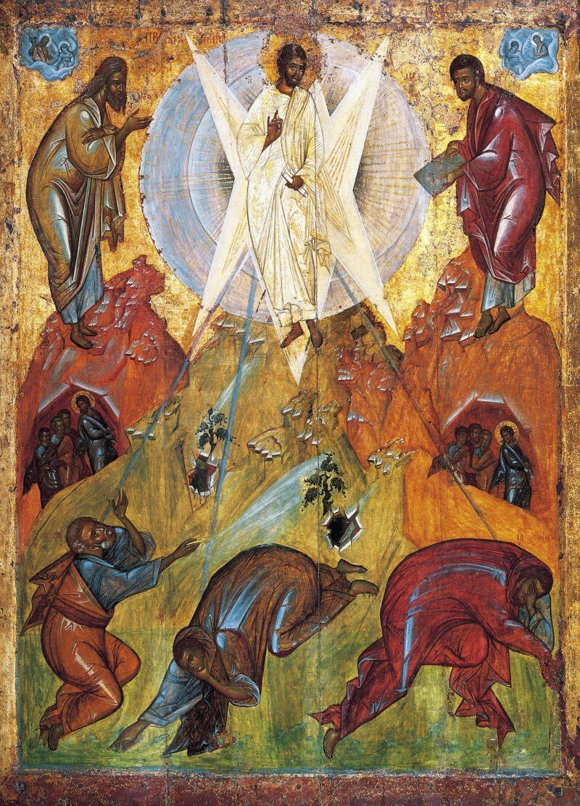

<!-- START doctoc generated TOC please keep comment here to allow auto update -->

<!-- DON'T EDIT THIS SECTION, INSTEAD RE-RUN doctoc TO UPDATE -->

**Table of Contents** _generated with [DocToc](https://github.com/ktechhub/doctoc)_

<!---toc start-->

- [November 2025](#november-2025)
  - [November 01, 2025](#november-01-2025)
    - [The Luminous Mysteries - Day 305](#the-luminous-mysteries---day-305)
    - [AI-Generated Summary: On the Five Great Luminous Mysteries Which Illuminate the World](#ai-generated-summary-on-the-five-great-luminous-mysteries-which-illuminate-the-world)
    - [In this Renaissance fresco 'The Baptism of Christ' by an unknown artist at Padua's Church of San Benedetto Vecchio, John the Baptist performs the sacred rite upon Jesus in the Jordan River The Holy Spirit descends as a dove while the act of profound humility transforms the waters of creation, revealing the divine life through this first Luminous Mystery (Stock Image) - Day 305](#in-this-renaissance-fresco-the-baptism-of-christ-by-an-unknown-artist-at-paduas-church-of-san-benedetto-vecchio-john-the-baptist-performs-the-sacred-rite-upon-jesus-in-the-jordan-river-the-holy-spirit-descends-as-a-dove-while-the-act-of-profound-humility-transforms-the-waters-of-creation-revealing-the-divine-life-through-this-first-luminous-mystery-stock-image---day-305)
    - [Carl Bloch's 19th-century oil painting 'The Wedding at Cana' depicts Jesus performing his first miracle by transforming water into wine at a wedding celebration, capturing this Luminous Mystery with Danish Golden Age artistry - Day 305](#carl-blochs-19th-century-oil-painting-the-wedding-at-cana-depicts-jesus-performing-his-first-miracle-by-transforming-water-into-wine-at-a-wedding-celebration-capturing-this-luminous-mystery-with-danish-golden-age-artistry---day-305)
    - [Lorenzo Lotto's 'Christ and the Adulteress' (c 1525-1530), an oil on canvas housed at the Louvre Museum, powerfully captures the moment Jesus protects the woman from stoning, embodying his merciful proclamation of the Kingdom of God through forgiveness and grace - Day 305](#lorenzo-lottos-christ-and-the-adulteress-c-1525-1530-an-oil-on-canvas-housed-at-the-louvre-museum-powerfully-captures-the-moment-jesus-protects-the-woman-from-stoning-embodying-his-merciful-proclamation-of-the-kingdom-of-god-through-forgiveness-and-grace---day-305)
    - ['The Transfiguration' by Theophanes the Greek, a 1403 Byzantine fresco housed at the Tretyakov Gallery in Moscow, depicts Christ radiant in divine light flanked by Moses and Elijah as apostles Peter, James, and John witness this luminous revelation - Day 305](#the-transfiguration-by-theophanes-the-greek-a-1403-byzantine-fresco-housed-at-the-tretyakov-gallery-in-moscow-depicts-christ-radiant-in-divine-light-flanked-by-moses-and-elijah-as-apostles-peter-james-and-john-witness-this-luminous-revelation---day-305)
    - [In Juan de Juanes' 1562 Spanish Renaissance masterpiece 'The Last Supper', housed at the Museo del Prado, the artist captures the profound moment of the Institution of the Eucharist where Christ offers the consecrated host to his apostles, rendered in oil on panel with sacramental solemnity - Day 305](#in-juan-de-juanes-1562-spanish-renaissance-masterpiece-the-last-supper-housed-at-the-museo-del-prado-the-artist-captures-the-profound-moment-of-the-institution-of-the-eucharist-where-christ-offers-the-consecrated-host-to-his-apostles-rendered-in-oil-on-panel-with-sacramental-solemnity---day-305)
  - [November 02, 2025](#november-02-2025)
    - [The Sorrowful Mysteries - Day 306](#the-sorrowful-mysteries---day-306)
    - [AI-Generated Summary: On the Five Profound Sorrows Which the Lord Endured for the Redemption of a Fallen World](#ai-generated-summary-on-the-five-profound-sorrows-which-the-lord-endured-for-the-redemption-of-a-fallen-world)
    - [Alessandro Maganza's 'The Prayer of Jesus in Gethsemane' (c 1590-1610), an oil on canvas in the Mannerist style located in Vicenza Cathedral, depicts Christ's profound spiritual agony as He prays while His disciples sleep, capturing the moment of divine submission before His Passion (Stock Image) - Day 306](#alessandro-maganzas-the-prayer-of-jesus-in-gethsemane-c-1590-1610-an-oil-on-canvas-in-the-mannerist-style-located-in-vicenza-cathedral-depicts-christs-profound-spiritual-agony-as-he-prays-while-his-disciples-sleep-capturing-the-moment-of-divine-submission-before-his-passion-stock-image---day-306)
    - [William-Adolphe Bouguereau's 1880 oil on canvas 'The Flagellation of Our Lord Jesus Christ,' located in the Cathedral of La Rochelle, depicts Christ's brutal scourging at the pillar with profound divine resignation and academic classicism - Day 306](#william-adolphe-bouguereaus-1880-oil-on-canvas-the-flagellation-of-our-lord-jesus-christ-located-in-the-cathedral-of-la-rochelle-depicts-christs-brutal-scourging-at-the-pillar-with-profound-divine-resignation-and-academic-classicism---day-306)
    - [In 'Ecce Homo', attributed to Caravaggio around 1605, the Baroque master depicts the suffering Christ crowned with thorns, presented to the people in a powerful oil on canvas from a private collection - Day 306](#in-ecce-homo-attributed-to-caravaggio-around-1605-the-baroque-master-depicts-the-suffering-christ-crowned-with-thorns-presented-to-the-people-in-a-powerful-oil-on-canvas-from-a-private-collection---day-306)
    - [Raphael's 1516-1517 oil painting 'Christ Falls on the Way to Calvary', housed in Madrid's Museo del Prado, powerfully depicts Christ stumbling under the cross's weight during the fourth Sorrowful Mystery of the Rosary - Day 306](#raphaels-1516-1517-oil-painting-christ-falls-on-the-way-to-calvary-housed-in-madrids-museo-del-prado-powerfully-depicts-christ-stumbling-under-the-crosss-weight-during-the-fourth-sorrowful-mystery-of-the-rosary---day-306)
    - [Pietro Gagliardi's 1847-1852 fresco 'Crucifixion' in the church of San Girolamo dei Croati, Rome, depicts Christ's ultimate sacrifice on the cross, surrounded by the grieving figures of the Virgin Mary, John the Evangelist, and Mary Magdalene at the foot of the cross, emphasizing the profound theological significance of this sorrowful mystery (Stock Image) - Day 306](#pietro-gagliardis-1847-1852-fresco-crucifixion-in-the-church-of-san-girolamo-dei-croati-rome-depicts-christs-ultimate-sacrifice-on-the-cross-surrounded-by-the-grieving-figures-of-the-virgin-mary-john-the-evangelist-and-mary-magdalene-at-the-foot-of-the-cross-emphasizing-the-profound-theological-significance-of-this-sorrowful-mystery-stock-image---day-306)
  - [November 03, 2025](#november-03-2025)
    - [The Glorious Mysteries - Day 307](#the-glorious-mysteries---day-307)
    - [AI-Generated Summary: On the Five Great Victories Which Crown the Earthly Struggle and Promise a Glory Yet to Come](#ai-generated-summary-on-the-five-great-victories-which-crown-the-earthly-struggle-and-promise-a-glory-yet-to-come)
    - [Annibale Carracci's 1600 Baroque masterpiece 'The Three Marys at the Tomb', an oil on canvas at the State Hermitage Museum, dramatically captures the holy women's astonishment as they discover Christ's empty tomb, heralding His Resurrection - Day 307](#annibale-carraccis-1600-baroque-masterpiece-the-three-marys-at-the-tomb-an-oil-on-canvas-at-the-state-hermitage-museum-dramatically-captures-the-holy-womens-astonishment-as-they-discover-christs-empty-tomb-heralding-his-resurrection---day-307)
    - [Duccio di Buoninsegna's 1308-1311 tempera on wood panel 'Christ Taking Leave of the Apostles,' housed in the Museo dell'Opera del Duomo, Siena, captures the moment of Christ's post-Resurrection appearance and final commissioning of His apostles before His glorious Ascension into heaven - Day 307](#duccio-di-buoninsegnas-1308-1311-tempera-on-wood-panel-christ-taking-leave-of-the-apostles-housed-in-the-museo-dellopera-del-duomo-siena-captures-the-moment-of-christs-post-resurrection-appearance-and-final-commissioning-of-his-apostles-before-his-glorious-ascension-into-heaven---day-307)
    - [Jean Restout II's 1732 French Baroque masterpiece 'Pentecost,' an oil on canvas housed in the Louvre Museum, dramatically captures the Descent of the Holy Spirit as tongues of fire upon the Virgin Mary and the apostles gathered in the upper room - Day 307](#jean-restout-iis-1732-french-baroque-masterpiece-pentecost-an-oil-on-canvas-housed-in-the-louvre-museum-dramatically-captures-the-descent-of-the-holy-spirit-as-tongues-of-fire-upon-the-virgin-mary-and-the-apostles-gathered-in-the-upper-room---day-307)
    - [Cesare Mariani's 1863 fresco 'Assumption of the Virgin with Vision of St Bonaventure' in the Chiesa di Santa Lucia del Gonfalone, Rome, depicts the Virgin Mary's bodily assumption into heaven as witnessed by St Bonaventure, rendered in the Neoclassical style - Day 307](#cesare-marianis-1863-fresco-assumption-of-the-virgin-with-vision-of-st-bonaventure-in-the-chiesa-di-santa-lucia-del-gonfalone-rome-depicts-the-virgin-marys-bodily-assumption-into-heaven-as-witnessed-by-st-bonaventure-rendered-in-the-neoclassical-style---day-307)
    - [Giuseppe Rollini's 19th-century fresco 'Mary, Help of Christians' in Turin, Italy, masterfully depicts the Virgin Mary's Coronation as Queen of Heaven, presenting her in a traditional Catholic iconography of maternal protection and glorious intercession for the faithful (Stock Image) - Day 307](#giuseppe-rollinis-19th-century-fresco-mary-help-of-christians-in-turin-italy-masterfully-depicts-the-virgin-marys-coronation-as-queen-of-heaven-presenting-her-in-a-traditional-catholic-iconography-of-maternal-protection-and-glorious-intercession-for-the-faithful-stock-image---day-307)
  - [November 04, 2025](#november-04-2025)
    - [The Joyful Mysteries - Day 308](#the-joyful-mysteries---day-308)
    - [AI-Generated Summary: On the Moment When Eternity Bent Low and a Virgin Bore the Infinite](#ai-generated-summary-on-the-moment-when-eternity-bent-low-and-a-virgin-bore-the-infinite)
    - [Fra Angelico's 'The Annunciation' (mid-1430s), a tempera on panel housed at the Museo del Prado in Madrid, delicately captures the pivotal biblical moment when Archangel Gabriel announces to the Virgin Mary that she will bear the Son of God, set within the refined architecture of the Early Renaissance period - Day 308](#fra-angelicos-the-annunciation-mid-1430s-a-tempera-on-panel-housed-at-the-museo-del-prado-in-madrid-delicately-captures-the-pivotal-biblical-moment-when-archangel-gabriel-announces-to-the-virgin-mary-that-she-will-bear-the-son-of-god-set-within-the-refined-architecture-of-the-early-renaissance-period---day-308)
  - [November 05, 2025](#november-05-2025)
    - [The Luminous Mysteries - Day 309](#the-luminous-mysteries---day-309)
    - [AI-Generated Summary: On the Five Great Luminous Mysteries Which Illuminate the Path from the River Jordan to the Upper Room](#ai-generated-summary-on-the-five-great-luminous-mysteries-which-illuminate-the-path-from-the-river-jordan-to-the-upper-room)
    - [Alexander Andreyevich Ivanov's monumental 1837-1857 oil painting 'Apparition of the Messiah,' housed in Moscow's Tretyakov Gallery, captures John the Baptist pointing toward the approaching Christ as diverse figures in the crowd reveal varied reactions to this pivotal moment from the Luminous Mysteries - Day 309](#alexander-andreyevich-ivanovs-monumental-1837-1857-oil-painting-apparition-of-the-messiah-housed-in-moscows-tretyakov-gallery-captures-john-the-baptist-pointing-toward-the-approaching-christ-as-diverse-figures-in-the-crowd-reveal-varied-reactions-to-this-pivotal-moment-from-the-luminous-mysteries---day-309)
    - [Gerard David's 'The Marriage at Cana,' painted around 1500 in oil on wood, is an exquisite Early Netherlandish panel housed at the Louvre Museum This detailed work captures the moment of Christ's first public miracle, where He transforms water into wine at the wedding feast, revealing His divine glory through this foundational Luminous Mystery - Day 309](#gerard-davids-the-marriage-at-cana-painted-around-1500-in-oil-on-wood-is-an-exquisite-early-netherlandish-panel-housed-at-the-louvre-museum-this-detailed-work-captures-the-moment-of-christs-first-public-miracle-where-he-transforms-water-into-wine-at-the-wedding-feast-revealing-his-divine-glory-through-this-foundational-luminous-mystery---day-309)
    - [In his 1894 gouache painting 'Healing of the Lepers at Capernaum,' James Tissot masterfully depicts Jesus's compassionate healing ministry, a tangible manifestation of His proclamation of the Kingdom of God (Stock Image) - Day 309](#in-his-1894-gouache-painting-healing-of-the-lepers-at-capernaum-james-tissot-masterfully-depicts-jesuss-compassionate-healing-ministry-a-tangible-manifestation-of-his-proclamation-of-the-kingdom-of-god-stock-image---day-309)
    - ['The Transfiguration' depicts Christ radiating divine light upon a high mountain, His face shining like the sun and His garments brilliantly white as He converses with Moses and Elijah before the awestruck apostles Peter, James, and John, with this sacred moment captured in the Votive Church of Vienna - Day 309](#the-transfiguration-depicts-christ-radiating-divine-light-upon-a-high-mountain-his-face-shining-like-the-sun-and-his-garments-brilliantly-white-as-he-converses-with-moses-and-elijah-before-the-awestruck-apostles-peter-james-and-john-with-this-sacred-moment-captured-in-the-votive-church-of-vienna---day-309)
    - [In Juan de Juanes's 1562 Spanish Renaissance masterpiece 'The Last Supper', housed at the Museo del Prado, the artist uses oil on panel to depict the profound moment of the Institution of the Eucharist, where Christ offers the consecrated host to His apostles - Day 309](#in-juan-de-juaness-1562-spanish-renaissance-masterpiece-the-last-supper-housed-at-the-museo-del-prado-the-artist-uses-oil-on-panel-to-depict-the-profound-moment-of-the-institution-of-the-eucharist-where-christ-offers-the-consecrated-host-to-his-apostles---day-309)
  - [November 06, 2025](#november-06-2025)
    - [The Sorrowful Mysteries - Day 310](#the-sorrowful-mysteries---day-310)
    - [AI-Generated Summary: The First Profound Sorrow and the Four That Follow in the Garden of Our Redemption](#ai-generated-summary-the-first-profound-sorrow-and-the-four-that-follow-in-the-garden-of-our-redemption)
    - [Giotto di Bondone's 1304-1306 fresco 'The Arrest of Christ (Kiss of Judas)' in the Scrovegni Chapel captures the dramatic moment of Judas's betrayal with a kiss in Gethsemane, illustrating the first Sorrowful Mystery of the Rosary with profound emotional intensity - Day 310](#giotto-di-bondones-1304-1306-fresco-the-arrest-of-christ-kiss-of-judas-in-the-scrovegni-chapel-captures-the-dramatic-moment-of-judass-betrayal-with-a-kiss-in-gethsemane-illustrating-the-first-sorrowful-mystery-of-the-rosary-with-profound-emotional-intensity---day-310)
    - [In his 1880 Academic Classicism masterpiece 'The Flagellation of Our Lord Jesus Christ', William-Adolphe Bouguereau depicts Christ's brutal scourging at the pillar with profound divine resignation, rendered in oil on canvas for the Cathedral of La Rochelle - Day 310](#in-his-1880-academic-classicism-masterpiece-the-flagellation-of-our-lord-jesus-christ-william-adolphe-bouguereau-depicts-christs-brutal-scourging-at-the-pillar-with-profound-divine-resignation-rendered-in-oil-on-canvas-for-the-cathedral-of-la-rochelle---day-310)
    - [Caravaggio's 1605 Baroque masterpiece 'Ecce Homo', an oil on canvas housed at Palazzo Bianco in Genoa, dramatically depicts Pontius Pilate presenting the thorn-crowned Christ to the mocking crowd in fulfillment of the Sorrowful Mystery where the King of Kings received His painful mocking diadem - Day 310](#caravaggios-1605-baroque-masterpiece-ecce-homo-an-oil-on-canvas-housed-at-palazzo-bianco-in-genoa-dramatically-depicts-pontius-pilate-presenting-the-thorn-crowned-christ-to-the-mocking-crowd-in-fulfillment-of-the-sorrowful-mystery-where-the-king-of-kings-received-his-painful-mocking-diadem---day-310)
    - [In his 1605 Baroque masterpiece 'Christ Carrying the Cross', Orazio Gentileschi renders the fourth Sorrowful Mystery in oil on canvas, depicting an exhausted Christ struggling under the weight of the cross on His agonizing journey to Golgotha - Day 310](#in-his-1605-baroque-masterpiece-christ-carrying-the-cross-orazio-gentileschi-renders-the-fourth-sorrowful-mystery-in-oil-on-canvas-depicting-an-exhausted-christ-struggling-under-the-weight-of-the-cross-on-his-agonizing-journey-to-golgotha---day-310)
    - [Peter Paul Rubens' Baroque masterpiece 'The Descent from the Cross' (1616-1617), an oil on panel in Antwerp Cathedral, dramatically depicts the sorrowful moment of the Crucifixion where Joseph of Arimathea and Nicodemus lower Christ's lifeless body, emphasizing the profound humanity and sacrifice of this pivotal event - Day 310](#peter-paul-rubens-baroque-masterpiece-the-descent-from-the-cross-1616-1617-an-oil-on-panel-in-antwerp-cathedral-dramatically-depicts-the-sorrowful-moment-of-the-crucifixion-where-joseph-of-arimathea-and-nicodemus-lower-christs-lifeless-body-emphasizing-the-profound-humanity-and-sacrifice-of-this-pivotal-event---day-310)
  - [November 07, 2025](#november-07-2025)
    - [The Glorious Mysteries - Day 311](#the-glorious-mysteries---day-311)
    - [AI-Generated Summary: On the First Two Glorious Mysteries and the Three That Follow](#ai-generated-summary-on-the-first-two-glorious-mysteries-and-the-three-that-follow)
    - [Annibale Carracci's Baroque masterpiece 'The Three Marys at the Tomb' (c 1600), an oil on canvas housed at the State Hermitage Museum, dramatically captures the holy women's astonishment as they discover Christ's empty tomb at the moment of His Resurrection - Day 311](#annibale-carraccis-baroque-masterpiece-the-three-marys-at-the-tomb-c-1600-an-oil-on-canvas-housed-at-the-state-hermitage-museum-dramatically-captures-the-holy-womens-astonishment-as-they-discover-christs-empty-tomb-at-the-moment-of-his-resurrection---day-311)
    - [Bernardino Gandino's Renaissance oil painting 'Ascension of the Lord' depicts the risen Christ ascending bodily into heaven while the apostles watch in wonder below, capturing the moment of His coronation as human nature is enthroned at God's right hand (Stock Image) - Day 311](#bernardino-gandinos-renaissance-oil-painting-ascension-of-the-lord-depicts-the-risen-christ-ascending-bodily-into-heaven-while-the-apostles-watch-in-wonder-below-capturing-the-moment-of-his-coronation-as-human-nature-is-enthroned-at-gods-right-hand-stock-image---day-311)
    - [Jean Restout II's 1732 French Baroque masterpiece 'Pentecost', an oil on canvas housed at the Louvre Museum, dramatically captures the Descent of the Holy Spirit as tongues of fire descend upon the Virgin Mary and apostles gathered in the upper room, with intense lighting emphasizing this divine intervention - Day 311](#jean-restout-iis-1732-french-baroque-masterpiece-pentecost-an-oil-on-canvas-housed-at-the-louvre-museum-dramatically-captures-the-descent-of-the-holy-spirit-as-tongues-of-fire-descend-upon-the-virgin-mary-and-apostles-gathered-in-the-upper-room-with-intense-lighting-emphasizing-this-divine-intervention---day-311)
    - [Giuseppe and Andrea Orazi's 1706 Baroque fresco 'The Assumption of the Virgin Mary' in the main cupola of Chiesa di Santa Maria del Orto, Rome, depicts the Virgin rising to heaven surrounded by angels and putti, her body and soul gloriously assumed into celestial glory (Stock Image) - Day 311](#giuseppe-and-andrea-orazis-1706-baroque-fresco-the-assumption-of-the-virgin-mary-in-the-main-cupola-of-chiesa-di-santa-maria-del-orto-rome-depicts-the-virgin-rising-to-heaven-surrounded-by-angels-and-putti-her-body-and-soul-gloriously-assumed-into-celestial-glory-stock-image---day-311)
    - [Diego Velázquez's Baroque masterpiece 'Coronation of the Virgin' (c 1641-1644), an oil on canvas housed at the Museo del Prado, depicts the Holy Trinity—God the Father and Christ placing a crown upon Mary's head while the Holy Spirit hovers above—ceremoniously crowning the Blessed Virgin as Queen of Heaven amidst a host of witnessing angels - Day 311](#diego-vel%C3%A1zquezs-baroque-masterpiece-coronation-of-the-virgin-c-1641-1644-an-oil-on-canvas-housed-at-the-museo-del-prado-depicts-the-holy-trinitygod-the-father-and-christ-placing-a-crown-upon-marys-head-while-the-holy-spirit-hovers-aboveceremoniously-crowning-the-blessed-virgin-as-queen-of-heaven-amidst-a-host-of-witnessing-angels---day-311)
  - [November 08, 2025](#november-08-2025)
    - [The Joyful Mysteries - Day 312](#the-joyful-mysteries---day-312)
    - [AI-Generated Summary: A Consideration of the First Three Joyful Mysteries Concerning the Angel's Tidings and the Lord's Humble Arrival](#ai-generated-summary-a-consideration-of-the-first-three-joyful-mysteries-concerning-the-angels-tidings-and-the-lords-humble-arrival)
    - [Jan van Eyck's 1434-1436 oil on panel 'The Annunciation' at the National Gallery of Art, Washington DC portrays the Archangel Gabriel announcing to the Virgin Mary that she will bear the Son of God, capturing her humble acceptance of divine will through Northern Renaissance mastery and rich symbolic detail - Day 312](#jan-van-eycks-1434-1436-oil-on-panel-the-annunciation-at-the-national-gallery-of-art-washington-dc-portrays-the-archangel-gabriel-announcing-to-the-virgin-mary-that-she-will-bear-the-son-of-god-capturing-her-humble-acceptance-of-divine-will-through-northern-renaissance-mastery-and-rich-symbolic-detail---day-312)
    - [In the Basilica of the Visitation in Ein Karem, this artwork 'The Visitation' depicts the pregnant Virgin Mary greeting her cousin Elizabeth, who recognizes the divine presence within Mary, a moment of mutual joy and Spirit-filled revelation - Day 312](#in-the-basilica-of-the-visitation-in-ein-karem-this-artwork-the-visitation-depicts-the-pregnant-virgin-mary-greeting-her-cousin-elizabeth-who-recognizes-the-divine-presence-within-mary-a-moment-of-mutual-joy-and-spirit-filled-revelation---day-312)
    - [Gerard van Honthorst's 1622 Baroque masterpiece 'Adoration of the Shepherds', an oil on canvas housed at the Wallraf-Richartz Museum in Cologne, dramatically illuminates the Nativity scene where humble shepherds worship the newborn Christ child in a stable bathed in divine celestial light - Day 312](#gerard-van-honthorsts-1622-baroque-masterpiece-adoration-of-the-shepherds-an-oil-on-canvas-housed-at-the-wallraf-richartz-museum-in-cologne-dramatically-illuminates-the-nativity-scene-where-humble-shepherds-worship-the-newborn-christ-child-in-a-stable-bathed-in-divine-celestial-light---day-312)
    - [Aert de Gelder's 1700-1710 Dutch Golden Age masterpiece 'Simeon's Song of Praise', rendered in oil on canvas and housed at the Mauritshuis in The Hague, captures the profound moment when the aged Simeon recognizes the infant Jesus as the Messiah during the Presentation in the Temple, a key Joyful Mystery of the Rosary - Day 312](#aert-de-gelders-1700-1710-dutch-golden-age-masterpiece-simeons-song-of-praise-rendered-in-oil-on-canvas-and-housed-at-the-mauritshuis-in-the-hague-captures-the-profound-moment-when-the-aged-simeon-recognizes-the-infant-jesus-as-the-messiah-during-the-presentation-in-the-temple-a-key-joyful-mystery-of-the-rosary---day-312)
    - [William Holman Hunt's 1860 Pre-Raphaelite masterpiece 'The Finding of the Saviour in the Temple' depicts the moment Mary and Joseph discover their twelve-year-old son Jesus discussing theology with learned rabbis in the Jerusalem Temple - Day 312](#william-holman-hunts-1860-pre-raphaelite-masterpiece-the-finding-of-the-saviour-in-the-temple-depicts-the-moment-mary-and-joseph-discover-their-twelve-year-old-son-jesus-discussing-theology-with-learned-rabbis-in-the-jerusalem-temple---day-312)
  - [November 09, 2025](#november-09-2025)
    - [The Luminous Mysteries - Day 313](#the-luminous-mysteries---day-313)
    - [AI-Generated Summary: The First Light Shown at the Jordan and the Mysteries That Followed](#ai-generated-summary-the-first-light-shown-at-the-jordan-and-the-mysteries-that-followed)
    - [An unknown Renaissance artist's fresco 'The Baptism of Christ' in Padua's Church of San Benedetto Vecchio depicts John the Baptist baptizing Jesus in the Jordan River as the Holy Spirit descends like a dove (Stock Image) - Day 313](#an-unknown-renaissance-artists-fresco-the-baptism-of-christ-in-paduas-church-of-san-benedetto-vecchio-depicts-john-the-baptist-baptizing-jesus-in-the-jordan-river-as-the-holy-spirit-descends-like-a-dove-stock-image---day-313)
    - [Gerard David's 'The Marriage at Cana' (c 1500), an Early Netherlandish oil painting housed at the Louvre Museum, depicts the wedding feast where Jesus performed his first public miracle by transforming water into wine - Day 313](#gerard-davids-the-marriage-at-cana-c-1500-an-early-netherlandish-oil-painting-housed-at-the-louvre-museum-depicts-the-wedding-feast-where-jesus-performed-his-first-public-miracle-by-transforming-water-into-wine---day-313)
    - [In his 1894 gouache painting 'Healing of the Lepers at Capernaum', James Tissot masterfully depicts Jesus demonstrating the Kingdom of God's arrival through an act of profound compassion and divine authority as he heals the afflicted (Stock Image) - Day 313](#in-his-1894-gouache-painting-healing-of-the-lepers-at-capernaum-james-tissot-masterfully-depicts-jesus-demonstrating-the-kingdom-of-gods-arrival-through-an-act-of-profound-compassion-and-divine-authority-as-he-heals-the-afflicted-stock-image---day-313)
    - [Raphael's 1516-1520 masterpiece 'The Transfiguration,' painted in tempera on wood and housed in the Vatican Museums, dramatically portrays Christ's divine glory revealed on Mount Tabor, where His face shone like the sun and His clothes became white as light before the astonished apostles - Day 313](#raphaels-1516-1520-masterpiece-the-transfiguration-painted-in-tempera-on-wood-and-housed-in-the-vatican-museums-dramatically-portrays-christs-divine-glory-revealed-on-mount-tabor-where-his-face-shone-like-the-sun-and-his-clothes-became-white-as-light-before-the-astonished-apostles---day-313)
    - [Juan de Juanes's 1562 Spanish Renaissance masterpiece 'The Last Supper,' housed at the Museo del Prado, depicts the pivotal Luminous Mystery where Christ institutes the Eucharist, offering the consecrated host to His apostles - Day 313](#juan-de-juaness-1562-spanish-renaissance-masterpiece-the-last-supper-housed-at-the-museo-del-prado-depicts-the-pivotal-luminous-mystery-where-christ-institutes-the-eucharist-offering-the-consecrated-host-to-his-apostles---day-313)
  - [November 10, 2025](#november-10-2025)
    - [The Sorrowful Mysteries - Day 314](#the-sorrowful-mysteries---day-314)
    - [AI-Generated Summary: On the Agony in the Garden and the Solitary Weight Borne for All Mankind](#ai-generated-summary-on-the-agony-in-the-garden-and-the-solitary-weight-borne-for-all-mankind)
    - [Vicente Juan Masip's 1550 oil on panel 'Agony in the Garden,' housed at the Museo del Prado, depicts Christ kneeling in anguished prayer at Gethsemane as angels present the chalice of suffering, with his sleeping apostles in the foreground and Judas approaching with soldiers - Day 314](#vicente-juan-masips-1550-oil-on-panel-agony-in-the-garden-housed-at-the-museo-del-prado-depicts-christ-kneeling-in-anguished-prayer-at-gethsemane-as-angels-present-the-chalice-of-suffering-with-his-sleeping-apostles-in-the-foreground-and-judas-approaching-with-soldiers---day-314)
    - [Caravaggio's 1607 Baroque masterpiece 'The Flagellation of Christ,' an oil on canvas housed at the Museo di Capodimonte in Naples, dramatically captures the sorrowful mystery of Christ's brutal scourging at the pillar by Roman soldiers - Day 314](#caravaggios-1607-baroque-masterpiece-the-flagellation-of-christ-an-oil-on-canvas-housed-at-the-museo-di-capodimonte-in-naples-dramatically-captures-the-sorrowful-mystery-of-christs-brutal-scourging-at-the-pillar-by-roman-soldiers---day-314)
    - [In this powerful Baroque painting 'Ecce Homo' attributed to Caravaggio from c 1605, the suffering Christ is presented to the people wearing the crown of thorns, depicting the Sorrowful Mystery of the Crowning with Thorns in oil on canvas - Day 314](#in-this-powerful-baroque-painting-ecce-homo-attributed-to-caravaggio-from-c-1605-the-suffering-christ-is-presented-to-the-people-wearing-the-crown-of-thorns-depicting-the-sorrowful-mystery-of-the-crowning-with-thorns-in-oil-on-canvas---day-314)
    - [In his 1605 Baroque masterpiece 'Christ Carrying the Cross', Orazio Gentileschi renders the exhausted Christ struggling under the immense weight of the cross on the road to Golgotha, using oil on canvas to powerfully convey the profound physical and spiritual burden of this Sorrowful Mystery - Day 314](#in-his-1605-baroque-masterpiece-christ-carrying-the-cross-orazio-gentileschi-renders-the-exhausted-christ-struggling-under-the-immense-weight-of-the-cross-on-the-road-to-golgotha-using-oil-on-canvas-to-powerfully-convey-the-profound-physical-and-spiritual-burden-of-this-sorrowful-mystery---day-314)
    - [Pietro Gagliardi's 1847-1852 fresco 'Crucifixion' in San Girolamo dei Croati, Rome, depicts Christ's ultimate sacrifice on the cross, surrounded by the grieving Virgin Mary, John the Evangelist, and Mary Magdalene (Stock Image) - Day 314](#pietro-gagliardis-1847-1852-fresco-crucifixion-in-san-girolamo-dei-croati-rome-depicts-christs-ultimate-sacrifice-on-the-cross-surrounded-by-the-grieving-virgin-mary-john-the-evangelist-and-mary-magdalene-stock-image---day-314)
  - [November 11, 2025](#november-11-2025)
    - [The Glorious Mysteries - Day 315](#the-glorious-mysteries---day-315)
    - [AI-Generated Summary: A Contemplation on the Five Glorious Mysteries and Their Artistic Representations in Sacred Art](#ai-generated-summary-a-contemplation-on-the-five-glorious-mysteries-and-their-artistic-representations-in-sacred-art)
    - [Annibale Carracci's 'The Three Marys at the Tomb' (c 1600), an oil on canvas housed at the State Hermitage Museum, dramatically captures the holy women's astonishment as they discover Christ's empty tomb, embodying the Baroque style's vivid emotional intensity in depicting the moment of the Resurrection - Day 315](#annibale-carraccis-the-three-marys-at-the-tomb-c-1600-an-oil-on-canvas-housed-at-the-state-hermitage-museum-dramatically-captures-the-holy-womens-astonishment-as-they-discover-christs-empty-tomb-embodying-the-baroque-styles-vivid-emotional-intensity-in-depicting-the-moment-of-the-resurrection---day-315)
    - [In this magnificent 12th-century Byzantine mosaic at Venice's Basilica di San Marco, 'The Ascension' depicts Christ rising to heaven within a luminous mandorla supported by angels, while the Virgin Mary stands centrally below surrounded by astonished apostles witnessing this glorious event - Day 315](#in-this-magnificent-12th-century-byzantine-mosaic-at-venices-basilica-di-san-marco-the-ascension-depicts-christ-rising-to-heaven-within-a-luminous-mandorla-supported-by-angels-while-the-virgin-mary-stands-centrally-below-surrounded-by-astonished-apostles-witnessing-this-glorious-event---day-315)
    - [Simone Peterzano's 'Pentecost' (c 1580), an oil on canvas housed in the Church of San Fedele in Milan, presents a Mannerist interpretation of the Descent of the Holy Spirit, depicting the Virgin Mary and the disciples receiving tongues of fire as the Holy Spirit descends upon them (Stock Image) - Day 315](#simone-peterzanos-pentecost-c-1580-an-oil-on-canvas-housed-in-the-church-of-san-fedele-in-milan-presents-a-mannerist-interpretation-of-the-descent-of-the-holy-spirit-depicting-the-virgin-mary-and-the-disciples-receiving-tongues-of-fire-as-the-holy-spirit-descends-upon-them-stock-image---day-315)
    - [Giuseppe and Andrea Orazi's 1706 Baroque fresco 'The Assumption of the Virgin Mary' in the main cupola of Chiesa di Santa Maria del Orto, Rome, depicts the Virgin Mary being assumed body and soul into heaven, surrounded by a host of angels and putti in a dynamic composition that celebrates her glorious ascent (Stock Image) - Day 315](#giuseppe-and-andrea-orazis-1706-baroque-fresco-the-assumption-of-the-virgin-mary-in-the-main-cupola-of-chiesa-di-santa-maria-del-orto-rome-depicts-the-virgin-mary-being-assumed-body-and-soul-into-heaven-surrounded-by-a-host-of-angels-and-putti-in-a-dynamic-composition-that-celebrates-her-glorious-ascent-stock-image---day-315)
    - [Diego Velázquez's 'Coronation of the Virgin' (c 1641-1644), an oil on canvas masterpiece housed at the Museo del Prado, dramatically portrays the Holy Trinity—God the Father and Christ placing a crown upon the Virgin Mary while the Holy Spirit hovers above—as she is exalted as Queen of Heaven before a host of witnessing angels - Day 315](#diego-vel%C3%A1zquezs-coronation-of-the-virgin-c-1641-1644-an-oil-on-canvas-masterpiece-housed-at-the-museo-del-prado-dramatically-portrays-the-holy-trinitygod-the-father-and-christ-placing-a-crown-upon-the-virgin-mary-while-the-holy-spirit-hovers-aboveas-she-is-exalted-as-queen-of-heaven-before-a-host-of-witnessing-angels---day-315)
  - [November 12, 2025](#november-12-2025)
    - [The Joyful Mysteries - Day 316](#the-joyful-mysteries---day-316)
    - [AI-Generated Summary: On the First Glad Tidings Which We Call the Joyful Mysteries](#ai-generated-summary-on-the-first-glad-tidings-which-we-call-the-joyful-mysteries)
    - [Henry Ossawa Tanner's 1898 masterpiece 'The Annunciation' presents a revolutionary interpretation of this Joyful Mystery, rendered in oil on canvas The African-American artist depicts the Virgin Mary as an ordinary young woman in a humble Middle Eastern setting, illuminated by divine light that symbolizes the moment she receives the angel's message This groundbreaking work, housed at the Philadelphia Museum of Art, captures the quiet drama of the Annunciation through its realistic approach combined with symbolic spiritual elements - Day 316](#henry-ossawa-tanners-1898-masterpiece-the-annunciation-presents-a-revolutionary-interpretation-of-this-joyful-mystery-rendered-in-oil-on-canvas-the-african-american-artist-depicts-the-virgin-mary-as-an-ordinary-young-woman-in-a-humble-middle-eastern-setting-illuminated-by-divine-light-that-symbolizes-the-moment-she-receives-the-angels-message-this-groundbreaking-work-housed-at-the-philadelphia-museum-of-art-captures-the-quiet-drama-of-the-annunciation-through-its-realistic-approach-combined-with-symbolic-spiritual-elements---day-316)
    - [Rembrandt van Rijn's 1640 oil painting 'The Visitation', housed at the Detroit Institute of Arts, masterfully depicts Mary and Elizabeth embracing with profound chiaroscuro that illuminates their spiritual connection and miraculous pregnancies during this sacred encounter - Day 316](#rembrandt-van-rijns-1640-oil-painting-the-visitation-housed-at-the-detroit-institute-of-arts-masterfully-depicts-mary-and-elizabeth-embracing-with-profound-chiaroscuro-that-illuminates-their-spiritual-connection-and-miraculous-pregnancies-during-this-sacred-encounter---day-316)
    - [Caravaggio's 1600 Baroque masterpiece 'Nativity with St Francis and St Lawrence' depicts the newborn Christ in a stable with dramatic chiaroscuro lighting, surrounded by the Virgin Mary, saints Francis and Lawrence, and humble shepherds, though the original oil on canvas was tragically stolen in 1969 and remains missing - Day 316](#caravaggios-1600-baroque-masterpiece-nativity-with-st-francis-and-st-lawrence-depicts-the-newborn-christ-in-a-stable-with-dramatic-chiaroscuro-lighting-surrounded-by-the-virgin-mary-saints-francis-and-lawrence-and-humble-shepherds-though-the-original-oil-on-canvas-was-tragically-stolen-in-1969-and-remains-missing---day-316)
    - [Giulio Campi's 1547 fresco 'The Presentation of Jesus in the Temple' in Chiesa di Santa Rita, Cremona, captures the sacred moment where Mary and Joseph present the infant Christ to the aged Simeon, fulfilling Jewish purification rituals within the Temple's hallowed space through the Mannerist artistic style (Stock Image) - Day 316](#giulio-campis-1547-fresco-the-presentation-of-jesus-in-the-temple-in-chiesa-di-santa-rita-cremona-captures-the-sacred-moment-where-mary-and-joseph-present-the-infant-christ-to-the-aged-simeon-fulfilling-jewish-purification-rituals-within-the-temples-hallowed-space-through-the-mannerist-artistic-style-stock-image---day-316)
    - [This 20th century Byzantine Revival mosaic by an unknown artist from the Rosary Basilica in Lourdes depicts 'The Finding of Jesus in the Temple,' showing Mary and Joseph discovering young Jesus discussing theology with Temple elders as he reveals his divine wisdom (Stock Image) - Day 316](#this-20th-century-byzantine-revival-mosaic-by-an-unknown-artist-from-the-rosary-basilica-in-lourdes-depicts-the-finding-of-jesus-in-the-temple-showing-mary-and-joseph-discovering-young-jesus-discussing-theology-with-temple-elders-as-he-reveals-his-divine-wisdom-stock-image---day-316)
  - [November 13, 2025](#november-13-2025)
    - [The Luminous Mysteries - Day 317](#the-luminous-mysteries---day-317)
    - [AI-Generated Summary: On the Five Great Luminous Mysteries Which Illuminate the Path of Faith](#ai-generated-summary-on-the-five-great-luminous-mysteries-which-illuminate-the-path-of-faith)
    - [In Alexander Andreyevich Ivanov's monumental 1837-1857 oil painting 'Apparition of the Messiah,' John the Baptist dramatically points toward the approaching Christ at the Jordan River, capturing the profound moment of the first Luminous Mystery as diverse witnesses react with awe and anticipation - Day 317](#in-alexander-andreyevich-ivanovs-monumental-1837-1857-oil-painting-apparition-of-the-messiah-john-the-baptist-dramatically-points-toward-the-approaching-christ-at-the-jordan-river-capturing-the-profound-moment-of-the-first-luminous-mystery-as-diverse-witnesses-react-with-awe-and-anticipation---day-317)
    - [Gerard David's 'The Marriage at Cana,' painted around 1500 in oil on wood, is an exquisite Early Netherlandish panel housed in the Louvre Museum This detailed work captures the moment of Christ's first public miracle, where at His mother's request, He transforms water into wine, thereby revealing His divine glory to the wedding guests and His disciples - Day 317](#gerard-davids-the-marriage-at-cana-painted-around-1500-in-oil-on-wood-is-an-exquisite-early-netherlandish-panel-housed-in-the-louvre-museum-this-detailed-work-captures-the-moment-of-christs-first-public-miracle-where-at-his-mothers-request-he-transforms-water-into-wine-thereby-revealing-his-divine-glory-to-the-wedding-guests-and-his-disciples---day-317)
    - [In his 1525-1530 High Renaissance masterpiece 'Christ and the Adulteress', Lorenzo Lotto captures the moment Jesus protects a woman from stoning, powerfully illustrating the mercy and forgiveness central to His proclamation of the Kingdom of God, now housed in the Louvre Museum - Day 317](#in-his-1525-1530-high-renaissance-masterpiece-christ-and-the-adulteress-lorenzo-lotto-captures-the-moment-jesus-protects-a-woman-from-stoning-powerfully-illustrating-the-mercy-and-forgiveness-central-to-his-proclamation-of-the-kingdom-of-god-now-housed-in-the-louvre-museum---day-317)
    - [Raphael's 1516-1520 masterpiece 'The Transfiguration', painted in tempera on wood and housed in the Vatican Museums, captures Christ's divine radiance on Mount Tabor as His face shines like the sun and His garments become white as light - Day 317](#raphaels-1516-1520-masterpiece-the-transfiguration-painted-in-tempera-on-wood-and-housed-in-the-vatican-museums-captures-christs-divine-radiance-on-mount-tabor-as-his-face-shines-like-the-sun-and-his-garments-become-white-as-light---day-317)
    - [Juan de Juanes's 1562 Spanish Renaissance masterpiece 'The Last Supper', an oil on panel housed at the Museo del Prado, depicts the profound moment of the Institution of the Eucharist where Christ offers the consecrated host to His disciples - Day 317](#juan-de-juaness-1562-spanish-renaissance-masterpiece-the-last-supper-an-oil-on-panel-housed-at-the-museo-del-prado-depicts-the-profound-moment-of-the-institution-of-the-eucharist-where-christ-offers-the-consecrated-host-to-his-disciples---day-317)
  - [November 14, 2025](#november-14-2025)
    - [The Sorrowful Mysteries - Day 318](#the-sorrowful-mysteries---day-318)
    - [AI-Generated Summary: On the First Great Sorrow and the Four That Followed in the Garden of Our Redemption](#ai-generated-summary-on-the-first-great-sorrow-and-the-four-that-followed-in-the-garden-of-our-redemption)
    - [Giotto di Bondone's 1304-1306 fresco 'The Arrest of Christ (Kiss of Judas)' in the Scrovegni Chapel, Padua, dramatically captures Judas's betrayal with a kiss in Gethsemane, illustrating the moment Christ's agony in the garden culminates in His arrest with profound emotional intensity - Day 318](#giotto-di-bondones-1304-1306-fresco-the-arrest-of-christ-kiss-of-judas-in-the-scrovegni-chapel-padua-dramatically-captures-judass-betrayal-with-a-kiss-in-gethsemane-illustrating-the-moment-christs-agony-in-the-garden-culminates-in-his-arrest-with-profound-emotional-intensity---day-318)
    - [Caravaggio's 1607 Baroque masterpiece 'The Flagellation of Christ', an oil on canvas housed at the Museo di Capodimonte in Naples, dramatically depicts the Scourging at the Pillar where Christ is bound while Roman soldiers mercilessly whip Him, emphasizing profound human suffering through intense chiaroscuro - Day 318](#caravaggios-1607-baroque-masterpiece-the-flagellation-of-christ-an-oil-on-canvas-housed-at-the-museo-di-capodimonte-in-naples-dramatically-depicts-the-scourging-at-the-pillar-where-christ-is-bound-while-roman-soldiers-mercilessly-whip-him-emphasizing-profound-human-suffering-through-intense-chiaroscuro---day-318)
    - [Caravaggio's 1605 Baroque masterpiece 'Ecce Homo', an oil on canvas housed at Palazzo Bianco in Genoa, dramatically captures Pontius Pilate presenting the thorn-crowned Christ to the mocking crowd with the solemn declaration \\Behold the Man\\ - Day 318](#caravaggios-1605-baroque-masterpiece-ecce-homo-an-oil-on-canvas-housed-at-palazzo-bianco-in-genoa-dramatically-captures-pontius-pilate-presenting-the-thorn-crowned-christ-to-the-mocking-crowd-with-the-solemn-declaration-behold-the-man---day-318)
    - [In his 1605 Baroque painting 'Christ Carrying the Cross', Orazio Gentileschi masterfully renders the fourth Sorrowful Mystery using oil on canvas, depicting the exhausted Christ struggling under the immense weight of the cross during His agonizing journey to Golgotha - Day 318](#in-his-1605-baroque-painting-christ-carrying-the-cross-orazio-gentileschi-masterfully-renders-the-fourth-sorrowful-mystery-using-oil-on-canvas-depicting-the-exhausted-christ-struggling-under-the-immense-weight-of-the-cross-during-his-agonizing-journey-to-golgotha---day-318)
    - [James Tissot's 1886-1894 gouache painting 'What Our Lord Saw from the Cross', housed at the Brooklyn Museum, presents the profound perspective of Christ during the Crucifixion, depicting the crowd below from His vantage point in this sorrowful mystery - Day 318](#james-tissots-1886-1894-gouache-painting-what-our-lord-saw-from-the-cross-housed-at-the-brooklyn-museum-presents-the-profound-perspective-of-christ-during-the-crucifixion-depicting-the-crowd-below-from-his-vantage-point-in-this-sorrowful-mystery---day-318)
  - [November 15, 2025](#november-15-2025)
    - [The Glorious Mysteries - Day 319](#the-glorious-mysteries---day-319)
    - [AI-Generated Summary: On the Five Glorious Mysteries Which Conclude the Sorrows and Begin the Joys of the World](#ai-generated-summary-on-the-five-glorious-mysteries-which-conclude-the-sorrows-and-begin-the-joys-of-the-world)
    - [Caravaggio's 1601-1602 Baroque masterpiece 'The Incredulity of Saint Thomas', an oil on canvas housed at Sanssouci Palace in Potsdam, dramatically captures the apostle Thomas physically verifying Christ's resurrection by touching the wound in His side, illustrating the profound moment of doubt transformed into faith - Day 319](#caravaggios-1601-1602-baroque-masterpiece-the-incredulity-of-saint-thomas-an-oil-on-canvas-housed-at-sanssouci-palace-in-potsdam-dramatically-captures-the-apostle-thomas-physically-verifying-christs-resurrection-by-touching-the-wound-in-his-side-illustrating-the-profound-moment-of-doubt-transformed-into-faith---day-319)
    - [Bernardino Gandino's Renaissance oil painting 'Ascension of the Lord' depicts the risen Christ ascending bodily into heaven while His apostles watch in wonder below, capturing the second Glorious Mystery of the Rosary (Stock Image) - Day 319](#bernardino-gandinos-renaissance-oil-painting-ascension-of-the-lord-depicts-the-risen-christ-ascending-bodily-into-heaven-while-his-apostles-watch-in-wonder-below-capturing-the-second-glorious-mystery-of-the-rosary-stock-image---day-319)
    - [Simone Peterzano's 'Pentecost' (c 1580), an oil on canvas in the Church of San Fedele, Milan, presents a Mannerist interpretation of the Descent of the Holy Spirit, depicting the Virgin Mary and the gathered disciples receiving the Holy Spirit as tongues of fire, which burns away their fear and fills them with divine boldness (Stock Image) - Day 319](#simone-peterzanos-pentecost-c-1580-an-oil-on-canvas-in-the-church-of-san-fedele-milan-presents-a-mannerist-interpretation-of-the-descent-of-the-holy-spirit-depicting-the-virgin-mary-and-the-gathered-disciples-receiving-the-holy-spirit-as-tongues-of-fire-which-burns-away-their-fear-and-fills-them-with-divine-boldness-stock-image---day-319)
    - [Cesare Mariani's 1863 fresco 'Assumption of the Virgin with Vision of St Bonaventure' in the Chiesa di Santa Lucia del Gonfalone, Rome, depicts the Virgin Mary's bodily ascent into heaven as witnessed by St Bonaventure, rendered in the Neoclassical style with divine grace and theological significance - Day 319](#cesare-marianis-1863-fresco-assumption-of-the-virgin-with-vision-of-st-bonaventure-in-the-chiesa-di-santa-lucia-del-gonfalone-rome-depicts-the-virgin-marys-bodily-ascent-into-heaven-as-witnessed-by-st-bonaventure-rendered-in-the-neoclassical-style-with-divine-grace-and-theological-significance---day-319)
    - [Diego Velázquez's Baroque masterpiece 'Coronation of the Virgin' (c 1641-1644), an oil on canvas housed at the Museo del Prado, depicts the Holy Trinity—God the Father and Christ placing a crown upon Mary while the Holy Spirit hovers above—ceremoniously establishing her as Queen of Heaven amidst a host of witnessing angels - Day 319](#diego-vel%C3%A1zquezs-baroque-masterpiece-coronation-of-the-virgin-c-1641-1644-an-oil-on-canvas-housed-at-the-museo-del-prado-depicts-the-holy-trinitygod-the-father-and-christ-placing-a-crown-upon-mary-while-the-holy-spirit-hovers-aboveceremoniously-establishing-her-as-queen-of-heaven-amidst-a-host-of-witnessing-angels---day-319)
  - [November 16, 2025](#november-16-2025)
    - [The Joyful Mysteries - Day 320](#the-joyful-mysteries---day-320)
    - [AI-Generated Summary: On the Angel's Greeting and the Journey That Followed a Humble Consent to the Divine Will](#ai-generated-summary-on-the-angels-greeting-and-the-journey-that-followed-a-humble-consent-to-the-divine-will)
    - [Jan van Eyck's 1434-1436 oil on panel 'The Annunciation' at the National Gallery of Art, Washington DC portrays Archangel Gabriel's divine announcement to the Virgin Mary, who humbly accepts God's will in this Northern Renaissance masterpiece filled with rich symbolic details - Day 320](#jan-van-eycks-1434-1436-oil-on-panel-the-annunciation-at-the-national-gallery-of-art-washington-dc-portrays-archangel-gabriels-divine-announcement-to-the-virgin-mary-who-humbly-accepts-gods-will-in-this-northern-renaissance-masterpiece-filled-with-rich-symbolic-details---day-320)
    - [Federico Maldarelli's 1889 oil painting 'The Visitation,' housed in the Chiesa dei Santi Severino e Sossio in Naples, presents a traditional academic depiction of the Virgin Mary meeting her cousin Elizabeth, both pregnant with Jesus and John the Baptist (Stock Image) - Day 320](#federico-maldarellis-1889-oil-painting-the-visitation-housed-in-the-chiesa-dei-santi-severino-e-sossio-in-naples-presents-a-traditional-academic-depiction-of-the-virgin-mary-meeting-her-cousin-elizabeth-both-pregnant-with-jesus-and-john-the-baptist-stock-image---day-320)
    - [Gerard van Honthorst's 1622 Baroque masterpiece 'Adoration of the Shepherds,' an oil on canvas housed at the Wallraf-Richartz Museum in Cologne, dramatically illuminates the humble Nativity scene where awestruck shepherds gather to worship the newborn Christ child bathed in celestial light - Day 320](#gerard-van-honthorsts-1622-baroque-masterpiece-adoration-of-the-shepherds-an-oil-on-canvas-housed-at-the-wallraf-richartz-museum-in-cologne-dramatically-illuminates-the-humble-nativity-scene-where-awestruck-shepherds-gather-to-worship-the-newborn-christ-child-bathed-in-celestial-light---day-320)
    - [Giulio Campi's 1547 fresco 'The Presentation of Jesus in the Temple' in Chiesa di Santa Rita, Cremona, depicts Mary and Joseph presenting the infant Christ to Simeon, fulfilling Jewish purification rituals in this Mannerist interpretation of the Joyful Mystery (Stock Image) - Day 320](#giulio-campis-1547-fresco-the-presentation-of-jesus-in-the-temple-in-chiesa-di-santa-rita-cremona-depicts-mary-and-joseph-presenting-the-infant-christ-to-simeon-fulfilling-jewish-purification-rituals-in-this-mannerist-interpretation-of-the-joyful-mystery-stock-image---day-320)
    - [In the artwork 'Jesus Teaching in the Temple' by an unknown artist, the young twelve-year-old Jesus is depicted astonishing Temple scholars with his divine wisdom, seated among them as he reveals his profound understanding of scripture (Stock Image) - Day 320](#in-the-artwork-jesus-teaching-in-the-temple-by-an-unknown-artist-the-young-twelve-year-old-jesus-is-depicted-astonishing-temple-scholars-with-his-divine-wisdom-seated-among-them-as-he-reveals-his-profound-understanding-of-scripture-stock-image---day-320)
  - [November 17, 2025](#november-17-2025)
    - [The Luminous Mysteries - Day 321](#the-luminous-mysteries---day-321)
    - [AI-Generated Summary: On the Five Great Luminous Mysteries Which Illuminate the Path from the River Jordan to the Upper Room - Day 321](#ai-generated-summary-on-the-five-great-luminous-mysteries-which-illuminate-the-path-from-the-river-jordan-to-the-upper-room---day-321)
    - [An unknown Renaissance artist's fresco, 'The Baptism of Christ', located in the Church of San Benedetto Vecchio in Padua, depicts John the Baptist baptizing Jesus in the Jordan River as the Holy Spirit descends in the form of a dove, illuminating this first Luminous Mystery where Christ hallows the waters and reveals His divine Sonship (Stock Image) - Day 321](#an-unknown-renaissance-artists-fresco-the-baptism-of-christ-located-in-the-church-of-san-benedetto-vecchio-in-padua-depicts-john-the-baptist-baptizing-jesus-in-the-jordan-river-as-the-holy-spirit-descends-in-the-form-of-a-dove-illuminating-this-first-luminous-mystery-where-christ-hallows-the-waters-and-reveals-his-divine-sonship-stock-image---day-321)
    - [Carl Bloch's 19th-century oil on canvas 'The Wedding at Cana' masterfully depicts the second Luminous Mystery, where Jesus performs his first miracle by transforming water into wine at a wedding celebration, revealing divine power responding to human need - Day 321](#carl-blochs-19th-century-oil-on-canvas-the-wedding-at-cana-masterfully-depicts-the-second-luminous-mystery-where-jesus-performs-his-first-miracle-by-transforming-water-into-wine-at-a-wedding-celebration-revealing-divine-power-responding-to-human-need---day-321)
    - [Rembrandt van Rijn's 1633 oil-on-canvas masterpiece 'Christ in the Storm on the Sea of Galilee' dramatically captures the moment Jesus calms the tempest, illustrating the Luminous Mystery of the Proclamation of the Kingdom where Christ's divine authority over nature summons faith from his panicking disciples This powerful Dutch Golden Age painting, though stolen in 1990 and currently missing, remains a profound visual sermon on Christ's kingdom proclamation through miraculous power - Day 321](#rembrandt-van-rijns-1633-oil-on-canvas-masterpiece-christ-in-the-storm-on-the-sea-of-galilee-dramatically-captures-the-moment-jesus-calms-the-tempest-illustrating-the-luminous-mystery-of-the-proclamation-of-the-kingdom-where-christs-divine-authority-over-nature-summons-faith-from-his-panicking-disciples-this-powerful-dutch-golden-age-painting-though-stolen-in-1990-and-currently-missing-remains-a-profound-visual-sermon-on-christs-kingdom-proclamation-through-miraculous-power---day-321)
    - [Raphael's 'The Transfiguration' (1516-1520), a High Renaissance tempera on wood masterpiece in the Vatican Museums, dramatically portrays Christ's divine radiance on Mount Tabor while below, the apostles struggle to heal a possessed boy, powerfully juxtaposing heavenly glory with earthly human need - Day 321](#raphaels-the-transfiguration-1516-1520-a-high-renaissance-tempera-on-wood-masterpiece-in-the-vatican-museums-dramatically-portrays-christs-divine-radiance-on-mount-tabor-while-below-the-apostles-struggle-to-heal-a-possessed-boy-powerfully-juxtaposing-heavenly-glory-with-earthly-human-need---day-321)
    - [Giacomo Raffaelli's early 19th-century mosaic 'The Last Supper' in Vienna masterfully recreates Leonardo's depiction of Christ instituting the Eucharist during His final meal with the apostles, transforming the profound moment into enduring stone (Stock Image) - Day 321](#giacomo-raffaellis-early-19th-century-mosaic-the-last-supper-in-vienna-masterfully-recreates-leonardos-depiction-of-christ-instituting-the-eucharist-during-his-final-meal-with-the-apostles-transforming-the-profound-moment-into-enduring-stone-stock-image---day-321)
  - [November 18, 2025](#november-18-2025)
    - [The Sorrowful Mysteries - Day 322](#the-sorrowful-mysteries---day-322)
    - [AI-Generated Summary: On the First Great Sorrow and the Four That Follow in the Terrible Sequence of Our Redemption](#ai-generated-summary-on-the-first-great-sorrow-and-the-four-that-follow-in-the-terrible-sequence-of-our-redemption)
    - [In 'The Prayer of Jesus in Gethsemane', Alessandro Maganza's c 1590-1610 Mannerist oil on canvas captures Christ's profound spiritual struggle, depicting His agony and bloody sweat while the disciples sleep, a poignant scene housed in Vicenza Cathedral, Italy (Stock Image) - Day 322](#in-the-prayer-of-jesus-in-gethsemane-alessandro-maganzas-c-1590-1610-mannerist-oil-on-canvas-captures-christs-profound-spiritual-struggle-depicting-his-agony-and-bloody-sweat-while-the-disciples-sleep-a-poignant-scene-housed-in-vicenza-cathedral-italy-stock-image---day-322)
    - [Caravaggio's 1607 Baroque masterpiece 'The Flagellation of Christ,' an oil on canvas housed at the Museo di Capodimonte in Naples, dramatically depicts the second Sorrowful Mystery where Christ is bound to a column while Roman soldiers mercilessly scourge His flesh, emphasizing both human suffering and divine submission - Day 322](#caravaggios-1607-baroque-masterpiece-the-flagellation-of-christ-an-oil-on-canvas-housed-at-the-museo-di-capodimonte-in-naples-dramatically-depicts-the-second-sorrowful-mystery-where-christ-is-bound-to-a-column-while-roman-soldiers-mercilessly-scourge-his-flesh-emphasizing-both-human-suffering-and-divine-submission---day-322)
    - [Anthony van Dyck's Baroque masterpiece 'The Crowning with Thorns' (c 1620), an oil on canvas housed at the Museo del Prado, depicts Roman soldiers mocking Christ as they press the thorny crown upon his head, portraying this profound sorrow as both torture and a paradoxical affirmation of his true kingship - Day 322](#anthony-van-dycks-baroque-masterpiece-the-crowning-with-thorns-c-1620-an-oil-on-canvas-housed-at-the-museo-del-prado-depicts-roman-soldiers-mocking-christ-as-they-press-the-thorny-crown-upon-his-head-portraying-this-profound-sorrow-as-both-torture-and-a-paradoxical-affirmation-of-his-true-kingship---day-322)
    - [In Pieter Bruegel the Elder's 1564 oil painting 'The Procession to Calvary', Christ falls under the crushing weight of the cross, his solitary suffering starkly contrasted against the vast, indifferent crowd continuing with their daily lives - Day 322](#in-pieter-bruegel-the-elders-1564-oil-painting-the-procession-to-calvary-christ-falls-under-the-crushing-weight-of-the-cross-his-solitary-suffering-starkly-contrasted-against-the-vast-indifferent-crowd-continuing-with-their-daily-lives---day-322)
    - [Peter Paul Rubens' 1616-1617 Baroque masterpiece 'The Descent from the Cross' dramatically captures Joseph of Arimathea and Nicodemus lowering Christ's body, emphasizing the profound sacrifice and humanity of the Crucifixion in this oil on panel located at Antwerp Cathedral - Day 322](#peter-paul-rubens-1616-1617-baroque-masterpiece-the-descent-from-the-cross-dramatically-captures-joseph-of-arimathea-and-nicodemus-lowering-christs-body-emphasizing-the-profound-sacrifice-and-humanity-of-the-crucifixion-in-this-oil-on-panel-located-at-antwerp-cathedral---day-322)
  - [November 19, 2025](#november-19-2025)
    - [The Glorious Mysteries - Day 323](#the-glorious-mysteries---day-323)
    - [AI-Generated Summary: A Consideration of the Five Glorious Mysteries Which Speak of Our Final Hope and Heavenly Home](#ai-generated-summary-a-consideration-of-the-five-glorious-mysteries-which-speak-of-our-final-hope-and-heavenly-home)
    - [Annibale Carracci's 1593 Baroque masterpiece 'Resurrection,' an oil on canvas housed at the Louvre Museum, depicts Christ rising triumphantly from the tomb, holding the resurrection banner as Roman soldiers recoil in awe - Day 323](#annibale-carraccis-1593-baroque-masterpiece-resurrection-an-oil-on-canvas-housed-at-the-louvre-museum-depicts-christ-rising-triumphantly-from-the-tomb-holding-the-resurrection-banner-as-roman-soldiers-recoil-in-awe---day-323)
    - [Bernardino Gandino's Renaissance oil painting 'Ascension of the Lord' masterfully depicts the risen Christ ascending bodily into heaven, His figure enveloped in divine light as He rises above the awe-struck apostles who watch in wonder from below, their faces illuminated by this glorious manifestation of Christ's return to the Father's right hand (Stock Image) - Day 323](#bernardino-gandinos-renaissance-oil-painting-ascension-of-the-lord-masterfully-depicts-the-risen-christ-ascending-bodily-into-heaven-his-figure-enveloped-in-divine-light-as-he-rises-above-the-awe-struck-apostles-who-watch-in-wonder-from-below-their-faces-illuminated-by-this-glorious-manifestation-of-christs-return-to-the-fathers-right-hand-stock-image---day-323)
    - [Simone Peterzano's 'Pentecost' (c 1580), an oil on canvas in the Church of San Fedele, Milan, presents a Mannerist interpretation of the Descent of the Holy Spirit, depicting the Virgin Mary and the disciples receiving tongues of fire (Stock Image) - Day 323](#simone-peterzanos-pentecost-c-1580-an-oil-on-canvas-in-the-church-of-san-fedele-milan-presents-a-mannerist-interpretation-of-the-descent-of-the-holy-spirit-depicting-the-virgin-mary-and-the-disciples-receiving-tongues-of-fire-stock-image---day-323)
    - [Cesare Mariani's 1863 fresco 'Assumption of the Virgin with Vision of St Bonaventure' in the Chiesa di Santa Lucia del Gonfalone, Rome, depicts the Virgin Mary's bodily assumption into heaven as witnessed by St Bonaventure, showing her being taken up body and soul into divine glory - Day 323](#cesare-marianis-1863-fresco-assumption-of-the-virgin-with-vision-of-st-bonaventure-in-the-chiesa-di-santa-lucia-del-gonfalone-rome-depicts-the-virgin-marys-bodily-assumption-into-heaven-as-witnessed-by-st-bonaventure-showing-her-being-taken-up-body-and-soul-into-divine-glory---day-323)
    - [Giuseppe Rollini's 19th-century fresco 'Mary, Help of Christians' in Turin, Italy, depicts the Virgin Mary's coronation as Queen of Heaven, illustrating her maternal protection and intercessory role for the faithful in traditional Catholic iconography (Stock Image) - Day 323](#giuseppe-rollinis-19th-century-fresco-mary-help-of-christians-in-turin-italy-depicts-the-virgin-marys-coronation-as-queen-of-heaven-illustrating-her-maternal-protection-and-intercessory-role-for-the-faithful-in-traditional-catholic-iconography-stock-image---day-323)
  - [November 20, 2025](#november-20-2025)
    - [The Joyful Mysteries - Day 324](#the-joyful-mysteries---day-324)
    - [AI-Generated Summary: On the First Glad Tidings Which We Call the Joyful Mysteries and Their Abiding Significance for the Soul](#ai-generated-summary-on-the-first-glad-tidings-which-we-call-the-joyful-mysteries-and-their-abiding-significance-for-the-soul)
    - [Henry Ossawa Tanner's 1898 masterpiece 'The Annunciation' presents a revolutionary Realist interpretation of the Virgin Mary receiving the angel's message, portraying her as an ordinary young woman in a humble Middle Eastern setting dramatically illuminated by divine light, now housed at the Philadelphia Museum of Art - Day 324](#henry-ossawa-tanners-1898-masterpiece-the-annunciation-presents-a-revolutionary-realist-interpretation-of-the-virgin-mary-receiving-the-angels-message-portraying-her-as-an-ordinary-young-woman-in-a-humble-middle-eastern-setting-dramatically-illuminated-by-divine-light-now-housed-at-the-philadelphia-museum-of-art---day-324)
    - [Rembrandt van Rijn's 1640 oil on panel 'The Visitation,' housed at the Detroit Institute of Arts, masterfully depicts Mary and Elizabeth embracing with profound chiaroscuro that illuminates their spiritual connection and miraculous pregnancies during this sacred encounter in the hill country - Day 324](#rembrandt-van-rijns-1640-oil-on-panel-the-visitation-housed-at-the-detroit-institute-of-arts-masterfully-depicts-mary-and-elizabeth-embracing-with-profound-chiaroscuro-that-illuminates-their-spiritual-connection-and-miraculous-pregnancies-during-this-sacred-encounter-in-the-hill-country---day-324)
    - [Gerard van Honthorst's 1622 Baroque masterpiece 'Adoration of the Shepherds,' an oil on canvas housed at the Wallraf-Richartz Museum in Cologne, dramatically illuminates the humble Nativity scene where rustic shepherds gather in awe to worship the newborn Christ Child - Day 324](#gerard-van-honthorsts-1622-baroque-masterpiece-adoration-of-the-shepherds-an-oil-on-canvas-housed-at-the-wallraf-richartz-museum-in-cologne-dramatically-illuminates-the-humble-nativity-scene-where-rustic-shepherds-gather-in-awe-to-worship-the-newborn-christ-child---day-324)
    - [Giulio Campi's 1547 fresco 'The Presentation of Jesus in the Temple' in Chiesa di Santa Rita, Cremona, depicts Mary and Joseph presenting the infant Christ to the aged Simeon, fulfilling Jewish purification rituals with solemn grace (Stock Image) - Day 324](#giulio-campis-1547-fresco-the-presentation-of-jesus-in-the-temple-in-chiesa-di-santa-rita-cremona-depicts-mary-and-joseph-presenting-the-infant-christ-to-the-aged-simeon-fulfilling-jewish-purification-rituals-with-solemn-grace-stock-image---day-324)
    - ['Jesus Teaching in the Temple' depicts the young Christ astonishing Temple scholars with divine wisdom, revealing His profound understanding of the Father's business even as a twelve-year-old boy (Stock Image) - Day 324](#jesus-teaching-in-the-temple-depicts-the-young-christ-astonishing-temple-scholars-with-divine-wisdom-revealing-his-profound-understanding-of-the-fathers-business-even-as-a-twelve-year-old-boy-stock-image---day-324)
  - [November 21, 2025](#november-21-2025)
    - [The Luminous Mysteries - Day 325](#the-luminous-mysteries---day-325)
    - [AI-Generated Summary: A Consideration of the Luminous Mysteries and the Divine Light Revealed in the Baptism and Transfiguration of Our Lord](#ai-generated-summary-a-consideration-of-the-luminous-mysteries-and-the-divine-light-revealed-in-the-baptism-and-transfiguration-of-our-lord)
    - [Andrea del Verrocchio and Leonardo da Vinci's 'The Baptism of Christ', a tempera and oil on wood masterpiece from circa 1475 housed in the Uffizi Gallery, Florence, depicts John the Baptist baptizing Jesus in the Jordan River as the Holy Spirit descends like a dove and angels bear witness to this sacred moment from the Luminous Mysteries - Day 325](#andrea-del-verrocchio-and-leonardo-da-vincis-the-baptism-of-christ-a-tempera-and-oil-on-wood-masterpiece-from-circa-1475-housed-in-the-uffizi-gallery-florence-depicts-john-the-baptist-baptizing-jesus-in-the-jordan-river-as-the-holy-spirit-descends-like-a-dove-and-angels-bear-witness-to-this-sacred-moment-from-the-luminous-mysteries---day-325)
    - [Carl Bloch's 19th-century oil on canvas, 'The Wedding at Cana', masterfully depicts the first Luminous Mystery where Jesus performs his inaugural miracle In this Danish Golden Age painting, Christ is shown at the wedding celebration in Cana, quietly transforming water into wine, symbolizing the new covenant of grace and divine intervention in human joy - Day 325](#carl-blochs-19th-century-oil-on-canvas-the-wedding-at-cana-masterfully-depicts-the-first-luminous-mystery-where-jesus-performs-his-inaugural-miracle-in-this-danish-golden-age-painting-christ-is-shown-at-the-wedding-celebration-in-cana-quietly-transforming-water-into-wine-symbolizing-the-new-covenant-of-grace-and-divine-intervention-in-human-joy---day-325)
    - [Rembrandt van Rijn's 1633 oil-on-canvas masterpiece 'Christ in the Storm on the Sea of Galilee' dramatically depicts Jesus calming the tempest while his disciples panic, powerfully illustrating Christ's divine authority over nature as he proclaims the Kingdom of God, though the original painting was stolen in 1990 and its current location remains unknown - Day 325](#rembrandt-van-rijns-1633-oil-on-canvas-masterpiece-christ-in-the-storm-on-the-sea-of-galilee-dramatically-depicts-jesus-calming-the-tempest-while-his-disciples-panic-powerfully-illustrating-christs-divine-authority-over-nature-as-he-proclaims-the-kingdom-of-god-though-the-original-painting-was-stolen-in-1990-and-its-current-location-remains-unknown---day-325)
    - ['The Transfiguration' depicts Christ radiating divine light upon the mountain before the astonished disciples Peter, James, and John, with the venerable figures of Moses and Elijah appearing beside Him, as rendered in the artwork located within Vienna's Votive Church - Day 325](#the-transfiguration-depicts-christ-radiating-divine-light-upon-the-mountain-before-the-astonished-disciples-peter-james-and-john-with-the-venerable-figures-of-moses-and-elijah-appearing-beside-him-as-rendered-in-the-artwork-located-within-viennas-votive-church---day-325)
    - [Juan de Juanes' 1562 Spanish Renaissance masterpiece 'The Last Supper,' an oil on panel housed in Madrid's Museo del Prado, solemnly depicts Christ instituting the Eucharist as He offers the consecrated host to His apostles - Day 325](#juan-de-juanes-1562-spanish-renaissance-masterpiece-the-last-supper-an-oil-on-panel-housed-in-madrids-museo-del-prado-solemnly-depicts-christ-instituting-the-eucharist-as-he-offers-the-consecrated-host-to-his-apostles---day-325)
  - [November 22, 2025](#november-22-2025)
    - [The Sorrowful Mysteries - Day 326](#the-sorrowful-mysteries---day-326)
    - [AI-Generated Summary: On the Five Sorrowful Mysteries and the Weight Borne in a Garden](#ai-generated-summary-on-the-five-sorrowful-mysteries-and-the-weight-borne-in-a-garden)
    - [Giotto di Bondone's 1304-1306 fresco 'The Arrest of Christ (Kiss of Judas)' in the Scrovegni Chapel captures Judas's treacherous kiss in Gethsemane, depicting the moment Christ's agony in the garden culminates in betrayal and arrest with profound emotional intensity - Day 326](#giotto-di-bondones-1304-1306-fresco-the-arrest-of-christ-kiss-of-judas-in-the-scrovegni-chapel-captures-judass-treacherous-kiss-in-gethsemane-depicting-the-moment-christs-agony-in-the-garden-culminates-in-betrayal-and-arrest-with-profound-emotional-intensity---day-326)
    - [In his 1880 Academic Classicism masterpiece 'The Flagellation of Our Lord Jesus Christ', William-Adolphe Bouguereau depicts the brutal Scourging at the Pillar, portraying Christ's torn flesh and divine resignation with oil on canvas, now housed in the Cathedral of La Rochelle, France - Day 326](#in-his-1880-academic-classicism-masterpiece-the-flagellation-of-our-lord-jesus-christ-william-adolphe-bouguereau-depicts-the-brutal-scourging-at-the-pillar-portraying-christs-torn-flesh-and-divine-resignation-with-oil-on-canvas-now-housed-in-the-cathedral-of-la-rochelle-france---day-326)
    - [Caravaggio's 1605 Baroque masterpiece 'Ecce Homo', an oil on canvas housed at Palazzo Bianco in Genoa, dramatically captures Pontius Pilate presenting the thorn-crowned Christ to the mocking crowd in fulfillment of the Sorrowful Mystery - Day 326](#caravaggios-1605-baroque-masterpiece-ecce-homo-an-oil-on-canvas-housed-at-palazzo-bianco-in-genoa-dramatically-captures-pontius-pilate-presenting-the-thorn-crowned-christ-to-the-mocking-crowd-in-fulfillment-of-the-sorrowful-mystery---day-326)
    - [Raphael's 1516-1517 oil painting 'Christ Falls on the Way to Calvary', housed at the Museo del Prado, dramatically portrays Christ stumbling under the cross's weight during the fourth Sorrowful Mystery, capturing both his humanity and the physical toll of carrying the cross through Jerusalem's streets - Day 326](#raphaels-1516-1517-oil-painting-christ-falls-on-the-way-to-calvary-housed-at-the-museo-del-prado-dramatically-portrays-christ-stumbling-under-the-crosss-weight-during-the-fourth-sorrowful-mystery-capturing-both-his-humanity-and-the-physical-toll-of-carrying-the-cross-through-jerusalems-streets---day-326)
    - [Pietro Gagliardi's 1847-1852 fresco 'Crucifixion' in the church of San Girolamo dei Croati, Rome, depicts the final Sorrowful Mystery where Christ hangs upon the cross, the culmination of His sacrifice, surrounded by the grieving figures of the Virgin Mary, John the Evangelist, and Mary Magdalene at its foot (Stock Image) - Day 326](#pietro-gagliardis-1847-1852-fresco-crucifixion-in-the-church-of-san-girolamo-dei-croati-rome-depicts-the-final-sorrowful-mystery-where-christ-hangs-upon-the-cross-the-culmination-of-his-sacrifice-surrounded-by-the-grieving-figures-of-the-virgin-mary-john-the-evangelist-and-mary-magdalene-at-its-foot-stock-image---day-326)
  - [November 23, 2025](#november-23-2025)
    - [The Glorious Mysteries - Day 327](#the-glorious-mysteries---day-327)
    - [AI-Generated Summary: On the Five Glorious Signs Given to Mankind Concerning the Resurrection and What Followed Thereafter](#ai-generated-summary-on-the-five-glorious-signs-given-to-mankind-concerning-the-resurrection-and-what-followed-thereafter)
    - [Annibale Carracci's 17th-century Baroque masterpiece 'The Three Marys at the Tomb', an oil on canvas housed at the State Hermitage Museum, dramatically captures the holy women's astonishment as they discover Christ's empty tomb at the Resurrection - Day 327](#annibale-carraccis-17th-century-baroque-masterpiece-the-three-marys-at-the-tomb-an-oil-on-canvas-housed-at-the-state-hermitage-museum-dramatically-captures-the-holy-womens-astonishment-as-they-discover-christs-empty-tomb-at-the-resurrection---day-327)
    - [This 12th-century Byzantine mosaic 'The Ascension' in the Basilica di San Marco depicts Christ rising to heaven in a mandorla of light, supported by angels, with the Virgin Mary and astonished apostles witnessing the glorious event below - Day 327](#this-12th-century-byzantine-mosaic-the-ascension-in-the-basilica-di-san-marco-depicts-christ-rising-to-heaven-in-a-mandorla-of-light-supported-by-angels-with-the-virgin-mary-and-astonished-apostles-witnessing-the-glorious-event-below---day-327)
    - [In his 1546 masterpiece 'Pentecost', Titian captures the Glorious Mystery of the Descent of the Holy Spirit, depicting the Virgin Mary and apostles gathered as tongues of fire descend upon them in this High Renaissance oil on canvas housed in Santa Maria della Salute, Venice - Day 327](#in-his-1546-masterpiece-pentecost-titian-captures-the-glorious-mystery-of-the-descent-of-the-holy-spirit-depicting-the-virgin-mary-and-apostles-gathered-as-tongues-of-fire-descend-upon-them-in-this-high-renaissance-oil-on-canvas-housed-in-santa-maria-della-salute-venice---day-327)
    - [In their 1706 Baroque fresco 'The Assumption of the Virgin Mary' located in the cupola of Chiesa di Santa Maria del Orto in Rome, Giuseppe and Andrea Orazi depict the Virgin Mary being assumed body and soul into heavenly glory, where she is dynamically elevated and surrounded by a host of angels and putti (Stock Image) - Day 327](#in-their-1706-baroque-fresco-the-assumption-of-the-virgin-mary-located-in-the-cupola-of-chiesa-di-santa-maria-del-orto-in-rome-giuseppe-and-andrea-orazi-depict-the-virgin-mary-being-assumed-body-and-soul-into-heavenly-glory-where-she-is-dynamically-elevated-and-surrounded-by-a-host-of-angels-and-putti-stock-image---day-327)
    - [Giuseppe Rollini's 19th-century fresco 'Mary, Help of Christians' in Turin depicts the Virgin Mary's Coronation, portraying her as the crowned Queen of Heaven and a maternal protector of the faithful in traditional Catholic iconography (Stock Image) - Day 327](#giuseppe-rollinis-19th-century-fresco-mary-help-of-christians-in-turin-depicts-the-virgin-marys-coronation-portraying-her-as-the-crowned-queen-of-heaven-and-a-maternal-protector-of-the-faithful-in-traditional-catholic-iconography-stock-image---day-327)
  - [November 24, 2025](#november-24-2025)
    - [The Joyful Mysteries - Day 328](#the-joyful-mysteries---day-328)
    - [AI-Generated Summary: The Five Joyful Mysteries Concerning the Coming of the Great King into His World](#ai-generated-summary-the-five-joyful-mysteries-concerning-the-coming-of-the-great-king-into-his-world)
    - [Fra Angelico's 'The Annunciation' (mid-1430s), a tempera on panel housed at the Museo del Prado in Madrid, delicately portrays the biblical scene where Archangel Gabriel announces to the Virgin Mary that she will bear the Son of God, set within refined Renaissance architecture - Day 328](#fra-angelicos-the-annunciation-mid-1430s-a-tempera-on-panel-housed-at-the-museo-del-prado-in-madrid-delicately-portrays-the-biblical-scene-where-archangel-gabriel-announces-to-the-virgin-mary-that-she-will-bear-the-son-of-god-set-within-refined-renaissance-architecture---day-328)
    - [Federico Maldarelli's 1889 oil painting 'The Visitation,' located in the Chiesa dei Santi Severino e Sossio in Naples, depicts the tender meeting between the Virgin Mary and her cousin Elizabeth, both pregnant with Jesus and John the Baptist (Stock Image) - Day 328](#federico-maldarellis-1889-oil-painting-the-visitation-located-in-the-chiesa-dei-santi-severino-e-sossio-in-naples-depicts-the-tender-meeting-between-the-virgin-mary-and-her-cousin-elizabeth-both-pregnant-with-jesus-and-john-the-baptist-stock-image---day-328)
    - [Giovanni Antonio Pellegrini's 18th-century Rococo masterpiece 'The Nativity', an oil on canvas housed in the Salesianerkirche in Vienna, tenderly depicts the newborn Christ Child illuminated by a soft, heavenly glow as He rests in the Bethlehem stable, adored by the Virgin Mary, Saint Joseph, and a host of reverent angels (Stock Image) - Day 328](#giovanni-antonio-pellegrinis-18th-century-rococo-masterpiece-the-nativity-an-oil-on-canvas-housed-in-the-salesianerkirche-in-vienna-tenderly-depicts-the-newborn-christ-child-illuminated-by-a-soft-heavenly-glow-as-he-rests-in-the-bethlehem-stable-adored-by-the-virgin-mary-saint-joseph-and-a-host-of-reverent-angels-stock-image---day-328)
    - [An 18th-century Baroque oil painting by an unknown artist, located in the Church of St Gall in Prague, depicts 'The Presentation of Jesus in the Temple' where Mary and Joseph present the infant Christ to the elderly Simeon - Day 328](#an-18th-century-baroque-oil-painting-by-an-unknown-artist-located-in-the-church-of-st-gall-in-prague-depicts-the-presentation-of-jesus-in-the-temple-where-mary-and-joseph-present-the-infant-christ-to-the-elderly-simeon---day-328)
    - [William Holman Hunt's 1860 Pre-Raphaelite masterpiece 'The Finding of the Saviour in the Temple', an oil on canvas housed at the Birmingham Museum and Art Gallery, depicts the moment the twelve-year-old Jesus is discovered discussing theology with learned rabbis - Day 328](#william-holman-hunts-1860-pre-raphaelite-masterpiece-the-finding-of-the-saviour-in-the-temple-an-oil-on-canvas-housed-at-the-birmingham-museum-and-art-gallery-depicts-the-moment-the-twelve-year-old-jesus-is-discovered-discussing-theology-with-learned-rabbis---day-328)

<!---toc end-->

<!-- END doctoc generated TOC please keep comment here to allow auto update -->

<!-- toc -->

<!-- tocstop -->

# November 2025

RIAY November 2025

## November 01, 2025

### The Luminous Mysteries - Day 305

### AI-Generated Summary: On the Five Great Luminous Mysteries Which Illuminate the World

My dear reader, we are invited to consider five points of light, these Luminous Mysteries, which break upon the world not as a harsh glare but as a dawn that gradually reveals the landscape of a new creation.

The first finds the Lord Himself, though without any stain of sin, standing humbly in the river Jordan to be baptized by John. In this act of profound humility, the waters of all creation are made new, and the voice of the Father is heard from heaven while the Spirit descends as a dove, revealing for a moment the very heart of the Divine life.

The second mystery takes us to a wedding feast in Cana, where the wine of mere merriment fails. It is His mother who, with a quiet word, brings the poverty of the world to her Son. And He, in response, performs the first of His signs, turning water into wine, as if to say that the old order of mere law is to be transfigured into the new wine of grace.

Then comes the Proclamation of the Kingdom, a clarion call to a fundamental change of heart. He announces this Kingdom from the mount, teaching in parables and sermons, unveiling the Father’s love and charting the narrow path that leads away from the shadowlands and into life eternal.

On the high mountain of the fourth mystery, the Lord is transfigured before His chosen three. His face shines like the sun and His clothes become whiter than any earthly fuller could make them, while Moses and Elijah, the great pillars of Law and Prophecy, speak with Him of the departure He was to accomplish. It was a glimpse of the glory that clothes all reality, seen only when one looks beyond the immediate.

Finally, in the upper room, He takes the common stuff of bread and wine. But here He performs the greatest miracle, offering His own Body and Blood as the true sustenance for our pilgrimage, and commanding His apostles to do this in memory of Him. In this single, loving act, He established both the perpetual memorial of His sacrifice and the sacred priesthood to steward it, binding heaven and earth together at a table.

### In this Renaissance fresco 'The Baptism of Christ' by an unknown artist at Padua's Church of San Benedetto Vecchio, John the Baptist performs the sacred rite upon Jesus in the Jordan River The Holy Spirit descends as a dove while the act of profound humility transforms the waters of creation, revealing the divine life through this first Luminous Mystery (Stock Image) - Day 305

### Carl Bloch's 19th-century oil painting 'The Wedding at Cana' depicts Jesus performing his first miracle by transforming water into wine at a wedding celebration, capturing this Luminous Mystery with Danish Golden Age artistry - Day 305

### Lorenzo Lotto's 'Christ and the Adulteress' (c 1525-1530), an oil on canvas housed at the Louvre Museum, powerfully captures the moment Jesus protects the woman from stoning, embodying his merciful proclamation of the Kingdom of God through forgiveness and grace - Day 305

, an oil on canvas housed at the Louvre Museum, powerfully captures the moment Jesus protects the woman from stoning, embodying his merciful proclamation of the Kingdom of God through forgiveness and grace")

### 'The Transfiguration' by Theophanes the Greek, a 1403 Byzantine fresco housed at the Tretyakov Gallery in Moscow, depicts Christ radiant in divine light flanked by Moses and Elijah as apostles Peter, James, and John witness this luminous revelation - Day 305

### In Juan de Juanes' 1562 Spanish Renaissance masterpiece 'The Last Supper', housed at the Museo del Prado, the artist captures the profound moment of the Institution of the Eucharist where Christ offers the consecrated host to his apostles, rendered in oil on panel with sacramental solemnity - Day 305

## November 02, 2025

### The Sorrowful Mysteries - Day 306

### AI-Generated Summary: On the Five Profound Sorrows Which the Lord Endured for the Redemption of a Fallen World

My dear reader, let us consider the five great Sorrows, not as a mere recitation of ancient woes, but as a map of that terrible and loving descent whereby the King entered the deepest vaults of His own creation to win it back.

The first mystery finds Him in a garden, a place where the first rebellion was sown, now made the scene of a perfect submission. Here, the weight of the world’s sin presses upon His soul with such force that His sweat becomes as drops of blood, and He asks that this cup might pass—yet, not His will, but the Father’s, be done. All the while, His friends slumber, and a solitary angel ministers to Him in His agony.

The second mystery presents Him bound to a pillar, the Just for the unjust. Having been declared innocent by the governor’s own mouth, He submits His back to the scourges of the soldiers, taking upon His own flesh the stripes that our own waywardness has merited.

Then comes the third, a dreadful parody of kingship. They press a crown of thorns upon His brow, clothe Him in purple mockery, and offer a reed for a sceptre. “Hail, King of the Jews!” they cry, spitting upon and striking the very face that shaped the sun and stars. Thus, the true royalty of Heaven is revealed in the patience with which He bears this blasphemous scorn.

The fourth mystery shows Him carrying the instrument of His own execution. Weakened by loss of blood, He falls beneath the weight of the Cross, yet rises again and again to continue the journey. On that sorrowful road, He meets His mother, whose soul is pierced by a sword as was foretold, and accepts the aid of a stranger, Simon, who is compelled to share the burden.

Finally, upon the hill of Golgotha, the fifth mystery is consummated. He is nailed to the wood and lifted up between two thieves. From that throne of suffering, He speaks words of forgiveness, bestows His mother upon the beloved disciple, and endures the ultimate loneliness of dereliction. Then, with a final cry of “It is finished,” He surrenders His spirit, and the great veil of the Temple is torn from top to bottom, for the way is now open.

### Alessandro Maganza's 'The Prayer of Jesus in Gethsemane' (c 1590-1610), an oil on canvas in the Mannerist style located in Vicenza Cathedral, depicts Christ's profound spiritual agony as He prays while His disciples sleep, capturing the moment of divine submission before His Passion (Stock Image) - Day 306

, an oil on canvas in the Mannerist style located in Vicenza Cathedral, depicts Christ's profound spiritual agony as He prays while His disciples sleep, capturing the moment of divine submission before His Passion")

### William-Adolphe Bouguereau's 1880 oil on canvas 'The Flagellation of Our Lord Jesus Christ,' located in the Cathedral of La Rochelle, depicts Christ's brutal scourging at the pillar with profound divine resignation and academic classicism - Day 306

### In 'Ecce Homo', attributed to Caravaggio around 1605, the Baroque master depicts the suffering Christ crowned with thorns, presented to the people in a powerful oil on canvas from a private collection - Day 306

### Raphael's 1516-1517 oil painting 'Christ Falls on the Way to Calvary', housed in Madrid's Museo del Prado, powerfully depicts Christ stumbling under the cross's weight during the fourth Sorrowful Mystery of the Rosary - Day 306

### Pietro Gagliardi's 1847-1852 fresco 'Crucifixion' in the church of San Girolamo dei Croati, Rome, depicts Christ's ultimate sacrifice on the cross, surrounded by the grieving figures of the Virgin Mary, John the Evangelist, and Mary Magdalene at the foot of the cross, emphasizing the profound theological significance of this sorrowful mystery (Stock Image) - Day 306

## November 03, 2025

### The Glorious Mysteries - Day 307

### AI-Generated Summary: On the Five Great Victories Which Crown the Earthly Struggle and Promise a Glory Yet to Come

My dear reader, consider the five points of light which guide the soul from a sealed tomb to an unending crown. The first is the Resurrection, that great rupture in the natural order where Death itself began to work backwards. Forty days later came the second, the Ascension, where the Lord, in His very body, withdrew from their sight into heaven, a most fitting end to His labour and a pledge that the stuff of which we are made is not condemned, but destined for redemption. Then followed the third, the descent of the Holy Spirit at Pentecost, clothing those first fearful friends with a tongue of fire and a courage not their own.

The fourth mystery turns our gaze to His mother, who at the end of her days was assumed, body and soul, into glory. This is no mere spiritual fancy, but the Church’s sure declaration that the destiny promised to all the faithful was in her, by a unique grace, already fulfilled. And so we arrive at the fifth and final splendour: her Coronation as Queen of Heaven and Earth. For if He who is the King of Kings took His humanity from her, it is a right and joyful thing that she, through whom salvation entered the world, should be crowned with a queenly dignity over all creation.

### Annibale Carracci's 1600 Baroque masterpiece 'The Three Marys at the Tomb', an oil on canvas at the State Hermitage Museum, dramatically captures the holy women's astonishment as they discover Christ's empty tomb, heralding His Resurrection - Day 307

### Duccio di Buoninsegna's 1308-1311 tempera on wood panel 'Christ Taking Leave of the Apostles,' housed in the Museo dell'Opera del Duomo, Siena, captures the moment of Christ's post-Resurrection appearance and final commissioning of His apostles before His glorious Ascension into heaven - Day 307

### Jean Restout II's 1732 French Baroque masterpiece 'Pentecost,' an oil on canvas housed in the Louvre Museum, dramatically captures the Descent of the Holy Spirit as tongues of fire upon the Virgin Mary and the apostles gathered in the upper room - Day 307

### Cesare Mariani's 1863 fresco 'Assumption of the Virgin with Vision of St Bonaventure' in the Chiesa di Santa Lucia del Gonfalone, Rome, depicts the Virgin Mary's bodily assumption into heaven as witnessed by St Bonaventure, rendered in the Neoclassical style - Day 307

### Giuseppe Rollini's 19th-century fresco 'Mary, Help of Christians' in Turin, Italy, masterfully depicts the Virgin Mary's Coronation as Queen of Heaven, presenting her in a traditional Catholic iconography of maternal protection and glorious intercession for the faithful (Stock Image) - Day 307

## November 04, 2025

### The Joyful Mysteries - Day 308

### AI-Generated Summary: On the Moment When Eternity Bent Low and a Virgin Bore the Infinite

My dear reader, imagine, if you will, a quiet that was about to be shattered by a music the world had not yet heard. Into the ordinary dwelling of a maiden in Nazareth came a messenger, not with the clamour of earthly kings, but with the terrible and beautiful silence of Heaven’s own purpose. The angel’s greeting was itself a revolution—a declaration that this young woman was already brimming with a gift she did not herself comprehend, a grace that made her the focal point of all history.

She was, as any of us would be, troubled by this unlooked-for glory. Yet the word came to her, as it so often must come to us: “Do not be afraid.” The announcement that followed was the hinge upon which the universe turns—that she would bear a Son, whose name is salvation, and whose reign would have no end. With a humility that is the very substance of courage, she questioned not in disbelief, but with the quiet reason of a soul weighing the most tremendous of proposals. The explanation was given: the Holy Spirit would accomplish what nature could not, and the child would be holy.

And then, the moment of consent. In those few words, “Behold, I am the handmaid of the Lord,” a door was opened between the timeless and time, and the Divine Life entered the stream of our mortal affairs. It is a picture, is it not, of every human soul presented with a task from God—the fear, the questioning, and the ultimate, freely given “yes” that allows the work to begin. This first Joyful Mystery is followed by others—the Visitation, the Nativity, the Presentation, and the Finding in the Temple—each a further unfolding of that first, glorious acquiescence, whereby joy itself entered the world in the form of a child.

### Fra Angelico's 'The Annunciation' (mid-1430s), a tempera on panel housed at the Museo del Prado in Madrid, delicately captures the pivotal biblical moment when Archangel Gabriel announces to the Virgin Mary that she will bear the Son of God, set within the refined architecture of the Early Renaissance period - Day 308

, a tempera on panel housed at the Museo del Prado in Madrid, delicately captures the pivotal biblical moment when Archangel Gabriel announces to the Virgin Mary that she will bear the Son of God, set within the refined architecture of the Early Renaissance period")

## November 05, 2025

### The Luminous Mysteries - Day 309

### AI-Generated Summary: On the Five Great Luminous Mysteries Which Illuminate the Path from the River Jordan to the Upper Room

My dear reader, let us consider these five points of light, these Luminous Mysteries, which are as windows through which a particular glory shines upon the long story of redemption. The first is that moment at the River Jordan, where He who had no stain of sin upon Him entered the water, not for His own cleansing, but to hallow all waters and indeed all of creation; and as He emerged, the very fabric of heaven was torn open, the Spirit descended as a dove, and the voice of the Father was heard, claiming Him as His own beloved Son.

The second light shines from a humble wedding feast in Cana, where His Mother, with that perfect faith which sees need before it is spoken, instructs the servants—and instructs us all—to “do whatever he tells you.” And He, in that first public sign, turns the water of the old order into the rich wine of the new, revealing His glory to those who had eyes to see.

Then comes the Proclamation, a clarion call to a world grown old and tired. He announces a Kingdom that is at hand, a reign not of swords and edicts, but of conversion and faith. In the Beatitudes, He turns the world’s understanding of blessing upside down, and in His acts of healing and forgiveness, He makes the Kingdom’s presence tangible, a reality breaking into our shadowlands.

The fourth mystery finds its place upon a high mountain, where before the eyes of His chosen three, His mortal frame could no longer contain the glory within. His face shone like the sun and His clothes became whiter than any fuller could make them. There He spoke with Moses and the prophets, and the same voice that spoke at the Jordan spoke again from the cloud, commanding all who would follow to “listen to him.”

And so we come to the final and most intimate of these lights, the Institution of the Eucharist. In the quiet of the Upper Room, on the very eve of His passion, He took the bread and the wine—the common sustenance of man—and performed the greatest of all miracles, making them His very Body and Blood. Here, He gave Himself as the true Paschal Lamb, the sacrifice to end all sacrifices, and established the perpetual feast wherein He would remain with us always, the everlasting sustenance for our pilgrimage.

### Alexander Andreyevich Ivanov's monumental 1837-1857 oil painting 'Apparition of the Messiah,' housed in Moscow's Tretyakov Gallery, captures John the Baptist pointing toward the approaching Christ as diverse figures in the crowd reveal varied reactions to this pivotal moment from the Luminous Mysteries - Day 309

[](https://upload.wikimedia.org/wikipedia/commons/thumb/9/9e/%D0%90%D0%BB%D0%B5%D0%BA%D1%81%D0%B0%D0%BD%D0%B4%D1%80_%D0%90%D0%BD%D0%B4%D1%80%D0%B5%D0%B5%D0%B2%D0%B8%D1%87_%D0%98%D0%B2%D0%B0%D0%BD%D0%BE%D0%B2_-_%D0%AF%D0%B2%D0%BB%D0%B5%D0%BD%D0%B8%D0%B5_%D0%A5%D1%80%D0%B8%D1%81%D1%82%D0%B0_%D0%BD%D0%B0%D1%80%D0%BE%D0%B4%D1%83_%28%D0%AF%D0%B2%D0%BB%D0%B5%D0%BD%D0%B8%D0%B5_%D0%9C%D0%B5%D1%81%D1%81%D0%B8%D0%B8%29_-_Google_Art_Project.jpg/960px-%D0%90%D0%BB%D0%B5%D0%BA%D1%81%D0%B0%D0%BD%D0%B4%D1%80_%D0%90%D0%BD%D0%B4%D1%80%D0%B5%D0%B5%D0%B2%D0%B8%D1%87_%D0%98%D0%B2%D0%B0%D0%BD%D0%BE%D0%B2_-_%D0%AF%D0%B2%D0%BB%D0%B5%D0%BD%D0%B8%D0%B5_%D0%A5%D1%80%D0%B8%D1%81%D1%82%D0%B0_%D0%BD%D0%B0%D1%80%D0%BE%D0%B4%D1%83_%28%D0%AF%D0%B2%D0%BB%D0%B5%D0%BD%D0%B8%D0%B5_%D0%9C%D0%B5%D1%81%D1%81%D0%B8%D0%B8%29_-_Google_Art_Project.jpg "Alexander Andreyevich Ivanov's monumental 1837-1857 oil painting 'Apparition of the Messiah,' housed in Moscow's Tretyakov Gallery, captures John the Baptist pointing toward the approaching Christ as diverse figures in the crowd reveal varied reactions to this pivotal moment from the Luminous Mysteries")

### Gerard David's 'The Marriage at Cana,' painted around 1500 in oil on wood, is an exquisite Early Netherlandish panel housed at the Louvre Museum This detailed work captures the moment of Christ's first public miracle, where He transforms water into wine at the wedding feast, revealing His divine glory through this foundational Luminous Mystery - Day 309

### In his 1894 gouache painting 'Healing of the Lepers at Capernaum,' James Tissot masterfully depicts Jesus's compassionate healing ministry, a tangible manifestation of His proclamation of the Kingdom of God (Stock Image) - Day 309

### 'The Transfiguration' depicts Christ radiating divine light upon a high mountain, His face shining like the sun and His garments brilliantly white as He converses with Moses and Elijah before the awestruck apostles Peter, James, and John, with this sacred moment captured in the Votive Church of Vienna - Day 309

### In Juan de Juanes's 1562 Spanish Renaissance masterpiece 'The Last Supper', housed at the Museo del Prado, the artist uses oil on panel to depict the profound moment of the Institution of the Eucharist, where Christ offers the consecrated host to His apostles - Day 309

## November 06, 2025

### The Sorrowful Mysteries - Day 310

### AI-Generated Summary: The First Profound Sorrow and the Four That Follow in the Garden of Our Redemption

My dear reader, let us consider this first mystery, where we find the Divine Son in a garden, a place which should speak of innocence, yet now bears the terrible weight of a sorrow so profound that it pressed from His pores not mere sweat, but great drops of blood. Here He knelt, fully God and fully Man, and in that human nature He asked if this cup might pass, yet surrendered His will completely to the Father’s. And while an angel was sent to strengthen Him, His own disciples slept, a picture of how we so often slumber through the world’s great agonies.

The second mystery, the Scourging at the Pillar, shows us the Word made flesh submitting His back to the lash, taking upon Himself the stripes of our own waywardness and sin. In the third, the Crowning with Thorns, the King of Kings is given a mocking diadem, the sharp points a bitter homage to our cruel thoughts and the false crowns we fashion in our pride. The fourth, the Carrying of the Cross, finds Him bearing the instrument of His own execution up the hill, a burden we are each invited to share with Him in our own trials. And finally, the fifth mystery, the Crucifixion, where Love Himself is nailed to the tree, the ultimate surrender that tears the veil and opens a way we could not make for ourselves.

### Giotto di Bondone's 1304-1306 fresco 'The Arrest of Christ (Kiss of Judas)' in the Scrovegni Chapel captures the dramatic moment of Judas's betrayal with a kiss in Gethsemane, illustrating the first Sorrowful Mystery of the Rosary with profound emotional intensity - Day 310

' in the Scrovegni Chapel captures the dramatic moment of Judas's betrayal with a kiss in Gethsemane, illustrating the first Sorrowful Mystery of the Rosary with profound emotional intensity")

### In his 1880 Academic Classicism masterpiece 'The Flagellation of Our Lord Jesus Christ', William-Adolphe Bouguereau depicts Christ's brutal scourging at the pillar with profound divine resignation, rendered in oil on canvas for the Cathedral of La Rochelle - Day 310

### Caravaggio's 1605 Baroque masterpiece 'Ecce Homo', an oil on canvas housed at Palazzo Bianco in Genoa, dramatically depicts Pontius Pilate presenting the thorn-crowned Christ to the mocking crowd in fulfillment of the Sorrowful Mystery where the King of Kings received His painful mocking diadem - Day 310

### In his 1605 Baroque masterpiece 'Christ Carrying the Cross', Orazio Gentileschi renders the fourth Sorrowful Mystery in oil on canvas, depicting an exhausted Christ struggling under the weight of the cross on His agonizing journey to Golgotha - Day 310

### Peter Paul Rubens' Baroque masterpiece 'The Descent from the Cross' (1616-1617), an oil on panel in Antwerp Cathedral, dramatically depicts the sorrowful moment of the Crucifixion where Joseph of Arimathea and Nicodemus lower Christ's lifeless body, emphasizing the profound humanity and sacrifice of this pivotal event - Day 310

, an oil on panel in Antwerp Cathedral, dramatically depicts the sorrowful moment of the Crucifixion where Joseph of Arimathea and Nicodemus lower Christ's lifeless body, emphasizing the profound humanity and sacrifice of this pivotal event")

## November 07, 2025

### The Glorious Mysteries - Day 311

### AI-Generated Summary: On the First Two Glorious Mysteries and the Three That Follow

My dear reader, let us consider these five great signposts, though only the first two are described for our present contemplation. The first, the Resurrection, presents itself not with a quiet creeping but with a great shaking of the earth. At dawn, the two Marys find the tomb not sealed, but opened by an angel whose dreadful splendour—a countenance like lightning and raiment white as snow—strikes the guards as dead men. To the women, however, he speaks a word that turns the universe inside out: “Do not be afraid.” He shows them the vacant tomb, a hollowed-out space where death itself has been defeated, and bids them carry this impossible news to the disciples. And as they go, charged with a strange alloy of fear and joy, He Himself meets them. They take hold of His feet, a solid and tangible truth, and worship Him. Here is the firstfruits, the new creation breaking in upon the old.

The second mystery, the Ascension, marks a fitting end that is really a beginning. Forty days after, in the company of His mother and His friends, He is taken up, blessing them as He goes, until a cloud, the very vehicle of the Divine Presence, receives Him. This is no disappearance, but a coronation. He returns to the Father, our human nature now enthroned at the right hand of God, there to plead our cause. And as the disciples stand gazing upward, two heavenly messengers declare this same Jesus will return as He departed. We are thus reminded that our true country is not here, and our hearts must learn to seek it.

Of the three that follow—the Descent of the Holy Spirit, the Assumption, and the Coronation of Mary—we are given only the names. Yet even a name can be a window. The Spirit’s descent is the Comforter breathed upon the Church, the very life and fire of God in man. The Assumption is the happy lot of she who was full of grace, her body, the first sanctuary of the Lord, spared the corruption of the grave and taken into glory. And her Coronation shows us the final purpose of our race: that a creature, lowly and obedient, should be crowned Queen of Heaven and Earth, sharing in the authority of her Son. In these, we see the pattern of our own hope.

### Annibale Carracci's Baroque masterpiece 'The Three Marys at the Tomb' (c 1600), an oil on canvas housed at the State Hermitage Museum, dramatically captures the holy women's astonishment as they discover Christ's empty tomb at the moment of His Resurrection - Day 311

, an oil on canvas housed at the State Hermitage Museum, dramatically captures the holy women's astonishment as they discover Christ's empty tomb at the moment of His Resurrection")

### Bernardino Gandino's Renaissance oil painting 'Ascension of the Lord' depicts the risen Christ ascending bodily into heaven while the apostles watch in wonder below, capturing the moment of His coronation as human nature is enthroned at God's right hand (Stock Image) - Day 311

### Jean Restout II's 1732 French Baroque masterpiece 'Pentecost', an oil on canvas housed at the Louvre Museum, dramatically captures the Descent of the Holy Spirit as tongues of fire descend upon the Virgin Mary and apostles gathered in the upper room, with intense lighting emphasizing this divine intervention - Day 311

### Giuseppe and Andrea Orazi's 1706 Baroque fresco 'The Assumption of the Virgin Mary' in the main cupola of Chiesa di Santa Maria del Orto, Rome, depicts the Virgin rising to heaven surrounded by angels and putti, her body and soul gloriously assumed into celestial glory (Stock Image) - Day 311

### Diego Velázquez's Baroque masterpiece 'Coronation of the Virgin' (c 1641-1644), an oil on canvas housed at the Museo del Prado, depicts the Holy Trinity—God the Father and Christ placing a crown upon Mary's head while the Holy Spirit hovers above—ceremoniously crowning the Blessed Virgin as Queen of Heaven amidst a host of witnessing angels - Day 311

, an oil on canvas housed at the Museo del Prado, depicts the Holy Trinity—God the Father and Christ placing a crown upon Mary's head while the Holy Spirit hovers above—ceremoniously crowning the Blessed Virgin as Queen of Heaven amidst a host of witnessing angels")

## November 08, 2025

### The Joyful Mysteries - Day 312

### AI-Generated Summary: A Consideration of the First Three Joyful Mysteries Concerning the Angel's Tidings and the Lord's Humble Arrival

My dear reader, one must picture that humble, porticoed space where the angel found her—a scene captured with such grace by Fra Angelico upon his panel. There the Virgin turns, not in fright but with a submission that changed the very course of the world, as the splendid-winged Gabriel kneels. And see, the Dove descends on a beam of golden light; here the Word becomes flesh, a profound mystery where eternity enters time.

Then follows that blessed journey, the Visitation, where one woman great with child goes to another. At her greeting, Elizabeth is filled with a sudden knowing, a Spirit-given clarity that recognizes both the faith of the mother and the sanctity of the One she carries. And from that recognition springs the Magnificat, that great canticle of praise from a humble heart, exalting the mighty deeds of He who regards the lowly.

And so we come to the Nativity, to that stable in Bethlehem where God Himself, as a newborn, is laid in a manger. The Virgin and the good Joseph adore Him, while angels break the silence of the night to tell shepherds of this good news. Here is the Word made flesh indeed, the profound simplicity of the Divine Infant, before whom the heavens themselves bear witness and all creation holds its breath.

We are told also of the Presentation in the Temple, where the Child is offered to the Lord and an old man’s eyes at last see salvation; and of the Finding in the Temple, where the Boy reminds all who seek Him that He must be about His Father’s business. These too are part of the great story, these steps in the long journey from the angel’s message to the final sacrifice.

### Jan van Eyck's 1434-1436 oil on panel 'The Annunciation' at the National Gallery of Art, Washington DC portrays the Archangel Gabriel announcing to the Virgin Mary that she will bear the Son of God, capturing her humble acceptance of divine will through Northern Renaissance mastery and rich symbolic detail - Day 312

### In the Basilica of the Visitation in Ein Karem, this artwork 'The Visitation' depicts the pregnant Virgin Mary greeting her cousin Elizabeth, who recognizes the divine presence within Mary, a moment of mutual joy and Spirit-filled revelation - Day 312

### Gerard van Honthorst's 1622 Baroque masterpiece 'Adoration of the Shepherds', an oil on canvas housed at the Wallraf-Richartz Museum in Cologne, dramatically illuminates the Nativity scene where humble shepherds worship the newborn Christ child in a stable bathed in divine celestial light - Day 312

### Aert de Gelder's 1700-1710 Dutch Golden Age masterpiece 'Simeon's Song of Praise', rendered in oil on canvas and housed at the Mauritshuis in The Hague, captures the profound moment when the aged Simeon recognizes the infant Jesus as the Messiah during the Presentation in the Temple, a key Joyful Mystery of the Rosary - Day 312

### William Holman Hunt's 1860 Pre-Raphaelite masterpiece 'The Finding of the Saviour in the Temple' depicts the moment Mary and Joseph discover their twelve-year-old son Jesus discussing theology with learned rabbis in the Jerusalem Temple - Day 312

## November 09, 2025

### The Luminous Mysteries - Day 313

### AI-Generated Summary: The First Light Shown at the Jordan and the Mysteries That Followed

It is a curious thing that the Divine chose to begin His public work not with a king's pronouncement, but in the humble waters of the Jordan, standing shoulder to shoulder with the very sinners He came to save. There, as He emerged, the heavens themselves were torn open, and the great secret was whispered for all who had ears to hear: the Spirit, like a dove, descended, and the voice of the Father declared, "This is my beloved Son." Here, in one moment, we see the Trinity unveiled and the waters of all our baptisms made holy by His touch.

And this first great Light was but the beginning. It was followed by the turning of water into wine at a wedding feast, a sign that the old order of mere law was to be transfigured into the new wine of grace. Then came the proclamation of the Kingdom, a call for every soul to turn from its shadowed paths and toward the sun. Next, on the high mountain, His face shone like the sun and His clothes became white as light, a fleeting glimpse of the glory that awaits all who are His. Finally, He gave us the most intimate of gifts: His very self in the form of bread and wine, the Institution of the Eucharist, so that we might never be without His substantial presence on our long journey home.

### An unknown Renaissance artist's fresco 'The Baptism of Christ' in Padua's Church of San Benedetto Vecchio depicts John the Baptist baptizing Jesus in the Jordan River as the Holy Spirit descends like a dove (Stock Image) - Day 313

### Gerard David's 'The Marriage at Cana' (c 1500), an Early Netherlandish oil painting housed at the Louvre Museum, depicts the wedding feast where Jesus performed his first public miracle by transforming water into wine - Day 313

, an Early Netherlandish oil painting housed at the Louvre Museum, depicts the wedding feast where Jesus performed his first public miracle by transforming water into wine")

### In his 1894 gouache painting 'Healing of the Lepers at Capernaum', James Tissot masterfully depicts Jesus demonstrating the Kingdom of God's arrival through an act of profound compassion and divine authority as he heals the afflicted (Stock Image) - Day 313

### Raphael's 1516-1520 masterpiece 'The Transfiguration,' painted in tempera on wood and housed in the Vatican Museums, dramatically portrays Christ's divine glory revealed on Mount Tabor, where His face shone like the sun and His clothes became white as light before the astonished apostles - Day 313

### Juan de Juanes's 1562 Spanish Renaissance masterpiece 'The Last Supper,' housed at the Museo del Prado, depicts the pivotal Luminous Mystery where Christ institutes the Eucharist, offering the consecrated host to His apostles - Day 313

## November 10, 2025

### The Sorrowful Mysteries - Day 314

### AI-Generated Summary: On the Agony in the Garden and the Solitary Weight Borne for All Mankind

My dear reader, let us consider that moment in the garden, a place which became the first true threshold of that great sorrow. There, the Lord was withdrawn, weighed down by a dread so profound it pressed from Him a sweat as of blood, falling to the neglected ground. He asked, as any man might, that the cup be removed, yet He bowed His head to a will that was not His own. And while a messenger from heaven came to strengthen Him, His own friends, those He had brought to watch, were found sleeping, their spirits willing but their flesh proving weak. Here we see the loneliness of the Saviour, who took upon Himself the full terror of what was to come, and in His perfect surrender, transformed our own faltering submissions. The remaining mysteries of His Passion—the Scourging, the Crowning, the Carrying of the Cross, and the final Crucifixion—stand in solemn procession after this, each a deeper unfolding of that love which consented first amongst the olive trees.

### Vicente Juan Masip's 1550 oil on panel 'Agony in the Garden,' housed at the Museo del Prado, depicts Christ kneeling in anguished prayer at Gethsemane as angels present the chalice of suffering, with his sleeping apostles in the foreground and Judas approaching with soldiers - Day 314

### Caravaggio's 1607 Baroque masterpiece 'The Flagellation of Christ,' an oil on canvas housed at the Museo di Capodimonte in Naples, dramatically captures the sorrowful mystery of Christ's brutal scourging at the pillar by Roman soldiers - Day 314

### In this powerful Baroque painting 'Ecce Homo' attributed to Caravaggio from c 1605, the suffering Christ is presented to the people wearing the crown of thorns, depicting the Sorrowful Mystery of the Crowning with Thorns in oil on canvas - Day 314

### In his 1605 Baroque masterpiece 'Christ Carrying the Cross', Orazio Gentileschi renders the exhausted Christ struggling under the immense weight of the cross on the road to Golgotha, using oil on canvas to powerfully convey the profound physical and spiritual burden of this Sorrowful Mystery - Day 314

### Pietro Gagliardi's 1847-1852 fresco 'Crucifixion' in San Girolamo dei Croati, Rome, depicts Christ's ultimate sacrifice on the cross, surrounded by the grieving Virgin Mary, John the Evangelist, and Mary Magdalene (Stock Image) - Day 314

## November 11, 2025

### The Glorious Mysteries - Day 315

### AI-Generated Summary: A Contemplation on the Five Glorious Mysteries and Their Artistic Representations in Sacred Art

My dear reader, let us consider these five great pillars of our faith, these Glorious Mysteries, which are not mere events of antiquity but present realities that shape the very fabric of creation. The first, the Resurrection, shows us Christ bursting forth from the tomb in Luca Giordano's vision—not as some ghostly apparition, but as the solid, radiant Lord before whom the guards of this world can only recoil. Here is the great turning point, the morning that forever breaks winter's back.

Then we come to the Ascension, where the same Christ who walked with dusty feet upon our roads now carries our humanity into the heavenly places. In Dosso Dossi's rendering, we see the disciples gazing upward, their hearts torn between sorrow and wonder, much as our own are when we must release our narrow conceptions of where God ought to be. He departed not to abandon us, but to prepare a place.

Next, the Descent of the Holy Spirit, which Titian shows us not as a gentle notion but as a rushing wind and tongues of fire—the very life of God descending to dwell within mortal men and women. This is that great secret whereby the distant God becomes the indwelling Comforter.

The Assumption of Mary, as Guercino portrays it, reveals the firstfruits of what was won for all humanity—a creature, one of us, now wholly in glory, her empty tomb blooming with flowers as the apostles behold the destiny intended for all who are in Christ. The angels bear her up not because she was unlike us, but because she was most fully what we were meant to be.

Finally, the Coronation, where Velázquez shows us the Holy Trinity itself crowning this humble woman. Here we see the great paradox—that the last shall be first, that the handmaid becomes Queen, and that the humble soul is exalted to rule with compassion over the new creation. In this we glimpse our own end, should we have the courage to accept it—not to be annihilated, but to be crowned with the glory for which we were made.

### Annibale Carracci's 'The Three Marys at the Tomb' (c 1600), an oil on canvas housed at the State Hermitage Museum, dramatically captures the holy women's astonishment as they discover Christ's empty tomb, embodying the Baroque style's vivid emotional intensity in depicting the moment of the Resurrection - Day 315

, an oil on canvas housed at the State Hermitage Museum, dramatically captures the holy women's astonishment as they discover Christ's empty tomb, embodying the Baroque style's vivid emotional intensity in depicting the moment of the Resurrection")

### In this magnificent 12th-century Byzantine mosaic at Venice's Basilica di San Marco, 'The Ascension' depicts Christ rising to heaven within a luminous mandorla supported by angels, while the Virgin Mary stands centrally below surrounded by astonished apostles witnessing this glorious event - Day 315

### Simone Peterzano's 'Pentecost' (c 1580), an oil on canvas housed in the Church of San Fedele in Milan, presents a Mannerist interpretation of the Descent of the Holy Spirit, depicting the Virgin Mary and the disciples receiving tongues of fire as the Holy Spirit descends upon them (Stock Image) - Day 315

, an oil on canvas housed in the Church of San Fedele in Milan, presents a Mannerist interpretation of the Descent of the Holy Spirit, depicting the Virgin Mary and the disciples receiving tongues of fire as the Holy Spirit descends upon them")

### Giuseppe and Andrea Orazi's 1706 Baroque fresco 'The Assumption of the Virgin Mary' in the main cupola of Chiesa di Santa Maria del Orto, Rome, depicts the Virgin Mary being assumed body and soul into heaven, surrounded by a host of angels and putti in a dynamic composition that celebrates her glorious ascent (Stock Image) - Day 315

### Diego Velázquez's 'Coronation of the Virgin' (c 1641-1644), an oil on canvas masterpiece housed at the Museo del Prado, dramatically portrays the Holy Trinity—God the Father and Christ placing a crown upon the Virgin Mary while the Holy Spirit hovers above—as she is exalted as Queen of Heaven before a host of witnessing angels - Day 315

, an oil on canvas masterpiece housed at the Museo del Prado, dramatically portrays the Holy Trinity—God the Father and Christ placing a crown upon the Virgin Mary while the Holy Spirit hovers above—as she is exalted as Queen of Heaven before a host of witnessing angels")

## November 12, 2025

### The Joyful Mysteries - Day 316

### AI-Generated Summary: On the First Glad Tidings Which We Call the Joyful Mysteries

My dear reader, let us consider together these first glad tidings, which come to us not as a theory to be debated, but as a story to be entered into, a story that has, in fact, entered into our own world.

The first mystery is the Annunciation, where the Great King sends His messenger not to a palace, but to a quiet room where a young woman is at prayer. The salutation, “Hail, full of grace,” falls upon a heart prepared to receive it, and the whole order of nature is overturned by a simple, courageous fiat: “Be it done unto me according to thy word.” Here we see the hinge upon which all of human history turns, not with a crash of thunder, but with the quiet consent of a willing soul.

The second mystery is the Visitation, where grace, having been received, cannot be kept secret but overflows into service. The Mother of the Lord goes with haste to the hill country, and at the sound of her voice, a prophet is awakened in the womb. The child leaps for joy, and the mother proclaims the truth that had been hidden from the wise and learned: “Blessed art thou among women, and blessed is the fruit of thy womb.” It is as if the very air becomes charged with recognition, and the first Eucharist is a visit between cousins.

The third mystery is the Nativity, where the Desire of Nations arrives not with fanfare, but in the stillness of the night. The Maker of the stars lies in a manger, a feeding-trough for beasts, attended by shepherds who were the first to hear the song of heaven. Here, in the poverty of a stable, is the richness of God’s own life offered to the world, a sign that the deepest joys are often found in the humblest of places.

We are told of two further mysteries—the Presentation in the Temple and the Finding in the Temple—which complete this cycle of joy. In the first, the Child is presented to His Father’s house, meeting the aged wisdom of Simeon and Anna, a light to enlighten the Gentiles. In the second, the Boy is found among the teachers, about His Father’s business, a glimpse of the Teacher He would become, and a reminder that our truest home is often where we least expect to find it.

### Henry Ossawa Tanner's 1898 masterpiece 'The Annunciation' presents a revolutionary interpretation of this Joyful Mystery, rendered in oil on canvas The African-American artist depicts the Virgin Mary as an ordinary young woman in a humble Middle Eastern setting, illuminated by divine light that symbolizes the moment she receives the angel's message This groundbreaking work, housed at the Philadelphia Museum of Art, captures the quiet drama of the Annunciation through its realistic approach combined with symbolic spiritual elements - Day 316

[![Henry Ossawa Tanner's 1898 masterpiece 'The Annunciation' presents a revolutionary interpretation of this Joyful Mystery, rendered in oil on canvas The African-American artist depicts the Virgin Mary as an ordinary young woman in a humble Middle Eastern setting, illuminated by divine light that symbolizes the moment she receives the angel's message This groundbreaking work, housed at the Philadelphia Museum of Art, captures the quiet drama of the Annunciation through its realistic approach combined with symbolic spiritual elements](November/jpgs/HenryTannerAnnunciation_CuCWLYjl.jpg)](https://upload.wikimedia.org/wikipedia/commons/thumb/e/ef/The_Annunciation%2C_Philadelphia_Museum_of_Art%2C_W1899-1-1-pma%2C_by_Henry_Ossawa_Tanner.jpg/960px-The_Annunciation%2C_Philadelphia_Museum_of_Art%2C_W1899-1-1-pma%2C_by_Henry_Ossawa_Tanner.jpg "Henry Ossawa Tanner's 1898 masterpiece 'The Annunciation' presents a revolutionary interpretation of this Joyful Mystery, rendered in oil on canvas The African-American artist depicts the Virgin Mary as an ordinary young woman in a humble Middle Eastern setting, illuminated by divine light that symbolizes the moment she receives the angel's message This groundbreaking work, housed at the Philadelphia Museum of Art, captures the quiet drama of the Annunciation through its realistic approach combined with symbolic spiritual elements")

### Rembrandt van Rijn's 1640 oil painting 'The Visitation', housed at the Detroit Institute of Arts, masterfully depicts Mary and Elizabeth embracing with profound chiaroscuro that illuminates their spiritual connection and miraculous pregnancies during this sacred encounter - Day 316

### Caravaggio's 1600 Baroque masterpiece 'Nativity with St Francis and St Lawrence' depicts the newborn Christ in a stable with dramatic chiaroscuro lighting, surrounded by the Virgin Mary, saints Francis and Lawrence, and humble shepherds, though the original oil on canvas was tragically stolen in 1969 and remains missing - Day 316

### Giulio Campi's 1547 fresco 'The Presentation of Jesus in the Temple' in Chiesa di Santa Rita, Cremona, captures the sacred moment where Mary and Joseph present the infant Christ to the aged Simeon, fulfilling Jewish purification rituals within the Temple's hallowed space through the Mannerist artistic style (Stock Image) - Day 316

### This 20th century Byzantine Revival mosaic by an unknown artist from the Rosary Basilica in Lourdes depicts 'The Finding of Jesus in the Temple,' showing Mary and Joseph discovering young Jesus discussing theology with Temple elders as he reveals his divine wisdom (Stock Image) - Day 316

## November 13, 2025

### The Luminous Mysteries - Day 317

### AI-Generated Summary: On the Five Great Luminous Mysteries Which Illuminate the Path of Faith

My dear reader, we are invited to consider five points of light, these Luminous Mysteries, which break upon the dull canvas of our world like a sudden dawn. They are not mere events of history, but windows into a deeper reality.

The first light shines at the river Jordan, where He who knew no sin submitted to a baptism of repentance. As He emerged from the waters, the very fabric of heaven was torn open; the Spirit descended in the form of a dove, and the voice of the Father was heard, declaring His beloved Son. Here, in one moment, the eternal dance of the Trinity was made manifest to mortal eyes.

The second light glows in the simple, human embarrassment of a wedding feast in Cana, where the wine had run out. At His mother’s quiet word—"Do whatever he tells you"—the water of purification was turned into the wine of joy, the first of His signs, revealing His glory to the hearts of His disciples.

The third is the light of a proclamation, the announcement of a Kingdom that is at hand and yet is still to come. He called all to a great turning-about of the soul, preached from the mountain with an authority that was both gentle and absolute, taught in stories that even a child could grasp, and sent out His friends to carry this Good News into all the world.

The fourth light is one of pure, unborrowed splendor upon the high mountain. His face shone like the sun and His clothes became white as light itself, speaking with Moses and Elijah of the departure He was to accomplish. And again, the voice from the cloud commanded the frightened disciples, and us, to "listen to him."

The fifth and final light of this set is the most profound, hidden in the shadow of the approaching Cross. In the upper room, He took the common bread and declared it to be His body, and the cup of wine to be the new covenant in His blood. Here, He gave Himself, a perpetual feast, the sustenance for the long road ahead.

### In Alexander Andreyevich Ivanov's monumental 1837-1857 oil painting 'Apparition of the Messiah,' John the Baptist dramatically points toward the approaching Christ at the Jordan River, capturing the profound moment of the first Luminous Mystery as diverse witnesses react with awe and anticipation - Day 317

[](https://upload.wikimedia.org/wikipedia/commons/thumb/9/9e/%D0%90%D0%BB%D0%B5%D0%BA%D1%81%D0%B0%D0%BD%D0%B4%D1%80_%D0%90%D0%BD%D0%B4%D1%80%D0%B5%D0%B5%D0%B2%D0%B8%D1%87_%D0%98%D0%B2%D0%B0%D0%BD%D0%BE%D0%B2_-_%D0%AF%D0%B2%D0%BB%D0%B5%D0%BD%D0%B8%D0%B5_%D0%A5%D1%80%D0%B8%D1%81%D1%82%D0%B0_%D0%BD%D0%B0%D1%80%D0%BE%D0%B4%D1%83_%28%D0%AF%D0%B2%D0%BB%D0%B5%D0%BD%D0%B8%D0%B5_%D0%9C%D0%B5%D1%81%D1%81%D0%B8%D0%B8%29_-_Google_Art_Project.jpg/960px-%D0%90%D0%BB%D0%B5%D0%BA%D1%81%D0%B0%D0%BD%D0%B4%D1%80_%D0%90%D0%BD%D0%B4%D1%80%D0%B5%D0%B5%D0%B2%D0%B8%D1%87_%D0%98%D0%B2%D0%B0%D0%BD%D0%BE%D0%B2_-_%D0%AF%D0%B2%D0%BB%D0%B5%D0%BD%D0%B8%D0%B5_%D0%A5%D1%80%D0%B8%D1%81%D1%82%D0%B0_%D0%BD%D0%B0%D1%80%D0%BE%D0%B4%D1%83_%28%D0%AF%D0%B2%D0%BB%D0%B5%D0%BD%D0%B8%D0%B5_%D0%9C%D0%B5%D1%81%D1%81%D0%B8%D0%B8%29_-_Google_Art_Project.jpg "In Alexander Andreyevich Ivanov's monumental 1837-1857 oil painting 'Apparition of the Messiah,' John the Baptist dramatically points toward the approaching Christ at the Jordan River, capturing the profound moment of the first Luminous Mystery as diverse witnesses react with awe and anticipation")

### Gerard David's 'The Marriage at Cana,' painted around 1500 in oil on wood, is an exquisite Early Netherlandish panel housed in the Louvre Museum This detailed work captures the moment of Christ's first public miracle, where at His mother's request, He transforms water into wine, thereby revealing His divine glory to the wedding guests and His disciples - Day 317

### In his 1525-1530 High Renaissance masterpiece 'Christ and the Adulteress', Lorenzo Lotto captures the moment Jesus protects a woman from stoning, powerfully illustrating the mercy and forgiveness central to His proclamation of the Kingdom of God, now housed in the Louvre Museum - Day 317

### Raphael's 1516-1520 masterpiece 'The Transfiguration', painted in tempera on wood and housed in the Vatican Museums, captures Christ's divine radiance on Mount Tabor as His face shines like the sun and His garments become white as light - Day 317

### Juan de Juanes's 1562 Spanish Renaissance masterpiece 'The Last Supper', an oil on panel housed at the Museo del Prado, depicts the profound moment of the Institution of the Eucharist where Christ offers the consecrated host to His disciples - Day 317

## November 14, 2025

### The Sorrowful Mysteries - Day 318

### AI-Generated Summary: On the First Great Sorrow and the Four That Followed in the Garden of Our Redemption

My dear reader, we are invited to consider the first of the Sorrowful Mysteries, where we find a Man in a garden, quite alone in the dark. This is no ordinary garden, but the place where a profound and terrible sorrow fell upon Him. He asked, as any man would, that the cup of suffering might pass, yet He bowed His head and spoke the words that undo the rebellion of Eden: not my will, but Yours. And in that moment of perfect surrender, a strength not of this world was sent to Him, an angel to comfort a Man as He prepared to drink the cup for the sake of all.

Then follow the four great sorrows that complete this terrible and glorious procession. The second mystery shows us the Scourging at the Pillar, a brutal rending of flesh. The third presents the Crowning with Thorns, a cruel mockery of a kingship the world cannot understand. The fourth is the Carrying of the Cross, that long, weary journey under the weight of the instrument of His death. And the fifth, the final mystery, is the Crucifixion itself—the consummation of love’s labour, where Life Himself died so that we might live.

### Giotto di Bondone's 1304-1306 fresco 'The Arrest of Christ (Kiss of Judas)' in the Scrovegni Chapel, Padua, dramatically captures Judas's betrayal with a kiss in Gethsemane, illustrating the moment Christ's agony in the garden culminates in His arrest with profound emotional intensity - Day 318

' in the Scrovegni Chapel, Padua, dramatically captures Judas's betrayal with a kiss in Gethsemane, illustrating the moment Christ's agony in the garden culminates in His arrest with profound emotional intensity")

### Caravaggio's 1607 Baroque masterpiece 'The Flagellation of Christ', an oil on canvas housed at the Museo di Capodimonte in Naples, dramatically depicts the Scourging at the Pillar where Christ is bound while Roman soldiers mercilessly whip Him, emphasizing profound human suffering through intense chiaroscuro - Day 318

### Caravaggio's 1605 Baroque masterpiece 'Ecce Homo', an oil on canvas housed at Palazzo Bianco in Genoa, dramatically captures Pontius Pilate presenting the thorn-crowned Christ to the mocking crowd with the solemn declaration \\Behold the Man\\ - Day 318

\[!\[Caravaggio's 1605 Baroque masterpiece 'Ecce Homo', an oil on canvas housed at Palazzo Bianco in Genoa, dramatically captures Pontius Pilate presenting the thorn-crowned Christ to the mocking crowd with the solemn declaration \\Behold the Man\](November/jpgs/EcceHomo\*w7YmRUr7.jpg)\](<https://upload.wikimedia.org/wikipedia/commons/thumb/e/ed/Caravaggio%5C_%28Michelangelo_Merisi%29%5C_-_Ecce_Homo*-_Google_Art_Project.jpg/960px-Caravaggio_%28Michelangelo*Merisi%29%5C_-_Ecce_Homo*-%5C_Google_Art_Project.jpg> "Caravaggio's 1605 Baroque masterpiece 'Ecce Homo', an oil on canvas housed at Palazzo Bianco in Genoa, dramatically captures Pontius Pilate presenting the thorn-crowned Christ to the mocking crowd with the solemn declaration \\Behold the Man")

### In his 1605 Baroque painting 'Christ Carrying the Cross', Orazio Gentileschi masterfully renders the fourth Sorrowful Mystery using oil on canvas, depicting the exhausted Christ struggling under the immense weight of the cross during His agonizing journey to Golgotha - Day 318

### James Tissot's 1886-1894 gouache painting 'What Our Lord Saw from the Cross', housed at the Brooklyn Museum, presents the profound perspective of Christ during the Crucifixion, depicting the crowd below from His vantage point in this sorrowful mystery - Day 318

[](https://upload.wikimedia.org/wikipedia/commons/thumb/f/f9/Brooklyn_Museum_-_What_Our_Lord_Saw_from_the_Cross_%28Ce_que_voyait_Notre-Seigneur_sur_la_Croix%29_-_James_Tissot.jpg/960px-Brooklyn_Museum_-_What_Our_Lord_Saw_from_the_Cross_%28Ce_que_voyait_Notre-Seigneur_sur_la_Croix%29_-_James_Tissot.jpg "James Tissot's 1886-1894 gouache painting 'What Our Lord Saw from the Cross', housed at the Brooklyn Museum, presents the profound perspective of Christ during the Crucifixion, depicting the crowd below from His vantage point in this sorrowful mystery")

## November 15, 2025

### The Glorious Mysteries - Day 319

### AI-Generated Summary: On the Five Glorious Mysteries Which Conclude the Sorrows and Begin the Joys of the World

My dear reader, let us consider these five points of light, these Glorious Mysteries, which are not so much a sequence of events as a single, great chord struck upon the harp of eternity. First comes the Resurrection, where the stone was rolled back not to let a ghost out, but to let the world in, to see that Death himself had died, and a new kind of life, solid and everlasting, had begun for all who would take it. Then follows the Ascension, that strange and wonderful departure, where He who had walked with them was taken up, not to abandon His children, but to prepare a place and to rule from a throne far higher than any earthly mountain.

And because He departed, the Comforter came; this is the third mystery, the Descent of the Holy Spirit. With a rush of wind and tongues of fire, cowardice was burned away and a new heart of boldness was given, so that the small, frightened family in the Upper Room became the Church, speaking a truth that all men could understand in their own tongue. Then we turn to His Mother, and the fourth mystery: her Assumption. As the first and most perfect follower, it was only fitting that she, who had borne the Life of the World, should be the first to follow Him wholly, body and soul, into that glory, spared the corruption that is the wage of the old sin.

This brings us, quite naturally, to the fifth and final mystery, the Coronation. If she said ‘yes’ to the making of the King, it is right and just that the King should crown her as Queen, not of a mere province, but of Heaven and Earth itself, establishing her as a most gracious and merciful advocate for her other children still on their pilgrimage.

### Caravaggio's 1601-1602 Baroque masterpiece 'The Incredulity of Saint Thomas', an oil on canvas housed at Sanssouci Palace in Potsdam, dramatically captures the apostle Thomas physically verifying Christ's resurrection by touching the wound in His side, illustrating the profound moment of doubt transformed into faith - Day 319

[](https://upload.wikimedia.org/wikipedia/commons/thumb/6/6c/Der_ungl%C3%A4ubige_Thomas_-_Michelangelo_Merisi%2C_named_Caravaggio.jpg/960px-Der_ungl%C3%A4ubige_Thomas_-_Michelangelo_Merisi%2C_named_Caravaggio.jpg "Caravaggio's 1601-1602 Baroque masterpiece 'The Incredulity of Saint Thomas', an oil on canvas housed at Sanssouci Palace in Potsdam, dramatically captures the apostle Thomas physically verifying Christ's resurrection by touching the wound in His side, illustrating the profound moment of doubt transformed into faith")

### Bernardino Gandino's Renaissance oil painting 'Ascension of the Lord' depicts the risen Christ ascending bodily into heaven while His apostles watch in wonder below, capturing the second Glorious Mystery of the Rosary (Stock Image) - Day 319

### Simone Peterzano's 'Pentecost' (c 1580), an oil on canvas in the Church of San Fedele, Milan, presents a Mannerist interpretation of the Descent of the Holy Spirit, depicting the Virgin Mary and the gathered disciples receiving the Holy Spirit as tongues of fire, which burns away their fear and fills them with divine boldness (Stock Image) - Day 319

, an oil on canvas in the Church of San Fedele, Milan, presents a Mannerist interpretation of the Descent of the Holy Spirit, depicting the Virgin Mary and the gathered disciples receiving the Holy Spirit as tongues of fire, which burns away their fear and fills them with divine boldness")

### Cesare Mariani's 1863 fresco 'Assumption of the Virgin with Vision of St Bonaventure' in the Chiesa di Santa Lucia del Gonfalone, Rome, depicts the Virgin Mary's bodily ascent into heaven as witnessed by St Bonaventure, rendered in the Neoclassical style with divine grace and theological significance - Day 319

### Diego Velázquez's Baroque masterpiece 'Coronation of the Virgin' (c 1641-1644), an oil on canvas housed at the Museo del Prado, depicts the Holy Trinity—God the Father and Christ placing a crown upon Mary while the Holy Spirit hovers above—ceremoniously establishing her as Queen of Heaven amidst a host of witnessing angels - Day 319

, an oil on canvas housed at the Museo del Prado, depicts the Holy Trinity—God the Father and Christ placing a crown upon Mary while the Holy Spirit hovers above—ceremoniously establishing her as Queen of Heaven amidst a host of witnessing angels")

## November 16, 2025

### The Joyful Mysteries - Day 320

### AI-Generated Summary: On the Angel's Greeting and the Journey That Followed a Humble Consent to the Divine Will

My dear reader, let us consider the first great mystery, where an eternal silence was broken in a most ordinary room. The Angel, a creature of pure intellect and flame, was sent not to a prince or a prophet, but to a maiden, with a greeting that turned the order of the world upside down. He spoke of a child to be conceived not by man, but by the Holy Spirit overshadowing her—a new creation in the womb of the old. And here we see the pattern of all things: the Maker, who fashioned the stars, now waits upon the consent of His creature. And she, in a humility that was also a magnificent courage, gave it. “Behold, the handmaid of the Lord,” she said, and with those words, the hinge of history turned.

Then follows the second mystery, a journey of charity. The same woman, now bearing the unutterable Secret, goes with haste to the hill country. And at her greeting, a light leaps in the darkness of another womb; an old woman, herself bearing a miracle, is filled with the Spirit and knows the Truth. “Blessed are you among women,” she cries out, and the child within her stirs for joy. Here we see joy meeting joy, the forerunner acknowledging his King while both are yet hidden from the world. And from the younger woman’s heart springs a song, the Magnificat, which proclaims the great reversal where the proud are scattered and the lowly are exalted.

And the story, as we know, continues in its appointed steps: the Nativity in the poverty of a stable, the Presentation of the Child in the Temple, and the Finding of the boy Jesus among the teachers, reminding us that He who is the Answer must first ask the questions.

### Jan van Eyck's 1434-1436 oil on panel 'The Annunciation' at the National Gallery of Art, Washington DC portrays Archangel Gabriel's divine announcement to the Virgin Mary, who humbly accepts God's will in this Northern Renaissance masterpiece filled with rich symbolic details - Day 320

### Federico Maldarelli's 1889 oil painting 'The Visitation,' housed in the Chiesa dei Santi Severino e Sossio in Naples, presents a traditional academic depiction of the Virgin Mary meeting her cousin Elizabeth, both pregnant with Jesus and John the Baptist (Stock Image) - Day 320

### Gerard van Honthorst's 1622 Baroque masterpiece 'Adoration of the Shepherds,' an oil on canvas housed at the Wallraf-Richartz Museum in Cologne, dramatically illuminates the humble Nativity scene where awestruck shepherds gather to worship the newborn Christ child bathed in celestial light - Day 320

### Giulio Campi's 1547 fresco 'The Presentation of Jesus in the Temple' in Chiesa di Santa Rita, Cremona, depicts Mary and Joseph presenting the infant Christ to Simeon, fulfilling Jewish purification rituals in this Mannerist interpretation of the Joyful Mystery (Stock Image) - Day 320

### In the artwork 'Jesus Teaching in the Temple' by an unknown artist, the young twelve-year-old Jesus is depicted astonishing Temple scholars with his divine wisdom, seated among them as he reveals his profound understanding of scripture (Stock Image) - Day 320

## November 17, 2025

### The Luminous Mysteries - Day 321

### AI-Generated Summary: On the Five Great Luminous Mysteries Which Illuminate the Path from the River Jordan to the Upper Room - Day 321

My dear reader, we are invited to consider these five Luminous Mysteries not as mere events of history, but as great lamps lit along the path, each casting its own particular and necessary light upon the nature of things.

The first, His Baptism in the Jordan, shows us the King kneeling in the water, the heavens torn open, and the Voice declaring a Sonship that was from the beginning, thus hallowing all waters and the flesh they signify.

The second, the Wedding at Cana, reveals that the same Power which spins the galaxies does not disdain the small, real troubles of men; the water of our ordinary joys is changed, at a mother’s plea, into the wine of a divine and heady joy.

The third, the Proclamation of the Kingdom, is that clarion call which echoes still through the world’s noise—a summons to turn, to believe, and to see that the long-awaited Rule is not of armies and thrones, but of a Love that heals the sick and confounds the wise with simple tales.

Then comes the Transfiguration, a sudden rent in the curtain of this world, where the light of a different country shines through His very skin. The Law and the Prophers bear witness to Him, and the command from the cloud is the only command that matters: “Listen to Him.”

And finally, in the quiet of the Upper Room, we are brought to the most profound and homely of miracles. Here, in the simple, solid things of bread and wine, the Maker of all things gives Himself utterly, planting eternity in the midst of time and making a new and everlasting covenant from the stuff of our daily table.

### An unknown Renaissance artist's fresco, 'The Baptism of Christ', located in the Church of San Benedetto Vecchio in Padua, depicts John the Baptist baptizing Jesus in the Jordan River as the Holy Spirit descends in the form of a dove, illuminating this first Luminous Mystery where Christ hallows the waters and reveals His divine Sonship (Stock Image) - Day 321

### Carl Bloch's 19th-century oil on canvas 'The Wedding at Cana' masterfully depicts the second Luminous Mystery, where Jesus performs his first miracle by transforming water into wine at a wedding celebration, revealing divine power responding to human need - Day 321

### Rembrandt van Rijn's 1633 oil-on-canvas masterpiece 'Christ in the Storm on the Sea of Galilee' dramatically captures the moment Jesus calms the tempest, illustrating the Luminous Mystery of the Proclamation of the Kingdom where Christ's divine authority over nature summons faith from his panicking disciples This powerful Dutch Golden Age painting, though stolen in 1990 and currently missing, remains a profound visual sermon on Christ's kingdom proclamation through miraculous power - Day 321

[](https://upload.wikimedia.org/wikipedia/commons/f/f3/Rembrandt_Christ_in_the_Storm_on_the_Lake_of_Galilee.jpg "Rembrandt van Rijn's 1633 oil-on-canvas masterpiece 'Christ in the Storm on the Sea of Galilee' dramatically captures the moment Jesus calms the tempest, illustrating the Luminous Mystery of the Proclamation of the Kingdom where Christ's divine authority over nature summons faith from his panicking disciples This powerful Dutch Golden Age painting, though stolen in 1990 and currently missing, remains a profound visual sermon on Christ's kingdom proclamation through miraculous power")

### Raphael's 'The Transfiguration' (1516-1520), a High Renaissance tempera on wood masterpiece in the Vatican Museums, dramatically portrays Christ's divine radiance on Mount Tabor while below, the apostles struggle to heal a possessed boy, powerfully juxtaposing heavenly glory with earthly human need - Day 321

, a High Renaissance tempera on wood masterpiece in the Vatican Museums, dramatically portrays Christ's divine radiance on Mount Tabor while below, the apostles struggle to heal a possessed boy, powerfully juxtaposing heavenly glory with earthly human need")

### Giacomo Raffaelli's early 19th-century mosaic 'The Last Supper' in Vienna masterfully recreates Leonardo's depiction of Christ instituting the Eucharist during His final meal with the apostles, transforming the profound moment into enduring stone (Stock Image) - Day 321

## November 18, 2025

### The Sorrowful Mysteries - Day 322

### AI-Generated Summary: On the First Great Sorrow and the Four That Follow in the Terrible Sequence of Our Redemption

My dear reader, let us consider that moment in the quiet of the garden, where a weight was laid upon a single human soul such as the world had never borne. There, amidst the olives, the Master entered into a sorrow so profound that it pressed from Him a sweat of blood, and He asked, as any man would, that the cup might pass. Yet He spoke the words that untie the knot of our own wilfulness: not my will, but Thine. An angel was sent to strengthen Him for a task that angels could not comprehend, while His friends, whom He had asked to watch, slept—a picture, I daresay, of how we so often slumber through the crises of those we love.

This was but the first of five great sorrows. The second, the Scourging, shows us the Word through whom all flesh was made, submitting His own flesh to the whip for the healing of our own waywardness. The third, the Crowning with Thorns, reveals the mockery of all worldly kingship, as the true King wears a crown that pierces, accepting the world’s sneer as His sceptre. The fourth, the Carrying of the Cross, is the long, patient journey under a weight that was not His own, a picture of every burden borne out of love. And the last, the Crucifixion, is the finality of the gift, where Life Himself died, and the sun hid its face, because the thing was too terrible and too wonderful to look upon.

### In 'The Prayer of Jesus in Gethsemane', Alessandro Maganza's c 1590-1610 Mannerist oil on canvas captures Christ's profound spiritual struggle, depicting His agony and bloody sweat while the disciples sleep, a poignant scene housed in Vicenza Cathedral, Italy (Stock Image) - Day 322

### Caravaggio's 1607 Baroque masterpiece 'The Flagellation of Christ,' an oil on canvas housed at the Museo di Capodimonte in Naples, dramatically depicts the second Sorrowful Mystery where Christ is bound to a column while Roman soldiers mercilessly scourge His flesh, emphasizing both human suffering and divine submission - Day 322

### Anthony van Dyck's Baroque masterpiece 'The Crowning with Thorns' (c 1620), an oil on canvas housed at the Museo del Prado, depicts Roman soldiers mocking Christ as they press the thorny crown upon his head, portraying this profound sorrow as both torture and a paradoxical affirmation of his true kingship - Day 322

, an oil on canvas housed at the Museo del Prado, depicts Roman soldiers mocking Christ as they press the thorny crown upon his head, portraying this profound sorrow as both torture and a paradoxical affirmation of his true kingship")

### In Pieter Bruegel the Elder's 1564 oil painting 'The Procession to Calvary', Christ falls under the crushing weight of the cross, his solitary suffering starkly contrasted against the vast, indifferent crowd continuing with their daily lives - Day 322

### Peter Paul Rubens' 1616-1617 Baroque masterpiece 'The Descent from the Cross' dramatically captures Joseph of Arimathea and Nicodemus lowering Christ's body, emphasizing the profound sacrifice and humanity of the Crucifixion in this oil on panel located at Antwerp Cathedral - Day 322

## November 19, 2025

### The Glorious Mysteries - Day 323

### AI-Generated Summary: A Consideration of the Five Glorious Mysteries Which Speak of Our Final Hope and Heavenly Home

My dear reader, let us consider the five great signposts which point our souls toward that country we have never yet visited but for which we were made. The first is the Resurrection, where Our Lord, by His own power, broke the back of death itself, leaving the tomb empty and the burial cloths as a silent witness to a victory that changes everything.

The second is the Ascension, where He who had walked with them led His disciples to the mount and, having given them their great work, was taken up before their very eyes. A cloud received Him, and He passed into that higher reality to reign at the Father's right hand, making our own humanity present in the very courts of heaven.

Then came the third, the descent of the Holy Spirit, which fell upon the Virgin and the apostles like a rushing wind and tongues of fire. This was no mere symbol, but the very life and breath of the newborn Church, filling timid hearts with a divine courage that would turn the world upside down.

The fourth mystery is the Assumption of Our Lady, a quiet and fitting conclusion. As the first and most perfect of His disciples, she was spared the corruption of the grave and was taken up, body and soul, into glory. In this, we see a promise and a prefiguring of what is intended for all who are in her Son.

And so we come to the fifth and final signpost: her Coronation. There, in the presence of the whole heavenly host, she who said “yes” on our behalf was crowned by the Holy Trinity as Queen, not as a distant ruler, but as a mother who shares in her Son’s authority and who intercedes for her children with a love that knows no end.

### Annibale Carracci's 1593 Baroque masterpiece 'Resurrection,' an oil on canvas housed at the Louvre Museum, depicts Christ rising triumphantly from the tomb, holding the resurrection banner as Roman soldiers recoil in awe - Day 323

### Bernardino Gandino's Renaissance oil painting 'Ascension of the Lord' masterfully depicts the risen Christ ascending bodily into heaven, His figure enveloped in divine light as He rises above the awe-struck apostles who watch in wonder from below, their faces illuminated by this glorious manifestation of Christ's return to the Father's right hand (Stock Image) - Day 323

[](https://render.fineartamerica.com/images/rendered/default/print/5.5/8/break/images/artworkimages/medium/1/the-painting-ascension-of-the-lord-by-bernardino-gandino-jozef-sedmak.jpg "Bernardino Gandino's Renaissance oil painting 'Ascension of the Lord' masterfully depicts the risen Christ ascending bodily into heaven, His figure enveloped in divine light as He rises above the awe-struck apostles who watch in wonder from below, their faces illuminated by this glorious manifestation of Christ's return to the Father's right hand")

### Simone Peterzano's 'Pentecost' (c 1580), an oil on canvas in the Church of San Fedele, Milan, presents a Mannerist interpretation of the Descent of the Holy Spirit, depicting the Virgin Mary and the disciples receiving tongues of fire (Stock Image) - Day 323

, an oil on canvas in the Church of San Fedele, Milan, presents a Mannerist interpretation of the Descent of the Holy Spirit, depicting the Virgin Mary and the disciples receiving tongues of fire")

### Cesare Mariani's 1863 fresco 'Assumption of the Virgin with Vision of St Bonaventure' in the Chiesa di Santa Lucia del Gonfalone, Rome, depicts the Virgin Mary's bodily assumption into heaven as witnessed by St Bonaventure, showing her being taken up body and soul into divine glory - Day 323

### Giuseppe Rollini's 19th-century fresco 'Mary, Help of Christians' in Turin, Italy, depicts the Virgin Mary's coronation as Queen of Heaven, illustrating her maternal protection and intercessory role for the faithful in traditional Catholic iconography (Stock Image) - Day 323

## November 20, 2025

### The Joyful Mysteries - Day 324

### AI-Generated Summary: On the First Glad Tidings Which We Call the Joyful Mysteries and Their Abiding Significance for the Soul

My dear reader, let us consider together these five points of light, these Joyful Mysteries, which are not so much puzzles to be solved as windows into a deeper country. The first is the Annunciation, where the Great King sends His messenger to a maiden, and the world holds its breath. Here, in a quiet room, the hinge of history turns on a young woman’s “Yes,” a consent that echoes still through the halls of time. It is the moment eternity enters time, not with a trumpet’s blast, but with a humble fiat.

Then follows the Visitation, a journey of charity into the hill country. One woman, bearing the unutterable Gift, goes to another, who bears the herald. At their meeting, a child leaps in the womb for joy, and the elder blesses the younger, for love recognizes its own source. It is a picture of all true fellowship, where those who carry Christ within them go out to serve one another.

We come next to the Nativity, to the sheer poverty of the stable. The King of all creation is laid in a feeding-trough, His first adorers not princes but shepherds, summoned from their fields by a song from the sky. Here, in the cold and the dark, the warm, bright thing we call the world began.

The fourth mystery is the Presentation, the offering of the Firstborn in His own temple. An old man, who had waited his whole life for the consolation of his people, takes the Child in his arms and knows his work is done. A sword is foretold, a shadow falls across the mother’s heart, for every great joy in this realm is touched with the promise of a cost.

And the fifth, the Finding in the Temple, shows us the Boy who is the Word, sitting among the teachers. His question to His anxious mother—“Did you not know that I must be in my Father’s house?”—is the first faint sounding of the call that will one day lead Him from the carpenter’s shop to a cross. It is a reminder that the God we seek has already been about His Father’s business, and that our anxiety is often but the toll for finding Him where we least expected.

### Henry Ossawa Tanner's 1898 masterpiece 'The Annunciation' presents a revolutionary Realist interpretation of the Virgin Mary receiving the angel's message, portraying her as an ordinary young woman in a humble Middle Eastern setting dramatically illuminated by divine light, now housed at the Philadelphia Museum of Art - Day 324

[](https://upload.wikimedia.org/wikipedia/commons/thumb/e/ef/The_Annunciation%2C_Philadelphia_Museum_of_Art%2C_W1899-1-1-pma%2C_by_Henry_Ossawa_Tanner.jpg/960px-The_Annunciation%2C_Philadelphia_Museum_of_Art%2C_W1899-1-1-pma%2C_by_Henry_Ossawa_Tanner.jpg "Henry Ossawa Tanner's 1898 masterpiece 'The Annunciation' presents a revolutionary Realist interpretation of the Virgin Mary receiving the angel's message, portraying her as an ordinary young woman in a humble Middle Eastern setting dramatically illuminated by divine light, now housed at the Philadelphia Museum of Art")

### Rembrandt van Rijn's 1640 oil on panel 'The Visitation,' housed at the Detroit Institute of Arts, masterfully depicts Mary and Elizabeth embracing with profound chiaroscuro that illuminates their spiritual connection and miraculous pregnancies during this sacred encounter in the hill country - Day 324

### Gerard van Honthorst's 1622 Baroque masterpiece 'Adoration of the Shepherds,' an oil on canvas housed at the Wallraf-Richartz Museum in Cologne, dramatically illuminates the humble Nativity scene where rustic shepherds gather in awe to worship the newborn Christ Child - Day 324

### Giulio Campi's 1547 fresco 'The Presentation of Jesus in the Temple' in Chiesa di Santa Rita, Cremona, depicts Mary and Joseph presenting the infant Christ to the aged Simeon, fulfilling Jewish purification rituals with solemn grace (Stock Image) - Day 324

### 'Jesus Teaching in the Temple' depicts the young Christ astonishing Temple scholars with divine wisdom, revealing His profound understanding of the Father's business even as a twelve-year-old boy (Stock Image) - Day 324

## November 21, 2025

### The Luminous Mysteries - Day 325

### AI-Generated Summary: A Consideration of the Luminous Mysteries and the Divine Light Revealed in the Baptism and Transfiguration of Our Lord

My dear reader, let us consider these five windows into the life of Our Lord, these Luminous Mysteries which illuminate the path from the river to the upper room. We begin at the Jordan, where Piero della Francesca has fixed for us, with his geometric solemnity, that moment of profound humility. There stands the sinless Christ, bowed in the water, while John performs the act and the heavens themselves are rent open by the descent of the Dove—the very Spirit of God—declaring a new creation.

We are then taken to the wedding feast, where water was turned to wine; a quiet miracle of joy that speaks of a deeper transformation, of the old covenant giving way to the new, of mere law being transfigured into the wine of grace.

The third mystery calls us to the proclamation of the Kingdom, a clarion call to turn from the dusty roads we have made for ourselves and to walk upon the King's highway, to undergo that fundamental change of heart which is the only true conversion.

Then we ascend the high mountain of the Transfiguration. Here, the light that was hidden at the Jordan shines forth from His very person—His face like the sun, His garments like light—and the Law and the Prophets, in the forms of Moses and Elijah, bear witness to Him. And from the bright cloud, the same Voice that spoke over the waters speaks again: “This is my beloved Son; listen to him.” It is the final word on the matter.

And so we come to the source and summit, the fifth mystery: the Institution of the Holy Eucharist. In that upper room, He who is the Light gave Himself to be our spiritual food, the bread of life, that we might carry this luminosity within our very selves. Thus, the mysteries conclude, having led us from the water of beginning to the sustenance for the journey ahead.

### Andrea del Verrocchio and Leonardo da Vinci's 'The Baptism of Christ', a tempera and oil on wood masterpiece from circa 1475 housed in the Uffizi Gallery, Florence, depicts John the Baptist baptizing Jesus in the Jordan River as the Holy Spirit descends like a dove and angels bear witness to this sacred moment from the Luminous Mysteries - Day 325

### Carl Bloch's 19th-century oil on canvas, 'The Wedding at Cana', masterfully depicts the first Luminous Mystery where Jesus performs his inaugural miracle In this Danish Golden Age painting, Christ is shown at the wedding celebration in Cana, quietly transforming water into wine, symbolizing the new covenant of grace and divine intervention in human joy - Day 325

### Rembrandt van Rijn's 1633 oil-on-canvas masterpiece 'Christ in the Storm on the Sea of Galilee' dramatically depicts Jesus calming the tempest while his disciples panic, powerfully illustrating Christ's divine authority over nature as he proclaims the Kingdom of God, though the original painting was stolen in 1990 and its current location remains unknown - Day 325

### 'The Transfiguration' depicts Christ radiating divine light upon the mountain before the astonished disciples Peter, James, and John, with the venerable figures of Moses and Elijah appearing beside Him, as rendered in the artwork located within Vienna's Votive Church - Day 325

### Juan de Juanes' 1562 Spanish Renaissance masterpiece 'The Last Supper,' an oil on panel housed in Madrid's Museo del Prado, solemnly depicts Christ instituting the Eucharist as He offers the consecrated host to His apostles - Day 325

## November 22, 2025

### The Sorrowful Mysteries - Day 326

### AI-Generated Summary: On the Five Sorrowful Mysteries and the Weight Borne in a Garden

My dear reader, let us consider the five Sorrowful Mysteries, which are not merely a sequence of events but a descent into the very heart of what it cost.

The first mystery finds a Man in a garden, a place that should have been a second Eden, but was instead the place where all our sorrows were laid upon a single shoulder. There, in Gethsemane, He was overcome with a dread so profound that His very sweat became as drops of blood, a most intimate and terrible sign of His struggle. And in that moment of supreme loneliness, an angel was sent to strengthen Him for the cup He had chosen to drink, a cup not of His own making, but of ours.

The second mystery is the Scourging at the Pillar, where the flesh of the Creator was torn by the hands of those He created, a brutal and bloody prelude to the greater suffering that was to come.

The third is the Crowning with Thorns, a cruel mockery of a kingdom, where a plaited crown was pressed upon the brow of Him who wears the eternal crown of heaven, a jest of the damned upon the King of Kings.

In the fourth mystery, He takes up the Cross. Weakened and broken, He bears the rough wood through the streets, a spectacle for the crowd. He falls, He rises, and on that path He meets His mother, whose soul was pierced as surely as by a sword. A woman named Veronica steps from the throng to offer a small kindness, wiping His face, and receiving in return a miraculous image of His sacred countenance—a lasting testament to the truth that no act of love, however small, is ever lost.

And the final mystery is the Crucifixion itself, the culmination of all that went before. Upon the hill of Calvary, between heaven and earth, the Lamb was slain, and the door that had been shut since the first garden was at last flung open.

### Giotto di Bondone's 1304-1306 fresco 'The Arrest of Christ (Kiss of Judas)' in the Scrovegni Chapel captures Judas's treacherous kiss in Gethsemane, depicting the moment Christ's agony in the garden culminates in betrayal and arrest with profound emotional intensity - Day 326

' in the Scrovegni Chapel captures Judas's treacherous kiss in Gethsemane, depicting the moment Christ's agony in the garden culminates in betrayal and arrest with profound emotional intensity")

### In his 1880 Academic Classicism masterpiece 'The Flagellation of Our Lord Jesus Christ', William-Adolphe Bouguereau depicts the brutal Scourging at the Pillar, portraying Christ's torn flesh and divine resignation with oil on canvas, now housed in the Cathedral of La Rochelle, France - Day 326

### Caravaggio's 1605 Baroque masterpiece 'Ecce Homo', an oil on canvas housed at Palazzo Bianco in Genoa, dramatically captures Pontius Pilate presenting the thorn-crowned Christ to the mocking crowd in fulfillment of the Sorrowful Mystery - Day 326

### Raphael's 1516-1517 oil painting 'Christ Falls on the Way to Calvary', housed at the Museo del Prado, dramatically portrays Christ stumbling under the cross's weight during the fourth Sorrowful Mystery, capturing both his humanity and the physical toll of carrying the cross through Jerusalem's streets - Day 326

### Pietro Gagliardi's 1847-1852 fresco 'Crucifixion' in the church of San Girolamo dei Croati, Rome, depicts the final Sorrowful Mystery where Christ hangs upon the cross, the culmination of His sacrifice, surrounded by the grieving figures of the Virgin Mary, John the Evangelist, and Mary Magdalene at its foot (Stock Image) - Day 326

## November 23, 2025

### The Glorious Mysteries - Day 327

### AI-Generated Summary: On the Five Glorious Signs Given to Mankind Concerning the Resurrection and What Followed Thereafter

My dear reader, let us consider together these five glorious signs, these windows into a deeper country, which the faithful contemplate in their prayers.

The first is the Resurrection itself, where the stone was rolled away not to let a prisoner out, but to let the world look in upon an empty tomb. An angel, dreadful in his splendour with a countenance like lightning and raiment white as snow, brought the news to the two Marys that the Lord was risen. And He Himself met them on the way, no phantom, but solid and real, commanding them to carry the word to His brethren.

The second is the Ascension, where on the slope near Bethany, the Master blessed His followers and was taken up, a cloud receiving Him out of their sight. And as they strained their eyes towards heaven, two men stood by them in white apparel, not to chide their gazing, but to promise that this same Jesus, in like manner, would one day return.

The third is the coming of the Holy Spirit at Pentecost. With a sound as of a rushing, mighty wind, and with tongues of fire resting upon each of them, the disciples were filled and their confusion of Babel was undone. They spoke, and men from every nation under heaven heard the wonders of God in their own tongues—a foretaste of a kingdom not of this world.

The fourth is the Assumption of Our Lady. As the old Ark of the Covenant was a shadow of heavenly things, so was she, the new Ark, taken up bodily into glory. The great portent appeared in heaven: a woman clothed with the sun, the moon under her feet, and upon her head a crown of twelve stars. Thus was the prophecy fulfilled that all generations would indeed call her blessed.

The fifth and final mystery is her Coronation. That same woman, seen by the seer, is hailed as Queen, arrayed in gold of Ophir. She is the mother of fair love, and fear, and knowledge, and holy hope, for from her sprang the Sun of Righteousness, and she now reigns with Him, a mother to the whole royal priesthood of believers.

### Annibale Carracci's 17th-century Baroque masterpiece 'The Three Marys at the Tomb', an oil on canvas housed at the State Hermitage Museum, dramatically captures the holy women's astonishment as they discover Christ's empty tomb at the Resurrection - Day 327

### This 12th-century Byzantine mosaic 'The Ascension' in the Basilica di San Marco depicts Christ rising to heaven in a mandorla of light, supported by angels, with the Virgin Mary and astonished apostles witnessing the glorious event below - Day 327

### In his 1546 masterpiece 'Pentecost', Titian captures the Glorious Mystery of the Descent of the Holy Spirit, depicting the Virgin Mary and apostles gathered as tongues of fire descend upon them in this High Renaissance oil on canvas housed in Santa Maria della Salute, Venice - Day 327

### In their 1706 Baroque fresco 'The Assumption of the Virgin Mary' located in the cupola of Chiesa di Santa Maria del Orto in Rome, Giuseppe and Andrea Orazi depict the Virgin Mary being assumed body and soul into heavenly glory, where she is dynamically elevated and surrounded by a host of angels and putti (Stock Image) - Day 327

### Giuseppe Rollini's 19th-century fresco 'Mary, Help of Christians' in Turin depicts the Virgin Mary's Coronation, portraying her as the crowned Queen of Heaven and a maternal protector of the faithful in traditional Catholic iconography (Stock Image) - Day 327

## November 24, 2025

### The Joyful Mysteries - Day 328

### AI-Generated Summary: The Five Joyful Mysteries Concerning the Coming of the Great King into His World

My dear reader, let us consider the five great hinges upon which the door of our salvation first turned—those Joyful Mysteries which mark the coming of the King into His own world, though the world knew Him not.

We begin with the Annunciation, where the Archangel, a messenger from a country we have not yet seen, was sent to a maiden in a small town. He brought a proposition, not a command, and the whole of human history hung upon her quiet, courageous 'yes'. This was followed by the Visitation, where one mother, heavy with a herald, greeted another, heavy with the Promise itself, and the unborn prophet leaped for joy in the presence of his Lord. Then came the Nativity, the central event around which all time is reckoned, where the Maker of the sun was born by the light of a star, finding His first rest not in a palace but in a feeding-trough, announced not to emperors but to shepherds.

The fourth mystery is the Presentation, where the young King was brought to His own temple like any common child, only to be recognised by an old man who had waited his whole life just to see this day, a sign that the true Israel was always much smaller than we supposed. Finally, we have the Finding in the Temple, a foretaste of the greater finding to come, where the Boy was discovered about His Father’s business, reminding His earthly parents—and all of us—that His obedience was to a higher country, even as He returned with them to the quiet obscurity of Nazareth, increasing in wisdom until the hour should come.

### Fra Angelico's 'The Annunciation' (mid-1430s), a tempera on panel housed at the Museo del Prado in Madrid, delicately portrays the biblical scene where Archangel Gabriel announces to the Virgin Mary that she will bear the Son of God, set within refined Renaissance architecture - Day 328

, a tempera on panel housed at the Museo del Prado in Madrid, delicately portrays the biblical scene where Archangel Gabriel announces to the Virgin Mary that she will bear the Son of God, set within refined Renaissance architecture")

### Federico Maldarelli's 1889 oil painting 'The Visitation,' located in the Chiesa dei Santi Severino e Sossio in Naples, depicts the tender meeting between the Virgin Mary and her cousin Elizabeth, both pregnant with Jesus and John the Baptist (Stock Image) - Day 328

### Giovanni Antonio Pellegrini's 18th-century Rococo masterpiece 'The Nativity', an oil on canvas housed in the Salesianerkirche in Vienna, tenderly depicts the newborn Christ Child illuminated by a soft, heavenly glow as He rests in the Bethlehem stable, adored by the Virgin Mary, Saint Joseph, and a host of reverent angels (Stock Image) - Day 328

### An 18th-century Baroque oil painting by an unknown artist, located in the Church of St Gall in Prague, depicts 'The Presentation of Jesus in the Temple' where Mary and Joseph present the infant Christ to the elderly Simeon - Day 328

### William Holman Hunt's 1860 Pre-Raphaelite masterpiece 'The Finding of the Saviour in the Temple', an oil on canvas housed at the Birmingham Museum and Art Gallery, depicts the moment the twelve-year-old Jesus is discovered discussing theology with learned rabbis - Day 328

