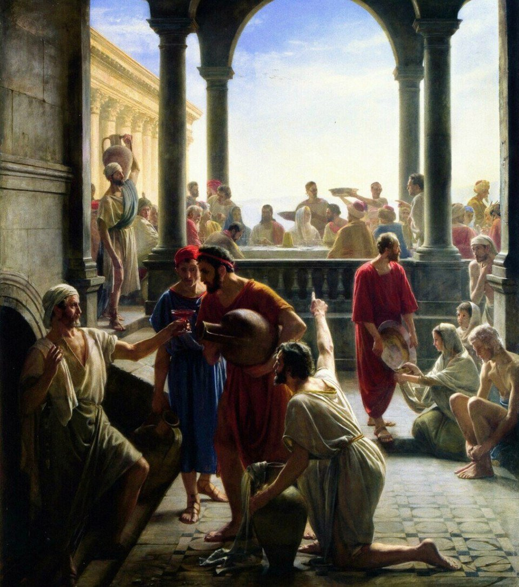

<!-- START doctoc generated TOC please keep comment here to allow auto update -->

<!-- DON'T EDIT THIS SECTION, INSTEAD RE-RUN doctoc TO UPDATE -->

**Table of Contents** _generated with [DocToc](https://github.com/ktechhub/doctoc)_

<!---toc start-->

- [November 2025](#november-2025)
  - [November 01, 2025](#november-01-2025)
    - [The Luminous Mysteries - Day 305](#the-luminous-mysteries---day-305)
    - [AI-Generated Summary: On the Five Great Luminous Mysteries Which Illuminate the World](#ai-generated-summary-on-the-five-great-luminous-mysteries-which-illuminate-the-world)
    - [In this Renaissance fresco 'The Baptism of Christ' by an unknown artist at Padua's Church of San Benedetto Vecchio, John the Baptist performs the sacred rite upon Jesus in the Jordan River The Holy Spirit descends as a dove while the act of profound humility transforms the waters of creation, revealing the divine life through this first Luminous Mystery (Stock Image) - Day 305](#in-this-renaissance-fresco-the-baptism-of-christ-by-an-unknown-artist-at-paduas-church-of-san-benedetto-vecchio-john-the-baptist-performs-the-sacred-rite-upon-jesus-in-the-jordan-river-the-holy-spirit-descends-as-a-dove-while-the-act-of-profound-humility-transforms-the-waters-of-creation-revealing-the-divine-life-through-this-first-luminous-mystery-stock-image---day-305)
    - [Carl Bloch's 19th-century oil painting 'The Wedding at Cana' depicts Jesus performing his first miracle by transforming water into wine at a wedding celebration, capturing this Luminous Mystery with Danish Golden Age artistry - Day 305](#carl-blochs-19th-century-oil-painting-the-wedding-at-cana-depicts-jesus-performing-his-first-miracle-by-transforming-water-into-wine-at-a-wedding-celebration-capturing-this-luminous-mystery-with-danish-golden-age-artistry---day-305)
    - [Lorenzo Lotto's 'Christ and the Adulteress' (c 1525-1530), an oil on canvas housed at the Louvre Museum, powerfully captures the moment Jesus protects the woman from stoning, embodying his merciful proclamation of the Kingdom of God through forgiveness and grace - Day 305](#lorenzo-lottos-christ-and-the-adulteress-c-1525-1530-an-oil-on-canvas-housed-at-the-louvre-museum-powerfully-captures-the-moment-jesus-protects-the-woman-from-stoning-embodying-his-merciful-proclamation-of-the-kingdom-of-god-through-forgiveness-and-grace---day-305)
    - ['The Transfiguration' by Theophanes the Greek, a 1403 Byzantine fresco housed at the Tretyakov Gallery in Moscow, depicts Christ radiant in divine light flanked by Moses and Elijah as apostles Peter, James, and John witness this luminous revelation - Day 305](#the-transfiguration-by-theophanes-the-greek-a-1403-byzantine-fresco-housed-at-the-tretyakov-gallery-in-moscow-depicts-christ-radiant-in-divine-light-flanked-by-moses-and-elijah-as-apostles-peter-james-and-john-witness-this-luminous-revelation---day-305)
    - [In Juan de Juanes' 1562 Spanish Renaissance masterpiece 'The Last Supper', housed at the Museo del Prado, the artist captures the profound moment of the Institution of the Eucharist where Christ offers the consecrated host to his apostles, rendered in oil on panel with sacramental solemnity - Day 305](#in-juan-de-juanes-1562-spanish-renaissance-masterpiece-the-last-supper-housed-at-the-museo-del-prado-the-artist-captures-the-profound-moment-of-the-institution-of-the-eucharist-where-christ-offers-the-consecrated-host-to-his-apostles-rendered-in-oil-on-panel-with-sacramental-solemnity---day-305)
  - [November 02, 2025](#november-02-2025)
    - [The Sorrowful Mysteries - Day 306](#the-sorrowful-mysteries---day-306)
    - [AI-Generated Summary: On the Five Profound Sorrows Which the Lord Endured for the Redemption of a Fallen World](#ai-generated-summary-on-the-five-profound-sorrows-which-the-lord-endured-for-the-redemption-of-a-fallen-world)
    - [Alessandro Maganza's 'The Prayer of Jesus in Gethsemane' (c 1590-1610), an oil on canvas in the Mannerist style located in Vicenza Cathedral, depicts Christ's profound spiritual agony as He prays while His disciples sleep, capturing the moment of divine submission before His Passion (Stock Image) - Day 306](#alessandro-maganzas-the-prayer-of-jesus-in-gethsemane-c-1590-1610-an-oil-on-canvas-in-the-mannerist-style-located-in-vicenza-cathedral-depicts-christs-profound-spiritual-agony-as-he-prays-while-his-disciples-sleep-capturing-the-moment-of-divine-submission-before-his-passion-stock-image---day-306)
    - [William-Adolphe Bouguereau's 1880 oil on canvas 'The Flagellation of Our Lord Jesus Christ,' located in the Cathedral of La Rochelle, depicts Christ's brutal scourging at the pillar with profound divine resignation and academic classicism - Day 306](#william-adolphe-bouguereaus-1880-oil-on-canvas-the-flagellation-of-our-lord-jesus-christ-located-in-the-cathedral-of-la-rochelle-depicts-christs-brutal-scourging-at-the-pillar-with-profound-divine-resignation-and-academic-classicism---day-306)
    - [In 'Ecce Homo', attributed to Caravaggio around 1605, the Baroque master depicts the suffering Christ crowned with thorns, presented to the people in a powerful oil on canvas from a private collection - Day 306](#in-ecce-homo-attributed-to-caravaggio-around-1605-the-baroque-master-depicts-the-suffering-christ-crowned-with-thorns-presented-to-the-people-in-a-powerful-oil-on-canvas-from-a-private-collection---day-306)
    - [Raphael's 1516-1517 oil painting 'Christ Falls on the Way to Calvary', housed in Madrid's Museo del Prado, powerfully depicts Christ stumbling under the cross's weight during the fourth Sorrowful Mystery of the Rosary - Day 306](#raphaels-1516-1517-oil-painting-christ-falls-on-the-way-to-calvary-housed-in-madrids-museo-del-prado-powerfully-depicts-christ-stumbling-under-the-crosss-weight-during-the-fourth-sorrowful-mystery-of-the-rosary---day-306)
    - [Pietro Gagliardi's 1847-1852 fresco 'Crucifixion' in the church of San Girolamo dei Croati, Rome, depicts Christ's ultimate sacrifice on the cross, surrounded by the grieving figures of the Virgin Mary, John the Evangelist, and Mary Magdalene at the foot of the cross, emphasizing the profound theological significance of this sorrowful mystery (Stock Image) - Day 306](#pietro-gagliardis-1847-1852-fresco-crucifixion-in-the-church-of-san-girolamo-dei-croati-rome-depicts-christs-ultimate-sacrifice-on-the-cross-surrounded-by-the-grieving-figures-of-the-virgin-mary-john-the-evangelist-and-mary-magdalene-at-the-foot-of-the-cross-emphasizing-the-profound-theological-significance-of-this-sorrowful-mystery-stock-image---day-306)
  - [November 03, 2025](#november-03-2025)
    - [The Glorious Mysteries - Day 307](#the-glorious-mysteries---day-307)
    - [AI-Generated Summary: On the Five Great Victories Which Crown the Earthly Struggle and Promise a Glory Yet to Come](#ai-generated-summary-on-the-five-great-victories-which-crown-the-earthly-struggle-and-promise-a-glory-yet-to-come)
    - [Annibale Carracci's 1600 Baroque masterpiece 'The Three Marys at the Tomb', an oil on canvas at the State Hermitage Museum, dramatically captures the holy women's astonishment as they discover Christ's empty tomb, heralding His Resurrection - Day 307](#annibale-carraccis-1600-baroque-masterpiece-the-three-marys-at-the-tomb-an-oil-on-canvas-at-the-state-hermitage-museum-dramatically-captures-the-holy-womens-astonishment-as-they-discover-christs-empty-tomb-heralding-his-resurrection---day-307)
    - [Duccio di Buoninsegna's 1308-1311 tempera on wood panel 'Christ Taking Leave of the Apostles,' housed in the Museo dell'Opera del Duomo, Siena, captures the moment of Christ's post-Resurrection appearance and final commissioning of His apostles before His glorious Ascension into heaven - Day 307](#duccio-di-buoninsegnas-1308-1311-tempera-on-wood-panel-christ-taking-leave-of-the-apostles-housed-in-the-museo-dellopera-del-duomo-siena-captures-the-moment-of-christs-post-resurrection-appearance-and-final-commissioning-of-his-apostles-before-his-glorious-ascension-into-heaven---day-307)
    - [Jean Restout II's 1732 French Baroque masterpiece 'Pentecost,' an oil on canvas housed in the Louvre Museum, dramatically captures the Descent of the Holy Spirit as tongues of fire upon the Virgin Mary and the apostles gathered in the upper room - Day 307](#jean-restout-iis-1732-french-baroque-masterpiece-pentecost-an-oil-on-canvas-housed-in-the-louvre-museum-dramatically-captures-the-descent-of-the-holy-spirit-as-tongues-of-fire-upon-the-virgin-mary-and-the-apostles-gathered-in-the-upper-room---day-307)
    - [Cesare Mariani's 1863 fresco 'Assumption of the Virgin with Vision of St Bonaventure' in the Chiesa di Santa Lucia del Gonfalone, Rome, depicts the Virgin Mary's bodily assumption into heaven as witnessed by St Bonaventure, rendered in the Neoclassical style - Day 307](#cesare-marianis-1863-fresco-assumption-of-the-virgin-with-vision-of-st-bonaventure-in-the-chiesa-di-santa-lucia-del-gonfalone-rome-depicts-the-virgin-marys-bodily-assumption-into-heaven-as-witnessed-by-st-bonaventure-rendered-in-the-neoclassical-style---day-307)
    - [Giuseppe Rollini's 19th-century fresco 'Mary, Help of Christians' in Turin, Italy, masterfully depicts the Virgin Mary's Coronation as Queen of Heaven, presenting her in a traditional Catholic iconography of maternal protection and glorious intercession for the faithful (Stock Image) - Day 307](#giuseppe-rollinis-19th-century-fresco-mary-help-of-christians-in-turin-italy-masterfully-depicts-the-virgin-marys-coronation-as-queen-of-heaven-presenting-her-in-a-traditional-catholic-iconography-of-maternal-protection-and-glorious-intercession-for-the-faithful-stock-image---day-307)

<!---toc end-->

<!-- END doctoc generated TOC please keep comment here to allow auto update -->

<!-- toc -->

<!-- tocstop -->

# November 2025

RIAY November 2025

## November 01, 2025

### The Luminous Mysteries - Day 305

### AI-Generated Summary: On the Five Great Luminous Mysteries Which Illuminate the World

My dear reader, we are invited to consider five points of light, these Luminous Mysteries, which break upon the world not as a harsh glare but as a dawn that gradually reveals the landscape of a new creation.

The first finds the Lord Himself, though without any stain of sin, standing humbly in the river Jordan to be baptized by John. In this act of profound humility, the waters of all creation are made new, and the voice of the Father is heard from heaven while the Spirit descends as a dove, revealing for a moment the very heart of the Divine life.

The second mystery takes us to a wedding feast in Cana, where the wine of mere merriment fails. It is His mother who, with a quiet word, brings the poverty of the world to her Son. And He, in response, performs the first of His signs, turning water into wine, as if to say that the old order of mere law is to be transfigured into the new wine of grace.

Then comes the Proclamation of the Kingdom, a clarion call to a fundamental change of heart. He announces this Kingdom from the mount, teaching in parables and sermons, unveiling the Father’s love and charting the narrow path that leads away from the shadowlands and into life eternal.

On the high mountain of the fourth mystery, the Lord is transfigured before His chosen three. His face shines like the sun and His clothes become whiter than any earthly fuller could make them, while Moses and Elijah, the great pillars of Law and Prophecy, speak with Him of the departure He was to accomplish. It was a glimpse of the glory that clothes all reality, seen only when one looks beyond the immediate.

Finally, in the upper room, He takes the common stuff of bread and wine. But here He performs the greatest miracle, offering His own Body and Blood as the true sustenance for our pilgrimage, and commanding His apostles to do this in memory of Him. In this single, loving act, He established both the perpetual memorial of His sacrifice and the sacred priesthood to steward it, binding heaven and earth together at a table.

### In this Renaissance fresco 'The Baptism of Christ' by an unknown artist at Padua's Church of San Benedetto Vecchio, John the Baptist performs the sacred rite upon Jesus in the Jordan River The Holy Spirit descends as a dove while the act of profound humility transforms the waters of creation, revealing the divine life through this first Luminous Mystery (Stock Image) - Day 305

### Carl Bloch's 19th-century oil painting 'The Wedding at Cana' depicts Jesus performing his first miracle by transforming water into wine at a wedding celebration, capturing this Luminous Mystery with Danish Golden Age artistry - Day 305

### Lorenzo Lotto's 'Christ and the Adulteress' (c 1525-1530), an oil on canvas housed at the Louvre Museum, powerfully captures the moment Jesus protects the woman from stoning, embodying his merciful proclamation of the Kingdom of God through forgiveness and grace - Day 305

, an oil on canvas housed at the Louvre Museum, powerfully captures the moment Jesus protects the woman from stoning, embodying his merciful proclamation of the Kingdom of God through forgiveness and grace")

### 'The Transfiguration' by Theophanes the Greek, a 1403 Byzantine fresco housed at the Tretyakov Gallery in Moscow, depicts Christ radiant in divine light flanked by Moses and Elijah as apostles Peter, James, and John witness this luminous revelation - Day 305

### In Juan de Juanes' 1562 Spanish Renaissance masterpiece 'The Last Supper', housed at the Museo del Prado, the artist captures the profound moment of the Institution of the Eucharist where Christ offers the consecrated host to his apostles, rendered in oil on panel with sacramental solemnity - Day 305

## November 02, 2025

### The Sorrowful Mysteries - Day 306

### AI-Generated Summary: On the Five Profound Sorrows Which the Lord Endured for the Redemption of a Fallen World

My dear reader, let us consider the five great Sorrows, not as a mere recitation of ancient woes, but as a map of that terrible and loving descent whereby the King entered the deepest vaults of His own creation to win it back.

The first mystery finds Him in a garden, a place where the first rebellion was sown, now made the scene of a perfect submission. Here, the weight of the world’s sin presses upon His soul with such force that His sweat becomes as drops of blood, and He asks that this cup might pass—yet, not His will, but the Father’s, be done. All the while, His friends slumber, and a solitary angel ministers to Him in His agony.

The second mystery presents Him bound to a pillar, the Just for the unjust. Having been declared innocent by the governor’s own mouth, He submits His back to the scourges of the soldiers, taking upon His own flesh the stripes that our own waywardness has merited.

Then comes the third, a dreadful parody of kingship. They press a crown of thorns upon His brow, clothe Him in purple mockery, and offer a reed for a sceptre. “Hail, King of the Jews!” they cry, spitting upon and striking the very face that shaped the sun and stars. Thus, the true royalty of Heaven is revealed in the patience with which He bears this blasphemous scorn.

The fourth mystery shows Him carrying the instrument of His own execution. Weakened by loss of blood, He falls beneath the weight of the Cross, yet rises again and again to continue the journey. On that sorrowful road, He meets His mother, whose soul is pierced by a sword as was foretold, and accepts the aid of a stranger, Simon, who is compelled to share the burden.

Finally, upon the hill of Golgotha, the fifth mystery is consummated. He is nailed to the wood and lifted up between two thieves. From that throne of suffering, He speaks words of forgiveness, bestows His mother upon the beloved disciple, and endures the ultimate loneliness of dereliction. Then, with a final cry of “It is finished,” He surrenders His spirit, and the great veil of the Temple is torn from top to bottom, for the way is now open.

### Alessandro Maganza's 'The Prayer of Jesus in Gethsemane' (c 1590-1610), an oil on canvas in the Mannerist style located in Vicenza Cathedral, depicts Christ's profound spiritual agony as He prays while His disciples sleep, capturing the moment of divine submission before His Passion (Stock Image) - Day 306

, an oil on canvas in the Mannerist style located in Vicenza Cathedral, depicts Christ's profound spiritual agony as He prays while His disciples sleep, capturing the moment of divine submission before His Passion")

### William-Adolphe Bouguereau's 1880 oil on canvas 'The Flagellation of Our Lord Jesus Christ,' located in the Cathedral of La Rochelle, depicts Christ's brutal scourging at the pillar with profound divine resignation and academic classicism - Day 306

### In 'Ecce Homo', attributed to Caravaggio around 1605, the Baroque master depicts the suffering Christ crowned with thorns, presented to the people in a powerful oil on canvas from a private collection - Day 306

### Raphael's 1516-1517 oil painting 'Christ Falls on the Way to Calvary', housed in Madrid's Museo del Prado, powerfully depicts Christ stumbling under the cross's weight during the fourth Sorrowful Mystery of the Rosary - Day 306

### Pietro Gagliardi's 1847-1852 fresco 'Crucifixion' in the church of San Girolamo dei Croati, Rome, depicts Christ's ultimate sacrifice on the cross, surrounded by the grieving figures of the Virgin Mary, John the Evangelist, and Mary Magdalene at the foot of the cross, emphasizing the profound theological significance of this sorrowful mystery (Stock Image) - Day 306

## November 03, 2025

### The Glorious Mysteries - Day 307

### AI-Generated Summary: On the Five Great Victories Which Crown the Earthly Struggle and Promise a Glory Yet to Come

My dear reader, consider the five points of light which guide the soul from a sealed tomb to an unending crown. The first is the Resurrection, that great rupture in the natural order where Death itself began to work backwards. Forty days later came the second, the Ascension, where the Lord, in His very body, withdrew from their sight into heaven, a most fitting end to His labour and a pledge that the stuff of which we are made is not condemned, but destined for redemption. Then followed the third, the descent of the Holy Spirit at Pentecost, clothing those first fearful friends with a tongue of fire and a courage not their own.

The fourth mystery turns our gaze to His mother, who at the end of her days was assumed, body and soul, into glory. This is no mere spiritual fancy, but the Church’s sure declaration that the destiny promised to all the faithful was in her, by a unique grace, already fulfilled. And so we arrive at the fifth and final splendour: her Coronation as Queen of Heaven and Earth. For if He who is the King of Kings took His humanity from her, it is a right and joyful thing that she, through whom salvation entered the world, should be crowned with a queenly dignity over all creation.

### Annibale Carracci's 1600 Baroque masterpiece 'The Three Marys at the Tomb', an oil on canvas at the State Hermitage Museum, dramatically captures the holy women's astonishment as they discover Christ's empty tomb, heralding His Resurrection - Day 307

### Duccio di Buoninsegna's 1308-1311 tempera on wood panel 'Christ Taking Leave of the Apostles,' housed in the Museo dell'Opera del Duomo, Siena, captures the moment of Christ's post-Resurrection appearance and final commissioning of His apostles before His glorious Ascension into heaven - Day 307

### Jean Restout II's 1732 French Baroque masterpiece 'Pentecost,' an oil on canvas housed in the Louvre Museum, dramatically captures the Descent of the Holy Spirit as tongues of fire upon the Virgin Mary and the apostles gathered in the upper room - Day 307

### Cesare Mariani's 1863 fresco 'Assumption of the Virgin with Vision of St Bonaventure' in the Chiesa di Santa Lucia del Gonfalone, Rome, depicts the Virgin Mary's bodily assumption into heaven as witnessed by St Bonaventure, rendered in the Neoclassical style - Day 307

### Giuseppe Rollini's 19th-century fresco 'Mary, Help of Christians' in Turin, Italy, masterfully depicts the Virgin Mary's Coronation as Queen of Heaven, presenting her in a traditional Catholic iconography of maternal protection and glorious intercession for the faithful (Stock Image) - Day 307

