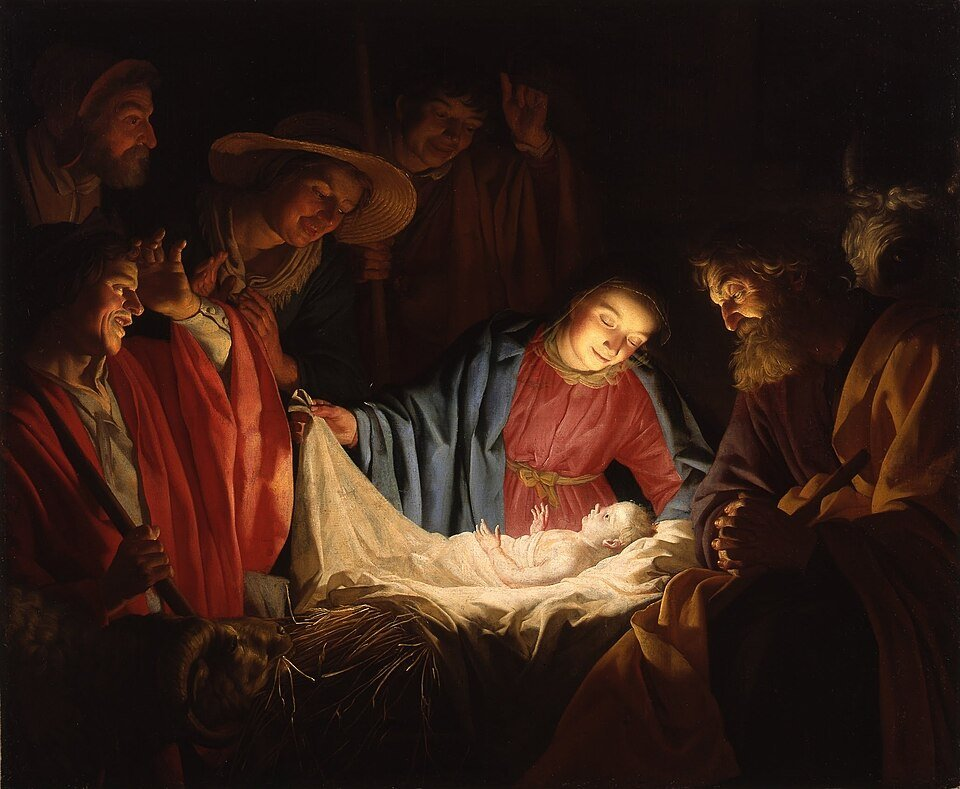
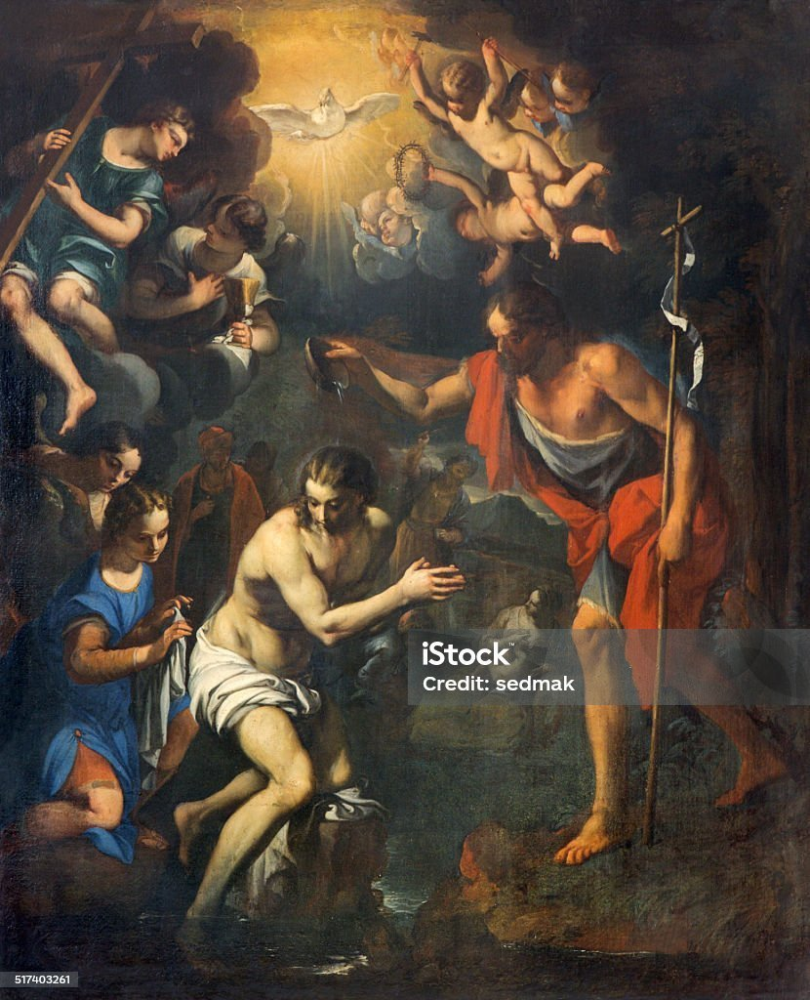
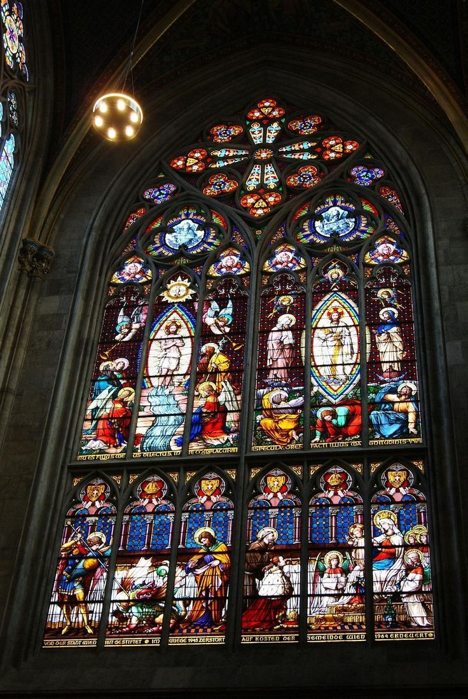
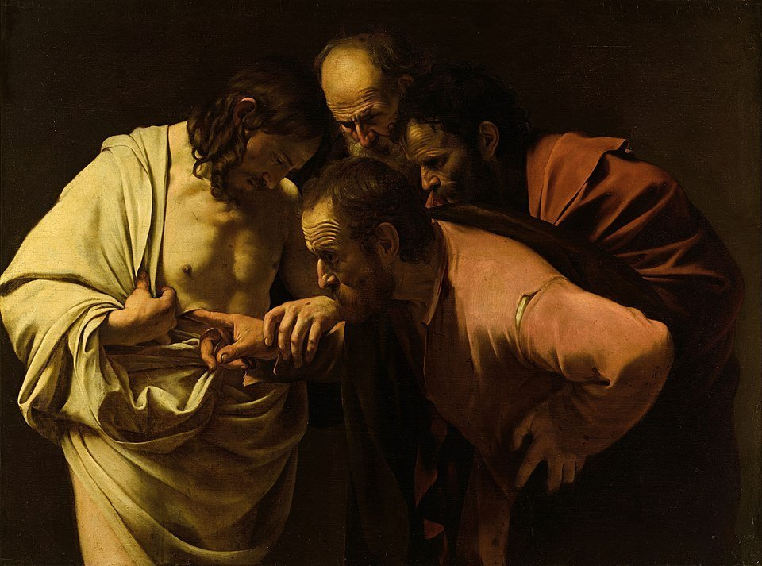
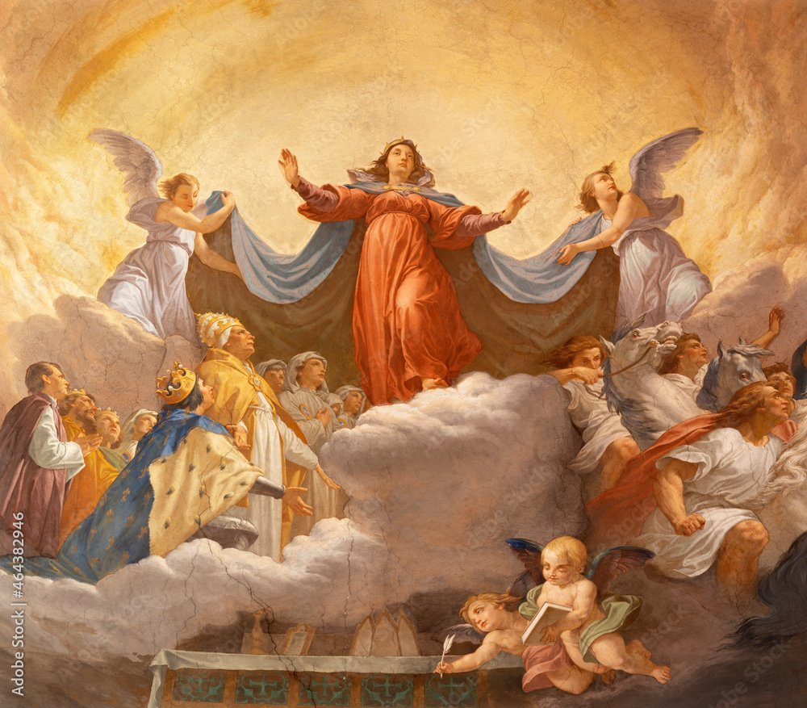
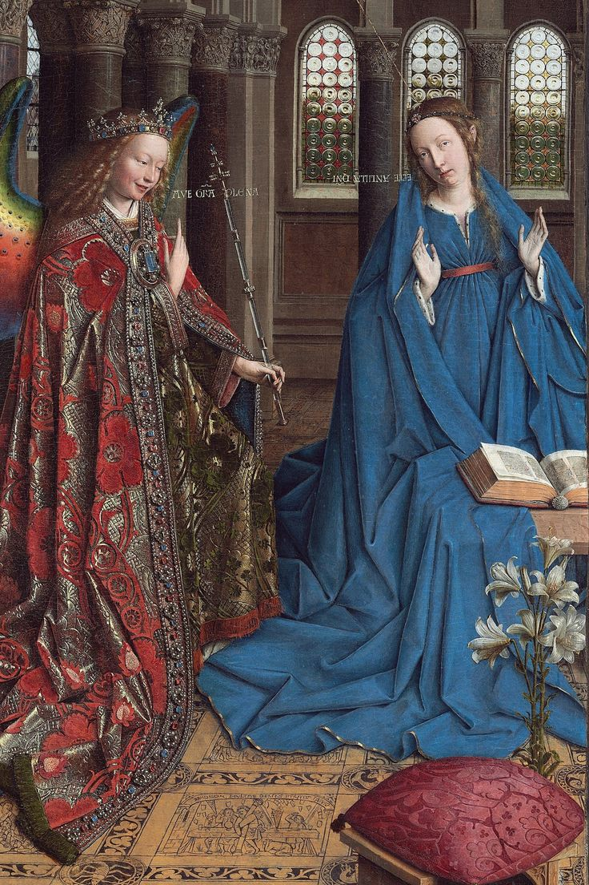
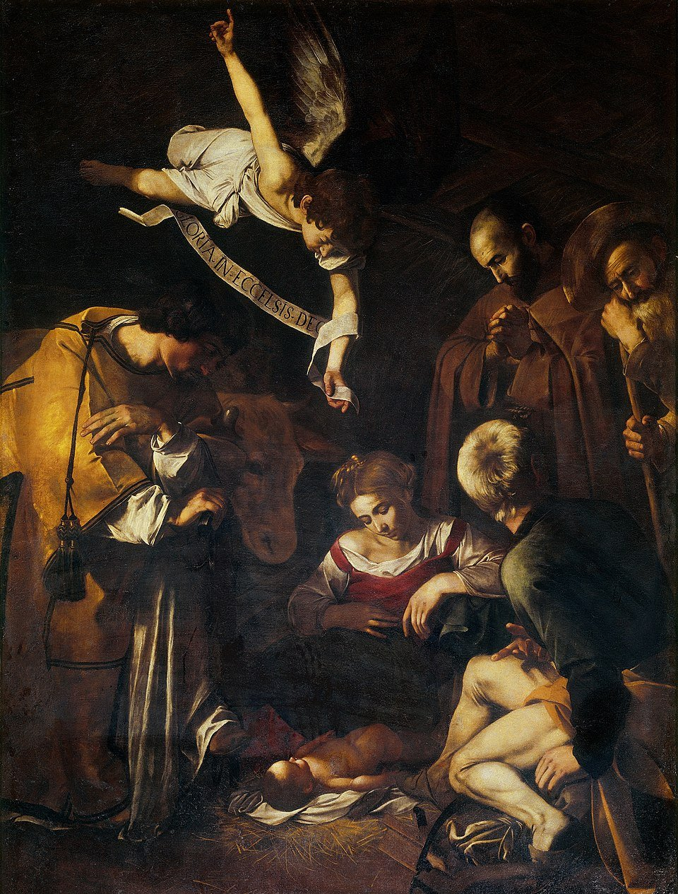
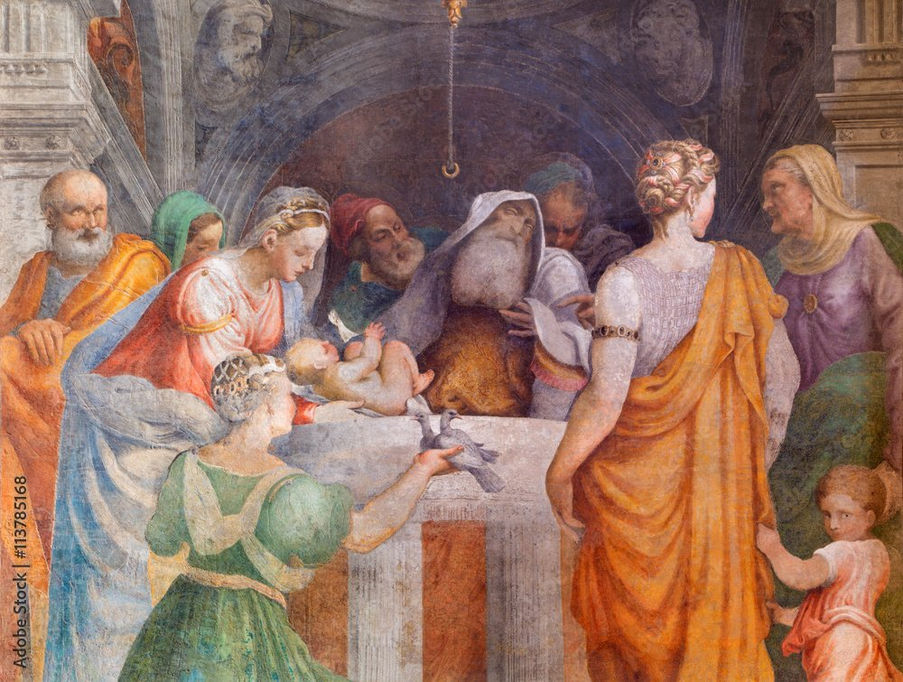
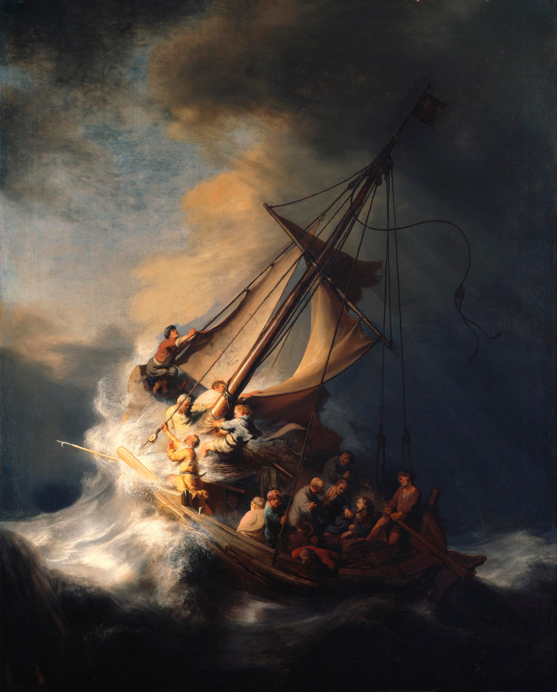

<!-- START doctoc generated TOC please keep comment here to allow auto update -->

<!-- DON'T EDIT THIS SECTION, INSTEAD RE-RUN doctoc TO UPDATE -->

**Table of Contents** _generated with [DocToc](https://github.com/ktechhub/doctoc)_

<!---toc start-->

- [October 2025](#october-2025)
  - [October 01, 2025](#october-01-2025)
    - [The Joyful Mysteries - Day 274](#the-joyful-mysteries---day-274)
    - [AI-Generated Summary: On the Recitation of Mysteries](#ai-generated-summary-on-the-recitation-of-mysteries)
    - [Jan van Eyck's 1434-1436 oil panel 'The Annunciation' at the National Gallery of Art depicts Gabriel announcing to Mary she will bear God's Son](#jan-van-eycks-1434-1436-oil-panel-the-annunciation-at-the-national-gallery-of-art-depicts-gabriel-announcing-to-mary-she-will-bear-gods-son)
    - [Federico Maldarelli's 1889 oil painting 'The Visitation' in Naples depicts Mary and Elizabeth's sacred meeting, both pregnant with Jesus and John the Baptist (Stock Image)](#federico-maldarellis-1889-oil-painting-the-visitation-in-naples-depicts-mary-and-elizabeths-sacred-meeting-both-pregnant-with-jesus-and-john-the-baptist-stock-image)
    - [Gerard van Honthorst's 1622 Baroque masterpiece 'Adoration of the Shepherds' depicts the Nativity, with humble shepherds illuminated by divine light as they worship the newborn Christ](#gerard-van-honthorsts-1622-baroque-masterpiece-adoration-of-the-shepherds-depicts-the-nativity-with-humble-shepherds-illuminated-by-divine-light-as-they-worship-the-newborn-christ)
    - [Aert de Gelder's 1700-1710 oil painting 'Simeon's Song of Praise' depicts the Presentation of Jesus in the Temple at the Mauritshuis](#aert-de-gelders-1700-1710-oil-painting-simeons-song-of-praise-depicts-the-presentation-of-jesus-in-the-temple-at-the-mauritshuis)
  - [October 02, 2025](#october-02-2025)
    - [The Joyful and Luminous Mysteries - Day 275](#the-joyful-and-luminous-mysteries---day-275)
    - [AI-Generated Summary: On the Finding in the Temple](#ai-generated-summary-on-the-finding-in-the-temple)
    - [A young Jesus astonishes Temple scholars with divine wisdom in this depiction of the Finding in the Temple (Stock Image)](#a-young-jesus-astonishes-temple-scholars-with-divine-wisdom-in-this-depiction-of-the-finding-in-the-temple-stock-image)
    - [An unknown artist's Renaissance fresco 'The Baptism of Christ' in Padua's Church of San Benedetto depicts John baptizing Jesus as the Holy Spirit descends (Stock Image)](#an-unknown-artists-renaissance-fresco-the-baptism-of-christ-in-paduas-church-of-san-benedetto-depicts-john-baptizing-jesus-as-the-holy-spirit-descends-stock-image)
    - [Gerard David's c 1500 oil painting 'The Marriage at Cana' in the Louvre depicts Jesus performing his first miracle of turning water into wine](#gerard-davids-c-1500-oil-painting-the-marriage-at-cana-in-the-louvre-depicts-jesus-performing-his-first-miracle-of-turning-water-into-wine)
    - [Rembrandt's 1633 oil painting 'Christ in the Storm on the Sea of Galilee' dramatically captures Jesus calming the tempest](#rembrandts-1633-oil-painting-christ-in-the-storm-on-the-sea-of-galilee-dramatically-captures-jesus-calming-the-tempest)
  - [October 03, 2025](#october-03-2025)
    - [The Luminous and Sorrowful Mysteries - Day 276](#the-luminous-and-sorrowful-mysteries---day-276)
    - [AI-Generated Summary: On Certain Mysteries, Luminous and Sorrowful](#ai-generated-summary-on-certain-mysteries-luminous-and-sorrowful)
    - ['The Transfiguration' depicts Jesus radiant in divine light before His disciples, with Moses and Elijah appearing, located in Vienna's Votive Church](#the-transfiguration-depicts-jesus-radiant-in-divine-light-before-his-disciples-with-moses-and-elijah-appearing-located-in-viennas-votive-church)
    - [Juan de Juanes' 1562 Spanish Renaissance painting 'The Last Supper' in the Prado depicts Christ instituting the Eucharist](#juan-de-juanes-1562-spanish-renaissance-painting-the-last-supper-in-the-prado-depicts-christ-instituting-the-eucharist)
    - [Alessandro Maganza's c 1590-1610 oil painting 'The Prayer of Jesus in Gethsemane' in Vicenza Cathedral depicts Christ's spiritual agony while His disciples sleep (Stock Image)](#alessandro-maganzas-c-1590-1610-oil-painting-the-prayer-of-jesus-in-gethsemane-in-vicenza-cathedral-depicts-christs-spiritual-agony-while-his-disciples-sleep-stock-image)
    - [Caravaggio's 1607 Baroque masterpiece 'The Flagellation of Christ' in Naples depicts Christ's brutal scourging by Roman soldiers](#caravaggios-1607-baroque-masterpiece-the-flagellation-of-christ-in-naples-depicts-christs-brutal-scourging-by-roman-soldiers)
  - [October 04, 2025](#october-04-2025)
    - [The Sorrowful and Glorious Mysteries - Day 277](#the-sorrowful-and-glorious-mysteries---day-277)
    - [AI-Generated Summary: On the Unspoken Movement From Sorrow to Glory in the Recitation of Prayers](#ai-generated-summary-on-the-unspoken-movement-from-sorrow-to-glory-in-the-recitation-of-prayers)
    - [Attributed to Caravaggio's 'Ecce Homo' (c 1605), an oil painting of Christ crowned with thorns presented to the people](#attributed-to-caravaggios-ecce-homo-c-1605-an-oil-painting-of-christ-crowned-with-thorns-presented-to-the-people)
    - [Pieter Bruegel the Elder's 1564 oil painting 'The Procession to Calvary' depicts Christ carrying the cross through an indifferent crowd](#pieter-bruegel-the-elders-1564-oil-painting-the-procession-to-calvary-depicts-christ-carrying-the-cross-through-an-indifferent-crowd)
    - [James Tissot's 1886-1894 gouache 'What Our Lord Saw from the Cross' depicts the Crucifixion from Christ's unique perspective, held at the Brooklyn Museum](#james-tissots-1886-1894-gouache-what-our-lord-saw-from-the-cross-depicts-the-crucifixion-from-christs-unique-perspective-held-at-the-brooklyn-museum)
    - [Caravaggio's 1601-1602 'The Incredulity of Saint Thomas' depicts the apostle verifying Christ's resurrection by touching His wounds, housed at Sanssouci Palace](#caravaggios-1601-1602-the-incredulity-of-saint-thomas-depicts-the-apostle-verifying-christs-resurrection-by-touching-his-wounds-housed-at-sanssouci-palace)
  - [October 05, 2025](#october-05-2025)
    - [The Glorious Mysteries - Day 278](#the-glorious-mysteries---day-278)
    - [AI-Generated Summary: On the Recurring Invocation That Forms the Heart of Common Prayer](#ai-generated-summary-on-the-recurring-invocation-that-forms-the-heart-of-common-prayer)
    - [Byzantine mosaicists' 12th-century mosaic 'The Ascension' in St Mark's Basilica depicts Christ rising to heaven amid angels, with the Virgin Mary and astonished apostles below](#byzantine-mosaicists-12th-century-mosaic-the-ascension-in-st-marks-basilica-depicts-christ-rising-to-heaven-amid-angels-with-the-virgin-mary-and-astonished-apostles-below)
    - [Simone Peterzano's 1580 Mannerist 'Pentecost' in Milan depicts the Holy Spirit descending upon Mary and the apostles (Stock Image)](#simone-peterzanos-1580-mannerist-pentecost-in-milan-depicts-the-holy-spirit-descending-upon-mary-and-the-apostles-stock-image)
    - [Cesare Mariani's 1863 fresco 'Assumption of the Virgin with Vision of St Bonaventure' in Rome depicts the Virgin Mary's bodily ascent into heaven](#cesare-marianis-1863-fresco-assumption-of-the-virgin-with-vision-of-st-bonaventure-in-rome-depicts-the-virgin-marys-bodily-ascent-into-heaven)
    - [Giuseppe Mattia Borgnis's 18th-century Baroque fresco 'Coronation of the Virgin' depicts Mary being crowned Queen of Heaven (Stock Image)](#giuseppe-mattia-borgniss-18th-century-baroque-fresco-coronation-of-the-virgin-depicts-mary-being-crowned-queen-of-heaven-stock-image)
  - [October 06, 2025](#october-06-2025)
    - [The Joyful Mysteries - Day 279](#the-joyful-mysteries---day-279)
    - [AI-Generated Summary: On the First Four Joyful Mysteries and the Curious Absence of Substantive Matter](#ai-generated-summary-on-the-first-four-joyful-mysteries-and-the-curious-absence-of-substantive-matter)
    - [Jan van Eyck's 1434-1436 oil panel 'The Annunciation' at the National Gallery of Art depicts Gabriel announcing to Mary that she will bear God's Son](#jan-van-eycks-1434-1436-oil-panel-the-annunciation-at-the-national-gallery-of-art-depicts-gabriel-announcing-to-mary-that-she-will-bear-gods-son)
    - ['The Visitation' depicts Mary and Elizabeth's sacred encounter in Ein Karem, where both women recognize God's miraculous work through their unborn children](#the-visitation-depicts-mary-and-elizabeths-sacred-encounter-in-ein-karem-where-both-women-recognize-gods-miraculous-work-through-their-unborn-children)
    - [Caravaggio's 1600 Baroque masterpiece 'Nativity with St Francis and St Lawrence' depicts Christ's birth with dramatic chiaroscuro, though the original oil painting was stolen in 1969](#caravaggios-1600-baroque-masterpiece-nativity-with-st-francis-and-st-lawrence-depicts-christs-birth-with-dramatic-chiaroscuro-though-the-original-oil-painting-was-stolen-in-1969)
    - [Giulio Campi's fresco 'The Presentation of Jesus in the Temple' in Cremona depicts Mary and Joseph presenting the infant Christ to Simeon (Stock Image)](#giulio-campis-fresco-the-presentation-of-jesus-in-the-temple-in-cremona-depicts-mary-and-joseph-presenting-the-infant-christ-to-simeon-stock-image)
  - [October 07, 2025](#october-07-2025)
    - [The Joyful and Luminous Mysteries - Day 280](#the-joyful-and-luminous-mysteries---day-280)
    - [AI-Generated Summary: On the Finding in the Temple and Those First Great Shining Mysteries Wherein the Divine Light Broke Upon the World](#ai-generated-summary-on-the-finding-in-the-temple-and-those-first-great-shining-mysteries-wherein-the-divine-light-broke-upon-the-world)
    - [A 20th-century Byzantine Revival mosaic in Lourdes' Rosary Basilica depicting Mary and Joseph finding the young Jesus teaching in the Temple (Stock Image)](#a-20th-century-byzantine-revival-mosaic-in-lourdes-rosary-basilica-depicting-mary-and-joseph-finding-the-young-jesus-teaching-in-the-temple-stock-image)
    - [An unknown Renaissance fresco, 'The Baptism of Christ', depicting Jesus baptized by John the Baptist in the Jordan River with the Holy Spirit descending as a dove, located in Padua's Church of San Benedetto (Stock Image)](#an-unknown-renaissance-fresco-the-baptism-of-christ-depicting-jesus-baptized-by-john-the-baptist-in-the-jordan-river-with-the-holy-spirit-descending-as-a-dove-located-in-paduas-church-of-san-benedetto-stock-image)
    - [Gerard David's 'The Marriage at Cana' (c 1500), an Early Netherlandish oil painting in the Louvre, depicts Jesus performing his first miracle of turning water into wine](#gerard-davids-the-marriage-at-cana-c-1500-an-early-netherlandish-oil-painting-in-the-louvre-depicts-jesus-performing-his-first-miracle-of-turning-water-into-wine)
    - [Rembrandt's 1633 oil painting 'Christ in the Storm on the Sea of Galilee' dramatically captures Jesus calming the tempest, demonstrating divine authority over nature](#rembrandts-1633-oil-painting-christ-in-the-storm-on-the-sea-of-galilee-dramatically-captures-jesus-calming-the-tempest-demonstrating-divine-authority-over-nature)
  - [October 08, 2025](#october-08-2025)
    - [The Luminous and Sorrowful Mysteries - Day 281](#the-luminous-and-sorrowful-mysteries---day-281)
    - [AI-Generated Summary: On the Unfolding of Divine Mysteries Through Light and Sorrow in the Rosary](#ai-generated-summary-on-the-unfolding-of-divine-mysteries-through-light-and-sorrow-in-the-rosary)
    - [Theophanes the Greek's 1403 fresco 'The Transfiguration' at the Tretyakov Gallery depicts Christ in divine light with Moses and Elijah](#theophanes-the-greeks-1403-fresco-the-transfiguration-at-the-tretyakov-gallery-depicts-christ-in-divine-light-with-moses-and-elijah)
    - [Juan de Juanes' 1562 Spanish Renaissance masterpiece 'The Last Supper' depicts Christ instituting the Eucharist at the final meal](#juan-de-juanes-1562-spanish-renaissance-masterpiece-the-last-supper-depicts-christ-instituting-the-eucharist-at-the-final-meal)
    - [Giotto's 1304-1306 fresco in Padua's Scrovegni Chapel captures Judas's treacherous kiss during Christ's arrest in Gethsemane](#giottos-1304-1306-fresco-in-paduas-scrovegni-chapel-captures-judass-treacherous-kiss-during-christs-arrest-in-gethsemane)
    - [Giovanni Antonio Bazzi's 'Christ at the Column' (c 1510-1515), a fresco in Siena's Pinacoteca Nazionale, depicts the bound and wounded Christ during his flagellation](#giovanni-antonio-bazzis-christ-at-the-column-c-1510-1515-a-fresco-in-sienas-pinacoteca-nazionale-depicts-the-bound-and-wounded-christ-during-his-flagellation)
  - [October 09, 2025](#october-09-2025)
    - [The Sorrowful and Glorious Mysteries - Day 282](#the-sorrowful-and-glorious-mysteries---day-282)
    - [AI-Generated Summary: On the Sorrowful Weight of Thorns and Wood and the Glorious Dawn That Follows](#ai-generated-summary-on-the-sorrowful-weight-of-thorns-and-wood-and-the-glorious-dawn-that-follows)
    - [Caravaggio's 1605 'Ecce Homo' in Genoa depicts Christ crowned with thorns as Pilate presents him to the mocking crowd](#caravaggios-1605-ecce-homo-in-genoa-depicts-christ-crowned-with-thorns-as-pilate-presents-him-to-the-mocking-crowd)
    - [Pieter Bruegel the Elder's 1564 oil painting 'The Procession to Calvary' depicts Christ falling under the cross's weight amidst an indifferent crowd, housed in Vienna's Kunsthistorisches Museum](#pieter-bruegel-the-elders-1564-oil-painting-the-procession-to-calvary-depicts-christ-falling-under-the-crosss-weight-amidst-an-indifferent-crowd-housed-in-viennas-kunsthistorisches-museum)
    - [James Tissot's 1886-1894 gouache 'What Our Lord Saw from the Cross' depicts the Crucifixion from Christ's unique perspective, housed at the Brooklyn Museum](#james-tissots-1886-1894-gouache-what-our-lord-saw-from-the-cross-depicts-the-crucifixion-from-christs-unique-perspective-housed-at-the-brooklyn-museum)
    - [Annibale Carracci's 1593 oil painting 'Resurrection' at the Louvre depicts Christ gloriously emerging from the tomb as Roman soldiers recoil in awe](#annibale-carraccis-1593-oil-painting-resurrection-at-the-louvre-depicts-christ-gloriously-emerging-from-the-tomb-as-roman-soldiers-recoil-in-awe)

<!---toc end-->

<!-- END doctoc generated TOC please keep comment here to allow auto update -->

<!-- toc -->

<!-- tocstop -->

# October 2025

RIAY October 2025

## October 01, 2025

### The Joyful Mysteries - Day 274

### AI-Generated Summary: On the Recitation of Mysteries

It may be observed by anyone who sets himself to this devotion that the rhythm of the prayer, which began at a pace suited to private contemplation, has now found a steadier and more corporate beat—the very cadence one might adopt when praying in common with the friars. It is a movement from the tentative steps of a novice toward the firm, measured tread of a pilgrim on a well-worn path.

The mysteries themselves, those windows into divine humility, were the first four Joyful ones. The Annunciation, where eternity broke into time and a young woman’s _fiat_ changed the course of all things. The Visitation, where grace overflowed from one expectant mother to another, and sanctity leapt in the womb. The Nativity, where the Word became a crying infant laid in straw, the ultimate descent of Love into poverty. And finally, the Presentation, where the Child was brought to the Temple, and aged Simeon saw in that small bundle both the consolation of a people and the sword that would pierce a soul.

No images or carvings were described to fix these scenes before the inward eye; only the bare, glorious facts remain—which are, as we know, always enough.

### Jan van Eyck's 1434-1436 oil panel 'The Annunciation' at the National Gallery of Art depicts Gabriel announcing to Mary she will bear God's Son

### Federico Maldarelli's 1889 oil painting 'The Visitation' in Naples depicts Mary and Elizabeth's sacred meeting, both pregnant with Jesus and John the Baptist (Stock Image)

### Gerard van Honthorst's 1622 Baroque masterpiece 'Adoration of the Shepherds' depicts the Nativity, with humble shepherds illuminated by divine light as they worship the newborn Christ

### Aert de Gelder's 1700-1710 oil painting 'Simeon's Song of Praise' depicts the Presentation of Jesus in the Temple at the Mauritshuis

## October 02, 2025

### The Joyful and Luminous Mysteries - Day 275

### AI-Generated Summary: On the Finding in the Temple

My dear reader, you must picture a scene, not of loss, but of a quiet and startling discovery. It is the finding of the Child in the temple, where He was not misplaced but purposefully at home, sitting among the teachers. His mother’s question, which any earthly parent would ask, meets with a reply that hints at a deeper, more eternal obedience. The Boy was about His Father’s business, a first faint signal of the great schism between the natural affections of a family and the overwhelming claims of Heaven.

Then comes the Baptism in the Jordan, where the heavens themselves were torn open. The voice of the Father declares His pleasure, and the Spirit descends like a dove. Here, in the river’s common water, is the sacred pattern set forth: the Son submits, the Father blesses, the Spirit empowers. It is the public and solemn beginning of the great work of redemption.

And at the wedding in Cana, we see a thing both homely and divine. The wine fails, and the need is simple, human. His mother, with a quiet faith, instructs the servants to do whatever He says. From mere water, drawn for cleansing, comes the best wine, a sign of how the Law is to be fulfilled by Grace. It was the first of His signs, not a public spectacle, but a generous gift to save a humble feast from shame, showing that His kingdom begins in the transformation of the ordinary.

The final mystery considered is the Proclamation of the Kingdom. Here, the call goes out, clear and urgent: the time is fulfilled, the kingdom of God is at hand. It is a summons to turn away from the old paths, to repent, and to believe in this good news. This is the great declaration for which all that came before was but a preparation.

### A young Jesus astonishes Temple scholars with divine wisdom in this depiction of the Finding in the Temple (Stock Image)

### An unknown artist's Renaissance fresco 'The Baptism of Christ' in Padua's Church of San Benedetto depicts John baptizing Jesus as the Holy Spirit descends (Stock Image)

### Gerard David's c 1500 oil painting 'The Marriage at Cana' in the Louvre depicts Jesus performing his first miracle of turning water into wine

### Rembrandt's 1633 oil painting 'Christ in the Storm on the Sea of Galilee' dramatically captures Jesus calming the tempest

## October 03, 2025

### The Luminous and Sorrowful Mysteries - Day 276

### AI-Generated Summary: On Certain Mysteries, Luminous and Sorrowful

My dear reader, you have before you a glimpse into that great drama which lies at the heart of things, where the eternal breaks into the temporal. We are shown first a mountain-top, a place set apart, where for a brief and blinding moment the veil is lifted. The Master’s very countenance shines like the sun, and His raiment becomes light itself, while the Law and the Prophets—Moses and Elijah—stand beside Him in witness. This is the Transfiguration, the fourth Luminous Mystery, a promise of the glory that is to come.

Then we are brought to an upper room, to the deep magic of the fifth Luminous Mystery. There, at the final meal, He takes the common stuff of earth, bread and wine, and makes them the vehicle of His very life. He gives His own self, His Body and His Blood, and commands His friends to do this always in remembrance of Him. This is the Institution of the Eucharist, the gift that bridges heaven and earth.

But the path then turns, as it must in any true story, toward a darker wood. We follow Him into a garden, where the weight of all the world’s sorrow seems to press upon a single human soul. In the first Sorrowful Mystery, the Agony in the Garden, He accepts the bitter cup, conforming His will entirely to the Father’s, while those He asked to watch with Him slumber in their humanity.

From that quiet anguish, we are taken to a place of public violence: the second Sorrowful Mystery, the Scourging at the Pillar. Here, the Creator of the stars is bound and stripped, His back offered to the lash of His creatures—a brutal, bloody prelude to the greater sacrifice that was to complete the whole symphony.

### 'The Transfiguration' depicts Jesus radiant in divine light before His disciples, with Moses and Elijah appearing, located in Vienna's Votive Church

### Juan de Juanes' 1562 Spanish Renaissance painting 'The Last Supper' in the Prado depicts Christ instituting the Eucharist

### Alessandro Maganza's c 1590-1610 oil painting 'The Prayer of Jesus in Gethsemane' in Vicenza Cathedral depicts Christ's spiritual agony while His disciples sleep (Stock Image)

### Caravaggio's 1607 Baroque masterpiece 'The Flagellation of Christ' in Naples depicts Christ's brutal scourging by Roman soldiers

## October 04, 2025

### The Sorrowful and Glorious Mysteries - Day 277

### AI-Generated Summary: On the Unspoken Movement From Sorrow to Glory in the Recitation of Prayers

My dear reader, one observes in this progression a most profound truth, that the soul moves through the Sorrowful Mysteries—the Crowning with Thorns, the Carrying of the Cross, and the final agony of the Crucifixion—as through a dark valley. Yet it does not remain there, for the path leads directly and without pause to the first Glorious Mystery, the Resurrection. This is no mere sequence of events, but a divine logic; it is the necessary passage from the weight of the world's suffering to the unassailable joy that follows, a single, great story of descent and glorious ascent written into the very bones of our devotions. The rest, the multitude of repeated prayers, are but the footsteps along that road, the quiet, persistent rhythm of a heart travelling from death into life.

### Attributed to Caravaggio's 'Ecce Homo' (c 1605), an oil painting of Christ crowned with thorns presented to the people

, an oil painting of Christ crowned with thorns presented to the people")

### Pieter Bruegel the Elder's 1564 oil painting 'The Procession to Calvary' depicts Christ carrying the cross through an indifferent crowd

### James Tissot's 1886-1894 gouache 'What Our Lord Saw from the Cross' depicts the Crucifixion from Christ's unique perspective, held at the Brooklyn Museum

### Caravaggio's 1601-1602 'The Incredulity of Saint Thomas' depicts the apostle verifying Christ's resurrection by touching His wounds, housed at Sanssouci Palace

## October 05, 2025

### The Glorious Mysteries - Day 278

### AI-Generated Summary: On the Recurring Invocation That Forms the Heart of Common Prayer

My dear reader, you have stumbled upon what might appear to the modern mind as a barren field—a landscape of repetition, where the same words are turned over and over like smooth stones in the hand. There is no grand narrative here, no detailed iconography of saints or mysteries, only the simple, sturdy framework of prayer itself. It is the Hail Mary, the Our Father, the Glory Be, repeated not as empty incantations but as the very steps of a well-trodden path, a ladder of petition and praise. One finds mention of the Glorious Mysteries—the Ascension, the Descent of the Spirit, the Assumption and Coronation of Our Lady—but they are named only as signposts along the way, their profound depths left for the pray-er to contemplate in silence. The whole concludes not with a theological treatise, but with a common, human gratitude for fellowship in the act, and a hope to continue the journey on the morrow. For it is in such patient recurrence that the heart, often so stubborn, may at last learn its way home.

### Byzantine mosaicists' 12th-century mosaic 'The Ascension' in St Mark's Basilica depicts Christ rising to heaven amid angels, with the Virgin Mary and astonished apostles below

### Simone Peterzano's 1580 Mannerist 'Pentecost' in Milan depicts the Holy Spirit descending upon Mary and the apostles (Stock Image)

### Cesare Mariani's 1863 fresco 'Assumption of the Virgin with Vision of St Bonaventure' in Rome depicts the Virgin Mary's bodily ascent into heaven

### Giuseppe Mattia Borgnis's 18th-century Baroque fresco 'Coronation of the Virgin' depicts Mary being crowned Queen of Heaven (Stock Image)

## October 06, 2025

### The Joyful Mysteries - Day 279

### AI-Generated Summary: On the First Four Joyful Mysteries and the Curious Absence of Substantive Matter

My dear reader, one approaches these mysteries as a traveler might approach a great house, expecting to find within its rooms some furniture of the soul, some pictures upon the walls to instruct and delight. We are told of the Annunciation, where eternity broke into time through a maiden's consent; of the Visitation, where kinship and prophecy met in a hill country; of the Nativity, where the world's true King lay in a trough of hay; and of the Presentation, where an old man's arms at last held the consolation of Israel.

Yet when we enter, we find the rooms strangely bare. The prayers are repeated like familiar steps down an empty corridor, but the pictures—the artworks that might show us the angel's posture or the stable's light or the temple's ancient stones—are nowhere described. We have the names of these great events, like titles on vacant frames, but the colours and forms that make them real to our imagination have been withheld. It is as if we were given the chapter headings of a most profound story, but the pages between remain curiously, persistently blank.

### Jan van Eyck's 1434-1436 oil panel 'The Annunciation' at the National Gallery of Art depicts Gabriel announcing to Mary that she will bear God's Son

### 'The Visitation' depicts Mary and Elizabeth's sacred encounter in Ein Karem, where both women recognize God's miraculous work through their unborn children

### Caravaggio's 1600 Baroque masterpiece 'Nativity with St Francis and St Lawrence' depicts Christ's birth with dramatic chiaroscuro, though the original oil painting was stolen in 1969

### Giulio Campi's fresco 'The Presentation of Jesus in the Temple' in Cremona depicts Mary and Joseph presenting the infant Christ to Simeon (Stock Image)

## October 07, 2025

### The Joyful and Luminous Mysteries - Day 280

### AI-Generated Summary: On the Finding in the Temple and Those First Great Shining Mysteries Wherein the Divine Light Broke Upon the World

It is a curious thing that we should find the Divine Boy not among the pots and pans of the kitchen, nor at play in the streets, but seated among the learned doctors in the Temple, both hearing them and asking questions. His mother’s gentle rebuke was met with that first mysterious declaration of a higher allegiance, a work that was His Father’s.

Then came the great Shining Mysteries, those moments when the Light Himself stepped from the quiet years into the public eye. First, in the waters of the Jordan, where the sinless One was baptized among sinners, and the voice of the Father thundered approval while the Spirit, in the form of a dove, descended. Next, at a wedding in Cana, where a mother’s quiet plea moved the Maker of the vine to turn water into wine, a plain hint of glory tucked into a domestic crisis. And then, the Proclamation: a call went out across the land for all to turn from their own ways and believe the Good News that the Kingdom of God, so long waited for, had at last drawn near.

### A 20th-century Byzantine Revival mosaic in Lourdes' Rosary Basilica depicting Mary and Joseph finding the young Jesus teaching in the Temple (Stock Image)

### An unknown Renaissance fresco, 'The Baptism of Christ', depicting Jesus baptized by John the Baptist in the Jordan River with the Holy Spirit descending as a dove, located in Padua's Church of San Benedetto (Stock Image)

### Gerard David's 'The Marriage at Cana' (c 1500), an Early Netherlandish oil painting in the Louvre, depicts Jesus performing his first miracle of turning water into wine

, an Early Netherlandish oil painting in the Louvre, depicts Jesus performing his first miracle of turning water into wine")

### Rembrandt's 1633 oil painting 'Christ in the Storm on the Sea of Galilee' dramatically captures Jesus calming the tempest, demonstrating divine authority over nature

## October 08, 2025

### The Luminous and Sorrowful Mysteries - Day 281

### AI-Generated Summary: On the Unfolding of Divine Mysteries Through Light and Sorrow in the Rosary

My dear reader, one finds in these mysteries a most curious pattern—first a glimpse of that glory which is our true country, followed by the terrible road by which we must travel to reach it. In the fourth luminous mystery, we are taken up the mountain with Peter, James, and John, where the veil is lifted for a moment and the Master's face shines like the sun itself, His clothes becoming as light. There He stands, talking with Moses and Elijah, as if all of sacred history were gathered on that summit to acknowledge its fulfillment. It is as if He were saying, "This is what I have always been, though you saw only the carpenter's son."

Then comes the fifth mystery, where He gives us not merely a vision to behold but a reality to consume. At that final meal, He takes the common stuff of bread and wine and makes them the very vehicles of His presence—His Body, His Blood—commanding His friends to do this in remembrance. He was planting a seed that would feed nations.

But the vision fades, and the sustenance given, we descend with Him into the shadows of the first sorrowful mystery. Here, in the garden, we see the weight of all our rebellions pressing upon one human heart. In profound distress, He accepts the bitter cup of the Father's will, while those He asked to watch could only sleep. Then follows the second mystery, that brutal stripping and scourging at the pillar—where the same Body, given in love at the supper, is now taken by force and cruelty. It is the same flesh, first offered, then torn; first transfigured in light, then disfigured by sin. One cannot help but see that the love which shines on the mountain is the very same that bleeds at the pillar.

### Theophanes the Greek's 1403 fresco 'The Transfiguration' at the Tretyakov Gallery depicts Christ in divine light with Moses and Elijah

### Juan de Juanes' 1562 Spanish Renaissance masterpiece 'The Last Supper' depicts Christ instituting the Eucharist at the final meal

### Giotto's 1304-1306 fresco in Padua's Scrovegni Chapel captures Judas's treacherous kiss during Christ's arrest in Gethsemane

### Giovanni Antonio Bazzi's 'Christ at the Column' (c 1510-1515), a fresco in Siena's Pinacoteca Nazionale, depicts the bound and wounded Christ during his flagellation

, a fresco in Siena's Pinacoteca Nazionale, depicts the bound and wounded Christ during his flagellation")

## October 09, 2025

### The Sorrowful and Glorious Mysteries - Day 282

### AI-Generated Summary: On the Sorrowful Weight of Thorns and Wood and the Glorious Dawn That Follows

My dear reader, one must imagine the soldiers in the praetorium, not as monsters from a fable, but as ordinary men whose cruelty was the commonplace sort, who fashioned a crown from the bramble—that most unkingly diadem—and pressed it upon a brow that knew no sin. This is the third mystery: the Crowning with Thorns. Then follows the fourth, a spectacle of a different order, where the weight of the Cross is not merely that of timber, but of a world’s transgression borne up a narrow path. The fifth mystery is the thing itself: the Crucifixion, where the Love that made the worlds is nailed to the tree He made. Yet this is not the final word, for the first of the Glorious Mysteries shatters the silence of the tomb—the Resurrection—where Death itself begins to work backwards.

### Caravaggio's 1605 'Ecce Homo' in Genoa depicts Christ crowned with thorns as Pilate presents him to the mocking crowd

### Pieter Bruegel the Elder's 1564 oil painting 'The Procession to Calvary' depicts Christ falling under the cross's weight amidst an indifferent crowd, housed in Vienna's Kunsthistorisches Museum

### James Tissot's 1886-1894 gouache 'What Our Lord Saw from the Cross' depicts the Crucifixion from Christ's unique perspective, housed at the Brooklyn Museum

### Annibale Carracci's 1593 oil painting 'Resurrection' at the Louvre depicts Christ gloriously emerging from the tomb as Roman soldiers recoil in awe

