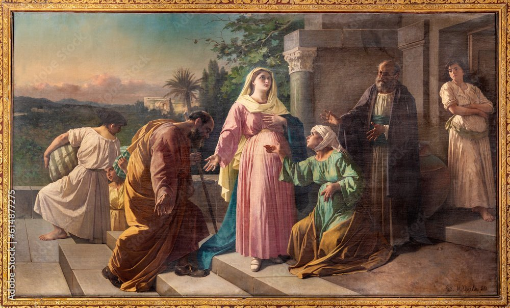
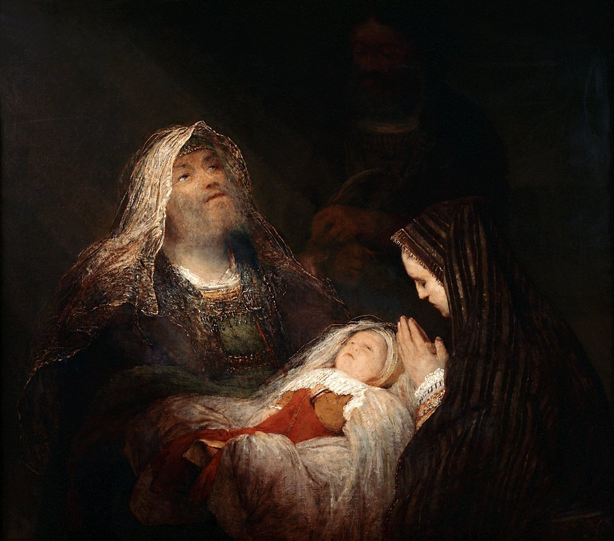

<!-- START doctoc generated TOC please keep comment here to allow auto update -->

<!-- DON'T EDIT THIS SECTION, INSTEAD RE-RUN doctoc TO UPDATE -->

**Table of Contents** _generated with [DocToc](https://github.com/ktechhub/doctoc)_

<!---toc start-->

- [October 2025](#october-2025)
  - [October 01, 2025](#october-01-2025)
    - [The Joyful Mysteries - Day 274](#the-joyful-mysteries---day-274)
    - [AI-Generated Summary: On the Recitation of Mysteries](#ai-generated-summary-on-the-recitation-of-mysteries)
    - [Jan van Eyck's 1434-1436 oil panel 'The Annunciation' at the National Gallery of Art depicts Gabriel announcing to Mary she will bear God's Son](#jan-van-eycks-1434-1436-oil-panel-the-annunciation-at-the-national-gallery-of-art-depicts-gabriel-announcing-to-mary-she-will-bear-gods-son)
    - [Federico Maldarelli's 1889 oil painting 'The Visitation' in Naples depicts Mary and Elizabeth's sacred meeting, both pregnant with Jesus and John the Baptist (Stock Image)](#federico-maldarellis-1889-oil-painting-the-visitation-in-naples-depicts-mary-and-elizabeths-sacred-meeting-both-pregnant-with-jesus-and-john-the-baptist-stock-image)
    - [Gerard van Honthorst's 1622 Baroque masterpiece 'Adoration of the Shepherds' depicts the Nativity, with humble shepherds illuminated by divine light as they worship the newborn Christ](#gerard-van-honthorsts-1622-baroque-masterpiece-adoration-of-the-shepherds-depicts-the-nativity-with-humble-shepherds-illuminated-by-divine-light-as-they-worship-the-newborn-christ)
    - [Aert de Gelder's 1700-1710 oil painting 'Simeon's Song of Praise' depicts the Presentation of Jesus in the Temple at the Mauritshuis](#aert-de-gelders-1700-1710-oil-painting-simeons-song-of-praise-depicts-the-presentation-of-jesus-in-the-temple-at-the-mauritshuis)
  - [October 02, 2025](#october-02-2025)
    - [The Joyful and Luminous Mysteries - Day 275](#the-joyful-and-luminous-mysteries---day-275)
    - [AI-Generated Summary: On the Finding in the Temple](#ai-generated-summary-on-the-finding-in-the-temple)
    - [A young Jesus astonishes Temple scholars with divine wisdom in this depiction of the Finding in the Temple (Stock Image)](#a-young-jesus-astonishes-temple-scholars-with-divine-wisdom-in-this-depiction-of-the-finding-in-the-temple-stock-image)
    - [An unknown artist's Renaissance fresco 'The Baptism of Christ' in Padua's Church of San Benedetto depicts John baptizing Jesus as the Holy Spirit descends (Stock Image)](#an-unknown-artists-renaissance-fresco-the-baptism-of-christ-in-paduas-church-of-san-benedetto-depicts-john-baptizing-jesus-as-the-holy-spirit-descends-stock-image)
    - [Gerard David's c 1500 oil painting 'The Marriage at Cana' in the Louvre depicts Jesus performing his first miracle of turning water into wine](#gerard-davids-c-1500-oil-painting-the-marriage-at-cana-in-the-louvre-depicts-jesus-performing-his-first-miracle-of-turning-water-into-wine)
    - [Rembrandt's 1633 oil painting 'Christ in the Storm on the Sea of Galilee' dramatically captures Jesus calming the tempest](#rembrandts-1633-oil-painting-christ-in-the-storm-on-the-sea-of-galilee-dramatically-captures-jesus-calming-the-tempest)
  - [October 03, 2025](#october-03-2025)
    - [The Luminous and Sorrowful Mysteries - Day 276](#the-luminous-and-sorrowful-mysteries---day-276)
    - [AI-Generated Summary: On Certain Mysteries, Luminous and Sorrowful](#ai-generated-summary-on-certain-mysteries-luminous-and-sorrowful)
    - ['The Transfiguration' depicts Jesus radiant in divine light before His disciples, with Moses and Elijah appearing, located in Vienna's Votive Church](#the-transfiguration-depicts-jesus-radiant-in-divine-light-before-his-disciples-with-moses-and-elijah-appearing-located-in-viennas-votive-church)
    - [Juan de Juanes' 1562 Spanish Renaissance painting 'The Last Supper' in the Prado depicts Christ instituting the Eucharist](#juan-de-juanes-1562-spanish-renaissance-painting-the-last-supper-in-the-prado-depicts-christ-instituting-the-eucharist)
    - [Alessandro Maganza's c 1590-1610 oil painting 'The Prayer of Jesus in Gethsemane' in Vicenza Cathedral depicts Christ's spiritual agony while His disciples sleep (Stock Image)](#alessandro-maganzas-c-1590-1610-oil-painting-the-prayer-of-jesus-in-gethsemane-in-vicenza-cathedral-depicts-christs-spiritual-agony-while-his-disciples-sleep-stock-image)
    - [Caravaggio's 1607 Baroque masterpiece 'The Flagellation of Christ' in Naples depicts Christ's brutal scourging by Roman soldiers](#caravaggios-1607-baroque-masterpiece-the-flagellation-of-christ-in-naples-depicts-christs-brutal-scourging-by-roman-soldiers)

<!---toc end-->

<!-- END doctoc generated TOC please keep comment here to allow auto update -->

<!-- toc -->

<!-- tocstop -->

# October 2025

RIAY October 2025

## October 01, 2025

### The Joyful Mysteries - Day 274

### AI-Generated Summary: On the Recitation of Mysteries

It may be observed by anyone who sets himself to this devotion that the rhythm of the prayer, which began at a pace suited to private contemplation, has now found a steadier and more corporate beat—the very cadence one might adopt when praying in common with the friars. It is a movement from the tentative steps of a novice toward the firm, measured tread of a pilgrim on a well-worn path.

The mysteries themselves, those windows into divine humility, were the first four Joyful ones. The Annunciation, where eternity broke into time and a young woman’s _fiat_ changed the course of all things. The Visitation, where grace overflowed from one expectant mother to another, and sanctity leapt in the womb. The Nativity, where the Word became a crying infant laid in straw, the ultimate descent of Love into poverty. And finally, the Presentation, where the Child was brought to the Temple, and aged Simeon saw in that small bundle both the consolation of a people and the sword that would pierce a soul.

No images or carvings were described to fix these scenes before the inward eye; only the bare, glorious facts remain—which are, as we know, always enough.

### Jan van Eyck's 1434-1436 oil panel 'The Annunciation' at the National Gallery of Art depicts Gabriel announcing to Mary she will bear God's Son

### Federico Maldarelli's 1889 oil painting 'The Visitation' in Naples depicts Mary and Elizabeth's sacred meeting, both pregnant with Jesus and John the Baptist (Stock Image)

### Gerard van Honthorst's 1622 Baroque masterpiece 'Adoration of the Shepherds' depicts the Nativity, with humble shepherds illuminated by divine light as they worship the newborn Christ

### Aert de Gelder's 1700-1710 oil painting 'Simeon's Song of Praise' depicts the Presentation of Jesus in the Temple at the Mauritshuis

## October 02, 2025

### The Joyful and Luminous Mysteries - Day 275

### AI-Generated Summary: On the Finding in the Temple

My dear reader, you must picture a scene, not of loss, but of a quiet and startling discovery. It is the finding of the Child in the temple, where He was not misplaced but purposefully at home, sitting among the teachers. His mother’s question, which any earthly parent would ask, meets with a reply that hints at a deeper, more eternal obedience. The Boy was about His Father’s business, a first faint signal of the great schism between the natural affections of a family and the overwhelming claims of Heaven.

Then comes the Baptism in the Jordan, where the heavens themselves were torn open. The voice of the Father declares His pleasure, and the Spirit descends like a dove. Here, in the river’s common water, is the sacred pattern set forth: the Son submits, the Father blesses, the Spirit empowers. It is the public and solemn beginning of the great work of redemption.

And at the wedding in Cana, we see a thing both homely and divine. The wine fails, and the need is simple, human. His mother, with a quiet faith, instructs the servants to do whatever He says. From mere water, drawn for cleansing, comes the best wine, a sign of how the Law is to be fulfilled by Grace. It was the first of His signs, not a public spectacle, but a generous gift to save a humble feast from shame, showing that His kingdom begins in the transformation of the ordinary.

The final mystery considered is the Proclamation of the Kingdom. Here, the call goes out, clear and urgent: the time is fulfilled, the kingdom of God is at hand. It is a summons to turn away from the old paths, to repent, and to believe in this good news. This is the great declaration for which all that came before was but a preparation.

### A young Jesus astonishes Temple scholars with divine wisdom in this depiction of the Finding in the Temple (Stock Image)

### An unknown artist's Renaissance fresco 'The Baptism of Christ' in Padua's Church of San Benedetto depicts John baptizing Jesus as the Holy Spirit descends (Stock Image)

### Gerard David's c 1500 oil painting 'The Marriage at Cana' in the Louvre depicts Jesus performing his first miracle of turning water into wine

### Rembrandt's 1633 oil painting 'Christ in the Storm on the Sea of Galilee' dramatically captures Jesus calming the tempest

## October 03, 2025

### The Luminous and Sorrowful Mysteries - Day 276

### AI-Generated Summary: On Certain Mysteries, Luminous and Sorrowful

My dear reader, you have before you a glimpse into that great drama which lies at the heart of things, where the eternal breaks into the temporal. We are shown first a mountain-top, a place set apart, where for a brief and blinding moment the veil is lifted. The Master’s very countenance shines like the sun, and His raiment becomes light itself, while the Law and the Prophets—Moses and Elijah—stand beside Him in witness. This is the Transfiguration, the fourth Luminous Mystery, a promise of the glory that is to come.

Then we are brought to an upper room, to the deep magic of the fifth Luminous Mystery. There, at the final meal, He takes the common stuff of earth, bread and wine, and makes them the vehicle of His very life. He gives His own self, His Body and His Blood, and commands His friends to do this always in remembrance of Him. This is the Institution of the Eucharist, the gift that bridges heaven and earth.

But the path then turns, as it must in any true story, toward a darker wood. We follow Him into a garden, where the weight of all the world’s sorrow seems to press upon a single human soul. In the first Sorrowful Mystery, the Agony in the Garden, He accepts the bitter cup, conforming His will entirely to the Father’s, while those He asked to watch with Him slumber in their humanity.

From that quiet anguish, we are taken to a place of public violence: the second Sorrowful Mystery, the Scourging at the Pillar. Here, the Creator of the stars is bound and stripped, His back offered to the lash of His creatures—a brutal, bloody prelude to the greater sacrifice that was to complete the whole symphony.

### 'The Transfiguration' depicts Jesus radiant in divine light before His disciples, with Moses and Elijah appearing, located in Vienna's Votive Church

### Juan de Juanes' 1562 Spanish Renaissance painting 'The Last Supper' in the Prado depicts Christ instituting the Eucharist

### Alessandro Maganza's c 1590-1610 oil painting 'The Prayer of Jesus in Gethsemane' in Vicenza Cathedral depicts Christ's spiritual agony while His disciples sleep (Stock Image)

### Caravaggio's 1607 Baroque masterpiece 'The Flagellation of Christ' in Naples depicts Christ's brutal scourging by Roman soldiers

