<!-- START doctoc generated TOC please keep comment here to allow auto update -->

<!-- DON'T EDIT THIS SECTION, INSTEAD RE-RUN doctoc TO UPDATE -->

**Table of Contents** _generated with [DocToc](https://github.com/ktechhub/doctoc)_

<!---toc start-->

- [October 2025](#october-2025)
  - [October 01, 2025](#october-01-2025)
    - [The Joyful Mysteries - Day 274](#the-joyful-mysteries---day-274)
    - [AI-Generated Summary: On the Recitation of Mysteries](#ai-generated-summary-on-the-recitation-of-mysteries)
    - [Jan van Eyck's 1434-1436 oil panel 'The Annunciation' at the National Gallery of Art depicts Gabriel announcing to Mary she will bear God's Son](#jan-van-eycks-1434-1436-oil-panel-the-annunciation-at-the-national-gallery-of-art-depicts-gabriel-announcing-to-mary-she-will-bear-gods-son)
    - [Federico Maldarelli's 1889 oil painting 'The Visitation' in Naples depicts Mary and Elizabeth's sacred meeting, both pregnant with Jesus and John the Baptist (Stock Image)](#federico-maldarellis-1889-oil-painting-the-visitation-in-naples-depicts-mary-and-elizabeths-sacred-meeting-both-pregnant-with-jesus-and-john-the-baptist-stock-image)
    - [Gerard van Honthorst's 1622 Baroque masterpiece 'Adoration of the Shepherds' depicts the Nativity, with humble shepherds illuminated by divine light as they worship the newborn Christ](#gerard-van-honthorsts-1622-baroque-masterpiece-adoration-of-the-shepherds-depicts-the-nativity-with-humble-shepherds-illuminated-by-divine-light-as-they-worship-the-newborn-christ)
    - [Aert de Gelder's 1700-1710 oil painting 'Simeon's Song of Praise' depicts the Presentation of Jesus in the Temple at the Mauritshuis](#aert-de-gelders-1700-1710-oil-painting-simeons-song-of-praise-depicts-the-presentation-of-jesus-in-the-temple-at-the-mauritshuis)
  - [October 02, 2025](#october-02-2025)
    - [The Joyful and Luminous Mysteries - Day 275](#the-joyful-and-luminous-mysteries---day-275)
    - [AI-Generated Summary: On the Finding in the Temple](#ai-generated-summary-on-the-finding-in-the-temple)
    - [A young Jesus astonishes Temple scholars with divine wisdom in this depiction of the Finding in the Temple (Stock Image)](#a-young-jesus-astonishes-temple-scholars-with-divine-wisdom-in-this-depiction-of-the-finding-in-the-temple-stock-image)
    - [An unknown artist's Renaissance fresco 'The Baptism of Christ' in Padua's Church of San Benedetto depicts John baptizing Jesus as the Holy Spirit descends (Stock Image)](#an-unknown-artists-renaissance-fresco-the-baptism-of-christ-in-paduas-church-of-san-benedetto-depicts-john-baptizing-jesus-as-the-holy-spirit-descends-stock-image)
    - [Gerard David's c 1500 oil painting 'The Marriage at Cana' in the Louvre depicts Jesus performing his first miracle of turning water into wine](#gerard-davids-c-1500-oil-painting-the-marriage-at-cana-in-the-louvre-depicts-jesus-performing-his-first-miracle-of-turning-water-into-wine)
    - [Rembrandt's 1633 oil painting 'Christ in the Storm on the Sea of Galilee' dramatically captures Jesus calming the tempest](#rembrandts-1633-oil-painting-christ-in-the-storm-on-the-sea-of-galilee-dramatically-captures-jesus-calming-the-tempest)
  - [October 03, 2025](#october-03-2025)
    - [The Luminous and Sorrowful Mysteries - Day 276](#the-luminous-and-sorrowful-mysteries---day-276)
    - [AI-Generated Summary: On Certain Mysteries, Luminous and Sorrowful](#ai-generated-summary-on-certain-mysteries-luminous-and-sorrowful)
    - ['The Transfiguration' depicts Jesus radiant in divine light before His disciples, with Moses and Elijah appearing, located in Vienna's Votive Church](#the-transfiguration-depicts-jesus-radiant-in-divine-light-before-his-disciples-with-moses-and-elijah-appearing-located-in-viennas-votive-church)
    - [Juan de Juanes' 1562 Spanish Renaissance painting 'The Last Supper' in the Prado depicts Christ instituting the Eucharist](#juan-de-juanes-1562-spanish-renaissance-painting-the-last-supper-in-the-prado-depicts-christ-instituting-the-eucharist)
    - [Alessandro Maganza's c 1590-1610 oil painting 'The Prayer of Jesus in Gethsemane' in Vicenza Cathedral depicts Christ's spiritual agony while His disciples sleep (Stock Image)](#alessandro-maganzas-c-1590-1610-oil-painting-the-prayer-of-jesus-in-gethsemane-in-vicenza-cathedral-depicts-christs-spiritual-agony-while-his-disciples-sleep-stock-image)
    - [Caravaggio's 1607 Baroque masterpiece 'The Flagellation of Christ' in Naples depicts Christ's brutal scourging by Roman soldiers](#caravaggios-1607-baroque-masterpiece-the-flagellation-of-christ-in-naples-depicts-christs-brutal-scourging-by-roman-soldiers)
  - [October 04, 2025](#october-04-2025)
    - [The Sorrowful and Glorious Mysteries - Day 277](#the-sorrowful-and-glorious-mysteries---day-277)
    - [AI-Generated Summary: On the Unspoken Movement From Sorrow to Glory in the Recitation of Prayers](#ai-generated-summary-on-the-unspoken-movement-from-sorrow-to-glory-in-the-recitation-of-prayers)
    - [Attributed to Caravaggio's 'Ecce Homo' (c 1605), an oil painting of Christ crowned with thorns presented to the people](#attributed-to-caravaggios-ecce-homo-c-1605-an-oil-painting-of-christ-crowned-with-thorns-presented-to-the-people)
    - [Pieter Bruegel the Elder's 1564 oil painting 'The Procession to Calvary' depicts Christ carrying the cross through an indifferent crowd](#pieter-bruegel-the-elders-1564-oil-painting-the-procession-to-calvary-depicts-christ-carrying-the-cross-through-an-indifferent-crowd)
    - [James Tissot's 1886-1894 gouache 'What Our Lord Saw from the Cross' depicts the Crucifixion from Christ's unique perspective, held at the Brooklyn Museum](#james-tissots-1886-1894-gouache-what-our-lord-saw-from-the-cross-depicts-the-crucifixion-from-christs-unique-perspective-held-at-the-brooklyn-museum)
    - [Caravaggio's 1601-1602 'The Incredulity of Saint Thomas' depicts the apostle verifying Christ's resurrection by touching His wounds, housed at Sanssouci Palace](#caravaggios-1601-1602-the-incredulity-of-saint-thomas-depicts-the-apostle-verifying-christs-resurrection-by-touching-his-wounds-housed-at-sanssouci-palace)
  - [October 05, 2025](#october-05-2025)
    - [The Glorious Mysteries - Day 278](#the-glorious-mysteries---day-278)
    - [AI-Generated Summary: On the Recurring Invocation That Forms the Heart of Common Prayer](#ai-generated-summary-on-the-recurring-invocation-that-forms-the-heart-of-common-prayer)
    - [Byzantine mosaicists' 12th-century mosaic 'The Ascension' in St Mark's Basilica depicts Christ rising to heaven amid angels, with the Virgin Mary and astonished apostles below](#byzantine-mosaicists-12th-century-mosaic-the-ascension-in-st-marks-basilica-depicts-christ-rising-to-heaven-amid-angels-with-the-virgin-mary-and-astonished-apostles-below)
    - [Simone Peterzano's 1580 Mannerist 'Pentecost' in Milan depicts the Holy Spirit descending upon Mary and the apostles (Stock Image)](#simone-peterzanos-1580-mannerist-pentecost-in-milan-depicts-the-holy-spirit-descending-upon-mary-and-the-apostles-stock-image)
    - [Cesare Mariani's 1863 fresco 'Assumption of the Virgin with Vision of St Bonaventure' in Rome depicts the Virgin Mary's bodily ascent into heaven](#cesare-marianis-1863-fresco-assumption-of-the-virgin-with-vision-of-st-bonaventure-in-rome-depicts-the-virgin-marys-bodily-ascent-into-heaven)
    - [Giuseppe Mattia Borgnis's 18th-century Baroque fresco 'Coronation of the Virgin' depicts Mary being crowned Queen of Heaven (Stock Image)](#giuseppe-mattia-borgniss-18th-century-baroque-fresco-coronation-of-the-virgin-depicts-mary-being-crowned-queen-of-heaven-stock-image)
  - [October 06, 2025](#october-06-2025)
    - [The Joyful Mysteries - Day 279](#the-joyful-mysteries---day-279)
    - [AI-Generated Summary: On the First Four Joyful Mysteries and the Curious Absence of Substantive Matter](#ai-generated-summary-on-the-first-four-joyful-mysteries-and-the-curious-absence-of-substantive-matter)
    - [Jan van Eyck's 1434-1436 oil panel 'The Annunciation' at the National Gallery of Art depicts Gabriel announcing to Mary that she will bear God's Son](#jan-van-eycks-1434-1436-oil-panel-the-annunciation-at-the-national-gallery-of-art-depicts-gabriel-announcing-to-mary-that-she-will-bear-gods-son)
    - ['The Visitation' depicts Mary and Elizabeth's sacred encounter in Ein Karem, where both women recognize God's miraculous work through their unborn children](#the-visitation-depicts-mary-and-elizabeths-sacred-encounter-in-ein-karem-where-both-women-recognize-gods-miraculous-work-through-their-unborn-children)
    - [Caravaggio's 1600 Baroque masterpiece 'Nativity with St Francis and St Lawrence' depicts Christ's birth with dramatic chiaroscuro, though the original oil painting was stolen in 1969](#caravaggios-1600-baroque-masterpiece-nativity-with-st-francis-and-st-lawrence-depicts-christs-birth-with-dramatic-chiaroscuro-though-the-original-oil-painting-was-stolen-in-1969)
    - [Giulio Campi's fresco 'The Presentation of Jesus in the Temple' in Cremona depicts Mary and Joseph presenting the infant Christ to Simeon (Stock Image)](#giulio-campis-fresco-the-presentation-of-jesus-in-the-temple-in-cremona-depicts-mary-and-joseph-presenting-the-infant-christ-to-simeon-stock-image)
  - [October 07, 2025](#october-07-2025)
    - [The Joyful and Luminous Mysteries - Day 280](#the-joyful-and-luminous-mysteries---day-280)
    - [AI-Generated Summary: On the Finding in the Temple and Those First Great Shining Mysteries Wherein the Divine Light Broke Upon the World](#ai-generated-summary-on-the-finding-in-the-temple-and-those-first-great-shining-mysteries-wherein-the-divine-light-broke-upon-the-world)
    - [A 20th-century Byzantine Revival mosaic in Lourdes' Rosary Basilica depicting Mary and Joseph finding the young Jesus teaching in the Temple (Stock Image)](#a-20th-century-byzantine-revival-mosaic-in-lourdes-rosary-basilica-depicting-mary-and-joseph-finding-the-young-jesus-teaching-in-the-temple-stock-image)
    - [An unknown Renaissance fresco, 'The Baptism of Christ', depicting Jesus baptized by John the Baptist in the Jordan River with the Holy Spirit descending as a dove, located in Padua's Church of San Benedetto (Stock Image)](#an-unknown-renaissance-fresco-the-baptism-of-christ-depicting-jesus-baptized-by-john-the-baptist-in-the-jordan-river-with-the-holy-spirit-descending-as-a-dove-located-in-paduas-church-of-san-benedetto-stock-image)
    - [Gerard David's 'The Marriage at Cana' (c 1500), an Early Netherlandish oil painting in the Louvre, depicts Jesus performing his first miracle of turning water into wine](#gerard-davids-the-marriage-at-cana-c-1500-an-early-netherlandish-oil-painting-in-the-louvre-depicts-jesus-performing-his-first-miracle-of-turning-water-into-wine)
    - [Rembrandt's 1633 oil painting 'Christ in the Storm on the Sea of Galilee' dramatically captures Jesus calming the tempest, demonstrating divine authority over nature](#rembrandts-1633-oil-painting-christ-in-the-storm-on-the-sea-of-galilee-dramatically-captures-jesus-calming-the-tempest-demonstrating-divine-authority-over-nature)
  - [October 08, 2025](#october-08-2025)
    - [The Luminous and Sorrowful Mysteries - Day 281](#the-luminous-and-sorrowful-mysteries---day-281)
    - [AI-Generated Summary: On the Unfolding of Divine Mysteries Through Light and Sorrow in the Rosary](#ai-generated-summary-on-the-unfolding-of-divine-mysteries-through-light-and-sorrow-in-the-rosary)
    - [Theophanes the Greek's 1403 fresco 'The Transfiguration' at the Tretyakov Gallery depicts Christ in divine light with Moses and Elijah](#theophanes-the-greeks-1403-fresco-the-transfiguration-at-the-tretyakov-gallery-depicts-christ-in-divine-light-with-moses-and-elijah)
    - [Juan de Juanes' 1562 Spanish Renaissance masterpiece 'The Last Supper' depicts Christ instituting the Eucharist at the final meal](#juan-de-juanes-1562-spanish-renaissance-masterpiece-the-last-supper-depicts-christ-instituting-the-eucharist-at-the-final-meal)
    - [Giotto's 1304-1306 fresco in Padua's Scrovegni Chapel captures Judas's treacherous kiss during Christ's arrest in Gethsemane](#giottos-1304-1306-fresco-in-paduas-scrovegni-chapel-captures-judass-treacherous-kiss-during-christs-arrest-in-gethsemane)
    - [Giovanni Antonio Bazzi's 'Christ at the Column' (c 1510-1515), a fresco in Siena's Pinacoteca Nazionale, depicts the bound and wounded Christ during his flagellation](#giovanni-antonio-bazzis-christ-at-the-column-c-1510-1515-a-fresco-in-sienas-pinacoteca-nazionale-depicts-the-bound-and-wounded-christ-during-his-flagellation)
  - [October 09, 2025](#october-09-2025)
    - [The Sorrowful and Glorious Mysteries - Day 282](#the-sorrowful-and-glorious-mysteries---day-282)
    - [AI-Generated Summary: On the Sorrowful Weight of Thorns and Wood and the Glorious Dawn That Follows](#ai-generated-summary-on-the-sorrowful-weight-of-thorns-and-wood-and-the-glorious-dawn-that-follows)
    - [Caravaggio's 1605 'Ecce Homo' in Genoa depicts Christ crowned with thorns as Pilate presents him to the mocking crowd](#caravaggios-1605-ecce-homo-in-genoa-depicts-christ-crowned-with-thorns-as-pilate-presents-him-to-the-mocking-crowd)
    - [Pieter Bruegel the Elder's 1564 oil painting 'The Procession to Calvary' depicts Christ falling under the cross's weight amidst an indifferent crowd, housed in Vienna's Kunsthistorisches Museum](#pieter-bruegel-the-elders-1564-oil-painting-the-procession-to-calvary-depicts-christ-falling-under-the-crosss-weight-amidst-an-indifferent-crowd-housed-in-viennas-kunsthistorisches-museum)
    - [James Tissot's 1886-1894 gouache 'What Our Lord Saw from the Cross' depicts the Crucifixion from Christ's unique perspective, housed at the Brooklyn Museum](#james-tissots-1886-1894-gouache-what-our-lord-saw-from-the-cross-depicts-the-crucifixion-from-christs-unique-perspective-housed-at-the-brooklyn-museum)
    - [Annibale Carracci's 1593 oil painting 'Resurrection' at the Louvre depicts Christ gloriously emerging from the tomb as Roman soldiers recoil in awe](#annibale-carraccis-1593-oil-painting-resurrection-at-the-louvre-depicts-christ-gloriously-emerging-from-the-tomb-as-roman-soldiers-recoil-in-awe)
  - [October 10, 2025](#october-10-2025)
    - [The Glorious Mysteries - Day 283](#the-glorious-mysteries---day-283)
    - [AI-Generated Summary: On the Consideration of Those Glorious Mysteries Which Complete the Great Story](#ai-generated-summary-on-the-consideration-of-those-glorious-mysteries-which-complete-the-great-story)
    - [Duccio's 14th-century Gothic panel 'Christ Taking Leave of the Apostles' in tempera on wood depicts Christ's final instructions before his Ascension](#duccios-14th-century-gothic-panel-christ-taking-leave-of-the-apostles-in-tempera-on-wood-depicts-christs-final-instructions-before-his-ascension)
    - [Titian's 1546 oil painting 'Pentecost' in Venice depicts the Holy Spirit descending as fire upon Mary and the apostles](#titians-1546-oil-painting-pentecost-in-venice-depicts-the-holy-spirit-descending-as-fire-upon-mary-and-the-apostles)
    - [A 13th-15th century Gothic stained glass window in Burgos Cathedral depicting the Virgin Mary's glorious assumption into heaven, welcomed by Christ (Stock Image)](#a-13th-15th-century-gothic-stained-glass-window-in-burgos-cathedral-depicting-the-virgin-marys-glorious-assumption-into-heaven-welcomed-by-christ-stock-image)
    - [Giuseppe Mattia Borgnis's Baroque fresco 'Coronation of the Virgin' depicts Mary being crowned Queen of Heaven (Stock Image)](#giuseppe-mattia-borgniss-baroque-fresco-coronation-of-the-virgin-depicts-mary-being-crowned-queen-of-heaven-stock-image)
  - [October 11, 2025](#october-11-2025)
    - [The Joyful Mysteries - Day 284](#the-joyful-mysteries---day-284)
    - [AI-Generated Summary: The Joyful Mysteries as a Window into the Divine Humility That Enters Our World](#ai-generated-summary-the-joyful-mysteries-as-a-window-into-the-divine-humility-that-enters-our-world)
    - [Fra Angelico's 'The Annunciation' (mid-1430s), a tempera on panel housed at the Museo del Prado in Madrid, delicately renders the biblical scene where Archangel Gabriel announces to the Virgin Mary that she will bear the Son of God, set within the refined architecture of the Early Renaissance](#fra-angelicos-the-annunciation-mid-1430s-a-tempera-on-panel-housed-at-the-museo-del-prado-in-madrid-delicately-renders-the-biblical-scene-where-archangel-gabriel-announces-to-the-virgin-mary-that-she-will-bear-the-son-of-god-set-within-the-refined-architecture-of-the-early-renaissance)
    - ['The Visitation' depicts the sacred moment when Mary, pregnant with Jesus, visits her cousin Elizabeth, who carries John the Baptist Set against the backdrop of the Basilica of the Visitation in Ein Karem, this artwork captures their mutual recognition of God's divine work as Elizabeth feels her child leap with joy, embodying the profound humility and grace of the second Joyful Mystery](#the-visitation-depicts-the-sacred-moment-when-mary-pregnant-with-jesus-visits-her-cousin-elizabeth-who-carries-john-the-baptist-set-against-the-backdrop-of-the-basilica-of-the-visitation-in-ein-karem-this-artwork-captures-their-mutual-recognition-of-gods-divine-work-as-elizabeth-feels-her-child-leap-with-joy-embodying-the-profound-humility-and-grace-of-the-second-joyful-mystery)
    - [Giovanni Antonio Pellegrini's 18th-century Rococo masterpiece 'The Nativity', rendered in oil on canvas at the Salesianerkirche in Vienna, tenderly depicts the newborn Christ Child illuminated in a humble stable, adored by the Virgin Mary, Saint Joseph, and a host of angels, capturing the profound divine humility of the Incarnation (Stock Image)](#giovanni-antonio-pellegrinis-18th-century-rococo-masterpiece-the-nativity-rendered-in-oil-on-canvas-at-the-salesianerkirche-in-vienna-tenderly-depicts-the-newborn-christ-child-illuminated-in-a-humble-stable-adored-by-the-virgin-mary-saint-joseph-and-a-host-of-angels-capturing-the-profound-divine-humility-of-the-incarnation-stock-image)
    - [An 18th-century Baroque oil painting by an unknown artist, located in the Church of St Gall in Prague, depicting 'The Presentation of Jesus in the Temple' where Mary and Joseph present the infant Christ to the elderly Simeon, fulfilling the Jewish purification laws with profound solemnity](#an-18th-century-baroque-oil-painting-by-an-unknown-artist-located-in-the-church-of-st-gall-in-prague-depicting-the-presentation-of-jesus-in-the-temple-where-mary-and-joseph-present-the-infant-christ-to-the-elderly-simeon-fulfilling-the-jewish-purification-laws-with-profound-solemnity)
    - [This 20th century Byzantine Revival mosaic by an unknown mosaicist, located in the Rosary Basilica at Lourdes, depicts 'The Finding of Jesus in the Temple,' where Mary and Joseph discover the twelve-year-old Christ demonstrating his divine wisdom to the Temple elders (Stock Image)](#this-20th-century-byzantine-revival-mosaic-by-an-unknown-mosaicist-located-in-the-rosary-basilica-at-lourdes-depicts-the-finding-of-jesus-in-the-temple-where-mary-and-joseph-discover-the-twelve-year-old-christ-demonstrating-his-divine-wisdom-to-the-temple-elders-stock-image)
  - [October 12, 2025](#october-12-2025)
    - [The Joyful and Luminous Mysteries - Day 285](#the-joyful-and-luminous-mysteries---day-285)
    - [AI-Generated Summary: On the Joyful Discovery in the Temple and Those First Glimpses of Light at the River and the Feast](#ai-generated-summary-on-the-joyful-discovery-in-the-temple-and-those-first-glimpses-of-light-at-the-river-and-the-feast)
    - [William Holman Hunt's 1860 Pre-Raphaelite masterpiece 'The Finding of the Saviour in the Temple', an oil on canvas housed at the Birmingham Museum and Art Gallery, depicts the profound moment when Mary and Joseph discover their twelve-year-old son Jesus engaged in deep theological discussion with the rabbis, illuminating the fifth Joyful Mystery where the boy reveals His divine mission within His Father's house](#william-holman-hunts-1860-pre-raphaelite-masterpiece-the-finding-of-the-saviour-in-the-temple-an-oil-on-canvas-housed-at-the-birmingham-museum-and-art-gallery-depicts-the-profound-moment-when-mary-and-joseph-discover-their-twelve-year-old-son-jesus-engaged-in-deep-theological-discussion-with-the-rabbis-illuminating-the-fifth-joyful-mystery-where-the-boy-reveals-his-divine-mission-within-his-fathers-house)
    - [In 'The Baptism of Christ' (c 1475), a collaborative tempera and oil on wood masterpiece by Andrea del Verrocchio and Leonardo da Vinci, John the Baptist baptizes Jesus in the Jordan River as angels witness and the Holy Spirit descends, housed at the Uffizi Gallery in Florence](#in-the-baptism-of-christ-c-1475-a-collaborative-tempera-and-oil-on-wood-masterpiece-by-andrea-del-verrocchio-and-leonardo-da-vinci-john-the-baptist-baptizes-jesus-in-the-jordan-river-as-angels-witness-and-the-holy-spirit-descends-housed-at-the-uffizi-gallery-in-florence)
    - [Paolo Veronese's magnificent 1563 oil on canvas 'The Wedding at Cana' captures Christ's first miracle at a joyous wedding feast, where water is transformed into wine, a pivotal Luminous Mystery now housed in the Louvre Museum, Paris](#paolo-veroneses-magnificent-1563-oil-on-canvas-the-wedding-at-cana-captures-christs-first-miracle-at-a-joyous-wedding-feast-where-water-is-transformed-into-wine-a-pivotal-luminous-mystery-now-housed-in-the-louvre-museum-paris)
    - [Rembrandt van Rijn's 1633 oil-on-canvas masterpiece 'Christ in the Storm on the Sea of Galilee' dramatically captures the moment Jesus calms the tempest, illustrating His divine authority over nature as His disciples panic around Him, a powerful visual proclamation of God's Kingdom](#rembrandt-van-rijns-1633-oil-on-canvas-masterpiece-christ-in-the-storm-on-the-sea-of-galilee-dramatically-captures-the-moment-jesus-calms-the-tempest-illustrating-his-divine-authority-over-nature-as-his-disciples-panic-around-him-a-powerful-visual-proclamation-of-gods-kingdom)
  - [October 13, 2025](#october-13-2025)
    - [The Luminous and Sorrowful Mysteries - Day 286](#the-luminous-and-sorrowful-mysteries---day-286)
    - [AI-Generated Summary: On the Mountain of Glory and in the Garden of Sorrow Where the Divine Light Was Veiled and Blood Was Poured Out](#ai-generated-summary-on-the-mountain-of-glory-and-in-the-garden-of-sorrow-where-the-divine-light-was-veiled-and-blood-was-poured-out)
    - [Raphael's 'The Transfiguration' (1516-1520), a High Renaissance tempera on wood masterpiece housed in the Vatican Museums, powerfully depicts Christ's divine Transfiguration on Mount Tabor, where His hidden glory is revealed to the apostles, while simultaneously illustrating the human need for divine intervention in the scene of the possessed boy's healing below](#raphaels-the-transfiguration-1516-1520-a-high-renaissance-tempera-on-wood-masterpiece-housed-in-the-vatican-museums-powerfully-depicts-christs-divine-transfiguration-on-mount-tabor-where-his-hidden-glory-is-revealed-to-the-apostles-while-simultaneously-illustrating-the-human-need-for-divine-intervention-in-the-scene-of-the-possessed-boys-healing-below)
    - [Henry Ossawa Tanner's 1900 oil painting 'Christ and the Disciples Before the Last Supper,' from a private collection, intimately portrays Christ in spiritual preparation with his disciples before instituting the Holy Eucharist](#henry-ossawa-tanners-1900-oil-painting-christ-and-the-disciples-before-the-last-supper-from-a-private-collection-intimately-portrays-christ-in-spiritual-preparation-with-his-disciples-before-instituting-the-holy-eucharist)
    - [Alessandro Maganza's 'The Prayer of Jesus in Gethsemane' (c 1590-1610), an oil on canvas housed in Vicenza Cathedral, captures the profound spiritual struggle of Christ's Agony in the Garden, where He prays in anguish while His disciples sleep, a pivotal Sorrowful Mystery preceding His Passion (Stock Image)](#alessandro-maganzas-the-prayer-of-jesus-in-gethsemane-c-1590-1610-an-oil-on-canvas-housed-in-vicenza-cathedral-captures-the-profound-spiritual-struggle-of-christs-agony-in-the-garden-where-he-prays-in-anguish-while-his-disciples-sleep-a-pivotal-sorrowful-mystery-preceding-his-passion-stock-image)
    - [William-Adolphe Bouguereau's 1880 oil on canvas 'The Flagellation of Our Lord Jesus Christ,' located in the Cathedral of La Rochelle, masterfully depicts the Sorrowful Mystery of the Scourging at the Pillar, capturing Christ's divine resignation as his sacred flesh is torn in a brutal prelude to his ultimate sacrifice](#william-adolphe-bouguereaus-1880-oil-on-canvas-the-flagellation-of-our-lord-jesus-christ-located-in-the-cathedral-of-la-rochelle-masterfully-depicts-the-sorrowful-mystery-of-the-scourging-at-the-pillar-capturing-christs-divine-resignation-as-his-sacred-flesh-is-torn-in-a-brutal-prelude-to-his-ultimate-sacrifice)
  - [October 14, 2025](#october-14-2025)
    - [The Sorrowful and Glorious Mysteries - Day 287](#the-sorrowful-and-glorious-mysteries---day-287)
    - [AI-Generated Summary: On the Profound Transition from Mortal Suffering to Glorious Triumph Within the Holy Rosary](#ai-generated-summary-on-the-profound-transition-from-mortal-suffering-to-glorious-triumph-within-the-holy-rosary)
    - [In this powerful Baroque painting 'Ecce Homo' attributed to Caravaggio from c 1605, the suffering Christ is presented to the people wearing the crown of thorns, dramatically capturing the sorrowful mystery of his mockery before the crucifixion](#in-this-powerful-baroque-painting-ecce-homo-attributed-to-caravaggio-from-c-1605-the-suffering-christ-is-presented-to-the-people-wearing-the-crown-of-thorns-dramatically-capturing-the-sorrowful-mystery-of-his-mockery-before-the-crucifixion)
    - [Raphael's 1516-1517 oil painting 'Christ Falls on the Way to Calvary', housed in Madrid's Museo del Prado, powerfully depicts the fourth Sorrowful Mystery where Christ stumbles under the cross's weight during his journey to Calvary, surrounded by Mary and witnessing crowds that emphasize his human suffering and sacrifice](#raphaels-1516-1517-oil-painting-christ-falls-on-the-way-to-calvary-housed-in-madrids-museo-del-prado-powerfully-depicts-the-fourth-sorrowful-mystery-where-christ-stumbles-under-the-crosss-weight-during-his-journey-to-calvary-surrounded-by-mary-and-witnessing-crowds-that-emphasize-his-human-suffering-and-sacrifice)
    - [James Tissot's 1886-1894 gouache painting 'What Our Lord Saw from the Cross,' housed at the Brooklyn Museum, presents the profound moment of the Crucifixion from Christ's unique perspective, gazing down upon the crowd below in this deeply moving Sorrowful Mystery rendered with striking realism](#james-tissots-1886-1894-gouache-painting-what-our-lord-saw-from-the-cross-housed-at-the-brooklyn-museum-presents-the-profound-moment-of-the-crucifixion-from-christs-unique-perspective-gazing-down-upon-the-crowd-below-in-this-deeply-moving-sorrowful-mystery-rendered-with-striking-realism)
    - [Caravaggio's 1601-1602 Baroque masterpiece 'The Incredulity of Saint Thomas', an oil on canvas housed at Sanssouci Palace in Potsdam, dramatically captures the moment the resurrected Christ invites the doubting apostle Thomas to physically verify His wounds, embodying the glorious mystery of the Resurrection through intense chiaroscuro and raw human emotion](#caravaggios-1601-1602-baroque-masterpiece-the-incredulity-of-saint-thomas-an-oil-on-canvas-housed-at-sanssouci-palace-in-potsdam-dramatically-captures-the-moment-the-resurrected-christ-invites-the-doubting-apostle-thomas-to-physically-verify-his-wounds-embodying-the-glorious-mystery-of-the-resurrection-through-intense-chiaroscuro-and-raw-human-emotion)
  - [October 15, 2025](#october-15-2025)
    - [The Glorious Mysteries - Day 288](#the-glorious-mysteries---day-288)
    - [AI-Generated Summary: On the Consolation of Heavenly Mysteries and the Repetition That Draws Us Nearer](#ai-generated-summary-on-the-consolation-of-heavenly-mysteries-and-the-repetition-that-draws-us-nearer)
    - [Bernardino Gandino's 'Ascension of the Lord', a Renaissance oil on canvas, masterfully depicts the risen Christ ascending bodily into heaven, an event from the Glorious Mysteries, while His apostles watch in reverent wonder below (Stock Image)](#bernardino-gandinos-ascension-of-the-lord-a-renaissance-oil-on-canvas-masterfully-depicts-the-risen-christ-ascending-bodily-into-heaven-an-event-from-the-glorious-mysteries-while-his-apostles-watch-in-reverent-wonder-below-stock-image)
    - [Titian's 1546 masterpiece 'Pentecost' in oil on canvas, located in Santa Maria della Salute, Venice, dramatically portrays the Holy Spirit descending as tongues of fire upon the Virgin Mary and the apostles, capturing the moment of divine inspiration with High Renaissance grandeur](#titians-1546-masterpiece-pentecost-in-oil-on-canvas-located-in-santa-maria-della-salute-venice-dramatically-portrays-the-holy-spirit-descending-as-tongues-of-fire-upon-the-virgin-mary-and-the-apostles-capturing-the-moment-of-divine-inspiration-with-high-renaissance-grandeur)
    - [In their 1706 Baroque fresco 'The Assumption of the Virgin Mary' in the main cupola of Chiesa di Santa Maria del Orto, Rome, Giuseppe and Andrea Orazi depict the Virgin Mary being assumed body and soul into heaven, rising dynamically amidst a host of angels and putti (Stock Image)](#in-their-1706-baroque-fresco-the-assumption-of-the-virgin-mary-in-the-main-cupola-of-chiesa-di-santa-maria-del-orto-rome-giuseppe-and-andrea-orazi-depict-the-virgin-mary-being-assumed-body-and-soul-into-heaven-rising-dynamically-amidst-a-host-of-angels-and-putti-stock-image)
    - [Giuseppe Mattia Borgnis's 18th-century Baroque fresco, 'Coronation of the Virgin,' masterfully depicts the Virgin Mary being crowned by the Holy Trinity as Queen of Heaven, a glorious culmination of her role in salvation history rendered in the vibrant, dynamic medium of fresco (Stock Image)](#giuseppe-mattia-borgniss-18th-century-baroque-fresco-coronation-of-the-virgin-masterfully-depicts-the-virgin-mary-being-crowned-by-the-holy-trinity-as-queen-of-heaven-a-glorious-culmination-of-her-role-in-salvation-history-rendered-in-the-vibrant-dynamic-medium-of-fresco-stock-image)
  - [October 16, 2025](#october-16-2025)
    - [The Joyful Mysteries - Day 289](#the-joyful-mysteries---day-289)
    - [AI-Generated Summary: A Consideration of the First Four Joyful Mysteries and the Nature of Prayer Itself](#ai-generated-summary-a-consideration-of-the-first-four-joyful-mysteries-and-the-nature-of-prayer-itself)
    - [Fra Angelico's 'The Annunciation', a tempera on panel housed at the Museo del Prado in Madrid, delicately renders the biblical scene where Archangel Gabriel announces to the Virgin Mary that she will bear the Son of God, set within the refined architecture of the Early Renaissance](#fra-angelicos-the-annunciation-a-tempera-on-panel-housed-at-the-museo-del-prado-in-madrid-delicately-renders-the-biblical-scene-where-archangel-gabriel-announces-to-the-virgin-mary-that-she-will-bear-the-son-of-god-set-within-the-refined-architecture-of-the-early-renaissance)
    - [Federico Maldarelli's 1889 oil painting 'The Visitation', located in the Chiesa dei Santi Severino e Sossio in Naples, presents an academic depiction of the Virgin Mary's charitable journey to meet her cousin Elizabeth, a moment where sanctity greets sanctity as both women bear their holy children (Stock Image)](#federico-maldarellis-1889-oil-painting-the-visitation-located-in-the-chiesa-dei-santi-severino-e-sossio-in-naples-presents-an-academic-depiction-of-the-virgin-marys-charitable-journey-to-meet-her-cousin-elizabeth-a-moment-where-sanctity-greets-sanctity-as-both-women-bear-their-holy-children-stock-image)
    - [Giovanni Antonio Pellegrini's 18th-century Rococo masterpiece 'The Nativity', an oil on canvas housed in the Salesianerkirche in Vienna, tenderly depicts the newborn Christ Child in a softly lit stable, adored by the Virgin Mary, Saint Joseph, and a host of celestial angels (Stock Image)](#giovanni-antonio-pellegrinis-18th-century-rococo-masterpiece-the-nativity-an-oil-on-canvas-housed-in-the-salesianerkirche-in-vienna-tenderly-depicts-the-newborn-christ-child-in-a-softly-lit-stable-adored-by-the-virgin-mary-saint-joseph-and-a-host-of-celestial-angels-stock-image)
    - [Giulio Campi's 1547 Mannerist fresco 'The Presentation of Jesus in the Temple' in Chiesa di Santa Rita, Cremona, depicts Mary and Joseph presenting the infant Christ to the aged Simeon, fulfilling Jewish purification rituals as foretold by prophecy (Stock Image)](#giulio-campis-1547-mannerist-fresco-the-presentation-of-jesus-in-the-temple-in-chiesa-di-santa-rita-cremona-depicts-mary-and-joseph-presenting-the-infant-christ-to-the-aged-simeon-fulfilling-jewish-purification-rituals-as-foretold-by-prophecy-stock-image)
  - [October 17, 2025](#october-17-2025)
    - [The Joyful and Luminous Mysteries - Day 290](#the-joyful-and-luminous-mysteries---day-290)
    - [AI-Generated Summary: On the Joyful Discovery in the Temple and the Commencement of Luminous Mysteries That Followed](#ai-generated-summary-on-the-joyful-discovery-in-the-temple-and-the-commencement-of-luminous-mysteries-that-followed)
    - [This 20th century Byzantine Revival mosaic by an unknown mosaicist, located in the Rosary Basilica at Lourdes, depicts 'The Finding of Jesus in the Temple,' where Mary and Joseph discover the twelve-year-old Christ demonstrating his divine wisdom to the Temple elders (Stock Image) - Day 290](#this-20th-century-byzantine-revival-mosaic-by-an-unknown-mosaicist-located-in-the-rosary-basilica-at-lourdes-depicts-the-finding-of-jesus-in-the-temple-where-mary-and-joseph-discover-the-twelve-year-old-christ-demonstrating-his-divine-wisdom-to-the-temple-elders-stock-image---day-290)
    - [In 'The Baptism of Christ' (c 1475), Andrea del Verrocchio and Leonardo da Vinci masterfully depict John baptizing Jesus in the Jordan River using tempera and oil on wood This Early Renaissance masterpiece, housed in Florence's Uffizi Gallery, captures the moment of divine revelation as the Holy Spirit descends like a dove while witnessing angels observe this sacred initiation of Christ's public ministry - Day 290](#in-the-baptism-of-christ-c-1475-andrea-del-verrocchio-and-leonardo-da-vinci-masterfully-depict-john-baptizing-jesus-in-the-jordan-river-using-tempera-and-oil-on-wood-this-early-renaissance-masterpiece-housed-in-florences-uffizi-gallery-captures-the-moment-of-divine-revelation-as-the-holy-spirit-descends-like-a-dove-while-witnessing-angels-observe-this-sacred-initiation-of-christs-public-ministry---day-290)
    - [Gerard David's 'The Marriage at Cana' (c 1500), an Early Netherlandish oil painting housed at the Louvre Museum, masterfully depicts the wedding feast where Jesus performs his first public miracle by transforming water into wine at his mother's request - Day 290](#gerard-davids-the-marriage-at-cana-c-1500-an-early-netherlandish-oil-painting-housed-at-the-louvre-museum-masterfully-depicts-the-wedding-feast-where-jesus-performs-his-first-public-miracle-by-transforming-water-into-wine-at-his-mothers-request---day-290)
    - [James Tissot's 1894 gouache painting 'Healing of the Lepers at Capernaum' powerfully illustrates Christ's proclamation of God's Kingdom through his compassionate healing ministry, demonstrating divine authority as he restores the afflicted (Stock Image) - Day 290](#james-tissots-1894-gouache-painting-healing-of-the-lepers-at-capernaum-powerfully-illustrates-christs-proclamation-of-gods-kingdom-through-his-compassionate-healing-ministry-demonstrating-divine-authority-as-he-restores-the-afflicted-stock-image---day-290)
  - [October 18, 2025](#october-18-2025)
    - [The Luminous and Sorrowful Mysteries - Day 291](#the-luminous-and-sorrowful-mysteries---day-291)
    - [AI-Generated Summary: On the Mysteries That Illuminate the Dark Valley and the Suffering That Redeems](#ai-generated-summary-on-the-mysteries-that-illuminate-the-dark-valley-and-the-suffering-that-redeems)
    - [In his 1403 Byzantine fresco 'The Transfiguration', located in the Tretyakov Gallery, Moscow, Theophanes the Greek depicts Christ radiating divine light upon the mountain, flanked by the prophets Moses and Elijah as the apostles Peter, James, and John witness this luminous revelation - Day 291](#in-his-1403-byzantine-fresco-the-transfiguration-located-in-the-tretyakov-gallery-moscow-theophanes-the-greek-depicts-christ-radiating-divine-light-upon-the-mountain-flanked-by-the-prophets-moses-and-elijah-as-the-apostles-peter-james-and-john-witness-this-luminous-revelation---day-291)
    - [Henry Ossawa Tanner's 1900 oil painting 'Christ and the Disciples Before the Last Supper' presents an intimate American Realist depiction of Christ in spiritual preparation with his disciples, poignantly capturing the solemn moment before the institution of the Eucharist - Day 291](#henry-ossawa-tanners-1900-oil-painting-christ-and-the-disciples-before-the-last-supper-presents-an-intimate-american-realist-depiction-of-christ-in-spiritual-preparation-with-his-disciples-poignantly-capturing-the-solemn-moment-before-the-institution-of-the-eucharist---day-291)
    - [Vicente Juan Masip's 'Agony in the Garden' (c 1550), an oil on panel housed at the Museo del Prado, Madrid, depicts Christ kneeling in anguished prayer at Gethsemane as angels present the chalice of suffering, with His sleeping apostles in the foreground and the approaching Judas with soldiers signaling His imminent betrayal - Day 291](#vicente-juan-masips-agony-in-the-garden-c-1550-an-oil-on-panel-housed-at-the-museo-del-prado-madrid-depicts-christ-kneeling-in-anguished-prayer-at-gethsemane-as-angels-present-the-chalice-of-suffering-with-his-sleeping-apostles-in-the-foreground-and-the-approaching-judas-with-soldiers-signaling-his-imminent-betrayal---day-291)
    - [William-Adolphe Bouguereau's 1880 oil on canvas 'The Flagellation of Our Lord Jesus Christ,' located in the Cathedral of La Rochelle, masterfully depicts the Sorrowful Mystery of the Scourging at the Pillar, portraying Christ's flesh torn by Roman soldiers with profound divine resignation and academic precision - Day 291](#william-adolphe-bouguereaus-1880-oil-on-canvas-the-flagellation-of-our-lord-jesus-christ-located-in-the-cathedral-of-la-rochelle-masterfully-depicts-the-sorrowful-mystery-of-the-scourging-at-the-pillar-portraying-christs-flesh-torn-by-roman-soldiers-with-profound-divine-resignation-and-academic-precision---day-291)
  - [October 19, 2025](#october-19-2025)
    - [The Sorrowful and Glorious Mysteries - Day 292](#the-sorrowful-and-glorious-mysteries---day-292)
    - [AI-Generated Summary: On the Passage from Sorrow to Glory Through the Mysteries of the Rosary and the Union of Our Suffering with His](#ai-generated-summary-on-the-passage-from-sorrow-to-glory-through-the-mysteries-of-the-rosary-and-the-union-of-our-suffering-with-his)
    - [Caravaggio's 1605 Baroque masterpiece 'Ecce Homo' in oil on canvas, housed at Palazzo Bianco in Genoa, dramatically captures Pontius Pilate presenting the thorn-crowned Christ to the mocking crowd with the declaration \\Behold the Man,\\ embodying the Sorrowful Mystery of the Crowning with Thorns - Day 292](#caravaggios-1605-baroque-masterpiece-ecce-homo-in-oil-on-canvas-housed-at-palazzo-bianco-in-genoa-dramatically-captures-pontius-pilate-presenting-the-thorn-crowned-christ-to-the-mocking-crowd-with-the-declaration-behold-the-man-embodying-the-sorrowful-mystery-of-the-crowning-with-thorns---day-292)
    - [Orazio Gentileschi's 1605 Baroque masterpiece 'Christ Carrying the Cross', rendered in oil on canvas, powerfully depicts the exhausted Christ struggling under the weight of the cross on his sorrowful journey to Golgotha, capturing the profound physical and spiritual burden of this pivotal Sorrowful Mystery - Day 292](#orazio-gentileschis-1605-baroque-masterpiece-christ-carrying-the-cross-rendered-in-oil-on-canvas-powerfully-depicts-the-exhausted-christ-struggling-under-the-weight-of-the-cross-on-his-sorrowful-journey-to-golgotha-capturing-the-profound-physical-and-spiritual-burden-of-this-pivotal-sorrowful-mystery---day-292)
    - [James Tissot's 1886-1894 gouache painting 'What Our Lord Saw from the Cross,' housed at the Brooklyn Museum, presents the profound Sorrowful Mystery of the Crucifixion from Christ's unique perspective, gazing down upon the crowd below as He accomplishes the work of redemption through His ultimate sacrifice - Day 292](#james-tissots-1886-1894-gouache-painting-what-our-lord-saw-from-the-cross-housed-at-the-brooklyn-museum-presents-the-profound-sorrowful-mystery-of-the-crucifixion-from-christs-unique-perspective-gazing-down-upon-the-crowd-below-as-he-accomplishes-the-work-of-redemption-through-his-ultimate-sacrifice---day-292)
    - [In his 1593 Baroque masterpiece 'Resurrection', Annibale Carracci captures Christ's glorious emergence from the tomb, holding the resurrection banner as Roman soldiers recoil in awe and holy fear at this triumphant victory over death, now housed in the Louvre Museum, Paris - Day 292](#in-his-1593-baroque-masterpiece-resurrection-annibale-carracci-captures-christs-glorious-emergence-from-the-tomb-holding-the-resurrection-banner-as-roman-soldiers-recoil-in-awe-and-holy-fear-at-this-triumphant-victory-over-death-now-housed-in-the-louvre-museum-paris---day-292)

<!---toc end-->

<!-- END doctoc generated TOC please keep comment here to allow auto update -->

<!-- toc -->

<!-- tocstop -->

# October 2025

RIAY October 2025

## October 01, 2025

### The Joyful Mysteries - Day 274

### AI-Generated Summary: On the Recitation of Mysteries

It may be observed by anyone who sets himself to this devotion that the rhythm of the prayer, which began at a pace suited to private contemplation, has now found a steadier and more corporate beat—the very cadence one might adopt when praying in common with the friars. It is a movement from the tentative steps of a novice toward the firm, measured tread of a pilgrim on a well-worn path.

The mysteries themselves, those windows into divine humility, were the first four Joyful ones. The Annunciation, where eternity broke into time and a young woman’s _fiat_ changed the course of all things. The Visitation, where grace overflowed from one expectant mother to another, and sanctity leapt in the womb. The Nativity, where the Word became a crying infant laid in straw, the ultimate descent of Love into poverty. And finally, the Presentation, where the Child was brought to the Temple, and aged Simeon saw in that small bundle both the consolation of a people and the sword that would pierce a soul.

No images or carvings were described to fix these scenes before the inward eye; only the bare, glorious facts remain—which are, as we know, always enough.

### Jan van Eyck's 1434-1436 oil panel 'The Annunciation' at the National Gallery of Art depicts Gabriel announcing to Mary she will bear God's Son

### Federico Maldarelli's 1889 oil painting 'The Visitation' in Naples depicts Mary and Elizabeth's sacred meeting, both pregnant with Jesus and John the Baptist (Stock Image)

### Gerard van Honthorst's 1622 Baroque masterpiece 'Adoration of the Shepherds' depicts the Nativity, with humble shepherds illuminated by divine light as they worship the newborn Christ

### Aert de Gelder's 1700-1710 oil painting 'Simeon's Song of Praise' depicts the Presentation of Jesus in the Temple at the Mauritshuis

## October 02, 2025

### The Joyful and Luminous Mysteries - Day 275

### AI-Generated Summary: On the Finding in the Temple

My dear reader, you must picture a scene, not of loss, but of a quiet and startling discovery. It is the finding of the Child in the temple, where He was not misplaced but purposefully at home, sitting among the teachers. His mother’s question, which any earthly parent would ask, meets with a reply that hints at a deeper, more eternal obedience. The Boy was about His Father’s business, a first faint signal of the great schism between the natural affections of a family and the overwhelming claims of Heaven.

Then comes the Baptism in the Jordan, where the heavens themselves were torn open. The voice of the Father declares His pleasure, and the Spirit descends like a dove. Here, in the river’s common water, is the sacred pattern set forth: the Son submits, the Father blesses, the Spirit empowers. It is the public and solemn beginning of the great work of redemption.

And at the wedding in Cana, we see a thing both homely and divine. The wine fails, and the need is simple, human. His mother, with a quiet faith, instructs the servants to do whatever He says. From mere water, drawn for cleansing, comes the best wine, a sign of how the Law is to be fulfilled by Grace. It was the first of His signs, not a public spectacle, but a generous gift to save a humble feast from shame, showing that His kingdom begins in the transformation of the ordinary.

The final mystery considered is the Proclamation of the Kingdom. Here, the call goes out, clear and urgent: the time is fulfilled, the kingdom of God is at hand. It is a summons to turn away from the old paths, to repent, and to believe in this good news. This is the great declaration for which all that came before was but a preparation.

### A young Jesus astonishes Temple scholars with divine wisdom in this depiction of the Finding in the Temple (Stock Image)

### An unknown artist's Renaissance fresco 'The Baptism of Christ' in Padua's Church of San Benedetto depicts John baptizing Jesus as the Holy Spirit descends (Stock Image)

### Gerard David's c 1500 oil painting 'The Marriage at Cana' in the Louvre depicts Jesus performing his first miracle of turning water into wine

[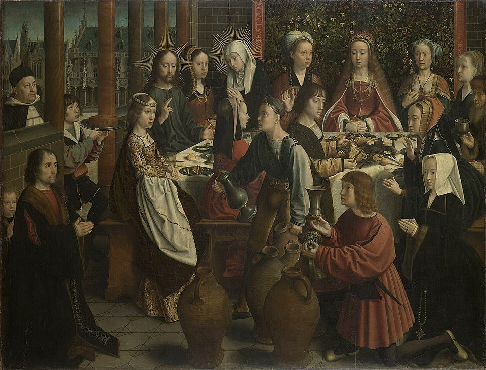](https://upload.wikimedia.org/wikipedia/commons/thumb/7/7f/Gerard_David_-_The_Marriage_at_Cana.jpg/960px-Gerard_David_-_The_Marriage_at_Cana.jpg "Gerard David's c 1500 oil painting 'The Marriage at Cana' in the Louvre depicts Jesus performing his first miracle of turning water into wine")

### Rembrandt's 1633 oil painting 'Christ in the Storm on the Sea of Galilee' dramatically captures Jesus calming the tempest

## October 03, 2025

### The Luminous and Sorrowful Mysteries - Day 276

### AI-Generated Summary: On Certain Mysteries, Luminous and Sorrowful

My dear reader, you have before you a glimpse into that great drama which lies at the heart of things, where the eternal breaks into the temporal. We are shown first a mountain-top, a place set apart, where for a brief and blinding moment the veil is lifted. The Master’s very countenance shines like the sun, and His raiment becomes light itself, while the Law and the Prophets—Moses and Elijah—stand beside Him in witness. This is the Transfiguration, the fourth Luminous Mystery, a promise of the glory that is to come.

Then we are brought to an upper room, to the deep magic of the fifth Luminous Mystery. There, at the final meal, He takes the common stuff of earth, bread and wine, and makes them the vehicle of His very life. He gives His own self, His Body and His Blood, and commands His friends to do this always in remembrance of Him. This is the Institution of the Eucharist, the gift that bridges heaven and earth.

But the path then turns, as it must in any true story, toward a darker wood. We follow Him into a garden, where the weight of all the world’s sorrow seems to press upon a single human soul. In the first Sorrowful Mystery, the Agony in the Garden, He accepts the bitter cup, conforming His will entirely to the Father’s, while those He asked to watch with Him slumber in their humanity.

From that quiet anguish, we are taken to a place of public violence: the second Sorrowful Mystery, the Scourging at the Pillar. Here, the Creator of the stars is bound and stripped, His back offered to the lash of His creatures—a brutal, bloody prelude to the greater sacrifice that was to complete the whole symphony.

### 'The Transfiguration' depicts Jesus radiant in divine light before His disciples, with Moses and Elijah appearing, located in Vienna's Votive Church

### Juan de Juanes' 1562 Spanish Renaissance painting 'The Last Supper' in the Prado depicts Christ instituting the Eucharist

### Alessandro Maganza's c 1590-1610 oil painting 'The Prayer of Jesus in Gethsemane' in Vicenza Cathedral depicts Christ's spiritual agony while His disciples sleep (Stock Image)

[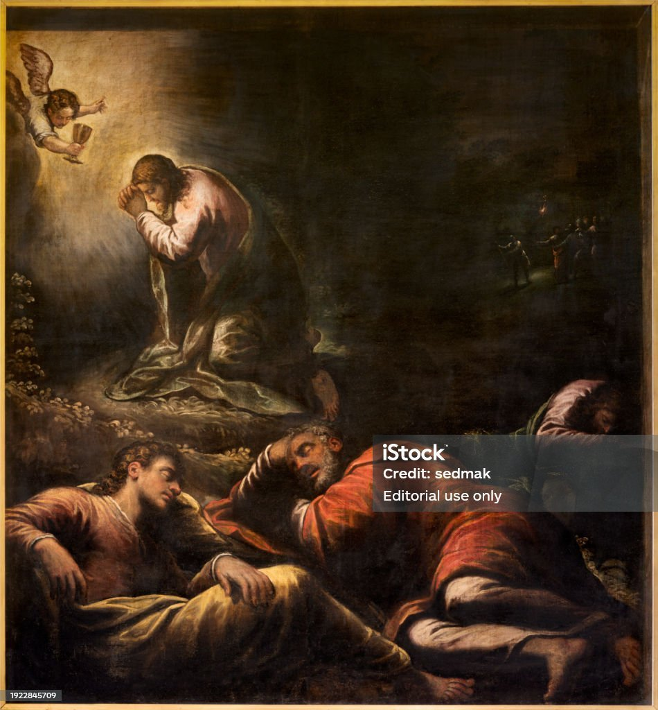](https://www.istockphoto.com/photo/vicenza-the-painting-of-prayer-of-jesus-in-gethsemane-garden-in-the-cathedral-by-gm1922845709-555481794 "Alessandro Maganza's c 1590-1610 oil painting 'The Prayer of Jesus in Gethsemane' in Vicenza Cathedral depicts Christ's spiritual agony while His disciples sleep")

### Caravaggio's 1607 Baroque masterpiece 'The Flagellation of Christ' in Naples depicts Christ's brutal scourging by Roman soldiers

## October 04, 2025

### The Sorrowful and Glorious Mysteries - Day 277

### AI-Generated Summary: On the Unspoken Movement From Sorrow to Glory in the Recitation of Prayers

My dear reader, one observes in this progression a most profound truth, that the soul moves through the Sorrowful Mysteries—the Crowning with Thorns, the Carrying of the Cross, and the final agony of the Crucifixion—as through a dark valley. Yet it does not remain there, for the path leads directly and without pause to the first Glorious Mystery, the Resurrection. This is no mere sequence of events, but a divine logic; it is the necessary passage from the weight of the world's suffering to the unassailable joy that follows, a single, great story of descent and glorious ascent written into the very bones of our devotions. The rest, the multitude of repeated prayers, are but the footsteps along that road, the quiet, persistent rhythm of a heart travelling from death into life.

### Attributed to Caravaggio's 'Ecce Homo' (c 1605), an oil painting of Christ crowned with thorns presented to the people

, an oil painting of Christ crowned with thorns presented to the people")

### Pieter Bruegel the Elder's 1564 oil painting 'The Procession to Calvary' depicts Christ carrying the cross through an indifferent crowd

### James Tissot's 1886-1894 gouache 'What Our Lord Saw from the Cross' depicts the Crucifixion from Christ's unique perspective, held at the Brooklyn Museum

[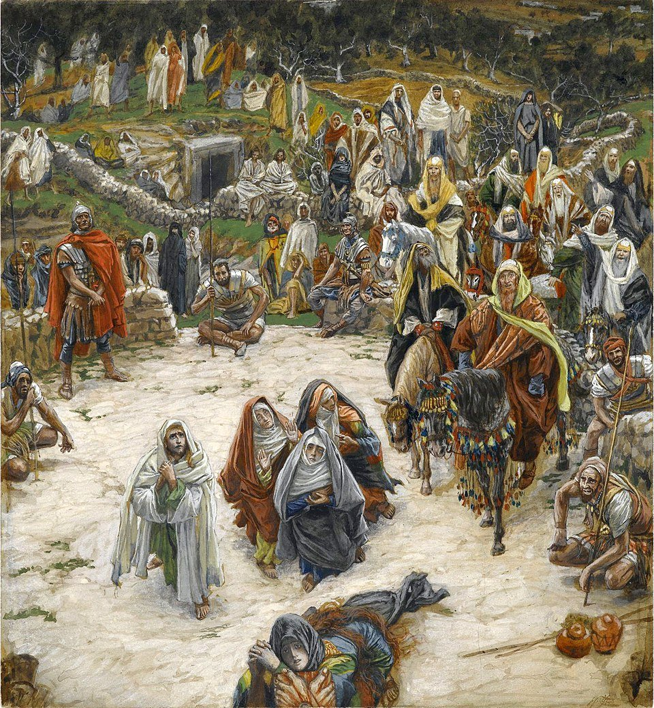](https://upload.wikimedia.org/wikipedia/commons/thumb/f/f9/Brooklyn_Museum_-_What_Our_Lord_Saw_from_the_Cross_%28Ce_que_voyait_Notre-Seigneur_sur_la_Croix%29_-_James_Tissot.jpg/960px-Brooklyn_Museum_-_What_Our_Lord_Saw_from_the_Cross_%28Ce_que_voyait_Notre-Seigneur_sur_la_Croix%29_-_James_Tissot.jpg "James Tissot's 1886-1894 gouache 'What Our Lord Saw from the Cross' depicts the Crucifixion from Christ's unique perspective, held at the Brooklyn Museum")

### Caravaggio's 1601-1602 'The Incredulity of Saint Thomas' depicts the apostle verifying Christ's resurrection by touching His wounds, housed at Sanssouci Palace

## October 05, 2025

### The Glorious Mysteries - Day 278

### AI-Generated Summary: On the Recurring Invocation That Forms the Heart of Common Prayer

My dear reader, you have stumbled upon what might appear to the modern mind as a barren field—a landscape of repetition, where the same words are turned over and over like smooth stones in the hand. There is no grand narrative here, no detailed iconography of saints or mysteries, only the simple, sturdy framework of prayer itself. It is the Hail Mary, the Our Father, the Glory Be, repeated not as empty incantations but as the very steps of a well-trodden path, a ladder of petition and praise. One finds mention of the Glorious Mysteries—the Ascension, the Descent of the Spirit, the Assumption and Coronation of Our Lady—but they are named only as signposts along the way, their profound depths left for the pray-er to contemplate in silence. The whole concludes not with a theological treatise, but with a common, human gratitude for fellowship in the act, and a hope to continue the journey on the morrow. For it is in such patient recurrence that the heart, often so stubborn, may at last learn its way home.

### Byzantine mosaicists' 12th-century mosaic 'The Ascension' in St Mark's Basilica depicts Christ rising to heaven amid angels, with the Virgin Mary and astonished apostles below

[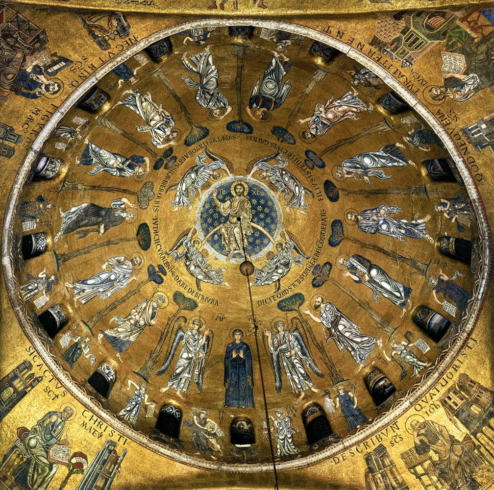](https://www.wga.hu/art/zgothic/mosaics/6sanmarc/2cucros1.jpg "Byzantine mosaicists' 12th-century mosaic 'The Ascension' in St Mark's Basilica depicts Christ rising to heaven amid angels, with the Virgin Mary and astonished apostles below")

### Simone Peterzano's 1580 Mannerist 'Pentecost' in Milan depicts the Holy Spirit descending upon Mary and the apostles (Stock Image)

### Cesare Mariani's 1863 fresco 'Assumption of the Virgin with Vision of St Bonaventure' in Rome depicts the Virgin Mary's bodily ascent into heaven

### Giuseppe Mattia Borgnis's 18th-century Baroque fresco 'Coronation of the Virgin' depicts Mary being crowned Queen of Heaven (Stock Image)

[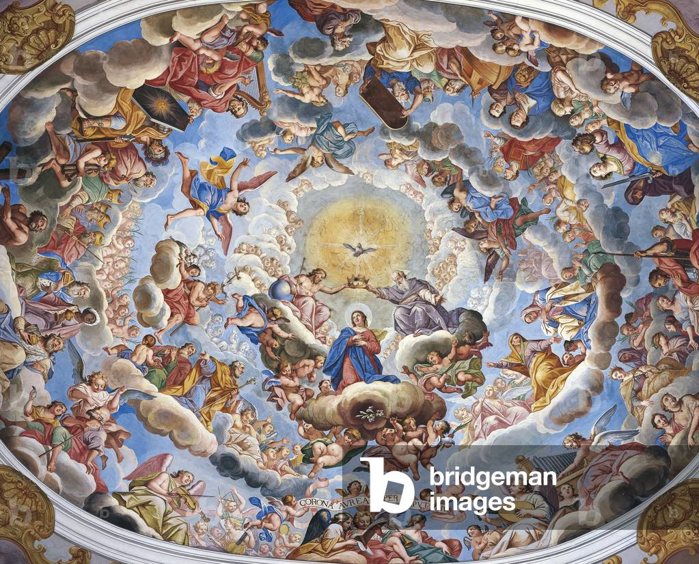](https://images-cdn.bridgemanimages.com/api/1.0/image/600wm.XXX.8926670.7055475/763119.jpg "Giuseppe Mattia Borgnis's 18th-century Baroque fresco 'Coronation of the Virgin' depicts Mary being crowned Queen of Heaven")

## October 06, 2025

### The Joyful Mysteries - Day 279

### AI-Generated Summary: On the First Four Joyful Mysteries and the Curious Absence of Substantive Matter

My dear reader, one approaches these mysteries as a traveler might approach a great house, expecting to find within its rooms some furniture of the soul, some pictures upon the walls to instruct and delight. We are told of the Annunciation, where eternity broke into time through a maiden's consent; of the Visitation, where kinship and prophecy met in a hill country; of the Nativity, where the world's true King lay in a trough of hay; and of the Presentation, where an old man's arms at last held the consolation of Israel.

Yet when we enter, we find the rooms strangely bare. The prayers are repeated like familiar steps down an empty corridor, but the pictures—the artworks that might show us the angel's posture or the stable's light or the temple's ancient stones—are nowhere described. We have the names of these great events, like titles on vacant frames, but the colours and forms that make them real to our imagination have been withheld. It is as if we were given the chapter headings of a most profound story, but the pages between remain curiously, persistently blank.

### Jan van Eyck's 1434-1436 oil panel 'The Annunciation' at the National Gallery of Art depicts Gabriel announcing to Mary that she will bear God's Son

### 'The Visitation' depicts Mary and Elizabeth's sacred encounter in Ein Karem, where both women recognize God's miraculous work through their unborn children

### Caravaggio's 1600 Baroque masterpiece 'Nativity with St Francis and St Lawrence' depicts Christ's birth with dramatic chiaroscuro, though the original oil painting was stolen in 1969

### Giulio Campi's fresco 'The Presentation of Jesus in the Temple' in Cremona depicts Mary and Joseph presenting the infant Christ to Simeon (Stock Image)

## October 07, 2025

### The Joyful and Luminous Mysteries - Day 280

### AI-Generated Summary: On the Finding in the Temple and Those First Great Shining Mysteries Wherein the Divine Light Broke Upon the World

It is a curious thing that we should find the Divine Boy not among the pots and pans of the kitchen, nor at play in the streets, but seated among the learned doctors in the Temple, both hearing them and asking questions. His mother’s gentle rebuke was met with that first mysterious declaration of a higher allegiance, a work that was His Father’s.

Then came the great Shining Mysteries, those moments when the Light Himself stepped from the quiet years into the public eye. First, in the waters of the Jordan, where the sinless One was baptized among sinners, and the voice of the Father thundered approval while the Spirit, in the form of a dove, descended. Next, at a wedding in Cana, where a mother’s quiet plea moved the Maker of the vine to turn water into wine, a plain hint of glory tucked into a domestic crisis. And then, the Proclamation: a call went out across the land for all to turn from their own ways and believe the Good News that the Kingdom of God, so long waited for, had at last drawn near.

### A 20th-century Byzantine Revival mosaic in Lourdes' Rosary Basilica depicting Mary and Joseph finding the young Jesus teaching in the Temple (Stock Image)

[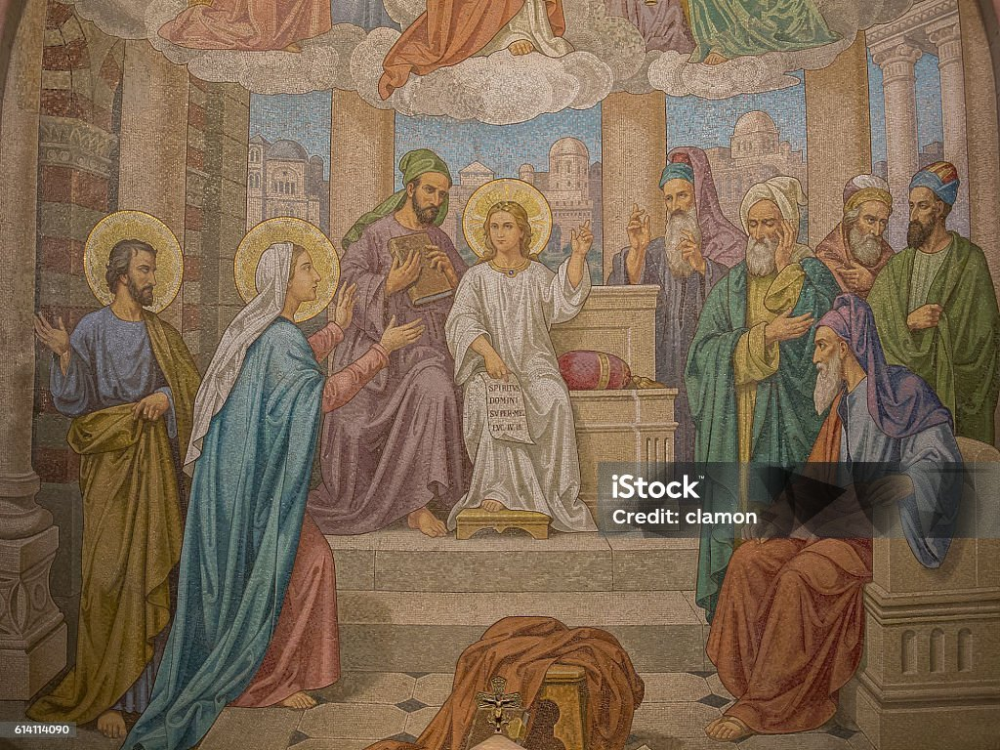](https://thumbs.dreamstime.com/b/mosaic-jesus-lost-found-temple-rosary-basilica-lourdes-78705042.jpg "A 20th-century Byzantine Revival mosaic in Lourdes' Rosary Basilica depicting Mary and Joseph finding the young Jesus teaching in the Temple")

### An unknown Renaissance fresco, 'The Baptism of Christ', depicting Jesus baptized by John the Baptist in the Jordan River with the Holy Spirit descending as a dove, located in Padua's Church of San Benedetto (Stock Image)

### Gerard David's 'The Marriage at Cana' (c 1500), an Early Netherlandish oil painting in the Louvre, depicts Jesus performing his first miracle of turning water into wine

, an Early Netherlandish oil painting in the Louvre, depicts Jesus performing his first miracle of turning water into wine")

### Rembrandt's 1633 oil painting 'Christ in the Storm on the Sea of Galilee' dramatically captures Jesus calming the tempest, demonstrating divine authority over nature

## October 08, 2025

### The Luminous and Sorrowful Mysteries - Day 281

### AI-Generated Summary: On the Unfolding of Divine Mysteries Through Light and Sorrow in the Rosary

My dear reader, one finds in these mysteries a most curious pattern—first a glimpse of that glory which is our true country, followed by the terrible road by which we must travel to reach it. In the fourth luminous mystery, we are taken up the mountain with Peter, James, and John, where the veil is lifted for a moment and the Master's face shines like the sun itself, His clothes becoming as light. There He stands, talking with Moses and Elijah, as if all of sacred history were gathered on that summit to acknowledge its fulfillment. It is as if He were saying, "This is what I have always been, though you saw only the carpenter's son."

Then comes the fifth mystery, where He gives us not merely a vision to behold but a reality to consume. At that final meal, He takes the common stuff of bread and wine and makes them the very vehicles of His presence—His Body, His Blood—commanding His friends to do this in remembrance. He was planting a seed that would feed nations.

But the vision fades, and the sustenance given, we descend with Him into the shadows of the first sorrowful mystery. Here, in the garden, we see the weight of all our rebellions pressing upon one human heart. In profound distress, He accepts the bitter cup of the Father's will, while those He asked to watch could only sleep. Then follows the second mystery, that brutal stripping and scourging at the pillar—where the same Body, given in love at the supper, is now taken by force and cruelty. It is the same flesh, first offered, then torn; first transfigured in light, then disfigured by sin. One cannot help but see that the love which shines on the mountain is the very same that bleeds at the pillar.

### Theophanes the Greek's 1403 fresco 'The Transfiguration' at the Tretyakov Gallery depicts Christ in divine light with Moses and Elijah

### Juan de Juanes' 1562 Spanish Renaissance masterpiece 'The Last Supper' depicts Christ instituting the Eucharist at the final meal

### Giotto's 1304-1306 fresco in Padua's Scrovegni Chapel captures Judas's treacherous kiss during Christ's arrest in Gethsemane

[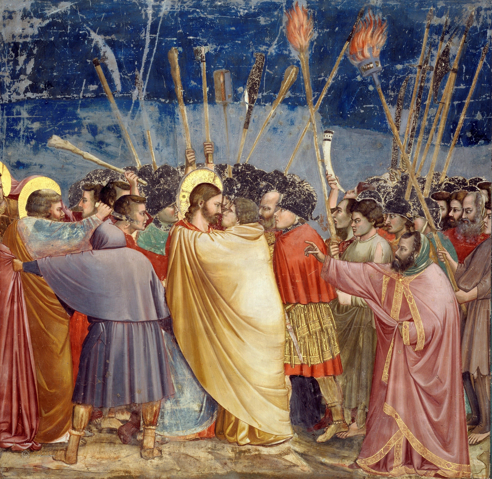](https://upload.wikimedia.org/wikipedia/commons/e/ef/Giotto_-_Scrovegni_-_-31-_-_Kiss_of_Judas.jpg "Giotto's 1304-1306 fresco in Padua's Scrovegni Chapel captures Judas's treacherous kiss during Christ's arrest in Gethsemane")

### Giovanni Antonio Bazzi's 'Christ at the Column' (c 1510-1515), a fresco in Siena's Pinacoteca Nazionale, depicts the bound and wounded Christ during his flagellation

, a fresco in Siena's Pinacoteca Nazionale, depicts the bound and wounded Christ during his flagellation")

## October 09, 2025

### The Sorrowful and Glorious Mysteries - Day 282

### AI-Generated Summary: On the Sorrowful Weight of Thorns and Wood and the Glorious Dawn That Follows

My dear reader, one must imagine the soldiers in the praetorium, not as monsters from a fable, but as ordinary men whose cruelty was the commonplace sort, who fashioned a crown from the bramble—that most unkingly diadem—and pressed it upon a brow that knew no sin. This is the third mystery: the Crowning with Thorns. Then follows the fourth, a spectacle of a different order, where the weight of the Cross is not merely that of timber, but of a world’s transgression borne up a narrow path. The fifth mystery is the thing itself: the Crucifixion, where the Love that made the worlds is nailed to the tree He made. Yet this is not the final word, for the first of the Glorious Mysteries shatters the silence of the tomb—the Resurrection—where Death itself begins to work backwards.

### Caravaggio's 1605 'Ecce Homo' in Genoa depicts Christ crowned with thorns as Pilate presents him to the mocking crowd

[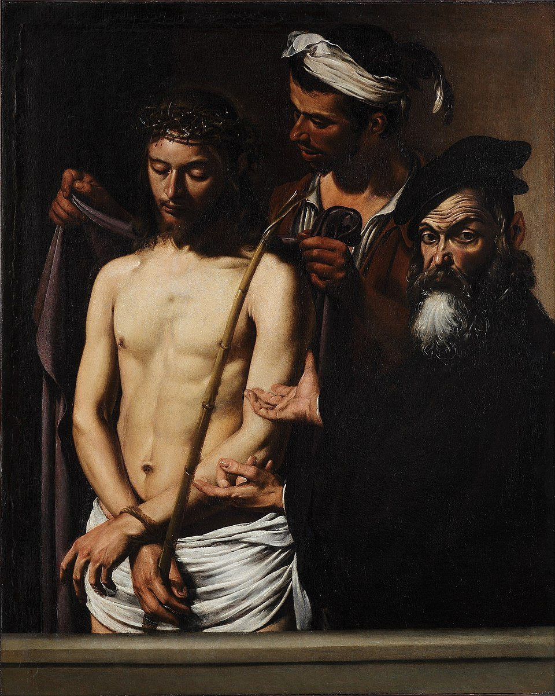](https://upload.wikimedia.org/wikipedia/commons/thumb/e/ed/Caravaggio_%28Michelangelo_Merisi%29_-_Ecce_Homo_-_Google_Art_Project.jpg/960px-Caravaggio_%28Michelangelo_Merisi%29_-_Ecce_Homo_-_Google_Art_Project.jpg "Caravaggio's 1605 'Ecce Homo' in Genoa depicts Christ crowned with thorns as Pilate presents him to the mocking crowd")

### Pieter Bruegel the Elder's 1564 oil painting 'The Procession to Calvary' depicts Christ falling under the cross's weight amidst an indifferent crowd, housed in Vienna's Kunsthistorisches Museum

[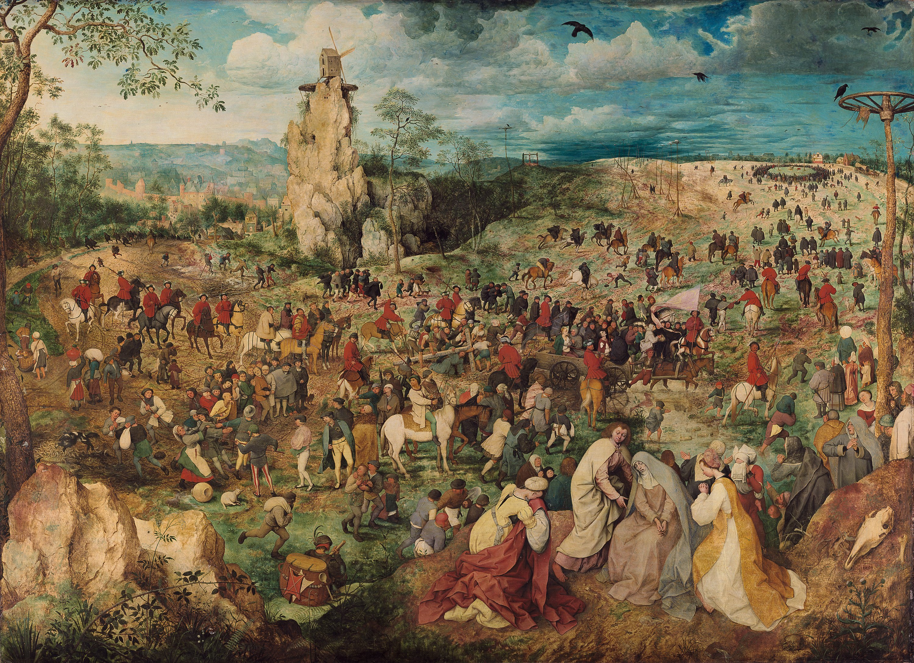](https://upload.wikimedia.org/wikipedia/commons/thumb/4/4e/Pieter_Bruegel_d._%C3%84._007.jpg/960px-Pieter_Bruegel_d._%C3%84._007.jpg "Pieter Bruegel the Elder's 1564 oil painting 'The Procession to Calvary' depicts Christ falling under the cross's weight amidst an indifferent crowd, housed in Vienna's Kunsthistorisches Museum")

### James Tissot's 1886-1894 gouache 'What Our Lord Saw from the Cross' depicts the Crucifixion from Christ's unique perspective, housed at the Brooklyn Museum

### Annibale Carracci's 1593 oil painting 'Resurrection' at the Louvre depicts Christ gloriously emerging from the tomb as Roman soldiers recoil in awe

## October 10, 2025

### The Glorious Mysteries - Day 283

### AI-Generated Summary: On the Consideration of Those Glorious Mysteries Which Complete the Great Story

My dear reader, let us consider the final ascent of the story, that grand progression from the triumph of the Cross to the very gates of eternity. We begin not at the first step, but already at the second, with the Ascension of Our Lord—that moment when the solid, resurrected Body, which had eaten fish with them by the shore, withdrew His visible presence, not as a phantom vanishes, but as a king departs to take his throne, leaving behind the great commission and the promise of a Comforter.

Then comes the Third Mystery, the rushing wind and tongues of flame at Pentecost, where that same Comforter, the Holy Spirit, fell upon the fledgling Church, giving it voice and courage and life, transforming frightened men into the pillars of a new creation.

We then turn to the Fourth, the Assumption of the Blessed Virgin, a singular grace wherein she who was the first to bear Him was herself borne, body and soul, into the glory of heaven, a foretaste and promise of the general resurrection for all her children.

And so the tale finds its fitting conclusion in the Fifth Mystery: the Coronation of Mary as Queen of Heaven and Earth. Here, the humble handmaid is crowned by her Son, the Lion of Judah, and all the court of heaven looks upon this creature, this daughter of Eve, now raised to such unimaginable honour, not for her own sake alone, but as a sign to all souls of the weight of glory that awaits those who hear the word of God and keep it.

### Duccio's 14th-century Gothic panel 'Christ Taking Leave of the Apostles' in tempera on wood depicts Christ's final instructions before his Ascension

### Titian's 1546 oil painting 'Pentecost' in Venice depicts the Holy Spirit descending as fire upon Mary and the apostles

### A 13th-15th century Gothic stained glass window in Burgos Cathedral depicting the Virgin Mary's glorious assumption into heaven, welcomed by Christ (Stock Image)

[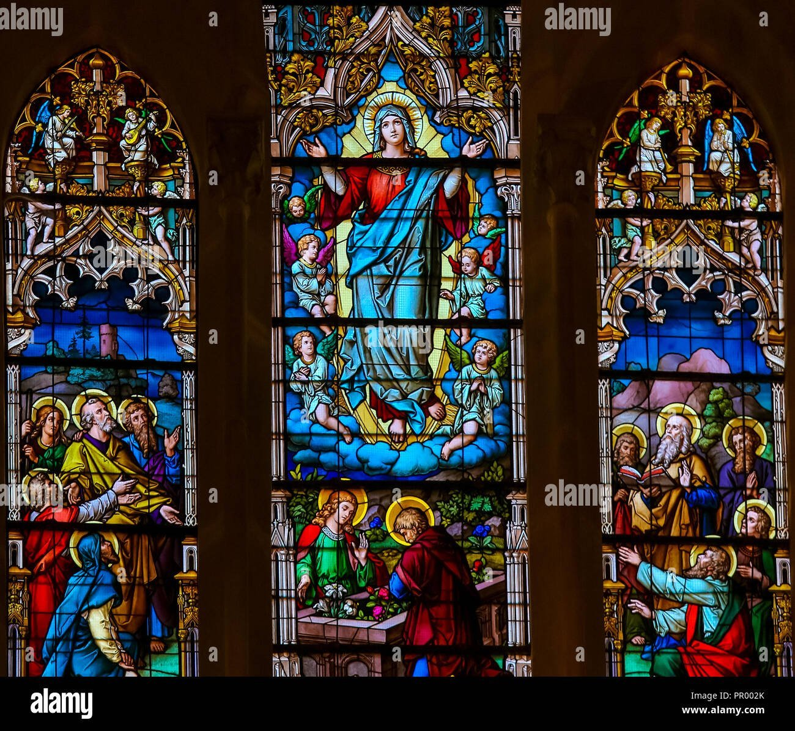](https://c8.alamy.com/comp/PR002K/stained-glass-window-depicting-the-assumption-of-mary-in-the-cathedral-of-burgos-castille-spain-PR002K.jpg "A 13th-15th century Gothic stained glass window in Burgos Cathedral depicting the Virgin Mary's glorious assumption into heaven, welcomed by Christ")

### Giuseppe Mattia Borgnis's Baroque fresco 'Coronation of the Virgin' depicts Mary being crowned Queen of Heaven (Stock Image)

## October 11, 2025

### The Joyful Mysteries - Day 284

### AI-Generated Summary: The Joyful Mysteries as a Window into the Divine Humility That Enters Our World

My dear reader, one must imagine that great inversion whereby the Uncreated Light, without whom no star burns in the void, consented to be lit within the finite vessel of a young woman’s womb. This is the first mystery, the Annunciation, where a maiden’s fiat overturned the cosmic order, not with a legion of angels, but with a single, humble ‘yes’. Then follows the Visitation, where sanctity, still hidden, leaps to greet its herald, and the hillside echoes with a song of how the mighty are unmade and the lowly are filled with good things.

We are then drawn to the poverty of the Nativity, where the King of all breaths His first in the sharp air of a stable, attended not by courtiers but by beasts, showing us that the world’s true wealth lies in its simplest, most vulnerable things. Next comes the Presentation, where the old Law receives its Author, and a sword is foretold to pierce a heart, reminding us that joy and sorrow are often two sides of the same divine coin. Finally, we see the Boy in the Temple, about His Father’s business, a glimpse of the eternal Mind that both questions and answers, and to which all our seeking must one day submit. In these five pictures, we are shown not a distant god, but one who enters the very fabric of our humble, human story.

### Fra Angelico's 'The Annunciation' (mid-1430s), a tempera on panel housed at the Museo del Prado in Madrid, delicately renders the biblical scene where Archangel Gabriel announces to the Virgin Mary that she will bear the Son of God, set within the refined architecture of the Early Renaissance

, a tempera on panel housed at the Museo del Prado in Madrid, delicately renders the biblical scene where Archangel Gabriel announces to the Virgin Mary that she will bear the Son of God, set within the refined architecture of the Early Renaissance")

### 'The Visitation' depicts the sacred moment when Mary, pregnant with Jesus, visits her cousin Elizabeth, who carries John the Baptist Set against the backdrop of the Basilica of the Visitation in Ein Karem, this artwork captures their mutual recognition of God's divine work as Elizabeth feels her child leap with joy, embodying the profound humility and grace of the second Joyful Mystery

### Giovanni Antonio Pellegrini's 18th-century Rococo masterpiece 'The Nativity', rendered in oil on canvas at the Salesianerkirche in Vienna, tenderly depicts the newborn Christ Child illuminated in a humble stable, adored by the Virgin Mary, Saint Joseph, and a host of angels, capturing the profound divine humility of the Incarnation (Stock Image)

### An 18th-century Baroque oil painting by an unknown artist, located in the Church of St Gall in Prague, depicting 'The Presentation of Jesus in the Temple' where Mary and Joseph present the infant Christ to the elderly Simeon, fulfilling the Jewish purification laws with profound solemnity

### This 20th century Byzantine Revival mosaic by an unknown mosaicist, located in the Rosary Basilica at Lourdes, depicts 'The Finding of Jesus in the Temple,' where Mary and Joseph discover the twelve-year-old Christ demonstrating his divine wisdom to the Temple elders (Stock Image)

## October 12, 2025

### The Joyful and Luminous Mysteries - Day 285

### AI-Generated Summary: On the Joyful Discovery in the Temple and Those First Glimpses of Light at the River and the Feast

We are told of that moment every parent dreads and then treasures, when the boy was lost and found again not among kin or caravan, but in His Father’s house, asking and answering questions that hinted at a deeper home. This is the fifth joyful mystery.

Then comes a new dawn, a series of luminous mysteries breaking upon the world. The first is at the river Jordan, where the sinless one is baptized, not because He had any filth to wash away, but to hallow all waters and to bow the divine head in solidarity with our plight. The second is at a wedding in Cana, where water was turned to wine; a quiet, almost secret, beginning of the new creation, where ordinary things are filled with an unlooked-for glory at His mother’s behest. The third is the proclamation itself—the call to see that the old world is dying and a Kingdom is at hand, a summons to turn from shadow and embrace the substance that has come.

### William Holman Hunt's 1860 Pre-Raphaelite masterpiece 'The Finding of the Saviour in the Temple', an oil on canvas housed at the Birmingham Museum and Art Gallery, depicts the profound moment when Mary and Joseph discover their twelve-year-old son Jesus engaged in deep theological discussion with the rabbis, illuminating the fifth Joyful Mystery where the boy reveals His divine mission within His Father's house

[](https://upload.wikimedia.org/wikipedia/commons/thumb/f/f0/William_Holman_Hunt_-_The_Finding_of_the_Saviour_in_the_Temple_-_Google_Art_Project.jpg/1024px-William_Holman_Hunt_-_The_Finding_of_the_Saviour_in_the_Temple_-_Google_Art_Project.jpg "William Holman Hunt's 1860 Pre-Raphaelite masterpiece 'The Finding of the Saviour in the Temple', an oil on canvas housed at the Birmingham Museum and Art Gallery, depicts the profound moment when Mary and Joseph discover their twelve-year-old son Jesus engaged in deep theological discussion with the rabbis, illuminating the fifth Joyful Mystery where the boy reveals His divine mission within His Father's house")

### In 'The Baptism of Christ' (c 1475), a collaborative tempera and oil on wood masterpiece by Andrea del Verrocchio and Leonardo da Vinci, John the Baptist baptizes Jesus in the Jordan River as angels witness and the Holy Spirit descends, housed at the Uffizi Gallery in Florence

, a collaborative tempera and oil on wood masterpiece by Andrea del Verrocchio and Leonardo da Vinci, John the Baptist baptizes Jesus in the Jordan River as angels witness and the Holy Spirit descends, housed at the Uffizi Gallery in Florence")

### Paolo Veronese's magnificent 1563 oil on canvas 'The Wedding at Cana' captures Christ's first miracle at a joyous wedding feast, where water is transformed into wine, a pivotal Luminous Mystery now housed in the Louvre Museum, Paris

### Rembrandt van Rijn's 1633 oil-on-canvas masterpiece 'Christ in the Storm on the Sea of Galilee' dramatically captures the moment Jesus calms the tempest, illustrating His divine authority over nature as His disciples panic around Him, a powerful visual proclamation of God's Kingdom

## October 13, 2025

### The Luminous and Sorrowful Mysteries - Day 286

### AI-Generated Summary: On the Mountain of Glory and in the Garden of Sorrow Where the Divine Light Was Veiled and Blood Was Poured Out

We are shown, my dear reader, a most profound pattern in the divine drama, where glory and sorrow are woven together in a tapestry beyond our full comprehension. First, we ascend the mountain to witness the Transfiguration, where the Master’s hidden glory blazes forth for a moment, a startling glimpse of the reality that clothes Him. From this peak, we are led directly to the upper room, where He performs a greater miracle still, veiling that same glory under the humble forms of bread and wine, instituting the Holy Eucharist as His perpetual presence and sacrifice.

Then, the path turns sharply downward into the shadows of the olive grove. Here, in the Agony of the Garden, the weight of the world’s sorrow presses upon Him, and He who is the source of all life confronts the terror of death. From this spiritual anguish follows the physical reality of the Scourging at the Pillar, where His sacred flesh is torn and His blood is poured out in a dreadful prelude to the final sacrifice.

See how the mysteries speak to one another. The glory on the mountain finds its strange and terrible fulfillment in the suffering of the garden and the pillar. And the blood He first offered in the mystery of the cup in the upper room is, before the night is out, shed physically from His wounded frame. It is a single, seamless act of giving, from the heights of Tabor to the depths of Gethsemane, all for love of us.

### Raphael's 'The Transfiguration' (1516-1520), a High Renaissance tempera on wood masterpiece housed in the Vatican Museums, powerfully depicts Christ's divine Transfiguration on Mount Tabor, where His hidden glory is revealed to the apostles, while simultaneously illustrating the human need for divine intervention in the scene of the possessed boy's healing below

, a High Renaissance tempera on wood masterpiece housed in the Vatican Museums, powerfully depicts Christ's divine Transfiguration on Mount Tabor, where His hidden glory is revealed to the apostles, while simultaneously illustrating the human need for divine intervention in the scene of the possessed boy's healing below")

### Henry Ossawa Tanner's 1900 oil painting 'Christ and the Disciples Before the Last Supper,' from a private collection, intimately portrays Christ in spiritual preparation with his disciples before instituting the Holy Eucharist

### Alessandro Maganza's 'The Prayer of Jesus in Gethsemane' (c 1590-1610), an oil on canvas housed in Vicenza Cathedral, captures the profound spiritual struggle of Christ's Agony in the Garden, where He prays in anguish while His disciples sleep, a pivotal Sorrowful Mystery preceding His Passion (Stock Image)

, an oil on canvas housed in Vicenza Cathedral, captures the profound spiritual struggle of Christ's Agony in the Garden, where He prays in anguish while His disciples sleep, a pivotal Sorrowful Mystery preceding His Passion")

### William-Adolphe Bouguereau's 1880 oil on canvas 'The Flagellation of Our Lord Jesus Christ,' located in the Cathedral of La Rochelle, masterfully depicts the Sorrowful Mystery of the Scourging at the Pillar, capturing Christ's divine resignation as his sacred flesh is torn in a brutal prelude to his ultimate sacrifice

## October 14, 2025

### The Sorrowful and Glorious Mysteries - Day 287

### AI-Generated Summary: On the Profound Transition from Mortal Suffering to Glorious Triumph Within the Holy Rosary

My dear reader, we find ourselves at that most solemn of thresholds where the tale of human suffering, willingly borne, gives way to the divine reversal that mocks all mortal despair. We have passed through the final, bitter stations of sorrow: the cruel mockery of a thorny crown pressed upon the brow of true Kingship, the weary, love-laden journey under the weight of the very tree that would become an altar, and the ultimate sacrifice upon that cross where Life Himself consented to death.

And here, at the very precipice of what seems our final defeat, the story does not end but rather begins anew. For the first Glorious Mystery breaks upon the world not as a gentle dawn, but as a cataclysm of hope—the stone rolled away, the tomb found empty, and the Truth of the universe striding forth, alive, having turned the key in the lock of death from the inside. It is the declaration that the sorrows were not the conclusion, but the necessary prelude to a joy so formidable that it shatters forever the chains of our deepest fears.

### In this powerful Baroque painting 'Ecce Homo' attributed to Caravaggio from c 1605, the suffering Christ is presented to the people wearing the crown of thorns, dramatically capturing the sorrowful mystery of his mockery before the crucifixion

### Raphael's 1516-1517 oil painting 'Christ Falls on the Way to Calvary', housed in Madrid's Museo del Prado, powerfully depicts the fourth Sorrowful Mystery where Christ stumbles under the cross's weight during his journey to Calvary, surrounded by Mary and witnessing crowds that emphasize his human suffering and sacrifice

### James Tissot's 1886-1894 gouache painting 'What Our Lord Saw from the Cross,' housed at the Brooklyn Museum, presents the profound moment of the Crucifixion from Christ's unique perspective, gazing down upon the crowd below in this deeply moving Sorrowful Mystery rendered with striking realism

[](https://upload.wikimedia.org/wikipedia/commons/thumb/f/f9/Brooklyn_Museum_-_What_Our_Lord_Saw_from_the_Cross_%28Ce_que_voyait_Notre-Seigneur_sur_la_Croix%29_-_James_Tissot.jpg/960px-Brooklyn_Museum_-_What_Our_Lord_Saw_from_the_Cross_%28Ce_que_voyait_Notre-Seigneur_sur_la_Croix%29_-_James_Tissot.jpg "James Tissot's 1886-1894 gouache painting 'What Our Lord Saw from the Cross,' housed at the Brooklyn Museum, presents the profound moment of the Crucifixion from Christ's unique perspective, gazing down upon the crowd below in this deeply moving Sorrowful Mystery rendered with striking realism")

### Caravaggio's 1601-1602 Baroque masterpiece 'The Incredulity of Saint Thomas', an oil on canvas housed at Sanssouci Palace in Potsdam, dramatically captures the moment the resurrected Christ invites the doubting apostle Thomas to physically verify His wounds, embodying the glorious mystery of the Resurrection through intense chiaroscuro and raw human emotion

[](https://upload.wikimedia.org/wikipedia/commons/thumb/6/6c/Der_ungl%C3%A4ubige_Thomas_-_Michelangelo_Merisi%2C_named_Caravaggio.jpg/960px-Der_ungl%C3%A4ubige_Thomas_-_Michelangelo_Merisi%2C_named_Caravaggio.jpg "Caravaggio's 1601-1602 Baroque masterpiece 'The Incredulity of Saint Thomas', an oil on canvas housed at Sanssouci Palace in Potsdam, dramatically captures the moment the resurrected Christ invites the doubting apostle Thomas to physically verify His wounds, embodying the glorious mystery of the Resurrection through intense chiaroscuro and raw human emotion")

## October 15, 2025

### The Glorious Mysteries - Day 288

### AI-Generated Summary: On the Consolation of Heavenly Mysteries and the Repetition That Draws Us Nearer

My dear reader, you must not imagine that the value of these repeated prayers lies in their novelty, for we are not seeking new information as a man seeks news from foreign lands. Rather, we are like children who ask the same question of their father, not because they have forgotten the answer, but because they delight in the sound of his voice giving it. The mysteries themselves—the Ascension of our Lord, the fiery descent of the Spirit, the Assumption of His Mother into glory, and her Coronation as Queen—are not mere events to be studied, but realities to be inhabited. They are the very architecture of Heaven, shown to us in glimpses. The soul that perseveres in this humble repetition is not storing up words, but is rather being stored up _by_ them, turned gradually, through this patient exercise, toward the light. It is a training in attention, whereby the heart learns to prefer the substance of eternal things over the shifting shadows of our own cleverness.

### Bernardino Gandino's 'Ascension of the Lord', a Renaissance oil on canvas, masterfully depicts the risen Christ ascending bodily into heaven, an event from the Glorious Mysteries, while His apostles watch in reverent wonder below (Stock Image)

[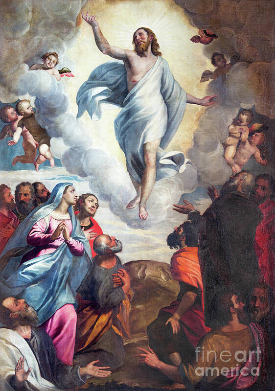](https://render.fineartamerica.com/images/rendered/default/print/5.5/8/break/images/artworkimages/medium/1/the-painting-ascension-of-the-lord-by-bernardino-gandino-jozef-sedmak.jpg "Bernardino Gandino's 'Ascension of the Lord', a Renaissance oil on canvas, masterfully depicts the risen Christ ascending bodily into heaven, an event from the Glorious Mysteries, while His apostles watch in reverent wonder below")

### Titian's 1546 masterpiece 'Pentecost' in oil on canvas, located in Santa Maria della Salute, Venice, dramatically portrays the Holy Spirit descending as tongues of fire upon the Virgin Mary and the apostles, capturing the moment of divine inspiration with High Renaissance grandeur

### In their 1706 Baroque fresco 'The Assumption of the Virgin Mary' in the main cupola of Chiesa di Santa Maria del Orto, Rome, Giuseppe and Andrea Orazi depict the Virgin Mary being assumed body and soul into heaven, rising dynamically amidst a host of angels and putti (Stock Image)

### Giuseppe Mattia Borgnis's 18th-century Baroque fresco, 'Coronation of the Virgin,' masterfully depicts the Virgin Mary being crowned by the Holy Trinity as Queen of Heaven, a glorious culmination of her role in salvation history rendered in the vibrant, dynamic medium of fresco (Stock Image)

## October 16, 2025

### The Joyful Mysteries - Day 289

### AI-Generated Summary: A Consideration of the First Four Joyful Mysteries and the Nature of Prayer Itself

My dear reader, let us consider the matter of these first steps along the path of the Rosary, which are the Joyful Mysteries. We begin, as all true things must, with a beginning: the Annunciation, where a word was spoken to a willing heart and the world was changed forever. This is followed by the Visitation, a journey of charity where sanctity leaps to greet sanctity, and humble service becomes the vessel of prophecy.

We then come to the Nativity, that stark and glorious contradiction where the King of all ages enters His world through a stable door, attended not by courtiers but by beasts and simple men. And from the manger we proceed to the Presentation, where the old law receives its fulfillment and a sword is foretold, a sign that joy itself must be purchased with a coming sorrow.

One finds that the repetition of these prayers, much like the familiar turning of seasons or the daily lighting of a lamp, is not a mere recitation. It is an invitation to attend, to look upon these great truths until they have done their work upon us, enriching the routine of the soul with the weight of glory. It is a journey we are bid to take up again each day, a path that leads ever deeper into a country we thought we knew, but which continually reveals new light.

### Fra Angelico's 'The Annunciation', a tempera on panel housed at the Museo del Prado in Madrid, delicately renders the biblical scene where Archangel Gabriel announces to the Virgin Mary that she will bear the Son of God, set within the refined architecture of the Early Renaissance

, a tempera on panel housed at the Museo del Prado in Madrid, delicately renders the biblical scene where Archangel Gabriel announces to the Virgin Mary that she will bear the Son of God, set within the refined architecture of the Early Renaissance")

### Federico Maldarelli's 1889 oil painting 'The Visitation', located in the Chiesa dei Santi Severino e Sossio in Naples, presents an academic depiction of the Virgin Mary's charitable journey to meet her cousin Elizabeth, a moment where sanctity greets sanctity as both women bear their holy children (Stock Image)

### Giovanni Antonio Pellegrini's 18th-century Rococo masterpiece 'The Nativity', an oil on canvas housed in the Salesianerkirche in Vienna, tenderly depicts the newborn Christ Child in a softly lit stable, adored by the Virgin Mary, Saint Joseph, and a host of celestial angels (Stock Image)

### Giulio Campi's 1547 Mannerist fresco 'The Presentation of Jesus in the Temple' in Chiesa di Santa Rita, Cremona, depicts Mary and Joseph presenting the infant Christ to the aged Simeon, fulfilling Jewish purification rituals as foretold by prophecy (Stock Image)

## October 17, 2025

### The Joyful and Luminous Mysteries - Day 290

### AI-Generated Summary: On the Joyful Discovery in the Temple and the Commencement of Luminous Mysteries That Followed

My dear reader, you must picture a boy of twelve years, not lost but purposefully at work in His Father’s house, discovered there by a mother and foster-father who had sought Him with aching hearts. This, the fifth joyful mystery, reveals that even the Incarnate Word must be about His Father’s business, a truth that startles us with its divine simplicity. Then the narrative makes a curious leap, passing over the long, quiet years in Nazareth—years of humble preparation which the world is not permitted to see—to usher in a new dawn. This is the age of the luminous mysteries, where the hidden Light steps forth into the stream of common life. First, He submits to the baptism in the Jordan, hallowing the waters and receiving a voice from heaven. Next, at a wedding in Cana, He performs the first of His signs, turning water into wine at His mother’s bidding and thus gladdening the hearts of men. And then He begins His great work: the proclamation of the Kingdom and the clear, unyielding call to conversion, an invitation to turn from the shadowlands toward the splendid reality of God’s own reign.

### This 20th century Byzantine Revival mosaic by an unknown mosaicist, located in the Rosary Basilica at Lourdes, depicts 'The Finding of Jesus in the Temple,' where Mary and Joseph discover the twelve-year-old Christ demonstrating his divine wisdom to the Temple elders (Stock Image) - Day 290

### In 'The Baptism of Christ' (c 1475), Andrea del Verrocchio and Leonardo da Vinci masterfully depict John baptizing Jesus in the Jordan River using tempera and oil on wood This Early Renaissance masterpiece, housed in Florence's Uffizi Gallery, captures the moment of divine revelation as the Holy Spirit descends like a dove while witnessing angels observe this sacred initiation of Christ's public ministry - Day 290

, Andrea del Verrocchio and Leonardo da Vinci masterfully depict John baptizing Jesus in the Jordan River using tempera and oil on wood This Early Renaissance masterpiece, housed in Florence's Uffizi Gallery, captures the moment of divine revelation as the Holy Spirit descends like a dove while witnessing angels observe this sacred initiation of Christ's public ministry")

### Gerard David's 'The Marriage at Cana' (c 1500), an Early Netherlandish oil painting housed at the Louvre Museum, masterfully depicts the wedding feast where Jesus performs his first public miracle by transforming water into wine at his mother's request - Day 290

, an Early Netherlandish oil painting housed at the Louvre Museum, masterfully depicts the wedding feast where Jesus performs his first public miracle by transforming water into wine at his mother's request")

### James Tissot's 1894 gouache painting 'Healing of the Lepers at Capernaum' powerfully illustrates Christ's proclamation of God's Kingdom through his compassionate healing ministry, demonstrating divine authority as he restores the afflicted (Stock Image) - Day 290

## October 18, 2025

### The Luminous and Sorrowful Mysteries - Day 291

### AI-Generated Summary: On the Mysteries That Illuminate the Dark Valley and the Suffering That Redeems

We are invited to consider four great turning points in the story that is the true history of the world. First comes the Transfiguration, that sudden rending of the veil, where for a moment the mortal frame of the Master could no longer contain the uncreated Light that He is, and the disciples saw, as we all shall one day see, the world lit by its proper light. From that mountain peak, we are led to the quiet of an upper room, where a greater mystery was enacted; for there, in the simple substances of bread and wine, He instituted the Eucharist, planting a new reality into the very fabric of this fallen world, a nourishment for pilgrims that is Himself.

Then the scene shifts, and the Light allows itself to be swallowed by the dark. We follow Him into the Garden of Gethsemane, where in His Agony we perceive no mere fear of death, but the full weight of the sin of the whole world pressing upon a single human heart, a dreadful cup that He freely consented to drink. And from that solitary anguish, we are taken to the public brutality of the Scourging, where the flesh of the Creator was torn by the hands of His creatures, a terrible picture of the cost of that forgiveness we so carelessly seek. In these things, we see the deep magic at work, where glory is won through sorrow, and life springs from a death willingly embraced.

### In his 1403 Byzantine fresco 'The Transfiguration', located in the Tretyakov Gallery, Moscow, Theophanes the Greek depicts Christ radiating divine light upon the mountain, flanked by the prophets Moses and Elijah as the apostles Peter, James, and John witness this luminous revelation - Day 291

### Henry Ossawa Tanner's 1900 oil painting 'Christ and the Disciples Before the Last Supper' presents an intimate American Realist depiction of Christ in spiritual preparation with his disciples, poignantly capturing the solemn moment before the institution of the Eucharist - Day 291

### Vicente Juan Masip's 'Agony in the Garden' (c 1550), an oil on panel housed at the Museo del Prado, Madrid, depicts Christ kneeling in anguished prayer at Gethsemane as angels present the chalice of suffering, with His sleeping apostles in the foreground and the approaching Judas with soldiers signaling His imminent betrayal - Day 291

, an oil on panel housed at the Museo del Prado, Madrid, depicts Christ kneeling in anguished prayer at Gethsemane as angels present the chalice of suffering, with His sleeping apostles in the foreground and the approaching Judas with soldiers signaling His imminent betrayal")

### William-Adolphe Bouguereau's 1880 oil on canvas 'The Flagellation of Our Lord Jesus Christ,' located in the Cathedral of La Rochelle, masterfully depicts the Sorrowful Mystery of the Scourging at the Pillar, portraying Christ's flesh torn by Roman soldiers with profound divine resignation and academic precision - Day 291

## October 19, 2025

### The Sorrowful and Glorious Mysteries - Day 292

### AI-Generated Summary: On the Passage from Sorrow to Glory Through the Mysteries of the Rosary and the Union of Our Suffering with His

We find ourselves at that great turning of the way, where the sorrows of the King reach their dreadful summit and the glory that lies beyond all sorrows begins to dawn. First, consider that bitter mockery of the Crowning with Thorns, where soldiers, blind to the true royalty before them, clothed Him in purple and pressed that cruel circlet into His brow. Then follows that weary journey under the weight of the Wood, the Carrying of the Cross, a path trod not for His own sins but for ours. And upon the hill of Golgotha, the final mystery of sorrow is revealed in the Crucifixion, where nails and spear accomplished what Love had willed from the foundation of the world.

But this is not the end of the story, for the first Glorious Mystery, the Resurrection, breaks upon the world like a sudden sunrise after a long and terrible night. The tomb could not hold Him, and death itself is undone. Thus we are bidden to take our own small sufferings, our own private calvaries, and by an act of the will, unite them with His great Passion. In so doing, we find that our grief is transformed and taken up into that final, glorious victory which He has won for us.

### Caravaggio's 1605 Baroque masterpiece 'Ecce Homo' in oil on canvas, housed at Palazzo Bianco in Genoa, dramatically captures Pontius Pilate presenting the thorn-crowned Christ to the mocking crowd with the declaration \\Behold the Man,\\ embodying the Sorrowful Mystery of the Crowning with Thorns - Day 292

### Orazio Gentileschi's 1605 Baroque masterpiece 'Christ Carrying the Cross', rendered in oil on canvas, powerfully depicts the exhausted Christ struggling under the weight of the cross on his sorrowful journey to Golgotha, capturing the profound physical and spiritual burden of this pivotal Sorrowful Mystery - Day 292

### James Tissot's 1886-1894 gouache painting 'What Our Lord Saw from the Cross,' housed at the Brooklyn Museum, presents the profound Sorrowful Mystery of the Crucifixion from Christ's unique perspective, gazing down upon the crowd below as He accomplishes the work of redemption through His ultimate sacrifice - Day 292

[](https://upload.wikimedia.org/wikipedia/commons/thumb/f/f9/Brooklyn_Museum_-_What_Our_Lord_Saw_from_the_Cross_%28Ce_que_voyait_Notre-Seigneur_sur_la_Croix%29_-_James_Tissot.jpg/960px-Brooklyn_Museum_-_What_Our_Lord_Saw_from_the_Cross_%28Ce_que_voyait_Notre-Seigneur_sur_la_Croix%29_-_James_Tissot.jpg "James Tissot's 1886-1894 gouache painting 'What Our Lord Saw from the Cross,' housed at the Brooklyn Museum, presents the profound Sorrowful Mystery of the Crucifixion from Christ's unique perspective, gazing down upon the crowd below as He accomplishes the work of redemption through His ultimate sacrifice")

### In his 1593 Baroque masterpiece 'Resurrection', Annibale Carracci captures Christ's glorious emergence from the tomb, holding the resurrection banner as Roman soldiers recoil in awe and holy fear at this triumphant victory over death, now housed in the Louvre Museum, Paris - Day 292

