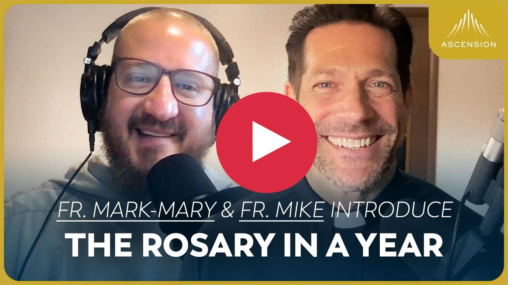
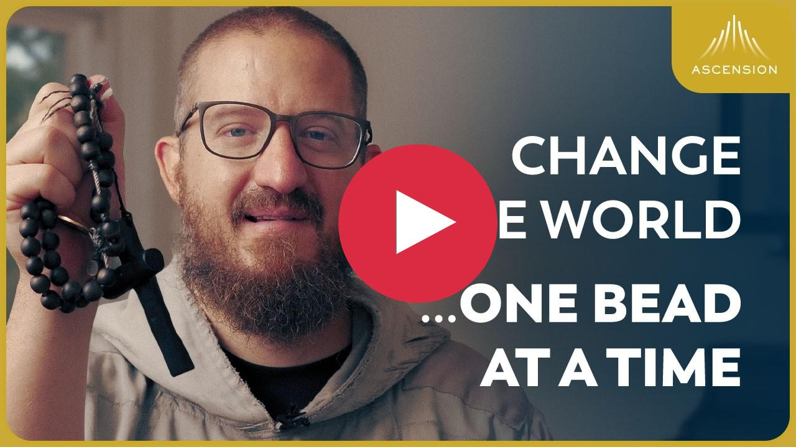
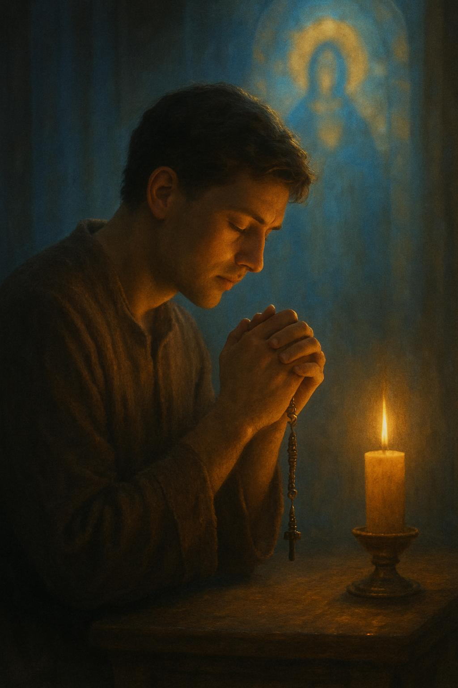
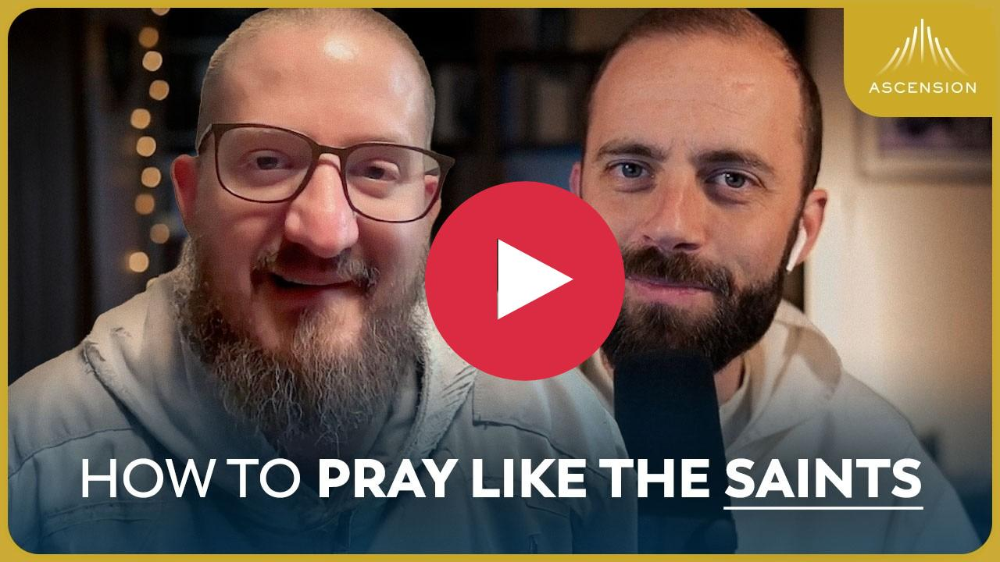
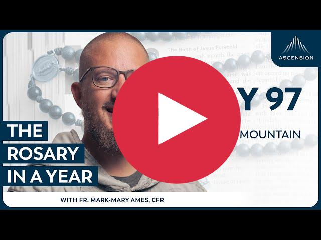
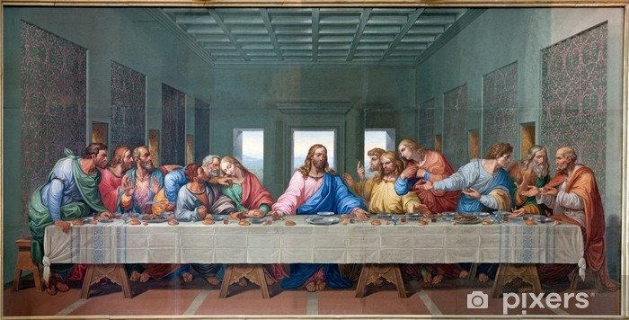
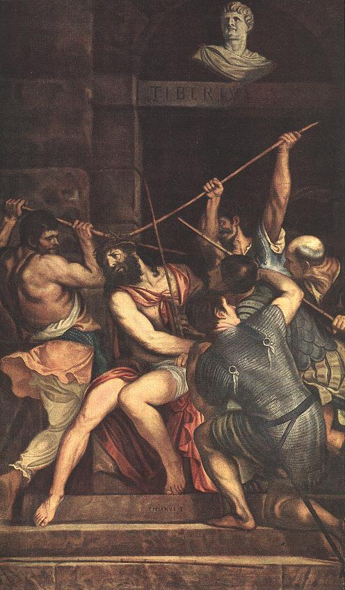
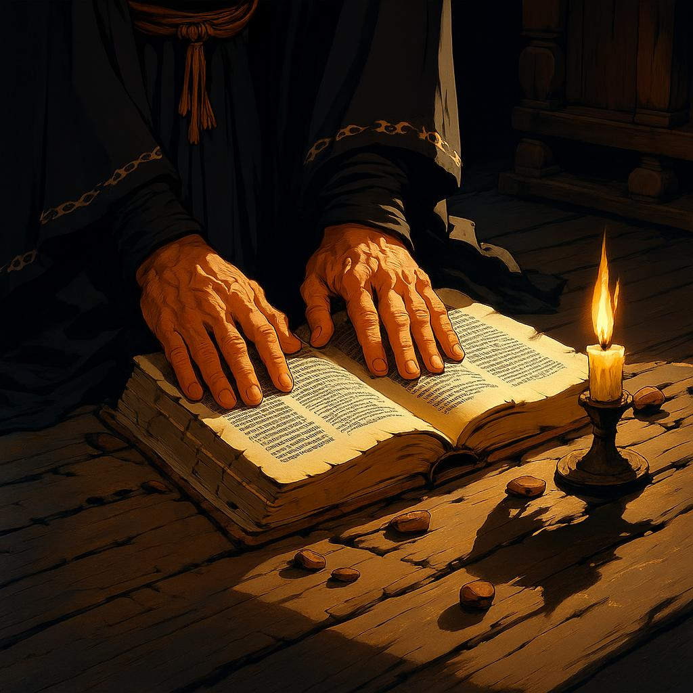

# README

- [RIAY](#rosary-in-a-year-riay)
- [January](#january)
- [February](#february)
- [March](#march)
- [April](#april)
- [May](#may)
- [June](#june)
- [July](#july)
- [August](#august)
- [September](#september)
- [October](#october)
- [November](#november)
- [December](#december)

## Rosary In A Year (RIAY)

<!-- toc -->

- [Rosary In A Year](#rosary-in-a-year)
  - [Rosary In a Year Prayer Plan](#rosary-in-a-year-prayer-plan)
  - [Preparing for Rosary In a Year Podcast](#preparing-for-rosary-in-a-year-podcast)
  - [AI-Generated Summary: A Journey into Deeper Prayer](#ai-generated-summary-a-journey-into-deeper-prayer)
  - [The Rosary Has Changed History—And It Will Again](#the-rosary-has-changed-historyand-it-will-again)
  - [AI-Generated Summary The Rosary A Timeless Weapon](#ai-generated-summary-the-rosary-a-timeless-weapon)
  - [How to Pray the Rosary Like Never Before](#how-to-pray-the-rosary-like-never-before)
  - [AI-Generated Summary: The Pilgrim's Stumble and the Gentle Path](#ai-generated-summary-the-pilgrims-stumble-and-the-gentle-path)
  - [Forming the Relationship](#forming-the-relationship)
  - [AI-Generated Summary: The Practice of the Soul's Conversation](#ai-generated-summary-the-practice-of-the-souls-conversation)
  - [Format for sharing on the WhatsApp group](#format-for-sharing-on-the-whatsapp-group)

<!-- tocstop -->

### Rosary In A Year

#### Rosary In a Year Prayer Plan

[Rosary in a Year Prayer Plan](Rosary_in_a_Year_Prayer_Plan.pdf)

#### Preparing for Rosary In a Year Podcast

")

#### AI-Generated Summary: A Journey into Deeper Prayer

My Dear Readers, we embark together upon a new spiritual expedition, not into uncharted wilderness, but rather a deeper cultivation of ground already prepared. If our previous ventures taught us to break the soil and plant the seeds of faith, this present season calls us to tend the burgeoning garden and delight in its fruits. Though the rich soil of past studies remains fertile for return, our focus now turns to a particular discipline, a venerable method of prayer.

Consider the man who can pray in any season of life; is he not like a dwelling built upon rock, unshaken by tempest? This ancient practice, central to the spiritual lives of saints and simple folk across the ages, has proven its power to renew souls and even the Church itself. Some, mistaking its outward simplicity, might dismiss it, yet it is through this very engagement with Scripture and tradition that we may, as it were, build and inhabit a spiritual basilica.

Imagine constructing such a sacred space within the soul. First, the foundation is laid with intellectual and prayerful understanding, perhaps akin to mastering the catechism. Then, the structure is adorned, filled with the beauty and richness passed down through the ages. But the true purpose is not merely the building or the adornment; it is the _living_ within its hallowed precincts. This is not a single visit, like a tourist's hurried glance, but a constant dwelling, a repeated return to pray, to live, and to draw sustenance from the spiritual treasures held within. It is a practice to be inhabited regularly, like attendance at Mass, embodying Scripture and tradition through continuous discipline.

Approaching this prayer, we find wisdom in focusing deeply on a small part rather than rushing through the whole. It is like a pilgrim resolving to return to a sacred shrine rather than attempting to see every monument at once. Such resolution allows us to relax, to concentrate, and to return again and again, not worrying about what is missed, but rather mining the depths of what is explored. This applies profoundly to the Mysteries of Christ's life; we need not grasp all at once, trusting we may return for ever-deeper understanding.

The journey into these Mysteries unfolds in phases:

- **Forming the Relationship:** Building connection with the Trinity, Jesus, and Mary through foundational prayers.
- **Biblical Roots:** Exploring the scriptural basis of the Mysteries and the prayers themselves.
- **Meditating Deeply:** Dwelling upon the Mysteries through quiet reflection, the wisdom of saints, or sacred art.

From these depths, we gradually build the practice, starting with a single decade, then finding focus, and progressively adding more, until we can pray the entire set, weaving in our meditation. It is vital, even for the experienced, to return to the basics: consciously entering God's presence, asking for aid in prayer.

The aim of this year-long endeavour is not merely to complete a task, but to fall deeply in love – with God and with the very practice that draws us near. Prayer is relationship, and the great temptation is to reduce it to a chore. This journey is an invitation to rediscover that first love, transforming routine into devotion. It is a fruitful path indeed.

We give thanks for your presence on this path and look forward to praying with you.

#### The Rosary Has Changed History—And It Will Again

#### AI-Generated Summary The Rosary A Timeless Weapon

Now, it is a curious thing how often, looking back upon the tangled web of history, one finds moments where the tide seems to turn not merely by the clash of arms or the cunning of statesmen, but by something altogether less tangible. Indeed, one might almost suspect a Hand behind the scenes, moved perhaps by the quiet murmur of prayers.

- Consider, if you will, that great naval encounter at Lepanto in 1571. Here were the forces of Christendom, facing a formidable challenge from the Ottoman Turks – a matter of grave consequence for the future of Europe and, dare one say, for the Faith itself.
- While brave men fought with sword and sail, a vast multitude, far from the spray and smoke, were engaged in another kind of battle. Pope St. Pius V had urged Christians everywhere to take up the Rosary, that simple string of beads guiding one through meditations on Our Lord's life and His Mother's part in it.
- And what happened? A decisive victory for the Christian League, against considerable odds. Those who were there, and those who watched from afar, widely believed this triumph was not solely due to human strength or strategy, but to divine aid, prompted by those countless Rosaries offered up. As a perpetual reminder, a feast day was established, linking this victory forever with devotion to Our Lady.

Now, we too face our own challenges, our own moments when the cause of Christ seems beset. One might feel tempted to despair or simply wait upon events. But the lesson of Lepanto, if it teaches us anything, is that we are not merely spectators.

- Just as some fought and some prayed then, we are called to action now. And for many of us, the most potent action available is prayer, particularly the Rosary.
- It is a means, tried and tested, of focusing our minds and hearts upon the central mysteries of our salvation, drawing us closer to Christ through Mary, and, as history suggests, capable of influencing events in ways we might scarcely comprehend.

So, let us not underestimate the power of this quiet devotion. Let us take up the Rosary, not as a mere pious habit, but as a vital part of our engagement with the world's struggles. For perhaps, just perhaps, the turning of the tide today, as it seems to have done before, awaits the faithful, persistent prayer of God's people. It is a journey we make, little by little, bead by bead, trusting that the Captain of our salvation hears and acts.

#### How to Pray the Rosary Like Never Before

")

#### AI-Generated Summary: The Pilgrim's Stumble and the Gentle Path

It seems a common plight amongst earnest souls is the struggle with prayer, particularly with practices such as the Rosary. One finds it can become a dry, mechanical recitation, a mere counting of beads rather than a true encounter with the Divine. Why is this so?

The text before us points to several pitfalls:

- **The neglect of the heart's connection:** We may fail to dedicate quiet time simply to _be_ with God, turning prayer into a task rather than a relationship.
- **Instruction without illumination:** Often, we are taught the _form_ of the prayer but not its deeper _meaning_ or contemplative spirit, leaving us feeling insecure or the practice hollow.
- **The folly of haste:** We attempt too much too soon, burdening ourselves with expectations that outstrip our present capacity, transforming devotion into a hurried checklist.

This last point is particularly poignant. Like an athlete returning to fundamentals, we must approach spiritual discipline with humility and truthfulness about where we stand. The temptation is to perform, to feel like a 'good Christian' by completing a prescribed amount, rather than seeking to know and love God, and to allow God to love us. This leads to rushing, to a mechanical drone, and ultimately, to a struggle to genuinely cherish the practice.

Yet, there is a path forward, marked by grace and patience:

- **Cultivating Presence:** Taking time to simply breathe and practice the awareness of God's presence, perhaps using imagination to aid connection.
- **Revisiting the Familiar:** Looking anew at common prayers, allowing their profound truths and the mysteries they touch upon to resonate deeply within us.
- **Praying Within One's Strength:** Approaching prayer honestly, doing what we _can_ pray well, with focus and contemplation, rather than what we feel we _should_ be able to do. It is far better to pray a small part mindfully than the whole mechanically.

To aid pilgrims on this journey, a year-long program is announced for 2025. It is structured as a 'prayer exercise plan,' designed to begin gently, teaching the fundamental encounter with God, Jesus, and Mary, and illuminating the deep meaning of the core prayers and mysteries. It aims to build capacity gradually, starting small and slowly increasing, not for the sake of speed, but to cultivate a deeper love for the Lord, for Mary, and for the Rosary as a path to profound relationship. It is a return to the basics, a source of grace for all, whether beginner, struggling soul, or one seeking deeper waters. Progress is made, as in all worthy endeavours, little by little, yet success is assured for those who persevere.

#### Forming the Relationship

#### AI-Generated Summary: The Practice of the Soul's Conversation

Prayer, you see, is not merely a recitation of dutiful phrases, but the very breath and substance of our relationship with the Divine. It is the conversation itself, without which the connection with the Source of all Goodness withers. Like any vital bond, it requires tending and consistency, though its vigour may wax and wane.

My own stumbling path began early, rooted in a Catholic upbringing and my mother's quiet devotion. Yet, it was a stark awareness of my own shortcomings around fifteen or sixteen that truly propelled me towards seeking God in earnest prayer. I found guidance in unexpected places – a borrowed booklet, prayer beads, and a wealth of Catholic materials unearthed at home, all pointing towards a particular practice: the Rosary. This seemed, to a novice, a solid and promising way to begin.

Later confirmations arrived:

- Discovering books like "Secrets of the Rosary" cemented the conviction that this practice was not idle time but a powerful tool for spiritual growth.
- A profound re-conversion, even after seminary and missionary work, underscored its foundational role in my journey.
- Hearing of approved apparitions consistently urging this very prayer revealed it perhaps as a specific, urgent call from God for our times, not merely one option among many.

While many find this practice challenging, and indeed my own devotion has cooled at times, its significance remains. It is not just for personal closeness, but a potent means of interceding for others and responding to the brokenness of the world. It is a channel of grace, even for generations yet to come.

For those seeking to establish this vital habit, remember this simple truth: consistency far outweighs intensity. The goal is not perfect rapture every time, but simply showing up. Like preparing for exercise by merely donning the proper attire, the crucial step is to begin. Often, the act of starting dissolves reluctance and reveals the task to be less daunting than imagined. Just start.

Your effort in seeking this path is commendable, like tending a garden for a shared feast with the Divine. Let us take this step together.

#### Format for sharing on the WhatsApp group

<https://chat.whatsapp.com/EPXBhsE4GzJ0j8YXt98YT1>

Would like to encourage the participants to share their thoughts, it can be one word, one line or a reflection, it doesn't have to be perfect. We the admins will review it before posting so feel free to drop us a note. Let us know how the days readings inspired you.

Please use the below format:

—————————

RIAY

DayXX - Your Name

Your sharing……

—————————

All the WhatsApp groups are closed for 2025, if anyone wants to follow the programs they can subscribe to Ascension Press Podcast, Facebook groups, YouTube channel or on the Ascension Press app.

## January

<!-- START doctoc generated TOC please keep comment here to allow auto update -->

**Table of Contents** _generated with [DocToc](https://github.com/ktechhub/doctoc)_

<!---toc start-->

- [January 2025](#january-2025)
  - [January 01,2025](#january-012025)
    - [Responding to God](#responding-to-god)
    - [ROSARY IN A YEAR DAY 01 Michelle Jackson](#rosary-in-a-year-day-01-michelle-jackson)
    - [AI-Generated Summary: The Sacred Dance of Prayer](#ai-generated-summary-the-sacred-dance-of-prayer)
    - [AI-Generated Image: A sacred dance of prayer, where stillness meets surrender and grace unfolds like a whispered verse](#ai-generated-image-a-sacred-dance-of-prayer-where-stillness-meets-surrender-and-grace-unfolds-like-a-whispered-verse)
  - [January 02,2025](#january-022025)
    - [The King Knows You](#the-king-knows-you)
    - [ROSARY IN A YEAR DAY 02 Michelle Jackson](#rosary-in-a-year-day-02-michelle-jackson)
    - [Day 2 - Michael Eltham](#day-2---michael-eltham)
    - [AI-Generated Summary: Encountering the King in Prayer](#ai-generated-summary-encountering-the-king-in-prayer)
  - [January 03,2025](#january-032025)
    - [Heart of Jesus](#heart-of-jesus)
    - [RIAY Day 3 Heart of Jesus Michael Eltham](#riay-day-3-heart-of-jesus-michael-eltham)
    - [RIAY Day 3 - Marcy](#riay-day-3---marcy)
    - [Rosary IN A YEAR DAY 03- Heart of Jesus Michelle Jackson](#rosary-in-a-year-day-03--heart-of-jesus-michelle-jackson)
    - [RIAY Day 3 - Gavril](#riay-day-3---gavril)
    - [AI-Generated Summary: Finding Peace and Presence in Prayer](#ai-generated-summary-finding-peace-and-presence-in-prayer)
  - [January 04,2025](#january-042025)
    - [Prayer With Mercy](#prayer-with-mercy)
    - [RIAY Day 4/ 04- 01- 2025](#riay-day-4-04--01--2025)
    - [ROSARY IN A YEAR DAY 04 - PRAYER WITH MARY - Michelle Jackson](#rosary-in-a-year-day-04---prayer-with-mary---michelle-jackson)
    - [AI-Generated Summary: Mary as the Mirror of Justice and a Source of Love](#ai-generated-summary-mary-as-the-mirror-of-justice-and-a-source-of-love)
  - [January 05,2025](#january-052025)
    - [A Garden of Rest](#a-garden-of-rest)
    - [ROSARY IN A YEAR DAY 5 - A GARDEN OF REST ( MARY, MOTHER INVIOLATE) Michelle Jackson](#rosary-in-a-year-day-5---a-garden-of-rest--mary-mother-inviolate-michelle-jackson)
    - [AI-Generated Summary: Mary, Mother Inviolate — Finding Peace in Mary's Rose Garden](#ai-generated-summary-mary-mother-inviolate--finding-peace-in-marys-rose-garden)
  - [January 06,2025](#january-062025)
    - [Prayer is a Battle](#prayer-is-a-battle)
    - [ROSARY IN A YEAR DAY 6 - PRAYER IS A BATTLE - Michelle Jackson](#rosary-in-a-year-day-6---prayer-is-a-battle---michelle-jackson)
    - [AI-Generated Summary: The Battle of Prayer](#ai-generated-summary-the-battle-of-prayer)
  - [January 07,2025](#january-072025)
    - [Grace Will Overflow](#grace-will-overflow)
    - [ROSARY IN A YEAR DAY 07 - "GRACE WILL OVERFLOW" - Michelle Jackson](#rosary-in-a-year-day-07---grace-will-overflow---michelle-jackson)
    - [AI-Generated Summary: The Rosary as a Source of Grace](#ai-generated-summary-the-rosary-as-a-source-of-grace)
  - [January 08,2025](#january-082025)
    - [Biblical Roots of the Rosary](#biblical-roots-of-the-rosary)
    - [AI-Generated Summary: Returning Home Through Scripture and Tradition](#ai-generated-summary-returning-home-through-scripture-and-tradition)
      - [Key Takeaways](#key-takeaways)
      - [Memorable Quotes](#memorable-quotes)
    - [Our Father in Heaven](#our-father-in-heaven)
    - [ROSARY IN A YEAR DAY 08 - "OUR FATHER IN HEAVEN" Michelle Jackson](#rosary-in-a-year-day-08---our-father-in-heaven-michelle-jackson)
    - [AI-Generated Summary: Approaching God as Father](#ai-generated-summary-approaching-god-as-father)
  - [January 09,2025](#january-092025)
    - [Thy Will Be Done](#thy-will-be-done)
    - [AI-Generated Summary: Childlike Dependence and Experiencing God's Kingdom](#ai-generated-summary-childlike-dependence-and-experiencing-gods-kingdom)
  - [January 10,2025](#january-102025)
    - [Daily Bread](#daily-bread)
    - [ROSARY IN A YEAR DAY 10 - " DAILY BREAD" Michelle Jackson](#rosary-in-a-year-day-10----daily-bread-michelle-jackson)
    - [AI-Generated Summary: Daily Bread Daily Grace](#ai-generated-summary-daily-bread-daily-grace)
  - [January 11,2025](#january-112025)
    - [As We Forgive](#as-we-forgive)
    - [ROSARY IN A YEAR DAY 11 - "AS WE FORGIVE" Michelle Jackson](#rosary-in-a-year-day-11---as-we-forgive-michelle-jackson)
    - [AI-Generated Summary: The Call to Mirror God's Mercy](#ai-generated-summary-the-call-to-mirror-gods-mercy)
  - [January 12,2025](#january-122025)
    - [Deliver Us From Evil](#deliver-us-from-evil)
    - [ROSARY IN A YEAR DAY 12 - "DELIVER US FROM EVIL" Michelle Jackson](#rosary-in-a-year-day-12---deliver-us-from-evil-michelle-jackson)
    - [AI-Generated Summary: Trusting the Good Shepherd for Deliverance](#ai-generated-summary-trusting-the-good-shepherd-for-deliverance)
  - [January 13,2025](#january-132025)
    - [Full of Grace](#full-of-grace)
    - [ROSARY IN A YEAR DAY 13 - "FULL OF GRACE" Michelle Jackson](#rosary-in-a-year-day-13---full-of-grace-michelle-jackson)
    - [AI-Generated Summary: Understanding the Hail Mary's Greeting](#ai-generated-summary-understanding-the-hail-marys-greeting)
  - [January 14,2025](#january-142025)
    - [Blessed Are You](#blessed-are-you)
    - [Mary](#mary)
    - [ROSARY IN A YEAR DAY 14 - "BLESSED ARE YOU" Michelle Jackson](#rosary-in-a-year-day-14---blessed-are-you-michelle-jackson)
    - [AI-Generated Summary: Praying with Wonder The Visitation and the Hail Mary](#ai-generated-summary-praying-with-wonder-the-visitation-and-the-hail-mary)
  - [January 15,2025](#january-152025)
    - [Mother of God](#mother-of-god)
    - [ROSARY IN A YEAR DAY 15 - "MOTHER OF GOD" Michelle Jackson](#rosary-in-a-year-day-15---mother-of-god-michelle-jackson)
    - [AI-Generated Summary: Mary's Intercession Through Relationship](#ai-generated-summary-marys-intercession-through-relationship)
  - [January 16,2025](#january-162025)
    - [Glorify Him](#glorify-him)
    - [ROSARY IN A YEAR DAY 16 - "GLORIFY HIM" Michelle Jackson](#rosary-in-a-year-day-16---glorify-him-michelle-jackson)
    - [AI-Generated Summary: Understanding the Prayer of Praise](#ai-generated-summary-understanding-the-prayer-of-praise)
  - [January 17,2025](#january-172025)
    - [Turn On The Light](#turn-on-the-light)
    - [ROSARY IN A YEAR DAY 17 - "Turn on the Light" Michelle Jackson](#rosary-in-a-year-day-17---turn-on-the-light-michelle-jackson)
    - [AI-Generated Summary: The Sign of the Cross An Act of Faith in Divine Light](#ai-generated-summary-the-sign-of-the-cross-an-act-of-faith-in-divine-light)
  - [January 18,2025](#january-182025)
    - [Our Sweetness, Our Hope](#our-sweetness-our-hope)
    - [ROSARY IN A YEAR DAY 18 - "OUR SWEETNESS, OUR HOPE" Michelle Jackson](#rosary-in-a-year-day-18---our-sweetness-our-hope-michelle-jackson)
    - [AI-Generated Summary: Reflection on the Hail Holy Queen and God's Gifts of Bread and Wine](#ai-generated-summary-reflection-on-the-hail-holy-queen-and-gods-gifts-of-bread-and-wine)
  - [January 19,2025](#january-192025)
    - [Valley of Tears](#valley-of-tears)
    - [ROSARY IN A YEAR DAY 19 - "VALLEY OF TEARS" Michelle Jackson](#rosary-in-a-year-day-19---valley-of-tears-michelle-jackson)
    - [AI-Generated Summary: The Role of Prayer, Suffering, and Mary's Intercession in Christian Devotion](#ai-generated-summary-the-role-of-prayer-suffering-and-marys-intercession-in-christian-devotion)
  - [January 20,2025](#january-202025)
    - [Eyes of Mercy](#eyes-of-mercy)
    - [ROSARY IN A YEAR DAY 20 - "Eyes of Mercy" Michelle Jackson](#rosary-in-a-year-day-20---eyes-of-mercy-michelle-jackson)
    - [AI-Generated Summary: Embracing Humble Offerings of Love](#ai-generated-summary-embracing-humble-offerings-of-love)
  - [January 21,2025](#january-212025)
    - [Show Unto Us](#show-unto-us)
    - [ROSARY IN A YEAR DAY 21b- "Show unto us" Michelle Jackson](#rosary-in-a-year-day-21b--show-unto-us-michelle-jackson)
    - [AI-Generated Summary: Mary Shows Us Jesus Through Obedience](#ai-generated-summary-mary-shows-us-jesus-through-obedience)
  - [January 22,2025](#january-222025)
    - [Lead Souls to Heaven](#lead-souls-to-heaven)
    - [ROSARY IN A YEAR DAY 22 - "LEAD SOULS TO HEAVEN" Michelle Jackson](#rosary-in-a-year-day-22---lead-souls-to-heaven-michelle-jackson)
    - [AI-Generated Summary: Overview of the Fatima Prayer and Christian Hope](#ai-generated-summary-overview-of-the-fatima-prayer-and-christian-hope)
  - [January 23,2025](#january-232025)
    - [Creator of Heaven and Earth](#creator-of-heaven-and-earth)
    - [ROSARY IN A YEAR DAY 23 - "CREATOR OF HEAVEN AND EARTH" Michelle Jackson](#rosary-in-a-year-day-23---creator-of-heaven-and-earth-michelle-jackson)
    - [AI-Generated Summary: Meditations on the Creator's Power](#ai-generated-summary-meditations-on-the-creators-power)
  - [January 24,2025](#january-242025)
    - [Still, Small Voice](#still-small-voice)
    - [AI-Generated Summary: The Quiet Work of Grace](#ai-generated-summary-the-quiet-work-of-grace)
  - [January 25,2025](#january-252025)
    - [No Longer in Darkness](#no-longer-in-darkness)
    - [AI-Generated Summary: A Franciscan Reflection on Prayer and the Passion](#ai-generated-summary-a-franciscan-reflection-on-prayer-and-the-passion)
  - [January 26,2025](#january-262025)
    - [The Room is Ours](#the-room-is-ours)
    - [AI-Generated Summary: Reflections on Home in the Father's House](#ai-generated-summary-reflections-on-home-in-the-fathers-house)
  - [January 27,2025](#january-272025)
    - [The Spirit Prepares Us](#the-spirit-prepares-us)
    - [AI-Generated Summary: The Spirit's Gentle Work Within](#ai-generated-summary-the-spirits-gentle-work-within)
  - [January 28,2025](#january-282025)
    - [Be Joyful, Be Free](#be-joyful-be-free)
    - [AI-Generated Summary: On Believing You Are Forgiven](#ai-generated-summary-on-believing-you-are-forgiven)
  - [January 29,2025](#january-292025)
    - [Something Unexpected](#something-unexpected)
    - [Rosary in a Year - Day 29 - Joyful Mysteries](#rosary-in-a-year---day-29---joyful-mysteries)
    - [AI-Generated Summary: The Annunciation God's Surprising Arrival](#ai-generated-summary-the-annunciation-gods-surprising-arrival)
  - [January 30,2025](#january-302025)
    - [The New Ark](#the-new-ark)
    - [Rosary in a Year - Day 30 - Joyful Mysteries](#rosary-in-a-year---day-30---joyful-mysteries)
    - [AI-Generated Summary: The Ark New and Old and the Joy of God's Presence](#ai-generated-summary-the-ark-new-and-old-and-the-joy-of-gods-presence)
  - [January 31,2025](#january-312025)
    - [No Other Savior](#no-other-savior)
    - [Rosary in a Year Day 31](#rosary-in-a-year-day-31)
    - [AI-Generated Summary The Unseen King's Arrival](#ai-generated-summary-the-unseen-kings-arrival)

<!---toc end-->

<!-- END doctoc generated TOC please keep comment here to allow auto update -->

### January 2025

RIAY January 2025

#### January 01,2025

##### Responding to God

##### ROSARY IN A YEAR DAY 01 Michelle Jackson

Thank God for this blessing, i love the intro when the evil one accuses us he leaves us hopeless and helpless but when the HolySpirit convicts us of our sin He always leads us to Hope.
What we believe in should change us
Prayer doesn't help our relationship with God, prayer "is" our relationship with God
Our body and soul should connect when we pray
Most importantly it's raising our heart and mind to God by making an act of Faith by which we look at Him who is "always" looking at us, listening to us and loving us\*😢
We need to practice His presence by recognising His presence, He's always there.\*
We need to give our all when we pray it's not one sided it's a relationship, we need to listen after we speak. Thank you Lord for this relationship you give us through prayer🙏

##### AI-Generated Summary: The Sacred Dance of Prayer

To pray is not merely to speak, but to listen; not to perform, but to surrender. Begin as you would with a dear friend—by quieting the restless mind and acknowledging the One who is already near. Let your first act be stillness: a breath, a glance upon sacred art, a whispered verse. For God does not wait beyond some distant gate; He is here, and to raise the heart to Him is but to wake to what is ever true.

Consider the Rosary not as a task to be completed, but as a path to be walked, step by step. Begin with a single decade, as a child learns to walk before he runs. Let each bead be a meeting place where love is given and received. In time, what once felt halting—like the first uncertain steps of a dance—will become a rhythm of grace.

Prayer is, at its heart, an act of faith: to offer up our tangled hopes and hidden fears, and in return, to receive the peace that the world cannot give. Do not be troubled if it feels strange at first. Even the saints began as beginners. Persist, and you will find what all the saints have known—that in the quiet surrender of prayer, the soul is met, held, and transformed by Love Himself.

And so we lift our hearts, not alone, but as children of Mary, who teaches us to say with her, _"Be it done unto me according to Thy word."_ For in the end, prayer is not our work, but His—a gift already given, waiting only to be unwrapped.

##### AI-Generated Image: A sacred dance of prayer, where stillness meets surrender and grace unfolds like a whispered verse

#### January 02,2025

##### The King Knows You

##### ROSARY IN A YEAR DAY 02 Michelle Jackson

_The King knows "you/me"_
_This is so personal for me_
\_The king of the universe knows me even before i was knit in my mother's womb,\* _He knows the very number of hairs on my head,_ _how precious and heart striking it is to know that._ _The King sees me, the King Knows me, the King "Loves" to hear my voice_ ❤‍🔥 _and the King knows my name_ 😍😍
_My God My God how I love Thee. This way of praying having the image of Him in our hearts when we pray is something so precious, we see ourselves and feel so unworthy while all along He looks at us in Love._
_Thank you Jesus._
_i once asked Jesus while at a retreat to call to my name aloud and He did while it was on the last day of the retreat we were all having a JAM dance (Jesus and me) in the midst of all the music and loud noise I heard someone call my name it was clear and soft I asked my husband if he called my name and he said no and I knew it at once it was Jesus who called my name. So yes ,The King knows me/ the King knows you/ the King knows each of us by name_ 😇😢❤‍🔥

##### Day 2 - Michael Eltham

A good pairing to today’s episode “The King knows you” would be to read and ponder on Psalm 139.

LORD, you have probed me, you know me: you know when I sit and stand;
you understand my thoughts from afar.

You sift through my travels and my rest;
with all my ways you are familiar.

Even before a word is on my tongue,
LORD, you know it all.

Behind and before you encircle me
and rest your hand upon me.

Such knowledge is too wonderful for me,
far too lofty for me to reach.

Where can I go from your spirit?
From your presence, where can I flee?

If I ascend to the heavens, you are there;
if I lie down in Sheol, there you are.
If I take the wings of dawn
and dwell beyond the sea,

Even there your hand guides me,
your right hand holds me fast.

If I say, “Surely darkness shall hide me,
and night shall be my light”

Darkness is not dark for you,
and night shines as the day.
Darkness and light are but one.d

You formed my inmost being;
you knit me in my mother’s womb.

I praise you, because I am wonderfully made;
wonderful are your works!

My very self you know.
My bones are not hidden from you,

When I was being made in secret,
fashioned in the depths of the earth.

Your eyes saw me unformed;
in your book all are written down;
my days were shaped, before one came to be.

It is good to simply be held by our Father, to rest in His bosom. Knowing that He is always watching over us and we are precious to Him.

May the Holy Spirit lead us.

##### AI-Generated Summary: Encountering the King in Prayer

This section explores the profound experience of encountering Jesus in prayer, particularly through the lens of the Litany of the Sacred Heart. The speaker initially expresses a past aversion to litanies due to a lack of comprehension regarding the titles attributed to Jesus. However, recent study and contemplation have unveiled the depth and poetic beauty within these titles, leading to a newfound appreciation. A litany, as defined in the segment, is a vocal prayer with a specific focus, incorporating invocations that highlight the titles and attributes of the divine mystery being addressed.

The core of this reflection centers on the invocation "Heart of Jesus, King and Center of All Hearts." The speaker encourages listeners to visualize Christ the King upon his throne, surrounded by angelic hosts, radiating majesty, and holding the world in his hand. He is depicted as omnipotent, the ultimate lawgiver, ruler, and victor. Crucially, and perhaps most importantly, this King knows each individual by name.

To illustrate this point, the speaker recounts a personal anecdote about collaborating with Father Mike Schmitz on video projects for an extended period, despite being geographically separated and having limited direct interaction. The speaker was deeply moved when Father Mike addressed them by name, demonstrating a personal connection despite the lack of close contact. This anecdote serves as a powerful analogy, highlighting that even though Father Mike is a recognizable figure in Catholic media, he is not the literal King of the Universe, unlike Jesus.

This leads to the central theme: Jesus, the Eternal King, possesses an intimate knowledge of each person. He knows our names, formed us in the womb, and even knows the number of hairs on our heads. The speaker emphasizes the importance of envisioning oneself in the King's throne room during prayer, recognizing that He yearns for our presence and focuses intently on us. However, we often allow distractions to our attention – worries, anxieties, our phones, or the lives of others. This is compared to the biblical account of Martha, who busied herself with many things, while Mary chose the better part by sitting at Jesus' feet.

The speaker urges listeners to emulate Mary and choose the better part. This involves approaching the King on his throne, engaging in direct eye contact, and making him the center of our attention. It necessitates recognizing that He sees and knows us completely. We are encouraged to hear Him speak our name, to be attuned to the stirrings within our hearts, and to respond authentically. Sharing our love, needs, and desires with Him is vital because Jesus cherishes the sound of our voices. The message is clear: speak to Him. Maintain Him as the focal point of our hearts, attention, and lives as we pray the Our Father, three Hail Marys, and the Glory Be. The key takeaway is the constant reassurance that the King sees us, knows us, loves to hear our voice, and knows our name.

The segment then transitions into the recitation of the prayers mentioned: the concluding portion of the Lord's Prayer ("Forgive us our trespasses, as we forgive those who trespass against us; and lead us not into temptation, but deliver us from evil. Amen"), followed by three Hail Marys and the Glory Be. The inclusion of these prayers within the segment reinforces the message of actively engaging with Jesus in prayer. The session concludes with a brief expression of gratitude and a farewell.

Notable insights from this segment include the reframing of litanies as poetic expressions of devotion, the powerful analogy of Father Mike Schmitz recognizing the speaker by name, and the emphasis on Jesus' intimate knowledge of each individual. The central message is a call to prioritize our relationship with Jesus, making Him the center of our hearts and lives, and engaging in authentic communication with Him through prayer. The visualization of being present in the King's throne room serves as a powerful tool for fostering this connection and deepening our understanding of His love and attention. The concluding prayers offer a practical application of this message, encouraging listeners to put these principles into practice.

#### January 03,2025

##### Heart of Jesus

##### RIAY Day 3 Heart of Jesus Michael Eltham

Working in corporate America often feels like being caught in a relentless race—striving to be the best, fastest, most accurate, and efficient. The pressure to complete tasks quickly and be the first to market can overshadow the joy and love for the work itself. However, today’s episode of Jesus in St. Joseph’s Workshop was a profound reminder: Jesus has been with me all along, accompanying me in every moment of my work life.

He sees me in my failures, encourages me when I feel like giving up, rejoices in my successes, and prays for me in moments of complacency.

Let us invite Jesus and St. Joseph into our daily work. With their presence, the labor of our hands will be blessed, and even the most mundane tasks will regain their purpose and meaning.

May the Holy Spirit lead us.

##### RIAY Day 3 - Marcy

So grateful for the RIAY.
Being in the workshop with Jesus as my teacher today was just awesome 👌. I was not anxious, nervous or afraid but was excited that now I am really going to get it right. I am not in a hurry, I will be patient, I will do my best to listen and follow the instructions, even when a heavy tool falls on my toe or if I miss the target and bash my fingers 😉, I will dance to the pain till it cools off and will continue trying till I get it right. 🙏

##### Rosary IN A YEAR DAY 03- Heart of Jesus Michelle Jackson

_Jesus who are You?_
_Jesus, What is Your heart like?_
_Jesus, what is Your heart like to me?_
\_Jesus is my safe space, my home, my heaven, my best friend, my hope, my life, my saviour, my EVERYTHING. The very meaning of my life_❤‍🔥
Yes Jesus' heart is full of Patience and Mercy
I see myself like a child in His workshop and inspite of Him giving me instructions i keep interrupting Him and asking if i'm doing well and all i see is He smiles back at me , im in a hurry but He is not, He's full of Love and I feel so safe and free to be myself that even though i'm messing up He's not angry or upset. Im trying to keep up, looking at what He's doing but i don't seem to match n i cry , and just then He tells me His secret, that He loves spending time with me and loves it that i'm spending time with Him. And that's what Mamma told Him, that we need to spend time together.😭❤‍🔥😢 It melts my heart hearing that, i drop the tools and jump onto Him and He embraces me.
This picture within is so real the truth to it all - Jesus and i in His workshop,was not for what i came for but that i came to be with Him and He values that so much.
Jesus values the time we give to Him even though we may not know now or feel it strongly, but we will know it once we enter into that personal relationship with Him ,which He waits for eagerly. Shalom.🙏🏽🏼

##### RIAY Day 3 - Gavril

"Mom wants us to spend time together more than she wants these new candlesticks. In fact, just us spending time together is the greatest gift we can give to her"
This was the most beautiful line in the meditation😢

##### AI-Generated Summary: Finding Peace and Presence in Prayer

Father Mark Mary's reflection centers on experiencing prayer as a personal encounter with Jesus, emphasizing his patient and merciful nature. He guides a meditative visualization of working alongside Jesus in Joseph's workshop, crafting candlesticks for Mary. This exercise encourages listeners to reflect on their emotional response to Jesus's presence, contrasting the stress of striving for perfection with the peace and freedom found in his acceptance.

Key takeaways include:

- **Prayer as Encounter:** Prayer is not about perfect execution but about connecting with the living God, Jesus, who knows and loves each individual.
- **Jesus's Patience and Mercy:** Jesus is depicted as a patient and merciful teacher, understanding of our mistakes and valuing our time with him above all else. His gaze is always patient and merciful.
- **Embracing Imperfection:** It's okay to be imperfect in prayer. Distractions, mistakes, and even falling asleep are acceptable. What matters is praying with love and trust, like a beginner learning from a patient teacher.
- **Focusing on Presence:** Imagining Jesus's presence during prayer, especially the rosary, can deepen the experience and foster awareness of his love and understanding.

Notable insights include the analogy of learning in a woodshop with Jesus, highlighting his willingness to restart projects and provide new materials, emphasizing the importance of the relationship over the task. The speaker also addresses those uncomfortable with closeness to Jesus, encouraging honesty about their feelings. Finally, the emphasis on Mary valuing time spent with Jesus above all else underscores the relational aspect of prayer. The reflection concludes with a guided prayer incorporating the Hail Mary and Glory Be, reinforcing the practical application of these principles.

#### January 04,2025

##### Prayer With Mercy

##### RIAY Day 4/ 04- 01- 2025

_Praying with Mary_
Immaculate Heart of Mary beside the Sacred Heart of Jesus is a picture frame has been in my heart and home for like forever. Yet it took me a minute to focus on a picture of Mother Mary to pray.
Very beautifully reflected upon by Fr... Mary was actively involved in the growth of her Son Jesus in every aspect Mind Body and Spirit, her own beloved Son..and then John her second beloved son...then San Juan " Am I not your mother?" And the list can go on...

God our loving Father I pray today for myself and all Catholics who have taken Our Blessed Mother Mary for granted and for all who have turned their back on her. _may we understand that we cannot and never will be able to love her more than Jesus did_
May we receive grace everyday through her maternal intercession. Amen.
Poco poco Fr Mark. God bless you too. Thankyou. 🙏🏻

##### ROSARY IN A YEAR DAY 04 - PRAYER WITH MARY - Michelle Jackson

The depth of Mamma Mary mirroring the Light of Christ, and the reflection of our God in her, the way Father Mark put that sounded simple but was deep, it calls us to understand that slowly by slowly layer by layer, she mothered what was asked of her she took it all in and did what was asked of her she even went beyond when she took st John to be her son now, what a responsible son Jesus is handing over His beloved Mother to His disciple not wanting her to be alone, and he becomes her son and She his Mother. i believe that they are here with me at home. Greeting Mamma and Jesus when we leave home and return feels like we're never alone. It's a deep relationship, with our Mother who never leaves our side. In the words of Mother Teresa, she asks when we feel low or lonely ask Mamma to be a Mother to me now and knowing she always has and will be, is such a gift from God our Father and Jesus and the Holy Spirit. 🙏🏽Mamma Mary bring all the lost to Jesus. Let those who have never experienced a mother's love feel yours strongly. Amen Shalom

##### AI-Generated Summary: Mary as the Mirror of Justice and a Source of Love

Mary, reflecting Jesus, the "sun of righteousness," is seen as the Mirror of Justice. This reflection explores Mary's role in mirroring God's love, particularly to Jesus and John, and how we can experience this love in our own lives.

**Main Topics:**

- Mary as the Mirror of Justice, reflecting Jesus's light and love.
- Mary's motherly love and its impact on Jesus and John.
- Developing a personal relationship with Mary through prayer.

**Key Takeaways:**

- Mary's unwavering love provided a sense of home and grounding for Jesus, sustaining him throughout his ministry.
- John's acceptance of Mary into his home exemplifies true Marian devotion, fostering a deep, reciprocal relationship.
- Mary's motherly love mirrors God's love, offering comfort, counsel, and a sense of belonging.
- We are invited to cultivate a similar relationship with Mary, experiencing her loving gaze and recognizing our own belovedness in God's eyes.
- Consistent prayer, especially the Rosary, helps maintain this connection with Mary.

**Notable Insights:**

- The analogy of a mother's unwavering love for her son, even amidst teenage angst, illustrates the transformative power of a mother's affirming gaze. This helps us visualize Mary's love for us.
- Mary's active presence in John's life, offering comfort and guidance, emphasizes her role as more than just a passive figure. She actively nurtures and supports those who embrace her.
- The reflection encourages a shift from viewing Mary as a distant figure to experiencing her as a living presence, offering constant companionship and mirroring God's love.

#### January 05,2025

##### A Garden of Rest

##### ROSARY IN A YEAR DAY 5 - A GARDEN OF REST ( MARY, MOTHER INVIOLATE) Michelle Jackson

\_Woaw that was a beautiful Walk, a safe place, a locked garden where the world can't get it. Walking in this garden with Mamma is so beautiful, this is such a big garden with so many varieties of Roses and they are so fragrant, our rosaries are not prayers to be completed but it's a mystical garden, where we speak to mamma tell her how we weary, what burdens we bear, how hard life is and when we feel all discouraged she speaks so warmly so lovingly she says " am I not here? I who am your mother, what more does a child need 😢 so True! So many roses to offer her for Jesus , she takes us along this garden through all those mysteries, and they are so beautiful so deep so meaningful so true something one can experience if one desires it genuinely. With Mary the battle ground of life is transformed into a garden enclosed. I love that. May all who pray the rosary experience its sweetness. Amen, Ave Maria_🌹

##### AI-Generated Summary: Mary, Mother Inviolate — Finding Peace in Mary's Rose Garden

This reflection centers on the Marian title "Mary, Mother Inviolate," exploring its connection to the Song of Songs and the rosary. Key takeaways include understanding Mary's inviolate nature as symbolized by the "locked garden" and "sealed fountain," and experiencing the rosary as a mystical encounter within this garden.

**Main Topics:**

- **Mary, Mother Inviolate:** The meaning of "inviolate" and its scriptural basis in the Song of Songs.
- **The Mystical Rose and the Rosary:** The connection between Mary as the "rose of Sharon," the rosary's etymology ("rosarium," meaning "garden of roses"), and the rosary as a spiritual practice.
- **Finding Peace in Mary's Garden:** The concept of the rosary as a mystical garden offering rest, solace, and freedom from anxiety.

**Key Takeaways:**

- Mary's inviolate nature symbolizes purity and protection.
- The rosary is not just a prayer, but a mystical experience within Mary's garden.
- This garden offers a refuge from worldly anxieties and a path to peace.
- Making the rosary a daily habit transforms the struggles of life into an experience of peace and safety within this metaphorical garden.

**Notable Insights:**

- The imagery of the "locked garden" and "sealed fountain" from the Song of Songs, championed by St. Bernard of Clairvaux, reinforces Mary's purity and holiness.
- The reflection encourages listeners to actively imagine themselves within Mary's garden, enhancing their prayer experience.
- Mary's role is presented as a comforting and protective presence, offering solace and echoing her reassuring words to Juan Diego. The listener is invited to let Mary replace their "heart of stone" with a "heart of flesh."

The reflection emphasizes the transformative power of the rosary, shifting it from a rote prayer to a deeply personal encounter with Mary, leading to peace and spiritual renewal. It encourages listeners to cultivate a daily practice of the rosary to experience this transformative peace.

#### January 06,2025

##### Prayer is a Battle

##### ROSARY IN A YEAR DAY 6 - PRAYER IS A BATTLE - Michelle Jackson

Prayer is a weapon to disarm the evil one, the very thoughts he tempts us with especially when we begin to pray shows clear signs he's always around. As 1 Peter 5:8 says -Like a roaring lion your adversary the devil prowls around, looking for someone to devour. And Ephesians 6: 11&12 says , put on the whole armor of God, that you may be able to stand against the wiles of the devil, for we are not fighting against flesh and blood enemies but against the principalities against powers against the world rulers of this present darkness , against the spiritual wickedness in the heavenly places. (Defeats him).We need grace and God's armor of protection when we pray, we need to ask our Holy Angels to pray with us and keep watch over us when we begin to pray. Prayer changes everything if we allow it to change us, we need to trust and surrender to God when we pray. Prayer is the health of our soul and living on this earth. We need to cooperate with the Holy Spirit when we pray, we pray and need to listen as well, prayer truly wages war on the inside cause we are weak and vulnerable but we need to defeat that by using the Word of God at all times. st. Alphonsus' says "Those who pray are certainly saved, those who do not are damned, !! so deep. May the HolySpirit reawaken in us. Amen

##### AI-Generated Summary: The Battle of Prayer

Prayer is not simply a passive reception of grace, but an active, determined struggle against internal and external forces that seek to separate us from God. The key takeaway is the critical importance of persistent prayer as a spiritual weapon, particularly in our current age of distraction.

**Main Topics:**

- **The Necessity of Effort in Prayer:** Prayer requires deliberate effort and sacrifice, combating our natural inclination toward ease and the temptations that distract us from God.
- **Spiritual Warfare:** Prayer is a battle against spiritual forces that actively oppose our connection with God, primarily by attempting to keep us from prayer itself.
- **The Power of the Rosary:** The rosary is presented as a powerful weapon against our fallen nature and the distractions of the world, strengthening our concentration and enabling us to participate in the larger spiritual battle.
- **The Rosary and Historical Victory:** The Feast of the Most Holy Rosary commemorates the victory at Lepanto, attributed to the rosary, highlighting the tangible impact of prayer on the world.
- **Our Call to Spiritual Battle:** We are called to engage in spiritual warfare through prayer, not only for our own salvation, but for the salvation of the world.

**Key Takeaways:**

- Prayer is essential for spiritual life, like nourishment for the body. Without it, our spiritual lives wither.
- Perseverance in prayer, despite internal resistance and external distractions, is crucial for victory in Christ.
- The rosary serves as a specific tool to strengthen our focus and combat the forces that seek to distract us.
- Our prayers have real power to effect change in the world, as demonstrated by historical examples.

**Notable Insights/Quotes:**

- "Those who pray are saved; those who don't are not." This emphasizes the absolute necessity of prayer for salvation.
- "Like an army cut off from its supplies, we cannot thrive spiritually without prayer." This analogy illustrates the vital role of prayer in sustaining our spiritual lives.
- The focus on the Battle of Lepanto and the Feast of the Most Holy Rosary connects individual prayer to broader historical and spiritual conflicts.
- The encouragement to pray "with radical faith, hope, and confidence" underscores the power and effectiveness of prayer against evil.

#### January 07,2025

##### Grace Will Overflow

##### ROSARY IN A YEAR DAY 07 - "GRACE WILL OVERFLOW" - Michelle Jackson

\_"The Rosary is a source of Grace", as in the words of Mother Teresa - "Not all of us can do great things, but we can all do small things with great love" we may not be heroic in changing the world and setting new records but with prayers have an imoact, prayers can go where we can't. The Rosary truly purifies and sanctifies us and brings us immense graces when we commit ourselves to spend time with Jesus and Mamma Mary. Today will be 7 days i started praying the 4 Rosaries and i must testify the number of graces I receive through them.😢 So many signal graces so many blessings and so much of Joy praying them. Let us commit ourselves to pray the Rosary for our families and the whole world to be sanctified, and that we all come to Jesus through Mary. The world needs grace, the world needs Jesu, and this much we can do by praying the Rosary and offering them through our Lady to Jesus. Nothing is lost when given to God. The sacrifice we make and must make will bring us fruit. Ave Maria_🙏🏽

##### AI-Generated Summary: The Rosary as a Source of Grace

This episode explores the power of the rosary as a conduit of grace for personal transformation and global impact. Building upon previous discussions on prayer and developing a relationship with Mary, it emphasizes Mary's role as a spiritual mother who intercedes on our behalf.

**Key Takeaways:**

- **The rosary is not just a ritual but a powerful spiritual weapon:** It's a source of grace that can "water society," purifying it from negativity and opening it to God, as described by Pope Benedict XVI. This "watering" imagery represents personal sanctification and growth in love for Jesus.
- **Grace overflows:** The graces received through the rosary extend beyond the individual, impacting relationships, families, and the world at large. God works through the rosary, often invisibly, transforming lives.
- **Mary's intercession is vital:** She acts as a conduit, bringing people closer to Jesus. The speaker attributes his profound conversion experience and subsequent vocation as a Franciscan friar and priest to the grace of others praying the rosary during the Year of the Rosary (2002-2003). He views Mary as instrumental in his salvation.
- **The world desperately needs grace:** Many are losing their way, highlighting the urgent need for prayer. Devotion to Christ and fidelity to Mary through the rosary can bring a new flood of grace, salvation, and hope. This requires patience and perseverance, but each day offers the hope that God will answer prayers and bring positive change to the world and the Church.

**Notable Insight:** The speaker's personal testimony powerfully illustrates the transformative power of the rosary. His conversion experience, attributed to the prayers of others, underscores the interconnectedness of prayer and its potential to radically alter life's trajectory.

**Notable Quote:** Pope Benedict XVI's imagery of the rosary's grace "watering society," purifying it and opening it to God, serves as a central metaphor for the episode's theme.

#### January 08,2025

##### Biblical Roots of the Rosary

##### AI-Generated Summary: Returning Home Through Scripture and Tradition

Jeff Cavins shares a powerful testimony of spiritual transformation rooted in Scripture and tradition. Raised in a nominal Catholic environment, his spiritual journey led him to Protestant ministry before rediscovering the Catholic faith through deep engagement with Scripture and Church history. His development of the Bible Timeline chart became a pivotal tool for exploring the overarching narrative of the Bible and reconnecting with Catholic traditions, especially Marian devotion.

###### Key Takeaways

- **Conversion Through Scripture**: Jeff’s rediscovery of the Catholic faith was grounded in his hunger for understanding the “big story” of the Bible. His initial detachment from Marian beliefs stemmed from poor formation, but his study of the early Church and biblical typology led him to embrace them fully.

- **Mary as Queen Mother**: A key turning point was understanding the biblical foundation of Mary’s role. In ancient Near Eastern kingdoms, the queen mother held a position of honor and intercession—fulfilled by Mary in the Kingdom of God. Jesus entrusting Mary to John on the cross is interpreted as a universal gift of spiritual motherhood to all believers.

- **Repetition in Prayer**: Concerns about "vain repetition" in prayers like the Rosary are addressed by distinguishing between empty, performative repetition and meaningful, meditative prayer. Drawing from Church tradition and Scripture, repetition is shown as a rhythm of life—like a heartbeat—central to devotion, not opposed by Jesus.

- **The Rosary as Scriptural and Meditative**: The Rosary draws heavily from the Bible, especially the Hail Mary, which combines the angel Gabriel’s greeting and Elizabeth’s blessing from Luke’s Gospel. It’s a means of walking through the life of Christ with Mary as a guide and intercessor.

- **Spiritual and Practical Application**: The Rosary is praised for its portability and tactile nature—it can be prayed anywhere and serves as a “temple in time.” It’s a prayer that grows in richness with deeper scriptural knowledge, especially when meditating on the mysteries of Christ’s life.

- **Integration of Life and Prayer**: The rhythm of the Rosary mirrors the seasons of human life—joyful, luminous, sorrowful, and glorious. These stages align with family, suffering, and spiritual growth, offering a profound way to journey with God.

###### Memorable Quotes

- _"I had such a hunger for Scripture... but I didn’t know the story."_

- _"When I studied the early Church, I realized everything I was doing couldn’t be found there—but everything they were doing could."_

- _"God is not against repetition—our heartbeat, our breathing, even wisdom in Hebrew is learned by repetition."_

- _"Mary, the Queen Mother, doesn't take away from Jesus. She magnifies Him, as she leads us through His life."_

- _"The Rosary allows us to create a small temple in time—a place of peace and focus wherever we are."_

This testimony highlights how Scripture and Catholic tradition can work together to bring clarity, depth, and renewed faith, especially through the rediscovery of Mary’s biblical role and the power of contemplative prayer.

##### Our Father in Heaven

##### ROSARY IN A YEAR DAY 08 - "OUR FATHER IN HEAVEN" Michelle Jackson

\*God is Good, all the time, and all the Time, God is Good!! How God Loves us is so precious, and that truth needs to take root in us, i love that when Jesus' disciples asked Him how to pray He said; say "OUR FATHER!!" that relationship He extends to us is unfathomable. He wants us to know That He is our Father and Jesus came to reveal that to us, to restore that relationship that was broken in the beginning. He wants us to approach Our Father as little children who don't need to use big words or our language to be perfect but simply, us being like Children who are learning to talk. But with great reverence and adoration. God understands our hearts more than we ever know or the words we want to speak even before we say it. Thank you Yeshua for teaching us to pray and Thank you Abba Father for allowing us to call You "OUR FATHER".\*🙏🏽

##### AI-Generated Summary: Approaching God as Father

This episode initiates the "Biblical Roots of the Rosary" series, focusing on the Our Father. Specifically, it examines "Our Father who art in heaven, hallowed be thy name" through the lens of Genesis 32:13, where Jacob attempts to appease his brother Esau with lavish gifts out of fear. This narrative serves as a counterpoint to the prayer's message.

The key takeaway is that prayer should not be driven by fear or a desire to appease God like Jacob did with Esau. Instead, we should approach God with the reverence due a loving father and the confidence of a beloved child. The speaker uses the analogy of his relationship with his own father, highlighting the difference between formal respect and the easy familiarity of a son. This emphasizes the importance of acknowledging God's power while simultaneously approaching Him with simple humility and trust.

The episode encourages listeners to reflect on their own prayer life, asking: Do you approach God as a loving father or as someone to be feared and appeased? It prompts introspection and a desire to purify one's approach to prayer.

The episode includes the recitation of the Our Father, three Hail Marys, and the Glory Be, reinforcing the practical application of the discussed principles. The core message is a call to cultivate a childlike trust and intimacy with God in prayer.

#### January 09,2025

##### Thy Will Be Done

ROSARY IN A YEAR Day 09 - "THY WILL BE DONE" Michelle Jackson

Mathew 18 :1-4 , Jesus talking about who is the greatest in the kingdom of heaven? It is the children who will be the greatest in His Kingdom. God is calling each of us to be like little children, like children who aren't afraid to ask their parents for anything, they are themselves and they don't need to work on themselves to get things done, they simply approach them in confidence and Joy. Here Jesus calls us to be like them, surrendering themselves to the Father with Child like confidence and Trust. That He will always do what's best for us. We need to be humble like Jesus and do as He did in the garden by saying Thy will be done not mine. In all moments of life when life is challenging and we are uncertain we need to approach God and give way for His Will to be done. Then we will have true peace and Joy and experience the Kingdom of heaven.🙏

##### AI-Generated Summary: Childlike Dependence and Experiencing God's Kingdom

This reflection explores how to live out the prayer "Thy kingdom come, thy will be done on earth as it is in heaven" by embracing the childlike nature Jesus highlighted in Matthew 18.

**Main Topics Discussed:**

1. **The Nature of Children:** Children are presented as inherently "poor" – dependent, lacking knowledge and resources, and vulnerable. Crucially, in a healthy environment, they accept this dependence without shame or frustration, naturally turning to parents for all needs. Despite their neediness, they often exhibit joy and levity.
2. **Childlike Humility as the Key:** This trusting dependence and acceptance of one's limitations ("poverty") is the essential characteristic for entering and experiencing the Kingdom of Heaven.
3. **Experiencing the Kingdom Now:** The Kingdom isn't just a future reality. It is experienced _now_ when we acknowledge our dependence, limitations, and needs, and bring them directly to God the Father without shame, self-hatred, or resorting to anxious self-reliance. This act of trusting dependence meeting God's providence _is_ the Kingdom experience on earth.
4. **Contrast with Adult Tendencies:** Adults often react to their inherent limitations with shame, frustration, and a drive for self-reliance, which hinders experiencing the peace of the Kingdom.
5. **Trusting God's Will:** Praying "Thy will be done" mirrors the childlike trust that the Father knows best, loves us, and will provide what is truly needed, even if we don't know what that is (illustrated by the child-in-restaurant analogy). Jesus models this perfectly in Gethsemane.

**Key Takeaways:**

- True Christian humility involves recognizing and accepting our dependence on God without shame.
- Bringing our acknowledged poverty and need to God in trust is how we experience His Kingdom and its peace _now_.
- We are called to shed the adult burdens of shame and self-reliance regarding our limitations.
- Trusting God's will ("Thy will be done") frees us from anxiety and allows us to live with joy and confidence, like a child secure in their parent's care.

**Notable Insights/Quotes:**

- The core insight: Bringing our dependence to meet God's perfect Providence _is_ the experience of the Kingdom now, and its fruit is peace.
- Children accept dependence "without shame, discouragement, or self-hatred" and are "not tempted towards self-reliance."
- The goal is "childlike trust and dependence, without shame or frustration."
- Jesus' prayer, "Father... not my will but your will be done," exemplifies the trusting relationship we enter through the Our Father.
- The alternative to self-burdening is the "freedom, confidence, joy, and peace that comes from giving our burdens to God... saying, 'Father, thy will be done in all things.'

#### January 10,2025

##### Daily Bread

##### ROSARY IN A YEAR DAY 10 - " DAILY BREAD" Michelle Jackson

Give us this day our daily bread. Jesus wants us to trust Him and asks us not to be anxious about the next day. He tells us we are of more value than the birds of the air and that as He provides for them who neither sow nor reap nor gather them into the barns yet He provides for them. Our God is Jehovah Jireh - "The God who provides" God Himself is our portion. Jesus came so that we may have life in abundance and He wants us to trust Him. We need to persevere in Joy and Faith and go to Him daily in prayer and communion. This bread is the sharing of His own divine life. This grace we receive flows generously from Him but we need to come to Him and receive that daily. Like the Israelites who had to collect their daily bread we too christians have to do the same through prayer. We get to receive Him in the Sacraments the Holy Eucharist which is real bread, Himself! to live the Life He's offering to us. Thank you Jesus for this life giving food you give to us all.

##### AI-Generated Summary: Daily Bread Daily Grace

This theological reflection centers on the petition "Give us this day our daily bread," focusing intently on the word "daily."

**Main Topics Discussed:**

1. **The Manna Narrative (Exodus 16):**

This Old Testament story serves as a foundational illustration. God provided manna to the Israelites in the desert, instructing them to gather only enough for one day. This demonstrated God's reliable, day-by-day provision and taught dependence on Him, showing that everyone received exactly what they needed for that specific day. This event prefigures Jesus.

1. **Jesus' Teaching on Anxiety (Matthew 6):**

The reflection connects the manna story to Jesus' Sermon on the Mount, specifically His command not to be anxious about future needs (like food or drink), pointing to God's care for creation (e.g., birds). 3. **Grace as Spiritual "Daily Bread":**

For Christians, the "daily bread" is interpreted primarily as internal, spiritual nourishment – God's grace. This grace, encompassing faith, hope, and charity, is a share in God's divine life. 4. **The Role of Daily Prayer:**

Accessing this daily grace requires active participation. Personal prayer each day is presented as the means by which individuals approach God to receive the necessary spiritual sustenance.

**Key Takeaways:**

**\*Focus on the Present:**

The core message is to trust God for _today's_ needs and challenges, rather than worrying about the future. God provides what is necessary _for this day._

**Sufficiency of Grace:** God's grace is abundant and sufficient for the present moment's demands – enabling perseverance, carrying one's cross, and living generously and joyfully \*today\*. It's not necessarily stockpiled for future use.

**Active Reception:** Like the Israelites gathering manna daily, Christians must actively seek and receive God's grace each day through personal prayer.

**Jesus as Provision:** Ultimately, Jesus Himself is our "daily bread," the source of the grace needed for the spiritual journey. Trust is placed in God Himself, who is always present.

**Notable Insights:**
The manna story insight: "those who gathered a lot had no excess, and those who gathered little had no lack" highlights the precise sufficiency of God's daily provision.\_ The shift from external manna to internal grace marks the fulfillment found in Christ.

Anxiety about the future is countered by understanding that God provides specifically for \*today\*, requiring a daily return to Him. In essence, the message encourages a life lived in daily dependence on God, accessed through prayer, trusting that He provides the necessary spiritual strength (grace) to navigate each day's challenges and live faithfully in the present moment.

#### January 11,2025

##### As We Forgive

##### ROSARY IN A YEAR DAY 11 - "AS WE FORGIVE" Michelle Jackson

"And forgive us our trespasses, as we forgive those who trespass against us". That truly isn't something we can do by ourselves. We need Grace. God is calling us to share in His Divinity through the Grace we receive through the HolySpirit in Jesus. We are called to do as He does and that comes with a cost, we need to become selfless and die to ourselves to become like Jesus. He took the hardest part the one that got Him killed for us so that we could gain merit through all He did for us. We need Grace and every day we need to seek that from Him. The more we allow ourselves to see and be reminded of the suffering Christ through meditation on His crucifixion the more it should make us aware of what He did for us on the cross. When He said Father forgive them for they do not know what they are doing. He begged God's Mercy on us, and as baptized Christians we are you all called to do that. Forgive as we are forgiven. We are all accountable to God for our actions. Let us remember the highest gift of His love and Mercy through Jesus Christ. 🙏🏻

##### AI-Generated Summary: The Call to Mirror God's Mercy

**Main Topics Discussed:**

**God's Infinite Mercy:**

The core message emphasizes God's boundless, ever-present mercy and forgiveness, freely offered to all who approach Him, regardless of their sins.

**The Christian Obligation to Be Merciful:**

Receiving God's immense forgiveness through Christ compels Christians to extend that same mercy and forgiveness to others.

**The Parable of the Unforgiving Servant (Matthew 18):**

This parable serves as the central illustration, highlighting the hypocrisy and injustice of refusing to forgive small debts (offenses) after having received forgiveness for an enormous debt from God.

**The Nature of True Forgiveness:**

Forgiveness is presented not merely as a human act but as a supernatural one – a "God thing" – requiring divine grace.

**The Process of Forgiveness:**

Forgiveness is often a daily journey, not an instantaneous event, requiring constant reliance on God and prayer.

**Key Takeaways:**

We should never fear approaching God for forgiveness; His mercy is constant and freely given.

Receiving God's mercy comes with the profound responsibility to be merciful and forgiving towards others "from the heart."

Our inability to forgive others is contrasted sharply with the magnitude of God's forgiveness towards us (illustrated by the parable and the nacho anecdote).

True, heartfelt forgiveness requires connecting with God's heart and relying on His grace daily, as human strength alone is insufficient.

Remembering the immensity of God's sacrifice and forgiveness (perhaps by meditating on a crucifix) can help us find the grace to forgive others.

Forgiveness is often a process requiring daily prayer, asking for grace, echoing the Lord's Prayer ("forgive us our trespasses as we forgive those who trespass against us").

**Notable Quotes/Insights:**

God's forgiveness is "constant and ever-new, freely flowing from His heart."

Mercy should "flow freely from our hearts just as it flows from God's."

The unforgiving servant's lord revoking forgiveness underscores the seriousness of our call to forgive.

_The personal nacho anecdote provides a relatable insight into the unexpected difficulty of sharing/showing mercy, even on a small scale._

"True forgiveness is supernatural, a 'God thing,' not merely human."

Forgiveness is often a "journey, not an instant switch," requiring daily reliance on God. The message concludes with prayers (Our Father, Hail Mary, Glory Be) and a blessing, reinforcing the call to immerse oneself in God's mercy and seek His grace to live out this call to forgive

#### January 12,2025

##### Deliver Us From Evil

##### ROSARY IN A YEAR DAY 12 - "DELIVER US FROM EVIL" Michelle Jackson

And lead us not into temptation, but deliver us from evil. The Lord is the Good shepherd who leads His flock, who delivers and protects His flock. He goes in search of His sheep and He lays down His life for His sheep, Such is our God🙌🏼Our God is our deliverer and our only protection. These words in the "our Father" are given by the Father through Jesus to us. He wants us to "TRUST" Him and to know that He alone is the one who can and will save us. We need to meditate and ponder each line in that prayer that reveals the heart of the Father. We need to remind ourselves and renew our thinking each time we are tempted to stress and worry about situations in our lives that are beyond our control. Because Jesus came as the Good shepherd to provide, protect, defend, deliver and save us and that He died for us so that we may live. Thank you Abba Father for the gift of Thyself through Jesus in the HolySpirit.🙏🏽

##### AI-Generated Summary: Trusting the Good Shepherd for Deliverance

This text explores the path to a deeper relationship with God through prayer and meditation, focusing on the petition "Deliver Us from Evil" and the concept of God as the Good Shepherd.

**Main Topics Discussed:**

- **Prayer and Relationship:** Prayer and meditation foster a closer connection with Jesus and Mary, acting as channels for grace.
- **The Good Shepherd:** God, particularly exemplified by Jesus, is portrayed as the Good Shepherd who leads, protects, delivers, sacrifices for, and seeks out His flock. This is contrasted with the original provision in Eden.
- **Origin of Sin:** Sin entered the world through Satan sowing doubt about God's goodness, leading Adam and Eve to distrust and disobey God. The core loss ("paradise lost") was the internal state of trust and harmony with the Creator.
- **Consequences of Sin:** This original sin resulted in an inherited wound of distrust and a tendency towards disobedience.
- **Jesus's Role in Salvation:** Jesus acts as the ultimate Good Shepherd. He seeks the lost, lays down His life (Passion and death) to atone for sins, and reveals the depth of God's goodness and love, thereby healing the core wound of distrust.
- **Restoration and Deliverance:** Trusting in God's revealed goodness is central to spiritual life. This trust provides protection from temptation and deliverance from evil. Through grace, individuals are guided back towards communion with the Father, achieving peace and divine sonship.

**Key Takeaways:**

- The root of sin is distrust in God's fundamental goodness.
- Jesus's life, death, and resurrection demonstrate God's unwavering love and goodness, offering a path to heal distrust.
- Recognizing and meditating on God's goodness is essential for protection against evil and for restoring a right relationship with Him.
- The ultimate spiritual goal is a restored, trusting communion with God the Father.

**Notable Insights:**

- The concept of the "Good Shepherd" encapsulates God's active care, protection, and salvific action.
- The "true paradise lost" wasn't just a place, but the internal state of perfect trust and harmony with God.
- Jesus's Passion is presented as the ultimate proof of God's goodness, aimed directly at healing humanity's core wound of distrust.
- Living in the truth that "God is good and trustworthy" is foundational for spiritual well-being and deliverance.

#### January 13,2025

##### Full of Grace

##### ROSARY IN A YEAR DAY 13 - "FULL OF GRACE" Michelle Jackson

"Hail Mary, full of grace, the Lord is with thee." This greeting given by God to the Angel Gabriel is whole. Mission plan revealed. This greeting is not by the angel but is God's greeting. It's what Mamma Mary is and who He created her to be. It is at this moment He reveals His mission plan to her . The Lord is with thee, these words are so beautiful to ponder on. As in the "Our Father" we are taught how to approach God and in the "Hail Mary" we are taught how to approach Mamma Mary. We Honour Jesus when we honour Mamma Mary. Truly no one can love her as much as Jesus did. He gave His Mother to us and we need to thank Him for that. This prayer, this salutation was a revelation for and to her for the whole world and she said "Yes", let us too ask God what is His mission for us. For surely The Lord is with us always. 🙏🏽Hail Mary full of grace🌹

##### AI-Generated Summary: Understanding the Hail Mary's Greeting

This text explores deepening one's relationship with Jesus and Mary through prayer and meditation, highlighting how this connection becomes a source of grace. The primary focus shifts to the "Hail Mary" prayer, specifically its opening words.

**Main Topics Discussed:**

1. **The Opening of the Hail Mary:** Analysis of "Hail Mary, full of grace, the Lord is with thee."
2. **Origin and Meaning:** These words are traced back to the Angel Gabriel's greeting at the Annunciation, interpreted as God's own greeting to Mary (citing Catechism 2676).
3. **Repetition in Prayer:** Addressing the nature of repeating prayers like the Hail Mary, drawing on Pope John Paul II's perspective.
4. **Application:** How to approach praying these specific words with renewed intention and love.

**Key Takeaways:**

- The initial words of the Hail Mary are considered God's way of teaching us how to approach the Blessed Mother, similar to how the "Our Father" teaches us to approach God the Father.
- The theological depth of the prayer (e.g., "full of grace") is profound; Pope John Paul II's encyclical _Redemptoris Mater_ is recommended for further study.
- Repetition in prayer should not be seen as dry or boring. Instead, it can be an "outpouring of love" where the _feeling_ and _affection_ behind the constant words can be ever fresh and new.
- Praying "Hail Mary, full of grace, the Lord is with thee" is an opportunity to express love, acknowledge Mary's unique grace, ask for grace, and deepen one's relationship with her and Jesus. The focus should be on the loving intention behind the repeated words.

**Notable Quotes/Insights:**

- **Insight:** The opening words of the Hail Mary are God teaching how to approach Mary.
- **Insight (from Pope John Paul II, paraphrased):** Repetition in prayer is not monotony but an outpouring of love that constantly returns to the beloved, with feelings that can always be new even if the words are unchanged.
- **Reference:** Catechism paragraph 2676 supports the idea that God greets Mary through his angel.

The text also mentions the recitation of standard prayers (Our Father, Hail Mary, Glory Be) and concludes with the speaker expressing being moved and looking forward to continuing the spiritual journey. The overall message encourages a mindful, loving approach to the Hail Mary, particularly its opening divine greeting.

#### January 14,2025

##### Blessed Are You

##### Mary

##### ROSARY IN A YEAR DAY 14 - "BLESSED ARE YOU" Michelle Jackson

"Blesses are you among women, and blessed is the fruit of your womb, JESUS". these words found in scripture tell us that Mamma Mary was not like any other woman on the earth. She was God's most unique master piece. Chosen to bear Jesus, God in her womb. When our lady visited elizabeth, she was filled with the HolySpirit at her greeting and she cried out with a shout of Joy. Calling her blessed are you among women and blessed is the fruit of your womb. Mamma Mary is the God bearer and the HolySpirit dwells in her. She gave us Jesus, and we need to ask for that grace to honour her as God did and as Elizabeth did. Lord help us to love and rejoice in the blessed mother as you love and rejoice in her.. and when we pray the Hail Mary may we encounter her in Joy, and be filled with the HolySpirit 😇🙏🏽

##### AI-Generated Summary: Praying with Wonder The Visitation and the Hail Mary

This text explores the spiritual significance of the prayer phrase, "Blessed are you among women, and blessed is the fruit of thy womb, Jesus," urging a deeper, more heartfelt recitation.

**Main Topics Discussed:**

1. **Origin of the Prayer:** The phrase originates from the biblical event of the Visitation (Luke 1:39ff), where the pregnant Mary visits her relative Elizabeth.
2. **The Visitation Context:** Upon hearing Mary's greeting, Elizabeth's unborn child (John the Baptist) leaps, and Elizabeth, filled with the Holy Spirit, proclaims these words.
3. **Mary's Role:** Mary is presented as a powerful conduit of grace. Her greeting communicates the Holy Spirit, and her very presence sanctifyingly communicates Jesus, whom she carries. This highlights God's humility in becoming small enough to be carried by her.
4. **Praying with Meaning:** The reflection contrasts mechanical repetition of the prayer with the way Elizabeth spoke – as a loud, joyous, Spirit-filled cry. It encourages emulating this genuine wonder and awe.

**Key Takeaways:**

- The words "Blessed are you..." are not merely human praise but a profound statement inspired by the Holy Spirit.
- Mary's unique role as the Mother of God makes her presence and greeting exceptionally grace-filled.
- Familiar prayers should be approached with renewed reflection and heartfelt emotion, seeking the grace to pray with genuine awe.
- Deepening one's relationship with Jesus and Mary through prayer and meditation is a source of grace for oneself and the world.

**Notable Quotes/Insights:**

- The central quote: "Blessed are you among women, and blessed is the fruit of thy womb, Jesus."
- Elizabeth's exclamation is described as a "work of the Holy Spirit expressed through a loud, joyous cry."
- An anecdote about a friar's spontaneous shout of wonder at seeing a dolphin illustrates the desired, natural reaction to beauty and awe, suggesting an even greater response is appropriate when contemplating Mary, a "masterpiece of creation."
- The core message invites readers to "ask for the grace to pray them [the words of the Hail Mary] with genuine wonder, awe, and shouts of joy," mirroring Elizabeth's experience.

The original text also includes full recitations of the Our Father (conclusion), Hail Mary, Glory Be, and the Sign of the Cross, framing the reflection within traditional Catholic prayer.

#### January 15,2025

##### Mother of God

##### ROSARY IN A YEAR DAY 15 - "MOTHER OF GOD" Michelle Jackson

"Holy Mary, Mother of God , pray for us Sinners, now and at the hour of our death."So beautifully explained by Fr. Mark Mary, on the role and relationship of going through our Mother to Jesus. To understand that He led us through Scripture in the old testament about Adonijah who knows Queen Bathsheba ,and she knows the King, King Solomon her Son. Who goes with a request, and the Son even before knowing, says "of course I will grant it". If in the natural order things were the way they were so too the supernatural order reflects the natural. Here we know our Blessed Mother and She being the Mother of Jesus goes to Him each time we ask for her help, Jesus listens to her. More than granting our requests about situations we don't seem to understand, for it is our Soul she cares about even more. We entrust ourselves to her and ask her special protection and prayers for us at the hour of our death that is so precious and Jesus WILL grant her that request, because He loves Her and He loves us. 🙏🏽

##### AI-Generated Summary: Mary's Intercession Through Relationship

This text explores how prayer and meditation deepen one's relationship with Jesus and Mary, becoming a source of grace.

**Main Topics Discussed:**

1. **Mary's Role as Intercessor:** The central theme is Mary's unique position and ability to intercede for believers with her Son, Jesus.

2. **The Power of Relationship:** It draws a parallel between influence in earthly relationships ("who you know") and Mary's influence with Jesus due to their mother-son relationship.

3. **Biblical Foundation:** The relationship between King Solomon and his mother Bathsheba (1 Kings 2:19-20) serves as a key illustration.

4. **Confidence in Prayer:** Believers are encouraged to approach Mary confidently with their needs, trusting in her love and intercessory power.

**Key Takeaways:**

- Relationships grant access and influence, a principle observed in both the natural world (e.g., Solomon honoring Bathsheba, everyday analogies like knowing a business owner) and perfected in the spiritual realm with Mary and Jesus.

- Mary, as the Mother of God and Queen of Heaven, holds a special, influential relationship with Jesus.

- As a loving mother to believers, Mary effectively presents their needs and intentions to Jesus.

- The prayer "Holy Mary, Mother of God, pray for us sinners now and at the hour of our death" encapsulates entrusting both present spiritual needs and the grace needed at death to Mary's care.

- Confidence in approaching Mary stems from her unique position and her demonstrated intercession (e.g., the Wedding at Cana).
  **Notable Quotes & Insights:**

- The interaction between Solomon and Bathsheba highlights the principle: Solomon shows great honor and assures her, _"Make your request, my mother, for I will not refuse you,"_ demonstrating the power derived from their relationship _before_ knowing the request.

- A core insight is that the principle of relational influence is **perfected in the spiritual realm** with Mary and Jesus.

- Mary's actions at the Wedding Feast of Cana illustrate her role: noticing the need, bringing it to Jesus, and prompting His action, a dynamic that continues.

- Believers should approach Mary with confidence and gratitude, bringing all needs, especially for perseverance in faith and grace at the hour of death. The text concludes with repeated Catholic prayers (Hail Mary, Glory Be, Sign of the Cross), expressing gratitude and looking forward to continued shared prayer.

#### January 16,2025

##### Glorify Him

##### ROSARY IN A YEAR DAY 16 - "GLORIFY HIM" Michelle Jackson

"Glory be to the Father and to the Son and to the Holy Spirit, as it was in the beginning,is now and ever shall be world without end.Amen". All Praise and Glory be to the Holy Trinity. What is Praise? It is a form of prayer which recognises that God is God. It is right that we praise Him. It is to look to Him always, cause it is the right thing to do. It is for our own Good to Praise God, not for what he does but for who He is. He the maker of all things must be acknowledged by all, and Praised and Glorified by all. God is pleased when we do so not because He needs it,But because its right. When you Love Him and see how Faithful God is in your life you will begin to Praise Him. Cause everyday we are alive and its cause He wills it for us and we take that for granted. Let us Thank Him Throughout the day by asking for that grace

Psalms 34:1

I will bless the LORD at all times : His praise shall continually be in my mouth.\_

Psalms 150:6

Let everything that has breath praise the Lord🙌🏼

##### AI-Generated Summary: Understanding the Prayer of Praise

This text explores the nature of the "Glory Be" prayer, identifying it primarily as a prayer of **praise**.

**Main Topics Discussed:**

1. **The "Glory Be" as Praise:** The prayer is presented as a quintessential example of praise, supported by scriptural references like Psalm 145 ("I will extol you my God and King...") and the Catechism (section 2649).
2. **Definition of Praise:** Praise is defined as the form of prayer that most directly recognizes God _as God_. It is uniquely characterized as "entirely disinterested."
3. **"Disinterested" Praise Explained:** This core concept means praise gives glory to God purely for His own sake – simply because He _is_ – rather than focusing on what He has done for us or what we need from Him.
4. **Contrast with Other Prayer Forms:** Praise is distinguished from:
   - **Contrition:** Focuses on human failings and God's mercy.
   - **Petition:** Focuses on human dependence and needs presented to God.
   - **Thanksgiving:** Focuses on gratitude for God's specific actions.
     In contrast, praise centers solely on God's being.

**Key Takeaways:**

- The highest form of praise is selfless, focusing entirely on God Himself – His nature, goodness, holiness, and beauty.
- This type of prayer involves an "exodus" from self-focus, shifting attention away from personal concerns towards God's inherent glory.
- It is characterized by joy, adoration, and awe directed at God simply because He exists.

**Notable Quotes & Insights:**

- Praise is "entirely disinterested," giving God glory "for His own sake, simply because He _is_."
- It represents a "radically disinterested" act, an "exodus" from self towards God.
- **Analogy:** Like a new father filled with love just looking at his newborn, rejoicing in the child's existence itself, praise rejoices in God's being. It is a prayer of "disinterested love and praise."

The text frames this explanation within invocations to the Trinity and includes recitations of the Our Father, Hail Mary, and Glory Be, reinforcing the practical application of these prayer forms.

#### January 17,2025

##### Turn On The Light

##### ROSARY IN A YEAR DAY 17 - "Turn on the Light" Michelle Jackson

"IN THE NAME OF THE FATHER AND OF THE SON AND OF THE HOLYSPIRIT - THE SIGN OF THE CROSS"
_The mystery of the most Holy Trinity is the central mystery of Christian Faith and life , it is the mystery of God Himself. It also is the source of all other mysteries of Faith, the Light that enlightens them. Truly one needs Faith to understand that. We need to ask the HolySpirit for grace to See which God gives us through Baptism all through our lives. And when we make the sign of the cross we are opening our eyes to see Him, to see all of creation and all other mysteries in His light. Jesus Christ is the Light of the World and we need His light to guide us through, there are many other lights in this world to lead us astray, so to know and see the difference we need to understand the path we are taking if it leads us to Him or away from Him. May Christ' light be our light always. Jesus said whoever follows me shall never walk in darkness._

Hebrew 11:6

And without faith it is impossible to please him, for whoever would approach God must believe that he exists and that he rewards those who seek him.

Romans 10:17

So faith comes from what is heard, and what is heard comes through the word of Christ.

##### AI-Generated Summary: The Sign of the Cross An Act of Faith in Divine Light

Father Mark Mary explains how prayer, specifically the Sign of the Cross, deepens our relationship with Jesus and Mary and acts as a source of grace.

**Main Topics Discussed:**

1. **Theological Foundation:** The teaching draws heavily on Scripture (Matthew 28:19 - baptizing in the Trinity's name; Psalm 36:9 - God as the fountain and source of light) and the Catechism's emphasis on the Holy Trinity as the central mystery and illuminating source of Christian faith.
2. **The Sign of the Cross as Faith in Action:** Making the Sign is presented not merely as a ritual, but as a conscious act of faith. It's likened to opening one's eyes to perceive spiritual reality.
3. **Analogy of Light and Sight:** The Holy Trinity is described as the fundamental "light." The grace of Baptism confers faith, which is likened to spiritual "sight," enabling believers to perceive this divine light.
4. **Perception in God's Light:** Praying "in the name of the Father, Son, and Holy Spirit" isn't about activating God's light (which is always present), but about using our faith (sight) to see _within_ that divine light. This allows a clearer view of God, faith mysteries, Mary, saints, creation, others, and oneself – revealing both inherent dignity and areas needing conversion.
5. **Vulnerability and Growth:** Stepping into this light through the Sign of the Cross is an act of courage and vulnerability. It involves leaving darkness or hiding, allowing God's light to reveal shortcomings but also to warm, purify, enlighten, strengthen, and encourage.

**Key Takeaways:**

- The Sign of the Cross is a powerful invocation of the Trinity and an intentional act of faith.
- Faith, received through Baptism, gives us the spiritual capacity (sight) to perceive God's ever-present light (the Trinity).
- All mysteries of faith are understood through the illuminating light of the Trinity.
- Making the Sign allows us to consciously step into God's light, seeing reality more clearly and opening ourselves to grace, conversion, and deeper participation in divine life.
- This act requires openness and courage, leading to spiritual enrichment and purification.

**Notable Insights:**

- Analogy: Just as masterpieces in a dark basilica need external light to be seen, faith mysteries need the light of the Trinity to be understood.
- Insight: "Praying 'in the name of the Father, and of the Son, and of the Holy Spirit' isn't like turning on God's light... Instead, it's using our capacity, given through faith (likened to sight), to perceive things _in_ God's light."
- Insight: Making the Sign of the Cross is an act of "courage and vulnerability—stepping out of hiding or darkness into God's light."
- Concluding the prayer with the Sign signifies entrusting oneself fully to God's continued light and care.

#### January 18,2025

##### Our Sweetness, Our Hope

##### ROSARY IN A YEAR DAY 18 - "OUR SWEETNESS, OUR HOPE" Michelle Jackson

"Hail Holy Queen, Mother of Mercy, our Sweetness and our Hope", what a beautiful way to put that Father Mark😇, as Jesus provided food for our journey to Eternal life, which is bread( Himself) when He instituted the Holy Eucharist and the wine His blood, which is sweet, and wine that is used to celebrate Joys in life, He adds that sweetness to our lives by giving us His Mother to be our Mother, and she truly gives us Joy when we go through her to Him. The warmth and love of a Mother He gave us all . The Mother of all Mothers. Thank you Yeshua for the gift Thy Mother. You did not hold back anything from us. You gave us Yourself fully, and also your Mother. How much our God loves us. Thank you for being our Mother Mamma Mary 🙏🏻

##### AI-Generated Summary: Reflection on the Hail Holy Queen and God's Gifts of Bread and Wine

**Main Topics:**

1. **Spiritual Nourishment:** The text reflects on the Hail Holy Queen prayer (_Salve Regina_), emphasizing its opening words: _"Hail Holy Queen, Mother of Mercy, our life, our sweetness, and our hope."_
2. **Eucharistic Analogy:** Drawing from Matthew 26, Jesus’ gifts of bread and wine symbolize essential grace (_bread_) and joyful abundance (_wine_).
   - _Bread_: Represents foundational grace for spiritual survival.
   - _Wine_: Symbolizes the "sweetness" of God’s love, enhancing life beyond necessities.
3. **Mary’s Role:** The Blessed Mother is presented as a gift of "wine"—a source of spiritual sweetness and hope, deepening one’s relationship with God.

**Key Takeaways:**

- God provides both essentials (_bread_) and joyful abundance (_wine_) in the spiritual life.
- Mary’s love exemplifies this "sweetness," enriching the journey toward salvation.
- Prayer and meditation (e.g., _Our Father_, _Hail Mary_) are tools to cultivate these relationships.

**Notable Insights:**

- _"God doesn’t just provide the bare minimum ('bread') but also desires to give 'wine'—experiences of sweetness and joy."_
- Mary is described as _"our life, our sweetness, and our hope,"_ highlighting her role in spiritual enrichment.

**Repeated Prayers:**

- _Our Father_, _Hail Mary_, _Glory Be_, and _Sign of the Cross_ are recited, underscoring their importance in devotion.

#### January 19,2025

##### Valley of Tears

##### ROSARY IN A YEAR DAY 19 - "VALLEY OF TEARS" Michelle Jackson

"To thee do we cry poor banished children of Eve, to thee do we send up our sighs mourning and weeping in this valley of tears" . Our Lord who understands our pain and suffering and is always with us. He who died for us and suffered for us comes to comfort and consoles us when we suffer. We are never alone and in our misery, when He was on the cross He gave His beloved disciple His Mother and Her to Him. Our mother who suffered seeing her son betrayed and crucified and experienced extreme sorrow and pain, like the pain of a sword piercing her heart ,that much sorrow she felt and suffered, she understands us when we go through pain and suffering. She comforts and consoles us with Jesus. Our pain is precious to them. When we understand and know the value of pain and suffering we can unite it to the sufferings of Jesus and Mamma Mary to be sanctified and purified by it. We are never alone. Our Lord and Mother understands us when we cry and cannot pray, for our tears become our silent prayers. Thank Yeshua Thank you Mamma for your Love🙏🏽

##### AI-Generated Summary: The Role of Prayer, Suffering, and Mary's Intercession in Christian Devotion

**Main Topics:**

1. **Prayer and Meditation:** Deepening one's relationship with Jesus and Mary through prayer, emphasizing their roles as sources of grace.

2. **Mary’s Compassion:** Reflecting on John 19:26, Mary is portrayed as the "woman of Sorrows" who understands human suffering and serves as an intercessor.

3. **Suffering and Faith:** The "Valley of Tears" metaphor illustrates the shared human experience of hardship, with Jesus and Mary offering solace.

4. **Devotional Practices:** Recitations of prayers like the _Our Father_, _Hail Mary_, and _Hail Holy Queen_ foster communal faith and perseverance.
   **Key Takeaways:**

- Mary’s suffering at the Cross and her witness to the Resurrection make her a compassionate figure for those enduring pain.
- Blessed Herman’s example (11th century) shows how physical suffering can be imbued with meaning through faith.
- A widow’s preference for a bloody crucifix over a joyful image of Jesus underscores the comfort found in divine solidarity with human suffering.
- Common prayers serve as anchors for gratitude, forgiveness, and communal spiritual support.\\

**Notable Insights:**

_The 'Hail Holy Queen' prayer resonates deeply with those acquainted with suffering._

- Mary’s role extends beyond sorrow; she is a hopeful guide, having witnessed Christ’s Resurrection.
- Suffering, while painful, can be a pathway to deeper connection with Jesus and Mary.
  **Tone:** Supportive, devotional, and reflective, encouraging perseverance through faith and prayer.

#### January 20,2025

##### Eyes of Mercy

##### ROSARY IN A YEAR DAY 20 - "Eyes of Mercy" Michelle Jackson

So beautifully put Father Mark. The Lord who understands the poverty of man and all He has to give, He accepts with love. The Holy Family poor as they were, offering what they could afford was pleasing to God. God understands and accepts all we give Him, as He understood the condition of the poor widow who offered all she had and put into the treasury. Comparing her to our blessed Mother was looking at it through humble eyes. Mamma Mary too accepts all we give to her even if it isn't the best we can or imperfect as it can be, she accepts it with love from her little children. Let us pray to desire to give our best to her. It's so comforting to know that even if we couldn't do our best in offering our prayers it's the heart she sees. Thank you Mamma Mary

##### AI-Generated Summary: Embracing Humble Offerings of Love

This text reflects on prayer and scripture, focusing on the theme of humble yet sincere offerings being valued by God.

**Main Topics Discussed:**

- **Mary's Humility:** Explores Mary's Magnificat (Luke 1), where she praises God for regarding her "low estate," highlighting her awareness and acceptance of her humble circumstances.
- **The Widow's Mite:** References the story from Mark 12 where Jesus praises a poor widow for giving her two small coins, emphasizing that she gave "everything she had" out of her poverty, unlike the rich who gave from abundance. Jesus valued the sincerity and totality of her gift.
- **The Holy Family's Poverty:** Notes the Holy Family's limited means, evidenced by their offering of pigeons or turtledoves (the offering of the poor) at Jesus' presentation. They lived their poverty openly and with joy, not shame.
- **Value of Sincere Love:** Discusses how God and Mary value the sincerity and totality of love behind an offering, even if the offering itself is small or imperfect.
- **Personal Anecdote:** Shares a childhood memory of giving a simple, imperfect drawing to a mother, which was cherished for decades because of the pure love behind it.
- **Concluding Prayers:** The text concludes with multiple recitations of the Hail Mary, the Lord's Prayer, the Glory Be, and the Sign of the Cross.

**Key Takeaways:**

- God looks at the heart and the intention behind actions, valuing sincerity and total self-giving over material wealth or perfection.
- Mary serves as an example of finding joy and dignity in humble circumstances through faith.
- We are encouraged to offer our acts of love and devotion to God and Mary with joy and confidence, even when we feel inadequate or imperfect, trusting that our sincere efforts are deeply appreciated.
- The love behind a gift or action is more important than its outward appearance or perfection.

**Notable Insights:**

- Jesus may have been particularly moved by the widow's offering because it reflected the sincere, humble faith he knew in his own mother, Mary.
- Mary acts as an advocate, encouraging us to freely offer our imperfect but loving efforts.
- True joy can be found even in material poverty when rooted in a strong relationship with God.

#### January 21,2025

##### Show Unto Us

##### ROSARY IN A YEAR DAY 21b- "Show unto us" Michelle Jackson

"And after this our exile show unto us the blessed fruit of thy womb, Jesus. O clement,O loving O sweet Virgin Mary."

Mothers know what to do, I love how Fr. Mike said our Lady understands us, she experiences our pain and our need and our sufferings and takes us to Jesus, as at the wedding at Cana ,when they had run out of wine, She told Jesus about the situation and when He said His time hadn't come yet She told the servants there to "do whatever He tells you". And Jesus did His first miracle. He obeyed His mamma, and so too for us she takes us to Jesus bringing us into a relationship with Him and tells us to do the same. Listen to Him, do what He tells you. Such a beautiful way of communication we are taught. And that's what prayer should be like. It should be that conversation. Let us ask for grace to speak and make known our requests and listen to what Jesus tells us to do...

##### AI-Generated Summary: Mary Shows Us Jesus Through Obedience

Father Mark Mary offers a reflection centered on the concluding words of the Hail Holy Queen prayer: "show unto us the Blessed fruit of thy womb, Jesus."

**Main Topics Discussed:**

- The interpretation of the final petition in the Hail Holy Queen.
- The significance of the Wedding Feast at Cana (John Chapter 2).
- Mary's role as an intercessor who leads people to Jesus.
- Contrasting Mary's perfect love and mercy with human struggles.
- The importance of bringing all life experiences to Jesus.
- The connection between prayer, listening to God, and obedience.

**Key Takeaways:**

- Mary "shows us Jesus" primarily by bringing us into His presence and instructing us to follow His commands, echoing her words at Cana.
- This act of leading us to obey Jesus is the ultimate expression of Mary's maternal love, mercy, and clemency.
- Using the Cana example, Mary notices needs, presents them to Jesus, and directs others to "do whatever he tells you," facilitating transformation and abundance.
- Regardless of whether life is joyful or difficult, Mary's guidance remains the same: go to Jesus.
- The core practice encouraged is to tell Jesus about everything, listen attentively for His response, and then act according to His will.

**Notable Quote/Insight:**

- The central insight revolves around Mary's instruction at Cana: "Do whatever he tells you." This is presented not just as historical advice, but as Mary's ongoing counsel to believers and the very way she reveals Jesus to us.

The reflection highlights how Mary responds to human need with compassion, bringing difficulties to Jesus and guiding others towards His transformative power. It encourages believers to approach Jesus with all aspects of their lives, following Mary's example of trust and direction towards obedience. The session included the recitation of the Our Father, Hail Mary (x3), Glory Be, and Hail Holy Queen, concluding with a blessing. The reflection series is set to continue with an examination of the Apostles Creed.

#### January 22,2025

##### Lead Souls to Heaven

##### ROSARY IN A YEAR DAY 22 - "LEAD SOULS TO HEAVEN" Michelle Jackson

That was an intense journey with Father Mike,on our own salvation and the salvation of our loved ones. God is Love and He desires Salvation of the whole World. More than we desire the salvation of our loved ones God is already pursuing us.

_And for those gone astray, the Good shepherd goes in search, not wanting to lose even one. He searches and brings us back to His flock._ _He reveals His heart to those who respond and co-operate with His Will for mankind. He did reveal this to our blessed Mother of when she appeared to the 3 visionaries, to pray many Rosaries for poor sinners and taught them to pray a special prayer after every decade. So precious._ _Our life is precious, bought by the Blood Of The Lamb and we need to take that seriously asking grace to reflect on our life and our living. Does it please God?_ _Do we please Him or the World?Do we know our Worth?_
_When we die we either will go to heaven or hell._

How we live here, what we do now matters. Let us not be afraid but Trust God. We are Christians.and Christians are people of Hope. The Hope that comes from God Himself. Thank you Lord for Your Saving Grace and Your Love for us all. May the whole world respond to that grace and co-operate and desire our own salvation and the salvation of the whole world. May the whole world be Sanctified Sanctified and purified. Amen.

##### AI-Generated Summary: Overview of the Fatima Prayer and Christian Hope

**_Main Topics Discussed_**

- **Fatima Prayer**: The prayer "Oh my Jesus, forgive us our sins..." was given by Our Lady of Fatima to encourage praying for sinners and souls in need of mercy. It is recited at the end of each rosary decade.
- **Christian Hope**: A grace from God, hope involves trusting in salvation for oneself and others, rooted in God’s love (Matthew 18).
- **Four Last Things**: Reflection on death, judgment, Heaven, and Hell fosters a balanced perspective—hopeful yet serious about salvation.
- **Role of Prayer**: Participating in God’s saving work by entrusting others to Him with confidence in His mercy.

**_Key Takeaways_**

1. **Hope and Seriousness**: Authentic hope avoids flippancy but embraces sober reflection on eternal realities.
2. **Salvation as a Shared Mission**: Individuals are called to repent and collaborate with God for others’ salvation, prioritizing eternal concerns over trivialities.
3. **Avoiding Fear**: For those in grace, excessive fear of Hell is counterproductive; a right relationship with God fosters hope and trust.

**_Notable Insights_**

- "Prayer is participation in God’s saving work."
- "Christian hope combines confidence in God’s mercy with seriousness about judgment."
- The Fatima prayer aligns with Mary’s request to intercede for souls, especially the most vulnerable.

**_Conclusion_**

The text underscores a hopeful yet earnest approach to salvation, urging personal holiness and active spiritual work for others. The Fatima prayer serves as a tool for this mission, grounded in trust in God’s mercy.

#### January 23,2025

##### Creator of Heaven and Earth

##### ROSARY IN A YEAR DAY 23 - "CREATOR OF HEAVEN AND EARTH" Michelle Jackson

"I Believe in God, the Father Almighty, Creator of heaven and earth, and in Jesus Christ, His only Son our Lord." The Apostle's Creed is so beautiful, may they be a great reminder of the fullness of the truth and let them form our minds, but also fill our hearts. Such a wonderful way to reflect on the creed and meditate on them. As Father Mark took us through Job who struggles and complains and questions God,with his friends by his side provoking him, and God responds to him questioning him, were you there when I laid the foundations of the world? Now who dare talk back to God?how terrifying to hear God respond, God who is the Creator, the maker of all things ,who can even understand the why's or what's of what He does and why He does and for who He does what He does? Many times we play God, we don't trust Him enough and we want to control all things our way and how we want, we who Father Mark put it, can't make even one donkey, let alone a donkey , we can't make anything without something and get so upset and mad and question God when we don't see things going our way. Let us repent of this ungrateful attitude and quit playing God. Let God be God and let us surrender and submit to Him. God loves us, Jesus in the New testament understood the pain Mary felt at the death of her brother, and Jesus who knew that He could give back life to Lazarus . He said I am the Life, and the Resurrection, yet when He saw her crying, "He wept". God is all knowing we are not, God is God we are not, we cannot do anything without God. We wouldn't even have been here if He didn't Will us into existence. God Loves us, but do we.? Let us look around and see this wonderful World He created for you and me from the tiny little mite to the highest peak of a mountain top, the wisdom and love He put into it all is for us. Thank you Abba Father for being our God

##### AI-Generated Summary: Meditations on the Creator's Power

Our thoughts turn first to the Apostles' Creed, not merely as a collection of ancient articles for the mind's assent, but as a profound wellspring capable of filling the very chambers of the heart. Reflecting upon its truths, as one might meditate upon a sacred text, serves to remind us of the fullness of reality and allows these truths to shape our inner selves as much as our understanding.

The discourse then leads us to the magnificent theme of God as Creator, a truth woven into the very fabric of the Creed. We are drawn to the Book of Job, where, amidst his questioning and suffering, God speaks from the whirlwind, challenging Job with the overwhelming reality of His presence and power at the dawn of creation. "Where were you," God asks, "when I laid the earth's foundation?"

This divine voice reminds us of the Creator's absolute dominion: He established the world's bedrock, set the boundaries for the tumultuous sea, and endowed all of nature with its form and freedom. Unlike us, who can but observe and perhaps slightly rearrange, God holds the reins of existence itself, bringing order from chaos. In our human frailty and pride, we sometimes forget this, attempting to usurp His rightful place or dictate His actions.

Yet, beholding the vastness, beauty, and intricate order of creation ought to evoke within us not a desire for control, but rather profound praise, wonder, and awe. The only fitting response to such almighty power is a humble reverence, a steadfast trust, and a contrite repentance for our attempts to play God. This same divine power is manifest in Christ, who, as the Resurrection and the Life, demonstrates God's ability to call forth life even from the silence of death, all while showing tender compassion for our earthly woes.

Thus, we are invited to recognise this life-giving power, to find awe in the majesty of creation, and to turn from our prideful attempts to control the uncontrollable. Let us bring our struggles, our doubts, and our pains to the Lord, not demanding answers as Job once did, but with quiet confidence and reverence, trusting that the almighty Creator hears and holds all things in His hand. May we be granted grace to grow in such trust and humility.

#### January 24,2025

##### Still, Small Voice

##### AI-Generated Summary: The Quiet Work of Grace

- The text suggests that cultivating a deeper communion with Our Lord Jesus and His Blessed Mother, particularly through prayer and quiet contemplation, serves as a vital fount of grace for the soul.
- A significant point is raised concerning the manner of the Holy Spirit's operations, which are often portrayed not in dramatic displays of power, but rather in ways that are quiet, simple, hidden, and silent – akin to the 'still small voice' heard by the prophet Elijah, as recounted in the ancient scriptures.
- This preference for the subtle and unseen is seen as a consistent thread throughout God's actions: from the profound mystery of the Incarnation, occurring in a humble setting and involving a quiet overshadowing, to the Sacraments such as Baptism, the Holy Mass, and Confession, where divine transformation and forgiveness are conveyed through simple elements and words, often eluding our physical senses.
- This pattern of God working in ways that are small, silent, and imperceptible is presented as a beautiful invitation – a call to deeper intimacy, to cultivate gratitude for the sacred hidden within the ordinary, to foster greater trust, and to develop reverence for the quiet operations of grace.
- Finally, the piece reflects on the Holy Spirit's continuous, hidden labour within the very core of our being, encouraging us to acknowledge and respond to this unseen presence. It underscores the remarkable dignity we possess, stemming from the sheer condescension of the Divine choosing to dwell, unseen, within the temple of our souls, regardless of how small we may appear in the eyes of the world.

#### January 25,2025

##### No Longer in Darkness

##### AI-Generated Summary: A Franciscan Reflection on Prayer and the Passion

This reflection from a Franciscan friar invites listeners to deepen their spiritual lives through prayer and meditation, viewing these practices as essential pathways to a closer relationship with Jesus and Mary, and as founts of divine grace.

Key points and insights include:

- **The Paradox of the Light:** Meditating on Christ's suffering and death, as recounted in the Creed and illuminated by John's Gospel (Ch. 1), reveals that Jesus, the true light entering the world He created, was tragically neither known nor received by His own people.
- **Homes Divine and Human:** God fashioned the world as our home, which sin corrupted. In His mercy, He prepared a perfect home for His Son in the Blessed Virgin Mary, preserved from sin (the Immaculate Conception) and filled with grace. Sadly, humanity's response to the Light's arrival was to construct a different kind of 'home' – the tomb, reached via the path of judgment and crucifixion.
- **Sin's Authorship:** Drawing upon the Church's teaching (specifically Catechism §598), the reflection confronts the difficult truth that sinners were the orchestrators of Christ's Passion. It underscores that our continued sinfulness today aligns us with those who caused His torment, representing an ongoing rejection of Him.
- **Hope Beyond Darkness:** Despite the gravity of human sin and its role in the Cross, the text powerfully asserts that Christ's resurrection utterly vanquishes total darkness. Hope and light remain ever-present, calling us to face our sinfulness not with despair, but with faith, trusting in God's presence and the possibility of repentance and reconciliation.
- **The Divine Lament:** The inclusion of the 'reproaches' from the Good Friday liturgy serves as a poignant reminder of God's sorrowful question to His people, contrasting His saving deeds (leading from Egypt, providing manna, etc.) with their subsequent ingratitude and betrayal (giving vinegar, scourging, crucifixion).
- **Prayer as Response:** The reflection is grounded in specific prayers (including liturgical prayers, the Our Father, Hail Marys, and Glory Be), presented as the fitting response to this contemplation, leading to the reception of hope.

#### January 26,2025

##### The Room is Ours

##### AI-Generated Summary: Reflections on Home in the Father's House

Herein are some reflections upon intentional prayer and the very foundations of our Christian Faith, drawing particularly upon the comforting words of Our Lord in John Chapter 14.

- The discourse ponders upon that most profound theme, 'home,' as revealed in Christ's promise that in His Father's house are many dwelling-places, and that He goes to make ready a place for us, and shall return to gather us unto Himself. The central assurance is that the Lord has indeed prepared a place for us.
- This promise is linked to the glorious mystery of the Ascension. In a true sense, this prepared place is already ours, for Christ Himself is gone thither and is enthroned in His heavenly home. Those washed clean in Christ's baptism already partake of this verity and victory.
- Drawing from insights attributed to Pope Benedict XVI, the text reflects on the meaning of Christ's Ascension, explaining that through this event, man has been drawn into a new and wondrous intimacy with the Divine. Man discovers his true and permanent dwelling within the very being of God.
- Heaven, it is suggested, is not merely a locale upon some celestial map, but Christ Himself, that Divine Person in whom God and man are inseparably united, and who fully welcomes humanity. Our veritable 'home' is found in our very being _in_ God, accomplished through Christ, particularly through the grace of baptism.
- Drawing nigh unto Jesus and entering into communion with Him permits us to enter into this blessed state of being in God. We are already knit together with Him through the waters of baptism, through faithful living, and by His freely given grace, and can taste of this connection even whilst still upon our earthly journey.
- The discourse acknowledges the aches and sorrows of this mortal coil, the presence of suffering and pain. Yet, it strongly emphasizes that these trials are but fleeting shadows and hold no ultimate dominion. The pangs of the flesh, the infirmities, the sorrows that weigh upon the heart, and even death itself, are but travellers passing through.
- Herein lies our hope and sure confidence: that Jesus Christ is Risen indeed, and is Ascended, having made ready a place in the High Heavens. Through our relationship with Him, we may draw nigh unto Heaven even in this present moment, gaining the perspective that our present pain is but a transient thing, whilst the eternal reality with Christ is one of unending joy.
- Engaging in prayerful converse with Our Lord about the reality of Heaven serves as a potent reminder of the temporary nature of our present suffering and the glorious, joyful future that awaits us eternally with Him.

#### January 27,2025

##### The Spirit Prepares Us

##### AI-Generated Summary: The Spirit's Gentle Work Within

Here we find a reflection upon that quiet, yet utterly essential, power which animates the life of faith – the Holy Spirit. It speaks of this divine presence as the very source of grace, the indwelling guest who arrives at the soul's first welcoming (a moment akin to Baptism), bringing the Trinity within and planting the seed of belief. This is no mere abstract force, but an active principle that continues its work, enabling the believer to perceive spiritual realities that lie beyond the grasp of simple senses or cold reason. Think of understanding sacred writings, or apprehending the divine presence in moments of devotion; these are not feats of human cleverness, but the Spirit granting a sort of inner sight.

The path of faith is often marked by distinct moments – perhaps a sudden illumination during a simple conversation that turns the soul's course entirely, or a deep, unshakeable conviction towards a life of service. These powerful promptings, the reflection suggests, are the Spirit's gentle but insistent drawing, preparing the heart for its true calling. Yet, even when thus graced, the soul remains capable of straying, like one who wanders from a loving home. The comfort here is that the Spirit's work does not cease; grace persists, empowering the return, often through acts of forgiveness and reconciliation, reminding the soul of a boundless mercy. This journey, with its falls and risings, ultimately leads towards a profound peace, one that transcends the fleeting calm the world might offer, being rooted in the very presence of the Divine within, fostered by the ceaseless work of the Spirit.

Here are the main points and takeaways:

- The Holy Spirit is the origin of grace and faith, dwelling within believers from a foundational spiritual moment.
- The Spirit grants a spiritual understanding that allows perception of divine truths and presence beyond ordinary human faculties.
- Significant spiritual turning points, such as conversion and the call to a specific life purpose, are attributed to the Spirit's guidance.
- Despite human weakness and failure, the Spirit's grace enables repentance and return through forgiveness.
- The ultimate fruit of this spiritual journey, empowered by the Spirit, is a deep and abiding peace.
- One is encouraged to actively invite the Holy Spirit into all aspects of life for renewal and guidance, especially during times of struggle or doubt.

#### January 28,2025

##### Be Joyful, Be Free

##### AI-Generated Summary: On Believing You Are Forgiven

We profess belief in the great articles of our faith, among them the forgiveness of sins, the resurrection of the body, and life everlasting. But it is one thing to assent to these truths with the mind, and quite another to live as if they were indeed true. As scripture reminds us, a faith that does not manifest itself in works is, in a sense, dead. What, then, might be a work demonstrating a living faith in the forgiveness of sins? Perhaps it is simply this: to stand upright, to smile, to be joyful, and to walk in freedom.

Consider the parable of the Prodigal Son. The father, seeing his lost boy return, runs to him, embraces him, and throws a feast. The son, laden with the heavy bag of his wasted life and sins, is met with utter, complete forgiveness. The father takes the bag, destroys it, and cancels the debt.

Here is the curious paradox: we are like the son at the feast, forgiven, embraced, the burden lifted. Yet, too often, we stand there bent over, our hands still cupped as if carrying the weight that is no longer there. We have received the forgiveness, but we have not yet truly _believed_ it in our bones.

What does it mean, then, to believe in the forgiveness of sins?

- It means recognising that when God forgives, He forgives utterly. The debt is paid, the bag is gone.
- It means refusing to carry the 'fake weight' of remembered sins that God Himself has cast away. This lingering burden prevents joy and freedom.
- It means, for any sin yet unconfessed or unrepented, taking it honestly to God, perhaps through the Church's appointed means, so that it too may be truly gone.
- It means accepting the freedom that Christ has purchased for us, standing tall in His mercy, and allowing the reality of our cleansing to produce genuine joy.

To believe in forgiveness is not merely to say the words, but to live as one who is, in truth, forgiven – released from the weight, free to rejoice in the Father's house. Let us pray that we may learn this blessed posture.

#### January 29,2025

##### Something Unexpected

##### Rosary in a Year - Day 29 - Joyful Mysteries

1. The Annunciation - Luke 1: 26-38
   Jesus is the one who is the fulfilment of the promise made to David (2 Samuel 7: 12-16).
   Mary is the tabernacle, new meeting tent, from whom, Christ, the Son of God, comes into the world ( Exodus 40: 34-35)

Nadya Baracho
Goa, India.

##### AI-Generated Summary: The Annunciation God's Surprising Arrival

- Our gathering turns its gaze upon a matter of profound consequence: the deepening of our relationship with God through prayer, particularly by contemplating the great Mysteries of our faith, beginning with that astonishing moment known as the Annunciation.
- Here we find the angel Gabriel appearing to the Virgin Mary in Nazareth. His message is simple yet world-altering: she is to conceive a son, Jesus, by the power of the Holy Spirit, and this child will be called holy, the Son of God. Mary's response, a humble "Let it be done to me according to your word," unlocks the door to salvation.
- It is worth pausing to reflect on the immense significance of this event. Firstly, this child is the long-awaited Messiah King, fulfilling the ancient promise made to King David that his throne would endure forever. This is the arrival of the eternal King, not in earthly splendour, but in quiet humility.
- Secondly, consider Mary's role. When the Holy Spirit 'overshadows' her, scripture scholars rightly point us back to the cloud of God's glory that overshadowed the Tabernacle in the wilderness. Mary becomes, in a most unique way, the new dwelling place, the living Ark of God's very presence on earth.
- Now, contrast this quiet scene with the earlier annunciation to Zechariah concerning John the Baptist. That occurred in the grand Temple in Jerusalem, to a priest, witnessed by many. Yet, Zechariah doubted. Mary, a young virgin in a small, obscure town, receives the far greater news privately and responds with simple, profound faith.
- This contrast reveals something vital about God's ways. He often comes not where we expect, nor through the most outwardly powerful figures, but to the humble and receptive heart. His kingdom arrives in a manner that challenges our assumptions, fulfilling prophecy in a new and surprising way.
- Such profound truths are best approached not merely as historical accounts, but through prayerful engagement with the scriptures, seeking to understand both the plain meaning and the deeper mysteries they hold, allowing the Holy Spirit to illuminate our hearts.
- Ultimately, we are invited to echo Mary's 'yes', opening ourselves to receive this Messiah King who comes to us, just as He came to her, seeking only a heart willing to welcome Him. The session concludes in prayer, seeking God's will and presence in our own lives.

#### January 30,2025

##### The New Ark

##### Rosary in a Year - Day 30 - Joyful Mysteries

1. The Visitation - Luke 1:39-56
   Mary is the new Ark of the Covenant in the NT as She conceives Jesus, who is the high priest (staff in the old Ark of Covenant), the bread of life (Jar of manna in the old Ark of Covenant) and the fulfilment and the giver of the law (ten commandments). Mary is the new meeting tent through whom God meets his people and leads them to victory (Salvation).
   As David brings the Ark of Covenant back to Jerusalem (2 Samuel 6) the New Ark ( Mary) visits Elizabeth. Just like David felt unworthy of being given the privilige of bringing the Ark back, so does Elizabeth feel unworthy of the Lord's mother coming to visit her.
   In the OT there singing and dancing in front of the Ark, likewise, John the Baptist leaped in his mother's womb hearing Mary's greeting.
   Let us be renewed in Joy.

Nadya Baracho
Goa, India

##### AI-Generated Summary: The Ark New and Old and the Joy of God's Presence

Let us turn our minds, for a moment, to two scenes, separated by centuries but bound by a profound reality. The first takes us back to ancient Israel, to the Ark of the Covenant. This was no mere box, but a sacred chest, built to God's precise design, intended as the very dwelling place of His presence among His people. Within it lay the staff of Aaron, a pot of manna, and the tablets of the Law – symbols of priesthood, sustenance, and divine command. It was the heart of the Tabernacle, later the Temple, and the cloud of God's glory, the _Shekinah_, would fill that space, signifying His powerful, guiding presence, leading Israel to victory and meeting them there. Yet, in time, this glorious Ark was lost to history.

Now, consider a second scene, recounted by the Evangelist Luke: the Visitation. Mary, having received the Annunciation, travels to visit her cousin Elizabeth. Here, we perceive something remarkable, a parallel that Luke seems keen for us to grasp. Just as the Ark was the vessel of God's presence, Mary is presented as a new, living Ark, carrying within her the very Son of God – the true Bread from Heaven, the Giver of the new Law, our eternal High Priest.

Observe the striking similarities Luke draws between Mary's journey and the account in 2 Samuel chapter 6, where King David brings the old Ark to Jerusalem:

- Both journeys involve going to the "hill country."
- Upon arrival, expressions of unworthiness are voiced ("How can the ark of the Lord come to me?" and "Why is this granted to me that the mother of my Lord should come to me?").
- Most tellingly, both scenes are marked by exuberant joy – David dancing and leaping before the Ark, and John the Baptist leaping in Elizabeth's womb before Mary.
- Both the Ark and Mary remain in the hill country for approximately three months.

It seems clear, then, that Luke intends for us to see Mary as the New Ark, bearing the true presence of God.

What does this mean for us? The old Ark was the source of Israel's guidance and victory because God was _there_. The Visitation reveals that God is now present with us in an even more intimate way, dwelling in Jesus, carried by Mary. And the fruit of this presence, as shown by Elizabeth and John, is immense joy.

Perhaps we, who have God present in Jesus – in the Blessed Sacrament, in prayer, through His Mother – sometimes lack this vibrant joy. This contemplation of Mary, the New Ark, and the joyful Visitation should stir us to seek a renewed awareness of God's presence, trusting that He is indeed with us, ready to guide, meet, teach, and bring us victory, just as He promised. Such reflection naturally draws us into prayer, seeking that very presence and the joy it bestows.

#### January 31,2025

##### No Other Savior

##### Rosary in a Year Day 31

Nadya Baracho
Goa, India

The Joyful Mysteries

3\. The Nativity - Luke 2: 1-20

Joseph went to Bethlehem to enroll themselves as per the rule of Caesar Augustus and it was time for Mary to give birth. This was so that the prophesy of Micah (Micah 5:2) would be fulfilled, that from Bethlehem will come a ruler of Israel.
The angels appear to the poor shepherds who according to the Jewish culture were considered outside of God's covenant. This shows inclusion of all under God's Covenant.

##### AI-Generated Summary The Unseen King's Arrival

Consider the tale, ancient yet ever new, of how the King of all worlds chose to enter His own. It began not with earthly fanfare, but with the prosaic decree of an emperor, Caesar Augustus, calling for a worldwide enrollment. This seemingly mundane act of imperial administration, intended for taxation and muster, set in motion the very journey that would bring Joseph and a heavily pregnant Mary to Bethlehem.

There, in that small town foretold by the prophet Micah, they found no grand lodging, only the humble shelter of a stable. And there, the Virgin Mary brought forth her Son, wrapping Him in swaddling clothes and laying Him in a manger – a stark contrast to the palaces of earthly rulers.

Meanwhile, out on the fields, simple shepherds keeping watch were met with a sight and sound beyond mortal ken:

- An angel appeared, bearing tidings of great joy – the birth of a Saviour, Christ the Lord, in Bethlehem.
- They were given a sign: a babe wrapped and lying in a manger.
- Suddenly, the sky filled with a multitude of the heavenly host, praising God and proclaiming peace.

Spurred by this divine announcement, the shepherds hastened to Bethlehem, found the Holy Family as described, and shared their wondrous tale. Those who heard marvelled, while Mary, the Mother, quietly treasured these things in her heart.

This narrative, explored through the lens of scripture and reflection, reveals profound truths often hidden beneath the surface of events:

- God's sovereign hand guides history, using the decrees of powerful emperors and the inconvenience of travel to fulfil His ancient promises.
- The true King arrives not in worldly splendour, but in humility, signifying God's particular love for the poor and overlooked, as shown by the shepherds being the first recipients of the good news.
- The angels' message was a song of joy, a heavenly counterpoint to earthly burdens like oppressive taxes and lack of welcome.
- The story calls us to recognise God's presence and purpose even in our own difficult circumstances – the lack of 'room', the unexpected trials – and invites us to trust and surrender to His greater plan, which unfolds through all things, seen and unseen.

## February

<!-- START doctoc generated TOC please keep comment here to allow auto update -->

**Table of Contents** _generated with [DocToc](https://github.com/ktechhub/doctoc)_

<!---toc start-->

- [February 2025](#february-2025)
  - [February 01,2025](#february-012025)
    - [A Total Offering](#a-total-offering)
    - [Rosary in a year Day 32](#rosary-in-a-year-day-32)
    - [AI-Generated Summary: Light and Shadow in the Sanctuary](#ai-generated-summary-light-and-shadow-in-the-sanctuary)
  - [February 02,2025](#february-022025)
    - [Lost and Found](#lost-and-found)
    - [Rosary in a Year Day 33](#rosary-in-a-year-day-33)
    - [AI-Generated Summary: In His Father's House](#ai-generated-summary-in-his-fathers-house)
  - [February 03,2025](#february-032025)
    - [The Anointed One](#the-anointed-one)
    - [RIAY Luminous Mysteries - Day 34](#riay-luminous-mysteries---day-34)
    - [AI-Generated Summary: The Baptism of Christ A Glimpse of Redemption](#ai-generated-summary-the-baptism-of-christ-a-glimpse-of-redemption)
  - [February 04,2025](#february-042025)
    - [Divine Bridegroom](#divine-bridegroom)
    - [Rosary in a Year Day 35](#rosary-in-a-year-day-35)
      - [Luminous Mysteries](#luminous-mysteries)
    - [AI-Generated Summary: The Wedding Feast and the Divine Bridegroom](#ai-generated-summary-the-wedding-feast-and-the-divine-bridegroom)
  - [February 05,2025](#february-052025)
    - [The Kingdom and the Gospel](#the-kingdom-and-the-gospel)
    - [RIAY Day 36 Nadya Baracho](#riay-day-36-nadya-baracho)
    - [AI-Generated Summary: On the King's Proclamation and His Reign](#ai-generated-summary-on-the-kings-proclamation-and-his-reign)
  - [February 06,2025](#february-062025)
    - [To Be Transfigured](#to-be-transfigured)
    - [AI-Generated Summary: The Mountain of Light](#ai-generated-summary-the-mountain-of-light)
  - [February 07,2025](#february-072025)
    - [Food for the Journey](#food-for-the-journey)
    - [RIAY Day 38 Nadya Baracho](#riay-day-38-nadya-baracho)
    - [AI-Generated Summary: The Bread of Life and the New Passover](#ai-generated-summary-the-bread-of-life-and-the-new-passover)
  - [February 08,2025](#february-082025)
    - [In the Garden](#in-the-garden)
    - [AI-Generated Summary: The Garden of Crushing and Obedience](#ai-generated-summary-the-garden-of-crushing-and-obedience)
  - [February 09,2025](#february-092025)
    - [Suffering Servant](#suffering-servant)
    - [AI-Generated Summary: The Innocent Condemned and the Terrible Scourge](#ai-generated-summary-the-innocent-condemned-and-the-terrible-scourge)
  - [February 10,2025](#february-102025)
    - [The Victorious King](#the-victorious-king)
    - [AI-Generated Summary The Crown of Thorns](#ai-generated-summary-the-crown-of-thorns)
  - [February 11,2025](#february-112025)
    - [Sent into Exile](#sent-into-exile)
    - [AI-Generated Summary: The Burden and the Scapegoat](#ai-generated-summary-the-burden-and-the-scapegoat)
  - [February 12,2025](#february-122025)
    - [The Veil is Torn](#the-veil-is-torn)
    - [AI-Generated Summary: The Great Exchange at Calvary](#ai-generated-summary-the-great-exchange-at-calvary)
  - [February 13,2025](#february-132025)
    - [Glorified Reality](#glorified-reality)
    - [AI-Generated Summary: The Dawn of New Creation](#ai-generated-summary-the-dawn-of-new-creation)
  - [February 14,2025](#february-142025)
    - [He Parted from Them](#he-parted-from-them)
    - [AI-Generated Summary: The King's Ascent and Our New Place](#ai-generated-summary-the-kings-ascent-and-our-new-place)
  - [February 15,2025](#february-152025)
    - [Come Holy Spirit](#come-holy-spirit)
    - [AI-Generated Summary: The Spirit's Descent A New Harvest](#ai-generated-summary-the-spirits-descent-a-new-harvest)
  - [February 16,2025](#february-162025)
    - [Mary's Return Home](#marys-return-home)
    - [AI-Generated Summary: The Ark Taken Home](#ai-generated-summary-the-ark-taken-home)
  - [February 17,2025](#february-172025)
    - [Mother and Queen](#mother-and-queen)
    - [AI-Generated Summary: Mary Our Queen and Intercessor](#ai-generated-summary-mary-our-queen-and-intercessor)
  - [February 18,2025](#february-182025)
    - [How Can This Be?](#how-can-this-be)
    - [AI-Generated Summary: A Simple Guide to Pondering the Rosary](#ai-generated-summary-a-simple-guide-to-pondering-the-rosary)
  - [February 19,2025](#february-192025)
    - [Rejoice in the Beauty](#rejoice-in-the-beauty)
    - [AI-Generated Summary: A Glimpse of Joy Made Song](#ai-generated-summary-a-glimpse-of-joy-made-song)
  - [February 20,2025](#february-202025)
    - [Moved With Awe](#moved-with-awe)
    - [AI-Generated Summary: Unexpected Gifts From Manger to Shelter](#ai-generated-summary-unexpected-gifts-from-manger-to-shelter)
  - [February 21,2025](#february-212025)
    - [My Eyes Have Seen Salvation](#my-eyes-have-seen-salvation)
    - [AI-Generated Summary: The Sight of Salvation](#ai-generated-summary-the-sight-of-salvation)
  - [February 22,2025](#february-222025)
    - [Our Perfect Director](#our-perfect-director)
    - [AI-Generated Summary: The Divine Director and Our Part](#ai-generated-summary-the-divine-director-and-our-part)
  - [February 23,2025](#february-232025)
    - [My Beloved Son](#my-beloved-son)
    - [AI-Generated Summary: The Strength Found in Baptism](#ai-generated-summary-the-strength-found-in-baptism)
  - [February 24,2025](#february-242025)
    - [Water Into Wine](#water-into-wine)
    - [AI-Generated Summary: The First Sign and Mary's Unfolding Role](#ai-generated-summary-the-first-sign-and-marys-unfolding-role)
  - [February 25,2025](#february-252025)
    - [Good News](#good-news)
    - [AI-Generated Summary: The Kingdom Arrives](#ai-generated-summary-the-kingdom-arrives)
  - [February 26,2025](#february-262025)
    - [Let's Step Away](#lets-step-away)
    - [AI-Generated Summary: Seeing by True Light](#ai-generated-summary-seeing-by-true-light)
  - [February 27,2025](#february-272025)
    - [Creativity of Love](#creativity-of-love)
    - [AI-Generated Summary: The Ingenuity of Divine Love](#ai-generated-summary-the-ingenuity-of-divine-love)
  - [February 28,2025](#february-282025)
    - [The Nature of Sin](#the-nature-of-sin)
    - [AI-Generated Summary A Pondering on Pain and Prodigals](#ai-generated-summary-a-pondering-on-pain-and-prodigals)

<!---toc end-->

<!-- END doctoc generated TOC please keep comment here to allow auto update -->

### February 2025

RIAY February 2025

#### February 01,2025

##### A Total Offering

##### Rosary in a year Day 32

Nadya Baracho
Goa, India

Joyful Mysteries
4\. The Presentation of the Lord Jesus in the Temple - Luke 2:22-39
Jesus is presented in the temple after 40 days of being born, as per the custom. Joseph and Mary offer turtledoves which was the sacrifice to be offered by poor people for purity. Mary, on account of her immaculate conception and virgin birth need not have offered the sacrifice, but humbly followed the law.
Simeon and Anna who belonged to the old Covenant were awaiting the arrival of the Messiah. They rejoice on seeing Jesus who will be the light of the world, thus fulfilling the prophecy in the book of Isaiah (42:6 and 49:6).

##### AI-Generated Summary: Light and Shadow in the Sanctuary

Consider the simple, profound act of the Presentation, the fourth joyful mystery, where the Child Jesus was brought to the Temple. This event, recounted in Luke 2, is more than mere historical record; it is a window into divine obedience and human anticipation.

Here are the key facets of this sacred moment:

- **Fulfilling the Law:** Forty days after His birth, Jesus was presented in Jerusalem. This adhered to two ancient requirements: the mother's purification and the redemption of the firstborn son. Though Mary, uniquely free from sin, needed no purification, and Jesus, the Son of God, needed no redemption, they humbly submitted to the Law. Their offering, a simple pair of birds, marked them among the poor, yet they offered the richest gift imaginable. This act, Pope Benedict suggests, transformed a legal duty into a profound offering of the Son to the Father.
- **The Waiting Watchers:** Amidst the Temple's bustle, only two elderly souls, Simeon and Anna, recognised the divine significance of the Holy Family. Simeon, righteous and devout, had been promised he would see the Messiah before death. Anna, a prophetess whose life was prayer and fasting within the Temple walls, likewise waited. They represent the faithful remnant of the Old Covenant, their long vigil culminating in unspeakable joy at beholding Salvation itself.
- **Salvation's Dual Nature:** Simeon, taking the Child, declared Him "a light for revelation to the Gentiles and the glory of your people Israel." Here was the long-awaited Messiah, bringing light and peace. Yet, his prophecy held a stark counterpoint, speaking of the Child being a sign of contradiction and a sword piercing Mary's soul. Even in this joyful beginning, the shadow of future suffering was cast, reminding us that salvation often walks hand-in-hand with sorrow.
- **A Call to Entrustment:** This mystery calls us to emulate the faithful watchfulness of Simeon and Anna, and the humble obedience of Mary and Joseph. It invites us to recognise the presence of the Savior in our own lives. Like Simeon's nightly prayer (the Nunc Dimittis), we are encouraged to entrust our anxieties, our families, and the world to this same light, finding peace in His presence and the assurance that, despite present trials, He is working and all shall ultimately be well.

Through prayer and meditation on such mysteries, we deepen our relationship with Christ and His Mother, receiving grace to live lives of similar trust and joyful anticipation, even amidst the world's complexities.

#### February 02,2025

##### Lost and Found

##### Rosary in a Year Day 33

Nadya Baracho
Goa, India

_Joyful Mysteries_
5\. The finding of Lord Jesus in the temple - Luke 2:41-52
Jesus, along with his parents, makes the pilgrimage to Jerusalem for the feast of the passover. Though it was obligatory for Jewish boys to make the pilgrimage at the age of 13, Jesus accompanies his father Joseph at the age of 12 in preparation for the following year. Mary is faithful in accompanying her spouse and son. This teaches us that our life on earth is a pilgrimage, we are all walking in faith towards being more holy.
Jesus was lost and found in 3 days, which was an indication of Mary losing him at Mt. Calvary and getting him back in 3 days.
Jesus stays back at the temple to fulfil filial obedience. With the same obedience he surrendered himself on the cross, so we could share inner oneness with God.

##### AI-Generated Summary: In His Father's House

Here is a glimpse into that singular moment when the Boy Jesus, at the threshold of His youth, revealed something profound about His nature and mission.

- Each year, the devout journeyed to Jerusalem for the great feasts, a pilgrimage woven into the very fabric of their lives. When Jesus was twelve, He went with His parents to the Passover, as was the custom, even for those not yet bound by all the Law's strictures.
- On the return journey, amidst the bustling company of fellow travellers, His parents discovered Him missing. Imagine their dread! Three days they sought Him – a day's journey out, a day back, and a day searching in the great city.
- At last, they found Him, not lost or frightened, but in the Temple courts, seated among the learned teachers. He was not merely listening, but asking questions and offering answers that left all who heard Him utterly astonished by His understanding.
- His mother, Mary, finding Him thus, voiced the natural anxiety of any parent: "Son, why have You treated us so? Your father and I have sought You anxiously."
- His reply, though simple, struck at the heart of who He was: "Why did you seek Me? Did you not know that I must be about My Father's business?" Or, as some render it, "in My Father's house." This was no childish defiance, but the quiet assertion of a deeper, divine calling, a foreshadowing of His life's work and His ultimate return to that very 'house'.
- Though His parents did not fully grasp His words then, He went back with them to Nazareth, obedient to their earthly authority. Mary, like a faithful pilgrim herself, treasured these mysterious events in her heart, pondering their meaning.
- And so, the Boy grew, increasing not only in stature but in wisdom and in favour with both God and man. This episode underscores that His obedience to God was the very source of His freedom, a pattern for us who are called to be God's sons and daughters. It reminds us that our own lives are a pilgrimage, wherein we, too, are invited to dwell, in spirit and truth, in our Heavenly Father's house, finding joy and true liberty in His will.

#### February 03,2025

##### The Anointed One

##### RIAY Luminous Mysteries - Day 34

Nadya Baracho
Goa, India

1. Baptism of Jesus Mathew 3:13-17

The mystery of the Holy Trinity is revealed as soon as Jesus is baptised at the Jordan. The Holy Spirit in the form of a dove, the Spirit of God, descends from heaven.
The river Jordan had a lot historic significance. It was the turning point for Joshua at the end of the Exodus. Prophet Elijah went up to heaven at the river Jordan, Prophet Elisha started his prophetic ministry at the river Jordan.

John's baptism was about beginning anew, reorienting one's life and preparing for the coming of the Messiah.
John through his baptism with water washed away sins and prepared the peoples' heart for the Messiah.
Jesus by dying on the cross, going to the tomb and resurrecting, washed away our sins to get us closer to His Father.

##### AI-Generated Summary: The Baptism of Christ A Glimpse of Redemption

- Through prayer and quiet reflection, we seek a deeper connection with Our Lord and His Blessed Mother, for it is in this communion that true grace is found.
- Our contemplation today rests upon the first of the Luminous Mysteries: the Baptism of Jesus in the Jordan River, a scene vividly painted in Matthew's Gospel.
- Consider the moment: Jesus, the Sinless One, approaches John the Baptist, the voice crying in the wilderness. John, knowing the truth of who stands before him, initially hesitates, feeling the roles should be reversed. Yet Jesus insists, declaring it necessary "to fulfill all righteousness."
- At this juncture, the veil between heaven and earth is drawn back. The heavens open, the Holy Spirit descends in the form of a dove, and the very voice of the Father declares, "This is my beloved Son." Here, the Trinity is revealed, and Jesus is shown forth as the Messiah, the Anointed One upon whom the Spirit rests.
- The Jordan itself is steeped in history – the crossing into the Promised Land, the deeds of prophets. Now, it becomes the stage for a new beginning, a new entry into God's kingdom.
- John's baptism was a powerful, concrete act of repentance and conversion, a symbolic washing away of the past and a step towards a new life in anticipation of the coming Messiah.
- But Jesus' baptism is different. He, having no sin of His own, enters the water _for us_. He steps into the place of sinners, taking upon Himself the burden of mankind's guilt, prefiguring the ultimate act of identification on the Cross.
- This descent into the Jordan foreshadows His descent into death itself. He carries our sins into the tomb, as it were, only to rise again, cleansed, making our own cleansing possible. This is why He would later refer to His Passion as a "baptism."
- Echoes of ancient rituals resonate here. John beholds Jesus and cries, "Behold, the Lamb of God!" – recognising Him as both the unblemished Passover Lamb, whose sacrifice saves, and the Scapegoat, upon whom the sins of the people were symbolically laid before being driven into the wilderness.
- Indeed, immediately after His baptism, the Spirit leads Jesus into the wilderness, just as the scapegoat was led out. He is the true Lamb, offered for us, His sacrifice made present in the Mass.
- Thus, in the Baptism at the Jordan, we see the beloved Son, empowered by the Spirit, freely embracing the weight of our sinfulness. Heaven affirms His identity, and He begins the work of salvation by taking our place, opening for us the path to purification and new life through His own self-offering.

#### February 04,2025

##### Divine Bridegroom

##### Rosary in a Year Day 35

Nadya Baracho
Goa, India

###### Luminous Mysteries

1. The wedding at Cana John 2:1-12
   Jesus performs his first miracle. Mary's words 'do whatever he says' are also her last in the scripture. These words should echo with us in our daily lives in every situation.
   Jesus performs the miracle on the 7th day of his ministry. The number 7 indicates perfection, completion.
   At the wedding there were 6 jars filled with water (6 days of creation). These are turned to wine (fulfillment with the sabbath). The 6 jars filled by human hands are going to be completed, fulfilled, turned into wine by Jesus.
   The wedding at Cana was the first among the 7 signs he perfomed. The other signs were healing of the official's son, healing of the paralytic, multiplying of loaves, healing of the blind man, raising lazarus from death and His ressurection.
   Jesus is the new wine. He is the new creation, the Lord of the Sabbath. Jesus is the divine bridegroom. Just as the bridegroom rejoices over his bride (Isaiah 62:5), Jesus rejoices over us, His people. He is the bridegroom who laid down His life for His bride - the Church. Jesus is inviting us to be in an intimate relationship with Him.

##### AI-Generated Summary: The Wedding Feast and the Divine Bridegroom

Prayer, particularly with the Rosary, serves as a profound means to deepen our bond with Jesus and Mary, drawing down grace upon the world. One such mystery pondered is the Wedding at Cana, recorded in John Chapter 2, a passage rich with layers of meaning waiting to be uncovered.

**A Moment of Profound Timing:**

The event occurs "on the third," a seemingly simple note yet one pregnant with significance. Scholars observe it marks the third period after Jesus' initial encounters and, more profoundly, points forward to His resurrection on the third day, both revealing His glory. Furthermore, by counting the preceding days in John's narrative, Cana falls on the seventh period, a number deeply symbolic of completion and new creation, signalling Jesus as the inaugurator of a new order, fulfilling the old.

**Signs of Transformation and Fulfillment:**

The miracle itself, turning water into wine, is the first of seven key signs in John's Gospel. The six jars, representing the old ways or the six days of creation, are filled by human effort but transformed by Christ into the superior new wine, signifying His completion and elevation of all things. These signs, culminating in Lazarus's raising and His own resurrection, declare Jesus as the new creation, the new Temple, the Lord of the true Sabbath.

**Christ, the Divine Bridegroom:**

A central revelation at Cana is Jesus' identity as the Divine Bridegroom. This ancient metaphor, rooted in the Old Testament portrayal of God's covenant with Israel, finds its ultimate reality in Christ. John the Baptist knew Him as such, and Jesus Himself spoke of the Bridegroom's presence. Through His sacrifice, Jesus establishes a New Covenant, wedding Himself to His people, the Church, in a relationship of intimate love and joy, just as a bridegroom rejoices over his bride.

**Mary's Timeless Counsel:** Amidst the need, Mary offers her final recorded words in Scripture: "Do whatever he tells you." This simple instruction remains the surest path to experiencing Christ's transformative power and grace in our lives.

**Finding Fulfillment in Him:** For those experiencing weakness, loneliness, or a sense of lack in hope, love, or intimacy, the mystery of the Divine Bridegroom offers solace. He is presented as the one who fulfills all longings, the Beloved Son, the Messiah, the Lamb, the Creator, inviting us into a renewed relationship that transforms our emptiness into abundance, much like water became the finest wine. This invitation calls for turning to Him in prayer, seeking that intimate connection He offers.

#### February 05,2025

##### The Kingdom and the Gospel

##### RIAY Day 36 Nadya Baracho

Luminous Mysteries
3.The proclamation of the kingdom - The Kingdom and the Gospel. Mark 1:14-15.

The Greek word euangèlion means to preach. Jesus not only preaches the word of God but also brought it to fruition through miracles. He proclaims the sovereignty of God, the good news.

##### AI-Generated Summary: On the King's Proclamation and His Reign

My dear reader, let us consider for a moment the heart of the matter, which is often obscured by our hurried modern thoughts. When we turn to prayer and quiet contemplation, perhaps dwelling upon the mysteries of Our Lord's life, we are not merely performing a duty or seeking a fleeting comfort. No, we are opening a channel, as it were, for grace to flow, deepening that vital connection with Jesus and His Blessed Mother.

Consider that pivotal moment when Jesus stepped forth, as told in the Gospel of Mark (1:14-15), proclaiming that "the time is fulfilled and the kingdom of God is at hand; repent and believe in the gospel." Here lie two words of immense weight, often passed over too lightly: "Gospel" and "Kingdom."

Mark this:

- **"Gospel,"** or _Evangelion_ in the Greek, was no mere piece of interesting news. In that ancient world, it was the term for a royal announcement of victory or the birth of an emperor – a message that _changed_ things simply by being declared. It was performative, not just informative. When the early Christians used this word for Jesus's message, they were saying, "Here is the true King's saving decree, a message that _does_ something, that brings about the very salvation it speaks of through His deeds and words."
- **"Kingdom of God"** is likewise misunderstood if we think only of a place or a government. The Greek word speaks less of a territory and more of a _reign_, the active _lordship_ of the King. Think of it less as a noun and more as a verb: God _reigning_.

Jesus's proclamation, then, is not just a prediction of a future state, but the announcement that God's active, saving reign is breaking into the world _now_, through Him. His miracles, His teachings, His very presence – these are not illustrations of the Kingdom; they are the Kingdom in action, God Himself actively ruling, shepherding, and saving. The glorious news is precisely this: God is not distant or idle. He is here, He is active, He is King. We are not left to save ourselves by our own frantic efforts. His reign is at hand, accessible through Christ, by the Spirit. To sit with this truth in prayer is to find a deep and abiding peace.

#### February 06,2025

##### To Be Transfigured

##### AI-Generated Summary: The Mountain of Light

Imagine, if you will, a high place, a mountain lifting three chosen souls—Peter, James, and John—above the common earth. There, before their astonished eyes, the veil between worlds thinned, and their Master, Jesus, stood revealed not merely as man, but blazing with an inward light, His face shining like the sun, His raiment dazzling white. Beside Him appeared two mighty figures from the old story: Moses, the Law-giver from Sinai, and Elijah, the Prophet from Carmel.

- This was no mere vision, but a glimpse into the very heart of Reality. It was the great Summing Up, where the Law and the Prophets, who had pointed towards Him across the ages, now stood beside Him in whom all their prophecies found their 'Yes'.
- Then, from a bright cloud, the very Voice of the Father declared, "This is my beloved Son; listen to him." A command echoing not just across that mountaintop, but down through history to each one of us.
- To "listen to Him" is far more than mere obedience; it is an invitation to enter into that unimaginable, eternal dance of love and delight that exists between the Father and the Son—the very substance of God's life, and our ultimate destiny.
- Jesus is revealed as the Lord of Glory, fulfilling the roles of Moses (giving the new Law through the Spirit) and Elijah (leading a new Exodus from slavery through His blood). The old guides fade; only He remains, for He is the Way, the Truth, and the Life.
- This mountain moment points beyond the necessary path through the Shadow-Lands of the Cross, towards the true Country: a sharing in His glory and an intimate relationship with the Father.
- Our journey is one of listening to Him, walking with Him, being transformed into His likeness, pressing on towards that ultimate fulfillment and joy.

For this arduous yet glorious path, we must ever seek the Holy Spirit's courage, hope, and strength.

#### February 07,2025

##### Food for the Journey

##### RIAY Day 38 Nadya Baracho

Luminous Mysteries
5\. The Institution of the Eucharist - Jesus tthe Bread of Life. Luke 22:14-23
Jesus institutes the new covenant at the last supper with his apostles. Just as the traditional passover revolved around the sacrifice of the lamb, the new passover revolves around the body and blood of Christ who was crucified for us. Jesus is the lamb of God who led us through the new Exodus from sin to freedom. He is the new manna which sustains us through our journey to the promised land. The bread blessed, broken and given becomes His flesh!
It is mandatory for us to eat his flesh to receive eternal life.

##### AI-Generated Summary: The Bread of Life and the New Passover

Let us ponder the fifth Luminous Mystery, that astonishing moment when Our Lord instituted the Eucharist at the Last Supper. Here, in the upper room, the ancient story finds its glorious completion, and a new, wondrous reality is unveiled.

- We hear in Luke's Gospel how Jesus took bread and wine, declaring them His very Body and Blood, given for us, establishing a New Covenant. This act reveals Him not only as Messiah, Son, and Light, but pre-eminently as the Bread of Life and the Lamb of God.
- Behold how the ages whispered of this coming gift! From the offerings of Abel and Abraham, through Melchizedek's bread and wine, to that strange, heavenly manna that fed Israel in the wilderness (the very "food of angels"), and the sacred Bread of the Presence – all pointed towards this ultimate sustenance.
- Even in the New Testament, signs abound: Jesus born in Bethlehem, the "House of Bread," and His miraculous feeding of the multitudes. Yet, the clearest sign is His own declaration in John chapter 6: "My flesh is true food, and my blood is true drink." A hard saying for some, indeed, but the very heart of life itself.
- The Last Supper occurred during the ancient Jewish Passover, that solemn feast commemorating Israel's deliverance from Egypt through the sacrifice of a lamb. Jesus, the true Lamb of God, gives this feast its definitive meaning through His own 'passing over' to the Father by death and resurrection.
- The old Passover required the sacrifice of a spotless lamb, its blood marking the doorposts, its flesh eaten as a sacred duty. This was a memorial, a looking back. The New Passover, instituted by Christ, looks back to His sacrifice, but also looks forward to the final gathering in God's Kingdom, and astonishingly, makes His sacrifice present amongst us.
- Jesus is the New Covenant, the New Exodus from sin, the New Manna sustaining us on our pilgrimage. As He plainly states in John 6, we must receive His Body and Blood to have life abiding in us, for He is the bread from heaven offering eternal life.
- Thus, the revelations of Jesus' identity – at Baptism as the Anointed, at Cana as the Bridegroom, in His ministry as the Kingdom, at the Transfiguration as Light and Fulfillment – culminate here, where He is revealed as the Lamb slain yet living, who gives Himself entirely as our spiritual food.
- The good news is this: God is with us, and Jesus, the fulfillment of all hopes and shadows, remains with us, offering Himself as true food for the journey to the Eternal Promised Land. Let us receive this gift with profound awe, adoration, and gratitude.

#### February 08,2025

##### In the Garden

##### AI-Generated Summary: The Garden of Crushing and Obedience

Now, let us turn our minds to a most profound moment, the Agony in the Garden, the first of the Sorrowful Mysteries, a place where prayer and grace meet. Picture Gethsemane, a name meaning "oil press". Just as olives are crushed to yield precious oil, or grapes trodden for wine, or wheat broken for bread, so too was the Son of Man pressed in that garden.

Here, in the shadow of suffering, we see Jesus, our Lord, wrestling with a sorrow so deep it threatened death itself. St. Thomas tells us this grief surpassed all others, for it sprang from a perfect wisdom and charity, lamenting the weight of _all_ sins simultaneously. While we know sorrow, His was unique, born of His divine and human perfection.

Consider His movement through the garden: from the general company, to the chosen few (Peter, James, John), and finally, utterly alone. This mirrors, perhaps, the deepening levels of intimacy we are called to seek with Him, culminating in that solitary, sacred space of union with the Father.

In this garden, Jesus stands forth as the New Adam. The first Adam, given freedom, chose distrust and disobedience, bringing ruin. But Christ, the second Adam, used His freedom to choose perfect obedience, even unto death. His "Yes" in Gethsemane undoes Adam's fateful "No," conquering sin and death through trust in His Father's goodness. His prayer, "Not my will, but yours be done," is the very heart of this reversal.

Furthermore, He is revealed as our High Priest. Not one offering beasts upon an altar, but He who, through suffering, learned obedience and offered prayers with loud cries during His earthly life. He became the source of eternal salvation for all who obey Him. In Gethsemane, He begins to offer the ultimate sacrifice: Himself.

This sacrifice, unlike the temporary symbols of old (like the scapegoat or Passover lamb), is an act of perfect obedience, born of absolute trust in the Father and the certainty of the resurrection. It is here, in the garden's crushing press, that Jesus brings the full anguish of human existence before God. As Pope Benedict XVI reminds us, His obedience brings life for us all.

So, when we find ourselves in our own gardens of anguish and difficulty, let us remember Gethsemane. We are invited to bring our needs and desires, our very crushing, before the Father, entrusting all to His will with confidence in His final and everlasting goodness. This journey in prayer, reflecting on these truths, is a path to deeper relationship and grace.

#### February 09,2025

##### Suffering Servant

##### AI-Generated Summary: The Innocent Condemned and the Terrible Scourge

After the arrest in the garden, Jesus was brought before the Jewish council, the Sanhedrin. They sought a pretext for his ruin and found him guilty of blasphemy for claiming equality with God. However, being powerless to enact the final penalty themselves, they delivered him to the Roman Governor, Pilate.

- Pilate, rather puzzled, conducted his own examination. He saw no earthly threat in this King whose kingdom was not of this world and declared him innocent of any crime worthy of death by Roman standards.
- The custom of releasing a prisoner at Passover arose. The crowd, swayed by the authorities, chose Barabbas – a name meaning "son of the father" – a sad and ironic preference for an earthly son over the true Son who offers freedom from guilt through sacrifice.
- Yet, swayed by fear and the clamour of the crowd, Pilate made his cowardly choice, condemning an innocent man. As part of this dreadful sentence, he ordered Jesus to be scourged.

Roman scourging was a dreadful, tearing business, a brutal lashing with whips embedded with bone or metal, often inflicted before crucifixion to punish and weaken. This beating was so severe it left Jesus needing help to carry his cross later.

- This outward agony, terrible as it was, mirrored a deeper, invisible torment. In the garden and through his passion, Jesus took upon Himself the full, crushing weight of human wrongness, the guilt and the dreadful payment due.
- Indeed, as the old saying has it, God made Him who knew no sin to be sin for us. The sinless one endured the just condemnation for sin, serving as that mysterious figure, the Suffering Servant foretold in Isaiah 53.
- This prophecy speaks of one despised, acquainted with sorrow, who bore our griefs and carried our sorrows, wounded for our transgressions, and bruised for our iniquities. The iniquity of us all was laid upon Him, and by His suffering, healing comes.

Thus, the horrific scourging is a key moment in Jesus's passion, where the innocent Son of God bore our iniquities for our salvation.

#### February 10,2025

##### The Victorious King

##### AI-Generated Summary The Crown of Thorns

Let us consider for a moment that solemn practice of prayer and meditation, which seeks to draw us closer to Our Lord and His Mother. It is a pathway, mind you, not merely to personal devotion, but a channel through which Grace may flow out into the world entire. Now, amongst the mysteries we ponder, there is one particularly sharp and poignant: the Crowning of Thorns, the third sorrowful mystery.

Turn your mind to that scene, as recorded in the Gospel. The soldiers, poor deluded wretches, dragged Our Lord into the barracks. They stripped Him – an indignity in itself – and then, not content with mere brutality, they set about a piece of theatre.

- They draped Him in a scarlet cloak, the sort a king or general might wear.
- They pressed a crown woven of thorns onto His head, a parody of royalty, drawing blood where a diadem should rest.
- They placed a reed in His hand, a mock scepter.
- Then they knelt, not in reverence, but in vile mockery, spitting upon Him and striking Him with the very reed they had given Him. "Hail, King of the Jews!" they sneered.

Observe the nature of this torment. The scourging and the crucifixion were dreadful, yes, but they were the grim, standard fare of Roman justice, or injustice as it often was. But this? This was something _extra_. This was not mere punishment; it was _insult_. It was a deliberate, calculated act of humiliation, aiming not just at His flesh, but at His very claim – or rather, the claim others made for Him – to Kingship. There is a stench of something more than merely human cruelty here; one sniffs the air of the Pit itself in such gratuitous malice.

They thought they had Him utterly defeated, a plaything for their cruel sport. But mark the profound, cosmic irony: the One they mocked as King _was_, in sober truth, the King. The scarlet robe, the thorny crown, the fragile reed – these became, in the divine reality, the very insignia of His true, albeit paradoxical, sovereignty.

He stands there, the Suffering Servant of ancient prophecy, bearing not only the physical pain but the shame, the spitting, the utter degradation that reflects the ugliness of human sin, which is, at root, humanity's turning away from God to crown itself. Yet, even in that abject state, His inner dignity remains unbroken, rooted in the unshakeable presence of God within Him. He is the Lamb led to slaughter, yes, but also the meek and victorious One, strong precisely because His identity is anchored not in earthly power, but in His Sonship.

Though earthly powers seemed utterly dominant in that moment, the plain truth is that God was, and is, ultimately in control. The condemned, scourged, and crowned figure is the true Victor. Pilate's words, "Behold the man," take on an unintended, deeper resonance.

So, let us indeed behold Him. Look upon the King in His thorny crown and worship. This contemplation, often accompanied by simple, powerful prayers like the Hail Mary and the Glory Be, is a path to understanding the mystery of His suffering and His reign. We are grateful for the chance to share in this contemplation.

#### February 11,2025

##### Sent into Exile

##### AI-Generated Summary: The Burden and the Scapegoat

Consider the fourth Sorrowful Mystery, the journey to Golgotha. It was the custom to lead the condemned outside the city walls, a public spectacle of shame at the crossroads where all might see. And so they marched Jesus out, burdened with the instrument of His own death.

Yet, the text reminds us, He was too weakened by the preceding horrors to bear it alone. Here steps in Simon of Cyrene, likely a visitor for the Passover, compelled by the brutal efficiency of Roman law to share the load. Imagine his initial reluctance, perhaps annoyance, giving way to a shared experience with the very Lord of the universe.

But there is a deeper, more profound paradox at play, illuminated by the ancient rituals of Israel. The Jewish law spoke of clean and unclean. Here is Christ, the very fount of Purity, yet He is condemned and cast out as utterly unclean. He is driven forth from the city, just as the scapegoat on the Day of Atonement was led into the wilderness, bearing the iniquity of the people.

- Jesus is presented as the true Scapegoat, fulfilling the ancient shadow.
- His bearing of sin is not for any transgression of His own, but because the Father, in a mystery beyond our full comprehension, laid the iniquities of us all upon Him.
- He, the Clean, is treated as the Unclean, cast out from the community He came to save.
- This exile mirrors the fate of the ritual scapegoat, sent forth into the desolate place.

Reflect on this sorrowful truth: the Creator, the Lord, the Light of the World, rejected by His own creation, sent into exile, bearing the crushing weight of our rebellion, marched out to die as the ultimate sacrifice, the true Scapegoat for the sins of the world. It is a moment for sorrow, yes, but also for awe at the depth of such love and sacrifice.

#### February 12,2025

##### The Veil is Torn

##### AI-Generated Summary: The Great Exchange at Calvary

Behold the stark scene at Golgotha, the Place of the Skull. Here, the King of Creation is nailed between common criminals. Yet, even amidst this agony, His first words are not of pain but of profound mercy: "Father, forgive them, for they know not what they do." Rulers sneer, soldiers mock, and even one fellow sufferer hurls abuse. Above Him hangs the ironic title: "The King of the Jews."

But look closer. One criminal, perhaps seeing something beyond the mere spectacle, turns to Him, asking only to be remembered in His kingdom. And the King, stripped of earthly power, grants him paradise that very day – a stark contrast to the world's judgment.

Then, a strange and terrible darkness falls over the land, a cosmic shudder. And at the moment of His final breath, crying out, "Father, into your hands I commit my spirit," the great curtain in the Temple, separating man from the Most Holy Place, is torn in two from top to bottom. A sign indeed, that the old barriers are gone, the way to God now thrown open not by ritual, but by this very death.

Consider too that other cry, recorded elsewhere: "My God, my God, why have you forsaken me?" This is the beginning of Psalm 22, a psalm of deepest desolation. In uttering it, Jesus takes into Himself the uttermost anguish of humanity, even the feeling of God's absence. As wise men have noted, He bears the suffering of all, transforming it. This cry, though born of tribulation, paradoxically contains the certainty of God's answer and the promise of salvation.

Thus, this terrible event reveals not mere suffering, but Love unto death. It is the great exchange: His life for ours, His agony opening the path to forgiveness, to participation in His resurrection, and to that eternal life where suffering is overcome and promises fulfilled. The way is open; the price is paid.

#### February 13,2025

##### Glorified Reality

##### AI-Generated Summary: The Dawn of New Creation

Herein we consider the first of the Glorious Mysteries, that astounding event known as the Resurrection, a cornerstone of our hope and the very wellspring of grace. Prayer, you see, is the simple path by which we draw nearer to the Lord Jesus and His Mother, and in so doing, become channels of that same grace for the wider world. (And let us not forget those kind souls whose earthly support helps spread these reflections; their aid is a true blessing.)

- The Scriptures tell us of that first Easter dawn: the trembling earth, the angel like lightning, the stone rolled back not to let Jesus out, but to let the witnesses in. The guards, understandably, were undone by terror. But to the faithful women, the angel declared the impossible: "He is not here; for he has risen." And presently, Jesus Himself stood before them.

- This was no mere resuscitation, like Lazarus returning to his old life destined for a second death. Nor was it a spectral haunting or a mere flicker of mystical insight. No, this was something utterly unprecedented, a new _kind_ of reality breaking into our familiar world. The silence in the Gospels about the moment of rising suggests a mystery held within the Godhead, beyond our full apprehension, yet undeniably real in its effects.

- The Resurrection is, in truth, a glorious mystery, a glimpse of a new creation already begun. It is a historical event, yes, but one that transcends history, an evolutionary leap for humanity and indeed, for all reality. It ushers in a new mode of existence, deathless and eternal, affecting every soul and opening a future previously unimaginable.

- The first witnesses grappled with this utterly novel reality. It demands not just belief, but a humble receptivity, a willingness to become disciples of this Risen Lord. It reshapes our understanding of Scripture and the very fabric of existence, revealing a dimension that prefigures the eternal New Creation where suffering is no more.

- Jesus' resurrected body is not merely a sign; it is the very basis of our destiny, our faith, our joy. He _is_ eternally, the Son of God in whom all hope is placed. In His resurrection, He already inhabits the fullness of that New Creation into which He invites us to share – a share in His deathless life, the promise of eternity, a world where tears are wiped away. We are called to approach this glorious, mysterious reality with profound humility and expectant faith.

- (Let us remember the simple prayers – the Sign of the Cross, the Our Father, the Hail Mary, the Glory Be – as pathways into this mystery. And may we continue this journey together.)

#### February 14,2025

##### He Parted from Them

##### AI-Generated Summary: The King's Ascent and Our New Place

Consider the scene: the Lord Jesus, having shown Himself alive after death for forty days, leads His friends out towards Bethany. There, He lifts His hands, blesses them, and as He does so, He is taken away from them, lifted up into the sky until they can see Him no more. But mark this well: they do not return to Jerusalem weeping. No, they return with great joy, praising God continually. Why joy? Because this was not a departure, but an arrival – the arrival of the King in His own country, the Father’s house.

Think of it this way:

- **More than Leaving:** The Ascension is not merely Jesus going away, like a ship sailing over the horizon. It is His glorious entry into a new state of being, a "new Exodus" into the very heart of God's reality.
- **The King Takes His Throne:** The ancient promise of Psalm 110, "The Lord says to my Lord: 'Sit at my right hand'," finds its fulfillment here. Sitting at God's right hand isn't about finding a chair in a specific corner of the universe; it signifies authority, power, and participation in God's divine dominion. Jesus returns to this place of ultimate authority and presence.
- **God and Space:** We often imagine God _in_ space, like a very large person somewhere out there. But God is not contained _by_ space; He is the ground _of_ space. His presence is divine, not spatial. Jesus, who lived within our spatial limitations, now passes _through_ them into the Father's boundless, divine presence.
- **Our Place in Him:** Here is the wonder! By taking His human body into this divine realm, Jesus has, as it were, carved out a space for humanity within God's own life. The Ascension means that through Him, we now have a new, glorified access to the Father.
- **Hope for the Journey:** This event opens the door to a future where justice reigns, tears are wiped away, and creation itself is renewed. It assures us that our faith is not in vain, offering courage and strength for our earthly pilgrimage, knowing that eternal life, a place with the Father, is offered to us through Christ. It is a journey we share, sustained by prayer and fellowship, looking towards that glorious reality.

#### February 15,2025

##### Come Holy Spirit

##### AI-Generated Summary: The Spirit's Descent A New Harvest

Here we consider a moment of supreme import: the descent of the Holy Spirit at Pentecost. Imagine the scene: a sound like a mighty wind filling the house, and upon each waiting head, a visible tongue of fire. Then, a sudden, glorious influx – everyone filled with the Holy Spirit, speaking in languages they had never learned, proclaiming the magnificent works of God. This caused no small stir in Jerusalem, bewildering the diverse crowds, though alas, some chose mockery over wonder, attributing divine power to mere drink.

This momentous event, properly understood, reveals several profound truths:

- **A Fruit of Patient Prayer:** The disciples, along with the women and Mary, had gathered after the Ascension, dedicating themselves to persistent prayer. For nine days they waited, not idly, but with complete devotion of heart and will. The coming of the Spirit was, in part, the answer to this earnest, communal longing.
- **The Fulfillment of Ancient Promises:** This was no mere sudden occurrence, but the very flowering of God's long-held intentions. It was the "promise of the Father" that Christ had spoken of, the outpouring of the Spirit foretold by prophets like Joel and Ezekiel. Crucially, it marked the establishment of the New Covenant, not etched on stone, but written by the Spirit Himself upon the very substance of our being, granting us a new heart and enabling us to truly be God's people.
- **A New and Glorious Harvest:** Pentecost transformed the old Feast of Weeks, an agricultural celebration of first fruits, into something infinitely grander. It became the festival of a spiritual harvest. Immediately after receiving the Spirit, Peter preached with such power that some three thousand souls were added to their number, forming the nascent Church, devoted to teaching, fellowship, and prayer. This was the first great yield of the Spirit's work.

This same Spirit, this same power and fruitfulness, is offered still. If we desire this newness of life, this abundant harvest, we would do well to learn from those first disciples and Mary. It requires that same posture of expectant, persistent, and dedicated prayer, that the Church might indeed be a people filled with the Spirit, bringing forth the fruits of God's life in the world.

#### February 16,2025

##### Mary's Return Home

##### AI-Generated Summary: The Ark Taken Home

Consider, if you will, the Fourth Glorious Mystery, that of Mary's Assumption. This is not merely a pious tale, but a truth understood through the grand tapestry of God's design, woven throughout Scripture, both Old and New. It speaks of Mary's return, body and soul, to her eternal dwelling place, her true Home.

To grasp this, let us look back. Remember the Ark of the Covenant? That sacred chest, God's dwelling place among His people, overshadowed by the Glory Cloud. It held the Law, the priestly staff, the heavenly bread – tokens of God's presence and provision. It was holy, set apart.

Now, turn your gaze to Mary. When the Angel came, the Glory Cloud returned, overshadowing _her_. She became the new Ark, carrying within her not symbols, but the very reality: Jesus, the new Law written on hearts, the eternal High Priest, the true Bread of Life. It is a striking parallel, long pondered by devout minds. Just as King David danced before the old Ark, bringing it to Jerusalem with great joy, so too does the New David, Christ Himself, desire His new Ark – Mary – to be with Him in the heavenly Jerusalem.

The old Ark, being holy, was treated with immense reverence. How much more so Mary, the living Ark, filled with grace and bearing God Himself? It seems fitting, indeed necessary, that this most holy vessel should not suffer decay but be brought entirely, body and soul, into the heavenly temple. And is this not precisely what the vision in Revelation hints at? When the temple in heaven is opened, the Ark of the Covenant is seen, followed immediately by the sign of the Woman clothed with the sun. Many have seen in this a glimpse of Mary, the new Ark, in her glorified state.

Though formally defined in recent times, this belief is ancient, echoing through the ages in the words of saints who spoke of the "holy living Ark" entering the "Heavenly Sanctuary." Mary, already full of grace, already living in profound union with God, is now fully glorified, her whole being sharing in Christ's victory over death. And this, dear friends, offers us immense hope. Her destiny is a foretaste of our own promised inheritance, a call for us to follow her path towards that same glorious Home. Let us celebrate her triumph and take heart in the journey before us.

#### February 17,2025

##### Mother and Queen

##### AI-Generated Summary: Mary Our Queen and Intercessor

Here is a brief consideration of a spiritual practice centred on prayer and quiet contemplation, which, like a key turning in a lock, opens a door to a deeper acquaintance with Our Lord Jesus and His Mother Mary. This practice is held to be a conduit of that divine bounty we call grace, flowing out into the world.

The heart of this reflection turns upon Mary's high station as Queen of Heaven and Earth. We look to that strange and glorious book, Revelation, specifically chapter twelve, verses one through five. There we see a wondrous sign: a Woman in the heavens, arrayed with the sun, the moon beneath her feet, and a crown of twelve stars upon her head. She is about to bear a child, and a great dragon waits to devour him. The child, a male, is born and swiftly taken up to God's throne. It is worth noting Revelation 11:19 just before this, which speaks of God's temple in heaven being opened and the Ark of His Covenant being seen. This places the Ark and the temple in heaven alongside the sign of the Woman.

This Woman, though sometimes seen as the Church, is here chiefly considered as Mary. Her being crowned Queen is understood as a natural consequence of her motherhood to Jesus, who is the eternal King, the new David. As Revelation and Luke 1:32 attest, she is the one who brought forth the male child destined to rule all nations. In the ancient kingdoms, the mother of the king held a unique and powerful position: the Queen Mother. Psalm 45 speaks of the queen standing at the king's right hand. This is seen as Mary sharing in Jesus' authority at God's throne, symbolised by her crown of stars. This royal position means she is due a particular kind of honour and respect, which, rightly understood, does not in the least diminish the adoration due to Christ alone.

Indeed, the wise St. John Damascene, writing long ago, observed that no mind, be it human or angelic, could adequately praise Mary, through whom we perceive God's glory. He called her Queen Mother, benefactress, God's mother, and queen over all creation.

From this perspective, Mary is indeed worthy of veneration – the highest given to a creature, called _hyperdulia_ – distinct entirely from the _latria_, the adoration reserved for God alone. Honouring her is, in truth, a way of honouring her Son.

Her role as Queen Mother continues as she intercedes for us, sharing in her Son's authority and pouring out grace. Her Queenship is seen as the glorification of her motherhood, fruitful and effective for those who turn to her. We are encouraged to honour her and place our confidence in her as a great intercessor and advocate in heaven.

Such a practice often includes familiar prayers, like the Hail Mary, parts of the Our Father ("and lead us not into temptation but Deliver Us from Evil amen"), the Glory Be, and the conclusion of the Sign of the Cross ("in the name of the father and of the son and of the holy spirit amen"). It concludes with a simple message of gratitude for praying together and a hope to continue the journey, followed by a blessing.

#### February 18,2025

##### How Can This Be?

##### AI-Generated Summary: A Simple Guide to Pondering the Rosary

Herein we consider a path, trodden by many faithful souls, which leads us deeper into the divine narrative: the devout contemplation of the Rosary's Mysteries. This is not merely a counting of beads or a hurried recitation of prayers, but rather an invitation to step within those sacred moments of Christ's life and His Mother's, seeking not just the historical fact, but the spiritual reality hidden within.

Think of it as looking _through_ the window of scripture at the very heart of God's dealings with mankind. We are encouraged to linger in these scenes, allowing the Holy Spirit to illumine their meaning for our own journey. It is a way to foster a more intimate acquaintance with both Our Lord Jesus and His Blessed Mother Mary, a source, we are told, of abundant grace.

The method is straightforward:

- Take each Mystery in turn – perhaps beginning with the Joyful ones.
- Read the relevant passage from the Gospels. For the Annunciation, we turn to St. Luke's account.
- Pause and reflect, not just on the outward event, but on the inner truth, the spiritual lesson, or the particular grace God might offer through this contemplation.

Consider the Annunciation itself. Here is the Angel Gabriel, bringing news that seems, by all earthly reckoning, utterly impossible. Mary, a young woman, is told she will conceive a Son by the Holy Spirit, a child who will be called the Son of God. We see her very human reaction: troubled by the greeting, questioning the means of conception.

Yet, observe her response when the mystery is explained, albeit not fully understood. She receives the message, she converses with the messenger, and ultimately, she yields. Her words, "Behold, I am the handmaid of the Lord; let it be to me according to your word," ring down the ages as the perfect model of faith. She did not grasp every detail of the future, which held much joy but also profound sorrow, yet she trusted completely.

Mary provides a profound example for us. She faced events that were surprising, even troubling – from the stable in Bethlehem to the foot of the Cross – with full human emotion, yes, but also with unwavering faith. She pondered these things in her heart, holding the mystery within her trust in God.

And so, we are called to do likewise. When the events of our own lives present us with mystery, with challenges we cannot fully comprehend, we are encouraged to bring them before the Lord in faith, echoing Mary's perfect surrender: "Behold, I am the servant of the Lord; let it be to me according to your word." This humble acceptance, this 'Fiat' of our own wills aligned with God's, is the very key that unlocks the path of faith's journey.

#### February 19,2025

##### Rejoice in the Beauty

##### AI-Generated Summary: A Glimpse of Joy Made Song

Consider, if you will, a simple practice of devotion, one that invites us closer to Our Lord and His Mother, seeking that grace which flows so freely from their presence. We turn our thoughts to the second joyful mystery, the Visitation, as recounted in Luke's Gospel (1:39-56).

Here we find:

- Mary, having received the wondrous news, makes haste to visit her cousin Elizabeth.
- Upon Mary's greeting, the child within Elizabeth leaps, and Elizabeth, filled with the Spirit, cries out in blessed recognition.
- Mary responds not with mere words, but with a profound hymn of praise – the Magnificat.

It is a curious truth that plain prose, though useful for setting down facts and actions, often proves insufficient for conveying the full weight, beauty, or emotion of life's deepest moments. Poetry, indeed, can carry us further, hinting at the heart of things. And when poetry is wedded to music, it gains a yet greater power, a movement that stirs the soul.

We see this very progression in the biblical account itself. The narrative begins in prose, describing Mary's journey and arrival. But as the divine reality breaks in, as joy and wonder overflow, the account shifts. Prose gives way to the soaring song of the Magnificat. Before such mysteries, before such overwhelming joy, something more than simple narrative is needed; poetry and song become the necessary language.

Might this not mirror a divine process within our own lives? God often enters our ordinary, 'prose' existence, and through His presence, transforms it into something akin to poetry, and ultimately, into song – a life imbued with beauty and praise. We may, with hope, ask for this very transformation.

Let us remember too that beauty itself holds inherent value. Sometimes, it is enough simply to behold it, to marvel, and to rejoice. We are invited to linger before the beauty of this encounter between Mary and Elizabeth, between their children, and in the radiant expression of joy in the Magnificat. Simply remain before this beauty.

And having pondered these things, we are led naturally into communal prayer, beginning with the Sign of the Cross, followed by the Our Father, the Hail Mary, and the Glory Be.

#### February 20,2025

##### Moved With Awe

##### AI-Generated Summary: Unexpected Gifts From Manger to Shelter

Let us consider a matter of profound import, woven from ancient prophecy and present reality, concerning the arrival of a King and the reception of His gifts.

- We turn first to that most familiar scene in Bethlehem, recounted in Luke chapter two. By decree of Caesar Augustus, a humble couple, Joseph and Mary, found themselves far from home. There, in a stable, amidst the beasts, the Virgin bore her Son, laying Him in a manger for want of a proper cradle. A King arrived, not in a palace, but in the lowliest of circumstances.

- To simple shepherds keeping watch by night came a sudden, blinding glory and the voice of an angel proclaiming tidings of great joy: a Saviour was born. The heavenly host appeared, praising God, and the shepherds, filled with awe and wonder, hastened to find the babe just as the angel had described. They saw, they believed, and they spread the word, while Mary quietly pondered these astonishing events in her heart. This is the heart of the third joyful mystery.

- Now, let us leap across the centuries to our own time, to a place of refuge for those without homes. On a certain Christmas night, a gathering was held, a small echo of that ancient joy, with carols sung and simple fare shared.

- Into this unexpected warmth stepped a soul named Fitz, newly released from the cold confines of prison, seeking merely a bed. He found himself bewildered by the festive scene, by the mixture of guests and hosts celebrating with surprising cheer.

- As the evening unfolded, Fitz observed, partook of the meal, and later, received gifts made possible by the kindness of others. And then, the most remarkable thing occurred: overwhelmed by this undeserved goodness, this sheer weight of unexpected generosity, he wept, confessing, "it's just too much."

- Is this not akin to the shepherds' own awe before the unbelievable glory they witnessed? Or Mary's quiet pondering of the Inexpressible Gift she held? Fitz's tears, like the shepherds' wonder, were a fitting response to encountering a goodness so profound, so undeserved, that it feels, indeed, "too much." It reminds us that the grace given in that manger is a gift beyond measure, one we are invited to receive with similar awe and gratitude. Let us ask for the grace to do so.

#### February 21,2025

##### My Eyes Have Seen Salvation

##### AI-Generated Summary: The Sight of Salvation

Here is a brief account drawn from the scripture and a modern echo of its truth:

- We first encounter the sacred scene in the Temple at Jerusalem, where the Child Jesus was brought by His parents, Mary and Joseph, according to the ancient Law. There, they offered the humble sacrifice appointed for the poor.
- In that very place, guided by the Holy Spirit, was a righteous man named Simeon, to whom it had been promised he would not taste death until he had beheld the Lord's Anointed. Taking the infant into his arms, Simeon offered a prayer of profound gratitude, declaring that his eyes had indeed seen God's salvation, a light destined for the Gentiles and the glory of Israel. He also spoke a word of blessing and sorrow to Mary, foretelling the child's divisive impact and the piercing of her own soul.
- Alongside Simeon stood Anna, an aged prophetess, who served God with fasting and prayer within the Temple walls. She too spoke of the child to all who awaited redemption.
- This ancient pattern of longing and seeing finds an unexpected parallel in our own time. We hear of a blind, homeless man named Ray, who, like Simeon, yearned for his Saviour. Participating in prayer, he found deep resonance with Simeon's words, "My eyes have seen your salvation."
- Though sightless in body and living in hardship, Ray's faith led him to embrace the Church, finding his most cherished encounter with Christ in the Holy Communion, where he truly felt he met his Saviour face to face.
- Just as Simeon's encounter transformed his waiting into fulfillment, Ray's internal reality was utterly changed by his faith. His external circumstances remained difficult – blindness, homelessness – yet inwardly, he was filled with hope, joy, and the certain knowledge of salvation.
- This reminds us that the most vital sight is not of the eye, but of the soul, a grace that allows us to see and encounter the Saviour, transforming our inner landscape regardless of the outward storms of life. Let us, then, seek this spiritual vision.

#### February 22,2025

##### Our Perfect Director

##### AI-Generated Summary: The Divine Director and Our Part

One is invited to consider how prayer and quiet reflection might draw us closer to Our Lord and His Mother, becoming channels of that divine aid we call Grace. Our particular focus rests upon the Fifth Joyful Mystery, recounted in Luke's Gospel: the finding of the Child Jesus within the Temple precincts.

- The narrative unfolds thus: At the age of twelve, Jesus journeyed to Jerusalem with His parents for the Passover feast. Upon their return, they discovered Him missing, having supposed Him safely amongst their company. After a day's travel and a fruitless search amongst kinsfolk and acquaintances, they turned back to the Holy City, seeking Him with anxious hearts.
- After three days of searching, they found Him, not lost or afraid, but seated among the learned teachers in the Temple, both listening and posing questions. All who heard Him were astonished by His understanding. His mother, understandably distressed, asked why He had treated them so, explaining their sorrowful search.
- Jesus' reply was profound and, for them at the time, perplexing: "Why did you seek me? Did you not know that I must be in my Father's house?" Though they did not fully grasp His meaning, He returned with them to Nazareth and was obedient, while His mother, with a mother's deep wisdom, treasured these things in her heart.
- This passage illuminates a common human predicament, akin to actors in a vast film production. They receive their lines and directions, often unaware of the full script, the special effects, or the final edit. They must trust the director, whose vision encompasses the whole, even if the outcome remains unseen to them.
- So too with us, and indeed, with Mary and Joseph in this very instance. God is the perfect Director of our lives' story. We see only our scene, our particular part, and often find ourselves bewildered by the plot twists or the apparent lack of sense in certain trials. Yet, we are called to place our trust in Him whose finished work is always a masterpiece, even when woven through threads of suffering.
- Mary provides a pattern for us: she receives the unexpected, she questions (as at the Annunciation), she ponders deeply, she may not always understand fully, yet she consistently yields in trust and acceptance to the Divine Will. The challenge lies in moving from a need for complete comprehension to a simple, profound reliance upon God's perfect understanding and His capacity to bring forth beauty from all circumstances.
- Through prayer, we can cultivate this trust, remaining in conversation with the Divine Director, giving Him permission, as it were, to shape the narrative of our lives. We need not see how all the pieces fit; we need only trust the One who does.

#### February 23,2025

##### My Beloved Son

##### AI-Generated Summary: The Strength Found in Baptism

Consider, if you will, the wellspring of Divine favour found in prayer and quiet contemplation, which deepens our acquaintance with Christ and His Blessed Mother. Amongst the mysteries of Our Lord's life, Pope John Paul II, some years ago, drew our attention to certain pivotal junctures in His public ministry, termed the Luminous Mysteries. These, like windows, reveal the very Kingdom of God made manifest in Jesus.

Take, for instance, the first of these: Christ's Baptism in the Jordan. Here, as the heavens parted and the Spirit descended, the Father Himself declared Jesus His beloved Son. This sacred event holds a weighty lesson for us. The 'Waters of the Jordan'—our Baptism—must ever precede our journey into the 'Sands of the desert'—the inevitable trials and temptations of life. Our christening furnishes and fortifies us, bestowing the grace needed to contend against the Enemy's deceptions, which so often assail our true identity and question God's goodness.

The spiritual battle is real, yet the very panoply for this warfare is bestowed upon us at the font. We must needs return often to that fount of grace, remembering who we are: God's beloved children, sharing in Christ's own relationship with the Father. This remembrance, anchored fast in our divine sonship and the Father's unwavering goodness, is our shield and sword against the world's challenges.

To keep this truth ever fresh, a daily discipline is required, a moment wherein we allow God to whisper the verities of our being—that we are seen, known, chosen, and belong to Him. The ways proposed for this practice are simple yet potent:

- Reflecting upon a crucifix.
- Engaging with Holy Scripture, perhaps the Gospel of the day or the account of Christ's Baptism.
- Using our sanctified imagination in prayer.
- Simply praying from the heart.
- Revisiting the solemn renunciation of evil and the pledging of our troth made at our own Baptism.

By thus returning to the grace of our initiation, we stand firm, equipped to face the desert, not in our own strength, but in the power and identity gifted to us by the Father in the Waters of life.

#### February 24,2025

##### Water Into Wine

##### AI-Generated Summary: The First Sign and Mary's Unfolding Role

To draw nearer to the King and His Mother through prayer and quiet thought is, as it were, to open channels of grace for the world. Let us cast our minds back to a certain wedding feast in Cana of Galilee, as recounted by the Evangelist John. Here, in the midst of earthly celebration, a divine pattern began to unfold.

Consider the scene:

- The wine, that symbol of mirth and fellowship, runs dry. A small crisis, perhaps, but one upon which a greater drama turns.
- Mary, His Mother, ever watchful, perceives the lack and simply states the fact to her Son.
- His reply seems, at first blush, a gentle demurral, hinting that His appointed hour had not yet struck.
- Yet, Mary, with a quiet confidence born of years of pondering the mysteries she held in her heart, instructs the servants with profound simplicity: "Do whatever he tells you."

This moment reveals much. After the finding in the Temple, where the twelve-year-old Jesus spoke of His Father's business, Mary did not grasp all, but she kept these things, turning them over in her soul. In the silent years that followed, her understanding, rooted in perfect faith, deepened. By Cana, her receptivity had flowered into initiative. She knew, though perhaps not fully the 'how' or 'when', something of His power and purpose.

And so, at her quiet word, the water was transformed into wine, and not merely wine, but the best, saved surprisingly for the last. This was His first public 'sign', a glimpse of His glory, confirming the faith of those who followed Him.

For Mary, this was also a moment of profound significance. It marked the beginning of His public work, the necessary loosening of earthly ties as He turned toward His ultimate mission. It was a sacrifice, a giving over of her Son to the world He came to redeem, mirroring His own free offering of Himself.

Mary stands before us as the perfect disciple – faithful, obedient, growing in wisdom through prayer, and ultimately, giving back the greatest Gift she had received. Let us look to her, ponder her example, and seek the grace to imitate her generosity, freely giving of the gifts entrusted to us, even when it costs us dear.

#### February 25,2025

##### Good News

##### AI-Generated Summary: The Kingdom Arrives

Behold, Jesus steps into Galilee, and His message rings out: "The time is fulfilled, and the kingdom of God is at hand; repent and believe in the gospel." (Mark 1:14-15). This is the heart of our contemplation.

- **The Kingdom is Himself:** Pope John Paul II wisely pointed out that this 'Kingdom' is not merely a place or a future event, but is, in truth, present in the very person of Jesus. When He declares it is "at hand," He means _He_ is here.
- **Proclamation by Word and Deed:** This is no mere announcement; it is an _arrival_. Jesus speaks of the Kingdom, yes, through parables ("The Kingdom of Heaven is like..."), teaching, and declaring His authority. But He also _brings_ it into being through His actions.
- **Actions Reveal the King:** Consider His deeds: He calls ordinary folk to follow Him. He confronts the shadows of evil, casting out demons. He touches and heals the sick – the leper, the paralytic, Peter's mother-in-law – showing power over suffering. He calls Levi, the outcast tax collector, offering a new life, demonstrating power over sin. He declares Himself the Bridegroom, the Lord of the Sabbath.
- **The Core Message:** Through all this, Jesus reveals Himself as the one humanity truly seeks – the King with power over sickness and sin, who tenderly calls sinners to Himself. The message is clear and urgent: Turn away from what separates you (repent), and trust utterly in this good news (believe).
- **Finding What the Heart Seeks:** The good news is that Jesus, the powerful and loving Lord, is near, especially to the outcast and the sinner. All that the restless heart longs for is found in Him.
- **Drawing Near:** To grasp this mystery, we are invited to quiet attention, to prayer and meditation, which deepen our relationship with Jesus and His Mother, becoming a source of grace in our own lives. The Kingdom is indeed at hand.

#### February 26,2025

##### Let's Step Away

##### AI-Generated Summary: Seeing by True Light

Consider, if you will, the fourth Luminous Mystery: the Transfiguration. It is a moment recounted in the Gospel of Matthew (Chapter 17), where Jesus took Peter, James, and John up a high mountain, away from the common bustle. There, before their very eyes, He was changed; His face shone like the sun, and His clothes became dazzling white. Moses and Elijah appeared alongside Him, and from a bright cloud, the very voice of God declared Jesus His beloved Son. The disciples, overwhelmed with awe, fell to the ground, only to be gently raised by Jesus Himself.

What are we to make of this extraordinary vision? It is, perhaps, much like the first time one truly sees the stars. We live, many of us, in cities ablaze with artificial light, where the true glory of the night sky is utterly obscured. We see only the nearest, brightest points, mistaking them for the whole celestial tapestry.

- The experience of seeing the Milky Way for the first time, far from suburban glow, is one of breathtaking brilliance, yet it often requires stepping away from comfort, from the familiar lights of home.
- So too, the Transfiguration occurred on a mountain, a place set apart, demanding effort to reach and offering no ordinary comforts.

This is the key, I think. Our modern world, much like a sprawling city, generates immense 'light pollution' – the ceaseless glare of entertainment, media, noise, and worldly anxieties. These distractions, both external and internal, create a kind of spiritual din that prevents us from seeing the true light, the divine brilliance of Christ and the truths of faith.

- These worldly lights, though often flashing and insistent, are ultimately artificial; they do not reveal, but conceal.
- They hinder contemplation, making it difficult to be moved by the subtle, profound beauty of God's presence.

Just as one must leave the city's glare and ascend to a higher, darker place to behold the full glory of the cosmos, we are invited, through this mystery, to step away from the world's clamour. This separation is not a rejection of life, but a necessary discipline to gain true sight. It allows us to perceive the spiritual landscape, to see God's goodness and the brilliance of His Son, often obscured by the noise below. Let us identify what causes this pollution in our own lives and ask for the grace and courage to step aside, that we might truly see.

#### February 27,2025

##### Creativity of Love

##### AI-Generated Summary: The Ingenuity of Divine Love

Let us consider the matter of prayer, that quiet turning of the soul toward the Divine, by which we may draw nearer to Him and His Mother, finding therein a fount of grace.

- Our thoughts alight upon that wondrous moment, the Last Supper, when Our Lord instituted the Eucharist, giving Himself in the form of bread and wine.
- It is asked how one might maintain this converse in the clamour of the world, so unlike the stillness of solitude. The answer lies in what one might call the creativity of love. Just as earthly affection finds means, however humble or inconvenient, to be near the beloved, so too must our love for Christ inspire us to carve out time for Him amidst life's press. For our own poor ingenuity in love is but an echo, a faint response, to His boundless, inventing Love.
- This divine creativity is nowhere more evident than in His astonishing condescension, taking the form of mere bread and wine. So humble, so utterly accessible, that He might find His way to those He loves, be it in gilded chapel or grimy cell. Through this means, His Presence has been able to pierce the darkness of prisons, the squalor of slums, even the horror of camps, demonstrating that profound ingenuity of love by being present in accessible ways.
- For God does not offer us clever answers to suffering's riddle. No, His response is His very Presence beside us, and the long, bright history of His goodness, which brings light. We hear tales of His Kingdom breaking through, palpable and real, even at the very edge of life, when He comes in that humble form.
- To ponder the sheer beauty, the breathtaking humility of this Presence, Emmanuel, God With Us, especially in the Blessed Sacrament, is a profound invitation. Are we, then, making our reply? Are we seeking Him out in that quiet place, cultivating devotion, recognising the sheer gift of God remaining present, humble, accessible, and good?

#### February 28,2025

##### The Nature of Sin

##### AI-Generated Summary A Pondering on Pain and Prodigals

We are invited to embark upon a contemplation, a journey through the Sorrowful Mysteries, beginning with that most poignant scene in the Garden of Gethsemane. Here, in the quiet agony recounted in St. Matthew's Gospel, we see Our Lord Jesus wrestling with a cup of suffering so bitter it wrung drops of blood from Him. He asks His friends to watch, yet they slumber, while He, three times, petitions His Father, "Let this cup pass," yet always concludes with that breathtaking surrender, "Nevertheless, not as I will, but as You will."

This moment, the very threshold of His Passion, serves as the starting point for understanding the deep mystery of Christ as the innocent Lamb taking upon Himself the world's sin.

Consider, if you will, that well-known tale of the Prodigal Son. Does it not paint a vivid picture of our own fallen state?

- The younger son demands his inheritance, wishing to take the Father's gifts and use them far from the Father's loving gaze and guidance.
- He departs to a distant land, squandering his portion in riotous living – a sad image of how we misuse God's bounty when we seek independence from Him.
- He hits rock bottom, finding himself in the most wretched state, before the long, humbling road back to the Father's house.

Sin, you see, is precisely this: taking what is given by sheer grace and attempting to make ourselves masters of it, to live as if God were not the Giver.

But turn your gaze back to the Garden. Christ, the Son, does not demand His inheritance to spend it _away_ from the Father. Instead, He willingly takes upon Himself the _inheritance_ of the sinner – the full, awful burden and consequence of our squandering, which is ultimately death. He, the innocent Lamb, accepts this fate.

- He bore the weight of our rebellion.
- He freely embraced the Father's terrifying plan, saying, "Not my will, but Yours."
- He revealed the true, ugly face of sin and its final destination.

Thus, while we sought to take God's gifts (and even God's Son, our true inheritance) and live independently, Jesus took _our_ debt and _our_ consequences, freely submitting to the Father's will. It is by this willing sacrifice, by the shedding of His blood, that we are saved from the ruin our own "prodigal" choices would bring. The Agony in the Garden is the hour the Lamb embraced the cross for us.

## March

<!-- START doctoc generated TOC please keep comment here to allow auto update -->

**Table of Contents** _generated with [DocToc](https://github.com/ktechhub/doctoc)_

<!---toc start-->

- [March 2025](#march-2025)
  - [March 01,2025](#march-012025)
    - [Effects of Sin](#effects-of-sin)
    - [AI-Generated Summary: The Weight of Sin and the Love that Bears It](#ai-generated-summary-the-weight-of-sin-and-the-love-that-bears-it)
  - [March 02,2025](#march-022025)
    - [You Are Beloved](#you-are-beloved)
    - [AI-Generated Summary: The Thorn-Crown, the Prodigal, and Our True Name](#ai-generated-summary-the-thorn-crown-the-prodigal-and-our-true-name)
  - [March 03,2025](#march-032025)
    - [He Meets Us](#he-meets-us)
    - [AI-Generated Summary: On Prayer Burden and the Father's Delight](#ai-generated-summary-on-prayer-burden-and-the-fathers-delight)
  - [March 04,2025](#march-042025)
    - [Even Unto Death](#even-unto-death)
    - [AI-Generated Summary The Cross and God's Astonishing Pursuit](#ai-generated-summary-the-cross-and-gods-astonishing-pursuit)
  - [March 05,2025](#march-052025)
    - [Christ is Risen](#christ-is-risen)
    - [AI-Generated Summary: The Unconquerable Light of Easter](#ai-generated-summary-the-unconquerable-light-of-easter)
  - [March 06,2025](#march-062025)
    - [Returning Home](#returning-home)
    - [AI-Generated Summary: The King's Return and Our New Access](#ai-generated-summary-the-kings-return-and-our-new-access)
  - [March 07,2025](#march-072025)
    - [Wait and Pray](#wait-and-pray)
    - [AI-Generated Summary: The Necessity of the Spirit](#ai-generated-summary-the-necessity-of-the-spirit)
  - [March 08,2025](#march-082025)
    - [He Has Promised](#he-has-promised)
    - [AI-Generated Summary: The Sure Hope of Promises Fulfilled](#ai-generated-summary-the-sure-hope-of-promises-fulfilled)
  - [March 09,2025](#march-092025)
    - [Fancy Friends](#fancy-friends)
    - [AI-Generated Summary: Mary Our Queen and Our Access](#ai-generated-summary-mary-our-queen-and-our-access)
    - [Meditating With The Mysteries - Intro to Phase 3](#meditating-with-the-mysteries---intro-to-phase-3)
    - [AI-Generated Summary: The Rosary A Path to Saving Mysteries](#ai-generated-summary-the-rosary-a-path-to-saving-mysteries)
  - [March 10,2025](#march-102025)
    - [Nothing is Impossible](#nothing-is-impossible)
    - [AI-Generated Summary The Practice of Holy Reading](#ai-generated-summary-the-practice-of-holy-reading)
  - [March 11,2025](#march-112025)
    - [The Faith of Mary](#the-faith-of-mary)
    - [AI-Generated Summary: Pondering the Visitation](#ai-generated-summary-pondering-the-visitation)
  - [March 12,2025](#march-122025)
    - [Behold God](#behold-god)
    - [AI-Generated Summary The Manger and the Fearless Heart](#ai-generated-summary-the-manger-and-the-fearless-heart)
  - [March 13,2025](#march-132025)
    - [You Don't Wait in Vain](#you-dont-wait-in-vain)
    - [AI-Generated Summary: The Fruit of Patient Waiting](#ai-generated-summary-the-fruit-of-patient-waiting)
  - [March 14,2025](#march-142025)
    - [Seek Him](#seek-him)
    - [AI-Generated Summary: The Boy in the Temple and the Nature of Seeking](#ai-generated-summary-the-boy-in-the-temple-and-the-nature-of-seeking)
  - [March 15,2025](#march-152025)
    - [Beloved of the Father](#beloved-of-the-father)
    - [AI-Generated Summary: The First Light Baptism and Belonging](#ai-generated-summary-the-first-light-baptism-and-belonging)
  - [March 16,2025](#march-162025)
    - [Jesus and Mary See You](#jesus-and-mary-see-you)
    - [AI-Generated Summary: The Best Wine Last](#ai-generated-summary-the-best-wine-last)
  - [March 17,2025](#march-172025)
    - [The Shepherd is Shepherding](#the-shepherd-is-shepherding)
    - [AI-Generated Summary: The King Has Come](#ai-generated-summary-the-king-has-come)
  - [March 18,2025](#march-182025)
    - [Have No Fear](#have-no-fear)
    - [AI-Generated Summary: The Shining Face and Our Fears](#ai-generated-summary-the-shining-face-and-our-fears)
  - [March 19,2025](#march-192025)
    - [Given for You](#given-for-you)
    - [AI-Generated Summary: His Body Given For You](#ai-generated-summary-his-body-given-for-you)
  - [March 20,2025](#march-202025)
    - [Trust like Jesus](#trust-like-jesus)
    - [AI-Generated Summary: The Garden of Trust](#ai-generated-summary-the-garden-of-trust)
  - [March 21,2025](#march-212025)
    - [His Blood For You](#his-blood-for-you)
    - [AI-Generated Summary: Beholding the Scourged King](#ai-generated-summary-beholding-the-scourged-king)
  - [March 22,2025](#march-222025)
    - [Behold Your King](#behold-your-king)
    - [AI-Generated Summary: A Meditation on the Mocked King](#ai-generated-summary-a-meditation-on-the-mocked-king)
  - [March 23,2025](#march-232025)
    - [Simon's Choice](#simons-choice)
    - [AI-Generated Summary: The Weight and the Will](#ai-generated-summary-the-weight-and-the-will)
  - [March 24,2025](#march-242025)
    - [Father Forgive Them](#father-forgive-them)
    - [AI-Generated Summary: Encountering Mercy at Calvary](#ai-generated-summary-encountering-mercy-at-calvary)
  - [March 25,2025](#march-252025)
    - [Do Not Be Afraid](#do-not-be-afraid)
    - [AI-Generated Summary: Hope and Courage from the Risen Lord](#ai-generated-summary-hope-and-courage-from-the-risen-lord)
  - [March 26,2025](#march-262025)
    - [The Blessing Never Stops](#the-blessing-never-stops)
    - [AI-Generated Summary: The Perpetual Blessing of the Ascended Lord](#ai-generated-summary-the-perpetual-blessing-of-the-ascended-lord)
  - [March 27,2025](#march-272025)
    - [Filled with New Wine](#filled-with-new-wine)
    - [AI-Generated Summary: The Great Coming of the Spirit](#ai-generated-summary-the-great-coming-of-the-spirit)
  - [March 28,2025](#march-282025)
    - [It's All True](#its-all-true)
    - [AI-Generated Summary The Hope Found in Mary's Assumption](#ai-generated-summary-the-hope-found-in-marys-assumption)
  - [March 29,2025](#march-292025)
    - [The Road of Humility](#the-road-of-humility)
    - [AI-Generated Summary: The Royal Road of Humility](#ai-generated-summary-the-royal-road-of-humility)
  - [March 30,2025](#march-302025)
    - [Long Desired](#long-desired)
    - [AI-Generated Summary: When the World Held Its Breath](#ai-generated-summary-when-the-world-held-its-breath)
  - [March 31,2025](#march-312025)
    - [Consoling Mother](#consoling-mother)
    - [AI-Generated Summary A Glimpse into Prayer with Mary](#ai-generated-summary-a-glimpse-into-prayer-with-mary)

<!---toc end-->

<!-- END doctoc generated TOC please keep comment here to allow auto update -->

### March 2025

RIAY March 2025

#### March 01,2025

##### Effects of Sin

##### AI-Generated Summary: The Weight of Sin and the Love that Bears It

- Prayer and quiet reflection are the paths by which we draw closer to the Lord and His Mother, receiving the strength we so desperately need.
- It is in the story of His suffering, His Passion, that the true nature of our malady—sin—and the glorious reality of God's heart are laid bare.
- Sin, much like the prodigal son's reckless pursuit, whispers of freedom but leads only to a deeper, more ruinous bondage; it does not satisfy desires but sets them ablaze, leaving the soul empty and deformed.
- Indeed, sin is a terrible weight, bending the spirit, leaving it bruised and broken, much like a man visibly ravaged by his destructive choices.
- Look upon the scourged Christ! In His suffering, we see the very image of what sin does to the world and to our own souls – it is a scourge, and we become scourged things.
- To meditate on His scourging is to grasp two profound truths: the utter horror of sin's work, and the boundless, astonishing goodness of the King who bore this ruin for us.
- And so, dear friends, let us continue this journey together, grateful for shared prayer and looking forward to what lies ahead, trusting always in His blessing.

#### March 02,2025

##### You Are Beloved

##### AI-Generated Summary: The Thorn-Crown, the Prodigal, and Our True Name

Prayer, particularly through the contemplation offered by the Rosary, serves as a potent means to deepen our fellowship with Christ and His Mother, Mary. It is a wellspring of grace, guiding us into the heart of divine mysteries.

Let us consider the third Sorrowful Mystery, the Crowning with Thorns. Here we witness the Son of God subjected to cruel mockery, stripped of His garments, draped in a scarlet robe of scorn, crowned with piercing thorns, and struck by those who would deny His kingship. This scene, recorded in Matthew's Gospel, is not merely historical; it speaks to a profound spiritual reality.

This suffering illuminates the plight of the soul ensnared by sin. Think of the Prodigal Son, who, having squandered his inheritance, came to himself in the pigsty. He resolved to return, seeing himself as utterly unworthy of sonship, fit only to be a hired servant. Sin, you see, is a cunning deceiver. It first lures with false promises of freedom or pleasure, then turns upon its victim, accusing, condemning, and finally mocking, seeking to redefine the soul by its failures. It whispers, "You are not a beloved child, but merely a sinner, a slave to your lowest actions."

This is the Enemy's masterstroke: to convince us that our identity is forged in the fires of our sin, rather than in the eternal love of the Father who created and redeemed us. We begin to judge ourselves by our worst moments, feeling like a 'sinner' rather than a 'son' or 'daughter'.

Yet, behold Christ in His agony! Even beneath the thorns, amidst the jeers and blows, His identity remained utterly steadfast. He knew, with an absolute certainty, that sin was an external assault, not His inner truth. He was, and is, the Beloved Son, the King, regardless of the mockery.

We are called to learn from Him. When our past choices or the Enemy's whispers challenge our sense of worth and dignity, we must remember that sin does not define us. Our true name is 'beloved child of God'. The Father sees us not through the lens of our failures, but with eyes of unconditional love. He will deliver, restore, and welcome us home, just as He welcomed the Prodigal, not as a servant, but with a feast for His son. The call is ever to return, trusting in His boundless love and restorative power, despite all that seeks to hold us captive.

Through prayer, framed by the Sign of the Cross and the hallowed words of Our Father, Hail Mary, and Glory Be, we root ourselves in this truth, seeking protection from the lies that attack our identity and clinging to our reality as God's beloved children in Christ Jesus.

#### March 03,2025

##### He Meets Us

##### AI-Generated Summary: On Prayer Burden and the Father's Delight

Let us consider, if you will, how prayer and quiet reflection might serve as a conduit, a channel through which grace flows and our fellowship with the Divine deepens. It is a matter of drawing nearer to Jesus and His Blessed Mother, finding in this nearness a wellspring of strength.

- We ponder the fourth sorrowful mystery, the heavy timber laid upon Our Lord's shoulders, a poignant image of the world's plight under the weight of sin. Like Simon of Cyrene, perhaps we are compelled to witness, even touch, this burden. For man, having squandered his inheritance, finds himself laden with the very troubles his own folly has wrought. He stands helpless, unable to untangle the knot he has tied.

- Now, mark this contrast: the parable of the prodigal son. Here is a soul in the far country, brought low by his own choices. Yet, before he can even articulate his rehearsed plea, the Father spies him from afar. What happens? Not a stern lecture, not a requirement of penance first, but a rush of compassion, a sprint, an embrace, a kiss. The restoration of dignity precedes any earning of it.

- This speaks a profound truth: we cannot rescue ourselves from the death and isolation sin imposes. Our own efforts are insufficient. But God, in His boundless mercy, descends to meet us precisely in our brokenness. He does not wait for us to tidy ourselves up; He comes for the sick, for the sinner. We need not achieve some imagined state of perfection before daring to approach Him.

- Therefore, let us come with a childlike freedom, a simple, unburdened confidence. Remember, perhaps, a childhood misstep – the broken window, the fear, and then the earthly father, seeing the sorrow, quietly taking the problem upon himself. So too, our Heavenly Father delights not in our shame, but in saving us from it. Bring your mistakes, your deepest shames, to Him with that same dependent trust. He is the Father who runs to meet you, eager to save.

- This is the good news upon which we ought to reflect: that we have such a Father. Let us lean into this truth and, with childlike dependence, ask Him to save us.

#### March 04,2025

##### Even Unto Death

##### AI-Generated Summary The Cross and God's Astonishing Pursuit

We are brought to consider that most stark and terrible scene: the Crucifixion and death of Our Lord. Upon that hill, between two criminals, the very heart of reality is laid bare. Here is a terrible unveiling of what sin _is_, what it truly costs, and the ruin it brings. But more profoundly, it is the ultimate answer to the deepest question of the human heart: What is God like? Is He good? Does He care?

The cross proclaims, with dreadful clarity, that God is not a distant, indifferent potentate.

- It reveals God's nature not as aloof power, but as astonishing, self-giving love.
- Like the father in the parable who runs to his returning prodigal son, God's heart is one of relentless pursuit, constantly thinking of us, waiting to embrace and restore.
- Christ's death and resurrection are the historical, tangible reality of this divine chase. He did not merely observe our plight from afar; He stooped down, entered our very state of sin and separation, demonstrating a love that pursues even unto death.
- The cross stands as the supreme proof of God's passionate heart, His trustworthiness, and the enduring presence of hope.

And in the very thick of that agony, upon that dreadful cross, we see this divine heart made visible in Jesus.

- Consider the exchange with the good thief. Even in His final moments, Christ actively turns towards the repentant sinner.
- This shows us that the journey back to God requires no arduous pilgrimage, no long list of achievements, but a simple turning of the heart towards Jesus.
- God's profound mercy meets us precisely where we are, even at our lowest point, ready to embrace and save.

So, the cross is not merely a historical event, but a perpetual revelation of God's pursuing love and boundless mercy, inviting us to contemplate His heart and turn towards Him.

#### March 05,2025

##### Christ is Risen

##### AI-Generated Summary: The Unconquerable Light of Easter

It is a curious thing, is it not, how readily we embrace the solemn disciplines of Lent, yet sometimes allow the glorious length of Eastertide to slip by with less fanfare? We prepare diligently for the Paschal feast, yet perhaps do not feast quite so diligently for the full fifty days.

Consider the morning itself, as recounted in Matthew: the earth trembles, an angel descends like lightning, and the stone is rolled back. Fear gives way to a message of impossible joy – "He is not here; for he has risen." And then, the Risen Lord Himself appears, confirming the unbelievable truth.

One may come to grasp the profound weight of this truth through unexpected means. Picture a Holy Saturday evening, preparing for a simple vigil in a place of need. The need for a Pascal candle arises, that potent symbol of Christ's presence and victory. Seeking one, one might encounter a sacristan, perhaps surprised by the late hour, and in the quiet preparation, read anew the significance of this pillar of wax and flame. It stands for the Risen Christ, the very Light that conquers all shadow. This simple act, this reading, can impress upon the soul the sheer, unparalleled importance of Easter and its symbols. They are not mere traditions, but signposts to the central reality: Christ's triumph over darkness.

Indeed, the deepest understanding often dawns not in grand moments, but as a quiet grace. One might recall an Easter morning homily, perhaps in the early days of seminary, where the simple words "Christ is risen" were declared the most important words of all. Why? Because they signify the ultimate victory:

- Light has conquered darkness.
- Life has conquered death.
- Sin has been conquered.

This truth aligns with that great promise that God works all things for good for those who love Him. No darkness, no struggle, no personal sin is beyond the reach of this conquering Light. If we remain with Him, Christ's victory becomes our own. This is the source of a supernatural hope, a grace that allows one to face life's tempests with quiet confidence, knowing that the Risen Christ is victorious in all circumstances. To apply this truth, "Christ is risen," to the very areas of our deepest darkness is to invite that unconquerable hope to shine forth.

This hope is the foundation upon which we stand, and from which our prayers naturally flow, seeking to live ever more fully in the light of His resurrection.

#### March 06,2025

##### Returning Home

##### AI-Generated Summary: The King's Return and Our New Access

Now, the Ascension: a mystery indeed, glorious and perhaps, at first glance, a touch perplexing. We see the Man, Jesus, blessing His friends, then lifted up, vanishing into the cloud, returning, as it were, to His own country. It might seem, to the disciples left behind, like a parting, a loss. Yet, consider the homecoming of a great King, having won the decisive battle, returning to His capital city. Is that a loss for the city? No, it is triumph! Heaven itself, we are told, sang with joy at the Victorious King's return to the Father's house.

But what of us, still here? Does His going mean distance? Not at all. This is the heart of the matter, a paradox only God could weave. As Pope Benedict reminds us, when He said, "I go away and I will come to you," He meant a _new_ coming, a perpetual presence made possible by His being with the Father.

Think of it like this:

- His ascent is not abandonment, but a transition to a different mode of being with us.
- Just as from the mountaintop He saw His disciples struggling on the sea and came to them, so from the Father's right hand, unrestricted by earthly bounds, He sees us always.
- His presence at the Father's side means He is _more_ accessible, not less, for He is now everywhere that God is.
- Indeed, His going was necessary and good, for it paved the way for the coming of the Holy Spirit.
- The Spirit is the very means by which we gain this ongoing, privileged access and closeness to the ascended Christ.
- Through the Spirit, we can call upon Him, certain that the King on His throne sees and hears us.

So let us not view the Ascension as a farewell, but as the enthronement of our King, enabling a deeper, more constant fellowship with Him through the power of the Spirit. It is a cause for great joy and confident prayer, knowing He reigns and is ever near.

#### March 07,2025

##### Wait and Pray

##### AI-Generated Summary: The Necessity of the Spirit

It would seem that the path deeper into the Divine embrace, and the source of much grace, lies in the quiet practice of prayer and contemplation. Let us consider, for a moment, the third glorious mystery, the descent of the Holy Spirit upon that first Pentecost.

- The ancient text in Acts chapter two paints a vivid picture: a sound like a mighty wind, the appearance of fiery tongues, and the disciples suddenly speaking in a multitude of languages. A diverse crowd, gathered in Jerusalem, heard the wonders of God spoken in their very own tongues, eliciting both bewildered amazement and, alas, the predictable scoffing of the cynical.

- Consider the tale of Brother Innocent, a dedicated soul struck down by sudden paralysis after a simple surgery. Lying utterly helpless, stripped of all self-reliance, he cried out to God. In that profound vulnerability, he experienced the palpable presence of the Holy Spirit and the Lord Jesus, receiving an overwhelming sense of unconditional love and a freedom not dependent on his own ability or merit. Though recovery was slow and arduous, spanning nine months, he eventually regained his physical strength.

- This Brother now teaches not from theory, but from the deep well of having been utterly needy, having prayed, and having received God's answer. His life became a testament to functioning not from insecurity, but from the sure knowledge of being loved and provided for.

- Just so were the disciples after the Lord's Ascension. They were told to wait and pray for the promised Gift, utterly dependent upon receiving what they could not earn. And who better to wait with than Mary, who surely reminded them of her own experience at the Annunciation, where she learned that with God, nothing is impossible, and the Holy Spirit would come upon her? With faith kindled by her presence, they waited and prayed.

- And the Spirit came! Transforming them, bestowing upon them the very boldness, power, and confidence needed to proclaim the Gospel.

- We too face our own needs, our own forms of poverty and suffering, which might lead us to question. Yet the lesson is clear: God keeps His promises. We are called to trust, to wait, and to ask for the Holy Spirit for ourselves, our families, the Church, and the world. For indeed, with God, nothing shall be impossible. Let us, then, ask with faith, perhaps echoing the very prayers the Church has cherished for ages.

#### March 08,2025

##### He Has Promised

##### AI-Generated Summary: The Sure Hope of Promises Fulfilled

Consider, friends, the quiet power of prayer and meditation, those pathways by which we draw near to the King and His Mother, becoming channels of His good grace. Let us fix our minds upon the Fourth Glorious Mystery, the Assumption of Mary, a signpost of God's faithfulness.

The heart of this mystery, and indeed of much of our walk with God, lies in _promises fulfilled_. Recall Elizabeth's inspired greeting to Mary: "Blessed is she who believed that there would be a fulfillment of what was spoken to her from the Lord." Mary's great song, the Magnificat, echoes this theme, celebrating God's mighty works and the keeping of ancient vows.

But what of us? We, too, are called to belief and, sometimes, to sacrifice. Our Lord Himself spoke plainly to Peter: those who give up worldly goods or even dear relationships for His sake will receive a hundredfold return, here and now, and eternal life besides. This is no mere arithmetic; it is the divine generosity that utterly outstrips our own. God is never, ever outdone. Therefore, when He asks us to relinquish something good, even for a season, we ought not shrink back, for the promised recompense is unimaginably greater.

Yet, trusting this promise often involves a period of waiting, a vulnerable time when the fulfillment is not yet visible. Doubts may creep in like mist. We find ourselves in a state of anticipation, called to believe _before_ we see the full harvest. Small glimpses of God's faithfulness along the way – a simple need met unexpectedly, a prayer answered in a surprising fashion – serve as little anchors, reinforcing our faith and urging us onward.

It is here that Mary becomes our great exemplar. She was told to trust, to cast out fear, and she responded with a simple, profound 'yes'. The path was not without hardship, the promise unfolding through trials and uncertainties, yet her trust held firm. Her Assumption, body and soul into glory, is the magnificent culmination, the utter and complete fulfillment of God's promise to her, a sharing in her Son's triumph over death.

Mary's blessedness, born of her belief, is not a private affair; it is a blessing for us, too. Her Assumption is a beacon of hope for us, a pilgrim people still waiting for the full realization of God's promises in our own lives. When doubts assail us, when suffering presses hard, let us look to her. Let us listen, trust the Father who is utterly trustworthy, and remember that our hope is not built on sand. It is sure, rooted in His character and demonstrated in Mary. Let us ask for the grace of hope, confident that the promises whispered to our hearts will, in God's good time, be gloriously fulfilled.

#### March 09,2025

##### Fancy Friends

##### AI-Generated Summary: Mary Our Queen and Our Access

Consider, if you will, the simple comfort of having a friend in a high place, or perhaps, as a child, the peculiar joy of special access – the carnival games before the crowds, or a backstage pass to some grand show. It is a small, earthly echo of a greater reality.

We turn our thoughts now to the Fifth Glorious Mystery: the Coronation of Mary, Our Lady, as Queen of Heaven and Earth. The old vision in Revelation speaks of a woman clothed with the sun, a sign of cosmic significance, bearing a child destined to rule. This points us towards her unique place in God's plan.

What does it mean for us that Mary is Queen? It means several vital things:

- We have a powerful friend, indeed, a Mother, who reigns alongside her Son.
- Her Queenship grants her a particular, privileged access to God's grace, which she is ever ready to pour out upon us.
- Through her, we gain an intimacy with Christ that might otherwise feel distant.
- From the earliest days, Christians have instinctively turned to the "Queen of Heaven" in times of both joy and dire need, and hope in her has never been misplaced.
- She reigns not with cold authority, but with a Mother's tender solicitude for all the world.

Just as having a friend who is a priest makes confession more readily available, or a position of authority allows one to bless others freely (sharing food with a neighbour, for instance), Mary's supreme position allows her to dispense graces and intercede for us with unparalleled efficacy.

Let us rejoice in this good news! Our Lady, Queen of Heaven and Earth, loves us, serves us, and reigns with the constant care of a mother. We are encouraged to approach her throne with confidence, bringing all our petitions, whether in moments of triumph or trial. In praying the Our Father, Hail Mary, and Glory Be, we honour her and seek her powerful intercession.

##### Meditating With The Mysteries - Intro to Phase 3

##### AI-Generated Summary: The Rosary A Path to Saving Mysteries

- We are introduced to a conversation between a Franciscan and a Dominican, touching upon the shared spiritual treasury of the Church, particularly the Most Holy Rosary, a devotion nurtured across centuries by various companies of the faithful, notably the Dominicans, yet belonging ultimately to Our Lady and all God's people.
- The Rosary, we learn, evolved from simpler forms of repetitive prayer into a structured meditation upon the life of Our Lord, the Mysteries, offering a path accessible to all, regardless of station or learning.
- These Mysteries are not mere historical events, but the very saving acts of God – His campaign, as it were, to restore His Divine Life to us, creatures wounded in our nature. Access to this life is granted through faith and the Church's sacraments, providing a vital connection to the divine.
- Prayer, especially meditation upon these Mysteries, is a means to enter into this saving reality. It is fundamentally God's work, His gracious initiative, to which we are called to respond with mind and heart, not inventing our own spiritual path but cooperating with the grace already given.
- Yet, our human frailty is evident in prayer; the mind is prone to wander, much like children during family prayers or monks in choir, each wrestling with distraction. This is a common struggle. However, the mere intention to turn towards God in prayer holds value, and persistent attention, though difficult, deepens the encounter. The words and Mysteries serve as celestial aids, guiding our thoughts towards God Himself.
- The Church, in her maternal wisdom, not only lays down obligations but also commends certain practices proven over time to foster holiness, such as dwelling on Scripture, the writings of Saints, sacred art, and the recitation of the Rosary, particularly in common.
- Furthermore, she offers Indulgences, a mysterious help against the temporal consequences of sin, attainable through specific acts of devotion, such as praying the Rosary together, provided we meet the necessary conditions of sacramental life, prayer for the Holy Father, and detachment from sin.
- Even when weariness overcomes us and we fall asleep during prayer, the underlying desire for God is seen and valued by Him. The prayer itself is an expression of this longing, and the Lord is sufficient for us, regardless of whether our specific petitions are answered precisely as we imagine.
- Thus, we are encouraged to approach these profound spiritual realities with honesty and curiosity, knowing that God's grace is scaled to our weakness and His testimony of love surrounds us, drawing us ever deeper into His saving embrace.

#### March 10,2025

##### Nothing is Impossible

##### AI-Generated Summary The Practice of Holy Reading

Friends, let us turn our minds to a venerable path, a way of meeting the Divine Word not merely with the intellect, but with the whole soul. This is the practice known as _Lexio Divina_, a sacred reading of Scripture, which unfolds in four simple yet profound movements:

- **Reading (_Lexio_)**: Here we approach the text prayerfully, allowing God to speak. One reads the passage entire, then perhaps a smaller portion, even a single word, again and again, seeking not just the plain sense, but listening for the whisper meant for _us_, here and now. It is a receiving, a quiet opening of the ear of the heart.
- **Meditation (_Meditatio_)**: Having received, we now engage. This is the time to ponder, to ask questions of the text, to see connections, perhaps even to place ourselves within the scene using our imagination. It is a chewing upon the Word, allowing its flavour to penetrate our being, moving from the head to the heart.
- **Prayer (_Orio_)**: From pondering, we naturally turn to address God Himself. One helpful pattern is the 'Four Rs':
  - **Receive**: Acknowledging the truth God has revealed.
  - **Respond**: Offering our heart's movement, be it adoration, praise, or a simple 'yes' to conversion. The Spirit guides this.
  - **Request**: Asking for the grace needed to live out what we have received and responded to.
  - **Rejoice**: Giving thanks for God's goodness, His Word, and the very gift of this time with Him, even if it feels dry.
- **Contemplation (_Contemplatio_)**: This is often the quiet culmination, a simple resting in God's presence. It is less about _doing_ and more about _receiving_ His truth and grace, savouring His nearness. Think of it not as striving, but as simply being present, allowing God to work within. It is His gift, and feeling nothing does not mean nothing is happening.

Consider, as a pattern for this prayer, that pivotal moment: the Annunciation to the Blessed Virgin Mary. The angel speaks (Reading), Mary ponders the greeting (Meditation), she asks her question and receives the astonishing answer – "nothing is impossible with God" (Prayer - Receive/Respond), and finally, she offers her magnificent 'Fiat': "Let it be to me according to your word" (Prayer - Respond/Request/Rejoice).

Mary's 'yes' is our model. Troubled, questioning, yet ultimately trusting in God's power and plan, she said yes to a Person, not merely a proposition. This practice invites us to imitate her total response, placing our trust and finding our peace in God, even when the path is mysterious. It is a way to receive the good news, praise God for His salvation, ask for the Spirit's help to believe, and rejoice in His boundless grace, following the example of that first, perfect disciple. Through such prayer, we are drawn into the Divine Life itself, learning fidelity and trust.

#### March 11,2025

##### The Faith of Mary

##### AI-Generated Summary: Pondering the Visitation

Now, let us turn our minds to a session dedicated to that most vital of human activities: prayer and meditation. The aim, quite simply, is to deepen our acquaintance with Christ and His Mother, and thereby draw upon that wellspring of grace which sustains us.

Our focus falls upon a particular passage from St. Luke's Gospel (1:39-56), the account of Mary's visit to Elizabeth. Consider the scene:

- Mary, having received the astonishing news, "arose and went with haste" – a promptness surely guided by something more than mere human urgency.
- Upon her greeting, the child within Elizabeth, John the Baptist, leaps – a recognition beyond reason, a stirring of joy at the presence of the Messiah.
- Elizabeth, filled with the Holy Spirit, cries out, "Blessed are you among women... And blessed is she who believed that there would be a fulfillment of what was spoken to her from the Lord." Here is the heart of it: blessedness tied directly to belief.
- Mary's response, the Magnificat, is not a boast but a song of praise, declaring that her soul magnifies the Lord and that generations shall call her blessed.

This encounter lays bare certain profound truths for our consideration:

- Mary's faith was her great work, her simple yet profound "Yes" to God's seemingly impossible word.
- God's faithfulness is utterly reliable; He keeps His promises, even sending a Saviour into a world steeped in sin.
- Mary is indeed called blessed by all generations, a testament to God's tender goodness and fidelity to those who trust Him.

What, then, is our part in this? We are invited to:

- Imitate Mary's faith, finding our own blessedness not in what we achieve, but in believing and saying "Yes" to God's call upon our lives.
- Trust God as a faithful Father who will unfailingly keep His word.
- Recognise faith itself as a grace, a gift not of our own making, for which we must ask and with which we must cooperate.

Let us, therefore, bring those places where belief is difficult to God, seeking increased faith and hope, perhaps through the intercession of Mary herself, confident in His unwavering faithfulness. The session concludes, as all such good endeavours must, with prayer, giving thanks for His grace and tenderness.

#### March 12,2025

##### Behold God

##### AI-Generated Summary The Manger and the Fearless Heart

We turn our minds to a quiet contemplation, a Lexio Divina upon the third Joyful Mystery, the Nativity, guided by Saint Luke's account (Chapter 2, verses 1-20). Herein lies an invitation to behold the very heart of God.

- Picture the scene: the stable, the simple shepherds summoned by angelic song, hastening to find Mary, Joseph, and the Child in the manger. They saw, they spoke, causing wonder, while Mary, with quiet strength, pondered these marvels in her heart. The shepherds, having seen, returned glorifying God.

- Consider the profound revelation offered in this humble setting. God, in Jesus, reveals His true nature, not as a distant, fearsome power, but as a vulnerable infant. This astonishing humility, this willingness to become small and fragile, is not weakness but an act of infinite love designed precisely so that we, fearful creatures that we are, need not be afraid to draw near.

- Here is the heart of the matter: God makes Himself approachable. The Incarnation is His gentle whisper, "Do not be afraid." We are invited to step close, into the quiet peace of His presence, and receive the solace He offers in the present moment.

- Our response is naturally one of praise and adoration for such goodness and humility. Furthermore, this scene encourages us to bring forth any fear or resistance we harbour towards God, any past hurts from our journey with Him. We are encouraged to ask for increased trust, for freedom from the fear of committing ourselves fully to Him, and for healing from any distorted view of God, finding hope and courage in the astonishing humility displayed in the manger.

- Thus, we rejoice in this divine self-revelation, the gift of the Nativity, which through prayer reminds us of God's true nature and allows us to receive His peace. Let us deeply consider His humility and the enduring message: "Do not be afraid."

- Our reflection often finds its voice in familiar prayers, such as the Lord's Prayer, the Hail Mary, and the Glory Be.

#### March 13,2025

##### You Don't Wait in Vain

##### AI-Generated Summary: The Fruit of Patient Waiting

It is a curious and vital business, this matter of prayer and meditation, for it serves as a pathway to deeper fellowship with Our Lord and His Blessed Mother, and is, indeed, a very channel of God's grace into our lives.

Our reflection turns, for a moment, to a scene of profound significance: the Presentation of the Child Jesus in the Temple, the Fourth Joyful Mystery. Herein lies a truth of great comfort, captured by the simple phrase, "they didn't wait in vain."

Consider the figures in that ancient place:

- Mary and Joseph, bringing the infant Messiah according to the Law, offering a humble sacrifice that spoke of their earthly means.
- But most strikingly, the venerable Simeon and the prophetess Anna. These were souls who had spent lifetimes in prayer and worship within the Temple precincts, their hearts fixed on the promised redemption of Israel.
- Simeon, in particular, had received a direct promise from the Holy Spirit that he would not taste death before seeing the Christ of the Lord.

Their story is a powerful testament to God's faithfulness. Their long, patient waiting, nurtured by prayer and hope, culminated in that glorious moment when they held or beheld the infant Jesus. Simeon's peaceful declaration, that he could now depart having seen God's salvation, speaks volumes of a promise fulfilled.

The kernel of the matter is this: God's salvation is prepared for all, and He is utterly faithful to His word. He has a plan, a good plan, and He invites us to wait upon Him, not in idleness, but in hope and active relationship, trusting that He is at work.

What, then, is the shape of this waiting prayer?

- It is adoration and praise for God's promises, knowing we are heirs to them if we persevere.
- It is an invitation to greater trust and patience, rooted in the certainty of God's goodness.
- It involves making our requests known, asking for grace to remain faithful even when deep desires seem long unfulfilled.
- Crucially, it requires surrendering our own precise expectations of _how_ and _when_ God will act, trusting His perfect timing and wisdom.
- It concludes with rejoicing and thanksgiving for God's unwavering fidelity, drawing courage from those, like Simeon and Anna, who saw His promises come to pass.

The plain fact is this: waiting upon God is never done alone, nor is it ever in vain. We are encouraged to look to Him with renewed hope, to see His goodness, and to share the desires of our hearts with a blend of boldness and surrender, confident that in Him, we are ever accompanied. Such prayer is often framed by the Sign of the Cross and includes the familiar comfort of the Our Father, Hail Mary, and Glory Be.

#### March 14,2025

##### Seek Him

##### AI-Generated Summary: The Boy in the Temple and the Nature of Seeking

Consider the peculiar incident of the Boy Jesus, at the tender age of twelve, being lost and found in the Temple. It is a passage rich with meaning, far beyond a simple domestic drama.

- His parents, Mary and Joseph, endured three days of anxious searching, a poignant picture of human worry even within the Holy Family. Their relief at finding Him among the learned teachers is palpable.
- Yet, Jesus' response to His mother's gentle rebuke is startling: "Did you not know that I must be in my Father's house?" This is His earliest recorded utterance, a profound declaration of His divine sonship and purpose, spoken with the quiet authority of one already about His essential business.
- Mary, we are told, kept these things in her heart, a reminder that even those closest to God do not always immediately grasp the full mystery.
- This episode prompts a question for us: How do _we_ seek Him? Jesus' question, "How is it that you sought me?", echoes through the ages, inviting us to examine the manner and place of our own seeking.
- Do we seek Him in the clamour and distractions of the world, or in the quiet precincts of His "Father's house"—in prayer, in His Word (Scripture), in the Sacraments, in the stillness? The text gently suggests the latter is the true path.
- Seeking God is not merely our effort; it is a dance of love wherein He also seeks us, desiring our company in the silence and stillness where His voice is heard.
- The struggle is real, for worldly pursuits often seem easier or more immediately gratifying than the discipline of seeking God in the quiet. Yet, the call remains: to surrender our own plans, remove distractions, and seek Him wholeheartedly.
- Ultimately, the reflection leads to prayer—a request for renewed desire, freedom from hindrances, and the grace to seek Him as He wills, trusting in His goodness and presence found in the Word, in prayer, and in the Blessed Sacrament. The journey of seeking is met by the reality of being sought.

#### March 15,2025

##### Beloved of the Father

##### AI-Generated Summary: The First Light Baptism and Belonging

Herein lies a brief account of a reflection upon the Rosary, that venerable pathway, focusing upon the first of the Luminous Mysteries.

- This practice serves as a means to deepen our relationship with the Lord Jesus and His Mother, receiving thereby a measure of grace.
- The session employed _Lectio Divina_, a sacred reading, centred upon the Baptism of Christ as recorded in Matthew 3:13-17, under the theme "begin as the Beloved."
- The scripture recounts the profound moment: Jesus submitting to John's baptism, the heavens opening, the Holy Spirit descending visibly like a dove, and the very voice of the Father declaring, "This is my beloved Son, with whom I am well pleased."
- This mystery reveals Christ as the promised Messiah, offers a glimpse of the Holy Trinity, and marks the commencement of Jesus' public work by unveiling His true divine nature.
- The heart of the reflection rests upon the great truth that Jesus is the Beloved Son, and through our relationship with God, we are invited to share in this same glorious status. Our fundamental identity is that of beloved children of God.
- This truth is presented as the unshakable bedrock for all faith, hope, confidence, and trust in God. Though our actions may at times displease Him, unlike Christ's perfect obedience, His love for us as His children is constant.
- To live a life pleasing to God is not a means to earn His love, but rather flows naturally from receiving and trusting in the reality of being already beloved.
- Building one's life upon this foundation—the secure knowledge of being loved by the Father—provides the necessary strength and perseverance to navigate the trials and difficulties encountered, much as Christ Himself endured.
- The prayer arising from this reflection is one of thanksgiving for this divine revelation and a plea for the grace to truly trust in this identity, to remain firmly rooted in it, and to live from this place of secure belonging, relying upon the Holy Spirit's strength.
- The session concludes with thanksgiving for the gifts of revelation, baptism, prayer, and received grace, with an encouragement for continued silent communion with the Lord.

#### March 16,2025

##### Jesus and Mary See You

##### AI-Generated Summary: The Best Wine Last

Consider the simple, profound matter of prayer and meditation, how it draws one closer to the Lord Jesus and His Mother, Mary, and becomes a channel of His favour. Our thoughts turn to that curious tale from Cana, told in the Gospel of John.

- At a wedding feast, a common predicament: the wine ran out. Jesus’ mother, ever watchful, brought this lack to His attention.

- He then gave a surprising command to the servants: fill six great stone jars with water. And there, by His power, He turned plain water into wine – and not just any wine, but the very best.

- The steward, unaware of the miracle, remarked that the host had saved the finest till the end. This was Jesus' first 'sign', showing forth His glory and kindling belief in His followers.

- One might see in this Jesus as the true Bridegroom, providing the new wine, which is the Spirit Himself, a gift of sweetness, strength, hope, and charity. After this, He journeyed to Capernaum with His family and disciples.

- This first public wonder at a wedding marks the beginning of His great work, leading towards Calvary. And mark this well, Mary’s very last words recorded in the Book are to the servants, and to us: "Do precisely what He bids you."

- The miracle also whispers a great truth: with Jesus, the best is kept till the end.

- Consider Mary’s part in this. She noticed the lack of wine and laid the matter before Jesus. This shows us that they are not distant, but keenly aware, seeing our needs and concerns. They know us.

- This applies to our own souls. Mary sees those dry stretches where the wine seems quite run out – where we lack strength, perhaps, or struggle with belief, or the very question of who we are, or the persistent gnawing of temptation. She brings these needs to Him, knowing He cares and can act.

- The great comfort is this: we are not left to ourselves in our struggles. Jesus and Mary see us, care deeply, and are already responding. He is the Bridegroom who gives His very life for His Bride.

- Indeed, the soul was made for the Bridegroom. He provides the new wine, the Spirit Himself. He sees, He cares, He knows your very name and your need, especially when you feel quite empty, or the old comforts have failed you.

- What is our part then? Adoration, surely, and praise for Him, the Bridegroom who sacrifices for His Bride. And gratitude for Mary, who understands and stands near.

- We must ask for the grace to do as He bids, following Mary’s simple, clear command. Ask for the new wine, the Spirit's strength, to press on in hope and confidence, trusting that the best is, indeed, yet to come. Perhaps our very emptiness is the space made ready for Him to fill anew.

- Give thanks for His love, that He is the Bridegroom, and for the quiet, powerful work of the Spirit. Let us open ourselves fully to receive this Spirit, finding hope in the simple, profound truth that we are seen and known by Him, and by His Mother.

- This journey often involves the familiar paths of prayer: The Pater Noster, the Ave Maria repeated, the Gloria Patri. Begun and ended with the sign of the Cross.

- As our time of shared prayer draws to a close, if the Spirit has stirred you, continue on this path. Gratitude for this time together, looking forward to walking further together. And finally, a blessing upon you.

#### March 17,2025

##### The Shepherd is Shepherding

##### AI-Generated Summary: The King Has Come

Here is a brief consideration of that luminous mystery concerning the Proclamation of the Kingdom. The core of the matter, drawn from the Gospel of Mark, is astonishingly simple yet utterly profound: Jesus of Nazareth declared that the time long foretold was now fulfilled, and the very Kingdom of God was at hand.

What does this mean, this "Kingdom"? It is not merely a place, but God's active, present reign – His healing, saving, teaching, and shepherding work amongst us. And Jesus Himself stands revealed as the King, the awaited Messiah, establishing this reign, indeed, presenting Himself as the Bridegroom come to unite souls to His own life.

The invitation extended is therefore urgent and twofold:

- **Repent:** Not merely feeling sorry, but a fundamental change of mind and heart, a turning away from our own small, crooked paths.
- **Believe:** To trust utterly in this Good News, that the Kingdom is truly here, the Shepherd truly present, desiring to guide us.

The text rightly stresses the immediacy of this call. The time for hesitation is past; the time to surrender our entire lives, trusting Him completely, is _now_. We are urged to release whatever hinders this full surrender, allowing Jesus, our true Shepherd, to lead, protect, and guide us into peace.

This Good News – that the King, the Shepherd, the Healer is present and active – is the heart of the matter. The response called for is an open heart, a willing repentance, and a complete giving of oneself. Such a response is often nurtured and expressed through prayer, seeking the grace to remain open, surrendered, and trusting, allowing the Good Shepherd to do His work within us. The conclusion of such prayer is naturally filled with rejoicing and gratitude for the grace received and the peace found under His gentle, powerful hand.

#### March 18,2025

##### Have No Fear

##### AI-Generated Summary: The Shining Face and Our Fears

Prayer and meditation serve as quiet pathways to a deeper relationship with Our Lord and His Mother, acting as conduits for grace. Consider the fourth Luminous Mystery, that extraordinary moment on the high mountain.

It was there that Jesus, taking Peter, James, and John apart, granted them a glimpse behind the veil of His earthly form.

- He was transfigured before them; His face shone like the sun and His clothes became dazzling white, revealing the inherent brilliance of His divine nature.
- Moses and Elijah appeared with Him, signifying that in Christ, the Law and the Prophets find their ultimate culmination.
- From a bright cloud, the voice of the Father Himself declared, "This is my beloved Son; listen to him."
- Overwhelmed by this manifestation of glory, the disciples fell to the ground in fear. Yet, Jesus approached them gently, touched them, and spoke the comforting command: "Rise and have no fear."

This revelation of divine glory was given to strengthen the disciples for the trials and suffering that lay ahead, including His own Passion. It teaches us that the same power that lights the cosmos is present in the gentle touch that bids us rise from our fears.

The heart of the matter is hearing Jesus speak those words to us: "Rise and have no fear." He is the awaited Good News, powerful yet tender, who comes near and touches us, revealing Himself in a way that allows us to draw close without terror. The invitation is to respond with complete trust, surrendering our fears and following Him, knowing that His perfect love is the true antidote to all our anxieties. We pray for the grace to fix our gaze solely on Him and trust utterly, allowing Him to lift the burden of fear from our souls.

This spiritual journey is often supported by the simple, profound rhythm of prayer, such as the Hail Mary, the Lord's Prayer, and the Glory Be, which help anchor our contemplation. Let us continue to dwell in silent prayer upon this luminous truth and the gentle command to rise and fear no more.

#### March 19,2025

##### Given for You

##### AI-Generated Summary: His Body Given For You

Here is a brief contemplation on a profound mystery, aimed at deepening our walk and becoming vessels of grace.

- We fix our gaze upon the Fifth Luminous Mystery: that Supper where Our Lord, on the very eve of His suffering, gathered with His own.
- Consider the scene: Jesus, knowing full well what lay ahead, yet filled with an intense, burning desire to share this final Passover. It was not merely duty, but a profound yearning to complete the Father's will and offer Himself for the world's salvation. He saw Himself already as both the Priest and the Lamb.
- Then came the astonishing act. He took bread, gave thanks, and broke it, declaring, "This is my body given for you." He took the chalice, saying, "This cup is the new covenant in my blood, poured out for you."
- Mark well those simple, yet earth-shattering words: "given for you," "poured out for you." The very heart of the matter lies in that personal, direct address – _for you_. He did not merely perform a ritual; He gave Himself, utterly and entirely, for _each_ soul present and for every soul to come.
- This is not just a memory we recall, but a reality in which He remains present. He is the Bread of Life who gives Himself and continues to give Himself in the Holy Sacrament, driven by that same earnest desire for total self-gift and for the reception of _you_.
- The good news, the very core of His heart revealed at that table, is this: He burns with love for you and freely gives His life, His body, His blood.
- Our response? To receive this incredible gift of being beloved, of being given for, and in turn, to offer back our poor selves entirely in response to His magnificent, total self-giving. We are called to live within the covenant sealed by His blood.
- This leads us naturally to adoration, gratitude, and a longing for deeper reverence and more frequent communion with Him, praying for the grace to respond with our own total gift of self. For He is truly "God with us," present in His passion and His Eucharistic heart. This time of prayer, often including familiar petitions like the Lord's Prayer and Hail Mary, is our humble attempt to receive and respond to this boundless love.

#### March 20,2025

##### Trust like Jesus

##### AI-Generated Summary: The Garden of Trust

Consider, if you will, that most profound and sorrowful scene in the Garden of Gethsemane, as recounted in Matthew's Gospel. Here we find Our Lord, accompanied by a select few of His disciples, facing a sorrow so deep it touched the very brink of death. He withdrew to pray, revealing the anguish of His soul.

- Jesus, in that hour of ultimate trial, did not shrink from expressing His pain, yet His prayer was not merely a cry of distress but an act of profound relationship with the Father. He prayed, "My Father, if it be possible, let this cup pass from me," acknowledging the fearful burden before Him.
- Yet, immediately He added the crucial words, "nevertheless, not as I will, but as you will." This was no mere resignation, but an active surrender, born of a perfect trust in the Father's goodness and wisdom, even when the path led through suffering unto death.
- While the disciples succumbed to sleep, unable to watch with Him, Jesus demonstrated the solitary, yet utterly dependent, journey of faith in the face of overwhelming sorrow. His trust was in the divine will, a will that ultimately led through the cross to the glorious vindication of the Resurrection.
- This passage serves as a mirror for our own lives. We, too, face moments of deep sorrow, isolation, or betrayal – our own little Gethsemanes. The lesson here is not to avoid the pain, but to meet it as Our Lord did: with prayer, with honesty about our suffering, and most importantly, with a deliberate act of yielding our will to the Father's.
- Such surrender is not passive defeat, but an active choice rooted in the conviction of God's unwavering goodness. It is an invitation to trust, even when the path is dark and the 'cup' seems unbearable.
- Through prayer, seeking the aid of the Holy Spirit, and reflecting on Christ's example, we are called to imitate this trust, this obedience, and this surrender. It is a grace to be sought, enabling us to navigate our trials with fidelity, confident that the Father hears and pours out His favour upon us.
- Thus, the Garden of Gethsemane stands not only as a testament to Christ's suffering love but as a perpetual school of trust for all who would follow Him, teaching us to pray, "Not my will, but Yours be done."

#### March 21,2025

##### His Blood For You

##### AI-Generated Summary: Beholding the Scourged King

One seeks, perhaps, a deeper draught from the wellspring of Faith, a truer converse with the King. Prayer and meditation, indeed, are the paths inward, where grace flows and the relationship with Christ and His Mother deepens. Today, we fix our gaze upon a sorrowful scene, the Second Mystery: the Scourging at the Pillar, as recounted in Matthew's Gospel.

- Consider the stark choice presented by Pilate: Barabbas, whose very name echoes "son of the father," yet a rebel and a murderer, chosen by the clamouring world over the true Son of the Father, delivered up to be scourged. A chilling reflection on humanity's perennial preference for the counterfeit.
- Picture the scene with the mind's eye – the whips, perhaps tipped with bone or metal, tearing flesh. This was no mere chastisement, but a brutal spectacle intended, perhaps, to sate a mob, yet revealing a deeper, divine purpose. Dare to look into His eyes amidst the agony; behold the love that endures this for _you_.
- Hear His silent declaration, echoed later: "My Body, given for you; My Blood, poured out." This suffering was not forced upon Him; He laid down His life freely, out of a fierce, saving love. None took it from Him; He gave it. This is the core of His longing – to save, to draw near.
- How often we strive in vain to prove our worth in the world's harsh ledger, seeking validation in fleeting glances or hollow achievements. Yet our true, immeasurable worth is declared in _that_ moment, at _that_ pillar. We are not merely valued; we are _purchased_, bought with the highest possible price – His precious blood.
- What, then, is our fitting response? Adoration for such boundless goodness, repentance for our foolish attempts to justify ourselves apart from Him, and a humble plea for the grace to remain steadfast, particularly in the quiet discipline of prayer.
- Receiving such a gift, the love that cost Him everything, can feel strangely difficult, almost too heavy to bear. We are prone to forget who we are, children of _that_ Father, bought at _that_ price. We need the very Spirit He breathed forth to remain present to this reality, perhaps alongside His sorrowful Mother.
- So let us give thanks for the Lamb scourged, for the gift freely given that cost Him His very life. Let us linger in this sacred space of prayer, beholding the Crucified King, receiving the Body and Blood offered for our salvation.
- These moments of contemplation are often punctuated by ancient, heartfelt prayers – the Hail Mary, the Glory Be – before settling into a final, fruitful silence, where the soul can simply rest in the presence of Love Incarnate.

#### March 22,2025

##### Behold Your King

##### AI-Generated Summary: A Meditation on the Mocked King

Herein lies a brief account of a spiritual exercise, a moment set aside for prayer and contemplation, designed to deepen one's connection with the Divine and partake of grace. The focus, a poignant and central scene from the Gospel narrative, is the Third Sorrowful Mystery: the Crowning with Thorns, as recounted in Matthew's twenty-seventh chapter.

Consider the scene:

- Roman soldiers, gathered in the praetorium, strip the Lord Jesus.
- They clothe Him in a scarlet robe, a cruel mockery of royal attire.
- Upon His head, they press a crown fashioned from thorns, a painful parody of a kingly diadem.
- A reed is placed in His hand, a mock sceptre.
- They kneel before Him in feigned homage, spitting upon Him and striking Him, all the while taunting, "Hail, King of the Jews!"

The heart of this meditation rests upon the stark command, "Behold your king." We are invited to gaze upon this spectacle of suffering and humiliation, to ponder the identity and purpose of Him who endures such scorn from the very creatures He came to redeem.

This contemplation calls us to several reflections simultaneously:

- To imaginatively enter the scene, witnessing the indignity and physical pain inflicted upon the Lord, recognizing in His wounds the bitter fruit of human sin and rejection.
- To behold, even amidst the mockery, the undeniable reality of His true kingship, His inherent dignity, His boundless love, and the immense sacrifice He makes.
- To receive the astonishing truth of His free gift of Himself for us.
- To respond with genuine adoration and praise, acknowledging Him as the true and rightful King of all.
- To request a heart made ready to receive Him fully, repenting of any subtle or overt rejection, any lack of trust that keeps Him from reigning within us.

The aim is to see Jesus not merely as a historical figure, but as the living King, our Savior, the very Light of the world, desiring that our hearts become His throne room, a place of constant welcome and worship. The exercise culminates in expressions of repentance, gratitude, and a renewed commitment to praise, adoration, and obedience, grounded in the certain victory of Christ the King. The session concludes with a decade of the Rosary, specifically meditating upon this mystery, offering the traditional prayers: the Our Father, Hail Marys, and Glory Be, sealed with the Sign of the Cross. It is a time of grace, inviting continued prayer and reflection beyond the formal gathering.

#### March 23,2025

##### Simon's Choice

##### AI-Generated Summary: The Weight and the Will

Consider the curious case of Simon of Cyrene, compelled by circumstance to take up the Lord's Cross. Here lies a profound paradox: though forced, Simon faced a choice not _whether_ to carry it, but _how_. He could have borne the burden grudgingly, a mere physical act devoid of soul.

Contrast this, if you will, with the Lord Himself. Arrested, condemned, the Cross laid upon Him – yet, in a deeper sense, utterly free. His was not the freedom of escape, but the perfect freedom of absolute obedience to His Father's will, willingly laying down His life.

And what of our own burdens? The crosses laid upon _our_ shoulders, often unlooked for and unwanted – suffering, loss, hardship. Here too, the same choice presents itself. We are compelled by circumstance, yet we retain the freedom to choose our response: bitter resistance or a yielding, a surrender, not to mere fate, but to the Hand that permits it.

This surrender is not a meek defeat, but the very ground where one might encounter the Lord in the midst of affliction. By accepting the burden in imitation of Christ, trusting that God can work even through tragedy, we open ourselves to His presence, His strength, and His redemptive power.

Herein lies a matter requiring true wisdom: discerning when to embrace spiritual surrender and when to fight for justice against earthly wrongs. Yet, in both, we seek to remain free in spirit, connected to the divine will.

A prayer rises then: for the grace to bear our own crosses in imitation of Him, for strength for those heavy-laden, and for the wisdom to surrender where called, trusting always in the Father's goodness. For it is in learning to carry these weights, paradoxically, that we may encounter the Divine and find true freedom.

#### March 24,2025

##### Father Forgive Them

##### AI-Generated Summary: Encountering Mercy at Calvary

Let us consider the path laid out for prayer, beginning with the Rosary, that familiar chain of contemplation which draws us ever deeper into the blessed company of Jesus and Mary, becoming, as it were, a conduit of grace for the world entire.

- Our gaze was then fixed upon the Fifth Sorrowful Mystery, the Crucifixion, as recorded in Luke's Gospel, Chapter Twenty-three. The very heart of this meditation was the astonishing plea from the cross: "Father, forgive them, for they know not what they do."

- The passage unfolds the stark scene: the place called the Skull, the cruel nails, the division of garments by lot. We see the onlookers, some merely watching, others, the rulers and soldiers, steeped in mockery, daring Him to save Himself if He were truly the Anointed One.

- Amidst the derision stands the inscription, "This is the King of the Jews" – a truth spoken in jest, yet profound. And there are the two criminals, one echoing the world's scorn, the other, in a moment of grace, turning with humble faith, receiving the immediate promise of Paradise.

- The cosmic signs are noted: the land plunged into darkness, the Temple veil torn in two, signifying the rending of the barrier between God and humanity. Jesus' final cry, "Father, into your hands I commit my spirit," reveals not defeat, but perfect trust and obedience.

- The central focus remains upon Jesus' dialogue with His Father from the cross – His initial plea for forgiveness and His final surrender. These words teach us not only how to suffer but how to carry our own crosses in perfect reliance upon God.

- The core reflection invites us to receive the immense gift of those words, "Father, forgive them." To see in them the very heart of God's mercy, the cost of our salvation, and the boundless goodness of the Saviour Himself.

- This contemplation calls for a response: adoration, praise, and gratitude for such mercy. It urges repentance for our failures to receive this gift fully or our doubts concerning God's goodness. It resolves us to return to prayer, to Calvary, to receive the poured-out gifts, especially mercy.

- We pray for the grace to truly receive God's mercy, to be filled with gratitude, and to become channels of that same mercy to others. We ask for guidance in praying for those who cause suffering and for strength to remain united with God in our own trials.

- The time of prayer concludes with thanksgiving for the Gospel and God's saving mercy, leading into a period of quiet contemplation at the foot of the cross, allowing Jesus' words of forgiveness to penetrate and transform us.

#### March 25,2025

##### Do Not Be Afraid

##### AI-Generated Summary: Hope and Courage from the Risen Lord

To draw nearer to Christ and His Mother, we find a sure path through prayer and quiet reflection, a source from which grace flows like a hidden stream. Our thoughts turn now to that stupendous event, the first of the Glorious Mysteries: the Resurrection, as told in Matthew's twenty-eighth chapter.

Consider the scene: the breaking dawn, the tremor of the earth, the angel like lightning – clear signs of a divine intrusion into our ordinary world. The first, quite natural, response of the women was fear. And indeed, the guards were struck senseless by it all.

Yet, the core message from the angel, and later from the Risen Lord Himself, was this: "Do not be afraid."

- This command is not a mere suggestion, but the very consequence of Christ's victory over death. The angel declared, "He is not here, for he has risen as he said."
- The empty tomb and the ability to touch His feet were simple, undeniable proofs that this was no ghost, but the Crucified One, now alive.
- Because He has conquered death, the ultimate terror, we are given leave to face life's lesser terrors – its trials, its injustices, its uncertainties – without being mastered by them.
- Trusting God does not promise an easy passage, but it guarantees that suffering and evil do not have the final, crushing word. Life in Christ, and God's ultimate triumph, does.
- The Resurrection is the wellspring of a hope that does not disappoint, a solid reality upon which we can stand.

How then might we engage with this glorious truth in prayer? A simple pattern might serve:

- **Receive:** Take into your very being the good news that Jesus is Risen, victorious, trusting utterly in the Father. Accept that death and suffering are overcome, and life in Christ prevails.
- **Respond:** Offer adoration and praise to the Risen Lord, the Author of Life, the Conqueror of Death, the true Light of the world. Praise the Father for His steadfast faithfulness. Welcome the grace of hope into your heart and internalize that liberating command: "Do not be afraid." Bring your own struggles with fear, trust, or perseverance before Him.
- **Request:** Ask for the grace to fully embrace this resurrection hope. Pray that you might often return to the image of the empty tomb, the enduring sign that the Crucified One lives and that death and injustice are vanquished.

In this vital commerce with the Risen Lord, we seek and receive the hope, confidence, and peace we so desperately need. Bring your anxieties and concerns; trust that He speaks into them the same powerful, fear-banishing word: "Do not be afraid." Give thanks for this time, for the quiet, and for the Gospel which unveils this profound mystery. Remain in His presence, receiving the peace that flows from His victory.

#### March 26,2025

##### The Blessing Never Stops

##### AI-Generated Summary: The Perpetual Blessing of the Ascended Lord

- Consider, if you will, the practice of the Rosary and prayer, which serves as a most helpful path towards a deeper intimacy with our Lord Jesus and His Blessed Mother, and proves a rich source of divine grace.
- Let us fix our minds particularly upon the Second Glorious Mystery: the Ascension. As recounted in the Gospel of Luke, we see Jesus blessing His disciples just before He is taken up into heaven. But mark this well: His departure was not an abandonment, but a transition to a new, profound mode of presence.
- From His ascended state, Jesus is now present and active in our lives without the limitations of earthly locality. He is always seeing, always hearing, always ministering, caring, and protecting. The very image of His ascent, hands raised in blessing, assures us that His benediction upon His followers is continuous, eternal, and unending.
- The disciples, far from being saddened by His physical departure, understood this shift to a presence accessed by faith. They worshipped Him and returned to Jerusalem with great joy, their hearts filled with perpetual praise for God. This highlights a beautiful, continuous exchange: Jesus' never-ceasing blessing upon believers met by their never-ceasing blessing and praise of God.
- The Father's faithfulness, so evident in Christ's obedient earthly life and His victory over death, is crowned in the Ascension. Seated now at the Father's right hand, Jesus reigns eternally, having secured for us a new and more immediate access to Himself than was possible even before. He is constantly blessing us, ministering to us, pursuing us, and pouring out grace.
- Our fitting response to this glorious reality is one of wholehearted praise, adoration, worship, and rejoicing in His ascension and the access it has granted us. We give thanks for His loving gaze and the blessing He continually bestows.
- We are called to return this blessing by remaining in a continuous spiritual relationship with Him, keeping our gaze fixed upon Him, and journeying through life alongside Him. We seek the grace to receive the joy of the ascension fully and to persevere in this vital connection, living always under the warmth of His loving gaze.
- The essence of this prayerful reflection is to turn our spiritual sight upon Jesus as He looks upon us, to receive His blessing, and to respond in kind through adoration and speaking with Him, fostering a perpetual, mutual exchange of divine love and human praise.

#### March 27,2025

##### Filled with New Wine

##### AI-Generated Summary: The Great Coming of the Spirit

Fifty days after the Resurrection, a mere nine following the Lord's ascent, something utterly new broke upon the world. This was Pentecost, the promised advent of the Holy Spirit, the very breath of God descending upon the waiting disciples.

Imagine the scene: not a gentle whisper, but the sound of a mighty wind, filling the house. Then, visible signs – what appeared as tongues of fire, resting upon each head. And the effect? They were filled, brimful, with the Holy Spirit, enabling them to speak in languages utterly unknown to them before.

The city, Jerusalem, was then a confluence of nations. People from every corner of the known world heard the disciples, simple Galileans, speaking of God's magnificent works in their own native tongues. The reaction was various:

- Some were utterly astonished and perplexed, asking, "What can this mean?"
- Others, perhaps more cynical or simply unable to grasp the divine, scoffed, "They are filled with new wine!"

This scoffing, this earthly explanation for a heavenly reality, is telling. They saw unusual behaviour and sought a common, horizontal cause – drunkenness. But the truth was infinitely grander. The disciples _were_ filled with "new wine," but not the fruit of the vine crushed by man; rather, the very grace of the Holy Spirit, the promise of the Father, the power Christ had told them to await.

The Holy Spirit is no mere force or feeling, but a real, eternal, divine Person. His coming at Pentecost was the inaugural outpouring, fulfilling the promise and empowering the Church. This same "new wine," this grace, continues to be poured into us today, not just through that first Pentecost, but through:

- The waters of Baptism.
- The sealing of Confirmation.
- Our earnest prayer.
- The reception of the Sacraments.

Being filled with this divine "new wine" brings about a profound transformation. It grants:

- New strength and courage.
- Confidence and spiritual power.
- Deeper understanding and spiritual sight.
- Abundant joy and mercy.
- Unshakeable hope and fervent charity.
- Even a new way of encountering suffering.

We are invited, therefore, to seek this renewal, this filling, in our own lives. To praise the Spirit for His power and access to virtues, and to ask Him, like thirsty souls, for an increase of His gifts, for new joy, depth in prayer, zeal, and hope. In moments of limitation or despair, we pray for His power, faithfulness, and perseverance, ever thankful for His presence and the light of Scripture. This seeking, often through prayer and engaging with God's word, is how we drink deeply of that glorious, ever-new wine.

#### March 28,2025

##### It's All True

##### AI-Generated Summary The Hope Found in Mary's Assumption

Herein lies a path toward deeper communion, offered through the Rosary, a venerable practice renewed. It serves as a conduit, drawing souls closer to Christ and His Mother, Mary, becoming a fount of grace for the world entire.

Our contemplation turns specifically to the Fourth Glorious Mystery: the Assumption of Mary. Our guide is the Gospel of Luke, chapter one, verses forty-six through fifty-six, known as Mary's Magnificat. The core truth, the very bedrock of this reflection, is simply this: "It's all true."

Meditating upon Mary's Assumption—that she was taken, body and soul, into the heavenly realm, there to be united with the Holy Trinity—we see a magnificent promise fulfilled. It is God's singular favour and care for her, a testament to His goodness. The Magnificat, her song of praise, is the scripture most often illuminating this mystery.

Consider her words, spoken while bearing the Christ-child. They unfold in two parts: first, her own rejoicing in God's mighty work for her; then, a sweeping vision of God's action for all humanity. "My soul magnifies the Lord," she declares, revealing that to engage with her, to honour her, is to magnify God Himself.

Her joy springs from God's regard for her humble state, ensuring her blessedness through all ages, and the great things the Almighty has done for her. The truth of her song resonates deeply: God's holiness, His mercy reaching across generations, His strength scattering the proud while lifting the lowly, filling the hungry, and ever mindful of His ancient promise of mercy.

The Assumption is not merely a historical event but a celebration of Mary's blessedness and a profound point for our own meditation. Just as God's word was fulfilled for Mary because of her unwavering belief, so too can it be for us, if we, like her, offer our 'fiat'—our willing 'yes'—to His divine will.

Consider, too, the curious absence of Mary's physical remains. Unlike other saints, there is no tomb, no relics of her body. This fact, often noted, quietly supports the belief that she was indeed assumed, body and soul, into heaven. The Assumption stands as a powerful reminder of God's faithfulness in keeping His promises, shown first and uniquely in Mary, but extended to all who trust Him and echo her 'fiat'.

This enduring truth invites us:

- To acknowledge Mary's blessedness and her role as Mother.
- To recall her words about God's mighty deeds and holy name.
- To embrace the invitation to share in the blessedness of resurrection and eternal life, becoming heirs to God's promises.
- To increase our hope and confidence in the Lord's faithfulness.
- To learn from Mary's total surrender and imitate her 'yes'.

Our prayer, then, becomes an act of receiving God's good news, responding with adoration, praise, trust, and thanksgiving for His goodness, rejoicing in Mary's glory, and praising His faithfulness. We ask for the grace, through Mary's intercession, to trust utterly in God's fidelity and to share, one day, in that eternal vision of His presence in heaven. This hope is the wellspring of our confidence. Surrendering to God's will, imitating Mary's acceptance, we find encouragement and joy in His work in her life, a sure hope for His work in our own. It truly is all true.

#### March 29,2025

##### The Road of Humility

##### AI-Generated Summary: The Royal Road of Humility

Consider, if you will, the profound mystery of Mary's Coronation, the fifth glorious step in that celestial dance we ponder in the Rosary. Here we find a paradox: the path to queenship is not paved with ambition or self-assertion, but with the quiet, often overlooked stones of humility. Indeed, the central truth offered for our contemplation is that humility is the true royal road.

We are drawn to that striking image from the Apocalypse (Revelation 12:1-5), where a woman, radiant as the sun, crowned with stars, stands upon the moon. This figure, we are told, represents both the Church and the Blessed Virgin, revealing a grandeur bestowed not by earthly power, but by the Lord's intimate, fatherly care. Mary's immense dignity, her status as Queen of Heaven and Earth, was not seized but received. How? By choosing and steadfastly remaining in humility, trust, obedience, and a simple, confident surrender to God's will.

This teaches us something vital about God Himself. He is not merely distant power, but boundless generosity, utterly trustworthy, faithful beyond measure, and possessed of a tenderness that lifts the lowly. He is, astonishingly, humble – born in a stable, walking the path of suffering – yet powerful enough to clothe His chosen with the sun.

What, then, is our fitting response?

- Firstly, adoration and praise for this God of paradoxical power and humility.
- Secondly, a renewed attraction to and surrender to humility ourselves. This means accepting our own smallness, our poverty of spirit, and offering it to God with the same confidence Mary showed.
- Thirdly, we are invited to pray earnestly for the grace of humility, turning away from the futile search for self-worth apart from our Creator.
- Finally, we look to Mary, our Queen and Mother, recognizing her authority and intercession, asking her to help us magnify the Lord as she did.

To follow the path walked by the King and the Queen – the path of humility – is to trust that, in God's good time and way, we too shall be lifted up. This contemplation leads naturally to prayer, echoing the simple words of the Our Father and Hail Mary, seeking grace for renewed dedication to this humble, royal way.

#### March 30,2025

##### Long Desired

##### AI-Generated Summary: When the World Held Its Breath

Consider, if you will, a certain path we are invited to walk – a practice of prayer and quiet contemplation designed to draw us closer to Our Lord and His Blessed Mother. It is, in truth, a source of grace, not only for ourselves but, mysteriously, for the whole wide world.

The journey takes us through the great Mysteries of our salvation, those pivotal moments in the divine drama. And lest we wander alone, we are given guides – the saints themselves, whose luminous writings cast light upon the way.

The expedition is structured simply enough:

- We meet one of these wise companions, learning a little of who they were.
- We listen to a passage from their work, often a potent excerpt, though sometimes, as with the venerable St. Bernard, the whole piece is needed to grasp its power.
- We pause to ponder what we have heard, allowing it to sink into the heart.
- Then, together, we pray a single decade of the Rosary, carrying the saint's insight with us.

Our first guide is St. Bernard of Clairvaux, a Cistercian monk from long ago (1090-1153). He was such a profound teacher, especially on Christ, that they called him the 'Doctor Mellifluous' – the honey-sweet doctor – for his words were indeed like honey to the soul. He is considered by some the last of the great Church Fathers. This Bernard, who drew many souls into the monastic life, leads us first to the Annunciation, the First Joyful Mystery.

Through his eyes, we see this moment not merely as a quiet exchange, but as the very hinge of history. He speaks to the Virgin Mary with a breathtaking urgency, as if all creation holds its breath. Adam and Eve, the prophets, all who have ever lived or ever will live, all who suffer or are held captive – their hope, their very salvation, hangs upon her answer. Christ, the long-desired, stands knocking at the door of her heart, and her 'Yes' is the key that will unlock redemption for the world.

Bernard urges her to cast aside fear or shyness, to open her heart, her lips, her very being to the Creator. It is a cosmic drama unfolding in a simple room, and her humble, courageous reply – "Behold, I am the handmaiden of the Lord; let it be to me according to your word" – is the turning point.

This moment, as we reflect upon it, reminds us of humanity's deep, ancient longing for the Saviour. It shows us that true humility is not timidity but a confident openness to God's will. And it teaches us that Christ still knocks, gently, awaiting our own free consent to enter our lives. Thus guided, we join our voices in prayer, continuing this timeless journey.

#### March 31,2025

##### Consoling Mother

##### AI-Generated Summary A Glimpse into Prayer with Mary

Let us consider a simple path toward deepening our walk with Christ and His Mother, Mary, through prayer and reflection. Our guide on this particular stretch of the journey is none other than St. Alphonsus Liguori, that good Doctor of the Church, known for his profound understanding of both prayer and Mary's place in God's plan. He reminds us, with a bracing clarity, that prayer is the very breath of the soul, essential for our salvation.

We turn our minds to the second Joyful Mystery: the Visitation.

- Picture the scene: Mary, having just received the astonishing news, sets out from Nazareth with haste. Not for ease, but for charity – a demanding journey into the hill country to assist and console her kinswoman Elizabeth.
- Upon Mary's arrival, something wondrous occurs. Elizabeth, filled with the Holy Spirit, recognises Mary not merely as a relative, but as the "Mother of my Lord." Here is the heart of the matter: Mary is the Mother of God, carrying within her the very source of grace.
- And Mary's response? Not pride, but the glorious Magnificat, a song of humble praise, acknowledging that God has regarded her lowliness and done great things for her.

From this blessed encounter, St. Alphonsus draws a powerful invitation for us.

- He meditates on Mary's journey as an act of pure charity, imagining her explaining her purpose: to console.
- He then prays, asking this same Mary, whose very presence sanctified Elizabeth's home and caused John the Baptist to leap for joy, to visit _his_ soul. To console him, yes, but more profoundly, to sanctify him.
- Herein lies the lesson: Mary is indeed our Mother, given to us by Christ Himself. She is the Consoler of the afflicted and the channel through whom God often brings sanctification into our lives.
- We are encouraged to approach her as Elizabeth did, acknowledging her unique role and asking her, simply and directly, to be a mother to us now – to visit us, to console us in our need, and most importantly, to bring Jesus to us and sanctify our souls.

This reflection, guided by St. Alphonsus's devotion, leads us naturally to prayer, seeking Mary's maternal guidance and the Holy Spirit's sanctifying grace. It is a reminder that the spiritual life is not a solitary endeavour, but a journey walked with the help of heaven, continuing forward with gratitude for the grace of prayer itself.

## April

<!-- START doctoc generated TOC please keep comment here to allow auto update -->

<!-- DON'T EDIT THIS SECTION, INSTEAD RE-RUN doctoc TO UPDATE -->

**Table of Contents** _generated with [DocToc](https://github.com/ktechhub/doctoc)_

<!---toc start-->

- [April 2025](#april-2025)
  - [April 01,2025](#april-012025)
    - [Cause For Joy](#cause-for-joy)
    - [AI-Generated Summary: Reflecting on the Nativity's Joy with St Leo](#ai-generated-summary-reflecting-on-the-nativitys-joy-with-st-leo)
  - [April 02,2025](#april-022025)
    - [Waiting in the Temple](#waiting-in-the-temple)
    - [AI-Generated Summary: Waiting for the Light Simeon's Lesson](#ai-generated-summary-waiting-for-the-light-simeons-lesson)
  - [April 03,2025](#april-032025)
    - [Look Like You Love Him](#look-like-you-love-him)
    - [AI-Generated Summary: The Arduous Hunt for the Hidden King](#ai-generated-summary-the-arduous-hunt-for-the-hidden-king)
  - [April 04,2025](#april-042025)
    - [No Doubt](#no-doubt)
    - [AI-Generated Summary: Faith's Certainty at the Jordan](#ai-generated-summary-faiths-certainty-at-the-jordan)
  - [April 05,2025](#april-052025)
    - [Moms are Special](#moms-are-special)
    - [AI-Generated Summary: The Mother's Plea at Cana](#ai-generated-summary-the-mothers-plea-at-cana)
  - [April 06,2025](#april-062025)
    - [A New Love](#a-new-love)
    - [AI-Generated Summary: The Kingdom and the New Law of Love](#ai-generated-summary-the-kingdom-and-the-new-law-of-love)
  - [April 07,2025](#april-072025)
    - [Climb the Mountain](#climb-the-mountain)
    - [AI-Generated Summary A Gentle Ascent](#ai-generated-summary-a-gentle-ascent)
  - [April 08,2025](#april-082025)
    - [An Abyss of Love](#an-abyss-of-love)
    - [AI-Generated Summary: The Abyss of Love and the Gift](#ai-generated-summary-the-abyss-of-love-and-the-gift)
  - [April 09,2025](#april-092025)
    - [Stay in Dialogue](#stay-in-dialogue)
    - [AI-Generated Summary: On Facing the Shadow](#ai-generated-summary-on-facing-the-shadow)
  - [April 10,2025](#april-102025)
    - [Always Her Son](#always-her-son)
    - [AI-Generated Summary: A Glimpse into the Scourging with St Bridget](#ai-generated-summary-a-glimpse-into-the-scourging-with-st-bridget)
  - [April 11,2025](#april-112025)
    - [Glory and Indignity](#glory-and-indignity)
    - [AI-Generated Summary: The Indignity of Thorns](#ai-generated-summary-the-indignity-of-thorns)
  - [April 12,2025](#april-122025)
    - [Carried with Love](#carried-with-love)
    - [AI-Generated Summary: The Burden and the Throne](#ai-generated-summary-the-burden-and-the-throne)
  - [April 13,2025](#april-132025)
    - [Pilgrimage of Faith](#pilgrimage-of-faith)
    - [AI-Generated Summary: Mary's Pilgrimage of Faith: Contemplating the Fifth Sorrowful Mystery](#ai-generated-summary-marys-pilgrimage-of-faith-contemplating-the-fifth-sorrowful-mystery)
  - [April 14,2025](#april-142025)
    - [Where is Your Sting?](#where-is-your-sting)
    - [AI-Generated Summary: Homily on the Resurrection](#ai-generated-summary-homily-on-the-resurrection)
      - [The Resurrection and its Significance](#the-resurrection-and-its-significance)
      - [Application and Prayer](#application-and-prayer)
  - [April 15,2025](#april-152025)
    - [Love Draws Us Up](#love-draws-us-up)
    - [AI-Generated Summary: The Ascension and the Longing for Heaven](#ai-generated-summary-the-ascension-and-the-longing-for-heaven)
  - [April 16,2025](#april-162025)
    - [He Sends His Spirit](#he-sends-his-spirit)
    - [AI-Generated Summary: The Hidden Power and Divinity of the Holy Spirit](#ai-generated-summary-the-hidden-power-and-divinity-of-the-holy-spirit)
  - [April 17,2025](#april-172025)
    - [Beauty Which Never Fades](#beauty-which-never-fades)
    - [AI-Generated Summary: Meditating on Mary's Assumption with Fulton Sheen](#ai-generated-summary-meditating-on-marys-assumption-with-fulton-sheen)
  - [April 18,2025](#april-182025)
    - [Heights of Holiness](#heights-of-holiness)
    - [AI-Generated Summary: Meditation on Mary's Queenship and Doing God's Will](#ai-generated-summary-meditation-on-marys-queenship-and-doing-gods-will)
  - [April 19,2025](#april-192025)
    - [The Gift of Wonder](#the-gift-of-wonder)
    - [AI-Generated Summary: The Wonder of the Annunciation](#ai-generated-summary-the-wonder-of-the-annunciation)
  - [April 20,2025](#april-202025)
    - [Greater Seeks Lesser](#greater-seeks-lesser)
    - [AI-Generated Summary: The Visitation, Humility, and the Pursuit of Grace](#ai-generated-summary-the-visitation-humility-and-the-pursuit-of-grace)
  - [April 21,2025](#april-212025)
    - [Manifest in Humility](#manifest-in-humility)
    - [AI-Generated Summary: The Nativity's Astonishing Paradox](#ai-generated-summary-the-nativitys-astonishing-paradox)
  - [April 22,2025](#april-222025)
    - [All My Time is Free](#all-my-time-is-free)
    - [AI-Generated Summary: Mary's Renewed Fiat: A Sacrifice of Love](#ai-generated-summary-marys-renewed-fiat-a-sacrifice-of-love)
  - [April 23,2025](#april-232025)
    - [Spoiler Alert](#spoiler-alert)
    - [AI-Generated Summary: The Boy in the Temple](#ai-generated-summary-the-boy-in-the-temple)
  - [April 24,2025](#april-242025)
    - [Baptized with Him](#baptized-with-him)
    - [AI-Generated Summary: The Opened Heavens and Our Way In](#ai-generated-summary-the-opened-heavens-and-our-way-in)
  - [April 25,2025](#april-252025)
    - [Wedding of the Lamb](#wedding-of-the-lamb)
    - [AI-Generated Summary: Wedding Feast of The Divine Bridegroom](#ai-generated-summary-wedding-feast-of-the-divine-bridegroom)
  - [April 26,2025](#april-262025)
    - [Continued Through You](#continued-through-you)
    - [AI-Generated Summary: The Indwelling Kingdom and the Call to Conversion](#ai-generated-summary-the-indwelling-kingdom-and-the-call-to-conversion)
  - [April 27,2025](#april-272025)
    - [Come Down, Peter](#come-down-peter)
    - [AI-Generated Summary: The Transfiguration and the Call to Active Charity](#ai-generated-summary-the-transfiguration-and-the-call-to-active-charity)
  - [April 28,2025](#april-282025)
    - [Partake of God](#partake-of-god)
    - [AI-Generated Summary: The Eucharist as Divine Gift and Transformation](#ai-generated-summary-the-eucharist-as-divine-gift-and-transformation)
  - [April 29,2025](#april-292025)
    - [Till The End](#till-the-end)
    - [AI-Generated Summary: Love to the End: A Meditation on the Agony in the Garden](#ai-generated-summary-love-to-the-end-a-meditation-on-the-agony-in-the-garden)
  - [April 30,2025](#april-302025)
    - [Be the One](#be-the-one)
    - [AI-Generated Summary: The Deeper Scourging](#ai-generated-summary-the-deeper-scourging)

<!---toc end-->

<!-- END doctoc generated TOC please keep comment here to allow auto update -->

### April 2025

RIAY April 2025

#### April 01,2025

##### Cause For Joy

##### AI-Generated Summary: Reflecting on the Nativity's Joy with St Leo

Herein lies a brief consideration, prompted by Father Mark Mary, upon the profound mystery of Christ's birth and its power to fill us with joy. We are invited to meditate upon the third Joyful Mystery, the Nativity, drawing wisdom from the venerable St. Leo the Great, that stout defender and physician of the Church, known for his crucial work at Chalcedon in defining the two natures within the one Person of Christ.

The heart of this reflection rests upon the boundless gladness that ought to spring from the Savior's coming:

- St. Leo bids us rejoice, for this birth shatters the terror of mortality, ushers in the bright promise of eternity, and offers freedom from the shackles of sin and death to all.
- The Incarnation is presented not merely as a tale of yore, but a present, living miracle – a universal liberation, a victory over the dark powers, a pardon freely offered, and a call to abundant life for every soul.
- By taking on our fragile flesh, the Son of God bridged the chasm between Creator and creature and utterly vanquished the ancient foe, the very source of death's sting.
- This event is a wellspring of joy potent enough to dispel all sorrow. If this gladness feels distant, it may signal a call for a deeper turning of the heart towards Him.
- Consider whether this ancient, triumphant joy – the victory of Life and Salvation over sin, death, and the devil – has truly taken root within your own soul, freeing you from whatever held you captive.
- Sometimes, a season of spiritual dryness can, paradoxically, lead us to a deeper love and reliance upon the One who first loved us.
- We are encouraged to ponder our desperate need for salvation, the wondrous manner in which it was achieved, and the glorious gift of eternal life bestowed upon us.

Finally, we are gently led, hand-in-hand with Our Lady, to pray for the grace to truly receive and experience this Savior's joy, which alone can banish sadness from our hearts. This prayer begins with the sign of the cross and includes the familiar words of the Our Father and Hail Mary. Let us give thanks for this moment of shared contemplation and look forward to journeying further along the path that leads ever closer to Him.

#### April 02,2025

##### Waiting in the Temple

##### AI-Generated Summary: Waiting for the Light Simeon's Lesson

Let us consider for a moment the deep well of grace found in prayer and quiet reflection, a path leading us closer to Our Lord and His Blessed Mother. We turn our thoughts particularly to the Fourth Joyful Mystery, that quiet moment when the Child Jesus was presented in the Temple.

To aid our contemplation, we might listen to the wisdom of Saint Cyril of Alexandria, a stout champion of truth from centuries past. This good Doctor, who stood firm against error, reminds us of the very heart of our faith: that Jesus is one Person, truly God and truly Man, and that Mary is rightly called Theotokos, the God-bearer. Cyril paints the scene: the infant Christ, carried into the ancient Temple, and the aged Simeon, guided by the Spirit, taking the Child into his arms. What joy must have filled that man! For in that small bundle of humanity, he saw the salvation prepared for all people – a light for the Gentiles stumbling in darkness and the glory of Israel. This mystery, mind you, was no afterthought, but part of God's plan from before the world began.

Simeon, then, stands before us as a pattern, a model for how we ourselves might receive the Saviour, the true Light. Consider his steps:

- He was keenly aware of the world's need for a deliverer.
- He held a steadfast belief that the Saviour would indeed come, filled with the hope the Spirit provides.
- He remained faithfully in the Temple, waiting with prayer, trust, and patient endurance.
- Upon Christ's arrival, he received Him with open arms, overflowing with joy and blessing God.

Now, the question presses upon us: are we following this pattern? Are we truly vigilant and pure of heart, waiting for Jesus as He presents Himself to us, particularly in the quiet moments of daily prayer? The world clamours, does it not, pulling our attention hither and thither? It is easy to be distracted, to try and force God's blessings into our own timing rather than allowing the Holy Spirit to work in His way. This requires both God's grace and our own earnest effort in focusing our minds and hearts.

Imagine, if you can, holding that infant King as Simeon did. Prayer carves out the space for God to make these profound mysteries present to us. It is through a pure heart and persistent prayer that we can truly receive the gift of salvation and encounter the living presence of the newborn Lord.

Our own prayer might echo Simeon's joy, perhaps structured simply: beginning with the Sign of the Cross, offering the prayer Our Lord taught us, speaking humbly with Our Lady through the Hail Marys, and concluding with the ancient hymn of praise, the Glory Be, before making the Sign once more.

Let us be grateful for this shared journey and look forward to continuing it together. May God bless you.

#### April 03,2025

##### Look Like You Love Him

##### AI-Generated Summary: The Arduous Hunt for the Hidden King

Let us ponder the Fifth Joyful Mystery, the finding of the Child Jesus in the Temple, a scene rich with spiritual instruction. Here, we are invited not merely to observe, but to participate in the parents' anxious search, learning how we too might seek the Lord.

Our guide in this reflection is none other than St. Augustine, that towering figure whose own journey from restless seeking to profound finding was shaped by his mother Monica's persistent prayers. Augustine, the Doctor of Grace, reminds us that the Word of God is never truly silent, though our ears may not always be attuned to hear it.

Consider the scene: the parents, returning from Jerusalem, find Jesus missing from their company. Three days they search, their hearts heavy with sorrow, until at last they discover Him in the Temple, discoursing with the elders. When His mother questions Him, His reply is simple yet profound: He must be about His Father's business, in His Father's house. Their search, born of natural love, reveals a truth beyond their immediate understanding – His identity is rooted not merely in earthly parentage, but in divine sonship.

This episode offers a profound lesson on seeking God:

- **The Apparent Absence is an Invitation:** Just as Jesus's disappearance prompted His parents' search, times when God seems distant are often calls to seek Him more diligently.
- **God's Word Requires Effort:** St. Augustine teaches that while God's Word is ever-present, perceiving it demands labour. It is not like picking fruit from a tree, but rather the arduous "art of hunting."
- **Seeking Demands Virtue:** This spiritual hunt requires patience, sacrifice, stillness, perseverance, and a willingness to wait upon the Lord. It is not a passive acquisition but an active, demanding pursuit.
- **Perceived Silence is a Test of Love:** When our seeking seems met only with silence, this is not necessarily absence, but perhaps God's quiet question: "Do you love Me enough to truly search, to sacrifice, to wait, to persevere?"

The call, then, is to answer that question with a resounding 'Yes' and to seek Him all the more deeply. This mystery, and Augustine's insights upon it, encourage us to persist in the spiritual hunt, trusting that the One we seek, though sometimes hidden, is always there, waiting to be found by those who seek Him with love. The prayers that accompany this reflection (Our Father, Hail Mary, Glory Be) provide the very means of this persistent seeking.

#### April 04,2025

##### No Doubt

##### AI-Generated Summary: Faith's Certainty at the Jordan

Herein lies a brief consideration upon prayer and meditation, those good habits which deepen our converse with the Divine and serve as conduits for grace. Our particular focus falls upon the first Luminous Mystery, the Baptism of Our Lord, a scene rich with heavenly import.

To illuminate this mystery, we draw upon the wisdom of Saint Ambrose (340-397), that venerable Doctor of the Church, known perhaps best for guiding Saint Augustine to the font and, incidentally, a friend to beekeepers. From his work on the Mysteries, we hear echoes of faith's very nature, how it rests upon the sure word of God, confirmed by the Father's voice, the Son's presence, and the Spirit's descent at the Jordan – a truth sung of old by David.

We might reflect, too, on the varied landscape of belief within the Church herself. One soul finds profound, tearful beauty in reciting the Creed, a confession of deeply felt truth. Another, a priest no less, finds the modern practice of interjecting "Lord, help my unbelief" during the Creed quite unnecessary for himself, so absolute is his conviction. Both responses, though outwardly different, touch upon a core reality: the Christian faith is not merely beautiful; it is, more remarkably, certain.

Consider this: faith, resting as it does upon God's own word, possesses a certainty surpassing even the knowledge we gain through our senses or reason. For God, who is Truth itself, cannot deceive.

This divine certainty is nowhere more vividly displayed than at Christ's Baptism. Here, God reveals Himself not as some distant power, but as a loving Father, addressing His beloved Son – and, by extension, inviting us – into the very life of the Trinity.

When the Father declares, "This is my beloved Son, with whom I am well pleased," is there, can there be, any room for doubt? This is not a proposition for debate but a revealed fact, guaranteed by the One who is incapable of falsehood.

We are invited, then, to stand imaginatively by the Jordan. Hear the Father's voice, see the heavens torn open, witness the Spirit descending like a dove. This is God Himself, revealing His authority, presenting His Son.

Our fitting response is not hesitant questioning, but a full surrender: intellect, will, and life bowed before Jesus, the Beloved. In Him, we find perfect confidence and certainty, for He who calls us into communion is Truth Incarnate. Trust Him utterly.

(The consideration concludes with a time for prayer, offering familiar petitions and blessings.)

#### April 05,2025

##### Moms are Special

##### AI-Generated Summary: The Mother's Plea at Cana

Herein lies a brief contemplation upon a particular facet of prayer, namely the Rosary, viewed not merely as a ritual but as a pathway to a deeper converse with Christ and His Mother, Mary. It is a vessel of grace, a steadying hand in the spiritual life.

Our focus rests upon one luminous moment within this prayerful journey: the Wedding Feast at Cana. It is a scene rich with simple truth, yet profound mystery.

- We consider the moment when the wine failed, and Mary, with quiet confidence, brought the lack to her Son's attention.
- Jesus' initial response, seemingly a gentle demurral that His "hour" had not yet come, is the key to a deeper understanding.
- As wise souls like St. Alphonsus Liguori, drawing upon others such as Chrysostom and Aquinas, have observed, this was not a refusal, but an indication that were it _anyone else_ asking, the miracle would have waited.
- Yet, because it was His Mother, the request was granted, the divine timetable, as it were, anticipated out of love and honour.
- It seems God Himself had, in His wisdom, decreed that the requests of His Mother would find a unique and ready hearing. This is not to elevate Mary to divinity, but to recognise her singular place as the Mother of God Incarnate.
- Consider, if you will, the simple fact of earthly life: a mother's request often holds a different weight, a natural priority, which is both right and just. How much more so for the Son who is God?
- This episode at Cana reveals the deep, abiding love and loyalty Christ holds for His Mother, forged not only in divine plan but in the shared human experience of Nazareth.
- Understanding this profound bond should bolster our confidence in Mary's continued role as an intercessor, one whose pleas for us are heard with fondness and joy by her Son.
- The practice itself, as described, involves the familiar rhythm of prayers—the Sign of the Cross, the Hail Mary repeated, the Glory Be—each a simple utterance framing this meditation upon the divine drama.

Thus, meditating on Cana through the Rosary allows us to glimpse the power of a mother's intercession and the Son's ready love, encouraging us to trust in Mary's help upon our own journey.

#### April 06,2025

##### A New Love

##### AI-Generated Summary: The Kingdom and the New Law of Love

Well now, let us consider that pivotal moment, the third luminous mystery, when the King Himself stepped forth not merely to claim His throne, but to declare the very nature of His reign and the peculiar demands it makes upon its subjects. This is the Proclamation of the Kingdom and the Call to Conversion.

Think of it thus: a new Kingdom requires a new law, and this law, unlike the old, springs not from fear or obligation, but from a radical, utterly new sort of Love.

- As the wise Augustine observed, perhaps the mountain where Christ delivered His great sermon signifies not just a place, but a higher plane of righteousness. The old precepts, given perhaps for a people guided by necessary fear towards an earthly promise, were good indeed. But the new law, for a people freed by Love and destined for a heavenly Kingdom, is _greater_. The same God, you see, provides precepts fitting for the time and the people.
- So, Jesus stands as the Lawgiver of this new realm. He contrasts the old ways with His own startling pronouncements: "You have heard it said... _But I say to you..._" He lifts the standard higher, infinitely higher. Mercy, forgiveness, love even for enemies – these are the demanding, yet beautiful, coin of His realm.
- Now, one might feel a chill of discouragement here. How can mere mortals possibly meet such a standard? Ah, but here is the glorious secret! This capacity does not come from our own strained efforts. It flows, quite naturally, from the new Love He Himself bestows. It's rather like how a deep love for a child utterly transforms parents, enabling sacrifices and generosity they might never have imagined before. The _action_ changes because the _love_ has changed.
- This Love is nothing less than a revelation of God Himself, seen in Christ. And by His grace, through the indwelling Spirit, this new Love is written upon our very hearts. The Holy Spirit empowers us, brings us into this Kingdom, and enables us to live its demanding, beautiful law.
- So, when the demands of this new life seem daunting, remember that the power is not ours alone. It is Christ living through us, by the Spirit. The task, then, is simply to ask for that grace, to be filled with this divine Love, and so learn to love as He loved.

#### April 07,2025

##### Climb the Mountain

##### AI-Generated Summary A Gentle Ascent

Here we consider a path towards a deeper acquaintance with the Divine, a matter not of strenuous intellectual gymnastics, but of the heart's simple turning. This practice, rooted in prayer and quiet contemplation, seeks a closer walk with Jesus and His Mother, Mary, serving, as it were, as a conduit for grace into the wider world.

Our particular focus rests upon that luminous moment known as the Transfiguration, the fourth of the Luminous Mysteries. We take our cue from a wise soul of old, St. Anastasius of Sinai, a man who knew something of the rugged path, both literal and spiritual. His words beckon us with a compelling invitation: "come, let us climb the mountain of the Lord."

Now, this mountain is not some peak demanding ropes and pitons. It is, rather, the high ground of intimacy with God. St. Anastasius, a seventh-century monk who wrestled with heresies and fostered a strict life at Sinai, understood this climb not as a physical feat but a spiritual ascent, a sacred initiation into the very mystery of Christ.

How, then, does one undertake this climb from the lowlands of our ordinary days?

- It begins with the Divine summons, an invitation to leave the plain and seek a sacred space, a sanctuary of mysteries where one might be transformed by a vision of light.
- The way up, as the Psalmist knew, requires "clean hands and a pure heart," a turning away from falsehood and attachment to the world's grime.
- The simplest, yet most profound, answer is to follow Jesus. He is the path itself.
- This following is no single leap but a steady, step-by-step ascent, a process of ongoing conversion. It means letting go of sin, yes, but also diligently cultivating prayer, reading the ancient texts, and practising charity.
- The summit is not merely a view, but a state of being: a place of light, joy, and peace, where one encounters God's presence dwelling not just on the mountain, but within the heart.
- The next step on this journey is always available, always the same simple response to Christ's loving gaze: "come follow me."

And often, the most practical way to take that next step, right here and now, is through prayer. We might, for instance, take up the Rosary, reflecting on this very mystery of the Transfiguration, allowing its rhythm to quiet the mind and prepare the heart for the gentle, persistent call to climb higher, one step at a time, with Mary by our side, in the name of the Father, and of the Son, and of the Holy Spirit. Amen.

#### April 08,2025

##### An Abyss of Love

##### AI-Generated Summary: The Abyss of Love and the Gift

Let us turn our thoughts, for a moment, to that most central Mystery: the giving of Himself in the Eucharist. Our guide in this brief contemplation is the redoubtable Catherine of Siena, a soul plunged deep into Divine conversation, who lived and laboured mightily in a distant age (1347-1380). She was a Dominican sister, though not cloistered, whose life was marked by profound vision and practical service to the poor and powerful alike. Her great work, the "Dialogue," records her spiritual converse with God.

The heart of our meditation rests upon words God spoke to her soul, revealing the _why_ behind His gifts: "because I love you so much."

- The very fount of this Mystery, we are told, is an 'abyss' – bottomless, unquenchable – of God's sheer, unyielding love for His creation, a love likened to a parent's deepest affection for a child.
- In response to our need, this boundless love pours forth the Eucharist, the "sweet truth as food," a Gift born from the very depths of God's burning heart, given for our salvation.
- We are called to consider this Gift, especially if familiarity has bred indifference. Imagine yourself before the Blessed Sacrament, or even present at that Last Supper, meeting the gaze of the Giver, hearing His longing expressed: "I love you so much."
- The fitting response is simple, yet profound: a heartfelt "thank you" and a sincere "I love you too," perhaps coupled with repentance for any coldness or ingratitude shown towards such a tremendous act of love.
- Such contemplation naturally leads the soul to articulate its thanks and love through prayer, turning the heart back towards the Giver of the Gift.

#### April 09,2025

##### Stay in Dialogue

##### AI-Generated Summary: On Facing the Shadow

It is a peculiar thing, this human condition, burdened as it is with fear and the prospect of suffering. Yet, the ancient paths of prayer and quiet contemplation offer a means to navigate these shadowed valleys, drawing us nearer to the Master and His Mother, and opening conduits for that grace we so desperately need.

Consider, if you will, that first Sorrowful Mystery, the Agony in the Garden, and the profound insights granted by good St. Alphonsus. Here we see the very heart of our Lord laid bare, not in abstract theology, but in raw, human apprehension. He, who knew no sin, nonetheless took upon Himself the full weight of our _fearfulness_, intending to bestow upon us His own courage.

Picture Him in Gethsemane: weary, sorrowful, gripped by a terrible dread of the coming pain and the lonely door of death. This was no mere play-acting; He truly _feared_. And in this, He became our perfect fellow-sufferer and guide.

How did He face it? Not by denying the fear, but by turning, again and again, to His Father. His anguish drove Him _into_ dialogue with the Almighty, not away from Him. This is the plain truth for us too: when fear grips us, our anchor is not in stoic self-reliance, but in steadfast relationship with God.

We see echoes of this struggle in lesser trials, perhaps even in the chill of a desert night or the dizzying height of a cliff face. One hears tell of men put to the test in the wilderness – cold biting deep, the stomach churning before a sheer drop. And there, a leader, himself afraid, steps forward first, naming his fear aloud even as he descends. He fixes his gaze not on the abyss below, but on the task, on the trust required, perhaps even on the One who faced a far greater abyss for us.

This is the lesson from Gethsemane and from the cliff edge alike: acknowledge the fear, yes, but then bring it to the Father. Jesus, having plumbed the depths of human dread, assures us He is with us. By keeping our focus and our conversation fixed upon Him, fear loses its ultimate sting, for God's power and faithfulness are the final reality, not our trembling knees or anxious hearts. In His company, even death is but a passage, and suffering a trial to be endured with Him. So, let us bring our fears to Him, learn from the Master's own struggle, and walk on, hand in His.

#### April 10,2025

##### Always Her Son

##### AI-Generated Summary: A Glimpse into the Scourging with St Bridget

Let us consider for a moment that ancient and potent cord of prayer, the Rosary, which draws us nearer to the Lord Jesus and His Mother, Mary. It is, as it were, a channel of grace, not merely for the one who prays, but for the wider world besides. Today, our contemplation turns to one of the Sorrowful Mysteries, the second in that sequence of profound grief: the Scourging at the Pillar.

Our guide in this particular reflection is none other than St. Bridget of Sweden, a remarkable soul from the fourteenth century.

- Bridget, born in 1303, was granted visions from a young age, glimpses into the very heart of Christ's suffering.
- She lived a full life in the world, married, and raised eight children, one of whom, Katherine, became a saint herself.
- After her husband's death, she embraced a life of intense prayer and service as a Third Order Franciscan, founding a religious order, the Bridgettines, and earning her place as a co-patron of Europe.
- Her _Revelations_ are a record of mystical insights, offered for spiritual nourishment and prayer.

Now, a word of caution is necessary. The Gospels speak of the Scourging with a certain holy modesty, hinting at the horror without dwelling upon its raw brutality. Yet, St. Bridget, through the eyes of the Blessed Mother, offers a more piercing vision. Those sensitive to such depictions, akin perhaps to certain unflinching portrayals in film, may find this difficult. It is a prayerful, imaginative entry into the Lord's Passion, but it does not flinch from the pain.

Through St. Bridget, we hear Mary's sorrowful account:

- She saw her Son seized, struck, mocked, and stripped bare.
- Bound fast to a pillar, He was scourged with merciless severity by His enemies after His friends had fled.
- Mary herself fell as if dead, beholding His body bruised, torn, and covered in blood, His purity exposed in utter vulnerability.
- A moment of intervention occurred when someone questioned the injustice and cut His bonds.

This event, seen through Mary's eyes, is meant to pierce our hearts as a sword pierced hers. It reminds us of the depth of a mother's suffering, seeing the innocent child she once held, now brutally beaten. We are invited to see the path He walked, marked by the blood-stained footprints of a body so ravaged that each step left a crimson trace upon the ground.

Let us remain awhile in this contemplation, beholding the innocent, scourged Lord. And let us behold Mary, allowing her profound sorrow to touch and pierce our own hearts. This contemplation leads us naturally into prayer, joining our voices in the timeless words of the Our Father and Hail Mary, echoing the prayers offered by the speaker and listeners, culminating in a blessing upon all who seek to draw near to this mystery.

#### April 11,2025

##### Glory and Indignity

##### AI-Generated Summary: The Indignity of Thorns

Consider, if you will, that stark scene: the Crowning with Thorns, the third sorrowful mystery. To ponder it deeply is to seek a closer walk with Christ and His Mother, finding grace along the path.

1. We might turn our minds, profitably, to the Angelic Doctor, St. Thomas Aquinas, that profound and saintly scholar of old, who guided this reflection.
2. Aquinas fixes upon the crown, not as a symbol of tragic kingship, but of sheer, deliberate _indignity_. What is indignity? It is the calculated insult, the offering of contempt where honour is not merely due, but richly deserved.
3. Those thorns, sharp and cruel, might be seen as the very 'prickles' of our own sins, or perhaps the curse upon the ground, now gathered and pressed upon the Head of Him who came to lift it.
4. We have, perhaps, known something of this ourselves – either in receiving or, worse, in inflicting it. Think of a trust betrayed, a simple kindness met with a clever, wounding slight. It leaves a peculiar ache, a sense of profound wrongness, particularly when the one offended was utterly open and generous.
5. Now, lift your gaze from such small, human follies to the Divine. He, who is the source of all being, all goodness, all trust, offers Himself entirely. And what is the return? A crown of thorns. Our sins, our self-absorption, our failure to respond with love and honour, are the very substance of that crown.
6. This is the heart of the mystery: Love receiving indignity. To ponder it in prayer is to see the true nature of our rebellion and the depth of His sacrifice. It draws us closer to His wounded heart and to the heart of His Mother, who shared His suffering.
7. Such meditation, woven with the simple, enduring threads of prayer (like the Hail Mary and Glory Be), becomes a channel of grace, deepening our bond with Christ and Mary, and teaching us the terrible cost of sin and the glorious power of the Love that bore it.

#### April 12,2025

##### Carried with Love

##### AI-Generated Summary: The Burden and the Throne

Herein lies a brief account of a spiritual exercise, a pause for prayer and contemplation, guided by a Franciscan Friar, aimed at drawing souls nearer to the Lord Jesus and His Blessed Mother, and thereby, perhaps, channeling a trickle of grace into the thirsty world.

The heart of this reflection turns towards that sorrowful mystery where the King of Glory, though innocent, shoulders the very instrument of His execution – the Carrying of the Cross. Our guide in this contemplation is none other than Saint Josemaria Escriva, a modern champion, as it were, for that ancient truth that holiness is not merely for cloistered saints but for every soul wrestling with the dust and duties of ordinary life.

From Saint Josemaria's meditations, we glean a profound insight concerning this heavy burden:

- **The Paradox of Love:** That the Cross, the very symbol of suffering and ignominy, can, through the alchemy of Love, be transformed utterly, becoming not a burden to be endured begrudgingly, but a throne from which the Lord reigns.
- **The Tale of Three Crosses:** Consider the three crosses borne to Golgotha that day. Two were hoisted upon men by force, symbols of their just condemnation, carried perhaps with curses and despair, offering no redemption. But the third, though physically alike, was borne by the Innocent One, embraced freely, _for love_. This willing, loving carriage transmuted wood and weight into the very vehicle of Mercy's triumph. One led to death, another to salvation (for a repentant thief), but the one carried _in Love_ became the Throne from which salvation flowed.
- **Our Own Burdens:** The invitation, then, is to look upon our own crosses – the trials, the weariness, the unexpected sorrows – not as mere impositions to be resented, but as potential thrones. It is to seek the grace to embrace them, not with stoic resignation, but with the very Love that empowered Christ.
- **Suffering With, Reigning With:** For it is in carrying our crosses _with_ Him, in Love, that we suffer _with_ Him, die _with_ Him, and thus, are promised the astonishing privilege of reigning _with_ Him forever.

The session, after dwelling on this transforming truth, grounded itself in the familiar rhythm of common prayers – the Hail Mary, the Glory Be, the Sign of the Cross – binding hearts together in shared petition and praise. It is a simple, yet profound, path offered: to meet our own small burdens with the great Love that made the Cross of Christ a Throne of Glory.

#### April 13,2025

##### Pilgrimage of Faith

##### AI-Generated Summary: Mary's Pilgrimage of Faith: Contemplating the Fifth Sorrowful Mystery

This meditation centers on the Fifth Sorrowful Mystery, the Crucifixion of Jesus, drawing upon the writings of St. Alphonsus Liguori. It explores the profound depth of Mary's sorrow as she witnessed her son's suffering and death, highlighting her role not just as a grieving mother but as a model of faith, femininity, and maternity. The meditation invites listeners to join in contemplative prayer, using the image of Mary at the foot of the cross as a focal point for understanding the nature of faith, suffering, and divine love.

The core of the meditation lies in the depiction of Mary's experience at Calvary. It portrays her not as a passive observer, but as an active participant in her son's mission, albeit through silent, steadfast presence. Her unwavering faith is underscored by her acceptance of Jesus' suffering, a testament to her deep understanding of his divine purpose. Despite the unimaginable pain of witnessing her innocent son's crucifixion, Mary does not attempt to intervene or question God's plan. This acceptance, born from years of pondering and growing in faith, is presented as the culmination of her own spiritual journey.

The meditation traces Mary's "pilgrimage of faith," beginning with the Joyful Mysteries and emphasizing the Finding in the Temple episode. This event, where the young Jesus is found teaching in the temple, foreshadows his future mission and highlights Mary's continuous growth in understanding God's will. The meditation emphasizes that Mary, though immaculately conceived and free from original sin, was not exempt from the human experience of suffering. Her life, like ours, was a journey of faith, marked by both joy and sorrow, understanding and questioning. This relatable aspect of Mary's life makes her an even more powerful example for believers.

The meditation paints a vivid picture of Mary at the foot of the cross. She is heartbroken, yet resolute. Her eyes are fixed on Jesus, and it is suggested she continues to whisper the prayers and psalms that have always brought her comfort. This image of quiet strength and unwavering devotion in the face of immense suffering is central to the meditation's message. It emphasizes that true faith is not the absence of pain or doubt, but the ability to persevere even in the darkest of times, clinging to hope and trust in God.

The meditation also highlights the paradox of Mary's presence at Calvary. As the "all beautiful one," she stands witness to the brutal and ugly reality of crucifixion. This juxtaposition of beauty and suffering serves to amplify the power of the moment. It underscores the transformative potential of faith, which can find beauty even in the midst of pain and find strength even in the face of despair. The meditation invites us to "behold her and her son," suggesting that through contemplation of this scene, we can gain a deeper understanding of God's love and the redemptive power of suffering.

The meditation emphasizes Mary's role not just as the Mother of God, but as the ultimate example of femininity and maternity. Her unwavering love and support for her son, even in his final moments, are presented as the epitome of maternal devotion. This aspect of the meditation connects with the broader theme of Mary as a role model for all believers, regardless of gender. Her strength, compassion, and unwavering faith are qualities to be emulated by all who seek to follow Christ.

The inclusion of traditional prayers like the Hail Mary and the Glory Be further reinforces the meditative and devotional nature of the piece. The repetition of the Hail Mary serves to deepen the connection with Mary and invite the listener into a state of prayerful contemplation. The concluding expression of gratitude for joining in prayer reinforces the sense of community and shared spiritual experience.

In essence, this meditation offers a profound reflection on the Fifth Sorrowful Mystery, going beyond a simple recounting of events to explore the deeper spiritual significance of Mary's presence at the crucifixion. It invites listeners to contemplate Mary's journey of faith, her unwavering devotion, and her role as a model of strength, femininity, and maternity. By focusing on Mary's experience, the meditation offers a powerful and moving perspective on the meaning of suffering, the nature of faith, and the transformative power of divine love.

#### April 14,2025

##### Where is Your Sting?

##### AI-Generated Summary: Homily on the Resurrection

The content, hosted by Father Mark Mary, aims to deepen the listener's connection with Jesus and Mary through the Rosary.

###### The Resurrection and its Significance

The homily centers on the first glorious mystery, the Resurrection of Jesus Christ, drawing from an Easter homily by St. John Chrysostom.

- **St. John Chrysostom:**

  - Born in 347 and died in 407, St. John Chrysostom was known for his eloquent writings and preaching, earning him the title "golden mouth."
  - He lived an ascetic life as a monk before becoming a priest and eventually a bishop.
  - He was known for his strict personal life, advocacy for the poor, and emphasis on God's mercy.
  - His teachings sometimes challenged those in power, leading to his exile.
  - Recognized as a Doctor of the Church, St. John Chrysostom is celebrated for his contributions, including his writings on the Eucharist.

- **Key Themes from the Homily:**

  - The Resurrection sets everything in its proper perspective, highlighting the transient nature of the world and the eternal nature of God's kingdom.
  - Christ's victory over death and hell brings salvation and hope, negating the power of death.
  - The homily encourages listeners to view worldly successes and failures as temporary, placing their hope in the eternal life offered through Christ.
  - The Resurrection provides hope and solace in the face of death and loss, reminding believers of the eternal communion promised in Christ.

###### Application and Prayer

Father Mark Mary guides listeners to apply the homily's teachings to their own lives. He encourages reflection on pride, discouragement, and grief through the lens of the Resurrection's promise. The video concludes with the beginning of the Rosary prayers.

#### April 15,2025

##### Love Draws Us Up

##### AI-Generated Summary: The Ascension and the Longing for Heaven

Day 105 of the Rosary in a Year podcast focuses on the Second Glorious Mystery, the Ascension of Christ. Drawing from St. Thomas Aquinas, the episode explains that Christ's ascension allows us to direct our love towards heaven and was necessary for the reception of the Holy Spirit. The ascension also grants greater access to Jesus through the Holy Spirit. The host emphasizes cultivating a deep love for Jesus and Mary, moving beyond simply acknowledging the mysteries as theological truths. The podcast connects the joy of the resurrection and the promise of heaven with the profound love experienced in moments of near loss and reunion. This love fuels a longing for heaven, exemplified by the desire to be reunited with deceased loved ones. Listeners are encouraged to pray for the Holy Spirit to increase this longing, fostering a deeper love for God and a stronger faith in the face of loss. The episode concludes with prayers including the Lord's Prayer and Hail Marys.

#### April 16,2025

##### He Sends His Spirit

##### AI-Generated Summary: The Hidden Power and Divinity of the Holy Spirit

This reflection delves into the Third Glorious Mystery, the Descent of the Holy Spirit, drawing heavily upon the wisdom of St. Ambrose's _On the Holy Spirit_. The core message revolves around the often-hidden nature of the Holy Spirit, whose power and divinity are revealed not through overt displays, but through the subtle yet transformative work of unveiling Christ and uniting us with him. While Pentecost offers a more visible manifestation of the Spirit, the reflection emphasizes the importance of recognizing and honoring the Spirit's continuous, often unseen, activity in our lives. One of the key takeaways is the profound unity within the Trinity.

The Holy Spirit is not a separate entity or a temporary replacement for Jesus, but rather fully God, consubstantial with the Father and the Son. This unity is emphasized through the analogy of the Father sending both his Word (Jesus) and his breath (the Holy Spirit). The Spirit's role is intrinsically linked to Christ, revealing him to us and disposing our hearts to receive him in faith. This interconnectedness highlights the Trinity's collaborative work in salvation. The reflection underscores that the Spirit’s presence doesn't signify diversity within the Godhead, but rather demonstrates the unified power of the divine. This "fire" of the Spirit refines our good deeds and consumes our sins, further solidifying the transformative power of the Trinity working within us. The reflection also explores the intriguing paradox of the Holy Spirit's hiddenness.

While deserving of worship and adoration as God, the Spirit's mission involves a certain self-effacement. The Spirit does not speak on his own but reveals the Father's word, pointing us always towards Jesus and the Father. This divine humility allows us to focus on the message of salvation without being distracted by the messenger. We come to know the Holy Spirit not through direct, sensational experiences, but through the fruits of his labor: the unveiling of Christ, the growth of faith, hope, and charity within us, and our increasing conformity to Jesus. The reflection emphasizes that while much of our prayer naturally focuses on Jesus and the Father's word, acknowledging the Holy Spirit's power and divinity remains crucial.
This acknowledgment involves recognizing the Spirit's constant, often unseen, work in our lives. Just as the Spirit revealed Christ to the apostles at Pentecost, the Spirit continues to reveal Christ to us, guiding us towards deeper union with him. The Pentecost event, with its dramatic imagery of tongues of fire, serves as a powerful reminder of the Spirit's active presence and transformative power. It is a moment to not only adore the Holy Spirit but also to thank him for the hidden work he performs in shaping us into the image of Christ. A notable insight from the reflection is the distinction between the Spirit's presence and our experience of it. The Spirit is always present, actively working within us, even when we are not consciously aware of it. This highlights the importance of faith and trust in the Spirit's continuous action, even in the absence of tangible feelings or experiences. The reflection encourages us to cultivate a deeper awareness of the Spirit's subtle influence in our lives, recognizing his hand in our growing faith, hope, and love. The reflection concludes with the Lord's Prayer and three Hail Marys, emphasizing the importance of prayer in fostering a relationship with the Trinity. These prayers, directed towards the Father and acknowledging the role of Mary, further underscore the interconnectedness within the Godhead and the importance of seeking communion with the divine. The inclusion of these prayers serves as a practical application of the reflection's message, encouraging us to actively engage with the Trinity through prayer and cultivate a deeper awareness of the Holy Spirit's hidden yet powerful presence in our lives. The reflection encourages us to not only acknowledge the Spirit's divinity but also to actively seek his guidance and grace in our daily lives, trusting in his transformative power to conform us ever more closely to the image of Christ.

#### April 17,2025

##### Beauty Which Never Fades

##### AI-Generated Summary: Meditating on Mary's Assumption with Fulton Sheen

This summary covers a meditation session led by Father Mark Mary on the Assumption of Mary, drawing heavily on the writings of Venerable Fulton J. Sheen.

**Main Topics Discussed:**

- **Prayer and Meditation:** Emphasized as ways to deepen one's relationship with Jesus and Mary and receive grace.
- **Venerable Fulton J. Sheen:** Introduced as a significant 20th-century Catholic figure, known for his popular radio and TV shows ("Catholic Hour," "Life is Worth Living") but more importantly, for his deep prayer life (daily Holy Hour) and devotion. He was declared Venerable in 2012.
- **The Assumption of Mary:** Explored through Sheen's perspective, drawing parallels between Christ's Ascension and Mary's Assumption, uniting her (the "new Eve") with Christ (the "new Adam").
- **Marian Metaphors:** Mary is described poetically as the "new garden of paradise," the "gate" for the Word, a "tower of ivory," and a "mystic rose."
- **Critique of Modern Beauty Standards:** Contrasts the cultural obsession with physical appearance and anti-aging ("body beautiful") with the Christian understanding of the body.
- **True Beauty and Holiness:** Proposes that true, lasting beauty stems from holiness, conformity to Christ, and a life richly lived, not from resisting natural aging. The body is honored as a "temple of God."
- **Hope in the Resurrection:** Mary's Assumption (body and soul) is presented as a pattern and promise of the resurrection and eternal life awaiting all believers.

**Key Takeaways:**

- Fulton J. Sheen was a profoundly influential and prayerful figure whose writings offer deep spiritual insights. Pope John Paul II commended him: "You have written and spoken well of the Lord Jesus. You are a loyal son of the church."
- Mary's Assumption signifies her complete unity with Christ and highlights the dignity of the human body.
- The modern focus on fleeting physical beauty is ultimately unfulfilling and contrasts sharply with the Christian view of beauty rooted in holiness and the body as God's temple.
- Mary, the "all beautiful one," exemplifies the destiny of believers: the resurrection of the body and eternal, unfading beauty found through holiness in Christ.
- Our innate longing for enduring beauty points towards our heavenly destiny.

**Notable Insights:**

- Sheen's poetic writing style is fitting for describing Mary's beauty and significance.
- Imagining an aged Mary, whose physical appearance reflects a life of love and experience, offers a counter-narrative to anti-aging culture.
- The ultimate fulfillment of the desire for beauty is found not on earth but in heaven, through the resurrection.

The session incorporated recitations of the Hail Mary and Glory Be prayers, concluding with a blessing.

#### April 18,2025

##### Heights of Holiness

##### AI-Generated Summary: Meditation on Mary's Queenship and Doing God's Will

This text explores deepening one's relationship with Jesus and Mary through prayer and meditation, specifically focusing on the fifth glorious mystery: Mary's coronation as Queen of Heaven and Earth. It draws heavily on the writings of St. John Damascene, a Doctor of the Church known for defending sacred images and his insights on the Assumption.

**Main Topics Discussed:**

- **Prayer and Meditation:** Methods to grow closer to Jesus and Mary and become sources of grace.
- **Mary's Coronation:** The central theme for meditation, viewed through St. John Damascene's writings.
- **St. John Damascene:** His historical context (iconoclasm debate), theological contributions (defense of images, Doctor of the Assumption), and devotion to Mary.
- **Mary's Role:** Explored as both Queen (deserving reverence) and Mother (approachable with confidence), whose primary intercession helps others follow God's will.
- **Doing God's Will:** Presented as the central aim of the spiritual life, exemplified by Mary's own perseverance in grace.
- **Human Frailty and Seeking Help:** Acknowledging personal limitations in following God's will and the need to turn to Mary for assistance.

**Key Takeaways:**

- Honoring Mary directs honor towards God.
- Mary's example and intercession are primarily focused on helping believers accept and live according to the Father's will.
- Her dual nature as Queen and Mother encourages both reverence and confident reliance.
- Recognizing personal weakness should lead to seeking Mary's help, not discouragement.
- The ultimate goal is to persevere in doing God's will, aligning our power with our desire through grace sought from Mary.

**Notable Quotes/Insights:**

- St. John Damascene addresses Mary: "O Queen... O virgin mother of God, stain our souls with our trust in thee..." emphasizing reliance on her.
- Honoring servants (Mary) reflects honor upon the master (God).
- Mary's greatest accomplishment was "being preserved and persevering in grace by doing God's will."
- St. John Damascene's prayer asks Mary to lead believers into the "calm harbor of the divine will."
- The call to action is to approach Mary confidently, asking for grace that "our power may match our desire" to say "yes" to God.

The text concludes by mentioning the recitation of specific prayers like the Hail Mary and Glory Be as part of this devotional practice.

#### April 19,2025

##### The Gift of Wonder

##### AI-Generated Summary: The Wonder of the Annunciation

- Here is offered a quiet moment, a session for prayer with the Rosary, seeking a deeper acquaintance with Our Lord and His Mother, and to draw upon grace.
- Our focus falls upon the first Joyful Mystery, the Annunciation, guided by the venerable Saint Gregory, known rightly as the Wonderworker.
- This Gregory, a Bishop of the third century, saw God's power manifest not only in miracles but in the astonishing growth of his small Christian flock, a testament to the Spirit's work.
- He directs our gaze to that singular moment: the Annunciation, where God's ancient promise, long debated and yearned for by Israel, was at last unveiled.
- Consider Israel's long waiting, their hopes for a Deliverer, often perhaps clouded by earthly notions of kingship or conquest.
- Then Gabriel arrives, not with earthly power, but with a message for a humble Virgin: that she would bear the Son of the Highest, the true King whose reign would have no end, conceived by the Spirit.
- Herein lies the profound Mystery, hidden for ages, now made visible: God Himself, the very Maker of the stars, stooping down to become a man within His own creation.
- This act, the Incarnation announced at that moment, is the true Wonder, the source of freedom and forgiveness, far surpassing any human expectation.
- Let us, therefore, look upon this moment anew, not as a familiar tale, but with fresh gratitude and awe for the Advent of the Messiah, the very core of our hope.
- The session, a simple turning towards this truth, concludes with prayers, a humble response to such astonishing reality.

#### April 20,2025

##### Greater Seeks Lesser

##### AI-Generated Summary: The Visitation, Humility, and the Pursuit of Grace

The Rosary's Visitation, where Mary visits Elizabeth, offers a potent image of humility and grace. St. Ambrose highlights Mary's lowliness, though bearing Christ, in greeting her elder first. This echoes Christ later sanctifying John's baptism—the greater seeking the lesser. Mary's presence instantly bears fruit: John leaps, and Elizabeth receives the Holy Spirit.

- Mary's visit becomes a conduit of grace, heard by Elizabeth and remarkably, perceived by John in the womb.
- This awareness of grace is key. A tale illustrates this: a younger friar, vexed by an older friar's distraction during charity work, receives a double apology. The second, exceeding mere politeness, prioritizes their relationship over rightness, a mark of true seniority, of being the "better" brother.

God, like Mary, persistently seeks us, occupying the lowest place to reach us. He doesn't discard us for our flaws but pursues us with relentless mercy.

- The Visitation exemplifies this: the superior (Mary, carrying Christ) comes to the aid of the inferior (Elizabeth and John).
- We, too, are called to this divine humility, offering patient, merciful, and persevering help to those struggling around us.

Woven throughout are the familiar refrains of the Hail Mary and Glory Be, culminating in thanks for shared prayer.

#### April 21,2025

##### Manifest in Humility

##### AI-Generated Summary: The Nativity's Astonishing Paradox

Let us ponder the Nativity, guided by the wisdom of St. Bernard. The heart of the matter is this: the entire, boundless fullness of God chose to dwell within Jesus, even as a Babe.

- St. Bernard bids us contrast Christ's eternal glory – the delight of angels, transcendent and vast – with His chosen state on Earth: utterly little, humble, a mere child. This astonishing descent was not for His own sake, but for ours, to bring salvation and peace, enabling us, in time, to share in His greatness.
- Even in that small form, Christ was full of grace and truth, a source from which St. Paul could draw, leading to that great call to rejoice always. The Nativity is both a mystery to celebrate and a promise of what is to come.
- Think of God's action as two hands: one that raises, heals, and offers remedies full of merit; the other that receives, blesses, and offers rewards and delights. These divine remedies, though powerful, are gentle, wise, and beautiful, meant for our healing and spiritual nourishment.
- Now, lift your mind to the cosmos: the sun, vast and potent, is but a speck. Consider our galaxy with its billions of stars, and the trillions of galaxies beyond. This unimaginable scale is upheld by God, who is infinitely greater still, utterly uncontained by His creation.
- And yet, the profound, breathtaking mystery is this: this same infinite God, He who holds the universe in His thought, became human. The fullness of the Godhead was contained, not by the cosmos, but by a small baby, born in Bethlehem, held in His mother's arms.
- What are we to make of this humility? It should fill us with awe, certainly, but also with immense confidence. He veiled His glory, became approachable, inviting us to draw near. This same fullness, this very power and beauty, is offered to us still, in that quiet meal we call Holy Communion.
- When we receive Him there, we receive the Creator of all. If God is with us, who indeed can be against us? Let us therefore rejoice, worship the Child of Bethlehem, and renew our confidence in His ever-present power and hope. (The original meditation included specific prayers, such as the Lord's Prayer and Hail Marys, as part of this contemplative response).

#### April 22,2025

##### All My Time is Free

##### AI-Generated Summary: Mary's Renewed Fiat: A Sacrifice of Love

Prayer and meditation deepen our relationship with Jesus and Mary, becoming a wellspring of grace. Reflecting on the Presentation, we see Mary’s renewed “fiat,” her “yes” to God, echoing throughout her life.

St. Alphonsus Liguori reminds us that God, desiring full satisfaction for our sins, sought Mary’s consent not only for Jesus’ birth but also for his sacrifice. Just as a mother rightly has authority over her child, Mary, though her son was innocent, willingly offered him for the world. This offering, made solemnly in the temple, was a profound sacrifice, echoing St. Epiphanius’s title for her: “priest Virgin.”

Imagine Mary’s journey to Jerusalem, carrying her son, entering the temple with humility and devotion. There, Simeon, promised a glimpse of the Messiah, takes the child and, guided by the Holy Spirit, foretells the sorrow that will pierce Mary’s soul, a sacrifice mirroring her son’s.

Mary’s “fiat” is true freedom—freely choosing God’s will, receiving all from Him, and offering it back. This active ascent contrasts with being passively swept along by life. Jesus, in Gethsemane and throughout his passion, embodies this freedom, constantly receiving from and returning all to the Father.

Mary’s first “fiat” at the Annunciation was a profound act of freedom. The Presentation, however, represents a deepening of this “yes.” Her initial consent encompassed all that would unfold, including Jesus’ suffering and death. In the temple, she renewed this consent, uniting her motherly heart’s sacrifice with his.

This illuminates a deeper truth about commitment. Our initial “yes” to God, whether in religious life or other vocations, implies lifelong faithfulness, even amidst unforeseen trials. Each challenge presents a choice: renew our commitment or withdraw. We may be tempted to think we didn’t agree to _these_ specific hardships.

Yet, like Mary, we are called to seek wisdom, prudence, and courage, freely reaffirming our “yes” even when facing unexpected difficulties. Her profound sacrifice, freely receiving her son and freely offering him back to the Father, serves as our guide.

#### April 23,2025

##### Spoiler Alert

##### AI-Generated Summary: The Boy in the Temple

We moderns, much like theatre-goers privy to the play’s ending, often approach the Gospels with a certain detachment. We know the climax, the resurrection, the triumph. The mystery, the conflict, the very tension of the narrative is, for many, diminished by foreknowledge. But imagine, if you will, a world without such spoilers. Imagine the raw, electric uncertainty that gripped the first century, a world wrestling with the question: _Who is this Jesus?_

This meditation, drawing upon the wisdom of St. Cyril of Alexandria, invites us to revisit the fifth joyful mystery – the finding of Jesus in the temple – with fresh eyes. St. Cyril, living closer to that age of questioning, understood the profound significance of this seemingly simple event. He saw in the boy Jesus, discoursing with the learned doctors, not merely precocious intelligence, but the burgeoning wisdom and grace of God incarnate.

Recall the scene: Mary and Joseph, frantic with worry, discover their son after three days. Mary’s gentle rebuke, referencing Joseph as “thy father,” elicits a response that reverberates with divine authority: “Did ye not know that I must be at my Father’s…here?” Here, in this sacred space, Jesus openly identifies his true Father, not the earthly Joseph, but the Almighty. He declares, in essence, _I am Lord_.

This declaration, so easily glossed over by modern eyes, would have struck a first-century Jewish audience with the force of thunder. It was a claim of messianic identity, a veiled assertion of divinity, whispered within the hallowed halls of the temple. For those who had ears to hear, it was a revelation of breathtaking magnitude.

St. Cyril emphasizes the unfolding nature of this revelation. Even Mary and Joseph, those closest to Jesus, did not fully grasp the implications of his words. They, like the rest of humanity, were on a journey of discovery, learning step by step the true identity of the child they loved. Like Mary, we too are called to ponder these things, to “keep all these sayings in her heart.” The Hail Marys that punctuate this meditation serve as gentle reminders, echoing the wonder and the mystery of the boy in the temple, the boy who is Lord. _Glory be to the Father, and to the Son, and to the Holy Ghost._

#### April 24,2025

##### Baptized with Him

##### AI-Generated Summary: The Opened Heavens and Our Way In

My dear friends, let us consider how we might draw nearer to God. Prayer and quiet thought upon Jesus and His Mother, Mary, are not merely pious exercises; they are channels through which grace flows into our troubled world. We turn our minds now to a particular moment: the Baptism of Our Lord in the Jordan, the first of the Luminous Mysteries.

To guide our thoughts, we look to a wise man of old, St. Gregory of Nazianzus, one of those brilliant thinkers called the Cappadocian Fathers who helped the early Church grasp profound truths, especially concerning the Holy Trinity – that mystery of One God in Three Persons: Father, Son, and Holy Spirit. St. Gregory, known rightly as 'the Theologian', helps us see the Baptism clearly.

Why, you might ask, did Jesus, being sinless God, submit to John's baptism? Gregory offers several points for reflection:

- He did it to make holy the one baptizing Him, John.
- He went down into the water, as it were, to bury the old, fallen nature inherited from Adam.
- He sanctified the very waters, preparing the way for our own baptism by water and the Spirit.
- In doing so, He allows us, through faith, to descend and ascend _with_ Him.

Imagine the scene: As Jesus emerges, the heavens, shut tight since Adam's disobedience barred us from Paradise (remember the angel with the flaming sword?), are dramatically torn open. This is the crucial point Gregory emphasizes. Christ, the New Adam, carries humanity up with Him, reopening the path to God that had been closed.

Then, the Holy Spirit descends, not merely as a bird, but like a dove – specifically recalling the dove Noah sent from the Ark, which returned signifying the flood's end and a new beginning. Here, the Spirit rests upon Jesus, the true Ark, testifying to His divinity and marking the start of our ultimate rescue from sin's deluge.

This tearing open of the heavens at the Jordan foreshadows the tearing of the Temple veil when Christ completes His work – His final 'baptism' – upon the Cross at Calvary. Access to God, begun at the river, is perfected on the hill.

Therefore, our own baptism is no mere symbol. It is our entry into Christ, the Ark of Salvation. By remaining united with Him, we find safety amidst the storms of life, journeying towards that perfect New Creation, the restored Eden, where we shall dwell eternally with the Father, Son, and Holy Spirit. The prayers we offer, asking for God's kingdom, seeking Mary's aid, and giving glory to the Trinity, are expressions of this journey, this life lived within the Ark.

Let us continue this journey together, step by step. God bless you.

#### April 25,2025

##### Wedding of the Lamb

##### AI-Generated Summary: Wedding Feast of The Divine Bridegroom

It is through the quiet avenues of prayer and meditation that we draw nearer to Jesus and His mother, Mary. This closeness is not merely for our own comfort, you understand, but becomes a channel through which grace flows into the world.

Let us consider one particular moment, often called the second luminous mystery: the Wedding Feast at Cana. A learned man of the last century, John Henry Newman (who journeyed from the Anglican Church to the Catholic faith and eventually became a Cardinal), offers a helpful lens through which to view this familiar story. He points us towards seeing this not just as any feast, but as the symbolic wedding feast of the Divine Bridegroom Himself.

Consider the scene:

- Jesus is among friends and family, at a celebration of marriage.
- It is here He chooses to begin His public work, His ministry as God's messenger.
- He performs His first miracle, turning water into wine, thereby showing a glimpse of His true glory.

This event marks a profound shift. His previous life, thirty years lived largely in quiet obscurity, is ending. His new life, a three-year mission culminating in the Cross and Resurrection, is beginning.

We see a hint of this transition in His words to His mother when she points out the lack of wine. His response, "What have I to do with thee?" sounds perhaps startling to our ears. Yet, Newman suggests we see it as marking this change in relationship. Though His love for His mother remained, His primary duty was shifting towards His divine mission. He had to, in a sense, leave His earthly home to embark on the work His Father sent Him to do.

Think of an earthly wedding:

- A father gives his daughter away, entrusting her care to another.
- A son leaves his parents' home to cleave to his wife, forming a new primary bond.

Newman applies this very human picture to Cana. Jesus, the Divine Bridegroom, is symbolically leaving His mother to unite Himself with His Bride – which is the Church, all of us who are baptized into His life. His public ministry becomes the work of this Bridegroom:

- Providing for His Bride (like the wine at Cana, and later, the Eucharist).
- Protecting His Bride.
- Loving His Bride supremely.
- Ultimately, laying down His life for His Bride.

His entire mission is directed towards bringing this Bride, the Church, safely home to the eternal wedding banquet in Heaven.

And so, when we pray – reciting the familiar words of the Our Father, the Hail Mary, the Glory Be – we are not merely repeating formulas. We are stepping into this grand story, connecting ourselves to the love of the Divine Bridegroom for His Church and drawing strength from the grace that flows from Him and His mother.

#### April 26,2025

##### Continued Through You

##### AI-Generated Summary: The Indwelling Kingdom and the Call to Conversion

Prayer and meditation deepen our relationship with Jesus and Mary, becoming a wellspring of grace for the world. This reflection, drawing upon St. John Eudes’ _The Life and the Kingdom of Jesus_, contemplates the third Luminous Mystery: the proclamation of the Kingdom and the call to conversion.

St. John Eudes (1601-1680), a tireless servant of God, journeyed as a parish missionary, founded the Sisters of Our Lady of Charity of the Refuge (now the Good Shepherd Sisters) to minister to vulnerable women, and established six seminaries in France, answering the Council of Trent’s call for improved priestly formation. He also championed devotion to the Sacred Hearts of Jesus and Mary.

The core of this reflection lies in the indwelling presence of Christ. As St. John Eudes teaches, the Son of God desires to perfect and complete His mysteries within each of us, fulfilling within our souls the divine life He eternally shares with the Father. This is not a metaphor, but a mystical reality. Just as the Word became flesh and dwelt among us, so too does He seek to dwell within us, transforming us from within by the power of His grace.

This echoes the very heart of the Gospel message: to know, love, and proclaim Jesus. It is a call to radical discipleship, to place Christ at the center of our lives and respond with all our being. This transformation is not achieved through our own strength, but through the grace of God, freely given and received through prayer, most notably the Our Father and the Hail Mary.

Finally, as all earthly communions must end, so too does this prayer. Yet, the spirit of fellowship and shared devotion persists, a seed planted in the hope of future prayer together, a testament to the enduring power of faith. Just as the Kingdom of God is both present and yet to come, so too is our journey with Christ, a continuous unfolding of grace and transformation.

#### April 27,2025

##### Come Down, Peter

##### AI-Generated Summary: The Transfiguration and the Call to Active Charity

Like Peter yearning for the mountaintop tranquility with Christ, we are often tempted by the allure of solitary contemplation. St. Augustine, reflecting on the Transfiguration, reminds us that Peter's desire to build tabernacles—to separate Christ, the Law, and the Prophets—was misguided. The overshadowing cloud symbolizes their unity, a unity we are called to carry into the world, not isolate ourselves from. Augustine's message is clear: descend the mountain and preach.

- Embrace labor and hardship. Christ's sacrifice serves as the ultimate example. Spiritual purity and charitable living are forged in the fires of trial, not in the cool shade of seclusion. Our aim should be outward, focused on truth and charity, not inward, seeking personal comfort.

- Beware the allure of misattributed wisdom. The author humorously notes the diligence with which the Missionaries of Charity correct misquotations of Mother Teresa, while spurious words attributed to St. Francis often go unchallenged. Yet, the authentic words of St. Francis, like his counsel to a friar tempted by the hermitage, offer deeper insight. Francis, recognizing the friar's desire to avoid communal challenges rather than a true contemplative calling, advised him to remain within the community.

- Francis, like Peter, wrestled with the balance of contemplation and action. He ultimately chose to preach, guided by prayer and counsel, mirroring Augustine's advice to Peter. While the contemplative life holds validity for some, the text emphasizes that most are called to active charity, to live like Christ, engaged with the world. Dedicated prayer remains essential, but transfiguration is found not in isolation, but in a holy life lived amongst others.

- Trust in God's shaping hand, even amidst difficulty. Our daily struggles, our commitment to our calling, these are the hammer and anvil upon which we are forged into God's image. Prayer draws us near to God, but the trials of life refine us. Both are necessary for growth. While youthful days may have allowed for extended periods of focused prayer, those with greater responsibilities can trust that God works deeply even in the midst of busyness. The mountaintop experience is precious, but God is equally present in the valley, in the everyday struggles after the descent.

- Persevere in prayer, trusting that God sanctifies you through your current circumstances. Ask for renewed faith amidst suffering and difficulty, and be filled with hope, knowing that God is making you new.

#### April 28,2025

##### Partake of God

##### AI-Generated Summary: The Eucharist as Divine Gift and Transformation

Drawing upon the wisdom of St. Cyril of Jerusalem and Alexandria, this reflection explores the Fifth Luminous Mystery, the institution of the Eucharist. St. Cyril of Jerusalem, a staunch defender of orthodoxy, emphasizes the literal meaning of Christ's words at the Last Supper: "This is my body…This is my blood." This understanding is further illuminated by St. Cyril of Alexandria, who argues for the sacramental, not merely symbolic, interpretation of these words. He affirms the real presence of Christ in the Eucharist, a belief rooted in the early Church and supported by Christ's power to transform, as seen in the miracle at Cana.

Two key concepts help us understand the workings of sacraments: _ex opere operato_ and _ex opere operantis_. The former refers to the objective reality of the sacrament, independent of individual belief or priestly holiness. Baptism cleanses from original sin, and marriage forms an indissoluble bond, regardless of the individuals involved. The latter, _ex opere operantis_, describes the subjective fruitfulness of the sacrament, dependent on the recipient's disposition and cooperation with grace. While transubstantiation occurs objectively, the benefits of communion rely on the recipient's devoutness and openness. St. Cyril of Alexandria highlights this, stating that devout reception allows us to "bear Christ in us."

Communion, therefore, is a profound encounter with God, who offers himself fully to us. Yet, the transformative power of this gift hinges on our response. Like seeds sown on different soils, the Eucharist may yield no fruit, some fruit, or abundant fruit, depending on the state of our lives. To cultivate "good soil," we must diligently avoid sin, nurture a daily prayer life, immerse ourselves in Scripture, and practice charity. While the elements truly become Christ's body and blood, our cooperation with grace determines whether we draw strength and partake in divine nature.

We are called to praise Jesus for this extraordinary gift and to seek the grace of ongoing conversion. This involves weeding out the impediments to becoming "good soil," deepening our prayer life, and striving for holiness to fully receive this divine gift. This reflection includes traditional prayers like the Our Father, Hail Mary, and Glory Be, emphasizing the role of prayer and Mary's intercession in our journey towards Christ. It concludes with a final blessing and an invitation to continued spiritual fellowship.

#### April 29,2025

##### Till The End

##### AI-Generated Summary: Love to the End: A Meditation on the Agony in the Garden

St. Hilary of Poitiers (c. 315-368), a convert from paganism, staunchly defended the divinity of Christ against the Arian heresy. This Doctor of the Church, sometimes called the "Athanasius of the West," endured exile for his beliefs, yet his influence persisted, notably in his student, St. Martin of Tours.

Hilary, recognizing the Gospels as the unified voice of the one Spirit, particularly esteemed John's spiritual insight. This meditation, reflecting on the first sorrowful mystery and Hilary's thought, centers on Christ's love "to the end." While John alludes to Gethsemane, he doesn't detail the prayer itself. Instead, the focus shifts to John 17, the high priestly prayer. Here, even as betrayal looms, Christ intercedes not for himself, but for his apostles, recognizing them as a gift from the Father, consecrated in truth.

This selfless act, even in the face of unimaginable suffering, reveals the heart of Christ. Unlike our human tendency towards self-preservation in times of trial, Jesus, echoing his boyhood dedication in the temple and his resistance to temptation in the desert, remains fixed on the Father's will and the world's salvation. This unwavering love, demonstrated throughout his life, culminates in his ultimate sacrifice.

Gethsemane, then, becomes not just a place of agony, but a school of love. It calls us to imitate Christ's selflessness, turning our gaze outward, towards God and neighbor, especially when our own crosses feel heaviest. Like the oft-repeated prayers woven through this reflection – the Our Father, Hail Mary, and Glory Be – and the whispered plea, "not my will but yours be done," we are invited to deny ourselves, take up our daily crosses, and learn to love as he loved us.

Finally, with a spirit of shared devotion, gratitude is expressed for the communion of prayer, anticipating its renewal and offering a blessing to all who have joined in this meditation.

#### April 30,2025

##### Be the One

##### AI-Generated Summary: The Deeper Scourging

One finds, quite naturally, that drawing near to God through prayer deepens that relationship, much like tending a garden encourages growth. This closeness, particularly to Jesus and His Mother, becomes, as it were, a conduit of grace for others.

Let us consider a specific point of reflection: the dreadful Scourging at the Pillar, guided by the experiences of a simple Polish nun, St. Faustina.

- This woman, occupied with humble tasks, received profound insights into the nature of Divine Mercy. Obediently, she recorded these, leaving us a window into her encounters. Pope John Paul II later recognized her significance, holding her up as an apostle of this very Mercy.

- During prayer, St. Faustina was granted a vision of the Scourging. She saw Our Lord, bound and stripped, brutally beaten by executioners. The sight, as one might expect, caused her immense sorrow.

- Yet, Jesus revealed a suffering beyond the merely physical. He spoke of the agony caused by sins of impurity, a moral torment accompanying the blows. Then, He directed her attention elsewhere.

- The initial torturers departed, but others took their place. To Faustina's astonishment, these were not pagans or soldiers, but priests, religious, church leaders, and layfolk – souls one might expect to be His friends. They scourged Him without mercy, venting a surprising malice.

- Observe the difference: during the first assault, Jesus remained silent, looking away. But under the blows of these _ungrateful_ souls, He closed His eyes, uttering a soft moan of pain. He explained that the malice of these souls, those who had received so much yet turned against Him, constituted a torture _greater than His physical death_. Imagine! The betrayal of a friend cuts deeper than the hatred of an enemy.

- Faustina felt an agony mirroring His. Yet, Jesus acknowledged her sincere empathy, finding solace in her shared sorrow.

- This reveals a stark truth about ingratitude. It is not merely forgetting a kindness, like the nine lepers who never returned. It is an active wounding of the Giver. Many live as though Christ’s Passion, the very event that purchased their salvation, never occurred. They ignore His thirst for love, proclaimed from the Cross. This indifference, this failure to acknowledge the Gift, becomes a fresh scourging.

- However, just as ingratitude wounds Him deeply, sincere gratitude brings Him comfort. When a soul truly understands, feels sorrow for this widespread indifference, and accepts His sacrifice with thanks, it offers Him solace.

We are thus presented with a choice. Will we be like those who turned away, forgetting the price paid? Or will we, like Faustina, remain with Him, acknowledging His suffering and His mercy, offering the balm of a grateful heart? True faithfulness lies in remembering His love and living in constant thanks, not just in words, but in the very way we conduct our lives.

## May

<!-- START doctoc generated TOC please keep comment here to allow auto update -->

<!-- DON'T EDIT THIS SECTION, INSTEAD RE-RUN doctoc TO UPDATE -->

**Table of Contents** _generated with [DocToc](https://github.com/ktechhub/doctoc)_

<!---toc start-->

- [May 2025](#may-2025)
  - [May 01,2025](#may-012025)
    - [The Cost of Compromise](#the-cost-of-compromise)
    - [AI-Generated Summary: The Terrible Price of Compromise](#ai-generated-summary-the-terrible-price-of-compromise)
  - [May 02,2025](#may-022025)
    - [Trophy of Victory](#trophy-of-victory)
    - [AI-Generated Summary: The Victory of the Cross in Suffering](#ai-generated-summary-the-victory-of-the-cross-in-suffering)
  - [May 03,2025](#may-032025)
    - [She Magnifies Him](#she-magnifies-him)
    - [AI-Generated Summary: A Meditation on Mary's Sorrow at the Cross](#ai-generated-summary-a-meditation-on-marys-sorrow-at-the-cross)
  - [May 04,2025](#may-042025)
    - [Newness of Life](#newness-of-life)
    - [AI-Generated Summary: Spiritual Renewal and the Power of Baptism in Christian Life](#ai-generated-summary-spiritual-renewal-and-the-power-of-baptism-in-christian-life)
  - [May 05,2025](#may-052025)
    - [Hold Fast to Christ](#hold-fast-to-christ)
    - [AI-Generated Summary: The Path of Charity and Spiritual Ascent](#ai-generated-summary-the-path-of-charity-and-spiritual-ascent)
  - [May 06,2025](#may-062025)
    - [Fire of Love](#fire-of-love)
    - [AI-Generated Summary: The Holy Spirit and the Fire of Divine Love](#ai-generated-summary-the-holy-spirit-and-the-fire-of-divine-love)
  - [May 07,2025](#may-072025)
    - [Reunion into Heaven](#reunion-into-heaven)
    - [AI-Generated Summary: The Joy of Heavenly Reunion and Earthly Devotion](#ai-generated-summary-the-joy-of-heavenly-reunion-and-earthly-devotion)
  - [May 08,2025](#may-082025)
    - [Queen of Angels](#queen-of-angels)
    - [AI-Generated Summary: Mary as Queen of Angels and Mother of Divine Grace](#ai-generated-summary-mary-as-queen-of-angels-and-mother-of-divine-grace)
  - [May 09,2025](#may-092025)
    - [A Disposition of Reverence](#a-disposition-of-reverence)
    - [AI-Generated Summary: Deepening Devotion Through Sacred Art and Prayer](#ai-generated-summary-deepening-devotion-through-sacred-art-and-prayer)
      - [Key Insights](#key-insights)
      - [Closing Devotions](#closing-devotions)
    - [Fra Angelico’s Annunciation, a renowned fresco painted in the mid-1430s, is located in the Convent of San Marco, Florence, Italy](#fra-angelicos-annunciation-a-renowned-fresco-painted-in-the-mid-1430s-is-located-in-the-convent-of-san-marco-florence-italy)
  - [May 10,2025](#may-102025)
    - [Joy in the Darkness](#joy-in-the-darkness)
    - [AI-Generated Summary: Rembrandt’s The Visitation and the Divine Light of Shared Faith](#ai-generated-summary-rembrandts-the-visitation-and-the-divine-light-of-shared-faith)
      - [Key Elements of the Painting](#key-elements-of-the-painting)
      - [Theological and Emotional Depth](#theological-and-emotional-depth)
      - [Reflections on the Scene](#reflections-on-the-scene)
      - [Connection to Prayer](#connection-to-prayer)
    - [Rembrandt's The Visitation painted in 1640, depicts the meeting of the Virgin Mary and her cousin Elizabeth, both pregnant, and is notable for its exquisite use of light and shadow](#rembrandts-the-visitation-painted-in-1640-depicts-the-meeting-of-the-virgin-mary-and-her-cousin-elizabeth-both-pregnant-and-is-notable-for-its-exquisite-use-of-light-and-shadow)
  - [May 11,2025](#may-112025)
    - [Worship and Warmth](#worship-and-warmth)
    - [AI-Generated Summary: A Meditation on Pellegrini’s Nativity and the Adoration of the Christ Child](#ai-generated-summary-a-meditation-on-pellegrinis-nativity-and-the-adoration-of-the-christ-child)
    - [Giovanni Antonio Pellegrini's The Nativity (Stock Image)](#giovanni-antonio-pellegrinis-the-nativity-stock-image)
  - [May 12,2025](#may-122025)
    - [Eyes on Jesus](#eyes-on-jesus)
    - [AI-Generated Summary: A Reflection on Campy’s Fresco and the Devotion of Mary](#ai-generated-summary-a-reflection-on-campys-fresco-and-the-devotion-of-mary)
    - [Fresco of Presentation in the Temple in Chiesa di Santa Rita by Giulio Campi (1547) (Stock Image)](#fresco-of-presentation-in-the-temple-in-chiesa-di-santa-rita-by-giulio-campi-1547-stock-image)
  - [May 13,2025](#may-132025)
    - [Respond with Grace](#respond-with-grace)
    - [AI-Generated Summary: A Mosaic of Divine Encounter and Human Response](#ai-generated-summary-a-mosaic-of-divine-encounter-and-human-response)
    - [Finding of Jesus in the Temple mosaic from Lourdes Basilica, France (Stock Image)](#finding-of-jesus-in-the-temple-mosaic-from-lourdes-basilica-france-stock-image)
  - [May 14,2025](#may-142025)
    - [Shadow of the Cross](#shadow-of-the-cross)
    - [AI-Generated Summary: The Mystery and Majesty of Christ’s Baptism in a 16th-Century Fresco](#ai-generated-summary-the-mystery-and-majesty-of-christs-baptism-in-a-16th-century-fresco)
    - [An unknown artist’s fresco, Baptism of Christ, in Padua’s church of San Benedetto (Stock Image)](#an-unknown-artists-fresco-baptism-of-christ-in-paduas-church-of-san-benedetto-stock-image)
  - [May 15,2025](#may-152025)
    - [Miracles of Love](#miracles-of-love)
    - [AI-Generated Summary: Reflections on Carl Bloch’s The Wedding at Cana and the Quiet Miracles of Christ](#ai-generated-summary-reflections-on-carl-blochs-the-wedding-at-cana-and-the-quiet-miracles-of-christ)
    - [Carl Bloch’s The Wedding at Cana](#carl-blochs-the-wedding-at-cana)
  - [May 16,2025](#may-162025)
    - [We Must Receive](#we-must-receive)
    - [AI-Generated Summary: James Tissot’s Healing of the Lepers at Capernaum and the Kingdom of God](#ai-generated-summary-james-tissots-healing-of-the-lepers-at-capernaum-and-the-kingdom-of-god)
    - [James Tissot’s Healing of the Lepers at Capernaum (Stock Image)](#james-tissots-healing-of-the-lepers-at-capernaum-stock-image)
  - [May 17,2025](#may-172025)
    - [Medium Reveals Meaning](#medium-reveals-meaning)
    - [AI-Generated Summary: The Radiance of Divine Light in the Transfiguration Window](#ai-generated-summary-the-radiance-of-divine-light-in-the-transfiguration-window)
    - [Transfiguration in Vienna’s Votive Church](#transfiguration-in-viennas-votive-church)
  - [May 18,2025](#may-182025)
    - [Rest in All Things](#rest-in-all-things)
    - [AI-Generated Summary: The Divine Serenity in the Midst of Betrayal](#ai-generated-summary-the-divine-serenity-in-the-midst-of-betrayal)
    - [Giacomo Raffaelli (1753-1836) , an Italian mosaicist, created a life-sized mosaic copy of Leonardo da Vinci's "The Last Supper" (Stock Image)](#giacomo-raffaelli-1753-1836--an-italian-mosaicist-created-a-life-sized-mosaic-copy-of-leonardo-da-vincis-the-last-supper-stock-image)
  - [May 19,2025](#may-192025)
    - [Gold in Our Halos](#gold-in-our-halos)
    - [AI-Generated Summary: The Duality of Judas and the Mercy of Christ](#ai-generated-summary-the-duality-of-judas-and-the-mercy-of-christ)
    - [Agony in the Garden by Vicente Masip, also known as Vicente Juan Masip](#agony-in-the-garden-by-vicente-masip-also-known-as-vicente-juan-masip)
  - [May 20,2025](#may-202025)
    - [His Glory Remains](#his-glory-remains)
    - [AI-Generated Summary: The Unconquerable Love in the Scourging of Christ](#ai-generated-summary-the-unconquerable-love-in-the-scourging-of-christ)
    - [Giovanni Antonio Bazzi known as Sodoma, Christ at the Column (c. 1510-1515; detached fresco, 140 x 101 cm; Siena, Pinacoteca Nazionale)](#giovanni-antonio-bazzi-known-as-sodoma-christ-at-the-column-c-1510-1515-detached-fresco-140-x-101-cm-siena-pinacoteca-nazionale)
  - [May 21,2025](#may-212025)
    - [Render Unto God](#render-unto-god)
    - [AI-Generated Summary: The Suffering King and the Call to Repentance](#ai-generated-summary-the-suffering-king-and-the-call-to-repentance)
    - [Titian’s Christ Crowned with Thorns (c. 1542–1543)](#titians-christ-crowned-with-thorns-c-15421543)
  - [May 22,2025](#may-222025)
    - [Truly the Son of God](#truly-the-son-of-god)
    - [AI-Generated Summary: The Weight of the Cross and the Witness of the Heart](#ai-generated-summary-the-weight-of-the-cross-and-the-witness-of-the-heart)
    - [Pieter Bruegel the Elder’s The Procession to Calvary (1564)](#pieter-bruegel-the-elders-the-procession-to-calvary-1564)
  - [May 23, 2025](#may-23-2025)
    - [Fulfillment of the Promise](#fulfillment-of-the-promise)
    - [AI-Generated Summary: The Rainbow and the Cross](#ai-generated-summary-the-rainbow-and-the-cross)
    - [The fresco of Crucifixion in the church San Girolamo dei Croati by Pietro Gagliardi (1847-1852) (Stock Image)](#the-fresco-of-crucifixion-in-the-church-san-girolamo-dei-croati-by-pietro-gagliardi-1847-1852-stock-image)
  - [May 24, 2025](#may-24-2025)
    - [Done in Secret](#done-in-secret)
    - [AI-Generated Summary: The Divine Gaze and the Sealed Tomb](#ai-generated-summary-the-divine-gaze-and-the-sealed-tomb)
    - [Resurrection (1593) by Annibale Carracci](#resurrection-1593-by-annibale-carracci)
  - [May 25, 2025](#may-25-2025)
    - [He Must Increase](#he-must-increase)
    - [AI-Generated Summary: The Humble King's Way](#ai-generated-summary-the-humble-kings-way)
    - [Crossing (Ascension) cupola 1175-1200 Mosaic Basilica di San Marco (Cupola of St. Mark), Venice](#crossing-ascension-cupola-1175-1200-mosaic-basilica-di-san-marco-cupola-of-st-mark-venice)
  - [May 26, 2025](#may-26-2025)
    - [My Soul Thirsts](#my-soul-thirsts)
    - [AI-Generated Summary: The Composure of Grace and the Folly of First Frights](#ai-generated-summary-the-composure-of-grace-and-the-folly-of-first-frights)
    - [“Pentecost” by Jean Restout II (1692–1768)](#pentecost-by-jean-restout-ii-16921768)
  - [May 27, 2025](#may-27-2025)
    - [Fullness of Victory](#fullness-of-victory)
    - [AI-Generated Summary: The Divine Tapestry of Mary's Triumph](#ai-generated-summary-the-divine-tapestry-of-marys-triumph)
    - [The Assumption of Virgin Mary in the main cupola in Chiesa di Santa Maria del Orto by Giuseppe and Andrea Orazi 1706](#the-assumption-of-virgin-mary-in-the-main-cupola-in-chiesa-di-santa-maria-del-orto-by-giuseppe-and-andrea-orazi-1706)
  - [May 28, 2025](#may-28-2025)
    - [Daughter, Mother, Spouse](#daughter-mother-spouse)
    - [AI-Generated Summary: The Divine Coronation and the Love That Crowns Us All](#ai-generated-summary-the-divine-coronation-and-the-love-that-crowns-us-all)
    - [Coronation of the Virgin, a painting on oil on canvas of the Holy Trinity crowning the Blessed Virgin Mary, at the Museo del Prado](#coronation-of-the-virgin-a-painting-on-oil-on-canvas-of-the-holy-trinity-crowning-the-blessed-virgin-mary-at-the-museo-del-prado)
  - [May 29, 2025](#may-29-2025)
    - [Littleness Before the Lord](#littleness-before-the-lord)
    - [AI-Generated Summary: The Humble Light of the Annunciation](#ai-generated-summary-the-humble-light-of-the-annunciation)
    - [The Annunciation, an 1898 painting by African-American painter Henry Ossawa Tanner](#the-annunciation-an-1898-painting-by-african-american-painter-henry-ossawa-tanner)
  - [May 30, 2025](#may-30-2025)
    - [God Will Provide](#god-will-provide)
    - [AI-Generated Summary: The Quiet Majesty of the Visitation](#ai-generated-summary-the-quiet-majesty-of-the-visitation)
    - [The painting of Visitation in the church Chiesa dei Santi Severino e Sossio by Federico Maldarelli (1889) (Stock Image)](#the-painting-of-visitation-in-the-church-chiesa-dei-santi-severino-e-sossio-by-federico-maldarelli-1889-stock-image)
  - [May 31, 2025](#may-31-2025)
    - [St. Joseph's Protection](#st-josephs-protection)
    - [AI-Generated Summary: The Quiet Strength of Saint Joseph](#ai-generated-summary-the-quiet-strength-of-saint-joseph)
    - [Gerard van Honthorst - Adoration of the Shepherds (1622)](#gerard-van-honthorst---adoration-of-the-shepherds-1622)

<!---toc end-->

<!-- END doctoc generated TOC please keep comment here to allow auto update -->

<!-- toc -->

<!-- tocstop -->

### May 2025

RIAY May 2025

#### May 01,2025

##### The Cost of Compromise

##### AI-Generated Summary: The Terrible Price of Compromise

My dear friends, let us consider a rather uncomfortable subject: the matter of compromise, particularly where Truth is concerned. We see it starkly in Pilate’s handling of Our Lord during His Passion, specifically the dreadful episode of the crowning with thorns.

Archbishop Sheen, in his reflections, points out Pilate’s predicament. Here was a man trying to navigate between the demands of a hostile crowd and the nagging voice of his own conscience. His solution? A compromise. He had Jesus scourged, hoping, perhaps, that the sight of blood would satisfy the accusers without forcing him to condemn an innocent man. But such bargains rarely, if ever, lead to justice. As Sheen rightly observes, if Jesus were guilty, He deserved condemnation; if innocent, release. Pilate’s middle path was rooted not in a search for truth – he never sincerely asked _who_ Jesus was – but in political expediency and self-preservation.

Now, before we judge Pilate too harshly, we must look inward. Have we not all, at times, behaved similarly? I recall my own younger days, striving to be seen as ‘well-rounded’, participating in just enough religious activity to appear respectable, while simultaneously dipping my toes into worldly ways to gain acceptance there. It was a balancing act, an attempt to please opposing sides, much like Pilate’s. It was, I came to realise, a form of hypocrisy.

This leads us to a crucial point:

- **Truth Demands All:** True faith cannot be merely _part_ of one's life, a compartment kept separate from others, or a tool used for social advantage. It must be the foundation upon which the _entire_ life is built. Christ must be King, not a constitutional monarch whose power we limit.
- **Compromise is Mockery:** When we attempt to bargain with God, to dilute His commands, or to keep areas of our lives cordoned off from His influence – perhaps by consuming questionable things, engaging in gossip to fit in, or prioritising convenience over righteousness – we are, in effect, doing what the soldiers did. We place a crown of thorns upon Him, put a reed in His hand, and pay Him feigned homage. We treat the King of the Universe as a pawn in our own game of self-interest.
- **The Ongoing Battle:** Even after recognising this, the temptation to compromise persists. It whispers to us to accept mediocrity, to flirt with lesser sins, to appease people or passions rather than stand firm for what is right and true. It is a spirit that shies away from hard truths and seeks easy ways out.

Let this reflection, then, serve not as condemnation, but as a bracing call. Let us recognise the spirit of compromise for what it is – a mockery of the Lord who endured actual mockery and torture for our sake. Truth cannot be bargained with. God will not be mocked. Let us, therefore, reject these shabby compromises and enthrone Christ fully as King of our hearts and lives, giving Him the adoration He alone deserves.

#### May 02,2025

##### Trophy of Victory

##### AI-Generated Summary: The Victory of the Cross in Suffering

The meditation on the fourth sorrowful mystery reveals the cross as a paradox—an instrument of shame transformed into a symbol of triumph. St. Thomas Aquinas underscores this reversal:

- **The Cross as Victory**: Christ’s willing embrace of the cross turned a sign of disgrace into a banner of dominion, conquering evil and radiating divine light.
- **The Paradox of Suffering**: What was meant for humiliation became the means of salvation, proving that God’s power shines through apparent defeat.

The passage extends this truth to personal struggles:

- **Suffering United to Christ**: Hardships remain painful, but when shared with Jesus, they gain redemptive purpose. Alone, suffering is tragic; with Him, it becomes transformative.
- **From Shame to Grace**: Just as Christ’s cross brought glory, our wounds—when surrendered to Him—can become tools for ministry, equipping us to serve others.

Key insights include:

- Faith does not erase pain but infuses it with meaning.
- The cross teaches that victory often wears the guise of defeat.
- Closing prayers (e.g., _Hail Mary_, _Glory Be_) anchor this hope in divine grace, seeking intercession for perseverance.

In brief: the cross is both burden and beacon—a call to carry our trials with Christ, trusting in their hidden triumph.

#### May 03,2025

##### She Magnifies Him

##### AI-Generated Summary: A Meditation on Mary's Sorrow at the Cross

- **Mary’s Witness**: The crucifixion is portrayed through Mary’s eyes, blending her memory of Jesus as both the infant of Bethlehem and the suffering man of Calvary. Her dual vision sharpens her grief, making her sorrow a lens for deeper contemplation.
- **Brutality of the Cross**: St. Bridget’s _Revelations_ underscores the physical torment—nails piercing flesh, limbs wrenched, veins ruptured—while Mary’s steadfast presence magnifies the horror and holiness of the scene.
- **Devotion’s Paradox**: Mary’s Magnificat, a song of divine glory, contrasts with her anguish at the cross. Her suffering does not diminish Christ’s majesty but reveals its cost, proving that love and sorrow amplify redemption’s weight.
- **Spiritual Invitation**: To meditate on Mary’s perspective is to awaken sharper sorrow for sin, fiercer gratitude for sacrifice, and truer contrition. Her heart becomes a school for the penitent.
- **Prayer as Response**: The repeated _Hail Mary_ and _Glory Be_ are not mere recitations but echoes of Mary’s own surrender, framing the crucifixion within praise and petition. The closing trinitarian formula seals the meditation as both gift and grace.

_In brevity, the text weaves brutality, devotion, and prayer into a tapestry meant to pierce the soul as the nails pierced Christ—through the heart of His mother._

#### May 04,2025

##### Newness of Life

##### AI-Generated Summary: Spiritual Renewal and the Power of Baptism in Christian Life

- **Spiritual Renewal and Unity**: St. Augustine’s sermon underscores the call to abandon darkness, embrace divine light, and unite in Christ, transcending earthly divisions. Baptism marks the start of this transformed life, leading ultimately to resurrection.

- **Baptism as Foundation**: Pope St. John Paul II’s life—marked by global impact, resilience, and historic influence—was rooted in his baptism, which he deemed his most significant moment. This mirrors Catholic teaching: baptism initiates new life in Christ, remits sin, and promises eternity.

- **Death, Resurrection, and New Life**: Baptism unites believers with Christ’s death and resurrection, offering grace, forgiveness, and hope. St. Paul’s writings amplify this transformative power, framing it as the core of Christian identity.

- **Prayers of Devotion**: The text includes repeated recitations of foundational prayers (the Lord’s Prayer, Hail Mary, Glory Be), emphasizing praise, repentance, and divine connection through cyclical reflection.

- **Gratitude and Continuity**: The closing expresses thankfulness for communal prayer and anticipation of ongoing spiritual journey, affirming faith’s enduring daily practice.

#### May 05,2025

##### Hold Fast to Christ

##### AI-Generated Summary: The Path of Charity and Spiritual Ascent

- **Deepening Faith Through Prayer**

  - A closer relationship with Jesus and Mary is nurtured by prayer and meditation, which become channels of grace.
  - The second glorious mystery—Christ’s Ascension—serves as a focal point, reminding believers that spiritual ascent follows love and service.

- **Augustine’s Call to Love and Service**

  - St. Augustine urges clinging to Christ through acts of charity: feeding the hungry, guiding the lost, and bearing others’ burdens.
  - Material aid, wisdom, and presence are all expressions of divine love.
  - Matthew 25 underscores that serving the least is serving Christ Himself; neglect signifies separation from Him.

- **Charity as Spiritual Ascent**

  - We ascend by lifting others—love of neighbor is the visible form of love for God.
  - Augustine notes we cannot serve God directly but can serve those He places in our path.

- **Small Acts, Great Love**

  - A story illustrates how patience in listening becomes an act of generosity, reflecting God’s love in simplicity.
  - Even without material means, attentiveness and goodwill are profound gifts.

- **Abiding in Love**

  - Life’s purpose is found in devotion: abiding in faith, giving thanks, and living as Christ’s hands in the world.
  - Prayers like the _Hail Mary_ and _Glory Be_ anchor the heart in gratitude and intercession.

- **Final Blessing**

  - The text closes with a reminder: every act of love, whether grand or quiet, echoes eternity.

#### May 06,2025

##### Fire of Love

##### AI-Generated Summary: The Holy Spirit and the Fire of Divine Love

- **Divine Origin of the Holy Spirit**: The Holy Spirit proceeds from the mutual love of the Father and the Son, a gift of love so profound it is called the greatest of all gifts. St. Paul and St. Gregory affirm that God desires this love to burn ceaselessly in human hearts.
- **Mission of Love**: Jesus came to ignite this divine love, and the Father, in His generosity, sent both the Son and the Holy Spirit to guide and transform humanity. The Spirit’s work is central to spiritual devotion and the renewal of the soul.
- **Fiery Tongues and Holy Fire**: The Holy Spirit appeared as fiery tongues, inspiring believers to pray for divine love. This fire empowers saints to love enemies, forsake worldly attachments, and endure suffering joyfully.
- **Prayer as the Furnace of Love**: True love for God grows through prayer, which acts like a furnace, sustaining and intensifying the Spirit’s fire. Without prayer, the fire dwindles; with it, the heart is purified and transformed.
- **Carrying the Cross**: The cross, borne with Jesus, becomes the fuel for this inner fire. Just as fire needs oxygen, the soul needs prayer to keep the Spirit’s flame alive.
- **A Call for Renewal**: The text implores the Holy Spirit to rekindle love, faith, and hope where they have grown cold, invoking the same power that animated the saints.
- **Closing Prayers**: The passage concludes with repeated invocations of the _Hail Mary_ and _Glory Be_, honoring Mary and the Trinity, and ends with a blessing of gratitude for divine grace.

#### May 07,2025

##### Reunion into Heaven

##### AI-Generated Summary: The Joy of Heavenly Reunion and Earthly Devotion

- **Mary’s Assumption and St. Bernard’s Sermon**
  The Assumption of Mary is not merely doctrine but a celestial celebration. St. Bernard of Clairvaux depicts heaven’s delight at her arrival, as she bridges the divine and human realms. Her mercy, power, and holiness—rooted in her motherhood of Christ—invite spiritual reflection.

- **Mother Teresa’s Homecoming as an Earthly Parallel**
  A documentary captures Mother Teresa’s return to her convent, where novices greet her with radiant joy. This mirrors the Assumption: a reunion suffused with love, not abstraction. The scene embodies the holiness of presence, much like Mary’s welcome into heaven.

- **From Theology to Heartfelt Longing**
  St. Bernard’s words frame Mary’s Assumption as a foretaste of resurrection hope. The text urges a shift from intellectual assent to visceral devotion—yearning to hear Mary’s voice, feel her embrace, and share in eternal joy through the Spirit’s grace.

- **Prayer as the Soul’s Response**
  Repeated prayers (“Hail Mary,” “Glory Be”) anchor the reflection, transforming longing into liturgy. The closing blessing underscores devotion as both personal and communal, a rhythm of love echoing heaven’s joy.

#### May 08,2025

##### Queen of Angels

##### AI-Generated Summary: Mary as Queen of Angels and Mother of Divine Grace

- **Mary’s Exalted Role**:

  - St. John Henry Newman underscores Mary’s unparalleled closeness to Jesus, elevating her above even the angels.
  - Her involvement in the Incarnation ties her to archangels Gabriel (Annunciation) and Michael (Christ’s birth).
  - A vision from St. John depicts her as a star-crowned woman, shielded from evil by St. Michael and his angels.

- **Motherhood and Queenship**:

  - Mary’s queenship reflects her maternal nature—both tender and fiercely protective.
  - Like earthly mothers, she actively defends her spiritual children, commanding angels with authority.
  - Gabriel and Michael serve under her, uniting her roles as nurturing mother and celestial sovereign.

- **Compassionate Guardian**:

  - She leads an angelic army against evil, offering refuge to the vulnerable.
  - Believers are urged to seek her aid in weakness, temptation, or despair, assured of her intervention.

- **Prayers and Devotion**:

  - The text includes repeated invocations like the _Hail Mary_ and _Glory Be_, affirming reverence for Mary and Christ.
  - A closing reflection on the Beatitudes ties trust in Mary to broader spiritual growth.

- **Practical Note**:

  - A reference to obtaining further materials is noted without promotional emphasis.

#### May 09,2025

##### A Disposition of Reverence

##### AI-Generated Summary: Deepening Devotion Through Sacred Art and Prayer

The text explores how prayer, meditation, and sacred art can deepen one’s spiritual relationship with Jesus and Mary. It emphasizes the value of contemplative engagement with religious artworks, using Fra Angelico’s _Annunciation_ as a focal point.

###### Key Insights

- **Sacred Art as Meditation**:

  - Visual art serves as a gateway to reflection, with the artist’s insights enriching spiritual practice.
  - Direct, unhurried engagement with artworks is encouraged to aid ongoing meditation.

- **Structure of Contemplation**:

  - Sessions begin with historical context and visual description to guide reflection.
  - Fra Angelico’s _Annunciation_ (mid-1430s) is analyzed for its theological and artistic depth.

- **Symbolism in Fra Angelico’s Work**:

  - The painting juxtaposes two arches: Mary (in blue, holding a book) and Gabriel (bowing in reverence).
  - Adam and Eve appear in the background, linking the Fall to Mary’s redemptive _fiat_.
  - A golden beam and descending dove signify divine intervention.

- **Theological Contrasts**:

  - Eve’s disobedience is undone by Mary’s obedience; Christ, the “new Adam,” restores humanity.
  - Gabriel and Mary’s mutual bowing reflects humility before God’s will during the Incarnation.

- **Invitation to Reverence**:

  - Readers are urged to emulate Mary’s surrender and examine their own posture toward God.

###### Closing Devotions

- Recitation of the _Hail Mary_ and _Glory Be_, honoring Mary and the Trinity.
- A farewell blessing, expressing gratitude and hope.

Fra Angelico’s humility (as noted by Vasari) mirrors the text’s call to quiet devotion—a harmony of art, prayer, and surrender.

##### Fra Angelico’s Annunciation, a renowned fresco painted in the mid-1430s, is located in the Convent of San Marco, Florence, Italy

#### May 10,2025

##### Joy in the Darkness

##### AI-Generated Summary: Rembrandt’s The Visitation and the Divine Light of Shared Faith

Rembrandt’s _The Visitation_ (c. 1640) captures a biblical moment rich in spiritual and artistic significance. The Dutch master, working amid Europe’s religious upheavals, imbues the scene with tender humanity and divine mystery.

###### Key Elements of the Painting

- **Composition**: A nocturnal setting before a stone house, with a distant city, a peacock, and a donkey subtly framing the central figures.
- **Light**: Moonlight bathes Mary and Elizabeth, their faces radiant against the shadows, echoing Rembrandt’s signature chiaroscuro.
- **Figures**:
  - Mary, youthful and draped in blue, embodies quiet receptivity.
  - Elizabeth, older and layered in garments, smiles with joyous recognition.
  - Zachariah and a boy linger on the steps, secondary yet purposeful.

###### Theological and Emotional Depth

- The meeting transcends familial reunion; it is a convergence of divine destinies:
  - Mary carries the incarnate Word; Elizabeth bears John the Baptist.
  - Their locked eyes and embrace signify mutual understanding of God’s plan—a contrast to Mary’s downcast gaze during the Annunciation.
- Rembrandt’s technique mirrors the theme: light isolates the sacred, while shadows acknowledge life’s unresolved mysteries.

###### Reflections on the Scene

- **Shared Solace**: Both women, misunderstood by the world, find solace in being "seen" by one another. Their bond is both human and supernatural, sanctified by their unborn children.
- **Divine Joy**: Elizabeth’s proclamation ("Blessed are you among women!") underscores the intersection of human emotion and divine inspiration.
- **Faith in Uncertainty**: The painting—and the biblical narrative—invites viewers to trust in God’s presence even amid life’s shadows, much as Rembrandt’s light pierces darkness.

###### Connection to Prayer

The repeated "Hail Mary" and "Glory Be" prayers in the original text echo the painting’s themes:

- Praise for divine intervention ("Holy Mary, Mother of God").
- Trust in God’s eternal light ("Glory be to the Father, and to the Son...").

In _The Visitation_, Rembrandt distills a moment where heaven touches earth, and two women—illuminated by faith—become vessels of grace. The artwork, like the prayers it inspires, reminds us that divine companionship transforms uncertainty into hope.

##### Rembrandt's The Visitation painted in 1640, depicts the meeting of the Virgin Mary and her cousin Elizabeth, both pregnant, and is notable for its exquisite use of light and shadow

#### May 11,2025

##### Worship and Warmth

##### AI-Generated Summary: A Meditation on Pellegrini’s Nativity and the Adoration of the Christ Child

The Venetian artist Giovanni Antonio Pellegrini, commissioned by an Austrian empress in the early 18th century, captures the Nativity with striking tenderness and reverence in his oil-on-plaster painting. The infant Christ lies cradled in the manger, the focal point of a scene suffused with devotion. Mary kneels in adoration, her robes of pink and blue a traditional emblem of humility and grace, while Joseph stands guard in earthy brown, a silent sentinel. The composition balances symmetry and warmth: two angels, winged and robed in soft hues, flank the holy family, their presence elevating the humble setting. Above, a luminous sky, alive with clouds, bathes the scene in celestial light.

Mary’s outstretched hand cradles a white cloth, its folds forming a subtle triangle—an echo of Trinitarian mystery. The Christ child, radiant and serene, reaches toward the viewer, his gesture both an offering and a summons. Here, divinity intersects with humanity in the quiet intimacy of Bethlehem. Every gaze—Joseph’s steadfastness, Mary’s wonder, the angels’ reverence—converges upon the newborn, a visual hymn to Philippians 2:10: _at the name of Jesus, every knee shall bow_. The manger becomes a throne; the adoration of creatures for their Creator begins not in splendor, but in vulnerability.

Yet this worship is not distant or austere. Pellegrini infuses the scene with familial tenderness—the love of a mother for her child, the protective presence of a foster father. The mystery of the Incarnation is thus twofold: it commands awe yet invites closeness. To stand before this painting is to join that circle of adoration, to witness the _Logos_ swaddled in flesh, and to respond with the same humility as Mary, who "pondered these things in her heart."

The meditation extends beyond the visual to the spiritual. Just as the figures in the painting kneel before Christ, so too are we called to orient our lives toward him—to embody the Nativity’s dual call of worship and love. Prayers like the _Our Father_ and _Hail Mary_ become not mere recitations, but acts of participation in that eternal adoration. The reflection closes with a Trinitarian blessing, a reminder that the crib of Bethlehem points always to the Cross and the Resurrection—the full arc of redemption, begun in a stable’s quiet glow.

_In the name of the Father, the Son, and the Holy Spirit._

**Key Themes:**

- **Divine Humility**: The paradox of Christ’s majesty clothed in infancy.
- **Sacred Symmetry**: Artistic composition as theological language.
- **Invitation to Worship**: The Nativity as a model for Christian devotion.

##### Giovanni Antonio Pellegrini's The Nativity (Stock Image)

#### May 12,2025

##### Eyes on Jesus

##### AI-Generated Summary: A Reflection on Campy’s Fresco and the Devotion of Mary

The fresco by Julio Campy (1547), a master from Cremona renowned for his altarpieces, depicts the _Presentation of Jesus in the Temple_. Mary places the infant Christ upon the altar, encircled by Simeon, an elderly woman, and Joseph—a scene shifting from the serenity of the Nativity to the temple’s clamor.

Here lies a striking contrast: Simeon, overcome by the fulfillment of prophecy, shuts his eyes in peace, while Mary’s gaze remains fixed on her Son. Amid the chaos, her posture is one of unwavering adoration—a model of devotion undisturbed by circumstance. The passage invites us to emulate her steadiness, anchoring ourselves in worship even when turmoil threatens distraction.

The text weaves prayers of gratitude and submission—_Our Father_, _Hail Mary_—reiterating themes of reverence and divine guidance. It closes with doxology:

> _Glory be to the Father, the Son, and the Holy Spirit._

In Campy’s art and the accompanying meditation, we find a call to mirror Mary’s offering: to hold fast to faith, not as escape, but as the lens through which all life is rightly seen.

_Blessed art thou among women... pray for us sinners._

##### Fresco of Presentation in the Temple in Chiesa di Santa Rita by Giulio Campi (1547) (Stock Image)

")

#### May 13,2025

##### Respond with Grace

##### AI-Generated Summary: A Mosaic of Divine Encounter and Human Response

The scene depicted is a Byzantine-style mosaic of the Finding of Jesus in the Temple, housed within a late 19th-century basilica. At its center sits the twelve-year-old Christ, clad in white, haloed in gold, instructing the scholars with a wisdom beyond His years. His parents, Mary and Joseph, approach—their faces a mingling of relief and awe—while the elders, robed in vivid hues, react with astonishment, skepticism, or nascent faith. The temple’s grandeur, framed by classical arches, underscores the divine gravity of the moment.

Here, human responses fracture like light through glass: some marvel, others bristle at His authority, a few are stirred toward belief. Yet Mary stands apart, her devotion unshaken—a harmony of maternal love and grace-wrought worship. Where the scholars falter, she sees; where they question, she adores. Her gaze is fixed not on the mystery’s difficulty, but on its Author.

The passage then turns from art to exhortation. To seek Christ as Mary did—not by labor alone, but by grace—is the summons. A prayer pleads for the Spirit’s aid to emulate her faith, followed by the rhythmic cadence of _Hail Marys_, as if each repetition polishes the soul’s mirror to reflect His light more clearly. The _Glory Be_ crowns these devotions, a brief blaze of praise to the Triune God.

In this mosaic and meditation alike, two truths emerge: Christ’s revelation divides hearts even as it unites them to Himself, and grace alone bends the knee in true worship. The prayers are not incantations but open hands—waiting to receive what Mary already grasped.

##### Finding of Jesus in the Temple mosaic from Lourdes Basilica, France (Stock Image)

#### May 14,2025

##### Shadow of the Cross

##### AI-Generated Summary: The Mystery and Majesty of Christ’s Baptism in a 16th-Century Fresco

An unknown artist’s fresco, _Baptism of Christ_, in Padua’s church of San Benedetto, captures the moment Jesus kneels on jagged rocks by the Jordan River. Clad in white, He submits to John the Baptist, who pours water over His head. Above them, cherubs and angels bear symbols of the Passion—a cross, nails, a lance—while the Holy Spirit descends as a dove in golden light. Shadowed onlookers, including a mother and child, witness the scene, their presence a silent testament to the event’s gravity.

This baptism is no ordinary rite. Unlike John’s earlier baptisms for repentance, Christ’s immersion signifies His embrace of humanity’s sin, a prelude to the cross. The heavens tear open; the Father’s voice proclaims, “This is my beloved Son.” Here, the invisible is made visible, the eternal breaks into time. The artist underscores this paradox: light pierces darkness, angels hold instruments of suffering, yet divine joy radiates. The fresco is not merely a depiction but an invitation—to ponder the mystery of God made flesh, submitting to a sinner’s baptism.

The text reflects on the Jordan’s banks as a threshold where Christ’s trust in the Father is unveiled. His submission mirrors the believer’s journey: baptized into His death and resurrection, we too are called to carry the cross, anchored in our identity as God’s beloved. The passage closes with prayers—_Our Father_, _Hail Mary_, _Glory Be_—seeking grace to embrace this truth.

In this fusion of art and devotion, the fresco whispers a timeless lesson: the path of glory is paved with humility, and the light of Christ outshines even the shadow of the cross.

##### An unknown artist’s fresco, Baptism of Christ, in Padua’s church of San Benedetto (Stock Image)

#### May 15,2025

##### Miracles of Love

##### AI-Generated Summary: Reflections on Carl Bloch’s The Wedding at Cana and the Quiet Miracles of Christ

Carl Bloch’s _The Wedding at Cana_ captures a moment of divine humility. Painted in the classical realism style, the scene unfolds beneath a grand archway, where servants gasp as water turns to wine in their pitchers. Yet the true focus lies elsewhere: Jesus sits quietly at the banquet table beside Mary, unnoticed by the bride and groom. His miracle is not for spectacle but for love—a theme woven through his acts of healing and provision.

Bloch, a Danish artist shaped by Rembrandt and Italian masters, frames the miracle through the servants’ awe, while Christ’s unassuming presence reminds us that divinity often works in hidden ways. The painting invites meditation: initially, the viewer might mistake another figure for Jesus, only to find him seated apart, his power veiled in compassion. This mirrors his earthly ministry—turning water to wine to preserve joy, feeding the hungry, and healing the broken, all without demand for recognition.

The bond between Jesus and Mary is tenderly rendered. Their shared glance speaks of impending sacrifice, a silent dialogue of love for humanity. The artwork becomes a window into their sacred relationship, urging the observer to rest in that same love.

Devotional prayers interspersed throughout the text—the _Our Father_, _Hail Mary_, and _Glory Be_—anchor the reflection in worship. They echo the painting’s themes: grace, intercession, and the quiet majesty of a God who serves.

In sum, Bloch’s masterpiece and the accompanying meditation reveal a Christ who transforms the ordinary with quiet power, asking not for admiration but offering love. The miracle at Cana, like all his works, whispers that divinity dwells among us, often unseen, always giving.

##### Carl Bloch’s The Wedding at Cana

#### May 16,2025

##### We Must Receive

##### AI-Generated Summary: James Tissot’s Healing of the Lepers at Capernaum and the Kingdom of God

James Tissot, a French artist known for merging impressionism and realism, shifted from secular subjects to religious themes after his return to Catholicism. His painting _Healing of the Lepers at Capernaum_ captures a moment of divine intervention: a leper kneels on cobblestones, reaching toward a group that includes a figure in white—presumably Christ—touching a child’s head. Light falls on a nearby house, while shadows drape the street, visually underscoring the contrast between despair and hope, suffering and healing.

The work reflects the biblical narrative where Christ heals ten lepers, yet only one returns to give thanks. This omission of gratitude becomes a parable of human frailty—divine grace is freely given, but it demands a response. The "kingdom of God" is not a static realm but God’s active presence: teaching, saving, and restoring. Tissot’s composition, with its interplay of light and shadow, mirrors this tension between divine offer and human reception.

True faith, the passage argues, is more than passive belief; it requires worship, obedience, and trust. Gratitude is the heartbeat of repentance, a surrender to God’s guidance. The text closes with repeated prayers—the _Hail Mary_, invoking Mary’s intercession, and the _Glory Be_, praising the Trinity—emphasizing dependence on mercy and the communal nature of devotion.

In sum, Tissot’s painting and the accompanying meditation weave art and theology into a call to action: to receive grace with humility, to repent with hope, and to answer divine light with human gratitude.

##### James Tissot’s Healing of the Lepers at Capernaum (Stock Image)

#### May 17,2025

##### Medium Reveals Meaning

##### AI-Generated Summary: The Radiance of Divine Light in the Transfiguration Window

The stained glass window of the Transfiguration in Vienna’s Votive Church is a luminous testament to Christ’s divine nature. At its heart stands Jesus, ablaze with unearthly light, flanked by Moses and Elijah—figures of the Law and the Prophets—while below, the apostles Peter, James, and John gaze upward in wonder. The artist (unknown) employs rich hues, yet Christ’s brilliance dominates, a visual echo of His declaration: _I am the light of the world_. The church itself, a neo-Gothic marvel by Heinrich von Ferstel (completed 1879), frames this masterpiece, where glass and light conspire to reveal sacred truth.

Here, the Transfiguration is no mere event but a revelation: Christ, the _sun at noonday_, unveils the glory that the Law and Prophets—like dawn—could only foreshadow. The window’s very medium speaks of grace; as sunlight transforms stained glass into a tapestry of fire, so divine illumination reveals meaning in what was once opaque. The apostles, trembling at the sight, embody our own frailty before such radiance—yet also our hope. For to behold this light is to be warmed, clarified, and remade.

The accompanying prayers—_Our Father_, _Hail Mary_, _Glory Be_—are not mere recitations but echoes of that moment on the mount. They are petitions for the very light the window depicts: forgiveness to cleanse, guidance to steady, and grace to transfigure our own shadows into clarity. The closing blessing is no formality but a whispered promise: that the same light which once dazzled the apostles still pierces the dimness of our world, if we have eyes to see.

In this fusion of art and devotion, the window becomes more than decoration; it is a summons. Like the apostles, we are called to witness, to kneel, and—in time—to reflect.

##### Transfiguration in Vienna’s Votive Church

#### May 18,2025

##### Rest in All Things

##### AI-Generated Summary: The Divine Serenity in the Midst of Betrayal

Here we see, dear reader, a moment both terrible and tender—the Last Supper, rendered in the patient art of mosaic, where the Lord sits at the center, calm as a stilled sea while the tempest of betrayal brews around Him. His disciples, like men caught in a gale, wear faces of confusion, sorrow, even guilt; yet He, knowing all, remains unmoved. Before Him lie the bread and wine, humble tokens of a covenant that would outlast empires.

Consider His peace—not the absence of storm, but the mastery over it. As He once slept in the boat while waves threatened, so now He sits, sovereign over the dark currents of human treachery. The world may rage, but it cannot shake Him; death may loom, but it cannot claim Him. His serenity is no indifference, but the quiet of One who knows the Father’s will and walks it without flinching.

And here lies our lesson: if He, facing the cross, could rest in trust, then why should we, in our lesser trials, fret like orphans? His authority is not diminished by our chaos, nor His love undone by our failures. Repent, believe, and take heart—for the same hands that broke the bread and bore the nails hold all things, even now.

_Glory be to the Father, and to the Son, and to the Holy Spirit._

##### Giacomo Raffaelli (1753-1836) , an Italian mosaicist, created a life-sized mosaic copy of Leonardo da Vinci's "The Last Supper" (Stock Image)

 , an Italian mosaicist, created a life-sized mosaic copy of Leonardo da Vinci's The Last Supper")

#### May 19,2025

##### Gold in Our Halos

##### AI-Generated Summary: The Duality of Judas and the Mercy of Christ

Consider the painting by Masip, where our Lord kneels in Gethsemane, His sorrow etched with divine realism. An angel descends to strengthen Him, while His chosen three slumber, heavy with human frailty. Yet it is Judas who arrests the eye—his halo half gold, half black, as if the artist wished to show us that even in betrayal, the soul teeters between light and shadow. Here is a truth both terrible and tender: no man is beyond redemption until he refuses it.

Peter, too, betrayed—yet he wept and was restored. Judas, though offered the same mercy, turned inward to despair. The lesson is plain as morning: God’s forgiveness waits, but we must open the door. Christ’s agony in the garden was not merely for nails and thorns, but for hearts that would rather perish than be pardoned.

To the weary soul, this is your comfort: come as you are, but do not stay as you are. The prayers we repeat—the _Hail Mary_, the _Glory Be_—are not incantations but lifelines, thrown across the chasm of our failings. Mercy is always nearer than we dare hope.

##### Agony in the Garden by Vicente Masip, also known as Vicente Juan Masip

#### May 20,2025

##### His Glory Remains

##### AI-Generated Summary: The Unconquerable Love in the Scourging of Christ

Behold a fresco, wrought by the hand of Augustinino Gian Pelli, where our Lord stands bound to the pillar, His body yet unbroken, His halo a quiet defiance against the gathering cruelty. The artist, a Florentine laboring in Rome, has fixed in pigment that dreadful moment before the lash falls—the soldiers coiled like serpents, the onlookers half-turned away, as men often do when faced with the suffering they will not stay.

Here is the Lamb, whole and holy, wrapped in the white of innocence, His flesh soon to be torn asunder. Yet mark this: though the scourge will strip Him of comeliness, it cannot strip Him of glory. Pilate, that vacillating judge, will afterward display Him to the mob, thinking their rage might be satisfied with broken skin and spilt blood. But the world’s hatred is never so easily spent. They cry for the cross, blind to the radiance that no brutality can dim.

And here lies the great mystery—that in His wounds, we see our healing; in His weakness, our strength. As St. Paul writes, neither anguish nor peril, neither the lash nor the nail, can sever us from the love of God. For Christ, even in His Passion, is still the Way, the Truth, and the Life. His love is a fortress that no assault of sin or death can overthrow.

Let us then, with the Blessed Mother, say, _Hail Mary, full of grace_, and with the Church, _Glory be to the Father_, for in these sorrows we find the very heart of joy.

##### Giovanni Antonio Bazzi known as Sodoma, Christ at the Column (c. 1510-1515; detached fresco, 140 x 101 cm; Siena, Pinacoteca Nazionale)

")

#### May 21,2025

##### Render Unto God

##### AI-Generated Summary: The Suffering King and the Call to Repentance

Behold Titian’s _Christ Crowned with Thorns_, where the divine meets the cruelty of men. Here stands our Lord, robed in rose, His body noble as the sculpted heroes of old, yet bowed under the mockery of those who know not what they do. Behind Him, cold and unfeeling, looms the bust of Tiberius—earthly power, blind to the true King who suffers before it.

See how the thorns are pressed deeper by a wooden pole, a small but piercing detail. It is not merely a painting of long-past violence; it is a mirror. In every act of indifference, in every preference for the world’s empty crowns over His love, in every distrust of His mercy—we too press the thorns upon His brow. The soldiers’ hands are ours.

Yet here also is grace, if we will have it. To sorrow for our sins is to share in His suffering rightly, not as tormentors but as penitents. Let us ask, then, for the tears that cleanse and the strength to turn away when temptation whispers. For only by kneeling before the crucified can we rise unshackled.

_Hail Mary, full of grace... Glory be to the Father..._ So we pray, again and again, that our hearts may learn what our lips repeat. And may He, who bore the thorns for love of us, grant us peace. Amen.

##### Titian’s Christ Crowned with Thorns (c. 1542–1543)

")

#### May 22,2025

##### Truly the Son of God

##### AI-Generated Summary: The Weight of the Cross and the Witness of the Heart

Consider, dear reader, a scene both ancient and ever-new: the Son of God, bowed beneath the weight of the cross, surrounded by a throng of faces—some weeping, some mocking, many merely curious. So too does Brahl’s brush capture this moment in 1564, clothing Roman soldiers in the garb of his own age, as if to whisper that every generation stands in that crowd.

And do we not still? Each year, a procession winds through city streets, the cross borne aloft by faithful hands, while bystanders pause—some crossing themselves, others turning away, a few hurling sharp words into the air. The indifferent, the scornful, the reverent: all are there, as they were on the road to Calvary.

Here lies the question pressed upon us: When we behold the sacred, do we see with the centurion’s awakening heart, or with the hardness of those who passed by? The story is familiar, yet it demands to be encountered afresh, as if we were those Roman guards, ignorant of the Man’s name, yet pierced by the weight of His silence.

Let us then pray—not as recitation, but as a laying bare of the soul: _Forgive us our trespasses. Thy will be done. Pray for us sinners now._ For in the end, it is not the crowd’s noise, but the quiet witness of the heart, that answers the cross.

_Glory be to the Father, and to the Son, and to the Holy Spirit. Amen._

##### Pieter Bruegel the Elder’s The Procession to Calvary (1564)

")

#### May 23, 2025

##### Fulfillment of the Promise

##### AI-Generated Summary: The Rainbow and the Cross

Behold a vision of the Cross, painted not with the harsh strokes of despair, but with the tender hues of hope. There hangs the Saviour, His arms outstretched as if to gather all the world’s sorrows into Himself, while behind Him arcs a rainbow—God’s ancient pledge of mercy, now fulfilled in this greater covenant of blood and love. The sky is dark with the storm of sin, yet golden light breaks through, and angels hover near, witnesses to the divine drama unfolding.

Two thieves flank Him: one bathed in the light of repentance, the other lost in shadow—a stark reminder that even at the hour of death, the choice between heaven and hell remains. Below, the faithful weep: His mother, the beloved disciple, the mourning women. And round about, the world looks on—some in mockery, some in awe, all caught in the moment where eternity pierces time.

Here is the paradox of the Cross: in suffering, victory; in death, life; in darkest grief, the dawn of unending joy. The rainbow, once a sign of God’s promise to Noah, now crowns the Crucified, declaring that no storm lasts forever, no night is without morning. Let those who suffer take heart—the arms that stretched to complete the bow of heaven’s covenant will one day wipe away every tear.

And so we pray, not as those without hope, but as children who know their Father keeps His word. _Hail Mary, full of grace... Glory be to the Father..._ For in the end, all shall be well, and all shall be well, and every manner of thing shall be well.

##### The fresco of Crucifixion in the church San Girolamo dei Croati by Pietro Gagliardi (1847-1852) (Stock Image)

")

#### May 24, 2025

##### Done in Secret

##### AI-Generated Summary: The Divine Gaze and the Sealed Tomb

Consider, dear reader, how the painter Carracci has captured that moment of unearthly dawn—the risen Christ, radiant, His eyes lifted not to the astonished soldiers nor even to the adoring angels, but to the Father. The tomb lies sealed behind Him, as if to remind us that the greatest of miracles often happen unseen, in the hidden places where the world does not think to look.

So too did our Lord live: His whole life a steady gaze upon the Father, His prayers whispered in solitude, His trust unshaken even when the cup of suffering was pressed to His lips. And what followed? The stone rolled away not by human hands, the graveclothes left folded, the soldiers struck dumb—not as spectacle, but as quiet vindication of a life lived in perfect obedience.

This is the pattern set before us. To pray in secret, to act without demand for earthly praise, to fix our eyes, like Carracci’s Christ, on what is above. For the Father who sees in secret does not forget. He answers not with perishable rewards, but with the gift of Himself—the Spirit’s grace, the hope of resurrection, and the joy of a will surrendered to Love’s design.

Let us then, with Mary, say again the old prayers, not as incantations, but as steady steps toward that same gaze. _Hail Mary, full of grace… Glory be to the Father…_ For in them we rehearse the posture of eternity: hands open, head bowed, eyes lifted—waiting for the dawn.

God bless you.

##### Resurrection (1593) by Annibale Carracci

 by Annibale Carracci")

#### May 25, 2025

##### He Must Increase

##### AI-Generated Summary: The Humble King's Way

Imagine, if you will, a great and ancient basilica, its walls and ceilings aglow with mosaics crafted over eight hundred years by hands both skilled and devout. Here, Byzantine masters first laid their golden tesserae, later joined by Florentine and Venetian artists, each adding to the splendor that points not to themselves, but to Him who sits enthroned above—Christ, cloaked in celestial blue, bearing the wood of the cross, attended by angels.

In this sacred art, we see a truth as old as the Gospel: the path to glory winds downward first. The Baptist kneels, declaring, _He must increase, but I must decrease._ The Blessed Mother bows, her _Magnificat_ echoing heaven’s paradox—_He has put down the mighty and exalted the lowly._ And Christ Himself, though equal to God, _emptied Himself_, as St. Paul tells us, descending to the depths of mortal shame that we might rise with Him.

This is the royal road, dear reader: to lay aside our strivings for honor, wealth, or mastery, and instead take up the quiet, often painful work of trust. Prayer, sacrifice, and charity are its markers; obedience to Truth, its compass. For only when we surrender our anxious grip on life do we find it—life abundant, life eternal.

Let us then pray, as the saints have taught us: _Hail Mary, full of grace..._ and _Glory be to the Father..._—words that weave humility into praise, and praise into joy. Farewell, and may you walk this road with courage.

##### Crossing (Ascension) cupola 1175-1200 Mosaic Basilica di San Marco (Cupola of St. Mark), Venice

 cupola 1175-1200 Mosaic Basilica di San Marco (Cupola of St. Mark), Venice")

#### May 26, 2025

##### My Soul Thirsts

##### AI-Generated Summary: The Composure of Grace and the Folly of First Frights

Consider how the untried soul trembles before what the seasoned heart receives with quiet joy. In Jean Restout II’s _Pentecost_, the disciples startle like children at a sudden noise, their faces alight with fear or wonder at the Spirit’s descent. Yet Mary stands unmoved—not for lack of awe, but because she has long known the divine whisper. She is no stranger to the fire that now dances upon her brow; was she not once overshadowed by the same Spirit? The novice flinches at the unfamiliar, but the practiced hand discerns the master’s touch.

So it is with all things: the farmer hears thunder and thinks of ripe fields, while the child hides beneath the bed. The parent, weathered by nights of fevers and false alarms, knows true danger from mere discomfort. Why, then, should we marvel that Mary, who had carried Heaven within her, did not quail when Heaven came again in flame? She had thirsted for righteousness, and now she drank deeply. The disciples, new to such wonders, could but gasp.

Let us not mistake her calm for coldness. No—her stillness was the fruit of longing fulfilled, as the deer pants not for the brook’s noise but its waters. If we would face the Spirit’s fire unshaken, we must first learn to hunger for it. Pray, then, not as those who fear the answer, but as those who know the Giver. _Come, Holy Spirit_—but come to hearts already waiting.

_Our Father... Hail Mary... Glory be..._ Thus we end as we began: in petition, in praise, in the old and good words that steady us like a well-worn path. Go in peace, but go alert—lest you mistake God’s thunder for mere noise.

##### “Pentecost” by Jean Restout II (1692–1768)

")

#### May 27, 2025

##### Fullness of Victory

##### AI-Generated Summary: The Divine Tapestry of Mary's Triumph

Behold the fresco—a vision of heavenly splendor, where Mary, robed in red and blue, ascends amid a host of angels, stars, and cherubs, her very being a testament to grace untainted. The artists, Jeppe and Andrea Oratzi, have woven a scene not merely of beauty, but of profound truth: here is the Woman who, by God’s singular favor, was preserved from sin’s first touch and thus spared the corruption of the grave. Her Assumption is no mere departure, but the fitting crown of her Immaculate Conception—a double mystery, yet one in essence, revealing how the Maker delights to honor those who surrender wholly to Him.

See how the small cherub, with effortless ease, tramples the dragon! So too does Mary, in her humility, crush the serpent’s head. Her victory is not won by sword or stratagem, but by the childlike trust that bends low to rise high. And mark this well: her privileges, though unique, are not for hoarding. Like a mountain stream that overflows to nourish the valley below, her grace spills into the lives of those who seek her aid. She is both mirror and model—reflecting Christ’s triumph, yet bidding us follow in her steps of innocence and hope.

And what response does such a vision demand? The ancient prayers rise unbidden: the _Our Father_, where we learn to call God "Abba"; the _Hail Mary_, where we echo the angel’s greeting; the _Glory Be_, where we join the ceaseless praise of heaven. These are not empty words, but threads in the same divine tapestry, weaving us into the story of redemption. So let us give thanks, and with quiet hearts, await the morrow’s mercies—for the journey continues, and the saints go with us.

_Peace be to you, in the Name of the Father, and of the Son, and of the Holy Ghost. Amen._

##### The Assumption of Virgin Mary in the main cupola in Chiesa di Santa Maria del Orto by Giuseppe and Andrea Orazi 1706

#### May 28, 2025

##### Daughter, Mother, Spouse

##### AI-Generated Summary: The Divine Coronation and the Love That Crowns Us All

Consider Velázquez’s _The Coronation of the Virgin_—a vision not merely of paint and light, but of heaven’s own joy. Here, the humble Mary, robed in purple and blue, sits amid clouds and cherubs, while above her, the Father and the Son place upon her head a crown of roses. Between them hovers the Spirit, a dove alight with radiance, pouring forth glory upon her. This is no mere ceremony; it is the consummation of love, where Mary—daughter, mother, and spouse—is drawn into the very heart of the Trinity.

As at Christ’s baptism, so here: the heavens open, the divine Persons rejoice, and love is proclaimed. Yet this moment is hers alone, a unique union with God. And though we are not called to her singular dignity, we are invited—through baptism—into that same divine embrace. What then shall we do, beholding such love? We pray, as the Church has always prayed: _Hail Mary, full of grace… Glory be to the Father…_ For in these words, we too are crowned—not with roses, but with the promise of His eternal joy.

##### Coronation of the Virgin, a painting on oil on canvas of the Holy Trinity crowning the Blessed Virgin Mary, at the Museo del Prado

#### May 29, 2025

##### Littleness Before the Lord

##### AI-Generated Summary: The Humble Light of the Annunciation

Consider, dear reader, the quiet power of Henry Tanner’s _Annunciation_. Here is no queenly Mary enthroned in gold, but a young woman—barefoot, perched on an unmade bed, her face alight with wonder and fear as the divine message pierces her humble room. The artist shows us not majesty, but humanity: the trembling hands, the startled gaze, the raw surrender of a soul who knows herself small yet says, _Be it done unto me_.

How unlike our proud strivings! We fret over our inadequacies, as if strength were ours to manufacture. But Tanner’s Mary reminds us that heaven’s work is done not by the mighty, but by the willing. The light that floods her plain chamber does not scorn its simplicity; it hallows it. So too with us: our weakness, acknowledged, becomes the vessel for grace.

And mark how her prayer—_Hail Mary, full of grace_—echoes through ages, a testament that the lowly are lifted not by their own merit, but by the One who fills empty hands. The glory is ever His; our part is only to kneel, to receive, to trust. For in the end, all true greatness begins where self-sufficiency ends.

##### The Annunciation, an 1898 painting by African-American painter Henry Ossawa Tanner

#### May 30, 2025

##### God Will Provide

##### AI-Generated Summary: The Quiet Majesty of the Visitation

Consider, if you will, Maldelli’s tender rendering of that sacred moment when Mary, heavy with the Child who would bear the weight of the world, journeys to Elizabeth. The artist clothes her in hues of rose and teal, her eyes lifted as if already tracing the arc of His destiny. Beside her, Elizabeth bends in awe, while Joseph and Zachariah stand as silent sentinels—Joseph, that most humble of guardians, a shadow of the Father’s own steadfast love.

The Gospel does not say Joseph accompanied her, yet reason whispers he must have. For what faithful steward, entrusted with so precious a charge, would let her wander alone? Here is a truth often overlooked: God’s providence moves not only through the miraculous but through the quiet hands of those who shield and serve. Joseph, in his unassuming vigilance, becomes a mirror of divine care.

Let us then pause, as the painting bids us, to honor such hidden faithfulness. Pray with the _Hail Mary_, that ancient echo of Gabriel’s greeting, and the _Glory Be_, where all grace finds its source. And in our own seasons of frailty, may we, like Mary, find a Joseph—some mortal instrument of Heaven’s kindness—to walk beside us.

##### The painting of Visitation in the church Chiesa dei Santi Severino e Sossio by Federico Maldarelli (1889) (Stock Image)

")

#### May 31, 2025

##### St. Joseph's Protection

##### AI-Generated Summary: The Quiet Strength of Saint Joseph

Consider, dear reader, how the light falls upon the Child in that humble manger—painted by Honthorst with such tender skill—yet how much darker the scene would be without the steadfast figure of Joseph standing guard. Here is no mere bystander, but a man through whose quiet obedience Heaven’s work is done. The shepherds kneel, the Mother gazes, but it is Joseph who has made the space for adoration, his strength a shelter for the sacred.

How fitting that God, who chose a virgin’s womb for His coming, should also choose a carpenter’s care to shield it. Mary, young and weary, finds in Joseph not a lord but a guardian, his faithfulness the wall that lets her rest, his presence the peace that invites the shepherds near. And when they depart, praising God, do they not unknowingly praise Joseph too—this man who asked for no glory, yet without whom glory could not have been received?

See, then, the glance exchanged between these two: Mary and Joseph, bound not by flesh but by a love divine, their hearts brimming with gratitude—for the Child, for each other, for the angel’s word that knit their lives together. In such moments, Heaven touches earth, and the ordinary becomes a vessel of grace. Let us, with them, offer our own prayers, that we too might learn to serve in silence, and so make room for the Light.

_Hail Mary, full of grace..._
_Glory be to the Father..._
Farewell, and may His peace attend you.

##### Gerard van Honthorst - Adoration of the Shepherds (1622)

")

## June

<!-- START doctoc generated TOC please keep comment here to allow auto update -->

<!-- DON'T EDIT THIS SECTION, INSTEAD RE-RUN doctoc TO UPDATE -->

**Table of Contents** _generated with [DocToc](https://github.com/ktechhub/doctoc)_

<!---toc start-->

- [June 2025](#june-2025)
  - [June 01, 2025](#june-01-2025)
    - [St. Joseph's Offering](#st-josephs-offering)
    - [AI-Generated Summary: The Quiet Sacrifice of St. Joseph](#ai-generated-summary-the-quiet-sacrifice-of-st-joseph)
  - [June 02, 2025](#june-02-2025)
    - [From St.Joseph to Jesus](#from-stjoseph-to-jesus)
    - [AI-Generated Summary: The Quiet Passing of a Guardian and the Unbroken Chain of Love](#ai-generated-summary-the-quiet-passing-of-a-guardian-and-the-unbroken-chain-of-love)
    - [Jesus, at 12, teaching in the Temple (Stock Image)](#jesus-at-12-teaching-in-the-temple-stock-image)
  - [June 03, 2025](#june-03-2025)
    - [I Am Not Worthy](#i-am-not-worthy)
    - [AI-Generated Summary: The Humble Majesty of Divine Obedience](#ai-generated-summary-the-humble-majesty-of-divine-obedience)
    - [The Baptism of Christ by Leonardo Da Vinci created in the studio of Andrea del Verrochio around 1475](#the-baptism-of-christ-by-leonardo-da-vinci-created-in-the-studio-of-andrea-del-verrochio-around-1475)
  - [June 04, 2025](#june-04-2025)
    - [More than Meets the Eye](#more-than-meets-the-eye)
    - [AI-Generated Summary: The Many-Layered Workings of Divine Love](#ai-generated-summary-the-many-layered-workings-of-divine-love)
    - [Gerard David's The Marriage at Cana](#gerard-davids-the-marriage-at-cana)
  - [June 05, 2025](#june-05-2025)
    - [I Do Not Condemn You](#i-do-not-condemn-you)
    - [AI-Generated Summary: The Mercy That Silences Stones](#ai-generated-summary-the-mercy-that-silences-stones)
    - [The Adulterous Woman by Lorenzo Lotto](#the-adulterous-woman-by-lorenzo-lotto)
  - [June 06, 2025](#june-06-2025)
    - [We Have Authority](#we-have-authority)
    - [AI-Generated Summary: The Divine and the Human in Raphael’s Vision](#ai-generated-summary-the-divine-and-the-human-in-raphaels-vision)
    - [Raphael's The Transfiguration](#raphaels-the-transfiguration)
  - [June 07, 2025](#june-07-2025)
    - [Wash All of Me](#wash-all-of-me)
    - [AI-Generated Summary: The Sacred Feast and the Heart's Surrender](#ai-generated-summary-the-sacred-feast-and-the-hearts-surrender)
    - [The Last Supper by Juan de Juanes](#the-last-supper-by-juan-de-juanes)
  - [June 08, 2025](#june-08-2025)
    - [Surrender Your Suffering](#surrender-your-suffering)
    - [AI-Generated Summary: The Weight of Surrender and the Light of Redemption](#ai-generated-summary-the-weight-of-surrender-and-the-light-of-redemption)
    - [The Prayer of Jesus in Gethsemane by Alessandro Maganza (Stock Image)](#the-prayer-of-jesus-in-gethsemane-by-alessandro-maganza-stock-image)
  - [June 09, 2025](#june-09-2025)
    - [Choose Your Side](#choose-your-side)
    - [AI-Generated Summary: The Divine Drama in Caravaggio's Light and Shadow](#ai-generated-summary-the-divine-drama-in-caravaggios-light-and-shadow)
    - [The Flagellation of Christ: Painting by Caravaggio](#the-flagellation-of-christ-painting-by-caravaggio)
  - [June 10, 2025](#june-10-2025)
    - [Sharing Eternal Victory](#sharing-eternal-victory)
    - [AI-Generated Summary: The Silent Majesty of Suffering and the Call to Behold](#ai-generated-summary-the-silent-majesty-of-suffering-and-the-call-to-behold)
    - [Caravaggio's Ecce Homo - Behold The Man](#caravaggios-ecce-homo---behold-the-man)
    - [The Lost Caravaggio - Ecce Homo](#the-lost-caravaggio---ecce-homo)
  - [June 11, 2025](#june-11-2025)
    - [Carrying the Cross Together](#carrying-the-cross-together)
    - [AI-Generated Summary: The Weight and the Lightness of the Cross](#ai-generated-summary-the-weight-and-the-lightness-of-the-cross)
    - [Christ carrying the Cross (1605) by Orazio Gentileschi](#christ-carrying-the-cross-1605-by-orazio-gentileschi)
  - [June 12, 2025](#june-12-2025)
    - [Through His Eyes](#through-his-eyes)
    - [AI-Generated Summary: The View from the Cross](#ai-generated-summary-the-view-from-the-cross)
    - [James Tissot's What Our Lord Saw From The Cross](#james-tissots-what-our-lord-saw-from-the-cross)
  - [June 13, 2025](#june-13-2025)
    - [Guided by His Hands](#guided-by-his-hands)
    - [AI-Generated Summary: The Mercy of the Risen Lord and the Faith of St. Thomas](#ai-generated-summary-the-mercy-of-the-risen-lord-and-the-faith-of-st-thomas)
    - [Caravaggio's The Incredulity of St. Thomas](#caravaggios-the-incredulity-of-st-thomas)
  - [June 14, 2025](#june-14-2025)
    - [Following in His Footsteps](#following-in-his-footsteps)
    - [AI-Generated Summary: The Footprints of the Ascended Lord](#ai-generated-summary-the-footprints-of-the-ascended-lord)
    - [Ascension of the Lord by Bernardino Gandino (Stock Image)](#ascension-of-the-lord-by-bernardino-gandino-stock-image)
  - [June 15, 2025](#june-15-2025)
    - [Ordinary, Yet Called](#ordinary-yet-called)
    - [AI-Generated Summary: The Spirit's Fire and the Making of Saints](#ai-generated-summary-the-spirits-fire-and-the-making-of-saints)
    - [Pentecost by Titian](#pentecost-by-titian)
  - [June 16, 2025](#june-16-2025)
    - [Glory Awaits the Faithful](#glory-awaits-the-faithful)
    - [AI-Generated Summary: The Triumph of Mary and the Faithful](#ai-generated-summary-the-triumph-of-mary-and-the-faithful)
    - [Fresco of Assumption of Our Lady in the Vision of St Bonaventure in the church Chiesa di Santa Lucia del Gonfalone by Cesare Mariani (1863) (Stock Image)](#fresco-of-assumption-of-our-lady-in-the-vision-of-st-bonaventure-in-the-church-chiesa-di-santa-lucia-del-gonfalone-by-cesare-mariani-1863-stock-image)
  - [June 17, 2025](#june-17-2025)
    - [Our Shared Inheritance](#our-shared-inheritance)
    - [AI-Generated Summary: The Crown of Earthly Sorrow and Heavenly Joy](#ai-generated-summary-the-crown-of-earthly-sorrow-and-heavenly-joy)
    - [Coronation of the Virgin, fresco by Giuseppe Mattia Borgnis (1701-1761) (Stock Image)](#coronation-of-the-virgin-fresco-by-giuseppe-mattia-borgnis-1701-1761-stock-image)
  - [June 18, 2025](#june-18-2025)
    - [The Faithful 'Yes'](#the-faithful-yes)
    - [AI-Generated Summary: The Divine Tapestry in Van Eyck’s Annunciation](#ai-generated-summary-the-divine-tapestry-in-van-eycks-annunciation)
    - [Jan van Eyck's The Annunciation portrays the angel Gabriel announcing to Mary, who humbly accepts God's will (Stock Image)](#jan-van-eycks-the-annunciation-portrays-the-angel-gabriel-announcing-to-mary-who-humbly-accepts-gods-will-stock-image)
  - [June 19, 2025](#june-19-2025)
    - [Grit and Grace](#grit-and-grace)
    - [AI-Generated Summary: The Steadfast Love of Mary’s Journey](#ai-generated-summary-the-steadfast-love-of-marys-journey)
    - [Basilica of the Visitation in Ein Karem, a village in the hill country of Judea where John the Baptist was born](#basilica-of-the-visitation-in-ein-karem-a-village-in-the-hill-country-of-judea-where-john-the-baptist-was-born)
  - [June 20, 2025](#june-20-2025)
    - [Worship the Newborn King](#worship-the-newborn-king)
    - [AI-Generated Summary: The Humble Majesty of Caravaggio’s Lost Nativity](#ai-generated-summary-the-humble-majesty-of-caravaggios-lost-nativity)
    - [Nativity with St. Francis and St. Lawrence by Caravaggio](#nativity-with-st-francis-and-st-lawrence-by-caravaggio)
  - [June 21, 2025](#june-21-2025)
    - [Heart of Prayer](#heart-of-prayer)
    - [AI-Generated Summary: The Light and the Song](#ai-generated-summary-the-light-and-the-song)
    - [Simeon's Song of Praise by Arent de Gelder](#simeons-song-of-praise-by-arent-de-gelder)
  - [June 22, 2025](#june-22-2025)
    - [Rooted in Identity](#rooted-in-identity)
    - [AI-Generated Summary: The Meekness of the Boy Christ and the Courage of Knowing](#ai-generated-summary-the-meekness-of-the-boy-christ-and-the-courage-of-knowing)
    - [Finding of the Savior in the Temple by William Holman Hunt](#finding-of-the-savior-in-the-temple-by-william-holman-hunt)
  - [June 23, 2025](#june-23-2025)
    - [Living Our Baptism](#living-our-baptism)
    - [AI-Generated Summary: The Humble Herald and the Divine Dawn](#ai-generated-summary-the-humble-herald-and-the-divine-dawn)
    - [Apparition of the Messiah, an oil painting on canvas, measuring 540 cm × 750 cm, by Russian painter Alexander Andreyevich Ivanov (1806–1858)](#apparition-of-the-messiah-an-oil-painting-on-canvas-measuring-540-cm--750-cm-by-russian-painter-alexander-andreyevich-ivanov-18061858)
  - [June 24, 2025](#june-24-2025)
    - [Calling Through The Noise](#calling-through-the-noise)
    - [AI-Generated Summary: The Weight of the World and the Wine of Grace](#ai-generated-summary-the-weight-of-the-world-and-the-wine-of-grace)
    - [Wedding at Cana by Paolo Veronese](#wedding-at-cana-by-paolo-veronese)
  - [June 25, 2025](#june-25-2025)
    - [Jesus is in the Boat](#jesus-is-in-the-boat)
    - [AI-Generated Summary: The Storm and the Stillness](#ai-generated-summary-the-storm-and-the-stillness)
    - [Christ in the Storm on the Sea of Galilee, a 1633 oil-on-canvas painting by the Dutch Golden Age painter Rembrandt van Rijn](#christ-in-the-storm-on-the-sea-of-galilee-a-1633-oil-on-canvas-painting-by-the-dutch-golden-age-painter-rembrandt-van-rijn)
  - [June 26, 2025](#june-26-2025)
    - [Earthen Vessels](#earthen-vessels)
    - [AI-Generated Summary: The Radiant Mystery of the Transfiguration](#ai-generated-summary-the-radiant-mystery-of-the-transfiguration)
    - [The Savior’s Transfiguration by Theophanes the Greek](#the-saviors-transfiguration-by-theophanes-the-greek)
  - [June 27, 2025](#june-27-2025)
    - [Open the Door](#open-the-door)
    - [AI-Generated Summary: The Quiet Love Before the Supper](#ai-generated-summary-the-quiet-love-before-the-supper)
    - [Christ and the Disciples Before the Last Supper by Henry Ossawa Tanner](#christ-and-the-disciples-before-the-last-supper-by-henry-ossawa-tanner)
  - [June 28, 2025](#june-28-2025)
    - [Discouragement, Distraction, Despair](#discouragement-distraction-despair)
    - [AI-Generated Summary: The Betrayal and the Human Heart](#ai-generated-summary-the-betrayal-and-the-human-heart)
    - [The Arrest of Christ Kiss of Judas by Giotto](#the-arrest-of-christ-kiss-of-judas-by-giotto)
  - [June 29, 2025](#june-29-2025)
    - [The God Who Bleeds](#the-god-who-bleeds)
    - [AI-Generated Summary: The Unseen Depth of Suffering and Love](#ai-generated-summary-the-unseen-depth-of-suffering-and-love)
    - [The Flagellation of Our Lord Jesus Christ by Bouguereau](#the-flagellation-of-our-lord-jesus-christ-by-bouguereau)
  - [June 30, 2025](#june-30-2025)
    - [Grace Amid Thorns](#grace-amid-thorns)
    - [AI-Generated Summary: The Paradox of Power in Van Dyck's Crowning with Thorns](#ai-generated-summary-the-paradox-of-power-in-van-dycks-crowning-with-thorns)
    - [Van Dyck's The Crowning with Thorns (early 17th century), a Baroque depiction of Christ's suffering and paradoxical triumph](#van-dycks-the-crowning-with-thorns-early-17th-century-a-baroque-depiction-of-christs-suffering-and-paradoxical-triumph)

<!---toc end-->

<!-- END doctoc generated TOC please keep comment here to allow auto update -->

<!-- toc -->

<!-- tocstop -->

### June 2025

RIAY June 2025

#### June 01, 2025

##### St. Joseph's Offering

##### AI-Generated Summary: The Quiet Sacrifice of St. Joseph

Behold the scene: a painting, rich with solemnity, where the infant Christ is presented in the Temple. Mary, tender yet resolute, offers her Son to aged Simeon, whose prophetic words pierce the heart like a sword. And there stands Joseph—faithful, watchful, bearing the weight of a sorrow not yet come.

For though he is guardian, protector, a shield against harm, he cannot spare his beloved from the grief foretold. Yet he does not turn away. In that moment, Joseph shares in the mystery of suffering, his love steadfast even as the shadow of the Cross falls upon them. His sacrifice is quiet, unnoticed by the world, but no less real than the offering of the Lamb he now carries in his arms.

And so we see that true devotion is not in grand gestures, but in the daily surrender to God’s will—in the patient bearing of sorrows we cannot prevent, in the love that endures even when all seems lost. Joseph, silent and strong, teaches us this: that to love is to consent to suffer, and in that suffering, to find the deepest peace.

_Glory be to the Father, and to the Son, and to the Holy Spirit._

#### June 02, 2025

##### From St.Joseph to Jesus

##### AI-Generated Summary: The Quiet Passing of a Guardian and the Unbroken Chain of Love

Behold the boy Christ in the temple, seated not as a pupil but as the very source of wisdom. The painting found in St. Nicholas Church, Brussels depicts his young face alight with the authority of eternity. The scholars lean in—some marveling, some troubled—while His mother and foster father stand at the threshold, their plain garments a silent testament to the humility of those chosen to nurture divinity. Here, Joseph’s earthly stewardship nears its end; hereafter, the sacred record falls silent concerning him, as shadows lengthen over a carpenter’s quiet life in Nazareth.

Yet mark this well: when Joseph departs, the Father’s provision does not falter. The son, now grown, assumes with glad solemnity the care of His mother, as a vine naturally bears the fruit of its own nurturing. In this we see a mystery—that He who upheld the universe with a word should honor the bonds of kinship with such tender constancy.

At Cana, the last thread of ordinary shelter is loosed. Mary, with a mother’s discernment, brings the need for wine to her son, not to command but to release. Her quiet plea is the final surrender of maternal claim, that He might step forth into the harvest of His mission. And so the guardian becomes the guarded; the teacher, the disciple. Even in the sword-pierced joy of her faithfulness, we find the unfailing truth: love never abdicates, though its forms may change.

_Glory be to the Father, who ordains each season of care; to the Son, who fulfills every duty with divine tenderness; and to the Spirit, who weaves these bonds beyond the unraveling of death. Amen._

##### Jesus, at 12, teaching in the Temple (Stock Image)

#### June 03, 2025

##### I Am Not Worthy

##### AI-Generated Summary: The Humble Majesty of Divine Obedience

Here we behold a scene both tender and mighty: the Son of God, sinless yet submitting to the waters, and His herald John, trembling at the weight of his task. In this sacred moment, as in the Annunciation, humility is the threshold of glory. The dove descends not upon the proud, but upon the obedient—those who, like Mary, whisper _fiat_, or like John, yield despite their unworthiness.

Christ’s baptism reveals a paradox: the Almighty kneels, the Sinless One is washed, and in this act, righteousness is fulfilled. The Spirit descends where hearts are lowly, not where crowns are grasped. So too must we learn that true confidence springs not from self-assertion, but from surrender. To obey is not to cower; it is to stand firm in the current of God’s will, knowing that the humble hand receiving the dove is mightier than the clenched fist of kings.

Let us then pray—not as those bargaining with heaven, but as children trusting a Father. For the same Spirit that hovered over Jordan waits to hallow the willing heart. _Our Father... Hail Mary..._ Thus ends our meditation, but not our calling.

##### The Baptism of Christ by Leonardo Da Vinci created in the studio of Andrea del Verrochio around 1475

#### June 04, 2025

##### More than Meets the Eye

##### AI-Generated Summary: The Many-Layered Workings of Divine Love

Consider, if you will, how the Master’s hand moves not in single strokes but in rich, interwoven threads. At Cana, as Gerard David’s brush so tenderly captured, our Lord did not merely replenish wine; He hallowed joy itself, unveiled His glory, and whispered of the greater marriage feast to come. The miracle was a sign, yes, but also a gift—a foretaste of the Kingdom where all thirst is quenched.

So it is with all His works. When He called the fishermen, He was both summoning laborers and Himself the first Fisher, drawing souls with divine patience. Each healing was a mending of body and a parable of the soul’s renewal—for what are straightened limbs if not emblems of hearts unbound? Even now, in the quiet sacraments, He acts thus: marriage is at once a human joy and a sacred echo of His love for us.

Do not suppose, then, that God is ever at cross-purposes. What seems to us distraction is but the finite mind straining to grasp the infinite. In every duty—be it parenting, toil, or the humblest daily task—He is at work, turning the ordinary into the extraordinary, if only we have eyes to see. The monotony you dread may yet be the very path He has chosen to shape your soul.

Let us then pray with glad confidence, as children who know their Father attends to all things—great and small—with equal care. For in His economy, nothing is wasted, and every act, rightly received, becomes a stepping-stone to Him.

##### Gerard David's The Marriage at Cana

#### June 05, 2025

##### I Do Not Condemn You

##### AI-Generated Summary: The Mercy That Silences Stones

Behold a scene both ancient and ever-new: a woman, trembling in her shame, encircled by men whose hands clutch stones and whose hearts seethe with wrath. Yet at the center stands One who writes in the dust—not in condemnation, but as if tracing the fragile lines of every human soul. "Let him who is without sin," He says, and the words fall like a hammer upon their pride. One by one, the stones drop, the accusers slink away, and only Mercy remains.

To the woman, He speaks neither soft indulgence nor harsh rebuke, but a command that is itself a gift: "Go, and sin no more." Here is the marvel—He sees her wholly, loves her truly, and will not leave her as she was. The same gaze that scattered her enemies now kindles in her a new life.

And what of us? We stand in that crowd, stones half-lifted in our hands. Will we, too, hear the voice that strips us bare yet clothes us in grace? For this is the mystery of His mercy: it forgives the past to free us for the future. Let us then lay down our judgments, that we may take up His compassion.

##### The Adulterous Woman by Lorenzo Lotto

#### June 06, 2025

##### We Have Authority

##### AI-Generated Summary: The Divine and the Human in Raphael’s Vision

Behold Raphael’s _The Transfiguration_, where heaven’s glory and earth’s frailty meet. Above, Christ stands radiant, bathed in uncreated light, flanked by Moses and Elijah—the Law and the Prophets bowing to their fulfillment. Below, the disciples stagger, their faces alight with awe or shadowed by confusion, while a boy writhes, gripped by forces darker than they dare name. Here is the paradox of our condition: the divine splendor above, the human tumult below.

Mark well the contrast. The disciples, though chosen, falter; their faith is thin as morning mist. They cannot cast out the demon, not for lack of power given, but for lack of trust in the Giver. Yet the father, desperate as he is, still pleads—and Christ, who rebukes weak faith, rewards even the mustard seed of it. Raphael, that wise painter, shows us the two scenes as one: the mountain’s light and the valley’s struggle are bound together. The same Lord who shines in glory stoops to heal the broken.

And so the lesson stands plain: faith is not a feeling, nor a merit, but a fixing of the eyes upon Him who has all authority. The disciples’ failure lies not in their weakness, but in forgetting whose strength upholds them. We, like they, are called not to measure our might, but to act in the certainty of His. Let the demon-possessed boy remind us—our despair is but the shadow that flees when His face is turned upon it.

Thus, the painting whispers and the Scripture shouts: _Look up_. The same Christ who transfigured the mountain transfigures the heart. Pray, then, not as those who grope in doubt, but as those who know the hand that holds them. And if your faith is small, ask—as the father did—for it to be made great. For He who commands the demons will not despise the trembling voice that calls on Him.

_Glory be to the Father, and to the Son, and to the Holy Spirit._ Amen.

##### Raphael's The Transfiguration

#### June 07, 2025

##### Wash All of Me

##### AI-Generated Summary: The Sacred Feast and the Heart's Surrender

Behold the painter’s hand, guided by devotion, capturing that solemn hour when the Bread of Life was broken among His own. Juan de Juanes, a man of Valencia, has set before us the Lord at table, clad in indigo and crimson, the host lifted high while the disciples gaze upon Him—not with curiosity, but with the awe of men who sense eternity pressing into time. Here is no mere remembrance, but the very mystery of Love made visible: Christ, in unfathomable humility, offering His flesh as our food and His blood as our drink.

The true disciple, like those at the table, must respond with the surrender of Francis—kneeling not only in body but in soul, withholding nothing. For as the Lord washed dusty feet, so He now cleanses the inward man, if we will receive Him. This is the divine exchange: our emptiness for His fullness, our sin for His mercy. The Eucharist is the school where pride is unlearned and adoration becomes our native tongue.

Let us then, with the saints, pray without ceasing. The "Hail Mary" rises as a fragrant offering, and the "Glory Be" echoes the song of heaven. In such prayers, the soul stretches toward its home, and every blessing—given or received—becomes a foretaste of the eternal feast.

##### The Last Supper by Juan de Juanes

#### June 08, 2025

##### Surrender Your Suffering

##### AI-Generated Summary: The Weight of Surrender and the Light of Redemption

Behold a scene both solemn and radiant: the Son of Man kneels in the garden, His human frame bowed beneath the weight of the world’s sorrow, while His disciples—youth and elder alike—succumb to sleep, their spirits willing but flesh weak. Above Him, an angel descends, bearing the cup of suffering, its rim aflame with divine purpose. Here, in the tension of shadows and light, we glimpse the very heart of Mannerist art—where proportion bends to passion, and stillness trembles with impending sacrifice.

The painter, skilled in the language of contrast, draws our gaze not to the slumbering forms, nor even to the approaching soldiers half-hidden in gloom, but to the One who kneels in surrender. Every line, every fold of cloth, every blade of grass points toward Him, as all things must, for He is the still center round which the cosmos turns. This is the moment where darkness is not merely resisted but taken into Himself, where agony is transmuted into glory.

And what of us, dear reader? We are bid to follow where He has gone before—to lay down our sins, our fears, our very selves, as a patient yields to the surgeon’s hand. For only in surrender is there true alignment; only in relinquishment is there redemption. The prayers woven through this meditation—the _Ave Maria_, the _Gloria Patri_—are not mere recitations but echoes of that primal yielding, rehearsals for the day when all knees shall bow and all hearts confess.

So let us pray, not as those who bargain, but as those who trust: _Thy will be done_. For in that submission lies our freedom, and in that darkness, His unyielding light.

##### The Prayer of Jesus in Gethsemane by Alessandro Maganza (Stock Image)

#### June 09, 2025

##### Choose Your Side

##### AI-Generated Summary: The Divine Drama in Caravaggio's Light and Shadow

Behold Caravaggio’s _The Flagellation of Christ_, where light and darkness wage their ancient war upon the canvas. Here, in the year 1607, a master’s hand has captured not merely a scene, but the very essence of human cruelty and divine submission. Christ, bound to the column, stands luminous—His suffering etched in muscle and shadow, while three tormentors encircle Him like embodiments of sin itself.

The first strikes with a hatred that twists the soul; the second, half-turned away, lends his strength to evil yet dares not meet its gaze—a portrait of the cowardice that sustains wickedness. But the third is most terrible: he calculates, he prepares, he chooses. Here is rebellion in its purest form—not the sin of the weak, but of the willful.

Caravaggio’s brush does not flinch. His chiaroscuro lays bare the battle we all know: the pride that strikes, the indifference that permits, the cold intellect that justifies. Yet in the center, undimmed, is Light—the courage of the Lamb, silent before His shearers. This is no mere painting; it is a mirror for the soul, a call to repentance, a summons to step from shadow into grace.

And so the prayers rise—_Hail Mary, Glory Be_—not as empty words, but as echoes of that same light, pleading for the strength to choose it. For the drama on that canvas is ours as well: every day, we stand with the soldiers or with Christ. Let us then pray, and choose wisely.

##### The Flagellation of Christ: Painting by Caravaggio

#### June 10, 2025

##### Sharing Eternal Victory

##### AI-Generated Summary: The Silent Majesty of Suffering and the Call to Behold

Here we see a masterwork of Caravaggio, _Ecce Homo_, where the divine and the human meet in a moment of terrible beauty. Christ stands bound, crowned with thorns, His face a quiet sea amidst the storm of mockery. The painter, with his unflinching eye, shows us not only the cruelty of men but the flicker of pity in their hearts—even Pilate hesitates, caught between duty and dread. The old man’s gesture, _Behold the man_, is not merely historical; it is an eternal summons to every soul.

This is no distant spectacle, but a mirror held to our own hearts. Do we, like the bystander, glimpse the truth too late? Or do we, in seeing His suffering, recognize the weight of our own failings? The thorns, the blood, the silent endurance—these are not just marks of pain, but the very instruments of our redemption. To behold Him is to be called to repentance, to kneel not in despair, but in hope, for His sacrifice is the light that pierces the darkest guilt.

And so we pray, not as isolated souls, but as a body united in grace. The _Our Father_, the _Hail Mary_—these are not empty words, but the breath of a shared faith, the rope that binds us to mercy. For in His wounds, we find our healing; in His resurrection, our victory. Let us then, with sober hearts, behold the man—and in beholding, be transformed.

##### Caravaggio's Ecce Homo - Behold The Man

##### The Lost Caravaggio - Ecce Homo

#### June 11, 2025

##### Carrying the Cross Together

##### AI-Generated Summary: The Weight and the Lightness of the Cross

Consider, dear reader, the paradox so vividly captured in Gentileschi’s _Christ Carrying the Cross_: here is the Son of God, bowed beneath the crushing weight of wood and sin, yet His face betrays not despair, but a quiet, unshakable resolve. The artist, with his Caravaggesque mastery of light and shadow, shows us not only the agony of the cross but the strange, sustaining peace beneath it.

Two women stand near—one radiant with devotion, the other shrouded in grief—reminding us that suffering is never borne alone. And though Simon strains beside Him, we sense the deeper truth: this burden, though real, is not the final word. For Christ Himself spoke of a yoke that is easy, a load that is light—not because the cross is featherlight, but because He carries it with us, and we with Him.

Herein lies the mystery: the rest He promises is not freedom from weight, but a strength within it. The world sees only the sweat, the splinters, the stumbling; faith sees further. It knows that behind every Gethsemane lies a resurrection, and that the hands which bear the cross are the same that will cast it aside in triumph.

So let us pray, as the saints have prayed—_Our Father_, _Hail Mary_—not to escape the weight, but to find, as He did, the lightness of trust in the Father’s will. For in that surrender, even the heaviest cross becomes a gateway to joy.

##### Christ carrying the Cross (1605) by Orazio Gentileschi

 by Orazio Gentileschi")

#### June 12, 2025

##### Through His Eyes

##### AI-Generated Summary: The View from the Cross

Imagine, if you will, the scene at Calvary not as we so often see it—framed by artists at a safe distance—but as the Lord Himself beheld it in those final hours: a sea of faces, some twisted in mockery, others slack with indifference, and a few, dear few, wet with tears. Tissot’s painting, though but shadows of the reality, gives us this very perspective—the God who hung there, wounded and weary, gazing upon a world that knew Him not.

Here is the bitter paradox of Love incarnate: the Creator, pierced by the cruelty of His creatures, yet fixing His eyes most tenderly on those who loved Him in return—His mother, the beloved disciple, the Magdalene. Does it not strike you as strange that the same heart which grieves over the hardness of men is the very heart that overflows with mercy for them?

And now, dear friend, consider where you would have stood that day. Would you have been among the scoffers, the passive onlookers, or the weeping few at the cross’s foot? For this is no mere historical exercise; it is the question of every age and every soul. Christ’s sacrifice, once offered, remains eternally present, and our response to it—be it cold neglect or adoring love—shapes not only our destiny but the very quality of our days here and now.

Let us then pray, not as those who repeat empty words, but as those who kneel in the shadow of the cross, daring to look up into the face of Him who first looked upon us with such unutterable love.

_Our Father... Hail Mary... Glory be..._

Go in peace, and may the grace of that holy gaze attend you always.

##### James Tissot's What Our Lord Saw From The Cross

#### June 13, 2025

##### Guided by His Hands

##### AI-Generated Summary: The Mercy of the Risen Lord and the Faith of St. Thomas

Consider Caravaggio’s _The Incredulity of St. Thomas_, where the resurrected Christ, with gentle firmness, guides the trembling hand of His disciple to the wound in His side. Here we see not a rebuke for doubt, but a divine condescension—a Lord who meets His servant in the very place of his uncertainty. Thomas, far from a mere skeptic, embodies the hunger of every soul that longs not for abstract proofs, but for the living God.

And how does Christ answer? Not with scorn, but with mercy. He offers His wounds as the seal of His love, inviting Thomas—and all who come after—to touch and believe. Here is the heart of the matter: faith is not a cold assent, but an encounter with the One who bore our sorrows. The resurrection is not a doctrine to be debated, but a reality to be lived—does your life bear its mark?

Let us then pray for grace to seek Him as Thomas did, not shrinking from our need, but bringing it to the feet of Him who welcomes all. And as we do, may we find, as Thomas did, that our faltering faith is met with a love that will not let us go.

_Hail Mary, full of grace… Glory be to the Father…_ So we pray, asking the saints to intercede, and so we part, blessed in the name of Him who is our peace.

##### Caravaggio's The Incredulity of St. Thomas

#### June 14, 2025

##### Following in His Footsteps

##### AI-Generated Summary: The Footprints of the Ascended Lord

Consider, dear reader, that wondrous moment when our Lord, having conquered death, ascended into heaven—a scene captured with radiant solemnity by Gandino’s brush. There He rises, bathed in light, while His mother and apostles gaze upward, their hearts torn between sorrow and joy. And there, upon the stone, remain His footprints—not as a relic of absence, but as a promise: though He departs, He leaves behind the path we are to follow.

St. Francis, that most ardent imitator of Christ, understood this well. To walk in His steps is not merely to admire them from afar, but to press our own feet into the dust He trod—through prayer, through sacrament, through humble obedience to His Church. The Ascension is no mere departure; it is an invitation. As He rose, so too must we lift our hearts, our minds, our very lives toward heaven, where He reigns.

Let us then, with renewed devotion, take up this daily pilgrimage. For the footprints on the stone are but the beginning; the true path leads ever upward, to where He waits.

##### Ascension of the Lord by Bernardino Gandino (Stock Image)

#### June 15, 2025

##### Ordinary, Yet Called

##### AI-Generated Summary: The Spirit's Fire and the Making of Saints

Consider, dear reader, how the Divine Artist chooses the frailest of brushes to paint His masterworks. In Titian’s vision of Pentecost, we see not angels or seraphs, but ordinary men—flawed, fearful, and forgetful—suddenly ablaze with the uncreated Light. Chief among them, Simon, the fisherman who once denied his Lord, now stands as Peter, the rock, his voice piercing hearts like a sword. Here lies the great paradox: the Spirit does not wait for our perfection, but perfects us by His coming.

What was true for Peter is true for every soul. Your weaknesses are not obstacles but the very material grace transforms. The same fire that fell upon the Apostles seeks to kindle your own heart, not for your sake alone, but for the world He means to reach through you. Surrender, then, your anxious calculations. The Spirit who shaped the cosmos from chaos can surely shape a saint from your humble yes.

And so we end as we began: with a painting, a prayer, and the quiet certainty that He who began this good work in you will bring it to completion.

##### Pentecost by Titian

#### June 16, 2025

##### Glory Awaits the Faithful

##### AI-Generated Summary: The Triumph of Mary and the Faithful

Behold the fresco of Marani, where heaven and earth meet in radiant splendor. There the Blessed Virgin ascends, robed in red and blue, borne aloft by angels against a sky of gold. Below, kings and popes, maidens and knights, all gaze upward in awe or press forward as if drawn by her very presence. Here is no mere painting, but a window into the eternal—where Mary, assumed in glory, becomes both sign and promise to those who follow.

Does not this scene whisper of Elijah’s fiery chariot? Yet here the victory is sweeter, for it is not a prophet alone, but the Mother of the Lord who is lifted beyond death’s reach. The figures beneath her—some named, some mysterious—stand as witnesses to this truth: that what was granted to her is the hope of all who are washed in the Lamb’s blood and keep their garments white.

Let the world rage as it will; the fresco declares a quieter, surer truth. Evil is already conquered, and the faithful, though they may seem to falter now, shall share in Christ’s triumph. Fix your eyes, then, not on the shadows of this age, but on the golden dawn beyond it. For if even the brush of a 19th-century artist can capture such glory, how much more shall the reality exceed it?

And so we bless one another and press on, remembering that every earthly beauty—even this painted sky—is but a foretaste of what awaits those who endure.

##### Fresco of Assumption of Our Lady in the Vision of St Bonaventure in the church Chiesa di Santa Lucia del Gonfalone by Cesare Mariani (1863) (Stock Image)

")

#### June 17, 2025

##### Our Shared Inheritance

##### AI-Generated Summary: The Crown of Earthly Sorrow and Heavenly Joy

Consider, dear reader, the fresco of Mary’s coronation—a vision of divine order where the Trinity bestows glory upon her who was once a lowly maiden. The artist, Borginis, a humble man himself, has captured not merely a scene but a truth: that holiness is woven through suffering, and sorrow is but the shadow of coming joy.

See there, among the saints, Joseph—the quiet guardian who bore the weight of prophecy, who trembled at Simeon’s words yet stood firm in faith. His earthly labors ended, he now beholds the fulfillment of all things: Mary crowned, not in spite of her sorrows, but because of them. So too John the Baptist, who faced the sword yet now shares in the triumph of Christ.

This is the way of heaven: the meek inherit, the mourners are comforted, the promises whispered in darkness blaze forth in light. Our present trials are real, yet they are not final. Fix your eyes, then, not on the tears of the road but on the joy awaiting at journey’s end—where every vow is kept, and every faithful heart finds its rest in glory.

##### Coronation of the Virgin, fresco by Giuseppe Mattia Borgnis (1701-1761) (Stock Image)

#### June 18, 2025

##### The Faithful 'Yes'

##### AI-Generated Summary: The Divine Tapestry in Van Eyck’s Annunciation

Consider, dear reader, how Jan van Eyck’s _The Annunciation_ weaves earthly artistry with heavenly truth. The very stones of its architecture speak: the Romanesque arches above, sturdy and ancient, yield to the Gothic below, as if the old covenant itself bows to the new. Here is the silent drama of prophecy fulfilled, where shadows retreat before the coming Light.

Upon the floor, the tiles recount old victories—David’s stone, Samson’s strength—yet these are but whispers of the greater conquest to come. In Mary’s humble _fiat_, evil meets its doom, though the world sees only a maiden’s quiet surrender. Her words, inverted to mortal eyes, rise straight to Heaven, a reminder that true dialogue with the Divine often turns worldly logic upside down.

So too must we learn to trust, not when the path is clear, but when it seems most shrouded. Every circumstance, be it trial or joy, is either an offering laid at His feet or an invitation to draw nearer. The world may mistake obedience for folly, but the faithful know: to lose oneself in His will is to find the only victory that endures. Let us then, like Mary, answer with courage, and hold fast to the hope that He who began this good work will see it through.

##### Jan van Eyck's The Annunciation portrays the angel Gabriel announcing to Mary, who humbly accepts God's will (Stock Image)

#### June 19, 2025

##### Grit and Grace

##### AI-Generated Summary: The Steadfast Love of Mary’s Journey

Consider the mosaic of the Visitation, where Mary, young and bearing the weight of divine mystery, rides through the harsh hills between Nazareth and Ein Karem. Angels attend her, some walking beside the humble donkey, others aloft as silent witnesses. Elizabeth waits in the distance, her posture alight with expectation. Here is no mere decoration, but a window into the soul’s labor: love in motion, steadfast and uncomplaining.

The artist, Barluti, has captured not only the sacred moment but the very essence of virtue—firm, disciplined, enduring. Mary’s journey was no trifling errand; seventy miles of rugged terrain, a vulnerable woman with heaven’s promise as her compass. Yet vulnerability is not fragility. Hers was the strength of those who, though tender as a flower, are rooted deep in obedience. The world mistakes meekness for weakness, but heaven knows better. Hers was the grit of saints, the perseverance that does not flag when the road is long.

Virtue, as the wise tell us, is no fleeting impulse but a habit of the soul, a will trained to love when weariness whispers retreat. Mary’s journey was an ultramarathon of the spirit, each mile a surrender, each step a yes repeated. And what drove her? Not the hunger for praise, nor the thrill of triumph, but love—love that seeks not its own, love that pours itself out because it cannot do otherwise.

So too must we walk, not in grand gestures that fade like morning mist, but in the quiet, daily offering of ourselves. Grace perfects nature, but only where nature has first bent its knee in willing labor. Let us then take courage from her example, and pray for the fortitude to love as she loved: not for reward, but because Love Himself first loved us.

_Glory be to the Father, and to the Son, and to the Holy Spirit._

##### Basilica of the Visitation in Ein Karem, a village in the hill country of Judea where John the Baptist was born

#### June 20, 2025

##### Worship the Newborn King

##### AI-Generated Summary: The Humble Majesty of Caravaggio’s Lost Nativity

Consider, if you will, a painting—now vanished, stolen from the world’s sight—where light and shadow conspire to reveal a truth too often forgotten. Caravaggio, that master of stark realism, once depicted the birth of our Lord not in regal splendor, but in a barn’s quiet obscurity. The Virgin gazes upon her child; St. Francis and St. Lawrence kneel in awe, their lives of poverty and service now bending toward the poverty of God Himself. An angel descends, not with fanfare, but as a whisper, pointing to the infant who is both Maker and made.

Here lies the divine paradox: the One who is Beauty, Strength, and Eternal Life lies swaddled in straw. St. Francis knew this well—his _Praises of God_ exalts the Almighty’s majesty, yet it is that very majesty which makes the manger so staggering. For how could He who is Sufficiency become needful? How could the Refuge of all souls have no roof but a stable’s beams? The prayer of the saints, like Caravaggio’s brush, directs us not to marvels afar, but to the near, the lowly, the human face of Love.

And so we are left with this: to see in Mary’s child the fullness of God’s humility, and in His humility, the fullness of His power. Let us pray for grace to kneel with Francis and Lawrence, to adore not merely the idea of Incarnation, but the dusty, radiant fact of it. For in that stable, eternity entered time, and the shadows of a fallen world were pierced by uncreated Light.

##### Nativity with St. Francis and St. Lawrence by Caravaggio

#### June 21, 2025

##### Heart of Prayer

##### AI-Generated Summary: The Light and the Song

Behold _Simeon’s Song of Praise_ by Arent de Gelder, a pupil of Rembrandt, where light and shadow dance as if heaven itself leaned near. The old priest Simeon, robed in solemn vestments, lifts the Child—not merely an infant, but the Light of the World—whose radiance spills upon his weathered face. Mary stands by, her hands folded, her gaze inward, as one who treasures mysteries in her heart. The darkness around them is not empty; it is a canvas for revelation.

Here is the paradox of joy and sorrow: Simeon sings while foreseeing the sword that will pierce Mary’s soul. Yet neither turns away. Mary’s prayer is no mere recitation; it is the quiet, ceaseless turning of a soul toward its Maker. The painting whispers that to hold the divine is to be both illuminated and undone.

And what of us? We are called to walk as Mary did—not in strength of our own, but in the steady light of Him who first kindled it. To rejoice, to ponder, to suffer, yet always to cling. For in that clinging, even shadows become holy.

##### Simeon's Song of Praise by Arent de Gelder

#### June 22, 2025

##### Rooted in Identity

##### AI-Generated Summary: The Meekness of the Boy Christ and the Courage of Knowing

Consider, dear reader, the painting by William Holman Hunt, _The Finding of the Savior in the Temple_. Here, the young Jesus stands serene amidst the learned men of Jerusalem, His bare feet upon the temple’s patterned stones, His mother whispering near. The Pharisees, clad in embroidered robes, debate with furrowed brows, yet the Child speaks with a quiet authority that needs no raised voice.

How unlike our own trembling hearts! At twelve, many of us quake at the mere thought of standing before others—recalling, perhaps, some schoolroom recitation where our knees shook like reeds in the wind. But the Boy Christ, though meek, was never timid. His confidence flowed not from arrogance, but from the sure knowledge of who He was: the beloved Son, sent to do the Father’s will.

Here lies the secret of true meekness—not weakness, but strength held gently. It is the freedom of a child who, trusting his father’s word, declines the forbidden film without fuss, and finds his friends follow willingly. It is the quiet voice that refuses gossip in the workplace, not from fear of man, but from love of truth.

Let us then ask for grace to walk as He walked: unshaken by scorn, unswayed by praise, rooted in the love that casts out fear. For only when we know whose we are can we stand, like the Boy in the temple, both humble and bold.

##### Finding of the Savior in the Temple by William Holman Hunt

#### June 23, 2025

##### Living Our Baptism

##### AI-Generated Summary: The Humble Herald and the Divine Dawn

Consider, dear reader, the painter Ivanov’s labor of twenty years—_The Appearance of Christ Before the People_—a canvas where neoclassical precision and romantic fervor meet. There stands John the Baptist, clad in camel’s hair, his sun-worn hand outstretched toward the distant figure of Christ, who emerges from the wilderness in a cloak of blue and tunic of red, humble yet radiant. About them, a throng gathers: disciples, seekers, even the artist himself and his friend Gogol, their faces alight with wonder, doubt, or trembling hope. The river curves like grace itself around the rocks, its waters stirred by those stepping forward to be cleansed.

John’s voice echoes the Scripture: _"Behold, the Lamb of God!"_ He is no Messiah, only a herald—a man who knew his place and kept it, who rejoiced to decrease that Christ might increase. Unlike Saul, who clung to a fading crown, John surrendered his followers freely, pointing them to the One whose sandals he felt unworthy to untie. Here is the model of every true servant: obedience without envy, witness without self-seeking, a life poured out so others might find the Source.

And what of us? Does our own baptismal calling mirror his? Do we, in word and deed, direct souls toward the Light, or do we obscure Him with our own shadow? Where we have succeeded, let us give thanks; where we have faltered, let us seek mercy and rise again. For the world still waits, whether it knows it or not, for those who will proclaim—with their lives as much as their lips—_"He must increase, but I must decrease."_

##### Apparition of the Messiah, an oil painting on canvas, measuring 540 cm × 750 cm, by Russian painter Alexander Andreyevich Ivanov (1806–1858)

[](https://upload.wikimedia.org/wikipedia/commons/thumb/9/9e/%D0%90%D0%BB%D0%B5%D0%BA%D1%81%D0%B0%D0%BD%D0%B4%D1%80_%D0%90%D0%BD%D0%B4%D1%80%D0%B5%D0%B5%D0%B2%D0%B8%D1%87_%D0%98%D0%B2%D0%B0%D0%BD%D0%BE%D0%B2_-_%D0%AF%D0%B2%D0%BB%D0%B5%D0%BD%D0%B8%D0%B5_%D0%A5%D1%80%D0%B8%D1%81%D1%82%D0%B0_%D0%BD%D0%B0%D1%80%D0%BE%D0%B4%D1%83_%28%D0%AF%D0%B2%D0%BB%D0%B5%D0%BD%D0%B8%D0%B5_%D0%9C%D0%B5%D1%81%D1%81%D0%B8%D0%B8%29_-_Google_Art_Project.jpg/960px-%D0%90%D0%BB%D0%B5%D0%BA%D1%81%D0%B0%D0%BD%D0%B4%D1%80_%D0%90%D0%BD%D0%B4%D1%80%D0%B5%D0%B5%D0%B2%D0%B8%D1%87_%D0%98%D0%B2%D0%B0%D0%BD%D0%BE%D0%B2_-_%D0%AF%D0%B2%D0%BB%D0%B5%D0%BD%D0%B8%D0%B5_%D0%A5%D1%80%D0%B8%D1%81%D1%82%D0%B0_%D0%BD%D0%B0%D1%80%D0%BE%D0%B4%D1%83_%28%D0%AF%D0%B2%D0%BB%D0%B5%D0%BD%D0%B8%D0%B5_%D0%9C%D0%B5%D1%81%D1%81%D0%B8%D0%B8%29_-_Google_Art_Project.jpg "Apparition of the Messiah, an oil painting on canvas, measuring 540 cm × 750 cm, by Russian painter Alexander Andreyevich Ivanov (1806–1858)")

#### June 24, 2025

##### Calling Through The Noise

##### AI-Generated Summary: The Weight of the World and the Wine of Grace

Consider Veronese’s _The Wedding at Cana_, a lavish feast where a hundred souls revel, yet only two—the bride and Christ—meet our gaze. They seem to look past us, as if drawn to the _Mona Lisa_ on the far wall, while the true miracle (water becoming wine) humbly unfolds in the corner. So it is with our own sight: we fixate on lesser wonders, blind to the quiet glory at hand.

And what of _Atlas_, that titan of stone, forever bowed beneath the heavens? From St. Patrick’s altar, one sees him straining, a mirror of our own weary attempts to bear life’s weight alone. But here is the truth: Atlas’ burden was a punishment, not a calling. The world was never ours to carry. At Cana, when the wine ran dry—as our own strength always does—Christ provided not merely enough, but abundantly.

Yet how often we turn away, preferring our futile toil to His easy yoke! The orphan spirit whispers that we are alone, but the Bridegroom stands at the center of the feast, holding all things together. Surrender your load to Him; He who turned water into wine can surely turn your labor into rest. The myth of Atlas is but a shadow; the substance is Christ, who lifts the weight we were never meant to bear.

##### Wedding at Cana by Paolo Veronese

#### June 25, 2025

##### Jesus is in the Boat

##### AI-Generated Summary: The Storm and the Stillness

Consider the tempest—how it tosses the little boat, how the waves rise like hungry beasts, and how the hearts of men falter. Rembrandt, that master of shadow and light, has shown us the scene: the disciples laboring in terror, some straining at the oars, others clutching the rails, all but forgetting the One who sleeps in the stern. Yet when He wakes, the winds obey, and the sea grows still as a child hushed by its mother’s voice.

Here is the mystery: the storm was real, the danger great, but their fear was needless. For the Lord of the winds was in the boat with them. So it is with us. The world rages, the waves of trouble mount, and we—like those first followers—cry out in our frailty, _Do you not care?_ Yet He does care, and He is never late, though He may seem to slumber. The lesson is plain, though hard to learn: trust is not a pretty sentiment, but the only reasonable response to Him who made the sea and rules it still.

The Church, like that storm-tossed vessel, will not sink, for Christ is in her. And what is asked of us? Not that we deny the storm, but that we fix our eyes upon the Master of it. To fret is human; to believe is divine. Let us then, when the gales blow hardest, do the one thing needful—turn to Him, and find our peace in His command.

##### Christ in the Storm on the Sea of Galilee, a 1633 oil-on-canvas painting by the Dutch Golden Age painter Rembrandt van Rijn

#### June 26, 2025

##### Earthen Vessels

##### AI-Generated Summary: The Radiant Mystery of the Transfiguration

Consider, dear reader, an icon not as mere pigment on wood, but as a window flung open to eternity. _The Savior’s Transfiguration_, ascribed to Theophanes the Greek, is such a window—a silent sermon in gold and azure. Here, Christ stands bathed in uncreated light, His garments whiter than any fuller could bleach them, while Moses and Elijah, those ancient witnesses to God’s glory, flank Him like living pillars. Below, the disciples shield their eyes, save one who dares gaze upward, his darkened robes pierced by that pale, celestial radiance.

The icon’s genius lies not in its adherence to earthly perspective, but in its reversal of it: the lines converge not upon the viewer’s eye, but upon the divine reality behind the veil. This is no painter’s fancy, but theology in line and hue—a confession that the Word became flesh and dwelt among us, full of grace and truth.

Yet mark how the glory of Tabor casts its light on human frailty. Peter, who beheld this very vision, would soon deny his Lord thrice before the cock crew. Here lies a comfort and a caution: comfort, for even the most radiant moments of faith may be followed by stumbling; caution, for without vigilance and prayer, we too may falter. But take heart—the same Lord who shone upon the mountain extends mercy in the valley. Our transformation, like Peter’s, is a slow turning, a lifelong yes whispered amidst many noes. Let the icon’s light kindle in you not despair at weakness, but hunger for the grace that transfigures all it touches.

##### The Savior’s Transfiguration by Theophanes the Greek

#### June 27, 2025

##### Open the Door

##### AI-Generated Summary: The Quiet Love Before the Supper

In Henry Ossawa Tanner’s _Christ and the Disciples Before the Last Supper_, we see a moment hushed with divine intention. The street is dark, the air thick with unspoken sorrow and love. There stands the Lord, clad in white, staff in hand, facing His disciples—one pleading, one waiting—while shadowed figures linger near the door. Tanner, that master of light and longing, captures not the glory of the Transfiguration, but the deeper glory of humility: God soon to give Himself as bread and wine.

Here is love burning in the heart of Christ, love His followers do not yet understand. They stand at the threshold, as we so often do, unaware of the gift before them. Yet we, unlike children ignorant of a parent’s care, may choose to step into that light—to receive, to abide, to return again and again to the Supper where He offers all. "Take and eat," He says, not as a distant king, but as the Bridegroom whose love is fiercer than death. Let us then approach, not as strangers, but as those who know the voice that calls them.

##### Christ and the Disciples Before the Last Supper by Henry Ossawa Tanner

#### June 28, 2025

##### Discouragement, Distraction, Despair

##### AI-Generated Summary: The Betrayal and the Human Heart

Consider Giotto’s _The Arrest of Christ, Kiss of Judas_, where the traitor steps forward in his yellow cloak, lips poised for that dreadful kiss, while Christ meets his gaze with sorrowful stillness. The crowd writhes with torches and sticks, Peter’s knife flashes in anger, and the midnight sky presses down upon them all. Here, Giotto—that father of the Renaissance—paints not merely a scene, but the very anatomy of betrayal: its intimacy, its violence, its terrible ordinariness.

Yet the greater lesson lies not in Judas alone, but in the quiet whisper that says, _There, but for the grace of God, go I._ Augustine reminds us that the worst of sins are not the deeds of monsters, but the choices of men like ourselves—men who first grew discouraged, then distracted, then despairing. Judas, too, once loved and followed; his fall began not with a kiss, but with small resentments, with eyes turned from the sacred to the ledger, until even the perfume anointing Christ seemed waste to him.

But take heart. If Judas’s story unsettles, it is only to show us our own frailty—and the mercy that waits to restore even the most broken of hearts. For Christ seeks not the perfect, but the penitent; not the strong, but those who know their need of Him. Let us then examine our own hearts, not in fear, but in hope, for He is ever near to those who call upon Him.

##### The Arrest of Christ Kiss of Judas by Giotto

#### June 29, 2025

##### The God Who Bleeds

##### AI-Generated Summary: The Unseen Depth of Suffering and Love

Consider Bouguereau’s _The Flagellation of Our Lord Jesus Christ_—a work of piercing beauty and sorrow. Here, the divine is bound, His body luminous yet wounded, His gaze turned heavenward as men prepare to scourge Him. The crowd watches, some with indifference, others with cruelty, while a child, innocent and uncomprehending, is lifted high—a stark contrast to the brutality below.

Bouguereau, a master of his craft, renders the scene with such precision that one might be tempted to admire only the skill of the hand, the play of light, the composition. But this is a pitfall, for the true weight of the painting lies not in its technique but in its terrible truth: the Son of God, enduring suffering for love of us.

Do we not often approach sacred things thus—dissecting the vessel while ignoring the wine within? We critique the homily’s delivery but miss its call to repentance; we analyze the brushstrokes but evade the question they pose: _Who is this Man, and why does He suffer so?_ The answer, if we dare receive it, is both dreadful and glorious: He does it to bring us home.

Here, then, is the challenge. Before this image, let us not merely observe, but kneel. Let us ask, in the quiet of our hearts, where we withhold trust, where we resist surrender. For if He endured the lash to claim us, shall we not yield to His love? The painting is not merely art—it is an invitation. Will we accept it?

##### The Flagellation of Our Lord Jesus Christ by Bouguereau

#### June 30, 2025

##### Grace Amid Thorns

##### AI-Generated Summary: The Paradox of Power in Van Dyck's Crowning with Thorns

Consider Sir Anthony van Dyck’s _The Crowning with Thorns_, painted when the artist was scarcely more than a youth, yet bearing the weight of a master’s hand. Here we see Christ, bound and bleeding, His body a testament to cruelty, while a soldier presses the thorned crown upon His head. The scene thrums with Baroque vigor—diagonal lines, shadow and light, the axe and the twisted vines—all conspiring to show not defeat, but a hidden triumph.

Observe the faces: wrath and pity peer through the cell window; a dog barks, blind to the sacred drama; a man in red robes watches, perhaps Pilate himself, who thought he held power, yet stood before the true King. Here lies the paradox—the One who seems weakest is strongest, the mocked is the enthroned. As St. Paul writes, the foolishness of God is wiser than men, and the weakness of God stronger.

This is no mere depiction of suffering, but a window into its strange redemption. Pain, as the Holy Father reminds us, is not the end but a path—clearing the way for grace, drawing us nearer to Him who wore the thorns. In Christ’s submission, we find sovereignty; in His wounds, our healing. The painting, like the Gospel, whispers that what the world calls defeat is, in truth, victory.

##### Van Dyck's The Crowning with Thorns (early 17th century), a Baroque depiction of Christ's suffering and paradoxical triumph

, a Baroque depiction of Christ's suffering and paradoxical triumph")

## July

<!-- START doctoc generated TOC please keep comment here to allow auto update -->

<!-- DON'T EDIT THIS SECTION, INSTEAD RE-RUN doctoc TO UPDATE -->

**Table of Contents** _generated with [DocToc](https://github.com/ktechhub/doctoc)_

<!---toc start-->

- [July 2025](#july-2025)
  - [July 01, 2025](#july-01-2025)
    - [Shared Sacrifice](#shared-sacrifice)
    - [AI-Generated Summary: The Weight of the Cross and the Willing Heart](#ai-generated-summary-the-weight-of-the-cross-and-the-willing-heart)
    - [Raphael's Christ Falls on the Way to Calvary, a painting depicting Christ stumbling under the cross with Mary and a crowd witnessing](#raphaels-christ-falls-on-the-way-to-calvary-a-painting-depicting-christ-stumbling-under-the-cross-with-mary-and-a-crowd-witnessing)
  - [July 02, 2025](#july-02-2025)
    - [Love Poured Out](#love-poured-out)
    - [AI-Generated Summary: The Sorrow and the Glory in Rubens' Descent](#ai-generated-summary-the-sorrow-and-the-glory-in-rubens-descent)
    - [The Descent from the Cross (1616-1617) by Rubens: A dynamic, dramatic depiction of Christ's descent](#the-descent-from-the-cross-1616-1617-by-rubens-a-dynamic-dramatic-depiction-of-christs-descent)
  - [July 03, 2025](#july-03-2025)
    - [Beyond the Tomb](#beyond-the-tomb)
    - [AI-Generated Summary: The Dawn of Redemption](#ai-generated-summary-the-dawn-of-redemption)
    - [The Three Marys at the Tomb by Annibale Carracci, 17th century at Hermitage Museum, reveals Baroque vividness and drama](#the-three-marys-at-the-tomb-by-annibale-carracci-17th-century-at-hermitage-museum-reveals-baroque-vividness-and-drama)
  - [July 04, 2025](#july-04-2025)
    - [Proclaiming Christ](#proclaiming-christ)
    - [AI-Generated Summary: The Divine Commission and the Art of Witness](#ai-generated-summary-the-divine-commission-and-the-art-of-witness)
    - [Christ Taking Leave of the Apostles by Duccio, 14th century, Museo dell'Opera, tempera on wood, Gothic details](#christ-taking-leave-of-the-apostles-by-duccio-14th-century-museo-dellopera-tempera-on-wood-gothic-details)
  - [July 05, 2025](#july-05-2025)
    - [Power From On High](#power-from-on-high)
    - [AI-Generated Summary: The Divine Gift and the Art of Waiting](#ai-generated-summary-the-divine-gift-and-the-art-of-waiting)
    - [Simone Peterzano's Pentecost depicts the Virgin and disciples receiving the Holy Spirit in Mannerist style (Stock Image)](#simone-peterzanos-pentecost-depicts-the-virgin-and-disciples-receiving-the-holy-spirit-in-mannerist-style-stock-image)
  - [July 06, 2025](#july-06-2025)
    - [God is Never Outdone](#god-is-never-outdone)
    - [AI-Generated Summary: The Divine Exchange Between Mother and Son](#ai-generated-summary-the-divine-exchange-between-mother-and-son)
    - [The Divine Exchange Between Mother and Son (Stock Image)](#the-divine-exchange-between-mother-and-son-stock-image)
  - [July 07, 2025](#july-07-2025)
    - [Gifts for Mary](#gifts-for-mary)
    - [AI-Generated Summary: The Celestial Coronation and the Quiet Heart](#ai-generated-summary-the-celestial-coronation-and-the-quiet-heart)
    - [Mary, Help of Christians by Giuseppe Rollini (Stock Image)](#mary-help-of-christians-by-giuseppe-rollini-stock-image)
  - [July 08, 2025](#july-08-2025)
    - [Bonus: Introduction to Phase Four: “Finding Focus” — The Rosary in a Year (with Fr. Mark-Mary Ames)](#bonus-introduction-to-phase-four-finding-focus--the-rosary-in-a-year-with-fr-mark-mary-ames)
    - [AI-Generated Summary: The Quiet Work of Prayer](#ai-generated-summary-the-quiet-work-of-prayer)
    - [Beginning Our Meditation](#beginning-our-meditation)
    - [AI-Generated Summary: The Humble Astonishment of the Annunciation](#ai-generated-summary-the-humble-astonishment-of-the-annunciation)
    - [Fra Angelico's mid-1430s tempera panel Annunciation depicts the Archangel Gabriel announcing to Mary that she will bear the Son of God, housed at the Museo del Prado](#fra-angelicos-mid-1430s-tempera-panel-annunciation-depicts-the-archangel-gabriel-announcing-to-mary-that-she-will-bear-the-son-of-god-housed-at-the-museo-del-prado)
  - [July 09, 2025](#july-09-2025)
    - [Returning to the Visitation](#returning-to-the-visitation)
    - [AI-Generated Summary: The New Ark and the Song of Joy](#ai-generated-summary-the-new-ark-and-the-song-of-joy)
    - [Mary's Magnificat](#marys-magnificat)
    - [Mary, the living Ark, brings Christ to Elizabeth, their joyous meeting inspiring the Magnificat—a hymn of divine love and humility](#mary-the-living-ark-brings-christ-to-elizabeth-their-joyous-meeting-inspiring-the-magnificata-hymn-of-divine-love-and-humility)
  - [July 10, 2025](#july-10-2025)
    - [Unworthy Yet Welcomed](#unworthy-yet-welcomed)
    - [AI-Generated Summary: The Timeless Joy of the Nativity](#ai-generated-summary-the-timeless-joy-of-the-nativity)
    - [Baroque Nativity scene by Pellegrini, depicting divine joy with mother and child (Stock Image)](#baroque-nativity-scene-by-pellegrini-depicting-divine-joy-with-mother-and-child-stock-image)
  - [July 11, 2025](#july-11-2025)
    - [A Renewed 'Yes'](#a-renewed-yes)
    - [AI-Generated Summary: The Stillness in the Storm](#ai-generated-summary-the-stillness-in-the-storm)
    - [Fra Angelico's Simeon with the Child Jesus: Temple scene](#fra-angelicos-simeon-with-the-child-jesus-temple-scene)
  - [July 12, 2025](#july-12-2025)
    - [Faith in the Silence](#faith-in-the-silence)
    - [AI-Generated Summary: The Divine Pursuit in the Temple](#ai-generated-summary-the-divine-pursuit-in-the-temple)
    - [The Finding of Jesus in the Temple, depicting the youthful Christ astonishing scholars with divine wisdom in the Jerusalem Temple (Stock Image)](#the-finding-of-jesus-in-the-temple-depicting-the-youthful-christ-astonishing-scholars-with-divine-wisdom-in-the-jerusalem-temple-stock-image)
  - [July 13, 2025](#july-13-2025)
    - [Beloved Sons and Daughters](#beloved-sons-and-daughters)
    - [AI-Generated Summary: The Sacred Waters and the Beloved Son](#ai-generated-summary-the-sacred-waters-and-the-beloved-son)
    - [Fresco depicting the Baptism of Christ (Stock Image)](#fresco-depicting-the-baptism-of-christ-stock-image)
  - [July 14, 2025](#july-14-2025)
    - [New Wine, New Life](#new-wine-new-life)
    - [AI-Generated Summary: The Divine Bridegroom and the Miracle at Cana](#ai-generated-summary-the-divine-bridegroom-and-the-miracle-at-cana)
    - [Carl Bloch's The Wedding at Cana depicts the miracle of turning water into wine](#carl-blochs-the-wedding-at-cana-depicts-the-miracle-of-turning-water-into-wine)
  - [July 15, 2025](#july-15-2025)
    - [Invited to the Kingdom](#invited-to-the-kingdom)
    - [AI-Generated Summary: The Kingdom and the Storm](#ai-generated-summary-the-kingdom-and-the-storm)
    - [Rembrandt's Christ in the Storm on the Sea of Galilee depicts a biblical scene of Christ calming the storm](#rembrandts-christ-in-the-storm-on-the-sea-of-galilee-depicts-a-biblical-scene-of-christ-calming-the-storm)
  - [July 16, 2025](#july-16-2025)
    - [Mystery of Light](#mystery-of-light)
    - [AI-Generated Summary: The Light That Comes From Within](#ai-generated-summary-the-light-that-comes-from-within)
    - [The Transfiguration by Raphael depicts Christ with Moses and Elijah](#the-transfiguration-by-raphael-depicts-christ-with-moses-and-elijah)
  - [July 17, 2025](#july-17-2025)
    - [The Love of Jesus](#the-love-of-jesus)
    - [AI-Generated Summary: The Divine Ingenuity of Love](#ai-generated-summary-the-divine-ingenuity-of-love)
    - [Giacomo Raffaeli's mosaic 'The Last Supper' in Minoritenkirche, Vienna, vividly portrays Jesus and his disciples in a moment of sacred significance (Stock Image)](#giacomo-raffaelis-mosaic-the-last-supper-in-minoritenkirche-vienna-vividly-portrays-jesus-and-his-disciples-in-a-moment-of-sacred-significance-stock-image)
  - [July 18, 2025](#july-18-2025)
    - [What the Garden Reveals](#what-the-garden-reveals)
    - [AI-Generated Summary: The Choice Between Rebellion and Obedience](#ai-generated-summary-the-choice-between-rebellion-and-obedience)
    - [Vicente Macip's depiction of Jesus in the Garden of Gethsemane (Stock Image)](#vicente-macips-depiction-of-jesus-in-the-garden-of-gethsemane-stock-image)
  - [July 19, 2025](#july-19-2025)
    - [Glory Hidden in Suffering](#glory-hidden-in-suffering)
    - [AI-Generated Summary: The Scourging and the Prodigal](#ai-generated-summary-the-scourging-and-the-prodigal)
    - [The Flagellation by Agostino Ciampelli, a fresco depicting the scourging of Christ](#the-flagellation-by-agostino-ciampelli-a-fresco-depicting-the-scourging-of-christ)
  - [July 20, 2025](#july-20-2025)
    - [Thorns for Love](#thorns-for-love)
    - [AI-Generated Summary: The Mockery of Kings and the Sovereignty of Suffering](#ai-generated-summary-the-mockery-of-kings-and-the-sovereignty-of-suffering)
    - [Titian's dramatic 'The Crowning with Thorns' portrays Christ's suffering, blending intense emotion with masterful composition in this Louvre masterpiece](#titians-dramatic-the-crowning-with-thorns-portrays-christs-suffering-blending-intense-emotion-with-masterful-composition-in-this-louvre-masterpiece)
  - [July 21, 2025](#july-21-2025)
    - [Scapegoat and Savior](#scapegoat-and-savior)
    - [AI-Generated Summary: The Weight of Glory in Bearing the Cross](#ai-generated-summary-the-weight-of-glory-in-bearing-the-cross)
    - [Orazio Gentileschi's 1605 Baroque oil painting depicts Christ carrying the cross to Calvary with profound emotional realism Museo del Prado, Madrid](#orazio-gentileschis-1605-baroque-oil-painting-depicts-christ-carrying-the-cross-to-calvary-with-profound-emotional-realism-museo-del-prado-madrid)
  - [July 22, 2025](#july-22-2025)
    - [God's Relentless Pursuit](#gods-relentless-pursuit)
    - [AI-Generated Summary: The Divine Embrace and the Rainbow of Promise](#ai-generated-summary-the-divine-embrace-and-the-rainbow-of-promise)
    - [Fresco of Crucifixion in the church San Girolamo dei Croati by Pietro Gagliardi (1847-1852) (Stock Image)](#fresco-of-crucifixion-in-the-church-san-girolamo-dei-croati-by-pietro-gagliardi-1847-1852-stock-image)
  - [July 23, 2025](#july-23-2025)
    - [Transcending Death](#transcending-death)
    - [AI-Generated Summary: The Dawn of Everlasting Life](#ai-generated-summary-the-dawn-of-everlasting-life)
    - [Caravaggio’s The Incredulity of Saint Thomas (Stock Image)](#caravaggios-the-incredulity-of-saint-thomas-stock-image)
  - [July 24, 2025](#july-24-2025)
    - [With Us Always](#with-us-always)
    - [AI-Generated Summary: The Ascension and the Ever-Present Christ](#ai-generated-summary-the-ascension-and-the-ever-present-christ)
    - [Bernardino Gandino's 'Ascension of the Lord' portrays Christ ascending to heaven, his footprints left on stone below, surrounded by awe-struck apostles (Stock Image)](#bernardino-gandinos-ascension-of-the-lord-portrays-christ-ascending-to-heaven-his-footprints-left-on-stone-below-surrounded-by-awe-struck-apostles-stock-image)
  - [July 25, 2025](#july-25-2025)
    - [Promise of the Father](#promise-of-the-father)
    - [AI-Generated Summary: The Wine of the Spirit and the Patience of Prayer](#ai-generated-summary-the-wine-of-the-spirit-and-the-patience-of-prayer)
    - [Jean Restout II's Pentecost (1732) vividly portrays the biblical event with dramatic Baroque flair, showing the apostles and Mary receiving the Holy Spirit (Stock Image)](#jean-restout-iis-pentecost-1732-vividly-portrays-the-biblical-event-with-dramatic-baroque-flair-showing-the-apostles-and-mary-receiving-the-holy-spirit-stock-image)
  - [July 26, 2025](#july-26-2025)
    - [Fiat by Fiat](#fiat-by-fiat)
    - [AI-Generated Summary: The Assumption and the Song of Hope](#ai-generated-summary-the-assumption-and-the-song-of-hope)
    - [Magnificat: A painting by Jean-Baptiste Jouvenet (Stock Image)](#magnificat-a-painting-by-jean-baptiste-jouvenet-stock-image)
  - [July 27, 2025](#july-27-2025)
    - [Mary is With Us](#mary-is-with-us)
    - [AI-Generated Summary: The Queen Mother and Her Divine Crown](#ai-generated-summary-the-queen-mother-and-her-divine-crown)
    - [Diego Velázquez's Baroque masterpiece shows the Trinity crowning Mary as Queen of Heaven, a divine and solemn scene (Stock Image)](#diego-vel%C3%A1zquezs-baroque-masterpiece-shows-the-trinity-crowning-mary-as-queen-of-heaven-a-divine-and-solemn-scene-stock-image)
  - [July 28, 2025](#july-28-2025)
    - [Praying With the Father](#praying-with-the-father)
    - [AI-Generated Summary: The Heart of Prayer as Communion with the Father](#ai-generated-summary-the-heart-of-prayer-as-communion-with-the-father)
    - [After this manner therefore pray ye Our Father which art in heaven: a painting by Heinrich Jenny (Stock Image)](#after-this-manner-therefore-pray-ye-our-father-which-art-in-heaven-a-painting-by-heinrich-jenny-stock-image)
  - [July 29, 2025](#july-29-2025)
    - [Relationship With the Son](#relationship-with-the-son)
    - [AI-Generated Summary: The Quiet Majesty of the Nativity](#ai-generated-summary-the-quiet-majesty-of-the-nativity)
    - [A detailed Nativity scene in Salesianerkirche, Vienna, illustrating the birth of Jesus with intricate artistry and religious significance (Stock Image)](#a-detailed-nativity-scene-in-salesianerkirche-vienna-illustrating-the-birth-of-jesus-with-intricate-artistry-and-religious-significance-stock-image)
  - [July 30, 2025](#july-30-2025)
    - [Presence of the Holy Spirit](#presence-of-the-holy-spirit)
    - [AI-Generated Summary: On Speaking to the Spirit as a Friend](#ai-generated-summary-on-speaking-to-the-spirit-as-a-friend)
    - [AI-Generated Image: A child's hand placing a broken toy into a father's weathered hands, bathed in warm light](#ai-generated-image-a-childs-hand-placing-a-broken-toy-into-a-fathers-weathered-hands-bathed-in-warm-light)
  - [July 31, 2025](#july-31-2025)
    - [Eternal Exchange of Love](#eternal-exchange-of-love)
    - [AI-Generated Summary: The Divine Household and the Dance of Love](#ai-generated-summary-the-divine-household-and-the-dance-of-love)
    - [AI-Generated Image: A holy family bathed in divine light, where love moves in silent glances and sacred gestures](#ai-generated-image-a-holy-family-bathed-in-divine-light-where-love-moves-in-silent-glances-and-sacred-gestures)
    - [A humble Baroque Nativity, where divine love dwells in the Holy Family, echoing the joyous dance of the Trinity (Stock Image)](#a-humble-baroque-nativity-where-divine-love-dwells-in-the-holy-family-echoing-the-joyous-dance-of-the-trinity-stock-image)

<!---toc end-->

<!-- END doctoc generated TOC please keep comment here to allow auto update -->

<!-- toc -->

<!-- tocstop -->

### July 2025

RIAY July 2025

#### July 01, 2025

##### Shared Sacrifice

##### AI-Generated Summary: The Weight of the Cross and the Willing Heart

In Raphael’s _Christ Falls on the Way to Calvary_, we witness not merely a scene of suffering, but a moment where divine and human wills converge with terrible beauty. Here, the Savior stumbles beneath the cross, His thorn-crowned head bowed, yet His gaze meets His mother’s—a silent exchange of sorrow and surrender. The painting’s vertical composition, a departure from tradition, draws the eye upward, as if to remind us that this agony is not an end, but a lifting.

The crowd presses in, a tumult of violence and urgency: soldiers with banners like streaks of blood, a stranger straining to bear the cross’s weight, two other condemned men trudging toward Golgotha. Yet at the center, Mary stands, her arms outstretched—not in helpless despair, but in a posture of offering. Does she, too, utter in her heart, _Not my will, but Thine_? Raphael captures this mystery—that love’s deepest work is often done in letting go.

Pope John Paul II once spoke of Mary’s _fiat_ at the cross, her active participation in the work of redemption. She does not flee or protest, but stands as both mother and disciple, her suffering woven into the fabric of grace. And so the painting becomes an icon of the Christian life: to bear what we must, to yield what we love, and to trust that in the breaking, something holy is made whole. Let us remember, then, when we see this image, that the road to Calvary is walked not alone, but with a Mother’s tears mingled with the Savior’s blood.

##### Raphael's Christ Falls on the Way to Calvary, a painting depicting Christ stumbling under the cross with Mary and a crowd witnessing

#### July 02, 2025

##### Love Poured Out

##### AI-Generated Summary: The Sorrow and the Glory in Rubens' Descent

Consider, dear reader, _The Descent from the Cross_ by Peter Paul Rubens—a masterwork where agony and reverence meet. Painted in 1617, it is Baroque in spirit: a tempest of emotion, yet ordered by a classical restraint. The sky broods navy; the cross looms heavy; and there, pale as moonlight, lies the body of Christ, lowered with trembling care by those who loved Him. His wounds weep; His flesh is drained of life. The Virgin, robed in sorrow’s blue, stretches trembling hands toward her Son—her grief quiet, yet deeper than the sea.

Rubens, that Flemish giant, knew well how light and shadow might preach. Here, chiaroscuro carves the scene with divine drama, each fold of cloth, each anguished face, a testament to the weight of love’s sacrifice. Yet observe: though the painting spares us not the horror of the Cross, it does not wallow. Even in death, there is dignity; in Mary’s gaze, a hope that pierces the dark.

And what of the saints’ whispers woven through these reflections? Bernard speaks of Christ the Bridegroom, His blood our dowry; Bonaventure, of the heart pierced wide for the soul’s rest. This is the paradox: that suffering so brutal should birth mercy so boundless. The artist shows us the wound, yes, but also the love that bled from it—a love no grave could hold.

So let the painting speak: in every shadow, a promise; in every tear, a dawn unseen. For if Mary, with her Son cold in her arms, could yet trust, then surely we, in lesser griefs, may take heart. The Cross is not the end—only the harrowing path by which Love climbs back to reclaim us.

##### The Descent from the Cross (1616-1617) by Rubens: A dynamic, dramatic depiction of Christ's descent

 by Rubens: A dynamic, dramatic depiction of Christ's descent")

#### July 03, 2025

##### Beyond the Tomb

##### AI-Generated Summary: The Dawn of Redemption

Behold _The Holy Women at Christ’s Tomb_ by Annibale Carracci, a masterwork where the solemnity of the Resurrection meets the vigor of the Baroque. Here, in the hushed light of dawn, three women—clad in robes of red, blue, and gold—stand transfixed before an angel, whose radiant form and outstretched hand declare the unthinkable: the tomb is empty. The painter, with a craftsman’s precision and a poet’s heart, captures their awe in every fold of fabric, every startled glance.

And yet, is it not strange that Scripture speaks little of Mary, the Lord’s own mother, in these post-Resurrection accounts? Perhaps, as some have whispered, she knew the truth before the others—her sorrow turned to joy in solitude. Carracci’s scene, though silent, thrums with that same mystery: the moment when despair is overturned, and the world, though unchanged to the eye, is made new.

(Note: The second painting, attributed in error to "Anabal Karachi," is but a shadow of the first—lacking detail, its merit lies only in the faint echo of the greater work.)

##### The Three Marys at the Tomb by Annibale Carracci, 17th century at Hermitage Museum, reveals Baroque vividness and drama

#### July 04, 2025

##### Proclaiming Christ

##### AI-Generated Summary: The Divine Commission and the Art of Witness

Behold Duccio’s _Appearance on the Mountain in Galilee_, where the risen Christ, clad in crimson and blue, stands upon a golden hill, His hands aloft in blessing and command. The apostles, each face a story of awe, gather on the rough slope below—youth beside elder, all knit by wonder. Here is Byzantium’s glory softened by Gothic tenderness, a meeting of heaven’s gold and earth’s muted tones. The mountain, though stylized, hints at depth, as if the very ground strains to bear the weight of this moment: the Master’s charge to carry His word to all nations.

Yet the painting is but a shadow of the truth it points to—that every believer, then and now, is called to the same sacred work. To know Christ is to make Him known; to love Him is to speak of Him. When last did your lips shape His name for another’s sake? To the lapsed, the weary, the doubting? Take heart: the same Lord who stood on that mountain walks with you still, His presence your courage, His Spirit your words. Pray for the readiness of a disciple, that when the moment comes, you may say, like Peter, _"Lord, You know I love You,"_ and go.

##### Christ Taking Leave of the Apostles by Duccio, 14th century, Museo dell'Opera, tempera on wood, Gothic details

#### July 05, 2025

##### Power From On High

##### AI-Generated Summary: The Divine Gift and the Art of Waiting

Consider, dear reader, how the world prizes power seized by force—the clenched fist, the towering edifice, the self-made triumph. Yet Heaven’s economy operates otherwise. True power descends as a gift, like the tongues of flame at Pentecost, alighting only on those who wait with open hands. Simone Peterzano’s _Pentecost_ captures this mystery: the Virgin, still and expectant, bathed in golden light; the disciples, their faces upturned as the Dove’s radiance pierces the dark. Here is Mannerist drama indeed—not of human striving, but divine generosity.

Lent teaches us to labor; Easter, to receive. The world clamors for control, but the Christian kneels, knowing that every true strength—like those painted flames above each head—comes not by our cunning, but by grace. To wait is not idleness; it is the soul’s posture before the Giver of all good things.

##### Simone Peterzano's Pentecost depicts the Virgin and disciples receiving the Holy Spirit in Mannerist style (Stock Image)

#### July 06, 2025

##### God is Never Outdone

##### AI-Generated Summary: The Divine Exchange Between Mother and Son

Consider the _Assumption of Mary_, that radiant work in Burgos Cathedral, where glass and light conspire to tell a tale older than the world. Here, the Virgin ascends, haloed in gold, borne upon azure clouds by angels whose wings are fragments of heaven’s own palette. Below, two saints tend a garden where a tomb lies empty—a silent witness to the victory she now shares. The disciples gaze upward, their faces alight with wonder, as Gothic tracery weaves their awe into the very stone.

Now mark the deeper truth: as Mary once clothed the Christ-child in swaddling bands, so He, transfigured, wore a garment “dazzling white”—some say of her making. What poetry in this! For as she gave Him flesh, He returns to her the raiment of divinity. Augustine saw it plainly: His flesh was hers; now His glory is hers. She who nursed Him, mourned Him, offered Him up, is herself lifted up, dressed in light, assumed beyond the reach of death.

This is the law of Heaven’s economy: give all, receive more. Mary gave her Son the humble service of a mother; He gives her the splendor of a queen. And so it is with all who follow Him—what we surrender, He transfigures; what we offer in love, He crowns with eternity. The Assumption is but the firstfruits of a harvest meant for us all.

##### The Divine Exchange Between Mother and Son (Stock Image)

#### July 07, 2025

##### Gifts for Mary

##### AI-Generated Summary: The Celestial Coronation and the Quiet Heart

Behold a vision of heavenly splendor, where the Mother of God is enthroned in glory, crowned as Queen of Heaven, her Son, the Christ Child, radiant upon her lap. Giuseppe Rolini, with a master’s hand, has rendered this truth in fresco—_Mary, Help of Christians_—where academic precision meets the fire of Baroque grandeur, all bathed in hues both solemn and sublime.

Here, saints and angels gather as witnesses: Joseph, pure as the lily he bears; martyrs and confessors from every age; and above them all, the Eternal Father, His light uncreated, the Dove hovering at His breast. The clouds glow as if lit from within, and the procession stretches beyond sight, a reminder that this glory is but a glimpse of what awaits the faithful.

Yet let us not mistake spectacle for substance. The true lesson lies not merely in the painting’s majesty, but in the quiet heart that gazes upon it—a heart at rest in gratitude, turning from the noise of the world to the beauty that points beyond itself. For in such moments, we are given a foretaste of that eternal communion where every saint, every soul, finds its home.

##### Mary, Help of Christians by Giuseppe Rollini (Stock Image)

#### July 08, 2025

##### Bonus: Introduction to Phase Four: “Finding Focus” — The Rosary in a Year (with Fr. Mark-Mary Ames)

")

##### AI-Generated Summary: The Quiet Work of Prayer

You will find, dear reader, that the soul’s conversation with Heaven is not measured in words but in weight—the weight of love, of longing, of quiet surrender. The world, with its clamor and haste, would have us believe that prayer is but another task to be checked off, like the counting of beads without the heart’s attendance. But this is folly. Even the briefest lifting of the mind to God, if done with a child’s trust, is worth more than a thousand rote repetitions.

Commitment, you see, is the scaffold, but devotion is the life within it. A man may vow himself to duty, yet without love, it becomes a chain. But when love is the keeper of the vow—ah, then the yoke is easy. So it is with prayer. The saints whisper to us across the ages: let your words be few, but let your heart be vast. Enter the stillness where God waits, not as a taskmaster, but as the One who says, "Come to Me."

And if distractions come (as they will), do not fret. Bring them, too, into your offering. For the God who made the world delights in the small, the stumbling, the sincere. A mother does not scorn her child’s fumbling gift; neither does Heaven despise the heart that tries.

Here, then, is the secret: to pray is not to perform, but to be present—to take all that you are, all that burdens or delights you, and lay it gently in the hands that hold the stars.

##### Beginning Our Meditation

##### AI-Generated Summary: The Humble Astonishment of the Annunciation

Consider, dear reader, the scene so tenderly rendered by Fra Angelico: a young maiden and a celestial messenger, each bowing in mutual reverence. Here is no spectacle of earthly power, but a quiet revolution—the moment the Infinite chose to dwell within the finite. Mary’s question, _“How can this be?”_ is not doubt, but the rightful wonder of a heart confronted with the impossible made possible by God.

Gabriel’s reply—_“Nothing is impossible with God”_—is the thread that stitches heaven to earth. In that fresco at San Marco, we see it: humility meeting grace, the divine condescension that bends low to lift us high. The Annunciation is not merely a past event, but an eternal truth—that God still enters the ordinary, if we, like Mary, have the courage to say _“Let it be.”_

And so the Incarnation begins, not with fanfare, but with a whisper, a surrender, a joy that would undo the world’s sorrow.

##### Fra Angelico's mid-1430s tempera panel Annunciation depicts the Archangel Gabriel announcing to Mary that she will bear the Son of God, housed at the Museo del Prado

#### July 09, 2025

##### Returning to the Visitation

##### AI-Generated Summary: The New Ark and the Song of Joy

Consider, dear reader, how Mary, bearing the Eternal Word within her, becomes the true Ark of the Covenant—not of stone and gold, but of flesh and devotion. As the Ark once carried the presence of God to Israel, so Mary carries Christ into the world, a living sanctuary.

In the Visitation, we see this mystery unfold with radiant simplicity. Mary, having received the angel’s tidings, hastens to Elizabeth, and at their meeting, joy overflows into poetry. Words alone could not suffice; the soul must sing. Thus, the Magnificat springs forth, not as mere speech, but as a hymn—proof that the deepest truths demand the elevation of song.

Here, too, we learn of Mary’s charity. St. Alphonsus reminds us that her journey to Elizabeth was no small act, but a labor of love, a mother’s kindness extended before she had yet held her own Child. And so, in our own need, we may rightly echo St. Mother Teresa’s plea: _"Mary, be a mother to me now."_ For she who bore the Savior does not cease to bear us to Him.

##### Mary's Magnificat

The Prayer Of Mary

My soul proclaims the greatness of the Lord,
my spirit rejoices in God my Savior
for he has looked with favor on his lowly servant.
From this day all generations will call me blessed:
the Almighty has done great things for me,
and holy is his Name.

He has mercy on those who fear him
in every generation.
He has shown the strength of his arm,
he has scattered the proud in their conceit.

He has cast down the mighty from their thrones,
and has lifted up the lowly.
He has filled the hungry with good things,
and the rich he has sent away empty.

He has come to the help of his servant Israel
for he remembered his promise of mercy,
the promise he made to our fathers,
to Abraham and his children forever.

(Lk 1: 46-55)

Magnificat anima mea Dominum;
Et exultavit spiritus meus in Deo salutari meo,
Quia respexit humilitatem ancillae suae; ecce enim ex hoc beatam me dicent omnes generationes.
Quia fecit mihi magna qui potens est, et sanctum nomen ejus, Et misericordia ejus a progenie in progenies timentibus eum.
Fecit potentiam brachio suo;
Dispersit superbos mente cordis sui.
Deposuit potentes de sede, et exaltavit humiles.
Esurientes implevit bonis, et divites dimisit inanes.
Sucepit Israel, puerum suum, recordatus misericordiae suae, Sicut locutus est ad patres nostros, Abraham et semeni ejus in saecula.

Source: [The Magnificat](https://www.ewtn.com/catholicism/devotions/magnificat-392)

##### Mary, the living Ark, brings Christ to Elizabeth, their joyous meeting inspiring the Magnificat—a hymn of divine love and humility

#### July 10, 2025

##### Unworthy Yet Welcomed

##### AI-Generated Summary: The Timeless Joy of the Nativity

Consider, dear reader, the scene laid before us: a humble stable, a mother’s tender gaze, a child wrapped in swaddling clothes—the very Word made flesh. Here is no sorrow, no shadow of regret, but pure, unblemished joy, as if heaven itself had stooped to kiss the earth. The artist Pellegrini, with his Baroque brush, captures not merely an event but an eternal truth: the divine has entered our frailty, and in that entering, all grief is undone.

Fitz, that man overwhelmed by an unlooked-for gift, mirrors what every soul ought to feel before the manger—a joy so sharp it borders on pain, for it is the joy of one who knows he is unworthy yet is loved all the same. This is the heart of the Nativity: God gives Himself, not as a distant king, but as a child, inviting us not to awe alone but to kinship.

Let us then, like Joseph and Mary in Pellegrini’s painting, adore with quiet wonder. For in this child lies the end of all sadness, the dawn of a joy that will not fade.

##### Baroque Nativity scene by Pellegrini, depicting divine joy with mother and child (Stock Image)

#### July 11, 2025

##### A Renewed 'Yes'

##### AI-Generated Summary: The Stillness in the Storm

Imagine, if you will, a scene of holy tumult—the temple alive with motion, voices clashing like waves, and Simeon, the aged prophet, leaning back as if the weight of revelation has overcome him. Yet amid this whirlwind stands the Virgin, her eyes fixed unwaveringly upon the Child in her arms. Here is the very picture of devotion: where others are tossed by distraction, she is anchored in love.

This fresco, though the artist’s hand is not named for us, captures a truth as old as the Fall and as fresh as grace—that freedom lies not in the absence of burden, but in the willing embrace of it. Mary’s _fiat_ echoes still, a quiet thunder in the soul: "All my time is free," as the saint once said, for what is given freely to God is never lost. The world may rush and clamor, but love, if it is love indeed, chooses its chains and in them finds wings.

So it is with all sacred art: it does not merely depict, but invites. Look again at Mary’s stillness, and you will see the heart of the mystery—that He whom the heavens could not contain was placed into human hands, not by force, but because Love Himself willed it so.

##### Fra Angelico's Simeon with the Child Jesus: Temple scene

#### July 12, 2025

##### Faith in the Silence

##### AI-Generated Summary: The Divine Pursuit in the Temple

Consider, dear reader, the scene in that ancient temple—a boy of twelve seated among the learned, asking and answering with a wisdom beyond His years. His parents, faithful yet perplexed, search for Him with that peculiar ache known only to those who love deeply. When at last they find Him, His reply—"Did you not know I must be about My Father’s business?"—pierces their hearts like a sword, yet also plants a seed of understanding. Mary, ever the model of trust, does not rebel but treasures these things in her heart, as one who knows that every sorrow is but a step in the great dance of Providence.

Augustine reminds us that God’s silence is never absence, but an invitation to seek Him more ardently. So too in this mystery: what seems loss is but the prelude to a deeper finding. The old order shifts—Joseph, that quiet guardian, steps back as the true Father’s care is revealed. Mary, though no longer sheltered by Joseph’s hand, is never forsaken, for the same love that led her to the stable now leads her toward the cross.

And if you should see that Baroque painting in Brussels—Mary and Joseph amid the temple’s shadows, their faces alight with mingled relief and awe—remember this: the God who seemed lost was always near, and every seeking heart will find Him in the end.

##### The Finding of Jesus in the Temple, depicting the youthful Christ astonishing scholars with divine wisdom in the Jerusalem Temple (Stock Image)

#### July 13, 2025

##### Beloved Sons and Daughters

##### AI-Generated Summary: The Sacred Waters and the Beloved Son

Baptism, dear reader, is no mere ritual; it is the river where heaven meets earth, as it did when our Lord stood in the Jordan. There, the Father’s voice broke through the clouds, declaring Him the Beloved—a truth not for Him alone, but for all who follow. For if we are baptized, we too are named _beloved_, and this is no fleeting comfort, but the very armor we must wear before stepping into the wilderness of this world.

Consider the fresco _Baptism of Christ_ in Church of San Benedetto, Padua, where the artist­wise as the old painters often were­has hidden nails and thorns amid the waters, whispering of the cross even in the moment of blessing. Light and shadow dance there, as they must in every Christian life: the light of the Father’s favor, the shadow of the trial to come. Yet the light prevails, for resurrection is the end of the story.

To be baptized is to be given a name, a home, a certainty: _You are mine_. And with that certainty, we may face all things—not because the road is easy, but because we know whose children we are.

##### Fresco depicting the Baptism of Christ (Stock Image)

#### July 14, 2025

##### New Wine, New Life

##### AI-Generated Summary: The Divine Bridegroom and the Miracle at Cana

Consider, dear reader, the scene at Cana—a humble wedding, the wine exhausted, the hosts dismayed. Here, the Maker of all things steps quietly into human need, turning water into wine not with fanfare, but as a husband provides for his beloved: unseen, yet abundantly. This is no mere wonder, but a sign—a foretaste of the new creation, where joy flows unending from the hand of Christ, the true Bridegroom.

Carl Bloch’s _The Wedding at Cana_ captures this mystery with fitting subtlety: the Savior’s gesture is gentle, his power veiled, as all great love ever is. The jars, once empty, brim with the richness of grace, for He who fashioned the vine delights to give good gifts. Let us learn from Mary’s wisdom: "Do whatever He tells you." In obedience, as in that Galilean feast, the ordinary becomes radiant with His presence.

##### Carl Bloch's The Wedding at Cana depicts the miracle of turning water into wine

#### July 15, 2025

##### Invited to the Kingdom

##### AI-Generated Summary: The Kingdom and the Storm

The kingdom of God is not a distant hope but a present reality embodied in Christ Himself, who comes to us as guide, teacher, and healer. To enter this kingdom, we must turn from ourselves and place our faith in Him—not as a mere teacher of virtues, but as the very source of life and grace. For as Augustine wisely saw, the old law, given in fear, could only bind; but Christ, in love, sets us free, and by His Spirit, we are empowered to live as we were meant to live—not by our own striving, but by His life within us.

Consider Rembrandt’s _Christ in the Storm on the Sea of Galilee_: the waves rage, the disciples tremble, yet there sits the Lord, sovereign even in the tempest. How like us they are—frightened, doubting whether He cares, whether He can save. But the storm is no less real for His presence; it is His presence that makes all the difference. He does not promise calm seas, but He does command our trust. When the winds howl, we must learn to fix our eyes not on the waves, but on Him who rules them. For He who stilled the storm then is the same yesterday, today, and forever.

##### Rembrandt's Christ in the Storm on the Sea of Galilee depicts a biblical scene of Christ calming the storm

#### July 16, 2025

##### Mystery of Light

##### AI-Generated Summary: The Light That Comes From Within

You will recall how Moses, ascending Sinai, was met with a cloud and a radiance not his own—his face shone, but only as the moon reflects the sun. Yet when our Lord was transfigured, the light came not upon Him, but from Him, as though the sun itself had stepped onto the mountain. Here, at last, was the fulfillment of all those shadows: the Law and the Prophets, represented by Moses and Elijah, bowed to Him who was their meaning. Then they vanished, leaving Christ alone—as He must always be, the center and source.

The world, like Times Square, dazzles us with artificial lights, crowding out the stars. But climb the mountain, and you will see true glory: not in noise, but in silence; not in clamor, but in solitude. Raphael, that master of divine harmony, painted it just so—earth’s confusion at the base, heaven’s clarity above. Yet remember: we are not meant to linger there. Like the apostles, we descend, carrying the light within us, step by step, into the valley where duty calls. Grace is given not for our delight alone, but for our strengthening. The mountaintop is but a glimpse; the road lies always onward.

##### The Transfiguration by Raphael depicts Christ with Moses and Elijah

#### July 17, 2025

##### The Love of Jesus

##### AI-Generated Summary: The Divine Ingenuity of Love

Love, as we know, is never content with mere words or distant admiration—it labors, invents, and contrives ways to be near the beloved. So it is with God, whose love for us is no passive affection but a fire that forges means of presence. Consider the Eucharist: here the Maker of all things, with a creativity only love could inspire, gives Himself not in one place or time alone, but in prisons, on mountaintops, in humble homes—wherever a soul hungers for Him.

And what does He offer? Himself, wholly. Not as a king demanding tribute, but as a lover, burning with desire both to give and to receive. In this sacred exchange, we find the very heart of devotion: He gives that we might take, and takes that we might give again.

As for _The Last Supper_ by Giacomo Raffaeli located at Vienna in the Minoritenkirche, observe how the mosaic captures not the agitation of betrayal’s shadow, but the calm of One who, though foreseeing the cross, rests in the Father’s will. Here is no dread, but quiet certainty—the peace of He who knows that love’s victory is already written.

Thus, in sacrament and art alike, we glimpse the same truth: love is ever inventive, ever near, and ever sure.

##### Giacomo Raffaeli's mosaic 'The Last Supper' in Minoritenkirche, Vienna, vividly portrays Jesus and his disciples in a moment of sacred significance (Stock Image)

/stickers-vienna-mosaic-of-last-supper-copy-leonardo-da-vinci.jpg.jpg> "Giacomo Raffaeli's mosaic 'The Last Supper' in Minoritenkirche, Vienna, vividly portrays Jesus and his disciples in a moment of sacred significance")

#### July 18, 2025

##### What the Garden Reveals

##### AI-Generated Summary: The Choice Between Rebellion and Obedience

You will find, dear reader, that sin is not merely the breaking of rules but the turning away from Love Himself. The prodigal son, in his grasping for independence, spurned his father’s house—not just his wealth, but his very presence. So it is with us: sin is the heart’s foolish whisper that we might fare better alone, severed from the Source of all good.

Yet behold the Son of God in Gethsemane (as depicted by Vicente Macip in his painting _Prayer of Jesus in Gethsemane Garden_), who in His agony did not clutch at His own will but surrendered it, saying, "Not as I will, but as Thou wilt." Here is the perfect counter to our rebellion: obedience rooted in love, trust that clings to the Father even when the cup is bitter. The painter Massip, in his rendering of Judas, shows us a man poised between light and darkness—his halo half-gold, half-black—as if to say that even then, mercy waited, had he but turned back.

Let us then fix our eyes not on the shadows of fear or the weight of suffering, but on the Guide who has walked this path before us. For in Christ’s submission lies our victory, and in His obedience, our hope.

##### Vicente Macip's depiction of Jesus in the Garden of Gethsemane (Stock Image)

#### July 19, 2025

##### Glory Hidden in Suffering

##### AI-Generated Summary: The Scourging and the Prodigal

Consider, dear reader, how the second sorrowful mystery—our Lord’s scourging—lays bare the true wages of sin. Just as the prodigal son, in his rebellion, found himself broken and alone, so does every soul that turns from its Maker. Yet here, in Christ’s stripes, we see not only sin’s cruelty but Heaven’s remedy: a love that suffers to reclaim what was lost.

The fresco by Agostino Ciampelli, _The Flagellation_, whispers this truth in pigment and light. Amidst the gloom of violence, the Savior’s halo shines undimmed—a quiet defiance, a promise that no darkness can quench the Light of the World. Here is strength perfected in weakness, love triumphant even in agony.

Let us then, with St. Paul, cling to the certainty that neither scourge nor sin can sever us from the love of God. To console Him is to turn from folly, to kneel in gratitude, and to take up our own small crosses with courage. For in His wounds, we find our healing.

##### The Flagellation by Agostino Ciampelli, a fresco depicting the scourging of Christ

#### July 20, 2025

##### Thorns for Love

##### AI-Generated Summary: The Mockery of Kings and the Sovereignty of Suffering

Consider, dear reader, Titian (Tiziano Vecellio)'s painting of _The Crowning with Thorns_ (located in Musée du Louvre, Paris) where the Eternal King submits to the cruelty of men. Here, the thorns pressed upon His brow are both a mockery and a coronation—earth’s scorn revealing heaven’s glory. The artist (be it Titian or another) sets beside Him the bust of Tiberius, that hollow sovereign of passing empires, as if to ask: _Which crown will you serve?_

The world has always traded truth for power, yet here is the true Power, wearing weakness as a diadem. Do not mistake this for mere tragedy; it is the divine irony by which God turns the world’s cruelty into the means of our redemption. The painting whispers what Scripture shouts: that every soul must choose between Caesar’s coin and Christ’s cross.

And what of us? We who flinch at suffering yet cling to comfort—do we not also weave thorns for Him when we prefer convenience to conviction? Repentance is but the act of laying down our petty crowns before the One who wore thorns for our sake. Let the image stir you: not to guilt, but to that quieter, deeper thing—a turning of the heart toward the only King worthy of all allegiance.

##### Titian's dramatic 'The Crowning with Thorns' portrays Christ's suffering, blending intense emotion with masterful composition in this Louvre masterpiece

#### July 21, 2025

##### Scapegoat and Savior

##### AI-Generated Summary: The Weight of Glory in Bearing the Cross

Imagine, if you will, the divine paradox: the King of Heaven, bearing not a scepter of gold but a cross of wood, marching not to a throne but to Golgotha. Here is the fourth sorrowful mystery—_Jesus Carrying His Cross_—where the Lamb, like the scapegoat of old, goes willingly outside the city to sanctify the world by His suffering.

And what of Simon of Cyrene, pressed into service? At first, a mere bystander compelled by Roman hands, yet in that forced labor, grace might have found him. So it is with us: our crosses, too, are often thrust upon us, but in the bearing of them, if we yield not to resentment, they become the very means by which we are drawn into the mystery of redemption.

As the Angelic Doctor teaches, Christ carried His cross as a king carries his insignia—not in defeat, but in sovereign triumph. The instrument of shame is transformed into the banner of victory. Thus, our own sufferings, when united to His, are no longer mere burdens but participations in His work of salvation. To resist the cross is human; to embrace it, with trust, is to share in the divine.

Take heart, then, and remember: every sorrow borne in love is a thread woven into the tapestry of grace. The cross, once a symbol of death, is now the tree of life.

##### Orazio Gentileschi's 1605 Baroque oil painting depicts Christ carrying the cross to Calvary with profound emotional realism Museo del Prado, Madrid

#### July 22, 2025

##### God's Relentless Pursuit

##### AI-Generated Summary: The Divine Embrace and the Rainbow of Promise

You will recall the tale of the prodigal son—how the father, though wronged, never ceased his patient vigil, how he ran to meet the returning child, restoring him with robes and rings. This, dear reader, is no mere story, but a window into the very heart of God. Just as the father sought his son, so does the Almighty seek us, even to the point of the Cross. There, in that moment of dereliction—_"My God, my God, why have you forsaken me?"_—we find not abandonment, but the deepest solidarity. Christ bears our anguish, our rebellion, and yet opens His arms as the father did, welcoming even the thief into paradise.

Consider, too, Pietro Gagliardi’s fresco of _The Crucifixion_ in the church San Girolamo dei Croati (1847-1852), where the rainbow—that ancient sign of covenant—arches above the dying Saviour. His outstretched arms complete its curve, as if to say that here, in this very act of suffering, the promise is fulfilled. Death shall not triumph. The Cross, that instrument of shame, becomes the bridge between heaven and earth, the proof of a love that pursues us to the uttermost.

Do you doubt whether God cares? Look upon the Crucified. The answer is written in wounds, in blood, in the unyielding fidelity of a Father who will not let us go.

##### Fresco of Crucifixion in the church San Girolamo dei Croati by Pietro Gagliardi (1847-1852) (Stock Image)

")

#### July 23, 2025

##### Transcending Death

##### AI-Generated Summary: The Dawn of Everlasting Life

The resurrection of Christ is no mere historical curiosity, dear reader, but the very hinge upon which the universe turns—a sudden and glorious eruption of life where death had reigned. It is as if the first true morning broke upon a world that had known only twilight, scattering the shadows with a light no darkness can quench. This is the Paschal candle’s promise: that the old order of decay is undone, and a new creation stirs within the womb of time.

Consider Caravaggio’s _The Incredulity of Saint Thomas_—how the wounded Lord, with infinite patience, guides the trembling hand of doubt to touch the very scars that seal our hope. Here is the Baroque’s bold truth: divine mercy leans low to meet us in our unbelief. The painting, like the resurrection itself, is an invitation: not to spectate, but to partake.

And so the ancient prayers echo—_Our Father_, _Hail Mary_, _Glory Be_—not as incantations, but as the heartbeat of a life reborn. For if death could not hold Him, neither shall it claim those who are His. The world’s glories fade like grass; yet here stands the undying thing, the love that will not let us go.

##### Caravaggio’s The Incredulity of Saint Thomas (Stock Image)

#### July 24, 2025

##### With Us Always

##### AI-Generated Summary: The Ascension and the Ever-Present Christ

The Ascension is no mere departure, as if our Lord had taken leave of us, but rather the glorious fulfillment of that ancient word: _"The Lord said to my Lord, sit at my right hand."_ He who once walked among us in the humility of flesh now reigns in the majesty of the Father’s right hand—not confined to place, as we reckon it, but sovereign over all places. For God’s presence is not measured by steps or miles, but by His divine nature, and so Christ, having borne our limits, now fills all things.

Do not suppose that He is farther from you now than when He sat at supper with His disciples. It is the very opposite: then, He could be but in one room, one village; now, by His Ascension, He is nearer to each of us than our own breath. And if we would ascend with Him, we must do as Augustine taught—rise on the wings of charity, clinging to Christ by loving God and neighbor, especially in deeds of mercy.

Even in art, this mystery is whispered. Consider Bernardino Gandino’s painting _Ascension of the Lord_, where the Lord’s footprints remain etched in stone, as if to say: _"Follow Me."_ For though He has ascended, His path is still open to us—to walk as He walked, to love as He loved, until we too are brought where He is.

##### Bernardino Gandino's 'Ascension of the Lord' portrays Christ ascending to heaven, his footprints left on stone below, surrounded by awe-struck apostles (Stock Image)

#### July 25, 2025

##### Promise of the Father

##### AI-Generated Summary: The Wine of the Spirit and the Patience of Prayer

Pentecost, dear reader, is no mere spectacle of divine fireworks—it is the quiet triumph of hearts schooled in patient, persistent prayer. As the wise Pontiff once observed, it is the fruit of souls who, like the disciples in the upper room, have wholly surrendered their wills to God, waiting not with idle hands but with hearts aflame. Prayer, you see, is not a hasty transaction but a holy endurance, a stretching of the soul toward the Spirit who fills all things in His own time.

And when at last He comes, He comes as new wine—as at Cana, where water turned to gladness, so at Pentecost, timorous men were accused of drunkenness for the joy that poured from them. This is the Spirit’s work: to make cowards bold, to turn mourning into dancing, and to seal the new covenant not with ink but with fire.

Consider French artist Jean Restout II’s _Pentecost_ painted in 1732, where the apostles startle like men struck by lightning, while Mary, who had long known the Spirit’s overshadowing, remains serene. The artist, in his Baroque vigor, captures this divine irony: those who wait upon the Lord shall mount up with wings, but those who already rest in Him shall not be shaken.

Let us then pray with confidence, not as beggars uncertain of the King’s favor, but as children who know their Father’s heart. For the Spirit does not ration His gifts; He pours them lavishly upon all who ask—and keep asking—until their cups run over.

##### Jean Restout II's Pentecost (1732) vividly portrays the biblical event with dramatic Baroque flair, showing the apostles and Mary receiving the Holy Spirit (Stock Image)

 vividly portrays the biblical event with dramatic Baroque flair, showing the apostles and Mary receiving the Holy Spirit")

#### July 26, 2025

##### Fiat by Fiat

##### AI-Generated Summary: The Assumption and the Song of Hope

Consider, dear reader, the mystery of Mary’s Assumption—how she, who first sang the _Magnificat_ in joyful surrender, was at last received, body and soul, into the glory prepared for all who trust in God. This is no mere reward for virtue, but a foretaste of what awaits the whole Church, a promise as sure as dawn after night.

Bishop Sheen and St. Bernard remind us that her joy is not solitary; it is the first note in heaven’s chorus, where saints embrace like long-parted friends—as when Mother Teresa, in that fleeting glimpse of eternity, was met with the radiant love of her sisters. Here is the true end of all our striving: not to grasp at heaven by our own hands, but to be gathered into it, as a child is gathered into its mother’s arms.

And so the _Magnificat_ echoes still, a song older than the world, yet ever new. For in Mary’s Assumption, we see not only her crown but our own hope—the hope that every tear will be undone, and every faithful heart, at last, brought home.

##### Magnificat: A painting by Jean-Baptiste Jouvenet (Stock Image)

#### July 27, 2025

##### Mary is With Us

##### AI-Generated Summary: The Queen Mother and Her Divine Crown

Consider, dear reader, the painting _The Coronation of the Virgin_ by Diego Velázquez, where the Trinity—Father, Son, and Holy Spirit—bestow upon Mary her heavenly crown. Here is no mere mortal woman, but the Mother of God exalted, radiant in Baroque splendor, her robes rich with color, her face alight with divine favor. This is no idle ceremony; it is the fulfillment of a promise, the crowning of she who bore the Word and now reigns as Queen of Heaven.

Yet her majesty is not distant, nor her care reserved for the celestial courts alone. Like a mother who guards her children from wolves, she stands between our frail hearts and the prowling Enemy, offering refuge to the tempted, solace to the despairing. In her, we see both warrior and nurturer—a paradox only to those who forget that love is the fiercest force in all creation.

Velázquez, that master of light and shadow, has captured not just a moment, but an eternal truth: that humility is exalted, that service is kingship, and that the hand which once cradled the Christ now holds a scepter for our sake. Let us then look upon this work not as a relic of the past, but as a mirror of realities beyond time, where mercy and majesty walk as one.

##### Diego Velázquez's Baroque masterpiece shows the Trinity crowning Mary as Queen of Heaven, a divine and solemn scene (Stock Image)

#### July 28, 2025

##### Praying With the Father

##### AI-Generated Summary: The Heart of Prayer as Communion with the Father

Prayer, dear friend, is not chiefly a matter of words, nor even of requests, but of coming awake to the living presence of the Father. He is no distant sovereign, but One who sees you plainly, hears you gladly, and takes delight in your turning toward Him. Wherever you kneel—be it a chapel or a kitchen corner—He is there, nearer than your own breath. This is the great secret: to remember that prayer is the meeting of a child with his Father, and all else flows from that. The repetitions of devotion, like well-worn paths, are but means to steady the wandering mind until it rests in Him. Let this truth sink deep—your Father waits, and in that knowing, all prayer begins.

##### After this manner therefore pray ye Our Father which art in heaven: a painting by Heinrich Jenny (Stock Image)

#### July 29, 2025

##### Relationship With the Son

##### AI-Generated Summary: The Quiet Majesty of the Nativity

Imagine, if you will, a scene so tender that even the stars bend low to behold it—a child laid in a manger, wrapped in the humility of human flesh, yet radiant with the uncreated Light. This is the _Nativity,Prebystery of Salesianerkirche, Vienna_, not as the world paints power, but as Heaven ordains it: small, silent, and sacred. The artist, unnamed but no less devout, captures not merely an event, but the very heart of the Gospel—that God stoops to enter our poverty, turning a stable into a throne.

Here, in strokes of reverence, we see the paradox of eternity cradled in time. The scene whispers of shepherds and angels, of a mother’s awe and a creation hushed in recognition. It is no mere depiction; it is an invitation to kneel, to marvel, and to know that the deepest truths often come clothed in the simplest forms. For in this lowly birth lies the overthrow of all pride, the beginning of the great undoing of death itself.

Let the image linger in your mind, dear reader. For what is art if not a window into the real—a reminder that the story it tells is both history and mystery, and that we, too, are part of its unfolding.

##### A detailed Nativity scene in Salesianerkirche, Vienna, illustrating the birth of Jesus with intricate artistry and religious significance (Stock Image)

#### July 30, 2025

##### Presence of the Holy Spirit

##### AI-Generated Summary: On Speaking to the Spirit as a Friend

Imagine, if you will, a conversation not with the distant or abstract, but with a Presence nearer than your own breath—the Holy Spirit, who is both Comforter and Advocate. Here is no ritual of empty words, but the honest bringing of your weariness, your fears, your hunger for truth, as a child brings its broken toy to a father’s hands. You need not grand phrases; speak plainly of the courage you lack, the peace you crave, and ask—simply, trustingly—for the Spirit to mend what you cannot.

He is called Helper for a reason. Do you tremble? Ask for steadfastness. Are you clouded by doubt? Seek clarity. The roles of the Spirit are not titles locked in scripture, but living doors swung open for your knocking. Invite Him into the dry and dusty corners of your soul, and you will find, as countless others have, that He does not merely advise from afar, but rolls up His sleeves and gets to work.

And yes, the old prayers—those well-worn paths of "Our Father" and "Hail Mary"—have their place, like familiar roads leading home. But do not mistake the road for the destination. What God desires is not recitation, but relationship; not repetition, but the raw, real cry of the heart. Speak to Him as you are, and you will find Him already speaking back.

##### AI-Generated Image: A child's hand placing a broken toy into a father's weathered hands, bathed in warm light

#### July 31, 2025

##### Eternal Exchange of Love

##### AI-Generated Summary: The Divine Household and the Dance of Love

Imagine, if you will, a home where love is not merely spoken but lived in every glance and gesture—a home where Joseph, that quiet and steadfast man, guards the mystery of the Incarnation with a foster-father’s care; where Mary, full of grace, bears not only the Son of God but also the very breath of the Spirit, her spouse; and where the Child Himself is both the promise and the fulfillment of all things. Here, in this holy family, we catch a glimpse of that greater and eternal household: the Trinity, where Father, Son, and Spirit move in perfect love, a dance so joyous that its echoes reach even into our weary world.

To pray before an icon of these mysteries is not to admire a mere painting, but to step through a door—into the presence of Love itself. The prayers we repeat are not empty words, but the steady rhythm of the heart learning to beat in time with heaven. And if we linger there, we may find, as if by surprise, that we too are drawn into that sacred exchange, where every Hail Mary is a step closer, every Our Father a whispered "yes" to the divine embrace.

##### AI-Generated Image: A holy family bathed in divine light, where love moves in silent glances and sacred gestures

##### A humble Baroque Nativity, where divine love dwells in the Holy Family, echoing the joyous dance of the Trinity (Stock Image)

## August

<!-- START doctoc generated TOC please keep comment here to allow auto update -->

<!-- DON'T EDIT THIS SECTION, INSTEAD RE-RUN doctoc TO UPDATE -->

**Table of Contents** _generated with [DocToc](https://github.com/ktechhub/doctoc)_

<!---toc start-->

- [August 2025](#august-2025)
  - [August 01, 2025](#august-01-2025)
    - [Advocate, Queen, and Mother](#advocate-queen-and-mother)
    - [AI-Generated Summary: The Poverty of Unseeing Prayer](#ai-generated-summary-the-poverty-of-unseeing-prayer)
    - [AI-Generated Image: A barren landscape of hollow words, where prayer and art remain unseen, like a bird too afraid to fly](#ai-generated-image-a-barren-landscape-of-hollow-words-where-prayer-and-art-remain-unseen-like-a-bird-too-afraid-to-fly)
  - [August 02, 2025](#august-02-2025)
    - [Trusting the Father](#trusting-the-father)
    - [AI-Generated Summary: The Unseen Art of Prayer](#ai-generated-summary-the-unseen-art-of-prayer)
    - [AI-Generated Image: The quiet labor of the soul, where prayers shape an unseen masterpiece](#ai-generated-image-the-quiet-labor-of-the-soul-where-prayers-shape-an-unseen-masterpiece)
  - [August 03, 2025](#august-03-2025)
    - [Here With Jesus](#here-with-jesus)
    - [AI-Generated Summary: The Weight of Glory in Art and Prayer](#ai-generated-summary-the-weight-of-glory-in-art-and-prayer)
    - [Christ's suffering during the crowning with thorns (Stock Image)](#christs-suffering-during-the-crowning-with-thorns-stock-image)
    - [Christ carrying the cross to Calvary (Stock Image)](#christ-carrying-the-cross-to-calvary-stock-image)
  - [August 04, 2025](#august-04-2025)
    - [Overshadowed by the Spirit](#overshadowed-by-the-spirit)
    - [AI-Generated Summary: The Silent Language of Divine Love](#ai-generated-summary-the-silent-language-of-divine-love)
    - [AI-Generated Image: A celestial embrace of fire and breath, where divine love pierces the veil of the unseen](#ai-generated-image-a-celestial-embrace-of-fire-and-breath-where-divine-love-pierces-the-veil-of-the-unseen)
    - [Pietro Gagliardi's Neoclassical fresco captures Christ's sacrificial love, where divine sorrow meets radiant mercy at the Cross (Stock Image)](#pietro-gagliardis-neoclassical-fresco-captures-christs-sacrificial-love-where-divine-sorrow-meets-radiant-mercy-at-the-cross-stock-image)
  - [August 05, 2025](#august-05-2025)
    - [Resting With the Trinity](#resting-with-the-trinity)
    - [AI-Generated Summary: The Soul's Homage to the Triune God](#ai-generated-summary-the-souls-homage-to-the-triune-god)
    - [AI-Generated Image: A celestial embrace of divine light and sacred geometry](#ai-generated-image-a-celestial-embrace-of-divine-light-and-sacred-geometry)
    - [St. Elizabeth of the Trinity](#st-elizabeth-of-the-trinity)
  - [August 06, 2025](#august-06-2025)
    - [Walking With Mary](#walking-with-mary)
    - [AI-Generated Summary: The Quiet Companionship of Mary](#ai-generated-summary-the-quiet-companionship-of-mary)
    - [Pietro Gagliardi's fresco The Crucifixion (1847-1852) in San Girolamo dei Croati depicts Christ's sacrificial death between two thieves (Stock Image)](#pietro-gagliardis-fresco-the-crucifixion-1847-1852-in-san-girolamo-dei-croati-depicts-christs-sacrificial-death-between-two-thieves-stock-image)
  - [August 07, 2025](#august-07-2025)
    - [The Gift of Prayer](#the-gift-of-prayer)
    - [AI-Generated Summary: The Humble Heart of Prayer](#ai-generated-summary-the-humble-heart-of-prayer)
    - [AI-Generated Image: A soul's quiet prayer in abstract devotion](#ai-generated-image-a-souls-quiet-prayer-in-abstract-devotion)
    - [Rembrandt’s portrayal of Mary visiting her cousin Elizabeth, both expecting miraculous children](#rembrandts-portrayal-of-mary-visiting-her-cousin-elizabeth-both-expecting-miraculous-children)
  - [August 08, 2025](#august-08-2025)
    - [Lingering in the Words](#lingering-in-the-words)
    - [AI-Generated Summary: The Silent Song of the Nativity](#ai-generated-summary-the-silent-song-of-the-nativity)
    - [Pellegrini’s depiction of the birth of Jesus in a humble stable (Stock Image)](#pellegrinis-depiction-of-the-birth-of-jesus-in-a-humble-stable-stock-image)
  - [August 09, 2025](#august-09-2025)
    - [Words of an Angel](#words-of-an-angel)
    - [AI-Generated Summary: The Discipline of Devotion and the Weight of Mystery](#ai-generated-summary-the-discipline-of-devotion-and-the-weight-of-mystery)
    - [Mosaic depicting the young Jesus found teaching in the Temple after being lost (Stock Image)](#mosaic-depicting-the-young-jesus-found-teaching-in-the-temple-after-being-lost-stock-image)
    - [John baptizes Jesus as the heavens open and the Spirit descends (Stock Image)](#john-baptizes-jesus-as-the-heavens-open-and-the-spirit-descends-stock-image)
  - [August 10, 2025](#august-10-2025)
    - [Elizabeth's Greeting](#elizabeths-greeting)
    - [AI-Generated Summary: The Unchanging Refuge of Prayer](#ai-generated-summary-the-unchanging-refuge-of-prayer)
  - [August 11, 2025](#august-11-2025)
    - [Now and at Death](#now-and-at-death)
    - [AI-Generated Summary: The Light of the Mount and the Bread of Life](#ai-generated-summary-the-light-of-the-mount-and-the-bread-of-life)
    - [Jesus radiates divine light before his disciples atop a mountain (Stock Image)](#jesus-radiates-divine-light-before-his-disciples-atop-a-mountain-stock-image)
    - [Jesus institutes the Eucharist during the Passover meal (Stock Image)](#jesus-institutes-the-eucharist-during-the-passover-meal-stock-image)
  - [August 12, 2025](#august-12-2025)
    - [Intentions to the Father](#intentions-to-the-father)
    - [AI-Generated Summary: The Art of Prayerful Intentions](#ai-generated-summary-the-art-of-prayerful-intentions)
    - [Bellini's Agony in the Garden (late 1400s), oil on panel in London’s gallery, depicts prayer and sorrow in Gethsemane (Stock Image)](#bellinis-agony-in-the-garden-late-1400s-oil-on-panel-in-londons-gallery-depicts-prayer-and-sorrow-in-gethsemane-stock-image)
  - [August 13, 2025](#august-13-2025)
    - [Bring It to Jesus](#bring-it-to-jesus)
    - [AI-Generated Summary: The Weight of Thorns and Light](#ai-generated-summary-the-weight-of-thorns-and-light)
    - [Caravaggio's The Crowning with Thorns at Kunsthistorisches Museum depicts Christ's humiliation with chiaroscuro (Stock Image)](#caravaggios-the-crowning-with-thorns-at-kunsthistorisches-museum-depicts-christs-humiliation-with-chiaroscuro-stock-image)
  - [August 14, 2025](#august-14-2025)
    - [Entrusted to the Spirit](#entrusted-to-the-spirit)
    - [AI-Generated Summary: The Holy Spirit's Gentle Mastery](#ai-generated-summary-the-holy-spirits-gentle-mastery)
    - [Mary's humble surrender to divine grace as the angel Gabriel announces her sacred role in God's plan](#marys-humble-surrender-to-divine-grace-as-the-angel-gabriel-announces-her-sacred-role-in-gods-plan)
  - [August 15, 2025](#august-15-2025)
    - [Shared With the Trinity](#shared-with-the-trinity)
    - [AI-Generated Summary: On Meditating the Glorious Mysteries](#ai-generated-summary-on-meditating-the-glorious-mysteries)
    - [Christ ascending into heaven, witnessed by his disciples (Stock Image)](#christ-ascending-into-heaven-witnessed-by-his-disciples-stock-image)
    - [The Holy Spirit descending upon the apostles and Mary (Stock Image)](#the-holy-spirit-descending-upon-the-apostles-and-mary-stock-image)
  - [August 16, 2025](#august-16-2025)
    - [Lifted Up With Mary](#lifted-up-with-mary)
    - [AI-Generated Summary: The Maternal Love of Mary in Prayer](#ai-generated-summary-the-maternal-love-of-mary-in-prayer)
    - [The Assumption of the Virgin by Titian, depicting Mary's ascension (Stock Image)](#the-assumption-of-the-virgin-by-titian-depicting-marys-ascension-stock-image)
    - [The Coronation of the Virgin by Fra Angelico, showing Mary crowned by Christ (Stock Image)](#the-coronation-of-the-virgin-by-fra-angelico-showing-mary-crowned-by-christ-stock-image)
  - [August 17, 2025](#august-17-2025)
    - [The Annunciation and the Visitation](#the-annunciation-and-the-visitation)
    - [AI-Generated Summary: The Blessed Exchange of Joy](#ai-generated-summary-the-blessed-exchange-of-joy)
    - [Depicts the angel Gabriel announcing to Mary that she will conceive Jesus (Stock Image)](#depicts-the-angel-gabriel-announcing-to-mary-that-she-will-conceive-jesus-stock-image)
    - [Rembrandt’s portrayal of Mary visiting her cousin Elizabeth, both expecting miraculous children (Stock Image)](#rembrandts-portrayal-of-mary-visiting-her-cousin-elizabeth-both-expecting-miraculous-children-stock-image)
  - [August 18, 2025](#august-18-2025)
    - [The Nativity and the Presentation](#the-nativity-and-the-presentation)
    - [AI-Generated Summary: The Humble Majesty of the Nativity](#ai-generated-summary-the-humble-majesty-of-the-nativity)
    - [Jesus Christ shepherds wise men (Stock Image)](#jesus-christ-shepherds-wise-men-stock-image)
    - [Jesus Christ Mary Joseph Simeon (Stock Image)](#jesus-christ-mary-joseph-simeon-stock-image)
  - [August 19, 2025](#august-19-2025)
    - [The Finding of Jesus and Baptism of Jesus](#the-finding-of-jesus-and-baptism-of-jesus)
    - [AI-Generated Summary: The Divine Child Among the Teachers](#ai-generated-summary-the-divine-child-among-the-teachers)
    - [The boy Jesus seated among learned men in the temple (Stock Image)](#the-boy-jesus-seated-among-learned-men-in-the-temple-stock-image)
    - [John the Baptist baptizing Jesus in the River Jordan (Stock Image)](#john-the-baptist-baptizing-jesus-in-the-river-jordan-stock-image)
  - [August 20, 2025](#august-20-2025)
    - [The Wedding at Cana and Call to Conversion](#the-wedding-at-cana-and-call-to-conversion)
    - [AI-Generated Summary: The Divine Invitation at Cana and the Kingdom's Dawn](#ai-generated-summary-the-divine-invitation-at-cana-and-the-kingdoms-dawn)
    - [Christ’s first miracle: water to wine at Cana, unveiling divine grace and the dawn of His redemptive work](#christs-first-miracle-water-to-wine-at-cana-unveiling-divine-grace-and-the-dawn-of-his-redemptive-work)
    - [John the Baptist points to Christ, proclaiming the Kingdom as Jesus appears, revealing God's presence among humanity](#john-the-baptist-points-to-christ-proclaiming-the-kingdom-as-jesus-appears-revealing-gods-presence-among-humanity)
  - [August 21, 2025](#august-21-2025)
    - [The Transfiguration and the Eucharist](#the-transfiguration-and-the-eucharist)
    - [AI-Generated Summary: The Radiant Glory and Sacred Feast](#ai-generated-summary-the-radiant-glory-and-sacred-feast)
    - [Raphael's luminous Transfiguration: Christ radiant on the mountain, flanked by Moses, Elijah, as awe‑struck disciples watch](#raphaels-luminous-transfiguration-christ-radiant-on-the-mountain-flanked-by-moses-elijah-as-awestruck-disciples-watch)
    - [Juan de Juanes' Last Supper: Christ breaks bread, offers cup, disciples gather, embodying the Institution of the Eucharist](#juan-de-juanes-last-supper-christ-breaks-bread-offers-cup-disciples-gather-embodying-the-institution-of-the-eucharist)
  - [August 22, 2025](#august-22-2025)
    - [The Agony in the Garden and the Scourging](#the-agony-in-the-garden-and-the-scourging)
    - [AI-Generated Summary: Year‑Long Rosary Journey](#ai-generated-summary-yearlong-rosary-journey)
    - [Agony in the Garden by Vicente Juan Masip, 16th century, oil on panel, Museo del Prado, Madrid, Jesus praying Gethsemane](#agony-in-the-garden-by-vicente-juan-masip-16th-century-oil-on-panel-museo-del-prado-madrid-jesus-praying-gethsemane)
    - [Caravaggio’s 1607 oil on canvas, The Flagellation of Christ, at Capodimonte Museum, Naples, depicts Christ scourged at the pillar](#caravaggios-1607-oil-on-canvas-the-flagellation-of-christ-at-capodimonte-museum-naples-depicts-christ-scourged-at-the-pillar)
  - [August 23, 2025](#august-23-2025)
    - [The Crowning with Thorns and the Carrying of the Cross](#the-crowning-with-thorns-and-the-carrying-of-the-cross)
    - [AI-Generated Summary: The Rosary as a Journey of Bearing the Cross](#ai-generated-summary-the-rosary-as-a-journey-of-bearing-the-cross)
    - [Anthony van Dyck, 17th-century oil on canvas, The Crowning with Thorns, depicting Christ crowned with thorns, Museo del Prado, Madrid](#anthony-van-dyck-17th-century-oil-on-canvas-the-crowning-with-thorns-depicting-christ-crowned-with-thorns-museo-del-prado-madrid)
    - [Christ Carrying the Cross, Orazio Gentileschi, 1605, oil on canvas, Baroque depiction of Christ bearing the cross](#christ-carrying-the-cross-orazio-gentileschi-1605-oil-on-canvas-baroque-depiction-of-christ-bearing-the-cross)
  - [August 24, 2025](#august-24-2025)
    - [The Crucifixion and the Resurrection](#the-crucifixion-and-the-resurrection)
    - [AI-Generated Summary: The Two Pillars](#ai-generated-summary-the-two-pillars)
    - [Crucifixion (Stock Image)](#crucifixion-stock-image)
    - [Resurrection (Stock Image)](#resurrection-stock-image)
  - [August 25, 2025](#august-25-2025)
    - [The Ascension and Descent of the Holy Spirit](#the-ascension-and-descent-of-the-holy-spirit)
    - [AI-Generated Summary: On the Ascension and the Coming of the Spirit](#ai-generated-summary-on-the-ascension-and-the-coming-of-the-spirit)
    - [Bernardino Gandino's 17th-century Baroque oil painting depicts Christ ascending to heaven surrounded by angels, witnessed by apostles (Stock Image)](#bernardino-gandinos-17th-century-baroque-oil-painting-depicts-christ-ascending-to-heaven-surrounded-by-angels-witnessed-by-apostles-stock-image)
    - [Simone Peterzano's 1575-1580 Mannerist Pentecost depicts the Holy Spirit descending upon the Virgin and apostles with elongated figures and vibrant colors (Stock Image)](#simone-peterzanos-1575-1580-mannerist-pentecost-depicts-the-holy-spirit-descending-upon-the-virgin-and-apostles-with-elongated-figures-and-vibrant-colors-stock-image)
  - [August 26, 2025](#august-26-2025)
    - [The Assumption and Coronation of Mary](#the-assumption-and-coronation-of-mary)
    - [AI-Generated Summary: The Queen's Crown and the Christian Hope](#ai-generated-summary-the-queens-crown-and-the-christian-hope)
    - [Giuseppe Mattia Borgnis's 18th-century Baroque fresco depicts the Virgin Mary's coronation as Queen of Heaven by the Holy Trinity (Stock Image)](#giuseppe-mattia-borgniss-18th-century-baroque-fresco-depicts-the-virgin-marys-coronation-as-queen-of-heaven-by-the-holy-trinity-stock-image)
    - [Gothic stained glass window depicting Mary's Assumption into heaven, surrounded by angels in Burgos Cathedral, Spain (Stock Image)](#gothic-stained-glass-window-depicting-marys-assumption-into-heaven-surrounded-by-angels-in-burgos-cathedral-spain-stock-image)
  - [August 27, 2025](#august-27-2025)
    - [The Annunciation and the Visitation - Day 239](#the-annunciation-and-the-visitation---day-239)
    - [AI-Generated Summary: The Ever-Fresh Mystery](#ai-generated-summary-the-ever-fresh-mystery)
    - [Jan van Eyck's 1434-1436 oil panel The Annunciation depicts Gabriel's divine message to Mary at the National Gallery of Art](#jan-van-eycks-1434-1436-oil-panel-the-annunciation-depicts-gabriels-divine-message-to-mary-at-the-national-gallery-of-art)
    - [The Visitation by Unknown artist depicts Mary and Elizabeth's joyful meeting at Ein Karem](#the-visitation-by-unknown-artist-depicts-mary-and-elizabeths-joyful-meeting-at-ein-karem)
  - [August 28, 2025](#august-28-2025)
    - [The Nativity and the Presentation - Day 240](#the-nativity-and-the-presentation---day-240)
    - [AI-Generated Summary: On the Matter of Wandering Thoughts in Prayer](#ai-generated-summary-on-the-matter-of-wandering-thoughts-in-prayer)
    - [Pellegrini's 18th-century Rococo fresco in Vienna depicts the Nativity with graceful figures and soft colors (Stock Image)](#pellegrinis-18th-century-rococo-fresco-in-vienna-depicts-the-nativity-with-graceful-figures-and-soft-colors-stock-image)
    - [Baroque oil painting of Mary and Joseph presenting infant Jesus to Simeon at the Temple by an unknown 18th century artist in Prague's Church of St Gall](#baroque-oil-painting-of-mary-and-joseph-presenting-infant-jesus-to-simeon-at-the-temple-by-an-unknown-18th-century-artist-in-pragues-church-of-st-gall)
  - [August 29, 2025](#august-29-2025)
    - [The Finding of Jesus and Baptism of Jesus - Day 241](#the-finding-of-jesus-and-baptism-of-jesus---day-241)
    - [AI-Generated Summary: On the Recollection of Prayer](#ai-generated-summary-on-the-recollection-of-prayer)
    - [The young Jesus astonishes Temple scholars with divine wisdom in this depiction of the Finding in the Temple (Stock Image)](#the-young-jesus-astonishes-temple-scholars-with-divine-wisdom-in-this-depiction-of-the-finding-in-the-temple-stock-image)
    - [Verrocchio and Leonardo's 1475 Baptism of Christ depicts Jesus' Jordan River baptism with the Holy Spirit descending as a dove](#verrocchio-and-leonardos-1475-baptism-of-christ-depicts-jesus-jordan-river-baptism-with-the-holy-spirit-descending-as-a-dove)
  - [August 30, 2025](#august-30-2025)
    - [The Wedding Feast and Proclamation - Day 242](#the-wedding-feast-and-proclamation---day-242)
    - [AI-Generated Summary: On Spiritual Dryness](#ai-generated-summary-on-spiritual-dryness)
    - [Gerard David's 1500 oil painting at the Louvre depicts Christ's first miracle transforming water into wine at the Wedding at Cana](#gerard-davids-1500-oil-painting-at-the-louvre-depicts-christs-first-miracle-transforming-water-into-wine-at-the-wedding-at-cana)
    - [Lorenzo Lotto's 1525-1530 oil painting at the Louvre depicts Christ protecting the adulteress, proclaiming God's kingdom through mercy](#lorenzo-lottos-1525-1530-oil-painting-at-the-louvre-depicts-christ-protecting-the-adulteress-proclaiming-gods-kingdom-through-mercy)
  - [August 31, 2025](#august-31-2025)
    - [The Transfiguration and the Eucharist - Day 243](#the-transfiguration-and-the-eucharist---day-243)
    - [AI-Generated Summary: On Hearing the Divine Voice](#ai-generated-summary-on-hearing-the-divine-voice)
    - [Raphael's 1516-1520 Transfiguration depicts Christ in divine light on Mount Tabor, with apostles below witnessing His glory](#raphaels-1516-1520-transfiguration-depicts-christ-in-divine-light-on-mount-tabor-with-apostles-below-witnessing-his-glory)
    - [Juan de Juanes’s 1562 oil panel The Last Supper depicts Christ instituting the Eucharist at the Museo del Prado](#juan-de-juaness-1562-oil-panel-the-last-supper-depicts-christ-instituting-the-eucharist-at-the-museo-del-prado)

<!---toc end-->

<!-- END doctoc generated TOC please keep comment here to allow auto update -->

<!-- toc -->

<!-- tocstop -->

### August 2025

RIAY August 2025

#### August 01, 2025

##### Advocate, Queen, and Mother

##### AI-Generated Summary: The Poverty of Unseeing Prayer

What we find here is not the rich tapestry of devotion but a barren repetition, like a child reciting words without grasping their meaning. The soul, when it prays, ought to ascend—yet these empty phrases circle the same ground, like a bird fluttering near the earth but never taking wing. One wonders if the speaker mistakes the act of saying for the act of praying, as if Heaven could be moved by mere syllables rather than the heart’s true cry.

And what of art? There is none here—no vision, no form, no color to stir the mind toward higher things. For beauty, too, is a kind of prayer, a silent hymn to the Maker of all things. But where beauty is absent, the soul grows thin, feeding only on the dry husks of habit. Let us then seek both prayer and art with fresh eyes, lest we starve while standing at the feast.

##### AI-Generated Image: A barren landscape of hollow words, where prayer and art remain unseen, like a bird too afraid to fly

#### August 02, 2025

##### Trusting the Father

##### AI-Generated Summary: The Unseen Art of Prayer

You will find no painted saints here, no gilded altars nor marble carvings—only the plain and patient work of words, repeated like the turning of a well-worn path. These prayers, though simple as bread, are the quiet labor of the soul, where every "Our Father" and "Hail Mary" is a stroke upon an invisible canvas. The Artist is unseen, the medium is time, and the style is humility. Do not mistake repetition for emptiness; even the waves, in their ceaseless breaking, shape the shore. Here is an art not of hands but of hearts, where the work is done in secret and the masterpiece is a life remade.

##### AI-Generated Image: The quiet labor of the soul, where prayers shape an unseen masterpiece

#### August 03, 2025

##### Here With Jesus

##### AI-Generated Summary: The Weight of Glory in Art and Prayer

Consider two masterpieces, each a window into the Sorrowful Mysteries. First, Caravaggio’s _The Crowning with Thorns_—a brutal yet luminous scene where light and shadow wrestle upon the canvas, much as cruelty and grace contend in the human soul. Here, Christ’s suffering is no distant tale but a present agony, rendered with such vividness that one might flinch to meet His gaze.

Then El Greco’s _Christ Carrying the Cross_, where the Savior’s form stretches heavenward, as if the very wood He bears seeks to pull Him earthward while His spirit strains upward. The colors burn with unearthly fire, a reminder that pain, too, may be transfigured.

Yet these are not mere relics of piety to be admired and shelved. The true meditation begins when we step into the frame—when the thorns press against _our_ brows, when the cross’s weight bows _our_ shoulders. For prayer is no recitation of old words, but the daring act of walking beside Him now, in the ordinary moments where He still whispers, "Follow."

##### Christ's suffering during the crowning with thorns (Stock Image)

##### Christ carrying the cross to Calvary (Stock Image)

#### August 04, 2025

##### Overshadowed by the Spirit

##### AI-Generated Summary: The Silent Language of Divine Love

Consider how the unseen things of heaven are made plain to us through earthly signs—the dove descending, the flame alighting, the cloud veiling the Unapproachable Light. These are not mere pictures, but windows, through which the soul may glimpse the Spirit who broods over creation with a love as fierce as fire and as gentle as breath.

And what of the Sacred Heart, pierced yet radiant? Here is no abstract devotion, but the very core of Christ’s suffering laid bare—a heart that burns for mankind even as the nails are driven home. The crucifixion is not a distant tragedy, but the moment where love and death wrestle, and love, by dying, wins.

As for the prayers repeated like the beating of that heart—Hail Mary, Our Father—they are not empty words, but the steady rhythm of a life turned toward the eternal. The art of devotion lies not in novelty, but in faithfulness, as a child returns again and again to the same beloved story, knowing it is the doorway to deeper truth.

##### AI-Generated Image: A celestial embrace of fire and breath, where divine love pierces the veil of the unseen

##### Pietro Gagliardi's Neoclassical fresco captures Christ's sacrificial love, where divine sorrow meets radiant mercy at the Cross (Stock Image)

#### August 05, 2025

##### Resting With the Trinity

##### AI-Generated Summary: The Soul's Homage to the Triune God

To adore the Holy Trinity is to be drawn into the very life of Love Himself—a mystery so vast that the heart trembles, yet so near that the humblest soul may enter. St. Elizabeth of the Trinity, with the clarity of a saint, teaches us to pray not as distant suppliants, but as children who have found their home in the Father, the Son, and the Spirit. Her words, tender yet bold, echo the _Catechism_’s call to lose ourselves in that divine fellowship where praise becomes our breath and surrender our joy.

The prayers repeated here—Our Father, Hail Mary, Glory Be—are not mere recitations, but the well-worn steps by which ordinary mortals ascend to heaven. In them, we learn that devotion is not grandiloquence, but faithfulness; not novelty, but the patient turning of the heart toward the Light. Let it be so for us all.

##### AI-Generated Image: A celestial embrace of divine light and sacred geometry

##### St. Elizabeth of the Trinity

#### August 06, 2025

##### Walking With Mary

##### AI-Generated Summary: The Quiet Companionship of Mary

Imagine, if you will, a way of prayer so simple that even the weariest soul might take it up without burden. It is not a matter of lofty words or strained effort, but of inviting the Mother of Our Lord to walk beside you—not as a distant figure of stained glass, but as a living presence in your ordinary hours. Whether you kneel in a chapel or stir the soup in your kitchen, she is there, nearer than your next breath, offering a love that does not scold but shelters, does not rush but waits.

This is no mechanical repetition of prayers, though they have their place, but an opening of the heart’s door to one who knows the weight of joy and sorrow alike. She who stood at the foot of the Cross understands the quiet ache of your daily duties, the unspoken fears that flicker in the dark. To keep company with her is to learn, by degrees, how to bear all things—not with gritted teeth, but with the same quiet "yes" that changed the world.

##### Pietro Gagliardi's fresco The Crucifixion (1847-1852) in San Girolamo dei Croati depicts Christ's sacrificial death between two thieves (Stock Image)

 in San Girolamo dei Croati depicts Christ's sacrificial death between two thieves")

#### August 07, 2025

##### The Gift of Prayer

##### AI-Generated Summary: The Humble Heart of Prayer

You will find, dear reader, that the soul’s true nourishment often lies not in grand visions or elaborate discourse, but in the quiet repetition of simple prayers—those well-worn paths trod by generations of the faithful. The "Our Father," the "Hail Mary," the "Glory Be"—these are not mere words to be hurried through, but stepping-stones to a deeper stillness, where the heart may kneel before the Divine.

The second joyful mystery, the Visitation, calls to mind the blessed meeting of Mary and Elizabeth, a moment brimming with humility and joy. Yet even here, the text does not linger on outward spectacle, but turns us inward, reminding us that the essence of devotion is not in the adornment of art or the flourish of language, but in the offering of a willing spirit. If you seek to understand such mysteries, look not first to paintings or statues, though they may aid the mind, but to the plain and patient work of prayer—where heaven bends low to meet us.

##### AI-Generated Image: A soul's quiet prayer in abstract devotion

##### Rembrandt’s portrayal of Mary visiting her cousin Elizabeth, both expecting miraculous children

#### August 08, 2025

##### Lingering in the Words

##### AI-Generated Summary: The Silent Song of the Nativity

What we have here, dear reader, is not a painting but a prayer—a repeated refrain, like the steady rhythm of a heartbeat or the turning of the seasons. The Nativity, that third joyful mystery, is invoked not through brushstrokes or carved stone, but through the quiet cadence of _Hail Marys_ and _Glory Bes_. It is as if the very absence of artistic detail speaks louder than any depiction might; for sometimes the deepest truths are best approached not by sight, but by the soul’s own recollection.

Think of it as a window left open—not to show us a scene, but to let the wind of devotion stir within us. The artist’s hand is unseen, the medium unrecorded, yet the subject remains: that humble, radiant moment when Heaven touched Earth. And so we are reminded that some mysteries need no adornment; their power lies in the telling, and the hearing, and the heart that holds them.

##### Pellegrini’s depiction of the birth of Jesus in a humble stable (Stock Image)

#### August 09, 2025

##### Words of an Angel

##### AI-Generated Summary: The Discipline of Devotion and the Weight of Mystery

Consider two moments where Heaven stooped low to touch our dusty world: first, when the boy Christ lingered in the Temple, astonishing the learned with His wisdom; second, when the grown Man stood in Jordan’s waters, hallowing all rivers with His humility. These are not mere events to recite, but mysteries to enter—like a man stepping through a door into a vast country.

Prayer, dear reader, is no trifle to be rushed. As a muscle grows by steady strain, so the soul strengthens by patient meditation. Begin with twenty Hail Marys, as one begins a journey with a single step. Ponder the angel’s greeting—_"Hail, full of grace"_—not as empty words, but as a thunderclap that shook the universe. For in that moment, eternity kissed time, and a maiden’s _yes_ undid Eve’s _no_.

The prayers themselves are but ropes to bind our wandering minds to the mast of truth. Repeat them until the words wear grooves in the heart, and through them, grace may flow unhindered.

##### Mosaic depicting the young Jesus found teaching in the Temple after being lost (Stock Image)

##### John baptizes Jesus as the heavens open and the Spirit descends (Stock Image)

#### August 10, 2025

##### Elizabeth's Greeting

##### AI-Generated Summary: The Unchanging Refuge of Prayer

What we find here is not a discourse, nor even a meditation, but something far simpler and far older—the quiet repetition of prayers worn smooth by centuries of use. The "Hail Mary," the "Our Father," the "Glory Be"—these are not mere words, but well-trodden paths by which countless souls have approached the Divine. There is a peculiar comfort in such repetition, as there is in the turning of the seasons or the rhythm of the tides. The world may rush about its business, but here, in these ancient phrases, we are reminded that some things endure.

One might ask why such prayers matter if they contain no new argument, no fresh insight. But that is rather like asking why a child repeats a beloved story or why a pilgrim retraces familiar steps. The value lies not in novelty, but in faithfulness—in the quiet assurance that these words, hallowed by time, are a refuge for the weary and a light for the lost. And so, though no grand truths are unveiled here, something far greater is offered: the steadying hand of tradition, pointing always toward the Eternal.

#### August 11, 2025

##### Now and at Death

##### AI-Generated Summary: The Light of the Mount and the Bread of Life

Consider two mysteries, dear reader, where Heaven stooped low to touch the earth: first, upon the mount where His face shone like the sun, and His garments became white as light; second, in the upper room where common bread was made His very flesh. These are not mere events, but windows into eternity—the Transfiguration, a glimpse of glory awaiting all who love Him, and the Eucharist, the daily miracle by which He feeds us with Himself.

Prayer, like a ladder, lifts us toward these mysteries, and Mary, our Mother, stands ever ready to guide us upward. Yet how often we forget that these are not distant wonders, but present realities! The mount and the supper-room are nearer to us than we dare believe, if only we have eyes to see. Let us then approach with awe, and with hearts open to the light that never fades.

##### Jesus radiates divine light before his disciples atop a mountain (Stock Image)

##### Jesus institutes the Eucharist during the Passover meal (Stock Image)

#### August 12, 2025

##### Intentions to the Father

##### AI-Generated Summary: The Art of Prayerful Intentions

Prayer, when rightly ordered, turns not inward but outward—a lifting of others upon the heart’s altar. Here is a way of it: let each decade be given to some soul or sorrow beyond oneself, laid trustingly before the Father, the Son, the Spirit, or the Triune Majesty entire. For He is both Love itself and sovereign Power; no plea escapes His ear, no need lies beyond His good will. Come then with hope unfeigned, as children to a Father who, in ways unseen but sure, works all things for redemption.

As for Bellini’s _Agony in the Garden_—there in London’s gallery it hangs, oil on panel, a Renaissance master’s hand. See how the hues, though hushed, betray no despair: even in Gethsemane’s shadow, the Light persists. Late 1400s, yet timeless as the truth it paints—that prayer, though mingled with sorrow, is the soul’s quiet fortitude.

##### Bellini's Agony in the Garden (late 1400s), oil on panel in London’s gallery, depicts prayer and sorrow in Gethsemane (Stock Image)

, oil on panel in London’s gallery, depicts prayer and sorrow in Gethsemane")

#### August 13, 2025

##### Bring It to Jesus

##### AI-Generated Summary: The Weight of Thorns and Light

Caravaggio’s _The Crowning with Thorns_ is no mere spectacle of cruelty, but a window into the divine drama of humiliation and grace. Here, in the dim chamber of the Kunsthistorisches Museum, Christ’s bowed head accepts the mocking crown, each thorn a echo of our own rebellions pressed upon the sinless. The painter’s hand, wielding chiaroscuro like a sword, cleaves light from shadow—as if to say that even in this darkness, Heaven’s radiance cannot be extinguished.

The text invites us not to glance, but to kneel before such scenes: to carry our own storms and sorrows, as Christ carried His cross, into the quiet furnace of prayer. Two intentions per decade—no more, no less—lest we mistake devotion for distraction. For in the _Hail Mary_ and the _Our Father_, as in Caravaggio’s brushstrokes, eternity bleeds into time, and the soul, like the Savior in that flickering gloom, is both wounded and illuminated.

##### Caravaggio's The Crowning with Thorns at Kunsthistorisches Museum depicts Christ's humiliation with chiaroscuro (Stock Image)

#### August 14, 2025

##### Entrusted to the Spirit

##### AI-Generated Summary: The Holy Spirit's Gentle Mastery

To bring one’s intentions before the Holy Spirit is much like Mary’s surrender at the Annunciation, when she was overshadowed by divine power yet remained perfectly herself. In that holy paradox, we see how the Spirit neither crushes nor bypasses our will, but elevates it—turning fear into courage, wounds into healing, and stubborn hearts into vessels of grace. Forgiveness and conversion are not our achievements, but His gifts; not labored for, but received. The same wind that filled the Virgin’s humble _fiat_ now whispers to every soul that dares to say, _Be it done unto me_.

(No artworks were described in the original text.)

##### Mary's humble surrender to divine grace as the angel Gabriel announces her sacred role in God's plan

#### August 15, 2025

##### Shared With the Trinity

##### AI-Generated Summary: On Meditating the Glorious Mysteries

Let us consider the soul’s ascent in prayer, turning its gaze upon those radiant mysteries—the Ascension of our Lord and the fiery descent of the Spirit at Pentecost. Here, the mind is lifted not by laborious effort but by grace, as a child is carried in its father’s arms. The prayers themselves—familiar as the hearth, steady as the seasons—are but vessels; the true wine within is the soul’s silent yearning toward the Triune Light.

There is no need for ornate speech, nor even many words, for as the old poets knew, the deepest longings are often wordless. One need only stand, as the disciples did, watching the heavens, or kneel as they did in the upper room, waiting—and in that posture of humility, the Spirit comes. The repetition of sacred words is not vain, any more than the tides’ ceaseless turning is vain; it is the motion of the heart being drawn, again and again, toward its Home.

(No artworks are here described, for the mysteries themselves are the icons before which we meditate.)

##### Christ ascending into heaven, witnessed by his disciples (Stock Image)

##### The Holy Spirit descending upon the apostles and Mary (Stock Image)

#### August 16, 2025

##### Lifted Up With Mary

##### AI-Generated Summary: The Maternal Love of Mary in Prayer

Imagine, if you will, a mother’s tenderness—not merely human, but divine—extended to every soul in need. Such is the invitation of meditative prayer when one lifts others to the care of the Blessed Virgin. Picture her as Titian did in _The Assumption of the Virgin_, radiant amid the heavens, or as Fra Angelico portrayed in _The Coronation of the Virgin_, crowned with humility beside her Son. These visions are not idle fancies but windows into a love that stoops to mend our brokenness.

To pray thus is to place each troubled heart into hands that have cradled the Infant Christ. See her, in your mind’s eye, bending over the sick, the lonely, the despairing, as once she bent over the manger. For love, when truly imagined, becomes a bridge between heaven and earth—and what better guide across it than she who bore Love Incarnate?

##### The Assumption of the Virgin by Titian, depicting Mary's ascension (Stock Image)

##### The Coronation of the Virgin by Fra Angelico, showing Mary crowned by Christ (Stock Image)

#### August 17, 2025

##### The Annunciation and the Visitation

##### AI-Generated Summary: The Blessed Exchange of Joy

The angel’s annunciation to Mary—that most wondrous interruption—ushers in not merely a message, but the Maker of messages Himself. Her swift “let it be” is the hinge upon which all human history turns. Then see how she carries this uncontainable joy to Elizabeth, whose unborn child leaps in recognition. Here is the first echo of the Gospel: the high meeting the low, the divine hidden in the ordinary. Ponder these mysteries well, for in them lies the pattern of all true joy—a gift given, a gift received, and a gift passed on.

(Note: No artworks were described in the original text.)

##### Depicts the angel Gabriel announcing to Mary that she will conceive Jesus (Stock Image)

##### Rembrandt’s portrayal of Mary visiting her cousin Elizabeth, both expecting miraculous children (Stock Image)

#### August 18, 2025

##### The Nativity and the Presentation

##### AI-Generated Summary: The Humble Majesty of the Nativity

The Nativity and the Presentation of Jesus in the Temple are not mere events of antiquity, but living truths that speak to the heart. In _The Nativity_, we see the King of Heaven laid in a manger, attended by shepherds and wise men alike—a paradox of divine humility. Here, God descends to dwell among us, not in splendor, but in the quiet poverty of Bethlehem.

Likewise, _The Presentation of Jesus in the Temple_ reveals the obedience of Mary and Joseph, who fulfill the Law even as they cradle the Lawgiver Himself. Simeon’s prophecy pierces the moment with foreshadowed sorrow, reminding us that joy and sacrifice are ever entwined in the story of redemption.

These sacred scenes call us to recognize that the Eternal entered time, the Infinite became small, and Love took on flesh—not to overwhelm, but to invite. Let us then, like Mary, ponder these things in our hearts.

##### Jesus Christ shepherds wise men (Stock Image)

##### Jesus Christ Mary Joseph Simeon (Stock Image)

#### August 19, 2025

##### The Finding of Jesus and Baptism of Jesus

##### AI-Generated Summary: The Divine Child Among the Teachers

We are shown two sacred scenes, dear reader, each a window into the mystery of the Incarnation. The first, _The Finding of the Child Jesus in the Temple_, presents the boy of twelve seated among the learned men, His young face alight with wisdom beyond His years, while His mother and foster-father search for Him with tender anxiety. Here is no mere youth, but the very Son of God, revealing Himself even then as the fulfillment of the Law.

The second, _The Baptism of Christ_, unfolds at the River Jordan, where John, the last of the prophets, pours water over the One who needs no cleansing. The heavens are rent asunder, the Spirit descends like a dove, and the Father’s voice thunders—not for His sake, but for ours—declaring, “This is my beloved Son.” In these moments, eternity breaks through time, and we glimpse, as through a glass darkly, the truth that has been from the beginning.

As for the prayers that follow—repetitions of the _Hail Mary_ and _Glory Be_—they are like footsteps worn smooth by generations of pilgrims, each one a small act of love, a turning of the heart toward the Light.

##### The boy Jesus seated among learned men in the temple (Stock Image)

##### John the Baptist baptizing Jesus in the River Jordan (Stock Image)

#### August 20, 2025

##### The Wedding at Cana and Call to Conversion

##### AI-Generated Summary: The Divine Invitation at Cana and the Kingdom's Dawn

Here we see two glimpses of the same great story—the Maker stepping into His own creation, first quietly at a wedding, then openly before the world. At Cana, His mother, with that tender watchfulness which marks all her actions, notices the small earthly embarrassment of the hosts. She brings it to Him, and He, though His hour was not yet come, answers her unspoken request. The water turned to wine is more than a kindness to a bridal pair; it is the first sign of the new dispensation, where mere nature is transfigured by grace.

Then He steps forth, proclaiming the Kingdom not as a place or a theory, but as Himself—His presence, His words, His very flesh. The call to conversion is no stern demand but an invitation: come, be remade, enter into joy. Miracles follow not as proofs to silence doubters, but as the natural overflow of God walking among men.

In these mysteries, we find the pattern of all divine work: the hidden made manifest, the human touched by the eternal, and the persistent whisper—"Turn to Me, and live."

##### Christ’s first miracle: water to wine at Cana, unveiling divine grace and the dawn of His redemptive work

##### John the Baptist points to Christ, proclaiming the Kingdom as Jesus appears, revealing God's presence among humanity

[](https://upload.wikimedia.org/wikipedia/commons/thumb/9/9e/%D0%90%D0%BB%D0%B5%D0%BA%D1%81%D0%B0%D0%BD%D0%B4%D1%80_%D0%90%D0%BD%D0%B4%D1%80%D0%B5%D0%B5%D0%B2%D0%B8%D1%87_%D0%98%D0%B2%D0%B0%D0%BD%D0%BE%D0%B2_-_%D0%AF%D0%B2%D0%BB%D0%B5%D0%BD%D0%B8%D0%B5_%D0%A5%D1%80%D0%B8%D1%81%D1%82%D0%B0_%D0%BD%D0%B0%D1%80%D0%BE%D0%B4%D1%83_%28%D0%AF%D0%B2%D0%BB%D0%B5%D0%BD%D0%B8%D0%B5_%D0%9C%D0%B5%D1%81%D1%81%D0%B8%D0%B8%29_-_Google_Art_Project.jpg/960px-%D0%90%D0%BB%D0%B5%D0%BA%D1%81%D0%B0%D0%BD%D0%B4%D1%80_%D0%90%D0%BD%D0%B4%D1%80%D0%B5%D0%B5%D0%B2%D0%B8%D1%87_%D0%98%D0%B2%D0%B0%D0%BD%D0%BE%D0%B2_-_%D0%AF%D0%B2%D0%BB%D0%B5%D0%BD%D0%B8%D0%B5_%D0%A5%D1%80%D0%B8%D1%81%D1%82%D0%B0_%D0%BD%D0%B0%D1%80%D0%BE%D0%B4%D1%83_%28%D0%AF%D0%B2%D0%BB%D0%B5%D0%BD%D0%B8%D0%B5_%D0%9C%D0%B5%D1%81%D1%81%D0%B8%D0%B8%29_-_Google_Art_Project.jpg "John the Baptist points to Christ, proclaiming the Kingdom as Jesus appears, revealing God's presence among humanity")

#### August 21, 2025

##### The Transfiguration and the Eucharist

##### AI-Generated Summary: The Radiant Glory and Sacred Feast

Father Mark Mary, a humble friar of the Franciscan Renewal, invites the faithful to contemplate the fourth and fifth of the Luminous Mysteries, drawing us into the very heart of the Christian mystery.

In the fourth mystery, the Transfiguration, he paints for us the vision of Christ, radiant upon the lofty mountain, His countenance shining like the sun. Before the astonished eyes of Peter, James, and John, the ancient prophets Moses and Elijah stand as witnesses, and a voice from heaven proclaims, “This is my beloved Son; listen to Him.” The scene reminds us that the law and the prophets find their fulfilment in the living Word, and that divine revelation beckons us to heed the Teacher’s call.

The fifth mystery, the Institution of the Eucharist, returns us to the humble upper room where the Lord breaks the bread and offers the cup, saying, “Take and eat… this is my body… this is my blood.” In these simple words lies the profound mystery of love made present, a sacrament that sustains the soul with the very life of Christ. The Father’s authority and the boundless creative love of the Son are affirmed, assuring us that the same love that raised the world now nourishes each believer.

The meditation is interwoven with the ancient prayers of the Church—Hail Mary, Our Father, Glory Be—repeated with reverent devotion, echoing the timeless rhythm of worship. No specific artwork is described within the source, and thus none can be recounted. Yet the words themselves, like a well‑crafted tapestry, reveal the eternal truths that the luminous mysteries convey: the fulfillment of the Law, the authority of the Father, and the sustaining love of Christ for all who seek Him.

##### Raphael's luminous Transfiguration: Christ radiant on the mountain, flanked by Moses, Elijah, as awe‑struck disciples watch

##### Juan de Juanes' Last Supper: Christ breaks bread, offers cup, disciples gather, embodying the Institution of the Eucharist

#### August 22, 2025

##### The Agony in the Garden and the Scourging

##### AI-Generated Summary: Year‑Long Rosary Journey

Father Mark Mary, a Franciscan Friar of Renewal, invites the faithful to deepen their bond with Jesus and Mary through a meticulously crafted year‑long rosary plan. Each month is divided into daily mysteries, and listeners are encouraged to download an outline to track their progress, aided by a companion app that offers full‑length rosary recordings and daily reflections.

The first two sorrowful mysteries—Jesus’ agony in the garden and the scourging at the pillar—are highlighted. Father Mark Mary guides believers to contemplate the self‑sacrificial love of Christ, urging a heartfelt gratitude and openness to the Holy Spirit. He stresses the need for prayerful reflection on the cost of the Passion and invites all to receive the gift of divine love and sacrifice.

The message underscores the spiritual fruits of regular rosary devotion: growth in faith, a wellspring of grace, and a profound connection with the divine. Daily scripture readings, saintly reflections, and images of sacred art enrich the meditative experience, while a continuous invocation to the Virgin Mary and Jesus seeks her intercession, mercy, and blessing, weaving themes of devotion, forgiveness, and gratitude throughout.

##### Agony in the Garden by Vicente Juan Masip, 16th century, oil on panel, Museo del Prado, Madrid, Jesus praying Gethsemane

##### Caravaggio’s 1607 oil on canvas, The Flagellation of Christ, at Capodimonte Museum, Naples, depicts Christ scourged at the pillar

#### August 23, 2025

##### The Crowning with Thorns and the Carrying of the Cross

##### AI-Generated Summary: The Rosary as a Journey of Bearing the Cross

Father Mark Mary of the Friars of the Renewal invites us into a quiet pilgrimage of prayer. He teaches that the rosary is not a mere repetition of words, but a map that leads each month through the mysteries of Christ’s life. In particular he draws our attention to the third and fourth sorrowful mysteries, where the Crown of Thorns reminds us that the true king was mocked and clothed in purple, yet he moved forward toward the triumph of the Resurrection. The image of Jesus carrying the cross, free of resentment, invites us to remember the companions on the road—especially Simon—and to see the journey as a meeting with the Savior.

He exhorts us to accept our own burdens, to carry our crosses with the humility and love that Christ himself displayed, and to ask the Holy Spirit for strength in our prayers. The session closes with a heartfelt invocation, urging a sincere commitment to this spiritual practice.

The text itself is a reverent, repetitive liturgy that continually calls upon the Virgin Mary, Christ, and the Lord for intercession, forgiveness, and salvation. It repeatedly asks for mercy and protection from sin, guiding us toward eternal life and encouraging us to seek divine guidance and deliverance from suffering. The passage ends with a warm farewell, expressing gratitude for the shared journey and a desire to continue it together tomorrow.

##### Anthony van Dyck, 17th-century oil on canvas, The Crowning with Thorns, depicting Christ crowned with thorns, Museo del Prado, Madrid

##### Christ Carrying the Cross, Orazio Gentileschi, 1605, oil on canvas, Baroque depiction of Christ bearing the cross

#### August 24, 2025

##### The Crucifixion and the Resurrection

##### AI-Generated Summary: The Two Pillars

You have heard, no doubt, of two events which stand as the very pillars upon which all else rests. The first is a death; a real death upon a real wood, paid in the coin of a human body. It was a death that spoke of forgiveness even for its agents, that promised a thief a place in paradise, and that was witnessed by a Mother whose soul was pierced by a sword—so that she might be the first to ponder the awful and wonderful price of Love Himself.

The second is a life; a bursting forth from the tomb, the great stone rolled back not to let a man out, but to let the world in to see its emptiness. This was no mere ghost, but a solid Man bearing the wounds of His passion as His glory, showing them to His friends as the very proofs of His victory. And to the one who doubted, He offered not a scolding but His very wounds to touch—for He knows the stuff of which we are made. This is the final hope: that out of the greatest suffering, God can and does bring the ultimate victory, working all things for good for those who are called according to His purpose.

##### Crucifixion (Stock Image)

##### Resurrection (Stock Image)

#### August 25, 2025

##### The Ascension and Descent of the Holy Spirit

##### AI-Generated Summary: On the Ascension and the Coming of the Spirit

We are invited to consider that the Lord’s Ascension is no mere departure to some far country, as if He were a traveler taking His leave of us. Rather, it is His glorious entry into a new and higher mode of being, whereby He is no longer confined by place or circumstance, but becomes present to all creation in a more intimate and immediate fashion. He ascends, body and soul, to take His rightful place at the Father’s right hand.

Then comes the third mystery, the descent of the Holy Spirit at Pentecost. Here we find the model of all prayerful waiting in the figures of Mary and the disciples, who tarried in the upper room with one accord in ardent and persevering supplication. This confident anticipation was not left unrewarded. The Spirit descended as tongues of fire, not to destroy, but to renew and invigorate the very hearts of those upon whom He rested.

Consider the transformation of Peter, who but weeks before had been weak with fear and denied his Master. Now, filled with that same Spirit, he stood and proclaimed the gospel with such boldness and clarity that a great multitude, some three thousand souls, were pierced to the heart and received baptism. Thus, we see that the same wind which once shook the house is able to shake a man from his fears and make him a new creation, a herald of the truth. The reflection ends, as all such meditations should, with a prayer that we too might be so renewed.

##### Bernardino Gandino's 17th-century Baroque oil painting depicts Christ ascending to heaven surrounded by angels, witnessed by apostles (Stock Image)

##### Simone Peterzano's 1575-1580 Mannerist Pentecost depicts the Holy Spirit descending upon the Virgin and apostles with elongated figures and vibrant colors (Stock Image)

#### August 26, 2025

##### The Assumption and Coronation of Mary

##### AI-Generated Summary: The Queen's Crown and the Christian Hope

We are shown a picture of the end for which we were made, not in some abstract doctrine, but in the person of a woman assumed into glory. She is, you see, the firstfruits of the harvest, the promise that what is sown a natural body will be raised a spiritual body. Her song, which begins with a blessing for herself, ends with a prophecy for all the poor and hungry of the earth; the private joy becomes the public hope.

And from this assumption flows her coronation. If the first is the promise, the second is the pattern. She is crowned not for her own sake, but to be our Mother and Advocate, to intercede with a love that understands our weakness. Her whole purpose is to draw us toward that same Spirit, to grant us the grace to say our own ‘yes’ and to trust, as she did, in the Father’s perfect faithfulness. It is a picture of the world made right: where the humble are exalted and love reigns from a throne.

##### Giuseppe Mattia Borgnis's 18th-century Baroque fresco depicts the Virgin Mary's coronation as Queen of Heaven by the Holy Trinity (Stock Image)

##### Gothic stained glass window depicting Mary's Assumption into heaven, surrounded by angels in Burgos Cathedral, Spain (Stock Image)

#### August 27, 2025

##### The Annunciation and the Visitation - Day 239

##### AI-Generated Summary: The Ever-Fresh Mystery

The well-worn path of a repeated prayer is not a prison for the spirit, but a door; and it is we who must choose to turn the handle and step through. The wise man does not merely tread the same stones day after day, but pauses to notice a new aspect of the vista—the light through a different branch, the scent of the air after rain. So it is proposed that one should approach these holy mysteries not as a task to be completed, but as a country to be explored. By fixing the mind upon a fresh particular in a well-known scene—a single joy in the Annunciation, a singular grace in the Visitation—the whole is made new again. This is the work of a lifetime: to let the familiar become a well of endless depth, that by this varied contemplation, the soul might continually draw nearer to the Divine Life which is its source.

##### Jan van Eyck's 1434-1436 oil panel The Annunciation depicts Gabriel's divine message to Mary at the National Gallery of Art

##### The Visitation by Unknown artist depicts Mary and Elizabeth's joyful meeting at Ein Karem

#### August 28, 2025

##### The Nativity and the Presentation - Day 240

##### AI-Generated Summary: On the Matter of Wandering Thoughts in Prayer

My dear friend, you must understand that the mind, in its present state, is a restless and skittish creature, much like a small bird in a new cage. It is its nature to flit from perch to perch. To willfully invite the world’s cacophony into your prayer—to pray whilst the television shouts its nonsense—is to choose a divided heart, and that is a different matter altogether. But those little wanderings that come unbidden? They are not your fault, but merely the old Adam stirring within you.

The trick is not to scold the bird, nor to despair of its flightiness. No, the trick is simply to note its wandering and, with a gentle hand, guide it back to its proper perch. Do not fret over the distraction itself; surrender it and return. There is no need for drama or self-reproach. Indeed, you may even find that the very mystery upon which you pray offers some new facet for your contemplation, a door you had not noticed before.

And so the prayers continue, as they have for ages—the familiar words of the Our Father and the Hail Mary, repeated not as some empty charm, but as a well-worn path through a beloved garden. They are offered in contemplation of the great wonders: the Nativity, the Presentation in the Temple. These are not mere recitations, but a means of aligning the soul with the profound reality of the thing itself, of asking, through Our Lady’s intercession, for the grace to finally come home.

##### Pellegrini's 18th-century Rococo fresco in Vienna depicts the Nativity with graceful figures and soft colors (Stock Image)

##### Baroque oil painting of Mary and Joseph presenting infant Jesus to Simeon at the Temple by an unknown 18th century artist in Prague's Church of St Gall

#### August 29, 2025

##### The Finding of Jesus and Baptism of Jesus - Day 241

##### AI-Generated Summary: On the Recollection of Prayer

We find, as so often happens, that the state of our common life is the very state of our prayers. A life filled with the noise of the world will, of necessity, produce a prayer likewise filled with that noise. The path to a quieter, more meditative practice is not found in some new technique, but in the old and simple way of reducing the din of our daily affairs and learning to live more peaceably. For it is only from a peaceful life that a peaceful prayer can grow.

This reflection is framed by two great mysteries. The first is the joyful finding of the Boy Jesus in the Temple, conversing with the teachers—a moment of both loss and discovery that speaks to the heart of seeking. The second is the luminous baptism in the Jordan, where the heavens were opened and the ministry began—a moment of divine affirmation and purpose.

And so we conclude with the ancient prayers, asking for forgiveness and mercy, for salvation and peace, not for ourselves alone, but for all souls. A parting blessing, then, for your companionship in these thoughts.

##### The young Jesus astonishes Temple scholars with divine wisdom in this depiction of the Finding in the Temple (Stock Image)

##### Verrocchio and Leonardo's 1475 Baptism of Christ depicts Jesus' Jordan River baptism with the Holy Spirit descending as a dove

#### August 30, 2025

##### The Wedding Feast and Proclamation - Day 242

##### AI-Generated Summary: On Spiritual Dryness

It is a truth of the interior life, known to every soul who has attempted a serious commerce with the Divine, that the well of feeling will often run dry. One comes to prayer and finds it a desert, a duty, a recitation of words that seem to fall like stones to the ground. This, my dear reader, is not a sign of failure but a crucial part of the journey—a call to make an offering not of sweet emotions, but of the will itself. It is a pure act, a gift of time given not for what one receives, but simply because He is worthy of it.

Yet this very dryness may also be an invitation, a gentle nudge from Our Lady to turn the coin over and see its other face. Perhaps one is to approach the familiar mysteries from a new quarter—to gaze not merely on the event, but upon the Persons present: the Trinity, or the quiet, radiant figure of the Blessed Virgin herself. One might take up a new book of meditations, or better still, a painting that shows the mystery in a fresh light, for art is often a key to a door long thought locked.

And what are the mysteries set before us? The second Luminous Mystery shows us the wedding at Cana, where the water of ordinary duty was turned, at His Mother’s request, into the wine of joy. The third is the Proclamation of the Kingdom, that great and terrible summons to repent and believe, which is the very core of the Master’s work. In persevering through our own dryness, we participate in both: we bring our plain water of effort, and we answer that royal summons with the obedience of faith, trusting that the joy will come in its own good time.

##### Gerard David's 1500 oil painting at the Louvre depicts Christ's first miracle transforming water into wine at the Wedding at Cana

##### Lorenzo Lotto's 1525-1530 oil painting at the Louvre depicts Christ protecting the adulteress, proclaiming God's kingdom through mercy

#### August 31, 2025

##### The Transfiguration and the Eucharist - Day 243

##### AI-Generated Summary: On Hearing the Divine Voice

We often suppose that God is silent in our prayers, a complaint as common as it is sorrowful. But the true trouble, I suspect, lies not in a failure of His speech but in a failure of our own hearing. We listen for a command, for a voice from a whirlwind, and miss the Word which speaks continually through the sacred page. For the scriptures are the sure ground upon which we may meet Him; by reading and praying with the Bible, we allow His thoughts to become our own, and our private prayers are then informed by that which is eternally true.

This leads us quite naturally to the great mysteries which make tangible that truth. Consider the Fourth Luminous Mystery, the Transfiguration, captured in Raphael's masterwork. There, upon the mount, the Lord is suspended in a mandorla of divine light, flanked by the lawgiver and the prophet, while below, the apostles shield their eyes from a glory they can scarcely comprehend.

Then follows the Fifth Mystery, the Institution of the Eucharist, portrayed by Juan de Juanes with solemn devotion. The God-Man stands at the centre of the long table, the consecrated host held aloft, while around Him the faces of the apostles reveal the first awe of that everlasting sacrifice. In these mysteries, we see the story of our faith made manifest, a perpetual reminder of the glory that was revealed and the gift that was given.

##### Raphael's 1516-1520 Transfiguration depicts Christ in divine light on Mount Tabor, with apostles below witnessing His glory

##### Juan de Juanes’s 1562 oil panel The Last Supper depicts Christ instituting the Eucharist at the Museo del Prado

## September

<!-- START doctoc generated TOC please keep comment here to allow auto update -->
<!-- DON'T EDIT THIS SECTION, INSTEAD RE-RUN doctoc TO UPDATE -->

**Table of Contents** _generated with [DocToc](https://github.com/ktechhub/doctoc)_

<!---toc start-->

- [September 2025](#september-2025)
  - [September 01, 2025](#september-01-2025)
    - [The Sorrowful Mysteries - Day 244](#the-sorrowful-mysteries---day-244)
    - [AI-Generated Summary: The Strength Found in Sorrow](#ai-generated-summary-the-strength-found-in-sorrow)
    - [Vicente Masip's 1550 oil painting at the Prado depicts Christ praying in Gethsemane as angels bring the chalice and apostles sleep](#vicente-masips-1550-oil-painting-at-the-prado-depicts-christ-praying-in-gethsemane-as-angels-bring-the-chalice-and-apostles-sleep)
    - [Bouguereau's 1880 oil painting depicts Christ's brutal scourging at the pillar with divine resignation, located in La Rochelle Cathedral](#bouguereaus-1880-oil-painting-depicts-christs-brutal-scourging-at-the-pillar-with-divine-resignation-located-in-la-rochelle-cathedral)
    - [Van Dyck's 1620 Baroque masterpiece in Madrid's Prado Museum depicts Christ's paradoxical coronation with thorns](#van-dycks-1620-baroque-masterpiece-in-madrids-prado-museum-depicts-christs-paradoxical-coronation-with-thorns)
  - [September 02, 2025](#september-02-2025)
    - [The Sorrowful and Glorious Mysteries - Day 245](#the-sorrowful-and-glorious-mysteries---day-245)
    - [AI-Generated Summary: On the Final Mysteries](#ai-generated-summary-on-the-final-mysteries)
    - [Orazio Gentileschi's 1605 Baroque oil painting depicts Christ's agonizing journey to Calvary under the heavy wooden cross](#orazio-gentileschis-1605-baroque-oil-painting-depicts-christs-agonizing-journey-to-calvary-under-the-heavy-wooden-cross)
    - [Pietro Gagliardi's 1847-1852 fresco in San Girolamo dei Croati depicts Christ's Crucifixion with the Virgin Mary, John, and Mary Magdalene mourning at the foot of the cross (Stock Image)](#pietro-gagliardis-1847-1852-fresco-in-san-girolamo-dei-croati-depicts-christs-crucifixion-with-the-virgin-mary-john-and-mary-magdalene-mourning-at-the-foot-of-the-cross-stock-image)
    - [Annibale Carracci's 1593 oil painting Resurrection at the Louvre depicts Christ triumphantly emerging from the tomb as Roman soldiers recoil in awe](#annibale-carraccis-1593-oil-painting-resurrection-at-the-louvre-depicts-christ-triumphantly-emerging-from-the-tomb-as-roman-soldiers-recoil-in-awe)
  - [September 03, 2025](#september-03-2025)
    - [The Glorious Mysteries - Day 246](#the-glorious-mysteries---day-246)
    - [AI-Generated Summary: On the Recitation of the Rosary](#ai-generated-summary-on-the-recitation-of-the-rosary)
    - [Christ ascends in a mandorla of light, supported by angels, with the Virgin Mary and astonished apostles below in this 12th-century Byzantine mosaic at St Mark's Basilica](#christ-ascends-in-a-mandorla-of-light-supported-by-angels-with-the-virgin-mary-and-astonished-apostles-below-in-this-12th-century-byzantine-mosaic-at-st-marks-basilica)
    - [Titian's 1546 oil painting Pentecost in Venice depicts the Holy Spirit descending as fire upon Mary and the apostles](#titians-1546-oil-painting-pentecost-in-venice-depicts-the-holy-spirit-descending-as-fire-upon-mary-and-the-apostles)
    - [A 13th-15th century Gothic stained glass window in Burgos Cathedral depicting the Assumption of Mary into heaven, welcomed by Christ (Stock Image)](#a-13th-15th-century-gothic-stained-glass-window-in-burgos-cathedral-depicting-the-assumption-of-mary-into-heaven-welcomed-by-christ-stock-image)
  - [September 04, 2025](#september-04-2025)
    - [The Glorious and Joyful Mysteries - Day 247](#the-glorious-and-joyful-mysteries---day-247)
    - [AI-Generated Summary: On a Certain Kind of Prayer](#ai-generated-summary-on-a-certain-kind-of-prayer)
    - [Giuseppe Borgnis's 18th-century Baroque fresco depicts the Virgin Mary's coronation as Queen of Heaven by the Holy Trinity (Stock Image)](#giuseppe-borgniss-18th-century-baroque-fresco-depicts-the-virgin-marys-coronation-as-queen-of-heaven-by-the-holy-trinity-stock-image)
    - [Jan van Eyck's 1434-1436 oil panel The Annunciation depicts Gabriel's divine message to the Virgin Mary, housed in Washington DC's National Gallery of Art](#jan-van-eycks-1434-1436-oil-panel-the-annunciation-depicts-gabriels-divine-message-to-the-virgin-mary-housed-in-washington-dcs-national-gallery-of-art)
    - [The Visitation depicts Mary and Elizabeth's sacred encounter, their unborn children recognizing God's divine work within them](#the-visitation-depicts-mary-and-elizabeths-sacred-encounter-their-unborn-children-recognizing-gods-divine-work-within-them)
  - [September 05, 2025](#september-05-2025)
    - [The Joyful Mysteries - Day 248](#the-joyful-mysteries---day-248)
    - [AI-Generated Summary: The Habit of Heaven](#ai-generated-summary-the-habit-of-heaven)
    - [Giovanni Antonio Pellegrini's 18th-century Rococo Nativity, in oil on canvas at Vienna's Salesianerkirche, depicts the newborn Christ adored by Mary, Joseph, and angels (Stock Image)](#giovanni-antonio-pellegrinis-18th-century-rococo-nativity-in-oil-on-canvas-at-viennas-salesianerkirche-depicts-the-newborn-christ-adored-by-mary-joseph-and-angels-stock-image)
    - [Giulio Campi's 1547 fresco in Cremona depicts Mary and Joseph presenting the infant Jesus to Simeon in the Temple (Stock Image)](#giulio-campis-1547-fresco-in-cremona-depicts-mary-and-joseph-presenting-the-infant-jesus-to-simeon-in-the-temple-stock-image)
    - [A 20th-century Byzantine mosaic in Lourdes depicting young Jesus teaching elders in the Temple, found by Mary and Joseph (Stock Image)](#a-20th-century-byzantine-mosaic-in-lourdes-depicting-young-jesus-teaching-elders-in-the-temple-found-by-mary-and-joseph-stock-image)
  - [September 06, 2025](#september-06-2025)
    - [The Luminous Mysteries - Day 249](#the-luminous-mysteries---day-249)
    - [AI-Generated Summary: On the First Luminous Mysteries](#ai-generated-summary-on-the-first-luminous-mysteries)
    - [The Baptism of Christ, an Italian Renaissance fresco in Padua's Church of San Benedetto, depicts Jesus baptized by John as the Holy Spirit descends (Stock Image)](#the-baptism-of-christ-an-italian-renaissance-fresco-in-paduas-church-of-san-benedetto-depicts-jesus-baptized-by-john-as-the-holy-spirit-descends-stock-image)
    - [Gerard David's 1500 oil painting at the Louvre depicts Christ's first miracle, transforming water into wine at the Wedding at Cana](#gerard-davids-1500-oil-painting-at-the-louvre-depicts-christs-first-miracle-transforming-water-into-wine-at-the-wedding-at-cana-1)
    - [James Tissot's 1894 gouache painting 'Healing of the Lepers at Capernaum' depicts Christ proclaiming God's kingdom through miraculous healing (Stock Image)](#james-tissots-1894-gouache-painting-healing-of-the-lepers-at-capernaum-depicts-christ-proclaiming-gods-kingdom-through-miraculous-healing-stock-image)

<!---toc end-->

<!-- END doctoc generated TOC please keep comment here to allow auto update -->
<!-- toc -->

<!-- tocstop -->

### September 2025

RIAY September 2025

#### September 01, 2025

##### The Sorrowful Mysteries - Day 244

##### AI-Generated Summary: The Strength Found in Sorrow

To pray but a single decade is a good thing, yet to pray three is to build a muscle of the soul, strengthening the will for a slower, deeper attention. This is the work of the first Sorrowful Mysteries: the Agony in the Garden, where a perfect will submitted to a bitter cup; the Scourging at the Pillar, where Love itself was torn by the whip; and the Crowning with Thorns, wherein the true King wore a crown of mockery. It is a hard road, this contemplation of suffering, but it is a transformative journey, one that offers not mere sentiment, but the very grace that is our salvation.

##### Vicente Masip's 1550 oil painting at the Prado depicts Christ praying in Gethsemane as angels bring the chalice and apostles sleep

##### Bouguereau's 1880 oil painting depicts Christ's brutal scourging at the pillar with divine resignation, located in La Rochelle Cathedral

##### Van Dyck's 1620 Baroque masterpiece in Madrid's Prado Museum depicts Christ's paradoxical coronation with thorns

#### September 02, 2025

##### The Sorrowful and Glorious Mysteries - Day 245

##### AI-Generated Summary: On the Final Mysteries

We are asked to consider the last steps of the great drama: the heavy weight of the Cross borne up the hill, the final anguish of the Crucifixion itself, and the quiet that followed. This is the depth of sorrow, the price paid. But the tale does not end in that silence. For the first Glorious Mystery shatters it, turning our minds from the tomb’s seal to its glorious emptiness, from the ultimate sacrifice to the ultimate victory. It is the reversal of all death, the first bright chapter in the story that changes everything.

##### Orazio Gentileschi's 1605 Baroque oil painting depicts Christ's agonizing journey to Calvary under the heavy wooden cross

##### Pietro Gagliardi's 1847-1852 fresco in San Girolamo dei Croati depicts Christ's Crucifixion with the Virgin Mary, John, and Mary Magdalene mourning at the foot of the cross (Stock Image)

##### Annibale Carracci's 1593 oil painting Resurrection at the Louvre depicts Christ triumphantly emerging from the tomb as Roman soldiers recoil in awe

#### September 03, 2025

##### The Glorious Mysteries - Day 246

##### AI-Generated Summary: On the Recitation of the Rosary

One finds, in these texts, a common thread not of narrative or description, but of petition and praise. They are not accounts of events to be summarized, but rather the very substance of devotion itself—the repeated and heartfelt prayers of the faithful. The Hail Mary, the Our Father, the Glory Be; these are the well-worn paths upon which the soul travels, not to learn a new thing, but to be reminded of an eternal one. It is the act of turning the mind, again and again, to the sacred mysteries—the Ascension, the Descent of the Holy Spirit, the Assumption—even when the artwork that might illustrate them remains unseen. The value lies not in the novelty of the words, but in the steadfastness of the heart that speaks them. It is a practice wherein the repetition is not emptiness, but a deepening, like a stream that wears away stone not by force, but by constancy.

##### Christ ascends in a mandorla of light, supported by angels, with the Virgin Mary and astonished apostles below in this 12th-century Byzantine mosaic at St Mark's Basilica

##### Titian's 1546 oil painting Pentecost in Venice depicts the Holy Spirit descending as fire upon Mary and the apostles

##### A 13th-15th century Gothic stained glass window in Burgos Cathedral depicting the Assumption of Mary into heaven, welcomed by Christ (Stock Image)

#### September 04, 2025

##### The Glorious and Joyful Mysteries - Day 247

##### AI-Generated Summary: On a Certain Kind of Prayer

We are told of a soul at its prayers, moving through the sacred pattern of the Glorious and Joyful Mysteries. It first contemplates that final and most glorious truth: the Coronation of our Lady as Queen of Heaven. From that height, it turns back to the beginning of joy, to the Annunciation—that great disturbance of the universe where a Virgin is saluted and consents—and then to the Visitation, where blessing is carried from one house to another and joy leaps in the womb.

The rest, as you have found, is not a tale to be summarized but a practice to be performed; the well-worn paths of the _Hail Mary_ and the _Our Father_, which are not the window through which we look at the landscape, but the very footsteps of the walker upon the road itself.

##### Giuseppe Borgnis's 18th-century Baroque fresco depicts the Virgin Mary's coronation as Queen of Heaven by the Holy Trinity (Stock Image)

##### Jan van Eyck's 1434-1436 oil panel The Annunciation depicts Gabriel's divine message to the Virgin Mary, housed in Washington DC's National Gallery of Art

##### The Visitation depicts Mary and Elizabeth's sacred encounter, their unborn children recognizing God's divine work within them

#### September 05, 2025

##### The Joyful Mysteries - Day 248

##### AI-Generated Summary: The Habit of Heaven

One finds in these texts not a discourse, but the very practice of devotion itself—the well-worn path of the Rosary, trodden by countless souls. It is the joyful mysteries upon which the mind is to settle: the Nativity, the Presentation in the Temple, and the Finding of the Child Jesus among the teachers. The substance is not in novel argument but in the familiar, repeated cadences of the Our Father and the Hail Mary, which are to the spirit what a steady rhythm is to a walker. They are the means by which the great truth is not merely considered but, through holy habit, allowed to sink into the very grain of the soul. The value lies not in the variety of the words, which are few and oft-repeated, but in the constancy of the attention turned toward the sacred event. It is an invitation to a quiet companionship in prayer, a shared journey toward a destination both magnificent and humble.

##### Giovanni Antonio Pellegrini's 18th-century Rococo Nativity, in oil on canvas at Vienna's Salesianerkirche, depicts the newborn Christ adored by Mary, Joseph, and angels (Stock Image)

##### Giulio Campi's 1547 fresco in Cremona depicts Mary and Joseph presenting the infant Jesus to Simeon in the Temple (Stock Image)

##### A 20th-century Byzantine mosaic in Lourdes depicting young Jesus teaching elders in the Temple, found by Mary and Joseph (Stock Image)

#### September 06, 2025

##### The Luminous Mysteries - Day 249

##### AI-Generated Summary: On the First Luminous Mysteries

We are invited to consider the first of these Luminous Mysteries, which are themselves a proclamation of that Light which came into the world. The first is the Baptism in the Jordan, where the voice of the Father declares the Son, and the Spirit, in the form of a dove, confirms the truth of the thing. The second mystery is the manifestation at the wedding in Cana, where the water of mere custom was made the wine of joy by His who commands all matter. The third is the Proclamation of the Kingdom, with its call to repentance and the promise of a comfort that the world cannot give. In these, we see the pattern of Heaven breaking through, not to destroy the world, but to fill it, as light fills a room.

##### The Baptism of Christ, an Italian Renaissance fresco in Padua's Church of San Benedetto, depicts Jesus baptized by John as the Holy Spirit descends (Stock Image)

##### Gerard David's 1500 oil painting at the Louvre depicts Christ's first miracle, transforming water into wine at the Wedding at Cana

##### James Tissot's 1894 gouache painting 'Healing of the Lepers at Capernaum' depicts Christ proclaiming God's kingdom through miraculous healing (Stock Image)

## October

<!-- toc -->

<!-- tocstop -->

### October 2025

RIAY October 2025

## November

<!-- toc -->

<!-- tocstop -->

### November 2025

RIAY November 2025

## December

<!-- toc -->

<!-- tocstop -->

### December 2025

RIAY December 2025
