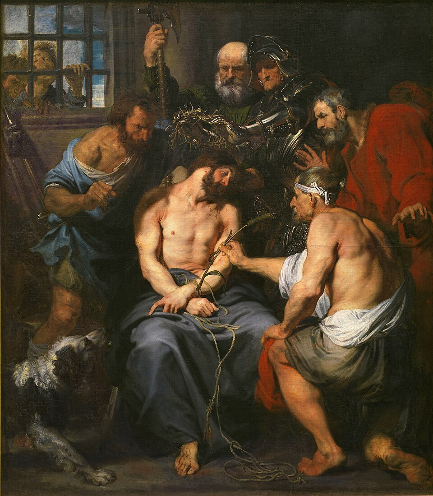
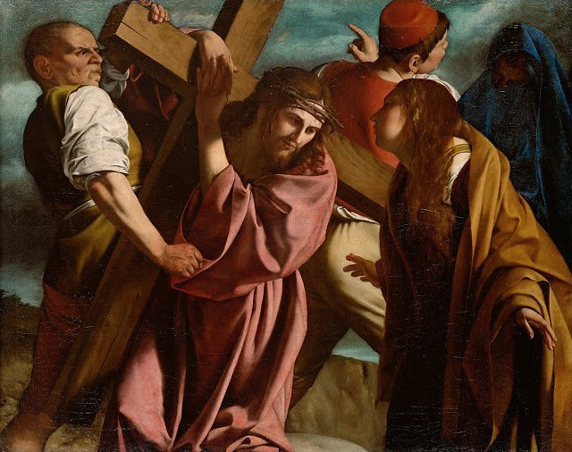
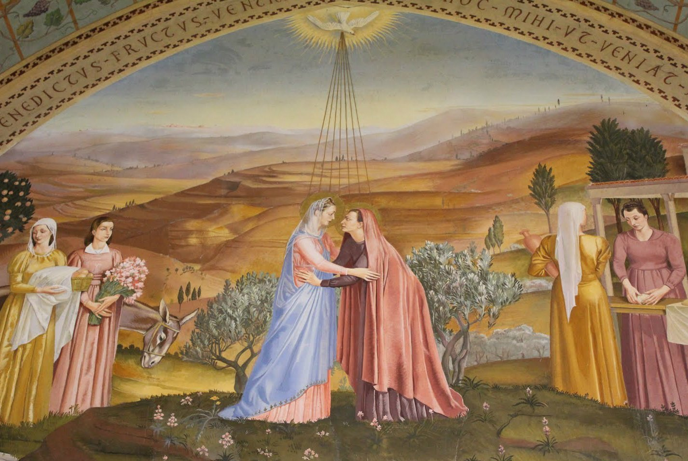

<!-- START doctoc generated TOC please keep comment here to allow auto update -->

<!-- DON'T EDIT THIS SECTION, INSTEAD RE-RUN doctoc TO UPDATE -->

**Table of Contents** _generated with [DocToc](https://github.com/ktechhub/doctoc)_

<!---toc start-->

- [September 2025](#september-2025)
  - [September 01, 2025](#september-01-2025)
    - [The Sorrowful Mysteries - Day 244](#the-sorrowful-mysteries---day-244)
    - [AI-Generated Summary: The Strength Found in Sorrow](#ai-generated-summary-the-strength-found-in-sorrow)
    - [Vicente Masip's 1550 oil painting at the Prado depicts Christ praying in Gethsemane as angels bring the chalice and apostles sleep](#vicente-masips-1550-oil-painting-at-the-prado-depicts-christ-praying-in-gethsemane-as-angels-bring-the-chalice-and-apostles-sleep)
    - [Bouguereau's 1880 oil painting depicts Christ's brutal scourging at the pillar with divine resignation, located in La Rochelle Cathedral](#bouguereaus-1880-oil-painting-depicts-christs-brutal-scourging-at-the-pillar-with-divine-resignation-located-in-la-rochelle-cathedral)
    - [Van Dyck's 1620 Baroque masterpiece in Madrid's Prado Museum depicts Christ's paradoxical coronation with thorns](#van-dycks-1620-baroque-masterpiece-in-madrids-prado-museum-depicts-christs-paradoxical-coronation-with-thorns)
  - [September 02, 2025](#september-02-2025)
    - [The Sorrowful and Glorious Mysteries - Day 245](#the-sorrowful-and-glorious-mysteries---day-245)
    - [AI-Generated Summary: On the Final Mysteries](#ai-generated-summary-on-the-final-mysteries)
    - [Orazio Gentileschi's 1605 Baroque oil painting depicts Christ's agonizing journey to Calvary under the heavy wooden cross](#orazio-gentileschis-1605-baroque-oil-painting-depicts-christs-agonizing-journey-to-calvary-under-the-heavy-wooden-cross)
    - [Pietro Gagliardi's 1847-1852 fresco in San Girolamo dei Croati depicts Christ's Crucifixion with the Virgin Mary, John, and Mary Magdalene mourning at the foot of the cross (Stock Image)](#pietro-gagliardis-1847-1852-fresco-in-san-girolamo-dei-croati-depicts-christs-crucifixion-with-the-virgin-mary-john-and-mary-magdalene-mourning-at-the-foot-of-the-cross-stock-image)
    - [Annibale Carracci's 1593 oil painting Resurrection at the Louvre depicts Christ triumphantly emerging from the tomb as Roman soldiers recoil in awe](#annibale-carraccis-1593-oil-painting-resurrection-at-the-louvre-depicts-christ-triumphantly-emerging-from-the-tomb-as-roman-soldiers-recoil-in-awe)
  - [September 03, 2025](#september-03-2025)
    - [The Glorious Mysteries - Day 246](#the-glorious-mysteries---day-246)
    - [AI-Generated Summary: On the Recitation of the Rosary](#ai-generated-summary-on-the-recitation-of-the-rosary)
    - [Christ ascends in a mandorla of light, supported by angels, with the Virgin Mary and astonished apostles below in this 12th-century Byzantine mosaic at St Mark's Basilica](#christ-ascends-in-a-mandorla-of-light-supported-by-angels-with-the-virgin-mary-and-astonished-apostles-below-in-this-12th-century-byzantine-mosaic-at-st-marks-basilica)
    - [Titian's 1546 oil painting Pentecost in Venice depicts the Holy Spirit descending as fire upon Mary and the apostles](#titians-1546-oil-painting-pentecost-in-venice-depicts-the-holy-spirit-descending-as-fire-upon-mary-and-the-apostles)
    - [A 13th-15th century Gothic stained glass window in Burgos Cathedral depicting the Assumption of Mary into heaven, welcomed by Christ (Stock Image)](#a-13th-15th-century-gothic-stained-glass-window-in-burgos-cathedral-depicting-the-assumption-of-mary-into-heaven-welcomed-by-christ-stock-image)
  - [September 04, 2025](#september-04-2025)
    - [The Glorious and Joyful Mysteries - Day 247](#the-glorious-and-joyful-mysteries---day-247)
    - [AI-Generated Summary: On a Certain Kind of Prayer](#ai-generated-summary-on-a-certain-kind-of-prayer)
    - [Giuseppe Borgnis's 18th-century Baroque fresco depicts the Virgin Mary's coronation as Queen of Heaven by the Holy Trinity (Stock Image)](#giuseppe-borgniss-18th-century-baroque-fresco-depicts-the-virgin-marys-coronation-as-queen-of-heaven-by-the-holy-trinity-stock-image)
    - [Jan van Eyck's 1434-1436 oil panel The Annunciation depicts Gabriel's divine message to the Virgin Mary, housed in Washington DC's National Gallery of Art](#jan-van-eycks-1434-1436-oil-panel-the-annunciation-depicts-gabriels-divine-message-to-the-virgin-mary-housed-in-washington-dcs-national-gallery-of-art)
    - [The Visitation depicts Mary and Elizabeth's sacred encounter, their unborn children recognizing God's divine work within them](#the-visitation-depicts-mary-and-elizabeths-sacred-encounter-their-unborn-children-recognizing-gods-divine-work-within-them)

<!---toc end-->

<!-- END doctoc generated TOC please keep comment here to allow auto update -->

<!-- toc -->

<!-- tocstop -->

# September 2025

RIAY September 2025

## September 01, 2025

### The Sorrowful Mysteries - Day 244

### AI-Generated Summary: The Strength Found in Sorrow

To pray but a single decade is a good thing, yet to pray three is to build a muscle of the soul, strengthening the will for a slower, deeper attention. This is the work of the first Sorrowful Mysteries: the Agony in the Garden, where a perfect will submitted to a bitter cup; the Scourging at the Pillar, where Love itself was torn by the whip; and the Crowning with Thorns, wherein the true King wore a crown of mockery. It is a hard road, this contemplation of suffering, but it is a transformative journey, one that offers not mere sentiment, but the very grace that is our salvation.

### Vicente Masip's 1550 oil painting at the Prado depicts Christ praying in Gethsemane as angels bring the chalice and apostles sleep

### Bouguereau's 1880 oil painting depicts Christ's brutal scourging at the pillar with divine resignation, located in La Rochelle Cathedral

### Van Dyck's 1620 Baroque masterpiece in Madrid's Prado Museum depicts Christ's paradoxical coronation with thorns

## September 02, 2025

### The Sorrowful and Glorious Mysteries - Day 245

### AI-Generated Summary: On the Final Mysteries

We are asked to consider the last steps of the great drama: the heavy weight of the Cross borne up the hill, the final anguish of the Crucifixion itself, and the quiet that followed. This is the depth of sorrow, the price paid. But the tale does not end in that silence. For the first Glorious Mystery shatters it, turning our minds from the tomb’s seal to its glorious emptiness, from the ultimate sacrifice to the ultimate victory. It is the reversal of all death, the first bright chapter in the story that changes everything.

### Orazio Gentileschi's 1605 Baroque oil painting depicts Christ's agonizing journey to Calvary under the heavy wooden cross

### Pietro Gagliardi's 1847-1852 fresco in San Girolamo dei Croati depicts Christ's Crucifixion with the Virgin Mary, John, and Mary Magdalene mourning at the foot of the cross (Stock Image)

### Annibale Carracci's 1593 oil painting Resurrection at the Louvre depicts Christ triumphantly emerging from the tomb as Roman soldiers recoil in awe

## September 03, 2025

### The Glorious Mysteries - Day 246

### AI-Generated Summary: On the Recitation of the Rosary

One finds, in these texts, a common thread not of narrative or description, but of petition and praise. They are not accounts of events to be summarized, but rather the very substance of devotion itself—the repeated and heartfelt prayers of the faithful. The Hail Mary, the Our Father, the Glory Be; these are the well-worn paths upon which the soul travels, not to learn a new thing, but to be reminded of an eternal one. It is the act of turning the mind, again and again, to the sacred mysteries—the Ascension, the Descent of the Holy Spirit, the Assumption—even when the artwork that might illustrate them remains unseen. The value lies not in the novelty of the words, but in the steadfastness of the heart that speaks them. It is a practice wherein the repetition is not emptiness, but a deepening, like a stream that wears away stone not by force, but by constancy.

### Christ ascends in a mandorla of light, supported by angels, with the Virgin Mary and astonished apostles below in this 12th-century Byzantine mosaic at St Mark's Basilica

### Titian's 1546 oil painting Pentecost in Venice depicts the Holy Spirit descending as fire upon Mary and the apostles

### A 13th-15th century Gothic stained glass window in Burgos Cathedral depicting the Assumption of Mary into heaven, welcomed by Christ (Stock Image)

## September 04, 2025

### The Glorious and Joyful Mysteries - Day 247

### AI-Generated Summary: On a Certain Kind of Prayer

We are told of a soul at its prayers, moving through the sacred pattern of the Glorious and Joyful Mysteries. It first contemplates that final and most glorious truth: the Coronation of our Lady as Queen of Heaven. From that height, it turns back to the beginning of joy, to the Annunciation—that great disturbance of the universe where a Virgin is saluted and consents—and then to the Visitation, where blessing is carried from one house to another and joy leaps in the womb.

The rest, as you have found, is not a tale to be summarized but a practice to be performed; the well-worn paths of the _Hail Mary_ and the _Our Father_, which are not the window through which we look at the landscape, but the very footsteps of the walker upon the road itself.

### Giuseppe Borgnis's 18th-century Baroque fresco depicts the Virgin Mary's coronation as Queen of Heaven by the Holy Trinity (Stock Image)

### Jan van Eyck's 1434-1436 oil panel The Annunciation depicts Gabriel's divine message to the Virgin Mary, housed in Washington DC's National Gallery of Art

### The Visitation depicts Mary and Elizabeth's sacred encounter, their unborn children recognizing God's divine work within them

